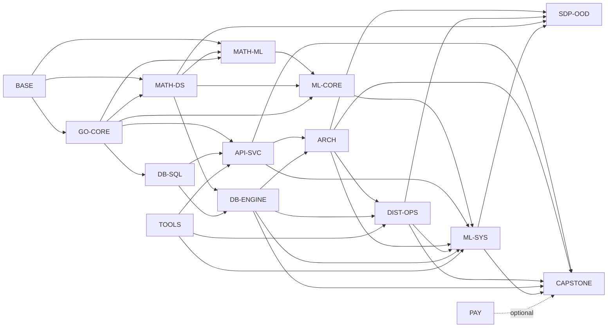

# Nasiko Go Control Plane — Master Curriculum

Single syllabus of record for this course. Every unique topic from the source files lives here once. The knowledge graph in §0 is the teaching order; later sections define node details, labs, specs, and traceability.

Teaching brief: `nasiko-instructions.md`.

This is not the full ML/LLM/DSP course (`curriculum.md`), but production ML-system design is now in scope for this Go control-plane course because the router, retrieval, ranking, evaluation, and operations paths depend on it.

## How to read this file

| Tag | Meaning |
|---|---|
| `CORE` | Destination topics |
| `PREREQ` | Taught first, because CORE depends on them |
| `TOOL` | Platforms and libraries, taught with the matching slice |
| `ARCHIVE` | Kept so nothing is lost; not taught unless a real CORE dependency appears |

Source keys: `GO` go-topics, `SD` sdesign + donnemartin primer, `BP` reconstruction blueprint, `META` course meta prompt, `AN` packed analysis, `PAY` payments addendum, `RULE` nasigo-rules / engine / exercise-rule, `DB` PostgreSQL internals attachment, `ROAD` roadmap.sh backend / system-design / PostgreSQL DBA roadmaps, `OSS` open-source architecture repos, `IND` serious industry architecture writeups, `CUR` selective math/ML/CS inventory from `curriculum.md`, `MLCASE` Engineer1999/A-Curated-List-of-ML-System-Design-Case-Studies plus fetched linked articles.

A lesson cites a knowledge-graph node from §0, plus the Go module, phase, or spec ID that owns the implementation detail. Reconstruction work cites a phase from §6 and spec IDs from §7. Algorithms/DS cite §0/§2, §2b, or the Nasiko bibliography below.

## Nasiko bibliography `CORE`

Ivy-league / OCW spines for algorithms, data structures, and discrete math. Teach from these; do not invent extra chapter numbers.

- *Algorithms*, 4th ed. — Sedgewick & Wayne (Princeton COS 226 / [algs4.cs.princeton.edu](https://algs4.cs.princeton.edu/)): Ch. 1 fundamentals (union-find, bags/stacks/queues, analysis); Ch. 2 sorting; Ch. 3 searching (BST, red-black, hash ST); Ch. 4 graphs (undirected/directed, MST, shortest paths); Ch. 5 strings (sorts, tries, substring, compression); Ch. 6 context (reductions, maxflow as residual).
- MIT 6.042J / 6.1200J *Mathematics for Computer Science* (OCW): proofs, sets, relations, induction, recurrences, graphs, counting, discrete probability, modular arithmetic, state machines, asymptotics.
- MIT 6.006 *Introduction to Algorithms* (OCW): peak finding, sorting, heaps, BST, hashing, BFS/DFS, Dijkstra, Bellman-Ford, DP (knapsack, alignment), complexity.
- MIT 6.046 *Design and Analysis of Algorithms*: amortized analysis, max flow, NP and what to do — residual §2b unless a Nasiko/contest item needs it.
- Stanford CS161 / Tim Roughgarden *Algorithms Illuminated* I–III (IV for NP): divide-and-conquer, Master theorem, randomized; graphs and DS; greedy, MST, Huffman, DP; APSP and NP.
- Harvard CS124; CLRS (*Introduction to Algorithms*, Cormen et al.) as the reference encyclopedia (cite chapters; do not duplicate a second full ToC here).
- Contest practice: LeetCode / HackerRank / HackerEarth **hard** — implement the DS/algo in Go first, then the platform problem, using only unlocked syntax.
- Database systems spine (`DB`): PostgreSQL official docs and source-code comments; CMU 15-445/645 Database Systems; Berkeley CS186; *Database System Concepts* (Silberschatz/Korth/Sudarshan); *Readings in Database Systems*; DDIA storage/replication/transactions chapters. Use the supplied PostgreSQL internals curriculum as the topic inventory, but teach each topic at the first Go/system-design point where it explains real behavior.
- Industry architecture spine (`ROAD`, `OSS`, `IND`): roadmap.sh backend/system-design/PostgreSQL DBA as coverage checks; donnemartin primer + ByteByteGo System Design 101 as index support; Microsoft REST API Guidelines for public API quality; AWS Builders' Library, Stripe idempotency, Discord message storage, Figma/Postgres scaling, Netflix/Uber/LinkedIn engineering posts, and mature repos such as Kubernetes, Envoy/Kong/Nginx, etcd, Redis, Kafka/Redpanda, Temporal, CockroachDB, PostgreSQL, Prometheus, Grafana Loki, Jaeger/OpenTelemetry, and MinIO as architecture specimens. Extract constraints, invariants, failures, trade-offs, and implementation labs; do not copy diagrams or prose.
- ML-system spine (`MLCASE`, `CUR`): Engineer1999/A-Curated-List-of-ML-System-Design-Case-Studies is the production case-study atlas: 309 README entries were parsed, 261 linked pages were fetched into the local audit artifact, and inaccessible pages remain represented by their README metadata. Use it for workload families, architecture patterns, model/evaluation choices, and production failure modes. `curriculum.md` is used as a selective prerequisite inventory: pull its M1-M40 math/statistics/numerical spine directly into `MATH-ML`, and pull its DSP/CV/NLP/ASR/Kaldi/GCP-PMLE topics only when a router, multimodal, speech, or production-ML case study needs them. Supporting academic spines: Khan Academy/OpenStax arithmetic through precalculus; MIT 18.06/18.065 linear algebra; MIT 18.01/18.02 calculus; MIT 6.041/18.05 probability and statistics; Stanford CS229 / Berkeley CS189 ML; CS224N/CS231n only for NLP/CV slices that the case studies require. Implement learning labs in Go first; third-party Go math/ML packages are allowed only after the from-scratch version is understood.

---

# 0. Knowledge graph and graph-ordered curriculum `CORE`

This section is the rebuilt curriculum. It is dependency-first and deduped: each concept has one canonical owner node. Later appearances are application edges, revision edges, or capstone edges, not second introductions.

## 0.1 Edge types and ownership rules

| Edge | Meaning | Teaching rule |
|---|---|---|
| `requires` | B cannot be learned honestly before A | Teach A first, with the full difficulty ramp |
| `strengthens` | A makes B easier, deeper, or more concrete | Briefly connect B back to A; do not reteach A |
| `implements` | B is the hands-on implementation of A | Teach B as the lab for A |
| `contrasts` | A and B answer similar forces differently | Compare with a trade-off table after both are unlocked |
| `revises` | B uses A for spaced repetition | Name A as revision; spend at most five minutes unless the learner fails the check |

If a topic appears in multiple sections, the first owner in §0.2 teaches it. All other sections must say “uses” or “revises” and point to the owner node. This is the anti-repetition rule.

## 0.2 Canonical node owners

| Node | Owns these concepts | Strong links |
|---|---|---|
| `BASE` Computing baseline | hardware, files, processes, terminal, Git, HTTP vocabulary, JSON, editor/debugger, zero-level programming vocabulary | requires none; strengthens every later node |
| `GO-CORE` Go syntax and runtime | G0-G20 syntax unlocks, errors, tests, concurrency, HTTP, gRPC, profiling, deployment | implements DS, DB toy engines, tools, and capstone services |
| `MATH-DS` Discrete math, DS, algorithms | proofs, induction, complexity, arrays, stacks, queues, maps, trees, heaps, graphs, sorting, DP, tries, hard contest practice | strengthens DB indexes/planner, routing, caching, rate limiting, service discovery |
| `MATH-ML` Mathematics for ML systems | arithmetic fluency, ratios/percentages/units, algebra, functions, logarithms/exponents, coordinate geometry, trigonometry only as needed, linear algebra, calculus, probability, statistics, optimization, information theory, numerical methods, spectral/transform basics, causal and RL math | requires BASE and MATH-DS basics; strengthens ML-CORE, ML-SYS, capacity planning, experimentation, and model evaluation |
| `DB-SQL` Relational model and SQL | relational algebra, SQL DDL/DML, joins, bag/set semantics, NULL/3VL, constraints, transactions, query shape | requires GO-CORE G1-G2; strengthens API filters, schemas, idempotency, authorization |
| `DB-ENGINE` PostgreSQL internals | catalogs, storage, slotted pages, TOAST, buffer pool, indexes, scans, execution, planner, statistics, MVCC, locks, vacuum, WAL, recovery, replication | requires MATH-DS and DB-SQL; strengthens system design database trade-offs and P10 ops |
| `ML-CORE` Machine-learning theory and algorithms | data/labels/features, supervised/unsupervised/semi-supervised learning, losses, regularization, metrics, validation, regression/classification, trees/ensembles, clustering, anomaly detection, recommender systems, learning to rank, embeddings, neural networks, transformers at architecture level, graph ML, bandits, causal inference | requires GO-CORE, MATH-DS, MATH-ML; implements all algorithmic ML labs in Go before package use |
| `API-SVC` API and service design | REST, gRPC, JSON-RPC, protobuf, API gateway, auth, contracts, pagination, idempotency, error model | requires GO-CORE G11-G15 and DB-SQL; implements P3/P8/P9 |
| `ARCH` HLD/LLD and architecture | C4/Mermaid HLD, LLD, DDD boundaries, clean architecture, microservices, service discovery, sync/async, patterns | requires API-SVC and system-design basics; strengthens all SDP/OOD/P-phase labs |
| `DIST-OPS` Distributed systems and operations | CAP, consistency, queues, caches, replication, backpressure, retries, circuit breakers, bulkheads, observability, SLOs, incident response, release engineering | requires API-SVC, DB-ENGINE, ARCH; implements P7/P10 |
| `ML-SYS` Production ML-system design | ML product framing, data contracts, labeling, feature stores, batch/streaming pipelines, train/serve skew, model serving, model registry, offline/online evaluation, A/B tests, shadow/canary release, drift monitoring, responsible AI, human-in-loop actioning, cost/latency budgets, ML case-study synthesis | requires ML-CORE, API-SVC, ARCH, DB-SQL/DB-ENGINE, DIST-OPS; strengthens P5 router, P10 production, and SDP ML designs |
| `TOOLS` Platforms and clients | Docker, Compose, BuildKit, Kubernetes, Helm, Terraform, Kong/Nginx, MongoDB, Redis, Postgres, pgvector/Qdrant, OpenTelemetry, Cobra/Viper, Gonum, Go ML/runtime adapters, LLM APIs, Ollama | taught on first use, never as detached tool trivia |
| `SDP-OOD` Design-problem practice | primer SDP/OOD problems and additional system-design questions | uses ARCH, DIST-OPS, MATH-DS, DB-ENGINE, and ML-SYS where the prompt is ML-shaped; coursework, not capstone |
| `CAPSTONE` Nasiko reconstruction | P0-P10, API/JOB/SCHEMA/PROTO specs, final control plane | requires all owner nodes that a phase touches |
| `PAY` Payments addendum | payment domain, idempotent charges, webhooks, ledger, refunds, reconciliation, regional rails | optional; requires DB-SQL, DB-ENGINE DB-9, API-SVC, DIST-OPS |

## 0.3 Strong dependency graph

Complementary links to exploit for speed:

- Hash maps -> hash indexes -> Redis key design -> idempotency-key stores.
- Trees -> B-Trees -> index scans -> keyset pagination -> query latency budgets.
- Tries/inverted indexes -> GIN -> AgentCard search -> router shortlist quality.
- Sorting/heaps/top-k -> external sort -> merge/hash joins -> ranking and trending systems.
- Goroutines/channels/mutexes -> buffer pins/refcounts -> worker pools -> backpressure.
- Deadlocks in Go -> database wait-for graphs -> Redis consumer races -> incident drills.
- WAL/replay -> outbox/event sourcing -> rollback/restore -> production data-loss budgets.
- HTTP/gRPC/JSON-RPC -> gateway/routing -> service discovery -> API contracts.
- CAP/consistency -> MVCC/isolation -> sagas/CQRS -> multi-service transaction choices.
- Observability -> query plans -> traces -> SLO burn alerts -> operational readiness.
- Ratios/functions/logs -> calibration curves -> ranking scores -> business metric trade-offs.
- Vectors/matrices -> embeddings -> ANN/vector stores -> router and recommendation retrieval.
- Probability/statistics -> offline evaluation -> A/B tests -> SLO/error-budget decisions.
- Gradient descent/optimization -> model training -> constrained scheduling/ranking -> cost-aware serving.
- Graph theory -> social/entity graphs -> graph anomaly detection -> fraud and trust pipelines.
- Queues/streams -> feature freshness -> online inference -> drift and backfill incident drills.

## 0.4 Graph-ordered teaching stages

Teach in this order. A stage may include several vertical slices, but a concept is introduced only once at its owner node.

| Stage | Owner nodes | What is taught once | Hands-on output |
|---|---|---|---|
| S0 Setup and mental model | `BASE`, `GO-CORE` G0 | computer/process/file/terminal/Git/editor; Go toolchain; how this course uses graph nodes | repo/dev loop; first `go test` |
| S1 Programming foundations | `GO-CORE` G1-G2, `MATH-DS` basics | variables, control flow, arrays/slices/maps/functions/errors/strings; induction; arrays/stacks/queues/hash-map-as-client | tested Go functions; array/stack/queue/window hard practice when unlocked |
| S2 Types, memory, and core data structures | `GO-CORE` G3, `MATH-DS` | pointers, structs, methods, interfaces, generics; linked lists, trees, heaps, union-find, hash tables from scratch | reusable DS packages; OOD-1/OOD-2 foundations |
| S3 Files, encodings, and storage-shaped thinking | `GO-CORE` G4-G5, `DB-ENGINE` DB-4 preview | IO, paths, templates, regex, time, config, logging; binary layout; slotted pages; WAL record shape | file/CLI tools; slotted-page package; AgentCard parser |
| S4 Concurrency and queues | `GO-CORE` G6-G7/G10, `DIST-OPS` queue basics | goroutines, channels, worker pools, mutexes, atomics, conditions, race detector, deadlocks; bounded queues | worker-pool lab; Redis stream mental model; wait-for graph toy lab |
| S5 Algorithms for performance | `MATH-DS`, `GO-CORE` G8-G9 | sorting, binary search, heaps, greedy, MST, complexity, tests/benchmarks, DP; top-k and external merge sort | benchmarked sort/top-k/rate-limiter/cache labs; hard algorithm practice |
| S6 Mathematics for ML and data science | `MATH-ML`, `MATH-DS`, `GO-CORE` G9 | arithmetic fluency, units, ratios, percentages, algebra, functions, logs/exponents, coordinate geometry, vectors, matrices, norms, dot products, derivatives, gradients, probability, distributions, sampling, estimation, hypothesis tests, confidence intervals, entropy/KL, convexity, gradient descent, finite differences, interpolation, numerical integration, transform/spectral basics when needed | Go math workbook: vectors/matrices/stats/random variables/gradient descent/linear regression/numerical-methods kernels from scratch |
| S7 ML algorithms from scratch | `ML-CORE`, `MATH-ML` | data/labels/features, train/validation/test, leakage, metrics, loss, regularization, kNN, linear/logistic regression, trees, ensembles, naive Bayes, clustering, anomaly detection, matrix factorization, embeddings, neural-network blocks, attention blocks, ranking losses, bandits, causal estimators | Go packages for preprocessing, metrics, models, recommender/ranker, ANN toy index, tiny tensor/attention lab, bandit simulator, causal estimator; no Python fallback |
| S8 Networked APIs and SQL correctness | `GO-CORE` G11-G12, `DB-SQL`, `API-SVC` REST | HTTP/TLS, REST, middleware, auth primitives; relational algebra, SQL, constraints, transactions, pagination, idempotency | REST API slice backed by Postgres teaching schema; SQL correctness transcript |
| S9 Database engine internals | `DB-ENGINE` DB-2-DB-10 | catalogs/types, query transformation, storage, buffer pool, access methods, scans, execution, planner, MVCC, locks, vacuum, WAL, replication, PITR | Postgres `EXPLAIN` labs; B-Tree/inverted-index/executor/MVCC/WAL Go labs; backup/restore drill |
| S10 RPC, protocols, and service contracts | `API-SVC`, `GO-CORE` G13-G15 | protobuf, gRPC, streaming, metadata, JSON-RPC, schema evolution, contract testing, Mongo/NoSQL trade-offs | gRPC + JSON-RPC services; contract tests; schema evolution exercise |
| S11 Architecture, distributed ops, and ML-system design | `ARCH`, `DIST-OPS`, `ML-SYS`, `SDP-OOD` | HLD/LLD, DDD, clean architecture, microservices, discovery, gateway, caches, queues, CAP, availability, resilience, patterns; ML product framing, feature/data contracts, training/serving split, offline/online evaluation, experimentation, drift, human-in-loop, model governance | every SDP/OOD lab; MLCASE rotations; Mermaid HLD; LLD/API/schema/state diagrams; Go/SQL model service; shadow/canary and production failure drill |
| S12 Tools and platform mastery | `TOOLS`, `DIST-OPS`, `ML-SYS` | Docker, Compose, BuildKit, Kubernetes, Helm, Terraform, Kong/Nginx, MongoDB, Redis, Postgres ops, OpenTelemetry, Cobra/Viper, vector store, LLM APIs, Go numerical/ML packages when justified | each tool lab tied to first project use; feature store/model registry/evaluator labs; no tool-only sightseeing |
| S13 Nasiko capstone reconstruction | `CAPSTONE` P0-P10 | implement the Go control plane after prerequisites are complete, including ML router evaluation and production guardrails | upload -> build -> deploy -> register -> route -> chat -> traces -> CLI -> staging/prod drill |
| S14 Optional specialization and interview closure | `PAY`, `SDP-OOD`, `DIST-OPS`, `ML-SYS` | payments if needed; ML-system interview synthesis; final hard platform problems | payment slice or ML-system design portfolio; ORR packet |

## 0.5 Anti-repetition ledger

| Concept family | Canonical owner | Later sections may only... |
|---|---|---|
| Go syntax/runtime | §2 / `GO-CORE` | reference the unlocked module |
| DS/algo/discrete math | §2 + §2b / `MATH-DS` | use as revision or implementation substrate |
| ML mathematics | §2c / `MATH-ML` | recall only the prerequisite fact needed by a model or system lab |
| ML algorithms and evaluation | §2c / `ML-CORE` | use in router, case-study, and architecture labs after the from-scratch Go implementation exists |
| SQL semantics | §2 G12 + G12b / `DB-SQL` | apply to schemas, APIs, and design problems |
| PostgreSQL internals | §2 G12b / `DB-ENGINE` | map to system-design and P-phase consequences |
| HLD/LLD/microservices/patterns | §5e / `ARCH` | instantiate in SDP/OOD and P0-P10 |
| Production ML systems and case studies | §5a-ML / `ML-SYS` | instantiate as case-study rotations and Nasiko router decisions; do not retell the ML algorithm lesson |
| Distributed operations/resilience | §5 + §9 / `DIST-OPS` | apply in service slices and ORR |
| Tool syntax and commands | §4 / `TOOLS` | teach at first use, then assume unlocked |
| Nasiko API/schema/job details | §7 / `CAPSTONE` | implement during P0-P10 only |

---

# 1. Outcome and inventory

**Outcome.** From zero programming knowledge to implementing and operating a Go control plane (gateway, backend, LLM router + vector search, registry, chat-history, orchestrator/worker, CLI, sample A2A agents), understanding and tuning PostgreSQL-backed data systems from relational algebra down to WAL/MVCC/index internals, designing industry-grade HLD/LLD/microservice architectures, implementing production ML-system patterns from real company case studies, **and** implementing standard algorithms, data structures, math primitives, and ML algorithms in Go well enough to solve **hard** problems on LeetCode, HackerRank, HackerEarth, and similar. DS/algo, ML, database-systems, and system-design labs are coursework, not the Nasiko capstone.

**Setup (`META`, not assumed)** — a computer that can run Docker; a Unix-like shell or WSL; 16 GB RAM recommended for Compose + a small cluster; disk for images; VS Code or equivalent; Git; a browser. Cloud accounts (AWS and/or DigitalOcean) only when Terraform labs start.

**Target services (`BP`, `META`)**

- API gateway (Kong or Nginx) with custom plugins
- Backend API (Go HTTP: handlers, services, repositories)
- Auth service (JWT issue/validate, users, access rules; backend and CLI call it)
- Router (embeddings, shortlist/rerank, LLM structured selection)
- Registry (Docker/K8s discovery + Kong config)
- Chat history (JSON-RPC ingest + query)
- Orchestrator + build worker (Redis streams, BuildKit, deploy)
- CLI (Cobra/Viper)
- Sample agents (JSON-RPC 2.0 / A2A, AgentCard, tool calling)
- Web UI (compose service only — talks HTTP to the backend; no frontend course; `ARCHIVE` as implementation)

**Stores and infra:** MongoDB; Redis streams/cache; Postgres (Kong plus SQL/database-systems labs; optional auth/audit relational slice when it reduces ambiguity); object storage + container registry (ECR/DOCR); BuildKit, Docker, Kubernetes, Terraform.

**Go module mapping**

| Go tree | Legacy Python |
|---|---|
| `go-backend/` | `app/` |
| `go-auth/` | auth service used by `app/pkg/auth` + CLI + superuser |
| `go-router/` | `agent-gateway/router/` |
| `go-registry/` | `agent-gateway/registry/` |
| `go-chat-history/` | `agent-gateway/chat-history-service/` |
| `go-orchestrator/` | `orchestrator/` + `worker/` |
| `go-cli/` | `cli/` |
| `go-agents/` | `agents/` + templates |
| `infra/` | compose, `k8s/`, `terraform/`, Kong |

**End-to-end flow**

1. Upload agent (CLI or API) → registry → build request on Redis stream
2. Orchestrator consumes stream → image build → Docker/K8s deploy
3. Registry discovers the agent → Kong services/routes/plugins
4. Router: query → embeddings → shortlist → LLM picks agent
5. Gateway routes to agent → chat logged → traces emitted

---

# 2. Concept node details: Go, DS/algo, database internals, and ML systems `CORE`

Source: `go-topics.md`, the Nasiko bibliography, the `DB` inventory, and the `MLCASE` atlas. This section defines the canonical details for `GO-CORE`, `MATH-DS`, `MATH-ML`, `DB-SQL`, `DB-ENGINE`, `ML-CORE`, and `ML-SYS`. Teach them in the graph order from §0.4; do not treat this section as a second linear syllabus. Named syntax under each Go module is the unlock list. Do not use an item before its module.

### G0 Orientation and tooling `PREREQ` (Udemy 1–2)

Git, GitHub, SSH. VS Code / editor, extensions. Install Go (Linux/Windows/Mac). Go Playground. `GOROOT`/`GOPATH`/`GOMOD`. `go env`, `go version`. Formatting: vertical openness between distinct ideas, vertical density for related lines, hierarchical indentation.

### G1 Foundations I `CORE` (Udemy 3)

Program layout (`main` package, `func main`). Data types, variables, naming conventions, constants, arithmetic. Control flow: for loops (`for`), `break`/`continue`, `if`/`else`, `switch`. Arrays, blank identifier.

**DS/algo (COS 226 / 6.006 / contest).** 1D arrays, two pointers, prefix sums. Implement in Go; then hard array problems (unlocked syntax only). Discrete math: indexed sequences. Nasiko: byte buffers.

### G2 Foundations II `CORE` (Udemy 3–4)

Slices, maps, `range`. Functions: multiple return, variadic, `defer`, `panic`, `recover`, `init`, closures, recursion. Errors, custom errors. Strings, runes, `fmt`, formatting verbs, string functions, string formatting.

Built-ins that unlock here or in G1: `len`, `cap`, `make`, `append`, `copy`, `delete`, `new`, `panic`, `recover`. Operators `:=`, `*`, `&` unlock with pointers in G3 if not already needed for `make`/`new`.

**DS/algo.** Stacks, queues, deques, bags (algs4 1.3) on slices; sliding window; recursion/backtracking. Hash table as `map` client first. Discrete math: induction on list length. Nasiko: request buffers. Contest: stack/queue/window **hard**.

### G3 Types, interfaces, generics `CORE` (Udemy 4–5)

Pointers. Structs, methods, interfaces, struct embedding, struct tags. Generics. Type conversions.

**DS/algo.** Singly/doubly linked lists; binary trees; BST and balanced BST (red-black, algs4 3.3); binary heap / priority queue; union-find (algs4 1.5; weighted + path compression); hash ST from scratch (chaining and open addressing) — feeds OOD-1. Discrete math: trees as acyclic connected graphs; amortized analysis of union-find (undergraduate depth). Database bridge: model tuples, tuple IDs, catalog rows, and B-Tree node structs before the storage/index labs. Nasiko: registry lookup, timeout heaps. Contest: LL/tree/heap/UF **hard**.

### G4 Files, IO, text, time `CORE`

`bufio`; read/write files; line filters; paths; directories; temp files; `embed`; `io`. Text templates. Regular expressions. Time, epoch, format/parse.

**DS/algo.** Tries; KMP; rolling hash / Rabin–Karp (algs4 Ch. 5; 6.006 strings). Database bridge: binary file layout, slotted-page encoding/decoding, checksums, and WAL-record serialization as Go IO labs. Nasiko: AgentCard / query tokens (P5). Contest: string **hard**. Suffix arrays wait for §2b.

### G5 CLI, env, config, logging `CORE`

Command line flags, subcommands. Environment variables. Logging. JSON, XML.

### G6 Concurrency I `CORE` (Udemy 5)

Goroutines. Channels: intro, unbuffered, buffered, synchronization, directions, `select`, non-blocking ops, closing. `context`.

**DS/algo.** Channel as concurrent queue; bounded buffer. Nasiko: worker handoff.

### G7 Concurrency II `CORE` (Udemy 6)

Worker pools. Wait groups, mutexes, atomic counters, `RWMutex`, `sync.NewCond`, `sync.Once`, `sync.Pool`. for-select.

### G8 Rate limiting and performance `CORE`

Token bucket, fixed window, leaky bucket. Sorting. Maps to SDP additional: API rate limiter.

**DS/algo.** Insertion, mergesort, quicksort (randomized — CS161), heapsort; binary search and binary search on a predicate; Master theorem / recurrences with mergesort (6.042 + CS161). External merge sort and loser-tree merge as the database sorting lab. Greedy, Huffman, interval scheduling, MST (Kruskal with UF, Prim with heap) — algs4 Ch. 2/4, CS161 part 3. Nasiko: gateway limiter, job scheduling. Contest: sort/search/greedy **hard**.

### G9 Testing, benchmarking, OS, signals, reflection `CORE`

Tests, benchmarks, table tests. OS processes. Signals. Reflection.

**DS/algo.** Asymptotics (big-O, Ω, Θ); loop invariants; proving correctness; empirical timing (algs4 analysis). Dynamic programming: 1D/2D, knapsack, LCS, LIS, alignment (6.006 / CS161 part 3). Discrete probability: hash collisions, randomized quicksort, selectivity estimates, and cache-hit reasoning. Contest: DP **hard** only after this unlock.

### G10 Advanced concurrency `CORE` (Udemy 6)

Concurrency vs parallelism. Race detector. Deadlocks.

### G11 Internet and HTTP/TLS `CORE` (Udemy 7)

URL/URI. Request/response cycle. Frontend/client vs backend/API. HTTP 1/2/3. HTTPS, TLS handshake, mTLS.

**DS/algo.** Graphs: adjacency list, BFS, DFS, topological sort, Dijkstra, Bellman-Ford (algs4 Ch. 4; 6.006). Discrete math: graph definitions before code. Nasiko: service discovery graph (P4). Contest: graph **hard**. 0-1 BFS / APSP wait until here or §2b as needed.

### G12 REST API project `CORE` (Udemy 8)

Routing/mux, methods, path/query params. Middleware: security headers, CORS, response time, compression, rate limiter, HPP, ordering. Postgres-first SQL CRUD: relational model, DDL/DML, schemas, constraints, NULL/3VL, joins, grouping, subqueries, CTEs, transactions, indexes, `EXPLAIN`, query parameters, and injection prevention. Env, modeling, validation, pagination. Argon2 hashing. JWT, cookies, sessions. Password update, forgot/reset. CSRF, XSS sanitization. Code obfuscation. API binary. Benchmarking.

Maps to backend capstone service (Chi/Gin/Fiber + `net/http`).

**DS/algo.** LRU/LFU as cache (OOD-2); consistent hashing (5a); modular arithmetic for hashing (6.042). Database bridge: keyset pagination, covering indexes, and N+1 query detection. Nasiko: HTTP cache, session store. Contest: design **hard**.

### G12b SQL and PostgreSQL internals braid `CORE`

This is where the supplied SQL/PostgreSQL curriculum becomes part of the existing course. It is not a detached DBA bootcamp. Each topic is taught when it gives the learner leverage over code, system design, performance, or operations.

| DB slice | Teach with | Theory depth | Go / SQL hands-on |
|---|---|---|---|
| DB-1 Relational algebra and SQL semantics | G12 + 5a database | Selection, projection, product, joins, semi/anti joins, outer joins, bag vs set semantics, NULL/3VL, `IS DISTINCT FROM` | Implement a tiny relational algebra evaluator over Go slices; translate to SQL; test edge cases with NULL and duplicates in Postgres |
| DB-2 Schema architecture and constraints | P2 contracts + G12 | catalogs (`pg_class`, `pg_attribute`, `pg_type`, namespaces), system columns (`ctid`, `xmin`, `xmax`), primitive/extended types, JSONB, range/UUID, PK/FK/CHECK/DOMAIN, deferred constraints | Design auth/access/audit and registry-like schemas; write migrations; prove invariants with constraint-violation tests |
| DB-3 Query transformation | G12 + P3 API | inlined vs materialized CTEs, recursive CTE working table, window frames, lateral joins | Build API reports using CTEs/windows/lateral joins; compare plans and runtimes with `EXPLAIN (ANALYZE, BUFFERS)` |
| DB-4 Storage engine and page layout | G4 IO + G3 structs | `$PGDATA`, relation forks, 1GB segments, FSM, VM, 8KB page header, line pointers, heap tuple header, TOAST | Implement a slotted-page package in Go with insert/delete/compact/checksum tests; store oversized values out of line |
| DB-5 Buffer pool and flushing | G7 concurrency + P10 ops | shared buffers, buffer descriptors/table, pins/refcounts, clock-sweep, bgwriter, checkpointer | Implement a toy buffer pool with pins and second-chance eviction; benchmark hit ratio under skewed workloads |
| DB-6 Access methods | G3/G8 DS + P5 search | PostgreSQL B-Tree, Lehman-Yao right links/high keys, hash indexes, GIN, GiST/SP-GiST, BRIN, bitmap scans, index-only scans and visibility map | Implement B-Tree search/split tests, an inverted index for AgentCards, and a BRIN-like min/max summary for append-only chat rows |
| DB-7 Execution algorithms | G8/G9 + G12 | Volcano iterator, `work_mem`, external sort, nested-loop/index/hash/merge joins, aggregation and set operators | Implement iterator nodes (`Scan`, `Filter`, `HashJoin`, `Sort`, `HashAggregate`) over in-memory rows; force spill in a temp-dir lab |
| DB-8 Planner, statistics, and cost model | 5a database + P10 performance | parser/analyzer/rewriter/planner pipeline, `pg_statistic`, MCV/histograms/correlation, cost variables, path generation, interesting orders, GEQO, parallel query | Create skewed data, run `ANALYZE`, predict selectivity, compare predicted vs actual rows, tune indexes and `random_page_cost` in a sandbox |
| DB-9 Transactions, MVCC, locks, and vacuum | G6/G7 + G12/P7 | tuple versioning, snapshots, `pg_xact`, isolation levels, SSI, row/table locks, LWLocks vs heavyweight locks, deadlocks, HOT, autovacuum, XID wraparound/freezing | Simulate visibility rules in Go; write concurrent SQL labs for read committed/repeatable read/serializable; build a wait-for graph deadlock detector |
| DB-10 WAL, crash recovery, replication, PITR | G18 + P10 | WAL records, synchronous commit, full-page writes, checkpoints, redo, no-undo recovery, physical streaming replication, WAL archiving, PITR | Write a mini WAL/replay log for the slotted page; run primary/standby locally; measure replica lag; perform backup/restore and PITR drill |

Mastery check for each DB slice: one academic explanation, one SQL transcript, one Go implementation or operational drill, and one Nasiko mapping. Example mappings: DB-1 explains query correctness; DB-4/DB-6 explain why indexes and heap fetches cost what they cost; DB-9 explains idempotent job status writes; DB-10 explains backup/restore and failover in P10.

### G13 Protocol Buffers `CORE` (Udemy 9)

Protocol Buffers (protobuf) proto3: packages, messages, field types and field numbers, enums. Serialize/deserialize. RPC. Versioning and backward compatibility. `protoc`. Best practices.

### G14 gRPC core `CORE` (Udemy 10)

Stubs, services. REST vs gRPC. Server/client. TLS. Streaming (server-side, client-side, bidirectional). Metadata, headers, trailers. Postman / gRPCurl. Protoc Gen Validate.

### G15 gRPC API project `CORE` (Udemy 11)

MongoDB/NoSQL CRUD and relationships. Interceptors: response time, rate limiting, authentication, authorization. TLS. GHZ benchmarking. Combo API (REST + gRPC). Generics helpers.

### G16 Observability and profiling `CORE`

OpenTelemetry. pprof. Tracing. Maps to Phoenix / OTEL exporters in the control plane.

### G17 Security and hardening `CORE`

Argon2, JWT, CSRF, XSS, `govulncheck`. Secrets, least privilege, audit logs, rate limits, SLOs, webhook failure budgets.

### G18 Deployment and releases `CORE`

Docker. Cross-compile. GoReleaser.

### G19 Interview prep `CORE` (Udemy 13)

Concurrency, API design, distributed systems. Uses §5 primer problems **and** hard platform DS/algo problems (unlocked set only) as the interview set.

Udemy sections 12 (Resources), 14 (Course Summary), 15 (Best Wishes) are `ARCHIVE` — not taught.

### G20 Payments addendum `CORE` if the capstone charges money

- PG-1 Domain and compliance (rails vs wallets/UPI; auth/capture/settlement; test vs live; PCI DSS; PII; secrets)
- PG-2 Idempotent charges (`Idempotency-Key`; retries; conflict; request-hash store)
- PG-3 Webhooks (signatures Stripe/Razorpay/PayPal; replay windows; skew; nonces; backoff; DLQ)
- PG-4 Ledger (double-entry; conservation; rounding; property tests; idempotent writes)
- PG-5 Refunds, disputes, reversals (full/partial refunds; chargeback life cycle; evidence; ledger adjustments; state machine)
- PG-6 Reconciliation (nightly compare; mismatch classes; alerts)
- PG-7 Security and operations (SLOs; webhook failure budgets)
- PG-8 Regional notes (UPI/QR, netbanking, wallets; payout timelines; sandbox seeding; provider swap by interface and contract tests)

### §2b Contest and theory remainder `CORE`

Only what has no honest home in a G-module or Nasiko phase. Unlock after G9/G11. Hard platform problems that need these wait here.

- NP-completeness, polynomial reductions, P vs NP; what to do (approximation, heuristic, ILP) — Stanford CS161 part 4 / 6.046 / CLRS NP chapters.
- Max flow / min cut, Ford–Fulkerson / Edmonds–Karp — algs4 Ch. 6; 6.046; Harvard CS124. Use if a primer/contest item needs it.
- Fenwick (BIT), segment tree, sparse table — contest range queries.
- Suffix arrays / suffix automata — algs4 Ch. 6 context; beyond G4 tries/KMP.
- Finite automata and weighted finite-state transducers — only when a text-routing, tokenizer, ASR, or grammar-constrained decoding lab needs them. Implement symbol tables, composition, determinization/minimization intuition, and Viterbi-style shortest path in Go; do not import the full Kaldi/OpenFst course.
- Peak finding (6.006) if not already used as a binary-search lab in G8.
- Heavy 6.046 (Fibonacci heaps, van Emde Boas): implement the **idea** only if a hard problem needs it; not a second graduate course.

Each item: invariant + complexity, Go implementation with tests, then one hard platform problem.

### §2c Mathematics, ML algorithms, and ML-system foundations `CORE`

Canonical owners: `MATH-ML`, `ML-CORE`, and `ML-SYS`. This is the Go-only ML-system path extracted from `MLCASE`, the selected prerequisite spine in `CUR`, and supporting academic sources. It is not a Python notebook track and it is not a paste of the wider ML/LLM/DSP syllabus. Every algorithmic item is implemented from scratch in Go first with tests, synthetic data, metrics, and a short proof or derivation. Go packages such as Gonum, Gorgonia, GoMLX, ONNX Runtime Go bindings, Qdrant/pgvector clients, or Kafka/Redpanda clients may be introduced only after the learner can explain the hand-built version and the reason the package is needed.

Selective import rule from `curriculum.md`: M1-M17 feed arithmetic/algebra/geometry/trig readiness; M19-M22 feed functions, relations, counting, and probability; M26-M27/M39 feed matrix methods, eigenspaces, PCA, and low-rank embeddings; M29-M34 feed calculus, gradients, and differential-equation intuition; M37-M40 feed numerical methods, reproducibility, inference, MLE, Bayesian reasoning, and experiments. M41-M46 are conditional gates: teach only the convolution/FFT/image/audio/tokenizer/attention/production-ML piece required by an `MLCASE`, router, multimodal, or agentic-AI lab.

#### MATH-ML ladder: arithmetic to graduate-level readiness

| Slice | Prerequisites | Theory depth | Go exercise |
|---|---|---|---|
| MML-0 Arithmetic, units, and numerical sense | `BASE` | integers, bases, prime factors, GCD/LCM, fractions, decimals, ratios, percentages, rates, units, scientific notation, approximation, significant figures | Write base converters, unit/rate converters, latency/cost calculators, and feature-normalization checks |
| MML-1 Algebra, relations, and functions | MML-0 | expressions, equations, inequalities, absolute value, polynomials, remainder/factor theorem, exponentials, logarithms, inverse functions, relations, domain/range, composition, monotonicity | Build expression evaluators, relation/function validators, log-scale transforms, and score-calibration tables |
| MML-2 Geometry, coordinates, and measurement | MML-1 | Cartesian coordinates, distance metrics, slope, intersections, similarity, basic trigonometry, conic intuition only when CV/audio/optimization needs it | Implement Euclidean/cosine/Manhattan distance, line intersections, bounding boxes, IoU, and simple image/audio coordinate transforms |
| MML-3 Linear algebra and spectral methods | MML-1 + `MATH-DS` arrays | vectors, matrices, determinants, row operations, dot/cross products, norms, projections, orthogonality, rank, eigenvectors/eigenvalues, Gram-Schmidt, SVD/PCA, low-rank approximation | Implement vector/matrix package, Gaussian elimination, cosine similarity, Gram-Schmidt, power iteration, PCA projection, and ANN brute-force baseline |
| MML-4 Calculus, change, and gradients | MML-1/MML-3 | limits, continuity, derivatives, product/quotient/chain rule, partial derivatives, gradients, Jacobians, Hessian intuition, integrals as accumulated mass, first-order ODE intuition | Implement finite-difference gradient checks, gradient descent, logistic-regression training, numerical integration, Euler/RK4 toy solvers, and learning-rate experiments |
| MML-5 Probability | MML-0 + discrete math counting | events, conditional probability, Bayes, independence, random variables, expectation, variance, Bernoulli/binomial/Poisson/normal/exponential, sampling, convergence intuition | Implement PRNG-backed samplers, Monte Carlo estimates, Bayes classifier toy examples, hash-collision simulations, and convergence visualizers via test tables |
| MML-6 Statistics, inference, and experimental design | MML-5 | estimators, bias/variance, CLT intuition, MLE, Fisher-information intuition, confidence intervals, hypothesis tests, p-values, bootstrap/jackknife, power, multiple testing, A/B tests, CUPED intuition, Bayesian prior/posterior updates | Build metric aggregators, MLE estimators, bootstrap CIs, sequential-test warnings, Bayesian update toys, and an experiment analyzer over event logs |
| MML-7 Optimization and constrained decisions | MML-3/MML-4 | convexity, constraints, Lagrange/KKT intuition, gradient descent/SGD, momentum/adaptive-optimizer intuition, regularization, coordinate descent, linear programming, assignment problem | Implement SGD with L1/L2, coordinate descent for linear models, Hungarian/min-cost assignment for scheduling, constrained ranking, and optimizer diagnostics |
| MML-8 Information theory | MML-5 | entropy, cross-entropy, KL divergence, mutual information, perplexity, calibration, log loss, compression/channel-capacity intuition only where model evaluation needs it | Implement cross-entropy/log-loss, calibration bins, entropy-based splits, perplexity calculator, and model-comparison reports |
| MML-9 Causality, graphs, and decision math | MML-5/MML-6 + G11 graphs | DAGs, confounding, propensity scores, difference-in-differences, uplift modeling, Markov decision processes, contextual bandits, UCB, Thompson sampling | Implement DAG adjustment checks, inverse-propensity weighting, uplift metrics, epsilon-greedy/UCB/Thompson bandits |
| MML-10 Numerical computing and reproducibility | G9 + MML-3/MML-5 | floating-point error, overflow/underflow, stable softmax/logsumexp, PRNG seeding, deterministic tests, interpolation, finite differences, curve fitting, numerical differentiation/integration, error propagation, vectorized thinking without hiding loops | Build stable math helpers, reproducible train/test splits, interpolation/curve-fit kernels, benchmark naive vs optimized loops, and compare with Gonum |
| MML-11 Signal, image, and sequence math gates | MML-2/MML-3/MML-4/MML-8 | convolution, correlation, sampling/aliasing, DFT/FFT intuition, windowing/STFT, spectrogram/MFCC intuition, 2D convolution, morphology, tokenizer/sequence probability, automata prerequisites | Implement 1D/2D convolution, small DFT, spectral-feature extractor, Sobel/morphology filters, n-gram perplexity, and finite-state tokenizer exercises in Go |
| MML-12 Graduate rigor ceiling | MML-3/MML-4/MML-6/MML-7 | proof habits, metric/convergence intuition, compactness/continuity only as needed, generalization vs optimization distinction, stability/conditioning, approximation error | Write short correctness/convergence notes beside Go labs; test numerical conditioning, approximation error, and stability failures |

#### ML-CORE algorithm spine

| Slice | Concepts | Go-from-scratch implementation |
|---|---|---|
| ML-1 Problem framing and data contracts | prediction vs ranking vs retrieval vs generation vs optimization; labels; leakage; delayed labels; class imbalance; cold start; feedback loops | Case-study parser that converts a product description into target, input entities, label, metric, and failure mode |
| ML-2 Feature engineering | numeric/categorical/text/time/window/session/graph features; normalization; hashing trick; missing values; train/serve parity | Feature pipeline package with schema validation, transformations, and golden tests against event fixtures |
| ML-3 Evaluation | train/validation/test, cross-validation, confusion matrix, precision/recall/F1, ROC/PR-AUC, calibration, ranking metrics (MAP/NDCG/MRR), forecast errors, business guardrail metrics | Metrics library plus evaluator CLI for classification, ranking, retrieval, forecasting, and LLM outputs |
| ML-4 Classical supervised models | kNN, linear regression, logistic regression, naive Bayes, LDA/QDA intuition, SVM/margin intuition, GLM idea, regularization, class weights | Train/predict APIs with tests, gradient checks, and benchmarked inference path |
| ML-5 Trees and ensembles | decision trees, impurity, random forests, gradient boosting at concept level, feature importance, monotonic constraints | Implement a CART-style tree and simple boosted stumps; compare bias/variance and calibration |
| ML-6 Unsupervised, density, and anomaly detection | k-means, DBSCAN intuition, Gaussian/robust statistics, GMM and EM, isolation-forest intuition, reconstruction-error anomaly detection | Implement k-means, robust z-score/MAD detector, GMM-EM toy trainer, reconstruction-error scorer, and fraud-threshold review queue |
| ML-7 Search, retrieval, ranking, and recommendations | inverted indexes, BM25, embeddings, ANN concepts, collaborative filtering, matrix factorization, two-stage retrieval/rerank, learning to rank, diversity/fairness in result sets | Build BM25, item-item CF, matrix factorization, exact k-NN, heap top-k, pairwise ranker, diversity reranker, and router shortlist evaluator |
| ML-8 NLP, LLMs, and RAG | Unicode/normalization, tokenization, edit distance, n-grams, TF-IDF, BM25, embeddings, transformer blocks at architecture level, prompts, context windows, structured outputs, retrieval-augmented generation, prompt injection, safety filters, grammar/automata constraints when useful | Implement tokenizer/TF-IDF/BM25, edit distance, prompt packer, schema-constrained JSON parser, cached LLM gateway, RAG evaluator, injection-resistance tests, and a finite-state constrained-decoding toy |
| ML-9 CV/audio/multimodal essentials | pixels, 2D convolution, image filters, image embeddings, OCR/document extraction, audio frames/windowing/spectrogram/MFCC intuition, multimodal retrieval | Implement image resize/convolution filters, simple embedding adapters, perceptual hash, audio window and spectral features, and multimodal search fixtures; use external model service only when Go cannot train the model reasonably |
| ML-10 Graph ML and entity resolution | graph features, PageRank, random walks, bipartite graphs, label propagation, node/edge anomaly scores, blocking/candidate generation | Implement entity-resolution blocking, PageRank, random-walk embeddings at toy scale, and bipartite anomaly scoring |
| ML-11 Forecasting and decision optimization | moving averages, exponential smoothing, seasonality, AR-style intuition, quantiles, inventory/ETA/demand forecasts, assignment and constrained scheduling | Implement forecast baselines, backtests, quantile errors, LP/assignment scheduler, and ETA confidence intervals |
| ML-12 Bandits, reinforcement learning, and causal inference | exploration/exploitation, contextual bandits, off-policy evaluation, policy constraints, causal graphs, observational bias, uplift | Implement bandit simulator, offline replay evaluator, propensity weighting, uplift ranking, and guardrail metrics |
| ML-13 Responsible, secure, and human-centered ML | privacy, PII minimization, abuse resistance, prompt injection, model bias/fairness, explanation, human-in-loop review, non-destructive/undoable AI actions | Build moderation/fraud review queues, audit logs, consent/retention checks, model-card template, and human override workflow |
| ML-14 Deep-learning primitives when needed | tensors, computational graphs, perceptron/MLP, activations, backprop, regularization, dropout intuition, normalization, optimizers, attention heads, positional encodings, residual connections, decoder masking | Build a tiny tensor type, MLP forward/backward pass, optimizer variants, small self-attention forward pass, masked-softmax test, and inference wrapper in Go |

#### ML-SYS production spine from the case-study corpus

| Slice | Concepts | Go/architecture lab |
|---|---|---|
| MLSYS-1 Product and metric framing | user problem, target action, north-star metric, guardrails, offline proxy vs online metric, launch criteria | Turn any `MLCASE` row into a one-page product spec and metric tree |
| MLSYS-2 Data and feature platform | event contracts, batch vs streaming features, freshness, backfills, point-in-time correctness, feature store, schema evolution | Build a Go feature-store facade over Postgres/Redis with offline/online parity tests |
| MLSYS-3 Training and evaluation pipelines | dataset snapshots, reproducibility, experiment tracking, hyperparameter search, model registry, model cards | Build a local trainer/evaluator CLI that writes model artifacts, metrics, lineage, and approval status |
| MLSYS-4 Serving architecture | online, batch, near-real-time, embedded, sidecar, async inference, cache, fallback, timeout budgets, cost | Serve a Go model behind REST/gRPC with cache, fallback, shadow mode, and latency SLOs |
| MLSYS-5 Experimentation and rollout | A/B tests, holdouts, canary, shadow, ramp, segment analysis, metric guardrails, rollback | Implement assignment bucketing, exposure logs, CUPED-style report, and rollback gate |
| MLSYS-6 Monitoring and drift | input/output drift, calibration drift, data-quality checks, freshness, bad-shortlist rate, alerting, incident response | Add OpenTelemetry metrics/traces, drift detector, data-quality alerts, and runbook drill |
| MLSYS-7 Governance and safety | privacy, compliance, threat modeling, model abuse, prompt injection, human review, auditability, deletion/retention | Add policy checks, red-team tests, reversible actions, audit log, and review dashboard API |
| MLSYS-8 Scale and cost | hot keys, fan-out, approximate retrieval, batching, concurrency limits, GPUs/accelerators as remote services, cloud cost attribution | Build batcher/rate limiter/cache; compare exact vs ANN retrieval; compute cost-per-successful-decision |
| MLSYS-9 Case-study synthesis | Stripe Radar; DoorDash wait time/demand; Airbnb diverse ranking; Etsy/Netflix/Spotify recommenders; GitHub/Honeycomb LLM apps; Grab graph anomaly; LinkedIn causal platform; Uber push optimization; Instacart availability; CV/audio/document systems | For each rotation: source summary -> dependency graph -> tiny Go/SQL faithful model -> evaluation -> production-readiness review |

Case-study rotation rule: do not read 309 articles linearly. Use the parsed `MLCASE` atlas as an index, then choose one representative per cluster until the learner can generalize. A rotation is complete only when the learner can explain the mathematical objective, data flow, architecture, online/offline metrics, failure modes, and Go implementation trade-offs without seeing the source article.

---

# 3. Computing baseline `PREREQ`

Zero-knowledge track (`META`). Thin.

- What a computer, process, and file are. Binary/hex at the level needed for bytes and UTF-8.
- Filesystem paths, permissions, environment.
- Terminal: cwd, pipes, exit codes.
- Git add/commit/branch/diff/PR (deepen in G0 / GitHub `TOOL`).
- HTTP verbs, status codes, headers, JSON.
- Editor, debugger, print-debugging.
- Programming ideas before Go syntax: variable, sequence, branch, loop, function, error, test.
- Data structures: array, list, stack, queue, map, tree, graph — vocabulary here; **implement** in G1–G3 (see blend notes).
- Discrete math (6.042 / 6.1200), same slice as the algorithm that needs it: proofs and induction (before recurrences); sets, functions, relations; counting / permutations for hashing; recurrences and Master theorem with mergesort (G8); discrete probability (hash collisions, randomized quicksort, G9); modular arithmetic (hashing, G12); graph definitions before G11 BFS.
- Complexity (big-O, Ω, Θ) at first analysis (G8–G9), not delayed until SDP.
- OS: process vs thread vs goroutine (with G6).
- Networking: IP, port, DNS (with primer DNS topic and G11).

Mathematics for ML systems lives in `MATH-ML`: middle-school arithmetic and units; algebra, relations, functions, logs/exponents, coordinate geometry; linear algebra and spectral methods; calculus; probability; statistics and inference; optimization; information theory; numerical methods; conditional signal/image/sequence math; causal/RL math when case studies require it. Teach each concept at the first `ML-CORE` or `ML-SYS` use and implement the numerical idea in Go. The broader ML/LLM/DSP course (`curriculum.md`) remains a selective inventory for these owners, not a prerequisite escape hatch.

### 3b Zero-to-hero domain map (`META`)

Folded tracks, not a second spine. Each domain: intro in the cited block, intermediate on the first project use, advanced in the matching P-phase or primer lab.

| Domain | Lives in | Project lab |
|---|---|---|
| Computer science fundamentals | §3, G6, G11 | Process vs goroutine; HTTP request |
| Programming fundamentals | §3, G1–G2, G9 | First tested function |
| Data structures | G1–G4, G8, OOD-1, OOD-2 | From-scratch Go + hard LC/HR/HE |
| Algorithms | G8–G9, G11, P4–P5, §2b | Sort, graph, DP, then residual NP/flow/segtree |
| Discrete mathematics | §3, G3, G8–G9, G11–G12 | Proofs, recurrences, graphs, counting, mod, probability |
| ML mathematics | §0 `MATH-ML`, §2c | Arithmetic-to-graduate math workbook in Go; vectors/matrices/spectral methods/calculus/probability/statistics/optimization/information theory/numerical methods |
| Database systems | §0 `DB-SQL`/`DB-ENGINE`, G12/G12b, §5a-SQL | SQL correctness; slotted page/index/executor/MVCC/WAL labs; Postgres ops drills |
| Machine learning | §0 `ML-CORE`, §2c, §5a-ML | From-scratch Go models; evaluate ranking/retrieval/forecast/fraud/classification labs |
| LLMs | §0 `ML-CORE`/`ML-SYS`, §4 LLM row, ALG-ROUTE, P5/P9 | Structured pick; prompt/context/eval/safety/cost lab |
| Conditional NLP/CV/audio math | §2c MML-11, ML-8, ML-9 | Tokenizer/finite-state, convolution/DFT/STFT, image-filter, spectrogram, and multimodal retrieval gates only when a case study or router needs them |
| MLOps | §0 `ML-SYS`, §5a-ML, P5, P10, §9 | Feature store, model registry, shadow/canary, drift and bad-shortlist monitoring |
| AIOps | G16, P10, §9 | Trace + alert + incident note |
| Orchestration | G6–G8, P7, JOB-* | Stream consumer, idempotent deploy |
| Distributed systems and resilience | §0 `DIST-OPS`, §5a, P7, P10, §9 | Backpressure, retries, idempotency, SLOs, failover |
| System design | §5a | Every SDP |
| HLD | §4 HLD, P0–P10 Deep-Dives | Mermaid for the control plane |
| LLD | §7 `API-*` / `SCHEMA-*` | One service contract |
| Design patterns | §4, §5a | Repository and adapter on backend |
| Software development | G0, G9, G18, §9 | PR, test pyramid, CI |

---

# 4. Tool and platform subcourses `TOOL`

Each row is a subcourse. Teach prereqs from zero, concepts, a lab tied to this project, pitfalls, then a mastery check. Depth = how sophisticated the repo’s use is.

**Branched quests:** when a new tool, data-store mechanism, protocol, ML-system component, or architectural pattern appears (Redis Streams, a Kong plugin, a vector index, Postgres WAL/MVCC, a feature store, model registry, evaluator, outbox, or circuit breaker), pause the main track, finish that row’s lab, then return.

| Subcourse | Project use | Lab / mastery |
|---|---|---|
| Git + GitHub | Repo, PRs, optional GitHub OAuth (`API-GH-*`) | Commit, branch, PR; OAuth login works |
| Docker + Compose + BuildKit | Local stack; agent images; `JOB-ORCH-001` | Compose up; one agent image builds |
| Kubernetes + Helm + client-go | Deploy agents; registry discovery; worker | Apply a chart; list pods via client-go |
| Terraform | EKS and DOKS bootstrap (`META`) | Plan a cluster; no need to apply until P10 |
| Kong + Lua basics + plugins | Gateway routes; `chat-logger` → `/log-chat` | Route + plugin posts a log |
| Nginx | Allowed alternative to Kong (`BP`, flag) | Same route table if Kong is not used |
| MongoDB | Registry, chat, creds, builds, uploads | Indexes exist; CRUD on SCHEMA-REG-001 |
| Redis | Stream `orchestration:commands`; cache | XADD/XREADGROUP round-trip |
| Postgres + pgvector + `psql` | Kong config DB; SQL/database-systems lab DB; optional auth/audit relational slice; possible router vector store | Migrations run; constraints reject bad writes; `EXPLAIN (ANALYZE, BUFFERS)` interpreted; Kong admin persists a service; pgvector k-NN works if selected |
| PostgreSQL ops tools (`pg_stat_statements`, `pgbench`, `pg_dump`, physical backup/PITR lab) | Performance, recovery, and production readiness | Slow query isolated; benchmark recorded; backup restored; replica lag explained |
| OpenTelemetry + Phoenix | Cross-service traces; optional agent inject | One request shows a trace |
| Cobra + Viper | Operator CLI | One group with env overlay |
| mongo-go-driver, go-redis, client-go, Docker Engine API | Service clients | Learning tests at each boundary |
| Vector store: Qdrant or pgvector (prefer when Postgres depth is the current learning goal); FAISS via CGO only if justified | Router | k-NN shortlist returns seeded cards; index choice and recall/latency trade-off explained |
| Go numerical stack: standard library math, `math/rand`, Gonum (`mat`, `stat`, `optimize`) | `MATH-ML` and `ML-CORE` after from-scratch labs | Rebuild vector/matrix/stats/optimization primitives by hand, then compare accuracy, stability, and speed with Gonum |
| Go ML/runtime adapters: Gorgonia/GoMLX when useful; ONNX Runtime Go binding or HTTP model service only when no practical Go-native route exists | `ML-CORE`, `ML-SYS`, P5 router | Keep a Go interface around inference; prove deterministic fallback, timeout, cache, and schema validation |
| Feature/evaluation platform in Go: Postgres snapshots, Redis online features, object storage artifact store, OpenTelemetry metrics | `ML-SYS`, P5, P10 | Feature-store facade, model registry table, evaluator CLI, drift alert, and rollback gate work locally |
| OpenAI-compatible HTTP / official Go SDK | Router + agents; JSON schema structured output | Structured pick parses |
| JSON-RPC 2.0 | Agent protocol + chat logger | `message/send` accepted |
| LLM API usage | Tokens, prompts, tool calling, rate limits, safety | Maps to ALG-ROUTE and agents |
| Ollama | Optional local LLM (`models/`) | 11434 answers when enabled |

Gin / Fiber / Chi + `net/http` for HTTP services. Pydantic equivalent = structs + validation.

### HLD, LLD, and clean architecture `CORE`

Named tracks (`META`). Running example is this control plane. Canonical owner is `ARCH` in §0 and §5e; this subsection only names the architectural vocabulary that tools and phases are allowed to reference.

- **HLD** — service boundaries, C4/Mermaid, data flows, capacity. Teach with primer 5a and every P0–P10 Deep-Dive.
- **LLD** — API contracts (`API-*`), schemas (`SCHEMA-*`), module interfaces (handler -> service -> repository), transaction boundaries, idempotency keys, pagination contracts, error model, concurrency model, and state machines.
- **Clean architecture and DDD** — dependencies point inward; domain language before tables; adapters at Kong, Mongo, Postgres, Redis, LLM, Docker, K8s; repositories hide persistence; application services orchestrate use cases; entities/value objects enforce invariants.
- **Design patterns** — teach only when code needs them: repository, unit of work, adapter, strategy, factory, builder, decorator/middleware, chain of responsibility, observer/pub-sub, mediator, command, state, circuit breaker, bulkhead, retry with jitter, outbox, saga, CQRS/read model, idempotent consumer, strangler fig.

Resilience (teach with 5a + P10, use in every service): retries, timeouts, circuit breakers, bulkheads, idempotency.

---

# 5. System design track `CORE`

Sources (`SD`, `ROAD`, `OSS`, `IND`, `MLCASE`): [donnemartin/system-design-primer](https://github.com/donnemartin/system-design-primer) is the mastery set. Support: roadmap.sh system-design/backend/PostgreSQL DBA roadmaps, Alex Xu Vol 1–2, Kleppmann DDIA, Grokking the System Design Interview, Microsoft REST API Guidelines, AWS Builders' Library, Google SRE materials, official docs for tools in §4, selected mature open-source architectures, production writeups from serious engineering organizations, and Engineer1999's ML system-design case-study corpus.

**Approach (always):** (1) FR/NFR (2) capacity (3) HLD + Mermaid (4) LLD, bottlenecks, failures (5) trade-off table (6) SLOs, observability, security, rollback.

Entry: Harvard scalability lecture; lecloud “Scalability for dummies” (clones, databases, caches, asynchronism). Primer study-guide “long timeline”: all topics, most questions. Roadmap.sh is used as a coverage audit: if backend/system-design/PostgreSQL DBA names a concept that affects this stack (transactions, replication, sharding, testing, telemetry, graceful degradation, throttling, backpressure, circuit breakers), it must appear in one of the slices below.

Case-study method for industry and MLCASE sources: identify the workload, user action, label, features, constraints, bottleneck, architecture, data model, model choice, evaluation metric, failure mode, trade-off, and measurable result; then implement a tiny faithful model in Go or SQL. Examples: Stripe idempotency/Radar -> retry-safe fraud decisions; Airbnb/Etsy/Netflix ranking -> retrieval, rerank, diversity, and NDCG; Uber push optimization -> ML scores plus assignment constraints; Grab graph anomaly -> bipartite graph features and review actioning; GitHub/Honeycomb LLM apps -> context packing, evaluation, latency/cost, and safety guardrails; Discord messages -> hot partitions, request coalescing, consistent hash routing, zero-downtime migration validation; AWS queue backlog writing -> bounded queues, load shedding, redrive/DLQ, and backpressure.

These labs are coursework. They are not the Nasiko capstone. Unlock after the cited Go modules.

### 5a Primer topic index `CORE`

Teach every heading, in order. Each is a sub-topic.

1. Performance vs scalability
2. Latency vs throughput
3. Availability vs consistency — CAP; CP; AP
4. Consistency patterns — weak consistency, eventual consistency, strong consistency
5. Availability patterns — active-passive / active-active failover; replication; nines; series vs parallel availability
6. DNS — NS/MX/A/CNAME; TTL; weighted / latency / geo
7. CDN — push vs pull
8. Load balancer — L4 vs L7; session persistence; SSL termination; horizontal vs vertical scaling
9. Reverse proxy — vs load balancer
10. Application layer — microservices; service discovery (Consul/etcd/ZooKeeper ideas; Kong/registry is the project mapping)
11. Database — relational algebra; SQL semantics; ACID; MVCC; indexes; query execution/planning; master-slave; master-master; federation; sharding; consistent hashing; denormalization; SQL tuning (schema, constraints, statistics, indexes, joins, partitions, materialized views, query cache where the engine has one); WAL, backup/restore, replication lag, and read/write routing
12. NoSQL — BASE; key-value; document; wide-column; graph; SQL vs NoSQL
13. Cache — client/CDN/web/DB/app; query vs object; cache-aside; write-through; write-behind; refresh-ahead
14. Asynchronism — message queues; task queues; back pressure; at-least-once vs exactly-once (exactly-once is the design contrast; Redis jobs are at-least-once plus idempotent keys)
15. Communication — TCP; UDP; RPC; REST
16. Security (primer section)
17. Appendix — powers of two; latency numbers every programmer should know

**Phase mapping:** P1 shared libs ↔ communication/errors; P2 data ↔ DB/cache; P3 backend ↔ app layer/REST; P4 registry/gateway ↔ discovery + reverse proxy + LB; P5 router ↔ cache + search; P6 chat ↔ append-only store; P7 orchestrator ↔ queues/back pressure; P8 CLI ↔ API clients; P9 agents ↔ RPC; P10 ↔ nines, failover, SLOs.

Patterns to name when they appear in Nasiko: repository, unit of work, adapter, factory, builder, strategy, decorator/middleware, observer/pub-sub, mediator, command, state, outbox, saga, CQRS, idempotent consumer, circuit breaker, bulkhead, retry with jitter. Clean architecture: handlers -> services -> repositories/adapters; dependencies point inward; transaction and idempotency boundaries are explicit.

### 5a-SQL PostgreSQL and database-systems application matrix `CORE`

Canonical owners are `DB-SQL` and `DB-ENGINE` in §0 and G12b. This matrix shows where system-design and capstone work uses those owners; it does not reteach the database material.

| Primer / phase anchor | Uses these DB owner nodes | System-design payoff |
|---|---|---|
| 5a.11 Database basics + G12 | Relational algebra, joins, bag/set semantics, 3VL, constraints, DDL/DML, transactions | Correct schemas, API filters, pagination, and idempotent writes |
| P2 data contracts | catalogs, system columns, types, JSONB/range/UUID, PK/FK/CHECK/DOMAIN, deferred constraints | Model invariants in the database instead of only in Go |
| G3/G4/G8 algorithms | slotted pages, TOAST, B-Trees, hash indexes, GIN, BRIN, bitmap/index-only scans, external sort | Explain why certain queries are fast/slow instead of memorizing index rules |
| G7/G9 concurrency + P7 jobs | MVCC snapshots, isolation levels, tuple version chains, locks, deadlocks, vacuum/HOT/freezing | Safe retries, job dedupe, queue consumers, and transactional state machines |
| P10 operations | shared buffers, bgwriter, checkpointer, WAL, full-page writes, crash recovery, streaming replication, PITR | SLOs, backups, failover, replica lag budgets, and incident runbooks |
| P5 router | JSONB/GIN and pgvector trade-offs vs Qdrant; selectivity, top-k, ANN/exact k-NN | Choose the simplest vector/search store that meets recall and latency needs |

Do not teach syntax-only SQL tutorials. Every SQL use in §5/§6 must point back to its §2 owner and end in one of: correctness proof, plan analysis, performance measurement, failure drill, or production trade-off.

### 5a-ML Production ML-system case-study atlas `CORE`

Canonical owner: `ML-SYS`. This atlas is stitched into `ARCH`, `DIST-OPS`, P5, and P10. It does not teach ML algorithms from scratch; it applies `MATH-ML` and `ML-CORE` to production systems. Ingestion audit: the Engineer1999 README was parsed into 309 case-study rows; a bulk crawl reached 261 linked pages and followed 114 redirects; the remaining blocked or timed-out pages stay represented by README metadata and are retried only when a lesson needs that exact article. Cluster counts below are overlapping because many production systems combine ranking, forecasting, retrieval, and platform concerns.

| Corpus cluster | Source coverage | Canonical prerequisites | Required Go/system lab |
|---|---:|---|---|
| Ranking, search, recommendations, ads, feeds | 111 cases: Walmart complete-the-look, Airbnb diverse ranking, Etsy ranker, Lyft recommendations, Twitter/Meta feeds, Netflix/Spotify media, Instacart search | MML-3, MML-5/MML-8, ML-2/ML-3/ML-7, DB-6, 5a cache/search | BM25 + exact vector retrieval + pairwise ranker + diversity reranker; report recall@k, NDCG, latency, cold-start behavior, and bias/diversity trade-offs |
| Forecasting, ETA, availability, scheduling, pricing | 42 cases: Uber airport demand and push scheduling, DoorDash wait time/demand, Wayfair delivery dates, Instacart availability, Zalando fashion forecasts | MML-1/MML-5/MML-6/MML-7, ML-3/ML-11, queues/backpressure | Time-series baseline, feature freshness checks, quantile forecast, assignment/LP scheduler, and capacity/cost simulator |
| Fraud, risk, anomaly, spam, trust and safety | 28 cases: Stripe Radar, LinkedIn viral spam, Wayfair journey embeddings, Zillow phone spam, BlaBlaCar pipeline, Slack invite spam | MML-5/MML-6/MML-9, ML-4/ML-6/ML-10/ML-13, DB-9, PAY if used | Streaming feature windows, logistic model or anomaly scorer, graph-risk prototype, threshold review queue, audit trail, and adversarial test set |
| LLM, NLP, assistants, generative-product systems | 42 cases: GitHub Copilot, Honeycomb Query Assistant, Microsoft incident management, Salesforce search/summarization, Monzo topic modeling, Airbnb support | MML-3/MML-8/MML-10, ML-3/ML-8/ML-13, API-SVC, DIST-OPS | Tokenizer/TF-IDF/BM25, prompt packer, RAG evaluator, structured-output validator, context-window budgeter, prompt-injection tests, cache/fallback/latency SLO |
| CV, audio, multimodal, document understanding | 28 cases: Apple segmentation, Netflix in-video/audio, Etsy image search, Dropbox image search, Uber document checks | MML-2/MML-3/MML-4/MML-10, ML-3/ML-9, vector store | Image/audio feature extractor, perceptual hash, simple convolution/spectrogram lab, embedding adapter, and multimodal retrieval evaluator |
| Feature stores, pipelines, model platforms, MLOps | 17 direct cases plus many embedded examples: Stitch Fix distributed training, Spotify Dataflow, BlaBlaCar fraud pipeline, PayPal ensemble pipeline, Pinterest ranker training | DB-SQL/DB-ENGINE, API-SVC, DIST-OPS, MLSYS-2..6 | Feature-store facade, dataset snapshot manifest, model registry, trainer/evaluator CLI, batch/stream parity test, drift monitor, shadow/canary rollout |
| Graph ML, embeddings, entity resolution | 18 cases: Grab graph anomaly, Walmart entity resolution, Yelp embeddings, LinkedIn sparse ID embeddings, Dailymotion vector DB | MATH-DS graphs, MML-3/MML-9, ML-7/ML-10, DB-6 | Bipartite graph builder, PageRank/random-walk embeddings, blocking/candidate generation, graph anomaly score, and reviewer action pipeline |
| Bandits, RL, explore/exploit | 12 cases: Instacart contextual bandits, Wayfair communication RL, Netflix budget-constrained recommendations, Trivago cascade bandits | MML-5/MML-6/MML-9, ML-12, experimentation | Epsilon-greedy/UCB/Thompson simulator, contextual bandit replay, policy constraints, reward/guardrail dashboard |
| Causal inference and experimentation | 9 cases: LinkedIn Ocelot, Lyft causal forecasting, Meta notification management, Spotify messaging experiments | MML-6/MML-9, ML-12, MLSYS-5 | A/B assignment service, exposure log, bootstrap/CUPED report, propensity weighting, uplift ranking, and decision memo |

Every MLCASE rotation follows the same artifact chain: one-page source summary; dependency graph; data/label/feature contract; baseline model from scratch in Go; evaluator; service boundary; monitoring and rollback notes; Nasiko router or control-plane consequence. The learner never copies the company implementation. They rebuild a small faithful model that exposes the same force.

### 5b Official system-design problems — design + implement in Go `CORE`

| ID | Problem | Primer | Unlock after |
|---|---|---|---|
| SDP-1 | Pastebin.com / Bit.ly | `solutions/system_design/pastebin` | G11–G12 |
| SDP-2 | Twitter timeline and search (Facebook feed/search) | `solutions/system_design/twitter` | G12, 5a cache/fan-out |
| SDP-3 | Web crawler | `solutions/system_design/web_crawler` | G6–G7, G11 |
| SDP-4 | Mint.com | `solutions/system_design/mint` | G12, 5a queues |
| SDP-5 | Data structures for a social network | `solutions/system_design/social_graph` | G3, G12 |
| SDP-6 | Key-value store for a search engine | `solutions/system_design/query_cache` | G3, G8 |
| SDP-7 | Amazon sales ranking by category | `solutions/system_design/sales_rank` | G12, 5a cache |
| SDP-8 | Scale to millions of users on AWS | `solutions/system_design/scaling_aws` | G18, §4 K8s/Terraform |

Pass: six-step write-up; Go implementation with tests of the core path; can rebuild from notes; can state every primer trade-off for that problem.

### 5c Official object-oriented design problems — implement in Go `CORE`

| ID | Problem | Unlock after |
|---|---|---|
| OOD-1 | Hash map | G2–G3; from-scratch ST then hard hash problems |
| OOD-2 | LRU cache | G3; feeds 5a cache-aside; LFU variant; design-hard |
| OOD-3 | Call center | G3 interfaces |
| OOD-4 | Deck of cards | G3 |
| OOD-5 | Parking lot | G3 |
| OOD-6 | Chat server | G6, G11–G12; feeds P6 |
| OOD-7 | Circular array (no official primer solution; still implement) | G2 |

### 5d Additional primer questions — same bar `CORE`

One lab when two names are the same system.

| ID | Problem | Notes |
|---|---|---|
| SDP-A1 | File sync (Dropbox) | |
| SDP-A2 | Search engine (Google) | |
| SDP-A3 | Scalable crawler | Same lab as SDP-3; second design write-up if constraints differ |
| SDP-A4 | Google Docs | |
| SDP-A5 | Redis-like key-value store | Related to SDP-6; include expiration + eviction |
| SDP-A6 | Memcached-like cache | Related to OOD-2 |
| SDP-A7 | Amazon recommendations | Use `ML-CORE` ML-7 and `ML-SYS` ranking/recommendation lab; implement retrieval/rerank/evaluation in Go |
| SDP-A8 | TinyURL / Bitly | Same implementation as SDP-1; design write-up if needed |
| SDP-A9 | Chat (WhatsApp) | Builds on OOD-6 |
| SDP-A10 | Picture sharing (Instagram) | |
| SDP-A11 | Facebook news feed | Related to SDP-2 |
| SDP-A12 | Facebook timeline | |
| SDP-A13 | Facebook chat | Related to OOD-6 / SDP-A9 |
| SDP-A14 | Facebook graph search | Related to SDP-5 |
| SDP-A15 | CDN (CloudFlare-like) | After 5a CDN |
| SDP-A16 | Twitter trending topics | |
| SDP-A17 | Random ID generation (Snowflake) | After G7 atomics |
| SDP-A18 | Top-k requests in a time window | After G8 |
| SDP-A19 | Multi-datacenter serving | After SDP-8 |
| SDP-A20 | Online multiplayer card game | After OOD-4, G6 |
| SDP-A21 | Garbage collector | After G2–G3; industry-competence model, not a production GC |
| SDP-A22 | API rate limiter | After G8; maps to gateway/backend middleware |
| SDP-A23 | Stock exchange | After G7, G12 |

Do not add primer problems that are not on the README.

### 5e HLD/LLD/microservices/design-pattern implementation ladder `CORE`

Canonical owner: `ARCH`. These are not extra theory chapters. They are the implementation bar for every SDP/OOD and P0–P10 phase.

| Track | Concepts | Required hands-on implementation |
|---|---|---|
| HLD | service boundaries, C4/Mermaid context/container/component diagrams, capacity math, data flow, consistency boundaries, blast radius, SLOs, cost | For each SDP and Nasiko phase, produce one Mermaid HLD, a capacity table, bottleneck list, failure-mode table, and rollout/rollback path |
| LLD | APIs, schemas, state machines, sequence diagrams, concurrency contracts, transaction scopes, idempotency, pagination, error taxonomy | Implement one thin Go service slice with handler/service/repository/adapters, contract tests, state-machine tests, and a migration |
| Microservices | monolith vs modular monolith vs SOA vs microservices, service discovery, API gateway, service mesh basics, sync vs async calls, orchestration vs choreography, schema ownership, observability, data consistency | Split one local modular monolith into two services behind Kong; add health checks, timeouts, OpenTelemetry traces, Redis outbox/event flow, and a rollback drill |
| Design patterns | GoF where useful plus enterprise/distributed patterns: repository, unit of work, adapter, strategy, factory/builder, middleware/decorator, chain of responsibility, command, state, observer/pub-sub, mediator, outbox, saga, CQRS/read model, idempotent consumer, circuit breaker, bulkhead, retry with jitter | Implement each pattern once in the Nasiko domain or an SDP lab, with a test proving the force that motivated the pattern; delete patterns that do not remove real complexity |
| Production case studies | real-world systems from primer appendix, roadmap.sh gaps, company engineering blogs, mature OSS repos, and `MLCASE` production ML systems | For each case study, write a one-page ADR and a tiny Go/SQL/ML model: e.g., Stripe-style idempotency and fraud thresholding, Airbnb-style diverse reranking, Uber-style constrained scheduler, Grab-style bipartite anomaly graph, GitHub/Honeycomb-style LLM evaluation and guardrails, Discord-style coalesced reads by routing key, AWS-style bounded queue with shedding, Temporal-style workflow retry state, etcd-style watch/config model |

Pattern graduation rule: a pattern is complete only when the learner can name the forces, implement it idiomatically in Go, identify the simpler alternative, and remove it when the simpler alternative wins.

---

# 6. Reconstruction phases `CORE`

Source: blueprint + packed `plan.phases`. Isolated until the §0 owner nodes required by the phase are unlocked and §4 tools for that phase are done.

### P0 Foundations

Inputs: workstation, Go toolchain, Docker, kubectl, terraform.  
Steps: monorepo + Go modules; lint/format; Makefile; local dev loop.  
Outputs: repo skeleton.  
Acceptance: `go test ./...` on scaffolding; dev loop documented.  
Deep-dive: what is a system; latency numbers.

### P1 Core platform skeleton

Shared config (env, file, defaults); logging; tracing; error model and HTTP helpers.  
Acceptance: a service boots with config + logs + traces.  
Deep-dive: communication, SLIs.

### P2 Data stores and contracts

Mongo schemas (registry, chat, creds, builds, uploads). Redis stream names, payloads, consumer groups. Kong DB, service/route specs. Postgres lab schemas for users/agents/access/audit plus optional auth/audit relational slice if chosen. Migrations, constraints, indexes, invariants, isolation requirements, and data ownership.
Acceptance: data-model review.  
Deep-dive: SQL vs document; relational algebra to schema design; catalogs/system columns; constraints; B-Tree/GIN/BRIN index choice; JSONB vs document-store trade-off.

### P3 Backend API

HTTP router, middleware, handlers, services, repositories. JWT validation. Endpoints §7 `API-*`. Idempotency-key middleware for mutating endpoints, keyset pagination where ordering matters, repository transaction boundaries, and query-plan checks for list/search endpoints.
Acceptance: contract tests; auth works.  
Deep-dive: REST, Microsoft-style API consistency, pagination, idempotency, N+1 detection, isolation-level selection.

### P4 Registry and gateway

Discover Docker/K8s agents. Program Kong services, routes, plugins. Health checks; stale cleanup.  
Acceptance: agents appear on the gateway and are routable.  
Deep-dive: service discovery, reverse proxy, L7 routing. **DS/algo:** model agents as a graph; BFS/DFS from G11; union-find for connected components if useful.

### P5 Router

Embeddings; vector store; shortlist; rerank; LLM structured pick. Apply `ML-CORE` retrieval/ranking/evaluation and `ML-SYS` serving/monitoring: feature contracts, offline query set, recall@k/NDCG, bad-shortlist rate, prompt/context budget, cache, fallback, and drift checks.
Acceptance: routing tests match expected agent.  
Deep-dive: cache, ANN vs exact k-NN, reranking, LLM guardrails, fallbacks. **DS/algo + ML:** heap-select / top-k (SDP-A18); tries for token prefixes (G4); embedding math (MML-3); ranking metrics and calibration (ML-3/ML-7).

### P6 Chat history

JSON-RPC ingest; Mongo persist; query + pagination. Kong `chat-logger` -> `/log-chat`. Compare append-only Mongo storage with a Postgres JSONB/GIN/BRIN lab so the learner can reason about retention, partitions, index-only scans, and hot channels.
Acceptance: logs persist and retrieve.  
Deep-dive: append-only storage, TTL/retention, hot partitions, coalesced reads, consistency of derived read models.

### P7 Orchestrator + worker

`XREADGROUP` on `orchestration:commands`. BuildKit/Docker build; push; deploy; registry/status updates. Actions: deploy, update, rebuild, rollback. Add transactional outbox/idempotent consumer labs and a Postgres isolation test that proves duplicate deliveries cannot create duplicate deployments.
Acceptance: e2e build/deploy completes.  
Deep-dive: queues, at-least-once vs exactly-once, idempotency, back pressure, bounded backlog, DLQ/redrive, retry with jitter, transaction boundaries.

### P8 CLI

Command groups §7 `CLI-*`. Local/K8s setup automation.  
Acceptance: operator workflows covered.  
Deep-dive: client retries, config layering.

### P9 Sample agents

A2A JSON-RPC; AgentCard; tool calling; streaming/artifacts. Templates.  
Acceptance: agents accept JSON-RPC and complete a routed turn.  
Deep-dive: RPC vs REST; schema evolution.

### P10 Production hardening

SLOs, dashboards, alerts, runbooks. Load tests, pprof, scaling. Security and supply chain. ML-system production checks: feature freshness, training/serving skew, model registry state, offline/online metric divergence, prompt/LLM safety failures, drift, shadow/canary, rollback, and cost-per-successful-decision. Postgres performance/recovery drill: `pg_stat_statements`, slow query triage, `VACUUM`/bloat check, WAL/archive backup, restore, replica lag, failover exercise. ORR, rollback, DR drill.
Acceptance: ORR signed; rollback proven.  
Deep-dive: nines, failover, cost, recovery objectives, data-loss budgets. Retries, timeouts, circuit breakers, bulkheads, idempotency on every public path.

**Capstone acceptance (`META`):** upload → build → deploy → register → route a query with confidence → chat + traces visible → CLI status/upload/route-test → staging and prod with promotion → load test → backup/restore drill → security review + incident plan.

---

# 7. Normalized specs `CORE`

Atomic. Source: packed analysis + module indexes. Ambiguity is flagged.

## 7.1 HTTP API (`go-backend`)

Prefix conventions from `app/api/routes/*`. Auth unless noted.

| ID | Method / path | Behavior |
|---|---|---|
| API-HLTH-001 | GET `/healthcheck` | Liveness; no auth |
| API-UP-001 | POST `/agents/upload` | Zip file; optional `agent_name`; `user_id`; enqueue build |
| API-UP-002 | POST `/agents/upload-directory` | Directory path + `user_id` |
| API-UP-003 | GET upload status | Track `UploadStatus` lifecycle (exact path in handlers; preserve status enum) |
| API-UP-004 | List uploaded | Named by CLI `agent list-uploaded`; keep handler parity |
| API-ACC-001 | Grant user access | CLI `access grant-user` (agent_id, user_ids) |
| API-ACC-002 | Grant agent access | CLI `access grant-agent` (target_agent_ids) |
| API-ACC-003 | List agent access | CLI `access list` |
| API-N8N-003 | N8N credentials get/update | Named by CLI `n8n credentials` / `update`; keep handler parity |
| API-OPS-001 | POST `/agents/build` | Create build record |
| API-OPS-002 | POST `/agents/deploy` | Create deployment record |
| API-OPS-003 | PUT `/agents/build/{build_id}/status` | Worker updates `BuildStatus` + logs |
| API-OPS-004 | PUT `/agents/deployment/{deployment_id}/status` | Worker updates `DeploymentStatus` + `service_url` |
| API-UPD-001 | PUT `/agents/{agent_id}/update` | Optional upload; `version_strategy`; `update_strategy`; `cleanup_old`; `user_id` |
| API-UPD-002 | Rollback / version | Same router family; preserve both if present in handlers |
| API-REG-001 | POST `/registry` | Create registry document (AgentCard-shaped) |
| API-REG-002 | GET `/registry/user/agents` | List agents for user |
| API-CHAT-001 | POST `/chat/session` | Create session (`agent_id`, `agent_url`) |
| API-CHAT-002 | DELETE `/chat/session/{session_id}` | Delete session |
| API-CHAT-003 | GET `/chat/session/list` | Paginate: `limit`, `cursor`, `direction` |
| API-CHAT-004 | GET `/chat/session/{session_id}` | Message history |
| API-GH-001 | GET `/auth/github/login` | OAuth URL |
| API-GH-002 | GET callback | `code`, `state` |
| API-GH-003 | GET `/auth/github/token` | Stored token status |
| API-GH-004 | POST `/auth/github/logout` | Drop token |
| API-N8N-001 | POST `/agents/n8n/register` | Workflow → agent |
| API-N8N-002 | POST `/agents/n8n/connect` | Test then save credentials |
| API-NANDA-001 | GET `/nanda/health` | Adapter health |
| API-NANDA-002 | GET `/nanda/agents` | Filtered list |
| API-SRCH-001 | GET `/search/users` | Prefix / case-insensitive / fuzzy; `q`, `limit` |
| API-OBS-001 | GET session list (observability) | `start_time`; `user_id` |
| API-SU-001 | POST `/user/register` | Superuser-only; proxies auth service `/auth/users/register` |

**Assumption (flagged):** exact remaining sub-routes (list builds, get one agent) exist in handlers; implement from handler names. Do not invent paths that no CLI or route file names.

## 7.2 Chat-history service

| ID | Method / path | Behavior |
|---|---|---|
| API-CH-001 | POST `/log-chat` | Kong plugin; extract user + assistant JSON-RPC parts; insert Mongo |
| API-CH-002 | GET `/chat-history` | By session; ObjectId → string |
| API-CH-003 | GET `/health` | DB ping; 503 if down |

Indexes: `session_id`, `timestamp`. Port in analysis: 8002.

## 7.3 Router

**ALG-ROUTE-001** (meta algorithm spec)

1. Load live AgentCards from registry (fail closed if registry down).
2. Build retrieval features from the user query and AgentCards: lexical tokens, TF-IDF/BM25 features, embeddings, metadata filters, and freshness/availability signals.
3. Embed the user query with the configured provider (OpenAI-compatible, Minimax, or Ollama) or a local Go model adapter when the slice requires it.
4. k-NN / ANN shortlist against the vector store (Qdrant or pgvector; FAISS/CGO only if justified); keep exact brute-force evaluation fixtures for recall checks.
5. Optional rerank of the shortlist with a Go-owned scoring function, learned ranker, diversity rule, or LLM-as-judge only after ML-CORE evaluation is unlocked.
6. LLM structured output: agent id + confidence + reason (JSON schema).
7. Fallback if confidence < threshold or LLM errors: return ranked shortlist, or a configured default agent. **Both variants are in the analysis — make policy configurable; default = ranked list, no silent pick. Flag.**
8. Emit evaluation events: query id, candidate set, features version, model version, ranker version, chosen agent, confidence, fallback reason, latency, cost, and later success label.
9. Edge cases: empty registry; embed timeout; all scores near zero; agent in index but not on Kong; oversized query; prompt injection attempt; stale model/feature version; cold-start agent.

Config: backend URL, API keys, Minimax/Ollama URLs, provider/model, vector settings, feature/model registry locations, request limits, cache TTLs, fallback policy, host/port, CORS, log level.

## 7.3b Auth service `CORE`

First-class service (`META`). Not only middleware.

- Issue and validate JWT. Users and access rules (user↔agent, agent↔agent).
- Backend `pkg/auth` client; CLI login/refresh; orchestrator `superuser_manager` (create/verify superuser, persist `superuser_credentials.json` locally — gitignored).
- Superuser routes proxy `/auth/users/register`.
- **Assumption:** auth may stay a small Go service or sit behind the backend; do not invent a third OAuth provider beyond GitHub optional.

## 7.3c Agent protocol

**PROTO-A2A-001** — JSON-RPC 2.0 `message/send`: jsonrpc, id, method, params (message parts, session/context ids). Errors: parse, invalid request, method not found, invalid params, internal.

**PROTO-A2A-002** — A2A task tracking: submit, working, artifact parts, streaming responses, terminal states.

**PROTO-A2A-003** — AgentCard validation against SCHEMA-REG-001; reject unknown required fields; version the card.

**PROTO-A2A-004** — Tool calling: tools → JSON schema; executor loop; map tool errors to task failure, not a hang.

## 7.4 Registry / Kong sync

Periodic `sync_services`. Discover Docker and/or K8s (`K8S_ENABLED`, `AGENTS_NAMESPACE`). Upsert Kong service + route + plugins. Static proxy registration. Remove stale. Interval: `REGISTRY_INTERVAL`. Admin: `KONG_ADMIN_URL`.

Lua plugin `chat-logger`: on `message/send`, async POST API-CH-001. Config: chat service URL, timeout.

## 7.5 Jobs (Redis)

Stream: `orchestration:commands`.

| ID | Consumer | Fields / actions |
|---|---|---|
| JOB-ORCH-001 | Local listener group | Build image; run on `agents-net`; optional OTEL inject; register backend + auth; update upload status |
| JOB-K8S-001 | Group `k8s-orchestrator` | `command=deploy_agent` or `action` in {`update_agent`, `rollback_agent`, `rebuild_agent`}; BuildKit; push; deploy; status APIs |

At-least-once: idempotent on `(agent_id, version, action)`. ACK after status write succeeds.

## 7.6 Data models

**SCHEMA-REG-001 Registry** — `protocolVersion`, `id`, `name`, `description`, `url`, preferred transport, `Provider` (org, url), `iconUrl`, `version`, `documentationUrl`, `Capabilities`, `securitySchemes`, `security`, `defaultInputModes`, `defaultOutputModes`, `skills[]` (id, name, description, tags, examples), `supportsAuthenticatedExtendedCard`, `signatures`, `additionalInterfaces`, `tags`, owner id, timestamps. DB wrapper adds `_id`.

**SCHEMA-SKILL-001** — skill subdocument as above.

**SCHEMA-UP-001 UploadStatus** — enum lifecycle (queued / building / ready / failed — exact symbols from entity; do not invent extras).

**SCHEMA-BLD-001 AgentBuild** — agent id, status (`BuildStatus`), job name, logs, timestamps, `_id`.

**SCHEMA-DEP-001 AgentDeployment** — id, `agent_id`, `build_id`, namespace, replicas, `DeploymentStatus`, `service_url`, `created_at`.

**SCHEMA-SES-001 Session** — `session_id`, `created_at`, title, `agent_id`, `agent_url`.

**SCHEMA-MSG-001 Message** — role, content, timestamps, metadata (chat service + backend).

**SCHEMA-N8N-001** — n8n credentials and workflows (`entity/n8n_entity.py`).

**SCHEMA-GH-001** — user GitHub credentials.

**SCHEMA-SQL-001 Postgres teaching schema** — users, agents, access_grants, audit_events, idempotency_keys. Must include PK/FK/CHECK/UNIQUE constraints, nullable and non-nullable examples, JSONB metadata, created/updated timestamps, and migrations. This schema teaches relational correctness; do not migrate Mongo-owned capstone data unless a phase explicitly chooses that trade-off.

**SCHEMA-SQL-002 Query-performance fixture** — skewed users/agents/chat-like rows with indexes for B-Tree, partial, covering, expression, GIN JSONB, BRIN append-only, and pgvector if selected. Used for `EXPLAIN`, selectivity, bitmap/index-only scans, and planner labs.

**SCHEMA-SQL-003 Transaction fixture** — accounts/jobs/deployments/outbox tables for isolation-level, deadlock, idempotent consumer, and WAL/backup drills.

**Invariants:** registry `id` unique per owner; session belongs to user; build belongs to agent; deployment points at an existing build; chat lines immutable after insert.

## 7.7 Config matrix (non-secret names)

From `app/pkg/config` and orchestrator config. Secrets never stored in git (`.env*` ignored; `*.env.example` allowed; `superuser_credentials.json` ignored).

Mongo user/pass/host/port/db → `MONGO_URI`. Redis host/port/db. Phoenix. OpenAI / Minimax keys + Minimax base URL. BuildKit address. Registry and gateway URLs. DigitalOcean token. `K8S_ENABLED`. `NASIKO_API_URL`. GitHub OAuth client + redirect. Encryption key. Orchestrator: Docker network, Kong URL, agent registry URL/tag, startup delays, agent directory, health timeout.

**Assumption:** `.nasiko-local.env.example` was not read in analysis; treat as the local template and list keys from code references only.

## 7.8 CLI (`go-cli`)

Typer → Cobra groups. Env load order as in `cli/main.py`.

| ID | Group / command | Maps to |
|---|---|---|
| CLI-AGT-001 | `agent upload-zip` | API-UP-001 |
| CLI-AGT-002 | `agent upload-directory` | API-UP-002 |
| CLI-AGT-003 | `agent list-uploaded` | upload list |
| CLI-REG-001 | `registry` list/get | API-REG-* |
| CLI-CHAT-001 | `chat create-session` | API-CHAT-001 |
| CLI-CHAT-002 | `chat list-sessions` | API-CHAT-003 |
| CLI-CHAT-003 | `chat history` | API-CHAT-004 |
| CLI-CHAT-004 | `chat send` | JSON-RPC `message/send` via gateway |
| CLI-GH-001–005 | `github` login/logout/status/repos/clone | API-GH-* |
| CLI-N8N-001–004 | `n8n` register/connect/credentials/update | API-N8N-* |
| CLI-ACC-001–003 | `access` grant-user, grant-agent, list | access APIs |
| CLI-OBS-001 | `observability` session/trace helpers | API-OBS-* |
| CLI-IMG-001 | `images` build/push service images (router, registry, chat-history, auth) | Docker |
| CLI-LOC-001 | `local` compose up/down/ps (requires daemon) | `docker-compose.local.yml` |

## 7.9 Infra

- `docker-compose.local.yml`: Mongo, Redis, Kong+Postgres, backend, router, web, chat-history, registry, worker, superuser job; healthchecks; `agents-net`.
- App-only compose: `docker-compose.app.yaml`.
- Gateway compose: Kong, registry, router, chat-history.
- `Dockerfile.worker` / `app/Dockerfile.k8s-build-worker`.
- Makefile: clean, backend, router, orchestrator, redis-listener. (References `orchestrator/orchestrator.py` — **not in tree**; listener is the real entry. Flag.)
- CI: format + types on `main` and PRs (Go equivalent: `gofmt`/`go vet`/`staticcheck`).
- License: Apache 2.0.
- Models: optional Ollama on 11434; Modelfile `arch-function` from GGUF; `num_ctx 8096`.
- Terraform: AWS EKS + DigitalOcean DOKS (`META`).
- Helm/manifests: agent workloads + control-plane services (P4, P7, P10).

## 7.10 Ops and tests

SLIs (at least): gateway latency, error rate, stream lag, build latency, route confidence/fallback rate, route recall@k/NDCG on the offline query set, bad-shortlist rate, model/LLM latency, feature freshness, drift alerts, chat ingest success. SLOs set in P10 with numbers from capacity work (5a appendix and §5a-ML). Alerts on SLO burn. Runbooks: build fail, registry drift, router fallback storm, model rollback, feature-store skew, Redis lag, Mongo disk. Rollback: JOB-K8S-001 `rollback_agent` plus model/ranker rollback. DR: Mongo+Redis backup/restore drill.

Tests: unit (handlers/services with fakes); contract tests per `API-*`; SQL migration/constraint tests; `EXPLAIN` regression notes for important queries; stream integration; e2e upload -> route -> chat; load (gateway + router); chaos (kill worker, dual consume, replica lag/failover drill in sandbox).

## 7.11 Agents

Sample trees: `a2a-compliance-checker`, `a2a-github-agent`, `a2a-translator` (zips are copies of dirs — ARCHIVE as zip). AgentCard.json; executor; tool schema; JSON-RPC task/artifact/stream. Alternate LangChain path in compliance agent — implement one Go executor; keep LangChain path as ARCHIVE. `policy_agent.py` imported `BaseAgent` missing in tree — **flag**; do not depend on a missing type.

Webhook agent template under `app/utils/templates/a2a-webhook-agent/`. AgentCard generator under `app/utils/agentcard_generator/`.

NANDA adapter: wrap external NANDA HTTP (`adapters/nanda_adapter.py`).

---

# 8. Traceability

302 analyzed files, rolled up. Raw line notes stay in `nasiko-main_reconstruction_blueprint.md` Appendix A and the packed JSON. Do not teach Python line-by-line.

| Legacy tree | Count | Go home | Responsibility |
|---|---|---|---|
| `app/` | 91 | `go-backend/` | HTTP API, entities, repos, services, adapters, OTEL, templates |
| `cli/` | 102 | `go-cli/` | Commands, groups, local/k8s setup, image builds |
| `agents/` | 42 | `go-agents/` | A2A samples + cards + tools |
| `agent-gateway/` | 41 | `go-router/`, `go-registry/`, `go-chat-history/`, `infra/kong` | Router, registry sync, chat service, Lua plugin |
| `orchestrator/` | 8 | `go-orchestrator/` | Local stream consumer, docker build, inject, registry upsert |
| `worker/` | 2 | `go-orchestrator/` (k8s worker cmd) | BuildKit + deploy/rollback |
| `models/` | 3 | `infra/ollama` | Optional local LLM |
| root + `.github` | 12 | `infra/` + CI | Compose, Makefile, license, CI |
| `docs/` | 1 | docs | Indexes |

---

# 9. Production and release `CORE`

Canonical owner: `DIST-OPS`. Fold into P10; teach ideas when the matching service appears.

NFRs: reliability, scalability, availability, latency, cost. Multi-env: local / dev / staging / prod; config layering; feature flags. Change management: versioning, migrations, compatibility, deprecation (APIs + AgentCard + model/feature versions). Data lifecycle: backups, restore, retention, PII. Security: RBAC, least privilege, secret rotation, TLS, audit, prompt-injection and model-abuse checks. Supply chain: scan, SBOM, image sign, provenance, model artifact lineage. Observability: logs, metrics, traces, dashboards, alerts, runbooks, model-evaluation dashboards, feature freshness, drift. Incidents: on-call, triage, postmortem. Performance: load, stress, pprof, model latency, batch throughput. Cost: LLM token budgets, model serving, cache, attribution, cost-per-successful-decision.

Release: CI/CD, staging promotion, rollback. ORR checklist and go-live criteria. Threat model public endpoints. Evaluation rubric (`META`): API+auth; orchestrator idempotency; routing accuracy + fallback; observability; infra reproducibility; SLOs/alerts/runbooks; RBAC/audit/secrets; latency and token budgets.

---

# 10. Glossary

- **NADT** — dependency tree for a lesson (Go module + phase + locked roots).
- **SUGL** — set of unlocked Go/syntax/concept assets.
- **SYNTAX UNLOCK** — signature, memory model, contrast to Python/Java/C.
- **AgentCard** — agent capability document (SCHEMA-REG-001 shape).
- **JSON-RPC 2.0** — `message/send` and related A2A methods.
- **A2A** — agent-to-agent task/artifact/stream protocol.
- **Redis Streams** — append log; `XREADGROUP`; `orchestration:commands`.
- **Kong plugin** — Lua (or Go) middleware on the gateway; chat-logger is the project example.
- **BuildKit** — image build backend used by the worker.
- **Vector search** — embed query, nearest AgentCards, then LLM rerank/select.
- **LLM routing** — choose an agent from a shortlist with structured output.
- **Feature store** — offline/online feature contract with point-in-time correctness and freshness checks.
- **Model registry** — versioned artifact, metrics, lineage, approval state, and rollback pointer for a model or ranker.
- **Drift** — input, feature, score, label, or calibration distribution changes that can invalidate model behavior.
- **Shadow/canary** — run a model without user impact or on a small traffic slice before full rollout.
- **OpenTelemetry** — traces/metrics/logs; Phoenix is an LLM-trace UI.
- **ORR** — operational readiness review.

---

# 10b. Readings (academic sources)

- donnemartin/system-design-primer (topics + `solutions/` for SDP/OOD)
- Alex Xu, *System Design Interview* Vol 1 and 2
- Martin Kleppmann, *Designing Data-Intensive Applications*
- Grokking the System Design Interview (Educative)
- roadmap.sh backend, system-design, and PostgreSQL DBA roadmaps as coverage checks
- ByteByteGo System Design 101 as a visual index and case-study pointer, not copied course material
- Microsoft REST API Guidelines; Google SRE books/workbooks; AWS Builders' Library
- Industry writeups: Stripe idempotency, Discord message storage, Figma Postgres scaling, Netflix/Uber/LinkedIn engineering posts selected for the current design problem
- ML system-design case-study atlas: [Engineer1999/A-Curated-List-of-ML-System-Design-Case-Studies](https://github.com/Engineer1999/A-Curated-List-of-ML-System-Design-Case-Studies); use parsed README metadata plus fetched linked articles as the production evidence corpus
- Math and ML academic spines for the ML-system path: selected prerequisite slices from `curriculum.md`; Khan Academy/OpenStax arithmetic through precalculus; MIT 18.06/18.065 linear algebra; MIT 18.01/18.02 calculus; MIT 6.041/18.05 probability/statistics; Stanford CS229 and Berkeley CS189 ML; CS224N/CS231n only for NLP/CV slices required by `MLCASE`
- Open-source architecture specimens: PostgreSQL, Kubernetes, Envoy/Kong/Nginx, etcd, Redis, Kafka/Redpanda, Temporal, CockroachDB, Prometheus, Grafana Loki, Jaeger/OpenTelemetry, MinIO
- Official docs: Go, Gin/Fiber/Chi, mongo-go-driver, go-redis, client-go, Kong, Docker, Kubernetes, Terraform, OpenTelemetry, Cobra, Viper
- Official docs: PostgreSQL, pgvector, `psql`, `pgbench`, `pg_stat_statements`, backup/restore/PITR, streaming replication
- JSON-RPC 2.0 spec; A2A/AgentCard notes in the analysis indexes
- `nasiko-main_reconstruction_blueprint.md` Appendix A and the packed JSON — lookup only, not a teaching spine
- Sedgewick & Wayne *Algorithms* 4e; Princeton COS 226
- MIT 6.042J / 6.1200J; MIT 6.006; MIT 6.046 (residual)
- Roughgarden *Algorithms Illuminated* I–IV; Stanford CS161
- Harvard CS124; CLRS as encyclopedia
- LeetCode / HackerRank / HackerEarth hard (practice, not a textbook)

# 11. ARCHIVE

Inventory only.

- Appendix A line-by-line Python (“Lines 1–8 …”) and packed `analysis.line_by_line` chunks.
- `uv.lock` full pin lists; use module `pyproject.toml` intent instead.
- Agent `.zip` archives (duplicates of directories).
- `.nasiko-local.env.example` contents (unread by analysis policy).
- Python-only paths: FastAPI/Typer/Pydantic/LangChain/Poetry/PyOxidizer/black/mypy as implementation, not concepts.
- Missing-tree references: `orchestrator/orchestrator.py`; `BaseAgent` import.
- Web UI if present only as a compose service name without Go rewrite requirement — keep as “existing UI talks HTTP to backend”; do not invent a frontend course.
- Udemy sections 12, 14, 15 (resources, summary, best wishes).
- Clean-code Java exception/null wording (intent kept in the brief).
- Engine “5–6 micro-assignments / infinite CS expansion” (superseded by the brief).

---

# 12. Source map

| Source | Where it lives |
|---|---|
| `go-topics.md` 0–20 + named syntax | §2 |
| `sdesign.md` 6-step + books | §5 intro |
| donnemartin primer topics + all listed problems | §5a–5d |
| Meta services, subcourses, production, capstone rubric | §1, §4, §6, §9 |
| Blueprint P0–P10, inventory, flow | §1, §6 |
| Packed JSON / Appendix A facts | §7, §8; raw text ARCHIVE |
| COS 226 / 6.006 / CS161 / 6.042 DS–algo–discrete | §2 blend notes, §2b, §3, Nasiko bibliography |
| `curriculum.md` selected math/ML/CS prerequisites (`CUR`) | §0 `MATH-ML`/`ML-CORE`, §2b automata gate, §2c, §3b, §4 Go numerical stack |
| PostgreSQL internals attachment + PostgreSQL docs + CMU/Berkeley database courses | §0, G12b, §5a-SQL, §6 P2/P3/P6/P7/P10 |
| roadmap.sh / microservices.io / Fowler / SRE / industry case studies / OSS repos | §0, §4, §5, §9, Nasiko bibliography |
| Engineer1999 ML system-design case-study repository + fetched linked articles | §0 `MATH-ML`/`ML-CORE`/`ML-SYS`, §2c, §3b, §5a-ML, P5/P10, §9 |
| `nasigo-rules` / engine / exercise-rule | `nasiko-instructions.md` |
