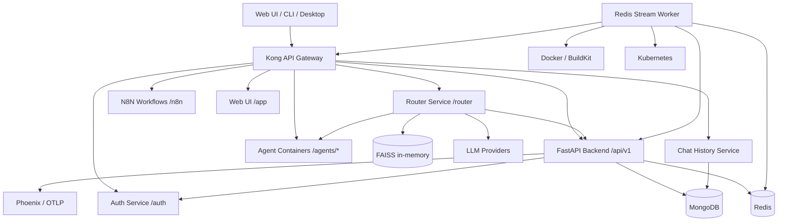
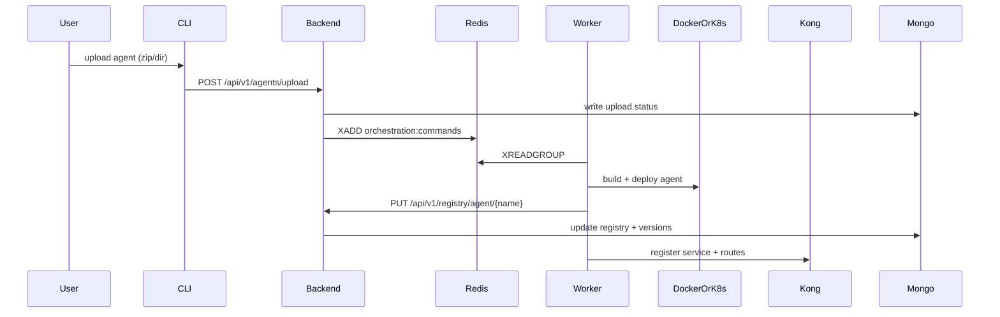
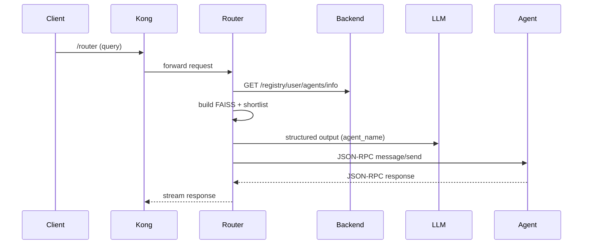
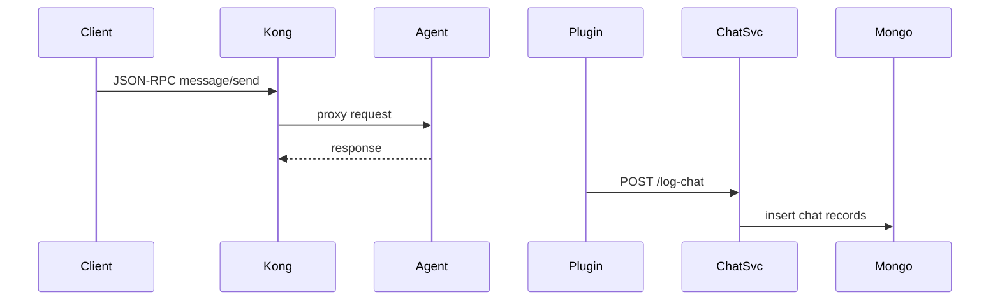
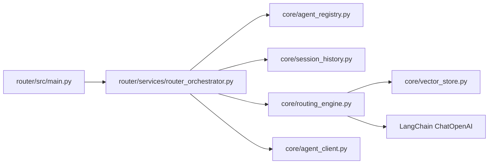

Diagrams and Callgraphs
=======================

Overall Architecture
--------------------


Agent Upload and Deployment Flow
--------------------------------


Routing Flow (Router Service)
-----------------------------


Chat Logging Flow (Kong Plugin)
-------------------------------


Router Callgraph (Core)
-----------------------


Orchestrator Flow (Local)
-------------------------
```mermaid
flowchart TD
  A[Redis Stream: orchestration:commands] --> B[redis_stream_listener.py]
  B --> C[copy agent to /tmp/agent-builds]
  C --> D[inject tracing (optional)]
  D --> E[docker build]
  E --> F[docker run on agents-net]
  F --> G[PUT /api/v1/registry/agent/{name}]
  G --> H[register agent permissions with auth]
```
