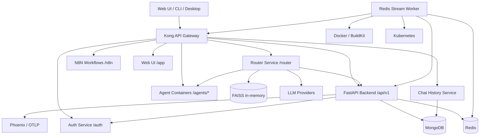
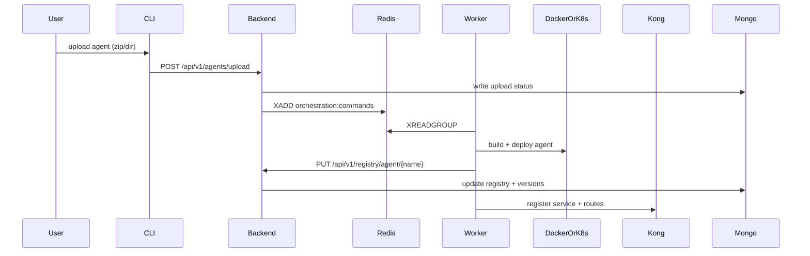
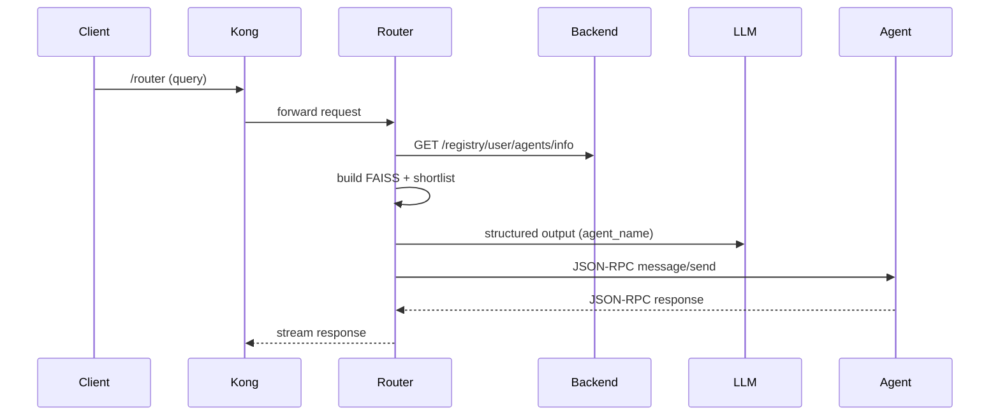
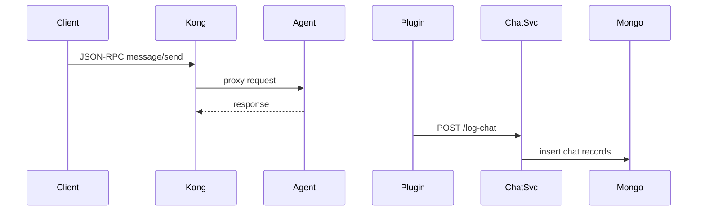
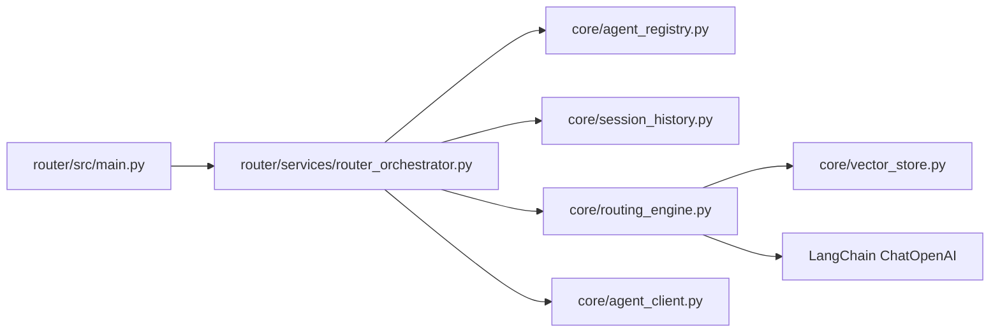

# Nasiko Go Reconstruction Blueprint

## Purpose
This blueprint is a lossless reconstruction guide for implementing the Nasiko control plane in Go.
It converts the analysis files into a structured plan plus a complete appendix of source analysis.

## How to use this blueprint
1. Follow the phases in order. Each phase lists inputs, steps, outputs, and acceptance checks.
2. Use the traceability map to connect legacy Python files to the new Go modules.
3. For any detail not obvious in the plan, consult Appendix A (lossless analysis content).

## System inventory (target Go system)
### Services
- API gateway (Kong or Nginx) with custom plugins
- Backend API (Go HTTP service with handlers, services, repositories)
- Router service (LLM routing + vector search + shortlist/rerank)
- Registry service (service discovery + Kong config management)
- Chat history service (JSON-RPC log ingestion + query API)
- Orchestrator service (build + deploy workflow, Redis stream consumer)
- Build worker (BuildKit/K8s job execution)
- CLI (operator tool for setup and control)
- Sample agents (A2A JSON-RPC agents with tool calling)

### Data stores and infrastructure
- MongoDB (primary data store for registry, chat, creds)
- Redis (streams, caching, orchestration state)
- Postgres (Kong config DB)
- Object storage and container registry (ECR/DOCR)
- BuildKit, Docker, Kubernetes, Terraform

## Go module mapping (high level)
- `go-backend/` maps to `app/` (handlers, services, repositories, entities)
- `go-router/` maps to `agent-gateway/router/` (routing engine, embeddings, vector store)
- `go-registry/` maps to `agent-gateway/registry/` (service discovery + Kong config)
- `go-chat-history/` maps to `agent-gateway/chat-history-service/`
- `go-orchestrator/` maps to `orchestrator/` and `worker/`
- `go-cli/` maps to `cli/` (commands, groups, setup modules)
- `go-agents/` maps to `agents/` and templates
- `infra/` maps to `docker-compose`, `k8s/`, `terraform/`, `kong` configs

## End-to-end flow (target behavior)
1. Agent uploaded (CLI or API) -> stored in registry -> build request enqueued
2. Orchestrator consumes Redis stream -> builds image -> deploys to Docker/K8s
3. Registry service discovers running agent -> configures gateway routes and plugins
4. Router receives user query -> embeddings + shortlist -> LLM selects agent
5. Gateway routes request to agent -> chat history logged -> traces emitted

## Reconstruction phases
### Phase 0: Foundations
Inputs:
- Developer workstation, Go toolchain, Docker, kubectl, terraform
Steps:
- Initialize monorepo structure and Go module layout
- Establish coding conventions, linting, and formatting rules
- Set up local dev environment and Makefile tasks
Outputs:
- Repo skeleton with Go modules and build scripts
Acceptance:
- `go test ./...` passes on empty scaffolding
- Basic dev loop documented

### Phase 1: Core platform skeleton
Inputs:
- Phase 0 repo
Steps:
- Create shared config package (env, file, defaults)
- Create shared logging and tracing packages
- Define common error model and response helpers
Outputs:
- Reusable packages with tests
Acceptance:
- Services can boot with config + logging + tracing

### Phase 2: Data stores and contracts
Inputs:
- MongoDB, Redis, Postgres instances (local compose)
Steps:
- Define MongoDB schemas (registry, chat, creds)
- Define Redis stream names, payloads, consumer groups
- Define Kong DB usage and service/route specs
Outputs:
- Schema docs, migrations, index plans
Acceptance:
- Data model docs and invariants reviewed

### Phase 3: Backend API service (Go)
Inputs:
- Data contracts from Phase 2
Steps:
- Implement HTTP router, handlers, and middleware
- Implement service layer (business logic)
- Implement repository layer (MongoDB/Redis)
- Add auth + JWT validation
Outputs:
- API endpoints equivalent to `app/api/routes/*`
Acceptance:
- API contract tests pass, auth flow works

### Phase 4: Agent registry and gateway integration
Inputs:
- Backend API and data contracts
Steps:
- Implement registry discovery (Docker/K8s)
- Program Kong services, routes, and plugins
- Ensure health checks and cleanup of stale services
Outputs:
- Registry service and Kong config automation
Acceptance:
- Agents appear in gateway and are routable

### Phase 5: Router service
Inputs:
- Registry data + embeddings config
Steps:
- Implement embedding generation and vector store
- Implement candidate shortlist and rerank logic
- Implement LLM selection logic + structured output
Outputs:
- Router service with test harness
Acceptance:
- Routing tests pass and match expected agent selection

### Phase 6: Chat history service
Inputs:
- JSON-RPC schemas, storage contracts
Steps:
- Implement ingestion endpoints and storage
- Implement query APIs and pagination
Outputs:
- Chat history service
Acceptance:
- Logs are persisted and retrievable

### Phase 7: Orchestrator + build worker
Inputs:
- Build pipeline requirements, Redis streams
Steps:
- Implement stream consumer and job state machine
- Integrate Docker BuildKit and registry push
- Deploy agents to Docker/K8s and update registry
Outputs:
- Orchestrator and worker binaries
Acceptance:
- End-to-end build/deploy flow completes

### Phase 8: CLI tooling
Inputs:
- API endpoints and setup requirements
Steps:
- Implement CLI groups and commands
- Implement setup automation for local/K8s
Outputs:
- CLI matching `cli/commands` and `cli/groups`
Acceptance:
- CLI covers all operators workflows

### Phase 9: Sample agents
Inputs:
- A2A JSON-RPC protocol
Steps:
- Implement sample agents in Go or Python as reference
- Implement tool calling and structured output
Outputs:
- Runnable agent templates
Acceptance:
- Agents accept JSON-RPC and pass routing flows

### Phase 10: Production hardening
Inputs:
- All services live
Steps:
- Add SLOs, dashboards, alerting, and runbooks
- Add load tests, profiling, and scaling rules
- Add security hardening and supply chain checks
Outputs:
- Production readiness checklist
Acceptance:
- ORR completed; rollback plan validated

## Appendix A: Lossless analysis content
The following section contains the full content of every file under `nasiko-main-analysis/`.
It is included to preserve every detail discovered in the analysis.

### README.md
```text
Nasiko Main Analysis
====================

Purpose
-------
This directory contains file-level analysis for `nasiko-main`, structured to mirror
the codebase and capture:
- file purpose
- implemented logic
- data flows and interfaces
- dependencies and external services
- design and architecture notes

Structure
---------
- `index.md`: master index of file list and analysis map
- `diagrams.md`: architecture, flow charts, and callgraphs
- `root/`: top-level files (build, CI, compose, repo metadata)
- `app/`: backend API service (FastAPI)
- `agent-gateway/`: Kong registry, router, chat history service, plugins
- `agents/`: sample A2A agents and templates
- `cli/`: CLI and infra automation
- `orchestrator/`: local Docker orchestration and Redis stream consumer
- `worker/`: K8s BuildKit worker
- `models/`: Ollama model stack
- `docs/`: documentation

Conventions
-----------
Each module index lists per-file notes in a consistent mini-template:
- Type
- Purpose
- Key logic
- Inputs/Outputs
- Dependencies
- Notes

Limitations and safety rules
----------------------------
- `.nasiko-local.env.example` is not read (env/credential file).
- `.zip` archives are not expanded; they are documented as packaged copies of
  existing agent directories.
- Large lock files (`uv.lock`) are summarized by intent and not exhaustively parsed.
  Dependencies are documented from `pyproject.toml` files instead.

Status
------
This analysis is derived from the file list at `nasiko-main-list.txt` and the
codebase contents. If new files are added, update `index.md` and the relevant
module index.
```

### agent-gateway/index.md
```text
Agent Gateway Analysis
======================

agent-gateway/README.md
-----------------------
- Type: Documentation
- Purpose: Gateway service overview and local run instructions.

agent-gateway/docker-compose.yml
--------------------------------
- Type: Docker Compose
- Purpose: Standalone stack for Kong, registry, router, chat history.
- Key logic: Postgres for Kong, custom plugin mount, networks.

agent-gateway/start.sh
----------------------
- Type: Shell script
- Purpose: Wrapper to start gateway stack locally.
- Key logic: docker compose up / health waits (see file for exact commands).

plugins/chat-logger/handler.lua
-------------------------------
- Type: Kong Lua plugin
- Purpose: Log JSON-RPC `message/send` traffic to chat history service.
- Key logic: capture request/response, post to `/log-chat` asynchronously.
- Inputs/Outputs: Kong request/response bodies; HTTP POST to chat history.

plugins/chat-logger/schema.lua
------------------------------
- Type: Kong plugin schema
- Purpose: Define plugin config (chat service URL, timeout).

chat-history-service/Dockerfile
-------------------------------
- Type: Container build file
- Purpose: Build chat-history microservice image.

chat-history-service/pyproject.toml
-----------------------------------
- Type: Packaging config
- Purpose: Declares FastAPI + Mongo dependencies.

chat-history-service/main.py
----------------------------
- Type: FastAPI service
- Purpose: Ingest chat logs, query chat history by session.
- Key logic: Parses JSON-RPC messages, inserts into Mongo, health check.

registry/requirements.txt
-------------------------
- Type: Dependency list
- Purpose: FastAPI + requests + docker + kubernetes + pydantic.

registry/Dockerfile
-------------------
- Type: Container build file
- Purpose: Build Kong registry service image.

registry/registry.py
--------------------
- Type: FastAPI service + scheduler
- Purpose: Discover agents (Docker/K8s), register Kong services/routes/plugins.
- Key logic: Periodic `sync_services`, static proxy registration, stale cleanup.

router/Dockerfile
-----------------
- Type: Container build file
- Purpose: Build router service image.

router/pyproject.toml
---------------------
- Type: Poetry config
- Purpose: Router dependencies (FastAPI, LangChain, FAISS, OpenAI).

router/README.md
----------------
- Type: Documentation
- Purpose: Router usage and API examples.

router/.gitignore
-----------------
- Type: VCS ignore rules (router-specific).

router/__init__.py
------------------
- Type: Package marker.

router/src/__init__.py
----------------------
- Type: Package marker.

router/src/main.py
------------------
- Type: FastAPI app
- Purpose: Router entrypoint; `/router` streaming endpoint.
- Key logic: Validates inputs, calls `RouterOrchestrator`.

router/src/config/__init__.py
-----------------------------
- Type: Package marker.

router/src/config/settings.py
-----------------------------
- Type: Config module
- Purpose: Router settings and env vars (LLM provider, model, keys).

router/src/core/__init__.py
---------------------------
- Type: Package marker.

router/src/core/agent_client.py
-------------------------------
- Type: HTTP client
- Purpose: Send JSON-RPC `message/send` to agent via Kong.
- Key logic: Rewrites localhost to internal service host in Docker.

router/src/core/agent_registry.py
---------------------------------
- Type: Client + cache
- Purpose: Fetch agent cards from backend registry and cache.

router/src/core/vector_store.py
-------------------------------
- Type: Vector index builder
- Purpose: Build and cache FAISS index from agent descriptions.
- Key logic: OpenAI embeddings, MD5 cache.

router/src/core/routing_engine.py
---------------------------------
- Type: Routing logic
- Purpose: Shortlist via embeddings, rerank, LLM select final agent.
- Key logic: Structured output via Pydantic; fallbacks when similarity low.

router/src/core/session_history.py
----------------------------------
- Type: Client
- Purpose: Fetch chat session history from backend.

router/src/entities/__init__.py
-------------------------------
- Type: Package marker.

router/src/entities/router_entities.py
--------------------------------------
- Type: Pydantic models
- Purpose: Router request/response schemas and LLM structured output.

router/src/services/__init__.py
-------------------------------
- Type: Package marker.

router/src/services/router_orchestrator.py
------------------------------------------
- Type: Orchestration layer
- Purpose: Glue registry, history, routing engine, agent client.
- Key logic: Streaming progress + final response, agent URL selection.

router/src/utils/__init__.py
----------------------------
- Type: Package marker.

router/src/utils/agent_utils.py
-------------------------------
- Type: Helper
- Purpose: Truncate/normalize AgentCards for routing.

router/src/utils/message_utils.py
---------------------------------
- Type: Helper
- Purpose: Build response stream messages and status updates.

router/src/utils/payload_utils.py
---------------------------------
- Type: Helper
- Purpose: Construct JSON-RPC payload for agent calls.

router/src/utils/file_utils.py
------------------------------
- Type: Helper
- Purpose: Parse/format multipart file uploads for router inputs.

router/tests/__init__.py
------------------------
- Type: Test package marker.

router/tests/router_tests.py
----------------------------
- Type: Tests
- Purpose: Router behavior and selection logic tests.

router/tests/router_quality_tests.py
------------------------------------
- Type: Tests
- Purpose: Quality checks and metrics for routing (LLM selection).

router/tests/semantic_search_exps.py
------------------------------------
- Type: Experimental tests
- Purpose: Explore semantic search behavior and thresholds.

router/tests/maf_tests.py
-------------------------
- Type: Tests
- Purpose: Misc router tests (MAF indicates a specific eval variant).

router/tests/test_minimax_provider.py
-------------------------------------
- Type: Tests
- Purpose: MiniMax provider config and routing tests.
```

### agents/index.md
```text
Agents Analysis
===============

Agent Archives
--------------
a2a-compliance-checker.zip
- Type: Zip archive
- Purpose: Packaged copy of `agents/a2a-compliance-checker/`.
- Notes: Not expanded; contents mirror the directory.

a2a-github-agent.zip
- Type: Zip archive
- Purpose: Packaged copy of `agents/a2a-github-agent/`.
- Notes: Not expanded; contents mirror the directory.

a2a-translator.zip
- Type: Zip archive
- Purpose: Packaged copy of `agents/a2a-translator/`.
- Notes: Not expanded; contents mirror the directory.

Compliance Checker Agent
------------------------
Dockerfile
- Type: Container build file
- Purpose: Build a2a-compliance-checker image.

AgentCard.json
- Type: Agent descriptor
- Purpose: Capability metadata, skills, and routing hints.

pyproject.toml
- Type: Packaging config
- Purpose: Dependencies for A2A SDK + OpenAI + Mongo.

README.md
- Type: Documentation
- Purpose: Usage and agent behavior overview.

.gitignore
- Type: VCS ignore rules.

docker-compose.yml
- Type: Local run config.

src/__init__.py
- Type: Package marker.

src/__main__.py
- Type: Entry point
- Purpose: Build AgentCard + executor and run A2A Starlette app.

src/openai_agent_executor.py
- Type: Agent executor
- Purpose: OpenAI tool-calling loop; maps tools to JSON schema; updates task state.

src/openai_agent.py
- Type: Agent factory
- Purpose: Build OpenAI client and tools for executor.

src/compliance_toolset.py
- Type: Toolset
- Purpose: `check_compliance` and `analyze_policy` tooling for LLM.

src/policy_agent.py
- Type: Policy analysis helper
- Purpose: Build policy-specific prompts and responses.
- Notes: Imports `BaseAgent` which is not present in tree (check dependency).

src/agent.py
- Type: Alternate agent flow
- Purpose: LangChain AgentExecutor-based compliance logic (alternate path).

src/tools.py
- Type: Utilities
- Purpose: Web text extraction and helper functions for compliance.

src/models.py
- Type: Pydantic models
- Purpose: JSON-RPC / task schemas used by the agent.

GitHub Agent
------------
Dockerfile
- Type: Container build file.

AgentCard.json
- Type: Agent descriptor.

pyproject.toml
- Type: Packaging config.

README.md
- Type: Documentation.

run_with_phoenix.sh
- Type: Shell script
- Purpose: Run agent with Phoenix tracing enabled.

.gitignore
- Type: VCS ignore rules.

docker-compose.yml
- Type: Local run config.

src/__init__.py
- Type: Package marker.

src/__main__.py
- Type: Entry point
- Purpose: Build AgentCard + executor and run A2A app.

src/openai_agent_executor.py
- Type: Agent executor
- Purpose: OpenAI tool loop with function schema generation.

src/openai_agent.py
- Type: Agent factory
- Purpose: Build OpenAI client and toolset bindings.

src/github_toolset.py
- Type: Toolset
- Purpose: GitHub API operations using PyGithub.

Translator Agent
----------------
Dockerfile
- Type: Container build file.

AgentCard.json
- Type: Agent descriptor.

pyproject.toml
- Type: Packaging config.

README.md
- Type: Documentation.

run_with_phoenix.sh
- Type: Shell script
- Purpose: Run agent with Phoenix tracing enabled.

.gitignore
- Type: VCS ignore rules.

docker-compose.yml
- Type: Local run config.

src/__init__.py
- Type: Package marker.

src/__main__.py
- Type: Entry point
- Purpose: Build AgentCard + executor and run A2A app.

src/openai_agent_executor.py
- Type: Agent executor
- Purpose: OpenAI tool loop with async tool results handling.

src/openai_agent.py
- Type: Agent factory
- Purpose: Build OpenAI client and toolset bindings.

src/translator_toolset.py
- Type: Toolset
- Purpose: Translation, URL extraction, language detection.
```

### app/index.md
```text
App (Backend) Analysis
======================

Docker and Packaging
--------------------
Dockerfile
- Type: Container build file
- Purpose: Build backend API image.

Dockerfile.k8s-build-worker
- Type: Container build file
- Purpose: Build K8s worker image for cluster deployments.

docker-compose.app.yaml
- Type: Compose stack for backend-only dev.
- Purpose: Run backend + dependencies separately from full stack.

.dockerignore
- Type: Docker ignore patterns for app build context.

pyproject.toml
- Type: Packaging config
- Purpose: Backend dependencies (FastAPI, Mongo, Redis, LangChain, OTEL).

main.py
-------
- Type: FastAPI entrypoint
- Purpose: App initialization, DB setup, router wiring, search init.
- Key logic: Lifespan creates DB client, repository, service, handlers.

pkg/config/config.py
--------------------
- Type: Settings module
- Purpose: Environment configuration (URLs, DBs, K8S flags, OAuth keys).

pkg/auth/__init__.py
pkg/auth/auth_client.py
- Type: Auth integration
- Purpose: Communicate with auth service (JWT validation, access rules).

pkg/redisclient/redisclient.py
- Type: Redis helper
- Purpose: Token storage or shared keys (legacy/simple use).

Adapters
--------
adapters/__init__.py
- Package marker.

adapters/base_adapter.py
- Purpose: Base class for external service adapters.

adapters/nanda_adapter.py
- Purpose: Wrapper for NANDA API endpoints.

Entities and Models
-------------------
entity/entity.py
- Purpose: Core Pydantic models for registry, skills, chat, uploads.

entity/n8n_entity.py
- Purpose: Pydantic models for N8N credentials and workflows.

entity/user_github_credentials_entity.py
- Purpose: Pydantic model for GitHub credentials storage.

Repository Layer (MongoDB)
--------------------------
repository/base_repository.py
- Purpose: Base Mongo repository with common helpers and indexes.

repository/registry_repository.py
- Purpose: Registry CRUD + version history.

repository/agent_operations_repository.py
- Purpose: Agent build and deployment records.

repository/n8n_repository.py
- Purpose: Persist N8N credentials/workflows.

repository/upload_status_repository.py
- Purpose: Track upload states.

repository/chat_repository.py
- Purpose: Chat session and history storage, pagination.

repository/github_repository.py
- Purpose: Store GitHub credential records.

repository/repository.py
- Purpose: Aggregates repositories and ensures indexes.

Service Layer
-------------
service/service.py
- Purpose: Core business logic for registry and user agent operations.

service/agent_operations_service.py
- Purpose: Build/deploy status API operations.

service/agent_update_service.py
- Purpose: Update/rollback agent versions and orchestration triggers.

service/agent_upload_service.py
- Purpose: Validate and process agent upload (zip/dir).

service/agent_upload_tracking_service.py
- Purpose: Track upload progress, trigger orchestration on success.

service/agentcard_service.py
- Purpose: Generate/validate AgentCard data.

service/chat_history_service.py
- Purpose: Manage chat sessions and history retrieval.

service/github_service.py
- Purpose: GitHub OAuth and repo operations.

service/n8n_service.py
- Purpose: N8N API integration.

service/nanda_service.py
- Purpose: Proxy/aggregation over NANDA API.

service/orchestration_service.py
- Purpose: Produce Redis stream events for worker.

service/k8s_service.py
- Purpose: K8s operations for agent deployments.

service/observability_service.py
- Purpose: Phoenix/trace aggregation and stats.

service/redis_search_service.py
- Purpose: Redis-backed search index for users/agents.

API Layer
---------
api/auth.py
- Purpose: JWT validation via auth service.

api/types.py
- Purpose: Shared request/response DTOs for handlers.

api/routes/__init__.py
- Package marker.

api/routes/router.py
- Purpose: Compose FastAPI routers for modules.

api/routes/health_routes.py
- Purpose: Health check endpoints.

api/routes/registry_routes.py
- Purpose: Registry CRUD endpoints.

api/routes/agent_upload_routes.py
- Purpose: Upload and download endpoints.

api/routes/agent_operations_routes.py
- Purpose: Build/deploy status endpoints.

api/routes/agent_update_routes.py
- Purpose: Update/rollback endpoints.

api/routes/github_routes.py
- Purpose: GitHub OAuth and clone endpoints.

api/routes/n8n_routes.py
- Purpose: N8N management endpoints.

api/routes/nanda_routes.py
- Purpose: NANDA proxy endpoints.

api/routes/search_routes.py
- Purpose: Search endpoints for users/agents.

api/routes/chat_history_routes.py
- Purpose: Chat session endpoints.

api/routes/observability_routes.py
- Purpose: Observability endpoints.

api/routes/superuser_routes.py
- Purpose: Superuser creation and management endpoints.

api/handlers/__init__.py
- Purpose: Handler factory wiring.

api/handlers/base_handler.py
- Purpose: Base handler with shared helpers.

api/handlers/health_handler.py
- Purpose: Health logic.

api/handlers/registry_handler.py
- Purpose: Registry orchestration and index updates.

api/handlers/agent_upload_handler.py
- Purpose: Upload logic and orchestration trigger.

api/handlers/agent_operations_handler.py
- Purpose: Build/deploy status logic.

api/handlers/agent_update_handler.py
- Purpose: Update/rollback logic.

api/handlers/github_handler.py
- Purpose: GitHub OAuth operations.

api/handlers/n8n_handler.py
- Purpose: N8N operations.

api/handlers/nanda_handler.py
- Purpose: NANDA proxy handling.

api/handlers/search_handler.py
- Purpose: Search index operations.

api/handlers/chat_history_handler.py
- Purpose: Chat session handling.

api/handlers/observability_handler.py
- Purpose: Observability handler over Phoenix.

api/handlers/traces_handler.py
- Purpose: Trace retrieval support (not wired in factory).

Init Scripts
------------
init-scripts/mongo/01-setup.js
- Type: Mongo init JS
- Purpose: Initialize Mongo DB user/permissions on startup.

Observability Utilities
-----------------------
utils/observability/__init__.py
- Package marker.

utils/observability/config.py
- Purpose: Observability config flags and defaults.

utils/observability/tracing_utils.py
- Purpose: OpenTelemetry / Phoenix tracing helpers.

utils/observability/injector.py
- Purpose: AST-based injection of tracing into agent code.

AgentCard Generator
-------------------
utils/agentcard_generator/README.md
- Purpose: Explain AgentCard generation tooling.

utils/agentcard_generator/ARCHITECTURE.md
- Purpose: Design and internal architecture for generator.

utils/agentcard_generator/requirements.txt
- Purpose: Minimal deps for generator.

utils/agentcard_generator/cli.py
- Purpose: CLI entry for generator.

utils/agentcard_generator/agent.py
- Purpose: Generator core logic.

utils/agentcard_generator/tools.py
- Purpose: Helper utilities for generation.

utils/agentcard_generator/generate_agentcard.sh
- Purpose: Shell wrapper for generator.

utils/agentcard_generator/__init__.py
- Package marker.

Agent Template (Webhook)
------------------------
utils/templates/a2a-webhook-agent/Dockerfile
- Purpose: Build webhook agent image.

utils/templates/a2a-webhook-agent/AgentCard.json
- Purpose: Template AgentCard for webhook agent.

utils/templates/a2a-webhook-agent/pyproject.toml
- Purpose: Template dependencies (a2a-sdk, httpx, uvicorn).

utils/templates/a2a-webhook-agent/README.md
- Purpose: Usage docs for webhook agent template.

utils/templates/a2a-webhook-agent/.gitignore
- Purpose: Template ignore rules.

utils/templates/a2a-webhook-agent/docker-compose.yml
- Purpose: Local run config for webhook agent.

utils/templates/a2a-webhook-agent/src/__init__.py
- Purpose: Package marker.

utils/templates/a2a-webhook-agent/src/__main__.py
- Purpose: Entry point; run A2A app with webhook executor.

utils/templates/a2a-webhook-agent/src/webhook_agent.py
- Purpose: HTTP client to external webhook; parse responses.

utils/templates/a2a-webhook-agent/src/webhook_agent_executor.py
- Purpose: A2A executor; maps A2A requests to webhook calls.
```

### cli/index.md
```text
CLI and Infra Analysis
======================

Top-level CLI
-------------
main.py
- Type: Typer entrypoint
- Purpose: Register commands and groups, handle env loading, CLI callbacks.

pyproject.toml
- Type: Packaging config
- Purpose: Defines `nasiko` console script, deps (typer, requests, kubernetes, docker).

pytest.ini
- Type: Test config
- Purpose: Pytest configuration for CLI tests.

uv.lock
- Type: Dependency lock (uv)
- Purpose: Pinned dependencies; not exhaustively parsed.

pyoxidizer.bzl
- Type: Build config
- Purpose: PyOxidizer build rules for CLI binary packaging.

BINARY_BUILD_GUIDE.md
- Type: Documentation
- Purpose: Instructions for building CLI binaries (PyInstaller / PyOxidizer).

__init__.py
- Type: Package marker.

core/
------
core/__init__.py
- Package marker.

core/settings.py
- Purpose: CLI config resolution and defaults.

core/api_client.py
- Purpose: HTTP client for backend and auth endpoints (Bearer token handling).

auth/
-----
auth/__init__.py
- Package marker.

auth/auth_manager.py
- Purpose: Manage JWT storage, keyring or encrypted file fallback.

auth/auth_commands.py
- Purpose: Login/logout command helpers and validations.

utils/
------
utils/__init__.py
- Package marker.

utils/utils.py
- Purpose: Utility helpers (printing, file operations, formatting).

groups/
-------
groups/__init__.py
- Purpose: Registers CLI command groups.

groups/agent_group.py
- Purpose: Agent upload/list/get commands.

groups/github_group.py
- Purpose: GitHub OAuth and repo operations.

groups/access_group.py
- Purpose: Access control grant/revoke commands.

groups/n8n_group.py
- Purpose: N8N credential/workflow commands.

groups/search_group.py
- Purpose: Search users/agents commands.

groups/observability_group.py
- Purpose: Observability query commands.

groups/images_group.py
- Purpose: Image build/push helpers.

groups/local_group.py
- Purpose: Local Docker Compose helper commands.

groups/chat_group.py
- Purpose: Chat session create/list/history commands.

groups/user_group.py
- Purpose: Superuser and user management commands.

commands/
---------
commands/__init__.py
- Package marker.

commands/registry.py
- Purpose: Registry list/get/docs commands.

commands/n8n.py
- Purpose: N8N registration and workflow interactions.

commands/access.py
- Purpose: Access control API calls.

commands/observability.py
- Purpose: Observability API calls (sessions, traces, stats).

commands/chat_send.py
- Purpose: Send message to agent via API.

commands/search.py
- Purpose: Search endpoints for users and agents.

commands/github.py
- Purpose: GitHub OAuth + repo operations.

commands/user_management.py
- Purpose: Create/list/revoke users.

commands/upload_agent.py
- Purpose: Agent upload (zip/dir) helpers.

commands/chat_history.py
- Purpose: Chat session list/history/delete helpers.

setup/
------
setup/__init__.py
- Package marker.

setup/setup.py
- Purpose: Top-level `nasiko setup` command group and bootstrap orchestration.

setup/config.py
- Purpose: Load and validate setup configuration (env + CLI).

setup/utils.py
- Purpose: Tooling checks (terraform, kubectl, helm), helpers.

setup/terraform_state.py
- Purpose: Terraform working dir setup, backend config generation.

setup/k8s_setup.py
- Purpose: Provision clusters via Terraform and manage kubeconfig.

setup/harbor_setup.py
- Purpose: Harbor registry deployment via Helm.

setup/container_registry_setup.py
- Purpose: Configure cloud registries (ECR/DO).

setup/buildkit_setup.py
- Purpose: Deploy BuildKit resources.

setup/app_setup.py
- Purpose: Deploy core Nasiko services via Helm templates.

setup/terraform/
----------------
terraform/__init__.py
- Package marker.

terraform/aws/__init__.py
- Package marker.

terraform/aws/main.tf
- Purpose: AWS VPC + EKS module definitions.

terraform/aws/versions.tf
- Purpose: Terraform and provider version constraints.

terraform/aws/variables.tf
- Purpose: Terraform variables for AWS module.

terraform/aws/outputs.tf
- Purpose: EKS outputs (endpoint, cluster name, region).

terraform/digitalocean/__init__.py
- Package marker.

terraform/digitalocean/doks.tf
- Purpose: DigitalOcean Kubernetes cluster definition.

terraform/digitalocean/variables.tf
- Purpose: Terraform variables for DO module.

terraform/digitalocean/provider.tf
- Purpose: DigitalOcean provider configuration.

terraform/digitalocean/outputs.tf
- Purpose: DOKS outputs (endpoint, kubeconfig values).

k8s/
----
k8s/__init__.py
- Package marker.

k8s/README.md
- Purpose: K8s setup instructions for CLI users.

k8s/utils.py
- Purpose: Helper utilities for kubectl/helm operations.

k8s/agent-rbac.yaml
- Purpose: RBAC for agents or operator roles.

k8s/kube-dashboard.yaml
- Purpose: Kubernetes dashboard deployment manifest.

k8s/dashboard-admin.yaml
- Purpose: Admin role binding for dashboard.

k8s/charts/nasiko-platform/Chart.yaml
- Purpose: Helm chart metadata.

k8s/charts/nasiko-platform/values.yaml
- Purpose: Helm values (may be placeholder in this repo).

k8s/charts/nasiko-platform/environments/dev.yaml
k8s/charts/nasiko-platform/environments/staging.yaml
k8s/charts/nasiko-platform/environments/prod.yaml
- Purpose: Environment-specific overrides (placeholders unless populated).

k8s/charts/nasiko-platform/templates/_helpers.tpl
- Purpose: Helm template helpers.

RBAC templates
--------------
k8s/charts/nasiko-platform/templates/rbac/serviceaccount.yaml
k8s/charts/nasiko-platform/templates/rbac/clusterrole.yaml
k8s/charts/nasiko-platform/templates/rbac/clusterrolebinding.yaml
- Purpose: Permissions for core services and worker.

Config and secrets templates
----------------------------
k8s/charts/nasiko-platform/templates/configmaps/app-config.yaml
- Purpose: App config env values (backend, router, auth, registry).

k8s/charts/nasiko-platform/templates/secrets/registry-secret.yaml
- Purpose: Registry credentials for image pulls/pushes.

Networking templates
--------------------
k8s/charts/nasiko-platform/templates/networking/ingress.yaml
k8s/charts/nasiko-platform/templates/networking/networkpolicies.yaml
- Purpose: Ingress routing and network policies.

Initialization templates
------------------------
k8s/charts/nasiko-platform/templates/initialization/superuser-init.yaml
- Purpose: K8s job to create superuser in auth service.

Namespace
---------
k8s/charts/nasiko-platform/templates/namespace.yaml
- Purpose: Create Nasiko namespace.

Infrastructure templates
------------------------
k8s/charts/nasiko-platform/templates/infrastructure/mongodb.yaml
k8s/charts/nasiko-platform/templates/infrastructure/redis.yaml
k8s/charts/nasiko-platform/templates/infrastructure/postgresql.yaml
- Purpose: Core data services for backend and Kong.

k8s/charts/nasiko-platform/templates/infrastructure/ollama.yaml
- Purpose: Optional local LLM provider.

k8s/charts/nasiko-platform/templates/infrastructure/phoenix.yaml
- Purpose: Observability service.

BuildKit templates
------------------
k8s/charts/nasiko-platform/templates/infrastructure/buildkit/namespace.yaml
k8s/charts/nasiko-platform/templates/infrastructure/buildkit/deployment.yaml
k8s/charts/nasiko-platform/templates/infrastructure/buildkit/service.yaml
k8s/charts/nasiko-platform/templates/infrastructure/buildkit/pvc.yaml
k8s/charts/nasiko-platform/templates/infrastructure/buildkit/serviceaccount.yaml
k8s/charts/nasiko-platform/templates/infrastructure/buildkit/regcred-secret.yaml
- Purpose: BuildKit build service and credentials.

Service templates
-----------------
k8s/charts/nasiko-platform/templates/services/nasiko-backend/deployment.yaml
- Purpose: Backend API deployment and env wiring.

k8s/charts/nasiko-platform/templates/services/nasiko-web/deployment.yaml
- Purpose: Web UI deployment.

k8s/charts/nasiko-platform/templates/services/nasiko-router/deployment.yaml
- Purpose: Router service deployment.

k8s/charts/nasiko-platform/templates/services/auth-service/deployment.yaml
- Purpose: Auth service deployment.

k8s/charts/nasiko-platform/templates/services/agent-gateway/deployment.yaml
- Purpose: Kong gateway deployment.

k8s/charts/nasiko-platform/templates/services/agent-gateway/kong-migrations.yaml
- Purpose: Kong DB migrations job.

k8s/charts/nasiko-platform/templates/services/agent-gateway/kong-plugins-config.yaml
- Purpose: Plugin config (chat-logger, auth, cors).

k8s/charts/nasiko-platform/templates/services/agent-gateway/service-registry-deployment.yaml
- Purpose: Kong service registry sidecar deployment.

k8s/charts/nasiko-platform/templates/services/n8n/deployment.yaml
k8s/charts/nasiko-platform/templates/services/n8n/service.yaml
k8s/charts/nasiko-platform/templates/services/n8n/pvc.yaml
- Purpose: N8N workflow engine (optional).

k8s/charts/nasiko-platform/templates/services/nasiko-k8s-build-worker/deployment.yaml
- Purpose: K8s worker that consumes orchestration stream.
```

### diagrams.md
```text
Diagrams and Callgraphs
=======================

Overall Architecture
--------------------


Agent Upload and Deployment Flow
--------------------------------


Routing Flow (Router Service)
-----------------------------


Chat Logging Flow (Kong Plugin)
-------------------------------


Router Callgraph (Core)
-----------------------


Orchestrator Flow (Local)
-------------------------
```mermaid
flowchart TD
  A[Redis Stream: orchestration:commands] --> B[redis_stream_listener.py]
  B --> C[copy agent to /tmp/agent-builds]
  C --> D[inject tracing (optional)]
  D --> E[docker build]
  E --> F[docker run on agents-net]
  F --> G[PUT /api/v1/registry/agent/{name}]
  G --> H[register agent permissions with auth]
```
```

### docs/index.md
```text
Docs Analysis
=============

getting-started.md
------------------
- Type: Documentation
- Purpose: Post-README onboarding; first login, deploy sample agent, route queries.
- Key logic: References superuser credentials file, agent upload via UI/CLI, router test.
- Inputs/Outputs: None; user-facing steps.
```

### index.md
```text
Master Index
============

This index maps the file list (`nasiko-main-list.txt`) to module analysis files.
Each module index includes per-file details for all entries under that path.

Modules
-------
- Root files: `root/index.md`
- Backend service: `app/index.md`
- Agent gateway services: `agent-gateway/index.md`
- Sample agents + templates: `agents/index.md`
- CLI + infra: `cli/index.md`
- Orchestrator (local): `orchestrator/index.md`
- K8s worker: `worker/index.md`
- Ollama model stack: `models/index.md`
- Documentation: `docs/index.md`
- Global diagrams: `diagrams.md`

Notes
-----
- The `.nasiko-local.env.example` file is not read by policy; its role is documented
  in `root/index.md` from name and references.
- `.zip` agent archives are noted as packaged copies of their folders.
```

### line-by-line/.github/workflows/ci.yml/analysis.md
```text
# ci.yml — line-by-line analysis

## Lines 1-8
- Defines CI workflow triggers on main push and PRs.

## Lines 9-16
- Lint job uses checkout, setup-python 3.12, installs black/mypy.

## Lines 17-24
- Runs black check and starts typecheck job.

## Lines 25-32
- Typecheck job repeats setup and runs mypy with ignore-missing-imports.
```

### line-by-line/.gitignore/analysis.md
```text
# .gitignore — line-by-line analysis

## Lines 1-8
- Ignores env file and Python bytecode/cache artifacts.

## Lines 9-16
- Ignores C extensions and packaging build directories.

## Lines 17-24
- Ignores distribution folders like dist/eggs/libs/parts/sdist.

## Lines 25-32
- Ignores wheel/egg metadata and MANIFEST artifacts.

## Lines 33-40
- Ignores PyInstaller outputs and starts installer log ignores.

## Lines 41-48
- Ignores installer logs and core test/coverage outputs.

## Lines 49-56
- Ignores coverage caches, pytest caches, and related files.

## Lines 57-64
- Ignores translation files and Django log/settings/db files.

## Lines 65-72
- Ignores Django db files and Flask instance caches.

## Lines 73-80
- Ignores Scrapy data, Sphinx docs build, and temp builds.

## Lines 81-88
- Ignores PyBuilder, Jupyter checkpoints, and IPython profile.

## Lines 89-96
- Ignores IPython config, pyenv, and pipenv lockfile.

## Lines 97-104
- Ignores poetry/pdm lock files and PEP 582 packages.

## Lines 105-112
- Ignores Celery state, SageMath files, and begins env list.

## Lines 113-120
- Ignores env/venv folders and starts Spyder settings.

## Lines 121-128
- Ignores Spyder/Rope settings and mkdocs site output.

## Lines 129-136
- Ignores mypy cache and Pyre type checker files.

## Lines 137-144
- Ignores pytype and Cython debug symbols plus VS Code settings.

## Lines 145-152
- Ignores VS Code, uvicorn logs, and uv tooling dir.

## Lines 153-160
- Ignores local env variants and macOS DS_Store.

## Lines 161-163
- Ignores stored superuser credentials JSON.
```

### line-by-line/.nasiko-local.env.example/analysis.md
```text
# .nasiko-local.env.example — line-by-line analysis

## Lines 1-8
- Describes local env file and sets Mongo root/auth DB variables.

## Lines 9-16
- Defines JWT/encryption keys and registry version settings.

## Lines 17-24
- Lists port mappings for Mongo, Redis, Kong, backend, web, auth.

## Lines 25-32
- Continues port mappings for router/chat/service registry/konga/Phoenix.

## Lines 33-40
- Adds Phoenix ports, app mode flags, and network configuration.

## Lines 41-48
- Continues network config and defines default superuser credentials.

## Lines 49-56
- Lists optional API keys for OpenAI/GitHub/OpenRouter/Minimax.

## Lines 57-64
- Router LLM provider comments and Kong DB credentials.

## Lines 65-70
- Phoenix observability endpoint configuration.
```

### line-by-line/CONTRIBUTING.md/analysis.md
```text
# CONTRIBUTING.md — line-by-line analysis

## Lines 1-8
- Title, welcome note, and initial getting started steps.

## Lines 9-16
- Continues setup steps and introduces development prerequisites.

## Lines 17-24
- Lists prerequisites and begins local development instructions.

## Lines 25-32
- Shows clone, install via uv, and pip install commands.

## Lines 33-40
- Starts services command and introduces project structure section.

## Lines 41-48
- Shows directory tree and lists major components.

## Lines 49-56
- Finishes structure list and starts code style guidance.

## Lines 57-64
- Lists style expectations and introduces testing commands.

## Lines 65-72
- Shows pytest commands and starts submitting changes guidance.

## Lines 73-80
- Lists PR guidelines and begins commit message format section.

## Lines 81-88
- Shows commit format template and conventional type list.

## Lines 89-96
- Provides commit message examples and starts questions section.

## Lines 97-104
- Ends English section and starts Chinese guide heading.

## Lines 105-112
- Lists Chinese quick start steps and dev environment items.

## Lines 113-120
- Lists Chinese style guidance and commit format intro.

## Lines 121-128
- Lists Chinese conventional commit types.

## Lines 129-129
- Ends Chinese section.
```

### line-by-line/Dockerfile.worker/analysis.md
```text
# Dockerfile.worker — line-by-line analysis

## Lines 1-8
- Describes worker image purpose, uses Python 3.12 slim, sets workdir.

## Lines 9-16
- Installs system packages for Docker CLI and cleans apt cache.

## Lines 17-24
- Adds Docker repo key, installs docker CLI/plugins, cleans apt cache.

## Lines 25-32
- Copies orchestrator and observability code plus pyproject.

## Lines 33-40
- Creates __init__ files and installs Python deps via uv/pip.

## Lines 41-48
- Installs observability libs and astor, prepares runtime environment.

## Lines 49-56
- Creates worker user and defines healthcheck to import orchestrator.

## Lines 57-60
- Sets ENTRYPOINT to run Redis stream listener.
```

### line-by-line/LICENSE/analysis.md
```text
# LICENSE — line-by-line analysis

## Lines 1-8
- States Apache License 2.0 title/version/URL and begins terms/definitions.

## Lines 9-16
- Defines "License", "Licensor", and starts "Legal Entity" definition.

## Lines 17-24
- Finishes Legal Entity control definition and defines "You".

## Lines 25-32
- Defines "Source" form and "Object" form.

## Lines 33-40
- Defines "Work" and clarifies what is not a Contribution.

## Lines 41-48
- Defines "Derivative Works" and exclusions for separable/linking works.

## Lines 49-56
- Starts "Contribution" definition and describes inclusion criteria.

## Lines 57-64
- Finishes "Contribution" definition and begins copyright license grant.

## Lines 65-72
- Grants copyright license and starts patent license grant.

## Lines 73-80
- Details patent license scope and termination on litigation.

## Lines 81-88
- Begins redistribution section and conditions overview.

## Lines 89-96
- Conditions (a) and (b) and start of (c) on notices.

## Lines 97-104
- Continues condition (c) and starts condition (d) about NOTICE file.

## Lines 105-112
- Explains NOTICE placement options for derivative works.

## Lines 113-120
- Clarifies NOTICE purpose and allows additional attribution notices.

## Lines 121-128
- Allows extra licensing for modifications and starts contribution submission section.

## Lines 129-136
- Completes contribution submission terms and states trademark limitation.

## Lines 137-144
- Begins disclaimer of warranty section.

## Lines 145-152
- Continues warranty disclaimer and starts limitation of liability.

## Lines 153-160
- Continues limitation of liability conditions and damages list.

## Lines 161-168
- Begins section on accepting warranty/support and indemnity obligations.

## Lines 169-176
- Completes support clause, ends terms, and begins appendix.

## Lines 177-184
- Appendix explains how to apply license and boilerplate guidance.

## Lines 185-192
- Shows copyright notice and license statement boilerplate.

## Lines 193-197
- Final disclaimer of warranty/limitations lines conclude license.
```

### line-by-line/Makefile/analysis.md
```text
# Makefile — line-by-line analysis

## Lines 1-8
- Declares phony targets and prints available help commands/description.

## Lines 9-16
- Continues help output and starts clean-all target.

## Lines 17-24
- clean-all stops/removes containers, volumes, and images with echo status.

## Lines 25-32
- Finishes cleanup message and defines clean-start-nasiko chaining.

## Lines 33-40
- backend-app target stops app compose, removes backend image, starts compose.

## Lines 41-48
- Waits and starts redis listener, then begins router target definition.

## Lines 49-56
- router target stops/removes router image and restarts router compose.

## Lines 57-64
- orchestrator and redis-listener targets run services via uv.

## Lines 65-72
- start-nasiko target stops/removes containers and volumes.

## Lines 73-75
- Finishes start-nasiko by running orchestrator and redis listener.
```

### line-by-line/README.md/analysis.md
```text
# README.md — line-by-line analysis

## Lines 1-8
- Documentation text: # Nasiko.

## Lines 9-16
- Documentation text: [](https://fastapi.tiangolo.com/).

## Lines 17-24
- Documentation text: [ CLI Tool](#-cli-tool) .

## Lines 25-32
- Documentation list items or steps: Nasiko is a developer control plane that transforms how you build, deploy, and manage AI agents at scale. Built with modern microservices architecture, Nasiko provides everything needed to run production AI agent ecosystems..

## Lines 33-40
- Documentation list items or steps: - ** AgentCard System** - Structured capability definitions for intelligent routing.

## Lines 41-48
- Documentation list items or steps: **Production Infrastructure:**.

## Lines 49-56
- Documentation list items or steps: - ** One-Command Setup** - `docker compose up -d` to full platform.

## Lines 57-64
- Documentation list items or steps: - ** Request Tracing** - End-to-end visibility across microservices via Arize Phoenix.

## Lines 65-72
- Starts or ends a code block or example.

## Lines 73-80
- Documentation text:               .

## Lines 81-88
- Documentation text:       Kong API Gateway       .

## Lines 89-96
- Documentation text:   /app/  Web Interface     .

## Lines 97-104
- Documentation text:    Core Platform              Intelligence                  AI Agents      .

## Lines 105-112
- Documentation text:  Agent Registry             LangChain Engine          crewai-workflows   .

## Lines 113-120
- Documentation text:                                                 .

## Lines 121-128
- Documentation text:  Role-Based Auth            Search & Filter                     .

## Lines 129-136
- Documentation text:  Auto-Registration                                                .

## Lines 137-144
- Documentation text:      Infrastructure &        .

## Lines 145-152
- Documentation text: :27017          :6379           :6006           (PostgSQL       (K8s)    .

## Lines 153-160
- Starts or ends a code block or example.

## Lines 161-168
- Starts or ends a code block or example.

## Lines 169-176
- Starts or ends a code block or example.

## Lines 177-184
- Documentation text: | Provider | API Key Env Var | Base URL | Models |.

## Lines 185-192
- Documentation list items or steps: ### Key Components.

## Lines 193-200
- Documentation list items or steps: - **Web Interface** (4000) - Browser dashboard accessible via Kong Gateway (/app/).

## Lines 201-208
- Starts or ends a code block or example.

## Lines 209-216
- Documentation text: git clone https://github.com/Nasiko-Labs/nasiko.git.

## Lines 217-224
- Section heading or comment: Example: 5kfdxaT7WRoseTKqksUY4gR2idR4FuBBEIQk5Cpzlek=.

## Lines 225-232
- Documentation text: # 4. Install Python dependencies (for CLI).

## Lines 233-240
- Starts or ends a code block or example.

## Lines 241-248
- Starts or ends a code block or example.

## Lines 249-256
- Documentation list items or steps: ** Success!** Access Nasiko at http://localhost:9100/app/.

## Lines 257-264
- Documentation list items or steps: ### Quick Links.

## Lines 265-272
- Starts or ends a code block or example.

## Lines 273-280
- Documentation text: uv sync.

## Lines 281-288
- Starts or ends a code block or example.

## Lines 289-296
- Starts or ends a code block or example.

## Lines 297-304
- Starts or ends a code block or example.

## Lines 305-312
- Starts or ends a code block or example.

## Lines 313-320
- Starts or ends a code block or example.

## Lines 321-328
- Starts or ends a code block or example.

## Lines 329-336
- Documentation text:  AgentCard.json          # Required: Agent capabilities.

## Lines 337-344
- Starts or ends a code block or example.

## Lines 345-352
- Documentation text: "description": "AI agent for document analysis and extraction",.

## Lines 353-360
- Documentation text: "analyze this contract",.

## Lines 361-368
- Starts or ends a code block or example.

## Lines 369-376
- Starts or ends a code block or example.

## Lines 377-384
- Documentation text: options: dict = {}.

## Lines 385-392
- Starts or ends a code block or example.

## Lines 393-400
- Starts or ends a code block or example.

## Lines 401-408
- Starts or ends a code block or example.

## Lines 409-416
- Starts or ends a code block or example.

## Lines 417-424
- Documentation text: nasiko agent upload-directory . --name my-agent.

## Lines 425-432
- Starts or ends a code block or example.

## Lines 433-440
- Documentation list items or steps: 1. **Query Analysis** - LangChain analyzes user intent and requirements.

## Lines 441-448
- Starts or ends a code block or example.

## Lines 449-456
- Starts or ends a code block or example.

## Lines 457-464
- Documentation list items or steps: All agents automatically receive:.

## Lines 465-472
- Documentation list items or steps: - **Nasiko Web UI**: http://localhost:9100/app/ - Integrated observability dashboard via Kong Gateway.

## Lines 473-480
- Starts or ends a code block or example.

## Lines 481-488
- Starts or ends a code block or example.

## Lines 489-496
- Starts or ends a code block or example.

## Lines 497-504
- Documentation text: GITHUB_CLIENT_SECRET=<your-github-oauth-secret>.

## Lines 505-512
- Documentation text: JWT_SECRET=<your-jwt-signing-secret>.

## Lines 513-520
- Documentation text: SUPERUSER_EMAIL=admin@example.com.

## Lines 521-528
- Starts or ends a code block or example.

## Lines 529-536
- Documentation text: | Web Interface | 4000 | Browser dashboard (access via Kong Gateway at /app/) |.

## Lines 537-544
- Documentation text: | Kong Registry | 8080 | Service discovery and registration |.

## Lines 545-552
- Starts or ends a code block or example.

## Lines 553-560
- Starts or ends a code block or example.

## Lines 561-568
- Documentation list items or steps: This command automatically:.

## Lines 569-576
- Starts or ends a code block or example.

## Lines 577-584
- Starts or ends a code block or example.

## Lines 585-592
- Documentation list items or steps: ### Production Architecture.

## Lines 593-600
- Documentation list items or steps: ##  Sample Agents.

## Lines 601-608
- Starts or ends a code block or example.

## Lines 609-616
- Starts or ends a code block or example.

## Lines 617-624
- Starts or ends a code block or example.

## Lines 625-632
- Documentation text: # View logs.

## Lines 633-640
- Starts or ends a code block or example.

## Lines 641-648
- Starts or ends a code block or example.

## Lines 649-656
- Starts or ends a code block or example.

## Lines 657-664
- Starts or ends a code block or example.

## Lines 665-672
- Documentation list items or steps: - `app-network` - Core services communication.

## Lines 673-680
- Documentation list items or steps: **Kong Gateway Routes** (http://localhost:9100):.

## Lines 681-688
- Documentation list items or steps: - **`/`** - Landing page (redirects to /app/).

## Lines 689-696
- Starts or ends a code block or example.

## Lines 697-704
- Documentation text: # Restart the listener if needed.

## Lines 705-712
- Starts or ends a code block or example.

## Lines 713-720
- Starts or ends a code block or example.

## Lines 721-728
- Starts or ends a code block or example.

## Lines 729-736
- Starts or ends a code block or example.

## Lines 737-744
- Documentation list items or steps: 5. Commit changes: `git commit -m 'Add amazing feature'`.

## Lines 745-752
- Documentation list items or steps: ##  Support.

## Lines 753-755
- Documentation text: <div align="center">.
```

### line-by-line/agent-gateway/README.md/analysis.md
```text
# README.md — line-by-line analysis

## Lines 1-8
- Title, description of Kong gateway role, and note about standalone usage.

## Lines 9-16
- Lists core features like discovery, routing, port mapping, health, dashboard.

## Lines 17-24
- Shows architecture flow diagram for Kong routing.

## Lines 25-32
- Starts ports table detailing proxy/admin/manager/registry ports.

## Lines 33-40
- Completes ports table and introduces usage section.

## Lines 41-48
- Provides standalone start commands and note about standard setup.

## Lines 49-56
- Explains accessing agents via Kong routes with curl examples.

## Lines 57-64
- Adds more route examples and introduces monitoring links.

## Lines 65-72
- Lists monitoring URLs and starts route pattern table.

## Lines 73-80
- Provides route patterns for common agent containers.

## Lines 81-88
- Describes service discovery steps and health monitoring.

## Lines 89-96
- Shows env variable configuration in docker-compose.

## Lines 97-104
- Notes internal admin URL and starts troubleshooting section.

## Lines 105-112
- Shows registry status/services endpoints and manual sync command.

## Lines 113-120
- Shows Kong services/routes endpoints and integration intro.

## Lines 121-128
- Shows before/after URL example for Kong routing.

## Lines 129-136
- Explains consistent interface despite restarts/port changes.

## Lines 137-139
- Ends README.
```

### line-by-line/agent-gateway/chat-history-service/Dockerfile/analysis.md
```text
# Dockerfile — line-by-line analysis

## Lines 1-18
- Builds chat-history-service image with uv, installs deps, exposes 8002, runs main.py.
```

### line-by-line/agent-gateway/chat-history-service/main.py/analysis.md
```text
# main.py — line-by-line analysis

## Lines 1-8
- Module docstring and imports FastAPI, Pydantic, typing, logging, datetime.

## Lines 9-16
- Imports Mongo driver/os, configures logging, and initializes app.

## Lines 17-24
- Reads Mongo env vars, creates client/db/collection.

## Lines 25-32
- Defines ChatMessage model fields and defaults.

## Lines 33-40
- Defines ChatLogRequest model and starts startup handler.

## Lines 41-48
- Creates indexes on session_id/timestamp in startup.

## Lines 49-56
- Logs startup success or error, then defines extract_user_message.

## Lines 57-64
- Extracts session_id/params/message and validates user role.

## Lines 65-72
- Iterates text parts and assembles content string.

## Lines 73-80
- Validates content and constructs ChatMessage for user.

## Lines 81-88
- Fills message fields, timestamps, metadata, and handles errors.

## Lines 89-96
- Starts extract_assistant_message and validates session_id.

## Lines 97-104
- Extracts result/artifacts and prepares content parts.

## Lines 105-112
- Iterates artifacts/parts to collect text and build content.

## Lines 113-120
- Validates content and constructs assistant ChatMessage.

## Lines 121-128
- Sets assistant message fields, metadata, and handles errors.

## Lines 129-136
- Defines /log-chat endpoint and starts message extraction.

## Lines 137-144
- Adds user message, extracts assistant message, and appends.

## Lines 145-152
- Inserts messages, logs count, and returns success payload.

## Lines 153-160
- Returns "no messages" response when empty list.

## Lines 161-168
- Handles log-chat errors with HTTPException.

## Lines 169-176
- Defines /chat-history endpoint and builds query cursor.

## Lines 177-184
- Retrieves messages, converts ObjectId to string.

## Lines 185-192
- Returns session data or handles retrieval errors.

## Lines 193-200
- Defines /health endpoint and tests DB connection.

## Lines 201-208
- Returns healthy response or raises 503 on failure.

## Lines 209-216
- Starts __main__ guard and imports uvicorn.

## Lines 217-218
- Runs uvicorn server on port 8002.
```

### line-by-line/agent-gateway/chat-history-service/pyproject.toml/analysis.md
```text
# pyproject.toml — line-by-line analysis

## Lines 1-19
- Defines chat-history-service metadata, dependencies, build backend, and uv dev deps.
```

### line-by-line/agent-gateway/docker-compose.yml/analysis.md
```text
# docker-compose.yml — line-by-line analysis

## Lines 1-8
- Defines kong-database service with Postgres image and credentials.

## Lines 9-16
- Adds volume/network settings and starts kong-migrations service.

## Lines 17-24
- Configures kong-migrations command, dependency, and DB env vars.

## Lines 25-32
- Finishes kong-migrations env/networks and begins kong service.

## Lines 33-40
- Configures kong dependencies and DB connection env settings.

## Lines 41-48
- Sets Kong log streams and admin listen/GUI URLs.

## Lines 49-56
- Enables chat-logger plugin, mounts plugins, and exposes ports.

## Lines 57-64
- Adds networks/restart and healthcheck interval/timeout.

## Lines 65-72
- Completes healthcheck and starts Konga dashboard service.

## Lines 73-80
- Configures Konga env/ports/network and restart policy.

## Lines 81-88
- Starts kong-service-registry build config and dependencies.

## Lines 89-96
- Sets registry env vars, docker socket mount, and port mapping.

## Lines 97-104
- Adds registry networks/restart and starts nasiko-router service.

## Lines 105-112
- Configures router build, dependencies, and backend/OLLAMA env.

## Lines 113-120
- Sets router keys, mounts code, exposes port, and networks.

## Lines 121-128
- Finishes router restart and begins nasiko-auth-service build.

## Lines 129-136
- Sets auth service dependencies and Mongo/Redis/JWT env vars.

## Lines 137-144
- Adds backend URL, port mapping, networks, and restart policy.

## Lines 145-152
- Adds auth service healthcheck and starts auth-redis service.

## Lines 153-160
- Configures auth-redis image, port, volume, and command.

## Lines 161-168
- Adds redis networks/restart and starts chat-history-service build.

## Lines 169-176
- Sets chat-history env vars, port mapping, and networks.

## Lines 177-184
- Adds restart policy and healthcheck for chat-history-service.

## Lines 185-192
- Declares named volumes and kong-net bridge network.

## Lines 193-196
- Marks agents-net and app-network as external.
```

### line-by-line/agent-gateway/plugins/chat-logger/handler.lua/analysis.md
```text
# handler.lua — line-by-line analysis

## Lines 1-8
- Defines handler table, imports cjson/http, sets priority/version, and starts access hook.

## Lines 9-16
- Stores request body/start time and begins body_filter with chunk/eof.

## Lines 17-24
- Initializes response buffer when missing and prepares to append chunks.

## Lines 25-32
- Appends chunk data and stores complete response on final chunk.

## Lines 33-40
- Starts log hook, loads request/response bodies, and skips if missing.

## Lines 41-48
- Logs skip, declares parsed bodies, and wraps JSON decoding in pcall.

## Lines 49-56
- Decodes request/response JSON and logs parsing errors.

## Lines 57-64
- Validates JSON-RPC method is message/send and that id exists.

## Lines 65-72
- Builds log payload with request/response data and timestamp.

## Lines 73-80
- Adds processing time and schedules async send; logs timer failure.

## Lines 81-88
- Ends log hook and starts send_to_chat_service with premature check.

## Lines 89-96
- Creates HTTP client, timeout, and request endpoint URL.

## Lines 97-104
- Sends POST request with JSON body and handles missing response.

## Lines 105-112
- Logs error or success and closes HTTP client.

## Lines 113-115
- Ends helper and returns ChatLoggerHandler.
```

### line-by-line/agent-gateway/plugins/chat-logger/schema.lua/analysis.md
```text
# schema.lua — line-by-line analysis

## Lines 1-8
- Imports Kong typedefs and begins chat-logger plugin schema definition.

## Lines 9-16
- Defines config record with chat_service_url default and description.

## Lines 17-24
- Defines timeout config field with default and description.

## Lines 25-28
- Closes config schema structure.
```

### line-by-line/agent-gateway/registry/Dockerfile/analysis.md
```text
# Dockerfile — line-by-line analysis

## Lines 1-8
- Uses Python 3.11 slim, installs curl, and cleans apt cache.

## Lines 9-16
- Copies requirements, installs deps, and copies application code.

## Lines 17-24
- Sets PYTHONPATH/UNBUFFERED env and defines HTTP healthcheck.

## Lines 25-26
- Runs registry service via registry.py.
```

### line-by-line/agent-gateway/registry/registry.py/analysis.md
```text
# registry.py — line-by-line analysis

## Lines 1-8
- Docstring describing the module or section.

## Lines 9-16
- Imports modules and service dependencies.

## Lines 17-24
- Imports modules and service dependencies.

## Lines 25-32
- Defines configuration or data variables: logger, handler, formatter.

## Lines 33-40
- Defines configuration or data variables: KONG_ADMIN_URL, REGISTRY_INTERVAL, AGENTS_NAMESPACE.

## Lines 41-48
- Conditional logic for registry branching.

## Lines 49-56
- Defines configuration or data variables: app, title, version.

## Lines 57-64
- Defines class ServiceInfo.

## Lines 65-72
- Continues registry logic and data handling.

## Lines 73-80
- Defines function(s) get_k8s_client with error handling.

## Lines 81-88
- Docstring describing the module or section.

## Lines 89-96
- Defines configuration or data variables: k8s_client.

## Lines 97-104
- Defines function(s) get_docker_client with error handling, returns.

## Lines 105-112
- Docstring describing the module or section.

## Lines 113-120
- Returns values from helper logic.

## Lines 121-128
- Docstring describing the module or section.

## Lines 129-136
- Docstring describing the module or section.

## Lines 137-144
- Loop logic for registry processing.

## Lines 145-152
- Docstring describing the module or section.

## Lines 153-160
- Defines configuration or data variables: agents_services.

## Lines 161-168
- Defines configuration or data variables: service_name.

## Lines 169-176
- Conditional logic for registry branching.

## Lines 177-184
- Loop logic for registry processing.

## Lines 185-192
- Continues registry logic and data handling.

## Lines 193-200
- Conditional logic for registry branching.

## Lines 201-208
- Defines configuration or data variables: service_port, service_host.

## Lines 209-216
- Defines configuration or data variables: service_info, name, host.

## Lines 217-224
- Continues registry logic and data handling.

## Lines 225-232
- Returns values from helper logic.

## Lines 233-240
- Docstring describing the module or section.

## Lines 241-248
- Defines configuration or data variables: docker_client.

## Lines 249-256
- Defines configuration or data variables: agents_network, containers.

## Lines 257-264
- Defines configuration or data variables: container_name, container_status.

## Lines 265-272
- Conditional logic for registry branching.

## Lines 273-280
- Conditional logic for registry branching.

## Lines 281-288
- Continues registry logic and data handling.

## Lines 289-296
- Conditional logic for registry branching.

## Lines 297-304
- Defines configuration or data variables: service_port, service_host.

## Lines 305-312
- Defines configuration or data variables: service_info, name, host.

## Lines 313-320
- Continues registry logic and data handling.

## Lines 321-328
- Returns values from helper logic.

## Lines 329-336
- Docstring describing the module or section.

## Lines 337-344
- Continues registry logic and data handling.

## Lines 345-352
- Defines configuration or data variables: response.

## Lines 353-360
- Defines configuration or data variables: json, timeout, response.

## Lines 361-368
- Defines configuration or data variables: response.

## Lines 369-376
- Defines configuration or data variables: route_data.

## Lines 377-384
- Conditional logic for registry branching.

## Lines 385-392
- Defines configuration or data variables: response, json, timeout.

## Lines 393-400
- Defines configuration or data variables: response, json, timeout.

## Lines 401-408
- Defines configuration or data variables: response, json.

## Lines 409-416
- Defines configuration or data variables: timeout.

## Lines 417-424
- Returns values from helper logic.

## Lines 425-432
- Loop logic for registry processing.

## Lines 433-440
- Docstring describing the module or section.

## Lines 441-448
- Defines configuration or data variables: response, kong_services.

## Lines 449-456
- Defines configuration or data variables: static_proxy_services.

## Lines 457-464
- Defines configuration or data variables: service_name.

## Lines 465-472
- Conditional logic for registry branching.

## Lines 473-480
- Defines configuration or data variables: routes_response, routes.

## Lines 481-488
- Defines configuration or data variables: delete_response.

## Lines 489-496
- Defines configuration or data variables: delete_response.

## Lines 497-504
- Docstring describing the module or section.

## Lines 505-512
- Docstring describing the module or section.

## Lines 513-520
- Docstring describing the module or section.

## Lines 521-528
- Defines configuration or data variables: backend_host, k8s_service, local_service.

## Lines 529-536
- Defines configuration or data variables: local_service, env_var, web_path.

## Lines 537-544
- Defines configuration or data variables: local_service, env_var, router_host.

## Lines 545-552
- Defines configuration or data variables: n8n_host, k8s_service, local_service.

## Lines 553-560
- Continues registry logic and data handling.

## Lines 561-568
- Continues registry logic and data handling.

## Lines 569-576
- Continues registry logic and data handling.

## Lines 577-584
- Continues registry logic and data handling.

## Lines 585-592
- Continues registry logic and data handling.

## Lines 593-600
- Continues registry logic and data handling.

## Lines 601-608
- Continues registry logic and data handling.

## Lines 609-616
- Continues registry logic and data handling.

## Lines 617-624
- Continues registry logic and data handling.

## Lines 625-632
- Loop logic for registry processing.

## Lines 633-640
- Loop logic for registry processing.

## Lines 641-648
- Continues registry logic and data handling.

## Lines 649-656
- Continues registry logic and data handling.

## Lines 657-664
- Loop logic for registry processing.

## Lines 665-672
- Defines function(s) register_proxy_service_in_kong with error handling.

## Lines 673-680
- Docstring describing the module or section.

## Lines 681-688
- Defines configuration or data variables: service_url, service_data.

## Lines 689-696
- Loop logic for registry processing.

## Lines 697-704
- Defines configuration or data variables: response.

## Lines 705-712
- Defines configuration or data variables: response.

## Lines 713-720
- Defines configuration or data variables: json, timeout.

## Lines 721-728
- Defines configuration or data variables: response.

## Lines 729-736
- Continues registry logic and data handling.

## Lines 737-744
- Defines configuration or data variables: response.

## Lines 745-752
- Loop logic for registry processing.

## Lines 753-760
- Defines configuration or data variables: route_data.

## Lines 761-768
- Defines configuration or data variables: response.

## Lines 769-776
- Loop logic for registry processing.

## Lines 777-784
- Defines configuration or data variables: response, json, timeout.

## Lines 785-792
- Continues registry logic and data handling.

## Lines 793-800
- Defines configuration or data variables: response, json, timeout.

## Lines 801-808
- Continues registry logic and data handling.

## Lines 809-816
- Defines configuration or data variables: response, json, timeout.

## Lines 817-824
- Loop logic for registry processing.

## Lines 825-832
- Defines configuration or data variables: middlewares, route_name.

## Lines 833-840
- Defines configuration or data variables: service_check.

## Lines 841-848
- Defines configuration or data variables: route_check.

## Lines 849-856
- Conditional logic for registry branching.

## Lines 857-864
- Loop logic for registry processing.

## Lines 865-872
- Returns values from helper logic.

## Lines 873-880
- Docstring describing the module or section.

## Lines 881-888
- Defines configuration or data variables: auth_service_url, auth_host, k8s_service.

## Lines 889-896
- Defines configuration or data variables: auth_port, auth_service_url, plugin_configs.

## Lines 897-904
- Conditional logic for registry branching.

## Lines 905-912
- Continues registry logic and data handling.

## Lines 913-920
- Continues registry logic and data handling.

## Lines 921-928
- Continues registry logic and data handling.

## Lines 929-936
- Continues registry logic and data handling.

## Lines 937-944
- Continues registry logic and data handling.

## Lines 945-952
- Continues registry logic and data handling.

## Lines 953-960
- Loop logic for registry processing.

## Lines 961-968
- Defines configuration or data variables: plugin_config, response.

## Lines 969-976
- Loop logic for registry processing.

## Lines 977-984
- Continues registry logic and data handling.

## Lines 985-992
- Docstring describing the module or section.

## Lines 993-1000
- Defines configuration or data variables: plugin_configured.

## Lines 1001-1008
- Conditional logic for registry branching.

## Lines 1009-1016
- Defines configuration or data variables: plugin_configured.

## Lines 1017-1024
- Defines configuration or data variables: services.

## Lines 1025-1032
- Defines configuration or data variables: successful_registrations, route_name.

## Lines 1033-1040
- Defines configuration or data variables: current_services.

## Lines 1041-1048
- Continues registry logic and data handling.

## Lines 1049-1056
- Docstring describing the module or section.

## Lines 1057-1064
- Docstring describing the module or section.

## Lines 1065-1072
- Docstring describing the module or section.

## Lines 1073-1080
- Docstring describing the module or section.

## Lines 1081-1088
- Docstring describing the module or section.

## Lines 1089-1096
- Defines configuration or data variables: discovery_type, services, registered.

## Lines 1097-1104
- Returns values from helper logic.

## Lines 1105-1112
- Imports modules and service dependencies.
```

### line-by-line/agent-gateway/registry/requirements.txt/analysis.md
```text
# requirements.txt — line-by-line analysis

## Lines 1-7
- Lists Python dependencies for the registry service (requests, k8s, docker, FastAPI, Uvicorn, Pydantic, logging).
```

### line-by-line/agent-gateway/router/.gitignore/analysis.md
```text
# .gitignore — line-by-line analysis

## Lines 1-8
- Ignores Python bytecode and C extension artifacts.

## Lines 9-16
- Ignores packaging/build directories through .eggs/.

## Lines 17-24
- Ignores lib/parts/sdist/var plus wheel metadata folders.

## Lines 25-32
- Ignores egg metadata and PyInstaller manifest/spec files.

## Lines 33-40
- Ignores environment files and starts IDE ignore list.

## Lines 41-48
- Ignores IDE swap files and starts OS file ignores.

## Lines 49-56
- Ignores OS-generated files and begins logs section.

## Lines 57-64
- Ignores log files and runtime pid/seed data.

## Lines 65-72
- Ignores coverage outputs and nyc test artifacts.

## Lines 73-80
- Ignores pytest caches and mypy cache files.

## Lines 81-88
- Ignores dmypy json, vector store cache, and model file patterns.

## Lines 89-89
- Ignores joblib model artifacts.
```

### line-by-line/agent-gateway/router/Dockerfile/analysis.md
```text
# Dockerfile — line-by-line analysis

## Lines 1-8
- Uses Python 3.12 slim, sets workdir, includes commented apt-get deps.

## Lines 9-16
- Copies router project and installs Poetry with no venvs.

## Lines 17-24
- Exposes port 8000 and runs uvicorn for router app with reload.
```

### line-by-line/agent-gateway/router/README.md/analysis.md
```text
# README.md — line-by-line analysis

## Lines 1-8
- Title, description, and architecture overview introduction.

## Lines 9-16
- Starts architecture tree snippet listing config and core modules.

## Lines 17-24
- Continues tree with services, main, service, and models files.

## Lines 25-32
- Lists utils/routing_agent, ends tree, and starts key features.

## Lines 33-40
- Details intelligent routing and modular architecture components.

## Lines 41-48
- Performance/reliability bullets and configuration management heading.

## Lines 49-56
- Configuration management bullets and Configuration section start.

## Lines 57-64
- Explains env file usage and begins env var code block.

## Lines 65-72
- Lists optional environment variables with defaults.

## Lines 73-80
- Provides CORS setting and env file locations.

## Lines 81-88
- Copy .env guidance and validation bullets (URLs, sizes, log levels).

## Lines 89-96
- Notes required API keys and begins API endpoints section.

## Lines 97-104
- Shows POST /router curl request example.

## Lines 105-112
- Describes streaming response and shows JSON examples.

## Lines 113-120
- Ends response block and starts /health response JSON.

## Lines 121-128
- Lists health JSON fields and component statuses.

## Lines 129-136
- Closes health block, mentions /metrics, and starts usage examples.

## Lines 137-144
- Begins basic query routing Python snippet.

## Lines 145-152
- Continues routing example with request and stream loop.

## Lines 153-160
- Starts direct agent routing code snippet.

## Lines 161-168
- Completes direct routing example and closes code block.

## Lines 169-176
- Starts file upload routing example snippet.

## Lines 177-184
- Completes file upload request and starts Development section.

## Lines 185-192
- Setup commands for install and dev run.

## Lines 193-200
- Test command and begins adding new services section.

## Lines 201-208
- Shows new service class stub and method placeholder.

## Lines 209-216
- Orchestrator update example with new service import.

## Lines 217-224
- RouterOrchestrator snippet and config update block start.

## Lines 225-232
- Config settings snippet and Error Handling heading.

## Lines 233-240
- Error handling description and service-specific exceptions list.

## Lines 241-248
- Error response JSON example.

## Lines 249-256
- Retry/fallback strategies list and Monitoring heading.

## Lines 257-264
- Health checks and logging bullets.

## Lines 265-272
- Tracing bullet and metrics planned list.

## Lines 273-280
- Docker usage section with build/run headings and build command.

## Lines 281-288
- Docker run example and Environment Integration heading.

## Lines 289-296
- Integration bullets and Performance/Caching Strategy heading.

## Lines 297-304
- Caching strategy bullets and optimization tips list.

## Lines 305-312
- Troubleshooting section start with registry issue bullets.

## Lines 313-320
- Vector store troubleshooting and agent timeout heading.

## Lines 321-328
- Timeout guidance and debug mode code block start.

## Lines 329-336
- Debug block end and health check curl example.

## Lines 337-344
- Contributing section with guideline list.

## Lines 345-349
- Separator and version/license/maintainer metadata.
```

### line-by-line/agent-gateway/router/__init__.py/analysis.md
```text
# __init__.py — line-by-line analysis

## File is empty
- No lines to summarize.
```

### line-by-line/agent-gateway/router/pyproject.toml/analysis.md
```text
# pyproject.toml — line-by-line analysis

## Lines 1-8
- Declares Poetry metadata (name, version, description, authors, license, package-mode).

## Lines 9-16
- Specifies Python version and core dependencies (FastAPI, LangChain, Ollama).

## Lines 17-24
- Adds langchain-openai, FAISS, Pydantic, Uvicorn, and commented ML deps.

## Lines 25-32
- Adds requests/httpx/multipart plus dev pytest dependency.

## Lines 33-36
- Configures build-system to use poetry-core backend.
```

### line-by-line/agent-gateway/router/src/__init__.py/analysis.md
```text
# __init__.py — line-by-line analysis

## File is empty
- No lines to summarize.
```

### line-by-line/agent-gateway/router/src/config/__init__.py/analysis.md
```text
# __init__.py — line-by-line analysis

## Lines 1-7
- Module docstring, settings imports, and __all__ exports.
```

### line-by-line/agent-gateway/router/src/config/settings.py/analysis.md
```text
# settings.py — line-by-line analysis

## Lines 1-8
- Module docstring, imports typing/BaseSettings/field_validator.

## Lines 9-16
- Defines RouterConfig class and environment settings.

## Lines 17-24
- Defines backend and API key settings plus default Minimax/Ollama URLs.

## Lines 25-32
- Configures LLM provider/model and vector store settings.

## Lines 33-40
- Sets request limits and server host/port/reload options.

## Lines 41-48
- Defines CORS origins string and log level config.

## Lines 49-56
- cors_origins_list property parses comma-separated origins.

## Lines 57-64
- Validates NASIKO_BACKEND URL starts with http/https.

## Lines 65-72
- Validates log level and normalizes to uppercase.

## Lines 73-80
- Defines model_config env files and case sensitivity; instantiates settings.

## Lines 81-81
- Exposes global settings instance.
```

### line-by-line/agent-gateway/router/src/core/__init__.py/analysis.md
```text
# __init__.py — line-by-line analysis

## Lines 1-8
- Docstring and imports for core registry, vector store, client, and history services.

## Lines 9-16
- Starts __all__ list with core service exports.

## Lines 17-19
- Completes __all__ entries and closes list.
```

### line-by-line/agent-gateway/router/src/core/agent_client.py/analysis.md
```text
# agent_client.py — line-by-line analysis

## Lines 1-8
- Module docstring and imports logging/typing plus httpx/settings/UserRequest.

## Lines 9-16
- Initializes logger and defines AgentClientError exception class.

## Lines 17-24
- Starts AgentClient class and sets HTTP timeout in __init__.

## Lines 25-32
- Begins _translate_agent_url docstring explaining localhost/Kong mapping.

## Lines 33-40
- Describes arguments/returns and checks for localhost:9100.

## Lines 41-48
- Rewrites localhost URL to kong-gateway and returns original otherwise.

## Lines 49-56
- Starts send_request signature and documents args/returns/errors.

## Lines 57-64
- Continues docstring and begins try block for request handling.

## Lines 65-72
- Translates URL, builds payload, and logs target/payload.

## Lines 73-80
- Builds headers with optional Authorization token.

## Lines 81-88
- Sends async POST request and raises on HTTP errors.

## Lines 89-96
- Parses response JSON and validates error/result fields.

## Lines 97-104
- Logs success and handles HTTPStatusError with custom message.

## Lines 105-112
- Handles request errors and unexpected exceptions.

## Lines 113-120
- Starts _construct_payload docstring and notes circular import.

## Lines 121-128
- Calls construct_payload helper and returns payload.

## Lines 129-136
- Starts extract_response_content docstring and extracts result field.

## Lines 137-144
- Validates result and inspects response kind for message/task.

## Lines 145-152
- Extracts text from message or last task artifact; errors on kind.

## Lines 153-160
- Handles extraction errors and raises AgentClientError.

## Lines 161-168
- Starts _extract_text_from_message docstring and imports helper.

## Lines 169-176
- Calls extract_text_from_message and begins health_check signature.

## Lines 177-184
- Documents health_check arguments/returns.

## Lines 185-192
- Translates URL, constructs health endpoint, and sends GET request.

## Lines 193-200
- Returns status or logs warning on failure.

## Lines 201-208
- Returns False on exception and ends method.

## Lines 209-212
- End of file.
```

### line-by-line/agent-gateway/router/src/core/agent_registry.py/analysis.md
```text
# agent_registry.py — line-by-line analysis

## Lines 1-8
- Module docstring, imports logging/typing/httpx, and settings.

## Lines 9-16
- Initializes logger and declares AgentRegistryError exception class.

## Lines 17-24
- Defines AgentRegistry class and __init__ with timeout/cache fields.

## Lines 25-32
- Starts fetch_agent_cards signature and docstring.

## Lines 33-40
- Documents args/returns and error conditions for fetch.

## Lines 41-48
- Checks cache and builds registry URL plus auth headers.

## Lines 49-56
- Logs fetch and starts async HTTP request.

## Lines 57-64
- Parses response JSON, validates, and extracts agent_cards.

## Lines 65-72
- Updates cache timestamp, logs count, and returns cards.

## Lines 73-80
- Handles HTTP status errors with logging and custom exception.

## Lines 81-88
- Handles request errors and unexpected exceptions.

## Lines 89-96
- Validates response contains data list in _validate_response.

## Lines 97-104
- Checks cache validity using timestamps and imports time.

## Lines 105-112
- Compares TTL, clears cache in clear_cache, and logs.

## Lines 113-120
- Starts find_agent_by_name docstring and arguments.

## Lines 121-128
- Iterates agent cards and returns match by name.

## Lines 129-136
- Logs access errors and returns None when missing.

## Lines 137-144
- Starts get_agent_url docstring and argument list.

## Lines 145-152
- Finds agent by name and returns its url field.

## Lines 153-160
- Starts get_fallback_agent docstring describing tuple return.

## Lines 161-168
- Iterates cards, selects first with name+url.

## Lines 169-171
- Returns fallback tuple or None.
```

### line-by-line/agent-gateway/router/src/core/routing_engine.py/analysis.md
```text
# routing_engine.py — line-by-line analysis

## Lines 1-8
- Module docstring and imports json/logging/typing plus numpy.

## Lines 9-16
- Imports LangChain messages/prompts/documents/embeddings/FAISS.

## Lines 17-24
- Imports settings/RouterOutput, initializes logger, and defines error class.

## Lines 25-32
- Defines RoutingEngine and initializes LLM and embedding model.

## Lines 33-40
- Starts _create_llm docstring and explains provider options.

## Lines 41-48
- Reads provider/model and configures MiniMax ChatOpenAI settings.

## Lines 49-56
- Configures OpenRouter ChatOpenAI or default OpenAI fallback.

## Lines 57-64
- Completes fallback and starts _create_embedding_model.

## Lines 65-72
- Creates OpenAIEmbeddings with reranking model and API key.

## Lines 73-80
- Starts route_query signature and documents inputs/outputs.

## Lines 81-88
- Continues docstring and begins route_query try block.

## Lines 89-96
- Handles small agent list by using all agents and defaults.

## Lines 97-104
- Otherwise runs semantic search with reranking for shortlists.

## Lines 105-112
- Runs LLM routing and returns shortlist/score/router_output.

## Lines 113-120
- Handles routing exceptions and raises RoutingEngineError.

## Lines 121-128
- Defines _prepare_conversation_history string builder.

## Lines 129-136
- Defines cosine similarity helper using numpy operations.

## Lines 137-144
- Starts _rerank_agents signature and docstring.

## Lines 145-152
- Continues docstring, prepares query, and embeds conversation history.

## Lines 153-160
- Computes cosine similarity scores for each embedding.

## Lines 161-168
- Sorts scores and builds second shortlist of agent names.

## Lines 169-176
- Returns second shortlist and starts semantic search method.

## Lines 177-184
- Starts _semantic_search_with_reranking docstring and args.

## Lines 185-192
- Continues docstring and sets k for search results.

## Lines 193-200
- Embeds query and searches FAISS index for distances/indices.

## Lines 201-208
- Initializes search result lists and iterates FAISS indices.

## Lines 209-216
- Retrieves docs and reconstructs embeddings from index.

## Lines 217-224
- Converts L2 distance to cosine similarity and records scores.

## Lines 225-232
- Handles low similarity by using all agents or first shortlist.

## Lines 233-240
- Builds second shortlist using history rerank or top results.

## Lines 241-248
- Filters agent_cards to shortlisted ones.

## Lines 249-256
- Returns shortlists/scores and handles semantic search errors.

## Lines 257-264
- Starts _llm_route signature and docstring.

## Lines 265-272
- Continues docstring and builds system/user prompts.

## Lines 273-280
- Builds ChatPromptTemplate and serializes agent cards JSON.

## Lines 281-288
- Invokes prompt with message/history/cards.

## Lines 289-296
- Calls LLM, validates RouterOutput type, logs selection.

## Lines 297-304
- Returns RouterOutput or logs errors and raises RoutingEngineError.

## Lines 305-312
- Starts router convenience function and docstring.

## Lines 313-320
- Continues docstring and defines arguments/returns.

## Lines 321-328
- Creates RoutingEngine and calls route_query.

## Lines 329-336
- Returns routing results and ends helper.

## Lines 337-344
- End of file.

## Lines 345-346
- End of file.
```

### line-by-line/agent-gateway/router/src/core/session_history.py/analysis.md
```text
# session_history.py — line-by-line analysis

## Lines 1-8
- Module docstring, imports logging/typing/httpx, and settings reference.

## Lines 9-16
- Initializes logger and defines SessionHistoryError exception class.

## Lines 17-24
- Starts SessionHistoryService class and sets request timeout.

## Lines 25-32
- Defines async fetch_session_history signature and docstring start.

## Lines 33-40
- Documents args/returns and failure conditions for fetching.

## Lines 41-48
- Builds chat history URL and auth/content headers.

## Lines 49-56
- Logs request, issues HTTP GET, checks status, and parses JSON.

## Lines 57-64
- Validates response, extracts history, logs count, and returns data.

## Lines 65-72
- Handles HTTPStatusError with logged message and custom exception.

## Lines 73-80
- Handles request errors and unexpected errors with logging.

## Lines 81-88
- Starts _validate_response with docstring and data checks.

## Lines 89-96
- Validates presence of data list and raises ValueError otherwise.

## Lines 97-104
- Defines reconstruct_conversation docstring and return description.

## Lines 105-112
- Builds conversation list and iterates messages into role/content pairs.

## Lines 113-120
- Returns conversation or logs errors and returns empty list.
```

### line-by-line/agent-gateway/router/src/core/vector_store.py/analysis.md
```text
# vector_store.py — line-by-line analysis

## Lines 1-8
- Module docstring and imports logging/typing plus FAISS/embeddings.

## Lines 9-16
- Imports settings, initializes logger, and defines VectorStoreError.

## Lines 17-24
- Starts VectorStoreService and initializes embeddings/cache fields.

## Lines 25-32
- Defines _create_embeddings and enforces OpenAI API key presence.

## Lines 33-40
- Builds OpenAIEmbeddings instance and starts create_vector_store signature.

## Lines 41-48
- Documents args/returns/errors for create_vector_store.

## Lines 49-56
- Hashes cards and returns cached store if valid.

## Lines 57-64
- Prepares texts/metadatas and errors on missing data.

## Lines 65-72
- Builds FAISS store from texts and updates cache.

## Lines 73-80
- Returns vectorstore or handles exceptions with error logging.

## Lines 81-88
- Defines _prepare_data and starts docstring.

## Lines 89-96
- Initializes text/metadata lists and starts iterating cards.

## Lines 97-104
- Extracts description/name and warns on missing data.

## Lines 105-112
- Appends description/metadata and handles per-card errors.

## Lines 113-120
- Returns prepared texts/metadatas and starts _hash_agent_cards.

## Lines 121-128
- Imports hashlib/json, sorts cards, and dumps JSON.

## Lines 129-136
- Hashes JSON and defines _is_cache_valid logic.

## Lines 137-144
- Returns cache validity and starts similarity_search signature.

## Lines 145-152
- Documents similarity_search args/returns.

## Lines 153-160
- Executes similarity search and builds metadata+score list.

## Lines 161-168
- Logs matches and returns list or handles errors.

## Lines 169-176
- Raises VectorStoreError and defines clear_cache.

## Lines 177-177
- Clears cache and logs completion.
```

### line-by-line/agent-gateway/router/src/entities/__init__.py/analysis.md
```text
# __init__.py — line-by-line analysis

## Lines 1-3
- Re-exports router entity classes in __all__.
```

### line-by-line/agent-gateway/router/src/entities/router_entities.py/analysis.md
```text
# router_entities.py — line-by-line analysis

## Lines 1-8
- Imports Pydantic and defines RouterOutput with agent_name field metadata.

## Lines 9-16
- Defines UserRequest model with session_id/query and optional route.

## Lines 17-24
- Defines RouterResponse model with message, int response flag, agent_id, url.

## Lines 25-26
- (No additional code; file ends after RouterResponse fields.)
```

### line-by-line/agent-gateway/router/src/main.py/analysis.md
```text
# main.py — line-by-line analysis

## Lines 1-8
- Module docstring and imports logging, BytesIO, typing helpers.

## Lines 9-16
- Imports FastAPI, CORS, auth security, and router settings/entities.

## Lines 17-24
- Imports orchestrator and configures logging format/level.

## Lines 25-32
- Initializes logger, security scheme, and FastAPI app metadata.

## Lines 33-40
- Adds CORS middleware using configured origins and headers.

## Lines 41-48
- Instantiates RouterOrchestrator and defines /health endpoint.

## Lines 49-56
- Runs orchestrator health check with error handling.

## Lines 57-64
- Adds /router/health endpoint and starts /router POST signature.

## Lines 65-72
- Defines form fields, optional files, and bearer credentials.

## Lines 73-80
- Describes router processing endpoint with args/returns.

## Lines 81-88
- Continues docstring and begins processing with validation.

## Lines 89-96
- Validates inputs, logs error, and processes uploaded files.

## Lines 97-104
- Builds UserRequest, logs request and file count.

## Lines 105-112
- Extracts token and returns StreamingResponse from orchestrator.

## Lines 113-120
- Handles HTTPException pass-through and unexpected errors.

## Lines 121-128
- Defines /metrics endpoint with placeholder metrics.

## Lines 129-136
- Returns metrics dict and starts _validate_inputs helper.

## Lines 137-144
- Documents validation arguments and checks session_id.

## Lines 145-152
- Logs session id and checks empty query.

## Lines 153-160
- Returns None on success and starts _process_files helper.

## Lines 161-168
- Documents file processing and handles missing files.

## Lines 169-176
- Iterates uploads, enforces size limit, reads bytes.

## Lines 177-184
- Builds file tuple with filename/content type and handles errors.

## Lines 185-192
- Raises HTTPException on read errors and returns file list.

## Lines 193-200
- Ends file processing and starts __main__ guard.

## Lines 201-208
- Runs uvicorn with host/port/reload/log settings.

## Lines 209-216
- Continues uvicorn config and ends run call.

## Lines 217-218
- End of file.
```

### line-by-line/agent-gateway/router/src/services/__init__.py/analysis.md
```text
# __init__.py — line-by-line analysis

## Lines 1-7
- Docstring, RouterOrchestrator import, and __all__ export list.
```

### line-by-line/agent-gateway/router/src/services/router_orchestrator.py/analysis.md
```text
# router_orchestrator.py — line-by-line analysis

## Lines 1-8
- Module docstring, imports logging/AsyncGenerator/typing utilities.

## Lines 9-16
- Imports core services/errors and entity/router helpers.

## Lines 17-24
- Imports router function, truncate_agent_cards, and sets logger.

## Lines 25-32
- Defines RouterOrchestrator and initializes core services.

## Lines 33-40
- Starts process_request signature and pipeline docstring.

## Lines 41-48
- Documents args/yields and starts try/except wrapper.

## Lines 49-56
- Delegates to _handle_route_selection and handles exceptions.

## Lines 57-64
- Starts _handle_route_selection with logging and status response.

## Lines 65-72
- Begins agent card fetch step with registry call.

## Lines 73-80
- Handles empty registry and returns early on no agents.

## Lines 81-88
- Yields success message and handles registry errors.

## Lines 89-96
- Starts truncate_agent_cards step with logging.

## Lines 97-104
- Handles truncation errors and exits route selection.

## Lines 105-112
- Creates vector store and yields routing status.

## Lines 113-120
- Handles vector store errors and exits.

## Lines 121-128
- Fetches session history and reconstructs conversation.

## Lines 129-136
- Yields history retrieved message or handles failure.

## Lines 137-144
- Calls router for AI selection and logs result.

## Lines 145-152
- Extracts agent_name from RouterOutput or dict and yields selection.

## Lines 153-160
- Handles routing errors and exits.

## Lines 161-168
- Resolves agent URL and sends request to selected agent.

## Lines 169-176
- Yields responses from _send_agent_request.

## Lines 177-184
- Handles agent communication errors and yields failure response.

## Lines 185-192
- Starts _send_agent_request and yields "sending" response.

## Lines 193-200
- Sends agent request, extracts response content, logs success.

## Lines 201-208
- Yields agent response or handles AgentClientError.

## Lines 209-216
- Starts _get_agent_url with lookup logic.

## Lines 217-224
- Returns URL if found or logs fallback usage.

## Lines 225-232
- Uses fallback agent or returns None if unavailable.

## Lines 233-240
- Starts _router_response helper and builds RouterResponse JSON.

## Lines 241-248
- Completes router response serialization and newline.

## Lines 249-256
- Starts health_check and builds health status dict.

## Lines 257-264
- Marks components healthy and handles exceptions.

## Lines 265-272
- Sets unhealthy status on error and logs.

## Lines 273-275
- Returns health status dict and ends file.
```

### line-by-line/agent-gateway/router/src/utils/__init__.py/analysis.md
```text
# __init__.py — line-by-line analysis

## Lines 1-8
- Imports utility helpers for agent cards, files, payloads, and messages.

## Lines 9-12
- Exposes utility helpers via __all__ list.
```

### line-by-line/agent-gateway/router/src/utils/agent_utils.py/analysis.md
```text
# agent_utils.py — line-by-line analysis

## Lines 1-8
- Imports logging/typing, sets logger, and starts truncate_agent_cards with docstring.

## Lines 9-16
- Docstring details args/returns and initializes output list.

## Lines 17-24
- Iterates agent cards, reads name/description, warns and skips when missing.

## Lines 25-32
- Initializes skills list and validates skills type.

## Lines 33-40
- Iterates skills; warns and skips non-dict entries.

## Lines 41-48
- Copies skill dict and removes input/output mode fields.

## Lines 49-56
- Appends cleaned skill and adds truncated card to results.

## Lines 57-62
- Logs processing errors and returns truncated_agent_cards list.
```

### line-by-line/agent-gateway/router/src/utils/file_utils.py/analysis.md
```text
# file_utils.py — line-by-line analysis

## Lines 1-8
- Imports base64/logging/typing and defines encode_file_to_filepart signature.

## Lines 9-16
- Docstring describes encoding file to file part structure.

## Lines 17-24
- Opens file, base64 encodes contents, and builds filename.

## Lines 25-32
- Returns file part dict with bytes/name payload.

## Lines 33-40
- Handles FileNotFound and PermissionError with logging/raised errors.

## Lines 41-48
- Handles generic errors and defines make_text_part signature/docstring.

## Lines 49-56
- Returns text part dict for message payloads.

## Lines 57-57
- (No additional code; file ends after make_text_part.)
```

### line-by-line/agent-gateway/router/src/utils/message_utils.py/analysis.md
```text
# message_utils.py — line-by-line analysis

## Lines 1-8
- Imports logging/typing, sets logger, and defines extract_text_from_message.

## Lines 9-16
- Docstring describes message parts extraction and returns.

## Lines 17-24
- Validates message not empty and raises ValueError on missing message.

## Lines 25-32
- Ensures message is dict, extracts parts list, validates list type.

## Lines 33-40
- Raises when parts empty; initializes text buffer and counter.

## Lines 41-48
- Iterates parts, skips non-dicts, and filters text parts.

## Lines 49-56
- Concatenates text parts with newlines and logs per-part errors.

## Lines 57-62
- Returns text if found; raises RuntimeError when no text parts present.
```

### line-by-line/agent-gateway/router/src/utils/payload_utils.py/analysis.md
```text
# payload_utils.py — line-by-line analysis

## Lines 1-8
- Imports uuid/typing, UserRequest, file utils, and defines construct_payload.

## Lines 9-16
- Lists function parameters and begins docstring for JSON-RPC payload.

## Lines 17-24
- Docstring details args for request/files/url/output modes/history.

## Lines 25-32
- Docstring returns payload and builds parts list with text/file parts.

## Lines 33-40
- Builds message dict with role, parts, messageId, and contextId.

## Lines 41-48
- Builds configuration block for output modes/history/blocking.

## Lines 49-56
- Removes None entries and starts JSON-RPC payload object.

## Lines 57-64
- Sets JSON-RPC fields, params, and route metadata.

## Lines 65-65
- Returns payload.
```

### line-by-line/agent-gateway/router/tests/__init__.py/analysis.md
```text
# __init__.py — line-by-line analysis

## File is empty
- No lines to summarize.
```

### line-by-line/agent-gateway/router/tests/maf_tests.py/analysis.md
```text
# maf_tests.py — line-by-line analysis

## Lines 1-8
- Test script header and imports for JSON/OS/random/time/types.

## Lines 9-16
- Imports numpy/tqdm and embeddings/vectorstore helpers.

## Lines 17-24
- Imports RoutingEngine/settings and defines MAF data directories.

## Lines 25-32
- Defines MAF registries/testcases/embeddings files.

## Lines 33-40
- Defines results paths and processed cases file.

## Lines 41-48
- Sets random seed and begins size range presets.

## Lines 49-56
- Commented size range presets.

## Lines 57-64
- Defines active SIZE_RANGES and ends list.

## Lines 65-72
- load_agent_cards validates directory and gathers agent_card JSONs.

## Lines 73-80
- Loads agent cards and handles JSON/read errors.

## Lines 81-88
- Logs card count and returns list; begins load_queries_and_responses.

## Lines 89-96
- load_queries_and_responses docstring and path validation.

## Lines 97-104
- Handles missing queries dir and prepares to load files.

## Lines 105-112
- Loads query JSON files and handles parsing errors.

## Lines 113-120
- Logs query count and returns list.

## Lines 121-128
- prepare_agent_card builds text for name/description/skills.

## Lines 129-136
- Finishes skill text, returns, and starts build_vecstore_from_vecs.

## Lines 137-144
- Validates vector sizes and prepares embedding pairs/metadata.

## Lines 145-152
- Builds FAISS store and returns it.

## Lines 153-160
- compute_agent_card_embeddings builds docs list and embeds.

## Lines 161-168
- load_registries reads MAF registries JSON.

## Lines 169-176
- load_test_cases reads test cases and defines load_agent_card_by_filename.

## Lines 177-184
- Loads single agent card JSON and defines load_maf_idea_by_filename.

## Lines 185-192
- Loads MAF idea JSON and starts load_maf_test_queries.

## Lines 193-200
- load_maf_test_queries docstring and args.

## Lines 201-208
- Loads MAF queries file and returns query set pairs.

## Lines 209-216
- load_query_response loads query/response pair for agent.

## Lines 217-224
- Returns agent/query/response dict and starts select_registries_by_size_ranges.

## Lines 225-232
- Selection docstring, seeds RNG, initializes list.

## Lines 233-240
- Computes indices by actual_size and builds candidate list.

## Lines 241-248
- Samples indices per range and logs selection stats.

## Lines 249-256
- Returns selected registry indices and starts get_test_cases_for_registry.

## Lines 257-264
- Filters MAF test cases for registry and samples up to 5.

## Lines 265-272
- load_maf_test_case_data docstring and returns description.

## Lines 273-280
- Loads MAF query set and returns maf_name/file/queries.

## Lines 281-288
- Ends load_maf_test_case_data and starts load_turn_data.

## Lines 289-296
- load_turn_data docstring and args for agent/registry.

## Lines 297-304
- Resolves agent card filename and loads agent card.

## Lines 305-312
- Loads query response and asserts agent name matches.

## Lines 313-320
- Returns turn dict with agent name and messages.

## Lines 321-328
- load_testcase_data builds conversation for standard test cases.

## Lines 329-336
- Returns conversation/turn count and defines index helper.

## Lines 337-344
- get_agent_card_index_from_filename extracts numeric ID.

## Lines 345-352
- load_agent_cards_for_registry docstring and setup.

## Lines 353-360
- Loads agent cards across all MAFs in registry.

## Lines 361-368
- Starts build_vectorstore_for_registry and arguments.

## Lines 369-376
- Docstring describes building vectorstore across MAF agents.

## Lines 377-384
- Initializes registry card/embedding lists and loops mafs.

## Lines 385-392
- Loads MAF idea agents and collects embeddings.

## Lines 393-400
- Builds vectorstore from collected cards/embeddings.

## Lines 401-408
- get_size_range_for_registry helper and load_processed_cases.

## Lines 409-416
- Loads processed cases from file or defaults.

## Lines 417-424
- save_processed_cases writes progress JSON and starts semantic_search_exps.

## Lines 425-432
- Loads registries/test cases and selects sampled registries.

## Lines 433-440
- Saves sampled registry indices, prints count, loads agent cards.

## Lines 441-448
- Computes embeddings if missing and saves to disk.

## Lines 449-456
- Loads embeddings from file and logs count.

## Lines 457-464
- Builds embeddings model for vectorstore.

## Lines 465-472
- Creates results directory and initializes failure counters.

## Lines 473-480
- Initializes routing engine and opens shortlists file.

## Lines 481-488
- Writes shortlists header and begins registry loop.

## Lines 489-496
- Reads registry actual_size and builds vectorstore.

## Lines 497-504
- Loads registry agent cards/test cases and writes header.

## Lines 505-512
- Starts MAF test loop, names test, and writes header.

## Lines 513-520
- Loads MAF queries and handles load errors.

## Lines 521-528
- Prints query count and iterates each query turn.

## Lines 529-536
- Extracts user message/agent/response and increments counters.

## Lines 537-544
- Calls router.route_query for each turn.

## Lines 545-552
- Completes router call, times turn, appends time.

## Lines 553-560
- Writes user/correct agent info to shortlist output.

## Lines 561-568
- Writes shortlist details and flushes output.

## Lines 569-576
- Writes PASS/FAIL status lines.

## Lines 577-584
- Updates failure counters based on shortlist membership.

## Lines 585-592
- Logs routing errors and writes failed turn info.

## Lines 593-600
- Appends conversation history entries for turns.

## Lines 601-608
- Writes average turn time per test case.

## Lines 609-616
- Adds spacing between test cases and closes file after loop.

## Lines 617-624
- Prints shortlist stats header and total failed counts.

## Lines 625-632
- Prints failure breakdown percentages.

## Lines 633-640
- Prints no-failure case and prepares results file.

## Lines 641-648
- Writes stats header and total/failed counts to results file.

## Lines 649-656
- Writes failure breakdowns to file when needed.

## Lines 657-664
- Prints results file path and returns stats dict.

## Lines 665-672
- Returns stats fields and starts __main__ block.

## Lines 673-680
- Commented-out embedding generation example.

## Lines 681-688
- Commented-out embedding save/load lines.

## Lines 689-690
- Calls semantic_search_exps in __main__.
```

### line-by-line/agent-gateway/router/tests/router_quality_tests.py/analysis.md
```text
# router_quality_tests.py — line-by-line analysis

## Lines 1-8
- Imports modules and test dependencies.

## Lines 9-16
- Imports modules and test dependencies.

## Lines 17-24
- Defines configuration or data variables: AGENT_CARDS_DIR, QUERIES_RESPONSES_DIR, REGISTRIES_FILE.

## Lines 25-32
- Defines configuration or data variables: FAILURES_DIR, RESULTS_FILE, RANDOM_SEED.

## Lines 33-40
- Commented-out notes or test data.

## Lines 41-48
- Defines configuration or data variables: SIZE_RANGES.

## Lines 49-56
- Defines function(s) load_agent_cards with conditionals.

## Lines 57-64
- Defines configuration or data variables: json_files, key, agent_cards.

## Lines 65-72
- Defines configuration or data variables: agent_card.

## Lines 73-80
- Defines function(s) load_queries_and_responses with returns.

## Lines 81-88
- Defines configuration or data variables: queries_and_responses_path.

## Lines 89-96
- Defines configuration or data variables: json_files, queries.

## Lines 97-104
- Defines configuration or data variables: query.

## Lines 105-112
- Defines function(s) prepare_agent_card with loops.

## Lines 113-120
- Defines function(s) build_vecstore_from_vecs with returns.

## Lines 121-128
- Defines configuration or data variables: texts, text_embedding_pairs, metadatas.

## Lines 129-136
- Defines configuration or data variables: vector_store.

## Lines 137-144
- Defines function(s) compute_agent_card_embeddings with loops, returns.

## Lines 145-152
- Defines function(s) load_registries, load_test_cases with returns.

## Lines 153-160
- Defines function(s) load_agent_card_by_filename with returns.

## Lines 161-168
- Defines function(s) load_query_response with loops, returns.

## Lines 169-176
- Defines configuration or data variables: data, query_response.

## Lines 177-184
- Defines function(s) select_registries_by_size_ranges with error handling.

## Lines 185-192
- Defines configuration or data variables: selected_indices, indices_in_range.

## Lines 193-200
- Defines configuration or data variables: num_to_select, selected.

## Lines 201-208
- Continues test logic and data handling.

## Lines 209-216
- Defines function(s) get_test_cases_for_registry with loops, conditionals, error handling, returns.

## Lines 217-224
- Defines function(s) load_turn_data with error handling.

## Lines 225-232
- Defines configuration or data variables: agent_idx, query_index, agent_entry.

## Lines 233-240
- Defines configuration or data variables: agent_card_filename, query_filename, agent_card.

## Lines 241-248
- Assertions and validation checks.

## Lines 249-256
- Defines function(s) load_testcase_data with error handling.

## Lines 257-264
- Defines configuration or data variables: conversation, query_data.

## Lines 265-272
- Defines function(s) get_agent_card_index_from_filename with returns.

## Lines 273-280
- Defines function(s) load_agent_cards_for_registry with loops, error handling.

## Lines 281-288
- Defines configuration or data variables: registry_agent_cards, agent_card_filename, agent_card.

## Lines 289-296
- Defines function(s) build_vectorstore_for_registry with error handling, returns.

## Lines 297-304
- Loop logic for processing test data.

## Lines 305-312
- Defines configuration or data variables: registry_agent_cards, registry_embeddings.

## Lines 313-320
- Defines configuration or data variables: agent_card_filename, agent_card_idx.

## Lines 321-328
- Defines function(s) get_size_range_for_registry with loops, conditionals, error handling.

## Lines 329-336
- Defines function(s) load_processed_cases with conditionals, returns.

## Lines 337-344
- Defines function(s) save_processed_cases with error handling, returns.

## Lines 345-352
- Defines function(s) test_router_quality.

## Lines 353-360
- Defines configuration or data variables: selected_registry_indices.

## Lines 361-368
- Defines configuration or data variables: agent_cards.

## Lines 369-376
- Defines configuration or data variables: agent_cards_embeddings.

## Lines 377-384
- Defines configuration or data variables: agent_cards_embeddings, embeddings_model.

## Lines 385-392
- Defines configuration or data variables: processed_cases.

## Lines 393-400
- Defines configuration or data variables: completed_registry_indices, registries_to_process.

## Lines 401-408
- Loop logic for processing test data.

## Lines 409-416
- Defines configuration or data variables: total_turns, failed_turns, total_convs.

## Lines 417-424
- Defines configuration or data variables: stats_by_size_range.

## Lines 425-432
- Defines configuration or data variables: turn_idx_stats, router.

## Lines 433-440
- Defines configuration or data variables: registry, registry_size, size_range.

## Lines 441-448
- Defines configuration or data variables: vectorstore, registry_agent_cards.

## Lines 449-456
- Defines configuration or data variables: registry_test_cases, conversation_history, conv_failed.

## Lines 457-464
- Defines configuration or data variables: turn_data.

## Lines 465-472
- Continues test logic and data handling.

## Lines 473-480
- Defines configuration or data variables: message, conversation_history.

## Lines 481-488
- Defines configuration or data variables: agent_cards, vectorstore, selected_agent.

## Lines 489-496
- Defines configuration or data variables: conv_failed.

## Lines 497-504
- Continues test logic and data handling.

## Lines 505-512
- Continues test logic and data handling.

## Lines 513-520
- Defines configuration or data variables: conv_failed.

## Lines 521-528
- Continues test logic and data handling.

## Lines 529-536
- Continues test logic and data handling.

## Lines 537-544
- Defines configuration or data variables: all_turns_data, td.

## Lines 545-552
- Continues test logic and data handling.

## Lines 553-560
- Defines configuration or data variables: failure_data.

## Lines 561-568
- Defines configuration or data variables: failure_filename, failure_path.

## Lines 569-576
- Continues test logic and data handling.

## Lines 577-584
- Conditional logic for branching test cases.

## Lines 585-592
- Conditional logic for branching test cases.

## Lines 593-600
- Defines configuration or data variables: stats.

## Lines 601-608
- Defines configuration or data variables: turn_acc, conv_acc.

## Lines 609-616
- Conditional logic for branching test cases.

## Lines 617-624
- Continues test logic and data handling.

## Lines 625-632
- Defines configuration or data variables: stats, acc.

## Lines 633-640
- Continues test logic and data handling.

## Lines 641-648
- Conditional logic for branching test cases.

## Lines 649-656
- Continues test logic and data handling.

## Lines 657-664
- Continues test logic and data handling.

## Lines 665-672
- Commented-out notes or test data.

## Lines 673-680
- Commented-out notes or test data.

## Lines 681-688
- Commented-out notes or test data.

## Lines 689-696
- Commented-out notes or test data.

## Lines 697-704
- Commented-out notes or test data.

## Lines 705-712
- Commented-out notes or test data.

## Lines 713-720
- Commented-out notes or test data.

## Lines 721-728
- Commented-out notes or test data.

## Lines 729-736
- Commented-out notes or test data.

## Lines 737-744
- Commented-out notes or test data.

## Lines 745-752
- Commented-out notes or test data.

## Lines 753-760
- Commented-out notes or test data.

## Lines 761-768
- Commented-out notes or test data.

## Lines 769-776
- Conditional logic for branching test cases.

## Lines 777-784
- Commented-out notes or test data.

## Lines 785-787
- Continues test logic and data handling.
```

### line-by-line/agent-gateway/router/tests/router_tests.py/analysis.md
```text
# router_tests.py — line-by-line analysis

## Lines 1-8
- Imports json/httpx/requests and defines ROUTER_URL with commented token.

## Lines 9-16
- Commented headers block and starts login_and_create_session.

## Lines 17-24
- Builds login payload from superuser credentials with error handling.

## Lines 25-32
- Logs failure, posts login request, and handles response status.

## Lines 33-40
- Parses token from login response and handles request errors.

## Lines 41-48
- Posts create-session request with auth header.

## Lines 49-56
- Extracts session_id and handles request errors.

## Lines 57-64
- Returns session/token and defines test_router with queries list.

## Lines 65-72
- Builds query list and prepares request payload in loop.

## Lines 73-80
- Sends router request with streaming response.

## Lines 81-88
- Prints streaming response messages and handles errors.

## Lines 89-96
- Logs request failure and starts test_router_multiturn.

## Lines 97-104
- Sets multi-turn queries and notes router endpoint.

## Lines 105-112
- Builds first request payload, headers, and initializes route.

## Lines 113-120
- Sends first request and prints response header.

## Lines 121-128
- Parses streamed lines and captures route from final response.

## Lines 129-136
- Logs errors and prepares second request payload.

## Lines 137-144
- Sends second request using captured route.

## Lines 145-152
- Streams second response and handles request errors.

## Lines 153-160
- Ends multi-turn test and starts test_router_with_files.

## Lines 161-168
- Defines file queries, sets router URL, and initializes payload.

## Lines 169-176
- Builds payload/files list with test PDF attachment.

## Lines 177-184
- Sends first file request and streams response.

## Lines 185-192
- Parses response lines, captures route, handles errors.

## Lines 193-200
- Builds payload for second file query.

## Lines 201-208
- Sends second file request and streams response.

## Lines 209-216
- Parses response lines and updates route.

## Lines 217-224
- Handles errors and closes file handle in finally.

## Lines 225-232
- Starts test_router_quality and defines initial compliance queries.

## Lines 233-240
- Adds more compliance-checker query entries.

## Lines 241-248
- Continues compliance-checker queries list.

## Lines 249-256
- Adds compliance queries and begins document-expert queries.

## Lines 257-264
- Adds document-expert queries for summaries.

## Lines 265-272
- Adds audit/report summary and transcript summary queries.

## Lines 273-280
- Adds policy/executive summary queries.

## Lines 281-288
- Adds takeaways and conference summary queries.

## Lines 289-296
- Adds TL;DR and risks queries.

## Lines 297-304
- Adds feedback summary and begins GitHub agent queries.

## Lines 305-312
- Adds GitHub queries for repo summaries/dependencies.

## Lines 313-320
- Adds GitHub queries for docs and structure.

## Lines 321-328
- Adds GitHub queries for PRs and issues.

## Lines 329-336
- Adds GitHub queries for languages and guidelines.

## Lines 337-344
- Adds GitHub queries for repo purpose and tests.

## Lines 345-352
- Adds translator queries for English/German/Japanese.

## Lines 353-360
- Adds translator queries for Spanish and Chinese.

## Lines 361-368
- Adds translator queries for French and Italian.

## Lines 369-376
- Adds translator queries for Russian and Arabic.

## Lines 377-384
- Adds translator queries for German/Spanish to French.

## Lines 385-392
- Closes main queries list; starts commented alternative list.

## Lines 393-400
- Commented-out alternate document-expert queries.

## Lines 401-408
- Commented-out alternate queries continued.

## Lines 409-416
- Commented-out alternate queries continued.

## Lines 417-424
- Commented-out alternate queries continued.

## Lines 425-432
- Commented-out alternate queries continued.

## Lines 433-440
- Commented-out alternate queries and starts another commented block.

## Lines 441-448
- Commented-out queries for document-expert.

## Lines 449-456
- Commented-out queries continued.

## Lines 457-464
- Commented-out queries continued and closes block.

## Lines 465-472
- Iterates queries, builds payload, and sends router request.

## Lines 473-480
- Streams responses and prints agent messages.

## Lines 481-488
- Prints expected agent name for each query.

## Lines 489-496
- Handles request errors and runs tests in __main__ guard.

## Lines 497-497
- Commented-out call for file test.
```

### line-by-line/agent-gateway/router/tests/semantic_search_exps.py/analysis.md
```text
# semantic_search_exps.py — line-by-line analysis

## Lines 1-8
- Test script header and imports for JSON, OS, random, timing, and typing.

## Lines 9-16
- Imports numpy/tqdm plus embeddings/vectorstore dependencies.

## Lines 17-24
- Imports RoutingEngine/settings and defines data file locations.

## Lines 25-32
- Defines test case/embedding file paths and processed cases file.

## Lines 33-40
- Defines results paths and sets fixed random seed.

## Lines 41-48
- Commented size-range presets for registry selection.

## Lines 49-56
- Defines active SIZE_RANGES list with a single size bracket.

## Lines 57-64
- Completes SIZE_RANGES and starts load_agent_cards.

## Lines 65-72
- Validates agent cards directory and collects sorted JSON files.

## Lines 73-80
- Loads agent card JSON files and handles parse/read errors.

## Lines 81-88
- Logs count and returns agent cards; starts load_queries_and_responses.

## Lines 89-96
- load_queries_and_responses docstring describing inputs/returns.

## Lines 97-104
- Validates queries directory, gathers query JSON files, loops.

## Lines 105-112
- Loads each query file and handles JSON/read errors.

## Lines 113-120
- Logs query count, returns list, and begins prepare_agent_card.

## Lines 121-128
- Appends skill names/descriptions into a text representation.

## Lines 129-136
- Defines build_vecstore_from_vecs and validates vectors count.

## Lines 137-144
- Builds FAISS vectorstore from embeddings and metadata.

## Lines 145-152
- Starts compute_agent_card_embeddings and builds documents list.

## Lines 153-160
- Returns embedded documents and defines load_registries.

## Lines 161-168
- Loads registries file and defines load_test_cases.

## Lines 169-176
- Loads test cases JSON and defines load_agent_card_by_filename.

## Lines 177-184
- Loads single agent card JSON and starts load_query_response.

## Lines 185-192
- Loads query/response pair and returns agent/query/response dict.

## Lines 193-200
- select_registries_by_size_ranges docstring and RNG seed.

## Lines 201-208
- Computes registries in size range and builds candidate indices.

## Lines 209-216
- Samples indices per range and accumulates selection.

## Lines 217-224
- Logs selection stats and returns indices; starts get_test_cases_for_registry.

## Lines 225-232
- Filters test cases for a given registry.

## Lines 233-240
- load_turn_data docstring and argument descriptions.

## Lines 241-248
- Extracts agent/query indices and filenames from registry/test data.

## Lines 249-256
- Loads agent card and query response, asserts matching names.

## Lines 257-264
- Returns turn dict with agent name and human/AI messages.

## Lines 265-272
- load_testcase_data builds conversation list per testcase.

## Lines 273-280
- Appends turns and returns conversation/turn count dict.

## Lines 281-288
- get_agent_card_index_from_filename extracts numeric ID.

## Lines 289-296
- load_agent_cards_for_registry docstring and setup list.

## Lines 297-304
- Loads each registry agent card and returns list.

## Lines 305-312
- Defines build_vectorstore_for_registry signature and args.

## Lines 313-320
- Docstring describes registry vectorstore creation.

## Lines 321-328
- Builds registry card/embedding lists from agent entries.

## Lines 329-336
- Maps filenames to indices and builds vectorstore from vectors.

## Lines 337-344
- get_size_range_for_registry returns matching range or unknown.

## Lines 345-352
- load_processed_cases returns saved progress or defaults.

## Lines 353-360
- save_processed_cases writes progress JSON file.

## Lines 361-368
- semantic_search_exps loads registries/test cases and selects sample.

## Lines 369-376
- Saves sampled registries list and loads agent cards.

## Lines 377-384
- Computes embeddings if missing and saves to disk.

## Lines 385-392
- Loads embeddings from file and logs count.

## Lines 393-400
- Builds embeddings model and ensures results directory exists.

## Lines 401-408
- Initializes tracking counters for shortlist statistics.

## Lines 409-416
- Initializes routing engine and prepares shortlists output file.

## Lines 417-424
- Writes shortlists header and starts registry loop.

## Lines 425-432
- Reads registry size and computes size range.

## Lines 433-440
- Builds vectorstore and loads registry agent cards.

## Lines 441-448
- Retrieves test cases and writes registry header to file.

## Lines 449-456
- Iterates test cases, initializes conversation history and timers.

## Lines 457-464
- Writes test case header and iterates each turn query.

## Lines 465-472
- Calls router.route_query with message/history/cards/vectorstore.

## Lines 473-480
- Completes router call, times turn, and flags failures.

## Lines 481-488
- Writes turn header, user message, and correct agent info.

## Lines 489-496
- Writes shortlist details, similarity scores, and flushes output.

## Lines 497-504
- Writes PASS/FAIL status and separates turns.

## Lines 505-512
- Updates failure counters and shortlist presence flags.

## Lines 513-520
- Increments failure stats and begins exception handling.

## Lines 521-528
- Logs routing errors and writes failure details to file.

## Lines 529-536
- Appends human/assistant messages to conversation history.

## Lines 537-544
- Writes average turn time for test case and adds spacing.

## Lines 545-552
- Adds registry spacing and closes shortlists file.

## Lines 553-560
- Prints summary header and overall failed-turn stats.

## Lines 561-568
- Prints detailed failure breakdowns.

## Lines 569-576
- Handles no-failure case and prepares results filename.

## Lines 577-584
- Writes stats header and total/failed counts to results file.

## Lines 585-592
- Writes detailed failure breakdowns when failures exist.

## Lines 593-600
- Prints results filepath and returns stats dict.

## Lines 601-608
- Returns stats fields and starts __main__ block.

## Lines 609-616
- Commented-out embedding generation example code.

## Lines 617-620
- Calls semantic_search_exps in __main__.
```

### line-by-line/agent-gateway/router/tests/test_minimax_provider.py/analysis.md
```text
# test_minimax_provider.py — line-by-line analysis

## Lines 1-8
- Module docstring and imports for os/sys/pytest and mocks.

## Lines 9-16
- Imports patch/MagicMock and defines TestRouterConfigMiniMax class.

## Lines 17-24
- Tests default provider, patches env, and builds RouterConfig.

## Lines 25-32
- Asserts provider and starts minimax API key config test data.

## Lines 33-40
- Completes config data, instantiates RouterConfig, asserts fields.

## Lines 41-48
- Tests default MiniMax base URL from RouterConfig.

## Lines 49-56
- Tests custom MiniMax base URL override value.

## Lines 57-64
- Starts TestRoutingEngineLLMCreation class and docstring.

## Lines 65-72
- Sets provider/model/api/base for minimax config test.

## Lines 73-80
- Builds minimax config dict with model/temp/key/base_url.

## Lines 81-88
- Defines non-minimax config fallback branch.

## Lines 89-96
- Asserts minimax config fields and begins openai provider test.

## Lines 97-104
- Initializes openai provider config and minimax branch stub.

## Lines 105-112
- Adds openrouter branch config with base_url and keys.

## Lines 113-120
- Defines openai config fallback and asserts model/temperature.

## Lines 121-128
- Asserts no base_url and starts minimax temperature test.

## Lines 129-136
- Sets temperature based on provider and asserts > 0.

## Lines 137-144
- Tests minimax model fallback and starts openrouter base_url test.

## Lines 145-152
- Selects base_url per provider and asserts openrouter URL.

## Lines 153-160
- Starts TestMiniMaxModels class and default model test.

## Lines 161-168
- Defines valid model list and asserts highspeed availability.

## Lines 169-176
- Prepares model list for ordering test and asserts M2.7 before M2.5.

## Lines 177-184
- Defines legacy models list and checks M2.5 availability.

## Lines 185-192
- Continues legacy model assertions and starts framework detection class.

## Lines 193-200
- Defines LLM SDK mapping with minimax key.

## Lines 201-208
- Asserts minimax exists and maps to MiniMax display name.

## Lines 209-216
- Starts tracing instrumentation test class and mapping.

## Lines 217-224
- Asserts minimax uses OpenAI instrumentor mapping.
```

### line-by-line/agent-gateway/start.sh/analysis.md
```text
# start.sh — line-by-line analysis

## Lines 1-8
- Bash shebang, exit-on-error, startup message, and color constants.

## Lines 9-16
- Defines log_info helper to print blue INFO messages.

## Lines 17-24
- Defines log_success and log_warning helpers for green/yellow output.

## Lines 25-32
- Defines log_error helper and checks Docker availability.

## Lines 33-40
- Exits if Docker is down; starts agents-net network creation.

## Lines 41-48
- Logs network status and starts Kong with docker-compose.

## Lines 49-56
- Begins waiting loop for Kong health endpoint readiness.

## Lines 57-64
- Polls Kong status, prints dots, and increments attempts.

## Lines 65-72
- Handles Kong timeout failure and exits with log hints.

## Lines 73-80
- Starts wait loop for service registry readiness.

## Lines 81-88
- Polls registry health and increments attempts.

## Lines 89-96
- Logs registry timeout warning and starts chat history wait.

## Lines 97-104
- Polls chat history health and increments attempts.

## Lines 105-112
- Warns on chat history timeout and begins plugin configuration.

## Lines 113-120
- Queries existing chat-logger plugin and decides install path.

## Lines 121-128
- Sends POST to install plugin with chat service URL and timeout.

## Lines 129-136
- Captures HTTP code and logs success with plugin ID.

## Lines 137-144
- Logs install failure response and cleans temp response file.

## Lines 145-152
- Logs existing plugin and prints access point header lines.

## Lines 153-160
- Prints access URLs and shows usage example header.

## Lines 161-168
- Prints direct vs Kong route examples and monitoring header.

## Lines 169-176
- Prints service and route monitoring endpoints plus plugin list.

## Lines 177-184
- Prints next steps guidance for agent discovery and routing.

## Lines 185-185
- Final trailing echo.
```

### line-by-line/agents/a2a-compliance-checker/.gitignore/analysis.md
```text
# .gitignore — line-by-line analysis

## Lines 1-8
- Ignores common Python artifacts like bytecode caches and build outputs.

## Lines 9-16
- Ignores packaging/build directories (dist, eggs, lib, sdist, etc.).

## Lines 17-24
- Ignores egg metadata and starts virtual environment section.

## Lines 25-32
- Ignores venv directories and IDE/editor swap files.

## Lines 33-39
- Ignores environment files and log outputs.
```

### line-by-line/agents/a2a-compliance-checker/AgentCard.json/analysis.md
```text
# AgentCard.json — line-by-line analysis

## Lines 1-8
- Defines protocol version, name/description, URL, framework, and transport.

## Lines 9-16
- Sets provider org/url, icon/doc URLs, version, and capability flags.

## Lines 17-24
- Completes capabilities, leaves security empty, and starts default input modes.

## Lines 25-32
- Lists default output modes and starts skills array with check-compliance.

## Lines 33-40
- Details check-compliance skill tags and example prompts.

## Lines 41-48
- Defines check-compliance input/output modes.

## Lines 49-56
- Begins analyze-policy skill with tags and example prompt.

## Lines 57-64
- Defines analyze-policy input/output modes.

## Lines 65-71
- Closes skills, sets extended card support flag, and signatures list.
```

### line-by-line/agents/a2a-compliance-checker/Dockerfile/analysis.md
```text
# Dockerfile — line-by-line analysis

## Lines 1-8
- Uses Python 3.11 slim, sets workdir, copies src, and starts pip install list.

## Lines 9-16
- Installs SDK/CLI/OpenAI/Pydantic/Uvicorn plus MongoDB and LangChain deps.

## Lines 17-24
- Adds document tooling, sets unbuffered output, and runs __main__.py with Mongo args.
```

### line-by-line/agents/a2a-compliance-checker/README.md/analysis.md
```text
# README.md — line-by-line analysis

## Lines 1-8
- Title/intro and starts Features list for compliance checker.

## Lines 9-16
- Lists features and begins Policies Checked section.

## Lines 17-24
- Continues policy list and begins Setup section.

## Lines 25-32
- Shows pip install command and env var setup for OpenRouter/Mongo.

## Lines 33-40
- Notes MongoDB requirement and provides run command.

## Lines 41-48
- Lists CLI options for host/port/mongo settings.

## Lines 49-56
- Starts Usage and tool descriptions for check_compliance.

## Lines 57-64
- Lists analyze_policy parameters and usage details.

## Lines 65-71
- Provides example queries for the agent.
```

### line-by-line/agents/a2a-compliance-checker/docker-compose.yml/analysis.md
```text
# docker-compose.yml — line-by-line analysis

## Lines 1-8
- Defines a2a-compliance-checker service with build, container name, and env vars.

## Lines 9-16
- Sets stdin/ports/tty, attaches to agents-net and agents-db-net networks.

## Lines 17-21
- Declares external networks for agents and database.
```

### line-by-line/agents/a2a-compliance-checker/pyproject.toml/analysis.md
```text
# pyproject.toml — line-by-line analysis

## Lines 1-8
- Defines build-system, project metadata, and Python requirement for compliance checker.

## Lines 9-16
- Lists dependencies including SDK, CLI, OpenAI, Pydantic, Uvicorn, MongoDB.

## Lines 17-24
- Declares optional dev deps for pytest and pytest-asyncio.

## Lines 25-27
- Configures setuptools package discovery in src.
```

### line-by-line/agents/a2a-compliance-checker/src/__init__.py/analysis.md
```text
# __init__.py — line-by-line analysis

## File is empty
- No lines to summarize.
```

### line-by-line/agents/a2a-compliance-checker/src/__main__.py/analysis.md
```text
# __main__.py — line-by-line analysis

## Lines 1-8
- Imports logging/os, click/uvicorn, and A2A server app/request handler modules.

## Lines 9-16
- Imports task store, agent types, dotenv, and OpenAI agent creator.

## Lines 17-24
- Imports executor/Starlette/CORS middleware, loads env vars, and configures logging.

## Lines 25-32
- Declares click command, host/port/mongo options, and starts main.

## Lines 33-40
- Resolves API key, defaults model/base URL, and handles Minimax override.

## Lines 41-48
- Raises missing-key error and starts compliance AgentSkill definition.

## Lines 49-56
- Completes AgentSkill tags/examples for compliance queries.

## Lines 57-64
- Builds AgentCard metadata with name, URL, modes, capabilities, and skills.

## Lines 65-72
- Creates agent data using mongo/db and starts executor configuration.

## Lines 73-80
- Configures OpenAIAgentExecutor with tools, prompt, model, and base URL.

## Lines 81-88
- Builds request handler, A2A app, routes, and Starlette app.

## Lines 89-96
- Adds CORS middleware with allowed origins and headers.

## Lines 97-104
- Finishes CORS config and runs uvicorn server.

## Lines 105-112
- Ends main and starts __main__ guard.

## Lines 113-114
- Invokes main() when executed directly.
```

### line-by-line/agents/a2a-compliance-checker/src/agent.py/analysis.md
```text
# agent.py — line-by-line analysis

## Lines 1-8
- Module docstring, imports logging/os/typing, LangChain agent classes.

## Lines 9-16
- Imports ChatOpenAI, prompts, agent executor, and extract_web_text tool.

## Lines 17-24
- Defines _create_llm and selects MiniMax when API key present.

## Lines 25-32
- Uses OpenAI fallback and starts Agent class init.

## Lines 33-40
- Initializes agent name, tools list, and LLM instance.

## Lines 41-48
- Defines system prompt with translation rules and URL handling.

## Lines 49-56
- Continues system prompt with format requirements and creates prompt template.

## Lines 57-64
- Builds ChatPromptTemplate and creates tool-calling agent/executor.

## Lines 65-72
- process_message logs input and invokes agent executor.

## Lines 73-76
- Returns output text from agent executor result.
```

### line-by-line/agents/a2a-compliance-checker/src/compliance_toolset.py/analysis.md
```text
# compliance_toolset.py — line-by-line analysis

## Lines 1-8
- Imports logging/typing/BaseModel/PolicyAgent and initializes module logger.

## Lines 9-16
- Defines ComplianceCheckResponse model with status, response, and error fields.

## Lines 17-24
- Starts ComplianceToolset class and __init__ sets agent/session id.

## Lines 25-32
- Defines check_compliance signature and begins docstring for arguments.

## Lines 33-40
- Finishes docstring and sets default compliance query when missing.

## Lines 41-48
- Try block sets document text and logs document length.

## Lines 49-56
- Calls policy agent, returns success response, and starts exception block.

## Lines 57-64
- Logs error, returns error response, and starts analyze_policy definition.

## Lines 65-72
- analyze_policy docstring covers arguments and return model.

## Lines 73-80
- Try block logs question and calls policy agent for response.

## Lines 81-88
- Returns success response or enters error handling.

## Lines 89-96
- Returns error response and defines get_tools helper.

## Lines 97-98
- Returns tool mapping for check_compliance and analyze_policy.
```

### line-by-line/agents/a2a-compliance-checker/src/models.py/analysis.md
```text
# models.py — line-by-line analysis

## Lines 1-8
- Docstring and imports for uuid, typing, and Pydantic BaseModel/Field.

## Lines 9-16
- Defines MessagePart and begins Message model with role/parts.

## Lines 17-24
- Adds optional messageId and defines JsonRpcParams fields.

## Lines 25-32
- Defines JsonRpcRequest with jsonrpc/id/method/params.

## Lines 33-40
- Defines ArtifactPart and Artifact with uuid default id.

## Lines 41-48
- Defines TaskStatus model with state/timestamp.

## Lines 49-56
- Defines Task model with status/artifacts/contextId.

## Lines 57-60
- Defines JsonRpcResponse wrapper with result Task.
```

### line-by-line/agents/a2a-compliance-checker/src/openai_agent.py/analysis.md
```text
# openai_agent.py — line-by-line analysis

## Lines 1-8
- Imports ComplianceToolset, builds tools list, and starts create_agent return.

## Lines 9-16
- System prompt introduces compliance agent and areas of expertise.

## Lines 17-24
- Lists available tools and analysis expectations.

## Lines 25-32
- Describes compliance checking behavior and starts policy list.

## Lines 33-40
- Continues policy list and stresses constructive recommendations.

## Lines 41-41
- Closes system prompt and return dict.
```

### line-by-line/agents/a2a-compliance-checker/src/openai_agent_executor.py/analysis.md
```text
# openai_agent_executor.py — line-by-line analysis

## Lines 1-8
- Imports json/logging/Any and A2A agent execution/context/event types.

## Lines 9-16
- Imports TaskUpdater, A2A types, ServerError, and AsyncOpenAI client.

## Lines 17-24
- Initializes logger and defines OpenAIAgentExecutor class docstring.

## Lines 25-32
- Begins __init__ signature with card/tools/api_key/prompt/base_url.

## Lines 33-40
- Stores card/tools, builds AsyncOpenAI client, sets model/prompt.

## Lines 41-48
- Starts _process_request signature with message/context/updater.

## Lines 49-56
- Builds system/user messages and starts converting tools list.

## Lines 57-64
- Extracts tool schemas and initializes iteration controls.

## Lines 65-72
- Enters loop and issues chat completion request.

## Lines 73-80
- Configures model/messages/tools/tool_choice/temperature/max_tokens.

## Lines 81-88
- Gets assistant message and appends it to conversation history.

## Lines 89-96
- Handles tool_calls, parses function arguments.

## Lines 97-104
- Logs tool call and resolves tool method by name.

## Lines 105-112
- Executes method or returns error if missing.

## Lines 113-120
- Serializes tool result with model_dump/dict/string fallback.

## Lines 121-128
- Appends tool result to messages for follow-up completion.

## Lines 129-136
- Updates task status to working and indicates tool processing.

## Lines 137-144
- Continues loop or, if no tool calls, handles final response.

## Lines 145-152
- Adds final response artifact and completes task.

## Lines 153-160
- Logs OpenAI call error and builds error artifact.

## Lines 161-168
- Adds error artifact, completes task, and exits loop.

## Lines 169-176
- Handles max-iteration fallback and completes task.

## Lines 177-184
- Starts _extract_function_schema with inspect, signature, docstring.

## Lines 185-192
- Extracts description line and initializes schema properties.

## Lines 193-200
- Iterates parameters, sets default types/descriptions.

## Lines 201-208
- Infers types from annotations and tracks required params.

## Lines 209-216
- Builds properties entries and returns schema dict fields.

## Lines 217-224
- Completes schema dict and starts execute signature.

## Lines 225-232
- Creates TaskUpdater, submits task, and starts work.

## Lines 233-240
- Extracts text from message parts into message_text.

## Lines 241-248
- Processes request and logs executor exit.

## Lines 249-252
- cancel raises UnsupportedOperationError via ServerError.
```

### line-by-line/agents/a2a-compliance-checker/src/policy_agent.py/analysis.md
```text
# policy_agent.py — line-by-line analysis

## Lines 1-8
- Imports logging/BaseAgent, sets logger, and starts PolicyAgent class.

## Lines 9-16
- Docstring and get_response signature; logs request and starts system prompt.

## Lines 17-24
- Builds system prompt with document under review and policy list intro.

## Lines 25-32
- Lists policy rules 1-7 including tone, PII, IFRS, expenses, encryption.

## Lines 33-40
- Adds work hours/internal comms policies and scope constraints.

## Lines 41-48
- Defines analysis method and conversation abilities.

## Lines 49-56
- Specifies interaction guidance and response format headers.

## Lines 57-64
- Defines response format details and evidence/fix fields.

## Lines 65-71
- Builds user_prompt, calls agent chat, logs snippet, returns response.
```

### line-by-line/agents/a2a-compliance-checker/src/tools.py/analysis.md
```text
# tools.py — line-by-line analysis

## Lines 1-8
- Docstring and imports for requests, BeautifulSoup, and langchain tool decorator.

## Lines 9-16
- Defines extract_web_text tool signature and docstring arguments.

## Lines 17-24
- Performs HTTP GET, checks status, and parses HTML.

## Lines 25-32
- Removes script/style tags and extracts text content.

## Lines 33-40
- Normalizes whitespace, joins chunks, and truncates output length.

## Lines 41-44
- Returns error message on exceptions.
```

### line-by-line/agents/a2a-compliance-checker.zip/analysis.md
```text
# a2a-compliance-checker.zip — line-by-line analysis

## Lines 1-8
- Binary ZIP archive parsed into listing; header metadata plus top-level folder, Dockerfile, and macOS metadata entry.

## Lines 9-16
- Lists AgentCard, pyproject, README, and .gitignore entries with macOS metadata.

## Lines 17-24
- Lists docker-compose, src directory, openai_agent_executor, and compliance_toolset entries.

## Lines 25-32
- Lists base_agent, __init__, llm, and engine entries with macOS metadata.

## Lines 33-40
- Lists openai_agent, policy_agent, __main__, and chat_history entries with macOS metadata.

## Lines 41-43
- Lists document_parser entry and its macOS metadata.
```

### line-by-line/agents/a2a-github-agent/.gitignore/analysis.md
```text
# .gitignore — line-by-line analysis

## Lines 1-8
- Ignores Python bytecode plus dist/tmp/TS/bazel output folders.

## Lines 9-16
- Ignores C extensions and packaging build directories.

## Lines 17-24
- Ignores dist/eggs/lib/parts/sdist directories.

## Lines 25-32
- Ignores wheel metadata, egg-info, and install artifacts.

## Lines 33-40
- Ignores MANIFEST and PyInstaller manifest/spec files.

## Lines 41-48
- Ignores installer logs and coverage/test cache folders.

## Lines 49-56
- Ignores coverage files, caches, and pytest artifacts.

## Lines 57-64
- Ignores translations and Django logs/settings/db files.

## Lines 65-72
- Ignores Flask instance cache and Scrapy data.

## Lines 73-80
- Ignores Sphinx build output and PyBuilder target.

## Lines 81-88
- Ignores Jupyter checkpoints and IPython config.

## Lines 89-96
- Ignores pyenv file and documents pipenv lock handling.

## Lines 97-104
- Ignores Pipfile artifacts, PEP 582 packages, and Celery state.

## Lines 105-112
- Ignores Celery pid and SageMath parsed files plus env files.

## Lines 113-120
- Ignores venv/env backups and Spyder project settings.

## Lines 121-128
- Ignores Rope settings and mkdocs site output.

## Lines 129-136
- Ignores mypy cache and Pyre type checker files.

## Lines 137-144
- Ignores macOS and PyCharm metadata plus user-specific files.

## Lines 145-152
- Ignores prompt training data, README TOC, and Terraform state.

## Lines 153-160
- Ignores temp files, node_modules, and npm/yarn logs.

## Lines 161-168
- Ignores IDE/project metadata and editor workspace files.

## Lines 169-176
- Ignores Angular cache, Sass cache, and various misc logs.

## Lines 177-182
- Ignores typings, system DS_Store, and Cursor rules file.
```

### line-by-line/agents/a2a-github-agent/AgentCard.json/analysis.md
```text
# AgentCard.json — line-by-line analysis

## Lines 1-8
- Defines protocol, name/description, URL, framework, and transport settings.

## Lines 9-16
- Sets provider org/url, icon/doc URLs, version, and capability flags.

## Lines 17-24
- Completes capabilities, leaves security empty, and starts default modes.

## Lines 25-32
- Lists default output modes and begins skills list for repo updates.

## Lines 33-40
- Describes get-user-repositories skill and examples.

## Lines 41-48
- Defines input/output modes for get-user-repositories.

## Lines 49-56
- Starts get-recent-commits skill description and tags.

## Lines 57-64
- Provides get-recent-commits examples and input modes.

## Lines 65-72
- Defines output modes and begins search-repositories skill.

## Lines 73-80
- Details search-repositories tags/examples.

## Lines 81-88
- Defines search skill input/output modes and closes skills.

## Lines 89-91
- Sets extended card flag and signatures list.
```

### line-by-line/agents/a2a-github-agent/Dockerfile/analysis.md
```text
# Dockerfile — line-by-line analysis

## Lines 1-8
- Uses Python 3.11 slim base, sets workdir, copies src, starts pip install list.

## Lines 9-16
- Installs A2A SDK, CLI deps, OpenAI, Pydantic, web stack, GitHub libs, requests.

## Lines 17-20
- Sets unbuffered output and runs agent via __main__.py on port 5000.
```

### line-by-line/agents/a2a-github-agent/README.md/analysis.md
```text
# README.md — line-by-line analysis

## Lines 1-8
- Title, description, and start of key modules section.

## Lines 9-16
- Describes __main__ responsibilities and starts GitHub toolset section.

## Lines 17-24
- Lists toolset functions and begins OpenAI executor description.

## Lines 25-32
- Completes executor details and starts agent definition section.

## Lines 33-40
- Lists prerequisites and begins setup steps.

## Lines 41-48
- Shows clone/venv setup commands.

## Lines 49-56
- Shows dependency install commands and starts env var setup.

## Lines 57-64
- Defines .env creation for API keys.

## Lines 65-72
- Notes token optionality and begins run instructions.

## Lines 73-80
- Shows server run commands.

## Lines 81-88
- Notes server URL and starts client testing options.

## Lines 89-96
- Describes CLI client testing and cloning A2A samples.

## Lines 97-104
- Continues CLI client setup and introduces direct HTTP testing.

## Lines 105-112
- Shows curl example for message/send request.

## Lines 113-120
- Continues curl payload with message parts.

## Lines 121-128
- Completes curl example and starts example queries section.

## Lines 129-136
- Lists example queries and begins license section.

## Lines 137-144
- States MIT license and related projects link.

## Lines 145-152
- Begins disclaimer about untrusted agent data and prompt injection.

## Lines 153-155
- Concludes disclaimer and security responsibility note.
```

### line-by-line/agents/a2a-github-agent/docker-compose.yml/analysis.md
```text
# docker-compose.yml — line-by-line analysis

## Lines 1-15
- Defines a2a-github-agent service, build context, port 5000, and external network.
```

### line-by-line/agents/a2a-github-agent/pyproject.toml/analysis.md
```text
# pyproject.toml — line-by-line analysis

## Lines 1-8
- Defines GitHub agent metadata, Python requirement, and starts dependencies.

## Lines 9-16
- Lists SDK/CLI/httpx/OpenAI/Pydantic/Uvicorn/GitHub dependencies.

## Lines 17-24
- Closes dependencies and configures hatch wheel build plus build-system.

## Lines 25-25
- Declares hatchling build backend.
```

### line-by-line/agents/a2a-github-agent/run_with_phoenix.sh/analysis.md
```text
# run_with_phoenix.sh — line-by-line analysis

## Lines 1-8
- Bash script sets cwd, initializes Python command, and checks for venv.

## Lines 9-16
- Activates venv if found, logs Python used, and prints version.

## Lines 17-23
- Announces tracing, sets PYTHONPATH, and runs agent on port 9100.
```

### line-by-line/agents/a2a-github-agent/src/__init__.py/analysis.md
```text
# __init__.py — line-by-line analysis

## File is empty
- No lines to summarize.
```

### line-by-line/agents/a2a-github-agent/src/__main__.py/analysis.md
```text
# __main__.py — line-by-line analysis

## Lines 1-8
- Imports logging/os, click/uvicorn, and A2A server app/request handler modules.

## Lines 9-16
- Imports task store, agent types, dotenv, and OpenAI agent creator.

## Lines 17-24
- Imports executor/Starlette, tracing utils, and boots tracing for the agent.

## Lines 25-32
- Loads env vars, configures logging, and defines click command options.

## Lines 33-40
- Starts main, resolves API keys, sets defaults, and handles Minimax override.

## Lines 41-48
- Raises missing-key error and begins AgentSkill definition.

## Lines 49-56
- Defines GitHub skill description, tags, and example prompts.

## Lines 57-64
- Closes skill and starts AgentCard metadata definition.

## Lines 65-72
- Finishes AgentCard and initializes create_agent data.

## Lines 73-80
- Configures OpenAIAgentExecutor with tools, prompt, model, and base URL.

## Lines 81-88
- Builds request handler, A2A app, and routing configuration.

## Lines 89-96
- Creates Starlette app, runs uvicorn, and starts __main__ guard.

## Lines 97-99
- Invokes main() when run as a script.
```

### line-by-line/agents/a2a-github-agent/src/github_toolset.py/analysis.md
```text
# github_toolset.py — line-by-line analysis

## Lines 1-8
- Imports os/datetime/typing, GitHub SDK, and Pydantic BaseModel.

## Lines 9-16
- Defines GitHubUser model with optional name/email.

## Lines 17-24
- Defines GitHubRepository model fields and optional metadata.

## Lines 25-32
- Adds repository fields for timestamps/language/stars/forks.

## Lines 33-40
- Defines GitHubCommit model fields.

## Lines 41-48
- Defines base GitHubResponse model fields.

## Lines 49-56
- Defines RepositoryResponse model with repository list.

## Lines 57-64
- Defines CommitResponse model and starts GitHubToolset class.

## Lines 65-72
- Initializes client cache and starts _get_github_client.

## Lines 73-80
- Reads token, configures authenticated or unauthenticated client.

## Lines 81-88
- Returns cached client and starts get_user_repositories signature.

## Lines 89-96
- Documents args/returns and sets default days/limit.

## Lines 97-104
- Fetches user (by name or auth) and handles missing token case.

## Lines 105-112
- Initializes repos list, cutoff date, and iterates updated repos.

## Lines 113-120
- Stops at limit and filters by updated_at cutoff.

## Lines 121-128
- Builds GitHubRepository objects with fields.

## Lines 129-136
- Continues repository fields and optional pushed_at/lang/stars/forks.

## Lines 137-144
- Returns RepositoryResponse success with count and message.

## Lines 145-152
- Handles exceptions and returns error RepositoryResponse.

## Lines 153-160
- Starts get_recent_commits signature and docstring.

## Lines 161-168
- Documents args/returns and sets default days/limit.

## Lines 169-176
- Gets repo, sets cutoff, and begins commits iteration.

## Lines 177-184
- Stops at limit and builds GitHubCommit objects.

## Lines 185-192
- Uses short sha, first-line message, author/date/url fields.

## Lines 193-200
- Returns CommitResponse success with count and message.

## Lines 201-208
- Handles exceptions and returns error CommitResponse.

## Lines 209-216
- Starts search_repositories signature and docstring.

## Lines 217-224
- Documents args/returns and sets default sort/limit.

## Lines 225-232
- Builds recent activity search query and executes search.

## Lines 233-240
- Iterates search results and builds GitHubRepository entries.

## Lines 241-248
- Populates repository fields and optional pushed_at/lang/stars/forks.

## Lines 249-256
- Returns RepositoryResponse success with count/message.

## Lines 257-264
- Handles exceptions and returns error RepositoryResponse.

## Lines 265-272
- Starts get_tools helper and returns tool mapping.

## Lines 273-281
- Returns mapping of tool names to self instance and ends file.
```

### line-by-line/agents/a2a-github-agent/src/openai_agent.py/analysis.md
```text
# openai_agent.py — line-by-line analysis

## Lines 1-8
- Imports GitHubToolset and defines create_agent function and tool list.

## Lines 9-16
- Returns tools and begins system_prompt describing GitHub agent role.

## Lines 17-24
- Details supported user requests and repo info fields to include.

## Lines 25-29
- Emphasizes using GitHub API tools and accurate responses.
```

### line-by-line/agents/a2a-github-agent/src/openai_agent_executor.py/analysis.md
```text
# openai_agent_executor.py — line-by-line analysis

## Lines 1-8
- Imports json/logging/Any and A2A execution/context/event types.

## Lines 9-16
- Imports TaskUpdater, A2A types, ServerError, and AsyncOpenAI.

## Lines 17-24
- Initializes logger and defines OpenAIAgentExecutor class.

## Lines 25-32
- Begins __init__ with card/tools/api_key/prompt/base_url args.

## Lines 33-40
- Stores card/tools, builds AsyncOpenAI client, sets model/prompt.

## Lines 41-48
- Starts _process_request signature and parameters.

## Lines 49-56
- Builds system/user messages and starts tool conversion.

## Lines 57-64
- Extracts schemas for tools and initializes iteration loop vars.

## Lines 65-72
- Enters loop and issues OpenAI chat completion request.

## Lines 73-80
- Sets model/messages/tools/tool_choice/temperature/max_tokens.

## Lines 81-88
- Appends assistant response and tool call metadata.

## Lines 89-96
- Handles tool calls and parses function arguments.

## Lines 97-104
- Logs tool call and resolves tool instance/method.

## Lines 105-112
- Executes method or returns error if missing.

## Lines 113-120
- Serializes results using model_dump/dict/string fallback.

## Lines 121-128
- Appends tool outputs to messages and continues iteration.

## Lines 129-136
- Sends working status update while processing tool calls.

## Lines 137-144
- Continues loop or processes final response content.

## Lines 145-152
- Adds final artifact, completes task, and breaks loop.

## Lines 153-160
- Logs OpenAI errors and prepares error artifacts.

## Lines 161-168
- Adds error artifact, completes task, and exits.

## Lines 169-176
- Handles max-iteration failure response.

## Lines 177-184
- Starts _extract_function_schema with signature/docstring parsing.

## Lines 185-192
- Extracts description and initializes properties/required lists.

## Lines 193-200
- Iterates params and assigns default types/descriptions.

## Lines 201-208
- Infers types from annotations and sets required params.

## Lines 209-216
- Builds property schema entries for OpenAI function format.

## Lines 217-224
- Returns function schema and starts execute signature.

## Lines 225-232
- Creates TaskUpdater, submits task, and starts work.

## Lines 233-240
- Extracts text from message parts to message_text.

## Lines 241-248
- Processes request and logs GitHub agent executor exit.

## Lines 249-252
- cancel raises UnsupportedOperationError through ServerError.
```

### line-by-line/agents/a2a-github-agent.zip/analysis.md
```text
# a2a-github-agent.zip — line-by-line analysis

## Lines 1-8
- Binary ZIP archive parsed into listing; header metadata plus top-level folder, Dockerfile, and macOS metadata entry.

## Lines 9-16
- Lists AgentCard, pyproject, README, and .gitignore entries with macOS metadata.

## Lines 17-24
- Lists docker-compose, src directory, and openai_agent_executor with macOS metadata.

## Lines 25-31
- Lists __init__, openai_agent, __main__, and github_toolset entries with macOS metadata.
```

### line-by-line/agents/a2a-translator/.gitignore/analysis.md
```text
# .gitignore — line-by-line analysis

## Lines 1-8
- Ignores Python bytecode and C extension artifacts.

## Lines 9-16
- Ignores packaging/build directories like build/dist/eggs.

## Lines 17-24
- Ignores lib/parts/sdist/var and wheel metadata folders.

## Lines 25-32
- Ignores egg metadata and PyInstaller manifest/spec files.

## Lines 33-40
- Ignores installer logs and starts test/coverage outputs.

## Lines 41-48
- Ignores coverage files, caches, and nose/coverage outputs.

## Lines 49-56
- Ignores additional coverage caches and translation files.

## Lines 57-64
- Ignores Django logs/db files and Flask instance caches.

## Lines 65-72
- Ignores Scrapy data and Sphinx docs build output.

## Lines 73-80
- Ignores PyBuilder, Jupyter checkpoints, and IPython config.

## Lines 81-88
- Notes pyenv guidance and pipenv lockfile commentary.

## Lines 89-96
- Continues pipenv guidance and starts poetry lock guidance.

## Lines 97-104
- Continues poetry guidance and begins pdm guidance.

## Lines 105-112
- Continues pdm guidance, ignores .pdm.toml, and PEP 582 packages.

## Lines 113-120
- Ignores Celery state and SageMath parsed files.

## Lines 121-128
- Ignores env/venv folders and related backups.

## Lines 129-136
- Ignores Spyder/Rope settings and mkdocs site output.

## Lines 137-144
- Ignores mypy cache and Pyre type checker files.

## Lines 145-152
- Ignores pytype analyzer and Cython debug symbols.

## Lines 153-160
- Notes PyCharm guidance and JetBrains gitignore reference.

## Lines 161-164
- Continues PyCharm guidance and ignores .idea/.
```

### line-by-line/agents/a2a-translator/AgentCard.json/analysis.md
```text
# AgentCard.json — line-by-line analysis

## Lines 1-8
- Defines protocol version, name/description, URL, transport, and provider metadata.

## Lines 9-16
- Completes provider, icon/version/docs URLs, and begins capabilities flags.

## Lines 17-24
- Finishes capabilities, defines empty security, and starts default input modes.

## Lines 25-32
- Sets default output modes, starts skills list, and defines translate-text basics.

## Lines 33-40
- Lists translate-text tags and example prompts.

## Lines 41-48
- Defines translate-text input/output modes and closes the skill block.

## Lines 49-56
- Starts translate-url skill with identifiers, description, and tag list.

## Lines 57-64
- Completes translate-url tags, examples, and begins input modes.

## Lines 65-72
- Defines translate-url modes and starts detect-language skill.

## Lines 73-80
- Provides detect-language description and tags.

## Lines 81-88
- Adds detect-language examples and input modes.

## Lines 89-96
- Sets detect-language output modes, closes skills, and ends metadata.
```

### line-by-line/agents/a2a-translator/Dockerfile/analysis.md
```text
# Dockerfile — line-by-line analysis

## Lines 1-8
- Uses Python 3.11 slim, sets workdir, copies src, and begins pip install list.

## Lines 9-16
- Installs SDK, CLI, OpenAI, Pydantic, web stack, and requests/BS4/langdetect.

## Lines 17-22
- Adds googletrans, sets unbuffered output, and runs __main__.py on port 5000.
```

### line-by-line/agents/a2a-translator/README.md/analysis.md
```text
# README.md — line-by-line analysis

## Lines 1-8
- Title, short description, features heading, and initial feature bullets.

## Lines 9-16
- Completes feature list and begins installation steps.

## Lines 17-24
- Shows pip install command and OpenAI API key setup snippet.

## Lines 25-32
- Starts usage section, running instructions, and local run command.

## Lines 33-40
- Shows Docker run hint, available functions heading, and translate-text intro.

## Lines 41-48
- Details text translation bullets and begins URL translation section.

## Lines 49-56
- Lists URL translation capabilities and detect-language bullets.

## Lines 57-64
- Starts examples section with text translation prompts.

## Lines 65-72
- Provides URL translation and language detection example prompts.

## Lines 73-80
- Closes examples, starts configuration guidance and description.

## Lines 81-88
- Shows host/port configuration command and starts dependencies list.

## Lines 89-96
- Lists dependencies and introduces environment variables section.

## Lines 97-99
- Enumerates required environment variable names.
```

### line-by-line/agents/a2a-translator/docker-compose.yml/analysis.md
```text
# docker-compose.yml — line-by-line analysis

## Lines 1-16
- Defines a2a-translator service with OpenAI key env, port 5000, external network.
```

### line-by-line/agents/a2a-translator/pyproject.toml/analysis.md
```text
# pyproject.toml — line-by-line analysis

## Lines 1-8
- Defines translator metadata, Python requirement, and starts dependencies list.

## Lines 9-16
- Lists SDK/CLI/httpx/OpenAI/Pydantic/Uvicorn/requests deps.

## Lines 17-24
- Adds translation deps and configures hatch wheel build.

## Lines 25-27
- Sets build-system to hatchling backend.
```

### line-by-line/agents/a2a-translator/run_with_phoenix.sh/analysis.md
```text
# run_with_phoenix.sh — line-by-line analysis

## Lines 1-19
- Sets Phoenix env vars, validates OPENAI_API_KEY, prints run info, starts agent.
```

### line-by-line/agents/a2a-translator/src/__init__.py/analysis.md
```text
# __init__.py — line-by-line analysis

## File is empty
- No lines to summarize.
```

### line-by-line/agents/a2a-translator/src/__main__.py/analysis.md
```text
# __main__.py — line-by-line analysis

## Lines 1-8
- Imports logging/os, click/uvicorn, and A2A server app/request handler modules.

## Lines 9-16
- Imports task store, agent types, dotenv, and OpenAI agent creator.

## Lines 17-24
- Imports agent executor and Starlette, loads env vars, and configures logging.

## Lines 25-32
- Declares click command, host/port options, and begins main with API key lookup.

## Lines 33-40
- Sets defaults and overrides model/base URL for Minimax; starts missing-key check.

## Lines 41-48
- Raises error when no API key and begins AgentSkill definition.

## Lines 49-56
- Finishes AgentSkill tags/examples for translation capabilities.

## Lines 57-64
- Builds AgentCard metadata and begins create_agent call.

## Lines 65-72
- Completes AgentCard, creates agent data, and starts executor config.

## Lines 73-80
- Configures OpenAIAgentExecutor with tools, prompt, model, and base URL.

## Lines 81-88
- Builds request handler, A2A app, routes, and Starlette app.

## Lines 89-96
- Runs uvicorn server and starts __main__ guard.

## Lines 97-97
- Invokes main() when executed as a script.
```

### line-by-line/agents/a2a-translator/src/openai_agent.py/analysis.md
```text
# openai_agent.py — line-by-line analysis

## Lines 1-8
- Imports TranslatorToolset, builds tools list, and starts create_agent return.

## Lines 9-16
- System prompt introduces translation agent and supported request types.

## Lines 17-24
- Describes tool usage and output details for translations.

## Lines 25-32
- Provides URL translation guidance (clean text, formats, title, chunking).

## Lines 33-40
- Adds language detection guidance and closes system prompt.
```

### line-by-line/agents/a2a-translator/src/openai_agent_executor.py/analysis.md
```text
# openai_agent_executor.py — line-by-line analysis

## Lines 1-8
- Imports json/logging/inspect/Any and A2A execution/context/event types.

## Lines 9-16
- Imports TaskUpdater, A2A types, ServerError, and AsyncOpenAI client.

## Lines 17-24
- Initializes logger and defines OpenAIAgentExecutor class.

## Lines 25-32
- Begins __init__ with card/tools/api_key/prompt/base_url arguments.

## Lines 33-40
- Stores card/tools, builds AsyncOpenAI client, sets model/prompt.

## Lines 41-48
- Starts _process_request signature and parameters.

## Lines 49-56
- Builds system/user messages and starts tool conversion.

## Lines 57-64
- Builds OpenAI tool schema list and sets iteration counters.

## Lines 65-72
- Enters loop and issues chat completion request.

## Lines 73-80
- Configures model/messages/tools/tool_choice/temperature/max_tokens.

## Lines 81-88
- Appends assistant message and tool call metadata.

## Lines 89-96
- Handles tool calls and parses function arguments.

## Lines 97-104
- Logs tool call and resolves tool instance/method.

## Lines 105-112
- Executes method, awaits coroutine results if needed, or errors.

## Lines 113-120
- Serializes tool results using model_dump/dict/string fallback.

## Lines 121-128
- Appends tool outputs to messages for next iteration.

## Lines 129-136
- Updates task status to working while processing tool calls.

## Lines 137-144
- Continues loop or processes final response content.

## Lines 145-152
- Adds final artifact, completes task, and breaks loop.

## Lines 153-160
- Logs OpenAI errors and builds error artifacts.

## Lines 161-168
- Adds error artifact, completes task, and exits.

## Lines 169-176
- Handles max-iteration error response.

## Lines 177-184
- Starts _extract_function_schema with signature/docstring parsing.

## Lines 185-192
- Extracts description and initializes properties/required lists.

## Lines 193-200
- Iterates params and assigns default type/description.

## Lines 201-208
- Infers types from annotations and sets required params.

## Lines 209-216
- Builds schema properties entries for OpenAI function definition.

## Lines 217-224
- Returns schema dict and starts execute signature.

## Lines 225-232
- Creates TaskUpdater, submits task, and starts work.

## Lines 233-240
- Extracts text from message parts into message_text.

## Lines 241-248
- Processes request and logs translator executor exit.

## Lines 249-256
- cancel raises UnsupportedOperationError via ServerError.
```

### line-by-line/agents/a2a-translator/src/translator_toolset.py/analysis.md
```text
# translator_toolset.py — line-by-line analysis

## Lines 1-8
- Imports HTTP/async utilities, parsing, Pydantic, HTML parsing, and language detection.

## Lines 9-16
- Sets deterministic language detection seed and starts TranslationRequest model.

## Lines 17-24
- Adds source/target language fields and begins URLTranslationRequest model.

## Lines 25-32
- Adds URL translation fields and defines LanguageDetectionRequest model.

## Lines 33-40
- Adds text/url fields and begins TranslationResult model fields.

## Lines 41-48
- Completes TranslationResult, starts LanguageDetectionResult model.

## Lines 49-56
- Adds detection result fields and starts TranslationResponse base model.

## Lines 57-64
- Adds status/message fields and defines TextTranslationResponse model.

## Lines 65-72
- Adds text response data and defines URLTranslationResponse fields.

## Lines 73-80
- Adds URL response fields and defines LanguageDetectionResponse.

## Lines 81-88
- Starts TranslatorToolset with session setup and User-Agent header.

## Lines 89-96
- Begins _translate_with_google signature and docstring.

## Lines 97-104
- Builds Google Translate URL and query parameters.

## Lines 105-112
- Sends request, checks status, and parses JSON response.

## Lines 113-120
- Concatenates translated segments from response list.

## Lines 121-128
- Extracts detected source language and returns translation.

## Lines 129-136
- Raises translation error and begins _extract_text_from_url docstring.

## Lines 137-144
- Documents args/returns and validates URL format.

## Lines 145-152
- Fetches URL and parses HTML, removes scripts/styles.

## Lines 153-160
- Extracts page title and body/whole document text.

## Lines 161-168
- Cleans text by stripping lines and chunking phrases.

## Lines 169-176
- Joins cleaned text, returns text/title, and handles errors.

## Lines 177-184
- Starts _detect_language docstring with args/returns.

## Lines 185-192
- Detects language from sample text or returns unknown.

## Lines 193-200
- Starts async translate_text docstring and arguments.

## Lines 201-208
- Validates non-empty text and begins language auto-detect.

## Lines 209-216
- Detects language and defines blocking translate helper.

## Lines 217-224
- Runs translation in executor and returns translated text.

## Lines 225-232
- Handles translation errors and begins translate_url docstring.

## Lines 233-240
- Documents URL translation args/return value.

## Lines 241-248
- Extracts text, handles empty content, and continues.

## Lines 249-256
- Truncates long text and auto-detects source language.

## Lines 257-264
- Translates extracted content and returns result.

## Lines 265-272
- Handles errors and begins detect_language docstring.

## Lines 273-280
- Validates text/url inputs and rejects both provided.

## Lines 281-288
- Errors on missing inputs or extracts text from URL.

## Lines 289-296
- Validates text, detects language, and returns code.

## Lines 297-304
- Handles errors and defines get_tools mapping.

## Lines 305-307
- Returns tool mapping for translate_text/url/detect_language.
```

### line-by-line/agents/a2a-translator.zip/analysis.md
```text
# a2a-translator.zip — line-by-line analysis

## Lines 1-8
- Binary ZIP archive parsed into listing; header metadata plus top-level folder, Dockerfile, and macOS metadata entry.

## Lines 9-16
- Lists AgentCard, pyproject, README, and run_with_phoenix files with macOS metadata entries.

## Lines 17-24
- Lists .gitignore, docker-compose, src directory entries and associated macOS artifacts.

## Lines 25-32
- Lists source files (openai_agent_executor, __init__, translator_toolset, openai_agent, __main__) with macOS metadata.

## Lines 33-33
- Final macOS metadata entry for __main__.py.
```

### line-by-line/app/.dockerignore/analysis.md
```text
# .dockerignore — line-by-line analysis

## Lines 1-8
- Ignores Python caches, bytecode, shared objects, and .Python marker.

## Lines 9-16
- Ignores virtual environments and env files; allows .env.example.

## Lines 17-24
- Ignores OS-specific files and IDE directories.

## Lines 25-32
- Ignores swap/backup files and test artifacts.

## Lines 33-40
- Ignores logs and temp files.
- Excludes Dockerfiles and compose files from build context.

## Lines 41-46
- Ignores uv.lock as a dev artifact in app build context.
```

### line-by-line/app/Dockerfile/analysis.md
```text
# app/Dockerfile — line-by-line analysis

## Lines 1-8
- Base image `python:3.12-slim`; sets workdir.
- Installs `git` and cleans apt cache.

## Lines 9-16
- Copies `uv` binary from official image.
- Copies `pyproject.toml` and `uv.lock` for dependencies.

## Lines 17-24
- Copies `app/` source into image.
- Exposes port 8000.

## Lines 25-26
- Runs Uvicorn via `uv run`, binding to 0.0.0.0:8000.
```

### line-by-line/app/Dockerfile.k8s-build-worker/analysis.md
```text
# app/Dockerfile.k8s-build-worker — line-by-line analysis

## Lines 1-8
- Base image `python:3.12-slim`; sets workdir.
- Installs `git` and cleans apt cache.

## Lines 9-16
- Copies `uv` binary.
- Copies dependency files and runs `uv sync --no-dev`.
- Notes intent to avoid startup dependency downloads.

## Lines 17-24
- Installs Phoenix/OTEL-related deps explicitly for observability.
- Validates imports with a Python one-liner.
- Copies `app` and `worker` sources.

## Lines 25-28
- Prepends venv to PATH.
- Runs `worker.k8s_build_worker` as module entrypoint.
```

### line-by-line/app/adapters/__init__.py/analysis.md
```text
# __init__.py — line-by-line analysis

## Lines 1-6
- Module docstring for adapters package.
- Imports NANDAAdapter and BaseAdapter.

## Lines 7-8
- Exposes adapters via __all__.
```

### line-by-line/app/adapters/base_adapter.py/analysis.md
```text
# base_adapter.py — line-by-line analysis

## Lines 1-8
- Module docstring describes adapter interface pattern.
- Imports ABC, typing helpers, logging, httpx, and response type.

## Lines 9-16
- Defines BaseAdapter class and docstring.
- __init__ signature starts.

## Lines 17-24
- Stores base_url, timeout, logger; initializes AsyncClient cache.

## Lines 25-32
- _get_client creates httpx.AsyncClient with timeout and headers.

## Lines 33-40
- _get_default_headers returns JSON content type and user agent.

## Lines 41-48
- _make_request signature and docstring.
- Prepares method/endpoint/params/data/headers.

## Lines 49-56
- Builds full URL and merges default/custom headers.
- Logs request metadata.

## Lines 57-64
- Executes httpx request with params, json body, headers.
- Logs response status code.

## Lines 65-72
- Returns response object on success.
- Starts timeout exception handling.

## Lines 73-80
- Logs timeout and re-raises.
- Logs request error and re-raises.

## Lines 81-88
- Logs unexpected errors and re-raises.
- Starts _handle_response_error method.

## Lines 89-96
- Attempts to parse error response JSON for message.
- Falls back to HTTP status message on parse failure.

## Lines 97-104
- Returns standardized NANDAApiResponse with error info.
- Starts _sanitize_unicode method.

## Lines 105-112
- Sanitizes strings by replacing invalid unicode.
- Recursively handles dicts and lists.

## Lines 113-120
- Returns sanitized or unchanged object.
- Starts _build_success_response method.

## Lines 121-128
- Sanitizes data then returns success NANDAApiResponse.
- Starts close() method.

## Lines 129-136
- Closes AsyncClient if present and clears reference.
- Declares abstract health_check.

## Lines 137-137
- Health_check abstract method stub (pass).
```

### line-by-line/app/adapters/nanda_adapter.py/analysis.md
```text
# nanda_adapter.py — line-by-line analysis (part 1)

## Lines 1-8
- Module docstring describes NANDA API adapter.
- Imports BaseAdapter and NANDA API response/request models.

## Lines 9-16
- Continues imports of NANDA types for agents and messages.

## Lines 17-24
- Defines NANDAAdapter class and docstring.
- Constructor sets default base_url and calls BaseAdapter.

## Lines 25-32
- Defines health_check; calls GET /api/health.
- Returns success payload on 200.

## Lines 33-40
- On non-200, returns standardized error via _handle_response_error.
- On exception, returns 500 with error message.

## Lines 41-48
- Starts get_agents with request model and docstring.
- Prepares to build query parameters.

## Lines 49-56
- Adds type/limit/page/status/category/search params when present.
- Calls GET /api/agents with params.

## Lines 57-64
- On success, parses JSON and sanitizes unicode.
- Parses into NANDAAgentsResponse model.

## Lines 65-72
- Returns success response with model_dump.
- On non-200, returns standardized error.

## Lines 73-80
- On exception, logs and returns 500 with failure message.
- Starts get_agent_by_id with docstring.

## Lines 81-88
- Calls GET /api/agents/{agent_id}.
- On success, sanitizes JSON and parses into NANDAAgent.

## Lines 89-96
- Wraps into NANDAAgentDetailResponse and returns success response.
- Handles 404 with not found response.

## Lines 97-104
- On other status, uses _handle_response_error.
- Handles exceptions with 500 response.

## Lines 105-112
- Begins get_agents_by_category helper and docstring.
- Builds NANDAAgentsListRequest for category.

## Lines 113-120
- Delegates to get_agents and returns response.

## Lines 121-128
- Completes agent detail parsing and success response.
- Handles 404 not found and generic errors.

## Lines 129-136
- Logs exceptions for get_agent_by_id and returns 500 response.
- Starts get_agents_by_category definition.

## Lines 137-144
- Docstring for category filter and arguments.
- Builds request and delegates to get_agents.

## Lines 145-152
- Starts search_agents with search_query and limit.
- Delegates to get_agents with search parameter.

## Lines 153-160
- Starts get_online_agents with status filter.
- Delegates to get_agents with status=online.

## Lines 161-168
- Starts get_agent_facts method and docstring.
- Retrieves agent via get_agent_by_id.

## Lines 169-176
- If agent fetch failed, returns response.
- Extracts factsUrl from agent data.

## Lines 177-184
- Returns 404 if factsUrl missing.
- Prepares request to facts URL.

## Lines 185-192
- Calls GET to facts URL; on 200 returns success with data.
- Otherwise returns standardized error.

## Lines 193-200
- Handles exceptions with logged error and 500 response.
- Starts get_messages method and docstring.

## Lines 201-208
- Builds query params from request fields (limit, offset, before/after).

## Lines 209-216
- Adds agent_id, conversation_id, message_type params.
- Calls GET /api/messages.

## Lines 217-224
- On success, parses JSON and sanitizes unicode.
- Handles list response by mapping to NANDAMessage.

## Lines 225-232
- Builds NANDAMessagesResponse with total and has_more.
- Handles wrapped response objects.

## Lines 233-240
- Parses wrapped messages list and builds response with totals.
- Returns success response with model_dump.

## Lines 241-248
- On non-200, returns standardized error.
- Handles exceptions and returns 500 response.

## Lines 249-256
- Starts get_messages_by_agent helper and docstring.
- Builds NANDAMessagesListRequest and delegates.

## Lines 257-264
- Starts get_messages_by_conversation helper and docstring.
- Delegates with conversation_id filter.

## Lines 265-272
- Starts get_messages_by_type helper and docstring.
- Delegates with message_type filter.

## Lines 273-280
- Ends class definition and file.

## Lines 281-288
- Builds messages response totals and starts wrapped-response parsing.

## Lines 289-296
- Maps wrapped messages list and calculates total/has_more flags.

## Lines 297-304
- Returns success response or handles non-200 errors.

## Lines 305-312
- Logs exceptions and returns 500 error response.

## Lines 313-320
- Defines get_messages_by_agent and its docstring.

## Lines 321-328
- Builds list request and delegates to get_messages.

## Lines 329-336
- Defines get_messages_by_conversation with args/docstring.

## Lines 337-344
- Builds conversation request and delegates to get_messages.

## Lines 345-352
- Defines get_messages_by_type with args/docstring.

## Lines 353-359
- Builds type request and delegates to get_messages.
```

### line-by-line/app/api/auth.py/analysis.md
```text
# auth.py — line-by-line analysis

## Lines 1-8
- Module docstring for JWT auth via auth service.
- Imports httpx, logging, FastAPI auth utilities, typing, os.

## Lines 9-16
- Sets logger and AUTH_SERVICE_URL from env with default.
- Initializes HTTPBearer security scheme.

## Lines 17-24
- Defines AuthUser class and constructor.
- Stores user_id and subject_type.

## Lines 25-32
- validate_token_with_auth_service signature and docstring.
- Opens httpx.AsyncClient and calls /auth/validate.

## Lines 33-40
- Sends Authorization header and JSON content-type.
- If 200 and valid, returns validation data.

## Lines 41-48
- Logs validation failure and raises HTTP 401 with WWW-Authenticate header.

## Lines 49-56
- Handles auth service request errors with 503.
- Reraises HTTPException and handles generic errors.

## Lines 57-64
- Returns 401 on token validation failure.
- Starts get_current_user dependency.

## Lines 65-72
- Extracts token, validates, reads subject_id/type.
- Returns 401 if user_id missing.

## Lines 73-80
- Returns AuthUser instance.
- Starts get_current_user_optional dependency.

## Lines 81-88
- Returns None if no credentials.
- Validates token and extracts user_id/type.

## Lines 89-96
- Returns AuthUser or None on invalid payload.
- Catches HTTPException and returns None.

## Lines 97-104
- Defines get_user_id_from_token dependency.
- Calls get_current_user and returns user_id.

## Lines 105-112
- Defines verify_token_header dependency with Authorization header.
- Validates Bearer prefix.

## Lines 113-120
- Splits token and validates via auth service.
- Returns 401 if subject_id missing.

## Lines 121-128
- Returns user_id on success.
- Starts get_super_user dependency.

## Lines 129-136
- Validates token; extracts user_id, subject_type, is_super_user.
- Returns 401 if user_id missing.

## Lines 137-144
- Enforces superuser flag; raises 403 if not.
- Returns AuthUser for superuser.

## Lines 145-152
- Returns 401 with WWW-Authenticate when header malformed; extracts token and validates.

## Lines 153-160
- Raises 401 if subject_id missing and returns user_id on success.

## Lines 161-168
- Starts get_super_user dependency and docstring.

## Lines 169-176
- Extracts user_id, subject_type, and superuser flag from token data.

## Lines 177-184
- Raises 401 if user_id missing; prepares superuser check.

## Lines 185-190
- Raises 403 if not superuser and returns AuthUser for authorized user.
```

### line-by-line/app/api/handlers/__init__.py/analysis.md
```text
# __init__.py — line-by-line analysis

## Lines 1-8
- Module docstring and initial handler imports (BaseHandler, ChatHistoryHandler, AgentUploadHandler).

## Lines 9-16
- Continues imports for remaining handler classes, including operations, update, GitHub, health, n8n, registry, traces, and search.

## Lines 17-24
- Imports ObservabilityHandler and NANDAHandler; HandlerFactory class declaration and docstring start.

## Lines 25-32
- HandlerFactory __init__ sets shared service/logger/auth_states and begins handler initialization.

## Lines 33-40
- Initializes registry, upload, operations, update, GitHub, health, n8n, and search handlers.

## Lines 41-48
- Initializes chat_history, observability, and nanda handlers; begins __all__ export list.

## Lines 49-56
- __all__ list exposes factory and key handler classes for external import.

## Lines 57-57
- Closes __all__ list and file.
```

### line-by-line/app/api/handlers/agent_operations_handler.py/analysis.md
```text
# agent_operations_handler.py — line-by-line analysis

## Lines 1-8
- Module docstring for agent build/deploy handler.
- Imports HTTPException/status, BaseHandler, request types, and response models.

## Lines 9-16
- Imports AgentOperationsService and K8sService.
- Defines AgentOperationsHandler class and __init__.

## Lines 17-24
- Initializes K8sService and AgentOperationsService.
- create_build_record signature begins.

## Lines 25-32
- Logs build creation and delegates to service.create_build_record_only.
- Returns result or raises 500 on failure.

## Lines 33-40
- update_build_status logs and delegates to update_build_status_only.
- Handles invalid build_id with 400.

## Lines 41-48
- Handles errors with 500 response.
- create_deployment_record signature begins.

## Lines 49-56
- Logs deployment record creation and delegates to service.
- Returns result or raises 500 on error.

## Lines 57-64
- update_deployment_status logs and delegates to update_deployment_status_only.
- Handles invalid deployment ID with 400.

## Lines 65-72
- Handles errors with 500.
- get_version_mapping signature begins.

## Lines 73-80
- Logs mapping lookup and delegates to service.
- Raises 404 if mapping not found.

## Lines 81-88
- Builds VersionMappingResponse and returns.
- Handles errors with 500.

## Lines 89-96
- Raises 500 for deployment record errors and starts update_deployment_status.

## Lines 97-104
- Logs deployment status update and delegates to service.

## Lines 105-112
- Handles invalid deployment ID with 400 error.

## Lines 113-120
- Handles update errors with 500 response.

## Lines 121-128
- Starts get_version_mapping, logs, and calls service.

## Lines 129-136
- Raises 404 when mapping not found.

## Lines 137-144
- Builds VersionMappingResponse with image tag and timestamp.

## Lines 145-151
- Handles mapping errors with 500 response.
```

### line-by-line/app/api/handlers/agent_update_handler.py/analysis.md
```text
# agent_update_handler.py — line-by-line analysis

## Lines 1-8
- Module docstring for agent update/rollback handler.
- Imports HTTPException/status/UploadFile, BaseHandler, request/response types.

## Lines 9-16
- Imports AgentVersionInfo and Optional typing.
- Defines AgentUpdateHandler class.

## Lines 17-24
- __init__ stores update service using AgentUpdateService.
- update_agent signature begins.

## Lines 25-32
- Logs update request metadata.
- Validates file presence and filename.

## Lines 33-40
- Enforces .zip extension when file provided.
- Calls update_service.update_agent with request fields.

## Lines 41-48
- On success, builds AgentUpdateResponse with 202 Accepted.
- On failure, builds error response with 400.

## Lines 49-56
- Handles exceptions, logs error, raises 500.
- rollback_agent signature begins.

## Lines 57-64
- Logs rollback request metadata.
- Calls update_service.rollback_agent.

## Lines 65-72
- On success, returns AgentRollbackResponse with 202.
- On failure, returns 400 response.

## Lines 73-80
- Handles rollback errors with 500 response.
- get_version_history signature begins.

## Lines 81-88
- Logs version history lookup.
- Calls update_service.get_version_history.

## Lines 89-96
- On success, transforms versions into AgentVersionInfo list.
- Builds AgentVersionHistoryResponse with 200.

## Lines 97-104
- On missing agent, raises 404.
- Handles errors and raises 500.

## Lines 105-112
- Logs rollback request details and calls rollback_agent with params.

## Lines 113-120
- Returns success response with rollback metadata.

## Lines 121-128
- Returns failure response with error message.

## Lines 129-136
- Logs rollback error and raises HTTPException 500.

## Lines 137-144
- Builds HTTP 500 for rollback failures.

## Lines 145-152
- Starts get_version_history; logs request and calls service.

## Lines 153-160
- On success, initializes versions list and iterates version entries.

## Lines 161-168
- Builds AgentVersionInfo objects from version data.

## Lines 169-176
- Returns AgentVersionHistoryResponse with version count.

## Lines 177-184
- Raises 404 when agent not found.

## Lines 185-192
- Logs errors and raises 500 for version history failures.
```

### line-by-line/app/api/handlers/agent_upload_handler.py/analysis.md
```text
# agent_upload_handler.py — line-by-line analysis

## Lines 1-8
- Module docstring and initial imports for HTTPException/status/UploadFile and response types begin.

## Lines 9-16
- Completes response type imports and brings in Optional typing.

## Lines 17-24
- Defines AgentUploadHandler class and begins __init__ setup.

## Lines 25-32
- Instantiates AgentUploadTrackingService and starts _serialize_datetime_fields helper.

## Lines 33-40
- Copies upload status dict and converts datetime fields to ISO strings.

## Lines 41-48
- Returns serialized dict and starts list-serialization helper.

## Lines 49-56
- Maps list items through serializer; upload_agent_directory signature begins.

## Lines 57-64
- Logs directory upload request with path, user, and agent name.

## Lines 65-72
- Calls process_directory_upload and starts building AgentUploadResponse payload.

## Lines 73-80
- Completes response fields, sets status_code/message, and returns.

## Lines 81-88
- Handles upload_agent_directory errors and begins upload_agent_zip.

## Lines 89-96
- Logs zip upload request with filename and user context.

## Lines 97-104
- Calls process_zip_upload and starts building response item fields.

## Lines 105-112
- Completes response fields, sets status_code/message, and returns.

## Lines 113-120
- Handles upload_agent_zip errors and begins update_upload_status_by_agent_latest.

## Lines 121-128
- Logs update request and calls upload_service for latest status update.

## Lines 129-136
- Serializes datetime fields and returns UploadStatusSingleResponse on success.

## Lines 137-144
- Raises 404 when missing and converts validation errors to 400.

## Lines 145-152
- Re-raises HTTPException, handles generic errors, and begins update_upload_status.

## Lines 153-160
- Logs update request, calls upload_service, serializes and returns on success.

## Lines 161-168
- Returns response or raises 404 when upload_id not found.

## Lines 169-176
- Handles validation errors and re-raises HTTPException.

## Lines 177-184
- Handles generic errors and begins get_user_upload_agents.

## Lines 185-192
- Logs request, fetches upload statuses, and initializes response list.

## Lines 193-200
- Iterates statuses and initializes fields for simplified agent view.

## Lines 201-208
- Attempts registry lookup to derive agent_id and normalize agent_name.

## Lines 209-216
- Extracts description and URL from registry entry when present.

## Lines 217-224
- Extracts tags and skills list with model_dump fallback.

## Lines 225-232
- Ignores registry lookup errors and starts default description logic.

## Lines 233-240
- Sets description based on status_state (Setting Up/Failed/Active).

## Lines 241-248
- Builds SimpleUserUploadAgentResponse with upload info, tags, description, skills.

## Lines 249-256
- Appends results and returns SimpleUserUploadAgentsResponse with count.

## Lines 257-264
- Handles errors and begins _map_status_to_state helper.

## Lines 265-272
- Detects failed states and returns "Failed" when matched.

## Lines 273-280
- Detects active states and returns "Active" when matched.

## Lines 281-288
- Returns default "Setting Up" and begins download_agent_files docstring.

## Lines 289-296
- Docstring details and imports tarfile/tempfile/Path/FileResponse.

## Lines 297-304
- Starts try block and handles versioned agent path with logging.

## Lines 305-312
- Handles non-version path and begins existence validation.

## Lines 313-320
- Builds error message and raises 404 when agent path is missing.

## Lines 321-328
- Creates a temporary tarball file and captures tar_path.

## Lines 329-336
- Opens tarfile, iterates agent directory, and adds files to tarball.

## Lines 337-344
- Logs tarball creation and computes filename with optional version suffix.

## Lines 345-352
- Finalizes filename and returns FileResponse with tarball metadata.

## Lines 353-360
- Re-raises HTTPException and logs unexpected errors before raising 500.

## Lines 361-368
- Raises HTTP 500 with error detail for tarball creation failures.

## Lines 369-376
- Handles exception block completion and ends download_agent_files flow.

## Lines 377-377
- Closes out the file.
```

### line-by-line/app/api/handlers/base_handler.py/analysis.md
```text
# base_handler.py — line-by-line analysis

## Lines 1-8
- Module docstring, typing import, and BaseHandler class declaration begins.

## Lines 9-16
- Class docstring plus __init__ storing service and logger.

## Lines 17-24
- log_info helper formats kwargs when present and writes info logs.

## Lines 25-32
- log_error formats error details; log_warning method begins.

## Lines 33-40
- log_warning logs with optional kwargs; log_debug method signature and docstring.

## Lines 41-48
- log_debug logs with optional kwargs; handle_service_error logs and prepares to raise.

## Lines 49-56
- handle_service_error raises; validate_required_fields signature and missing_fields comprehension starts.

## Lines 57-64
- missing_fields detection and logging; returns False when missing, True otherwise.

## Lines 65-72
- sanitize_string trims/limits strings; build_success_response signature.

## Lines 73-80
- build_success_response returns standardized payload; build_error_response signature/docstring.

## Lines 81-84
- build_error_response constructs error payload with optional error_code.
```

### line-by-line/app/api/handlers/chat_history_handler.py/analysis.md
```text
# chat_history_handler.py — line-by-line analysis

## Lines 1-8
- Imports Optional and FastAPI HTTPException/status.
- Imports BaseHandler and chat entity models.

## Lines 9-16
- Imports ChatHistoryService and defines ChatHistoryHandler.
- __init__ constructs ChatHistoryService.

## Lines 17-24
- create_session signature with user/agent params.
- Calls chat_history_service.create_session.

## Lines 25-32
- Raises 500 if session creation fails.
- Builds SessionResponse with SessionData.

## Lines 33-40
- Handles HTTPException and service errors.
- delete_session signature begins.

## Lines 41-48
- Calls delete_session and returns MessageResponse 204.
- Raises 404 if not found.

## Lines 49-56
- Handles exceptions and service errors.
- get_session_history signature begins.

## Lines 57-64
- Calls service.get_session_history with pagination params.
- Initializes collection and pagination fields.

## Lines 65-72
- Builds SessionHistory list from result messages.
- Populates pagination metadata.

## Lines 73-80
- Returns SessionHistoryResponse with PaginationMetaData.
- Handles exceptions and service errors.

## Lines 81-88
- get_chat_history signature and docstring.
- Calls service.get_chat_history with pagination params.

## Lines 89-96
- Builds ChatHistory list from result messages.
- Populates pagination metadata.

## Lines 97-104
- Returns ChatHistoryResponse.
- Handles exceptions and service errors.

## Lines 105-112
- Builds SessionHistory list and assigns pagination counters from result.

## Lines 113-120
- Returns SessionHistoryResponse with PaginationMetaData fields.

## Lines 121-128
- Handles HTTPException/service errors and starts get_chat_history.

## Lines 129-136
- get_chat_history params and docstring for pagination options.

## Lines 137-144
- Calls chat_history_service.get_chat_history with params.

## Lines 145-152
- Initializes collection and pagination defaults.

## Lines 153-160
- Builds ChatHistory list from result messages.

## Lines 161-168
- Sets total_count and cursor pagination values.

## Lines 169-176
- Returns ChatHistoryResponse with pagination metadata.

## Lines 177-182
- Handles HTTPException and service errors for chat history.
```

### line-by-line/app/api/handlers/github_handler.py/analysis.md
```text
# github_handler.py — line-by-line analysis

## Lines 1-8
- Module docstring for GitHub handler.
- Imports HTTPException/status/Request, HTMLResponse, BaseHandler, types, GitHubService.

## Lines 9-16
- Defines GitHubHandler and __init__.
- Initializes GitHubService.

## Lines 17-24
- github_login logs and gets auth URL from service.
- Handles missing client ID as 503.

## Lines 25-32
- github_callback resolves OAuth state and flow.
- For connect flow: handles callback and returns HTML response.

## Lines 33-40
- For login flow: returns token/username flags or raises 400.
- Rejects unsupported flow.

## Lines 41-48
- get_github_access_token handles status mapping.
- Returns 202 for not_connected/token_expired/invalid_credential.

## Lines 49-56
- Returns 500 on error statuses or unknown statuses.
- github_logout delegates to service.

## Lines 57-64
- list_github_repositories delegates to service and wraps response.
- clone_github_repository logs and calls service.

## Lines 65-72
- Builds AgentUploadResponse from service result.
- Handles errors via handle_service_error.

## Lines 73-80
- github_user_login delegates to get_github_auth_url_for_login.
- Handles ValueError as 503.

## Lines 81-88
- Logs token status request, calls service, reads status and success flags.

## Lines 89-96
- Returns result when connected; raises 202 for not_connected.

## Lines 97-104
- Raises 202 for token_expired with pending message.

## Lines 105-112
- Raises 202 for invalid_credential to avoid client logout.

## Lines 113-120
- Raises 500 for error/unknown status cases.

## Lines 121-128
- Re-raises HTTPException and handles errors via handle_service_error.

## Lines 129-136
- github_logout logs request, calls service, handles exceptions.

## Lines 137-144
- Handles logout errors with handle_service_error.

## Lines 145-152
- list_github_repositories logs and calls service for repo list.

## Lines 153-160
- Wraps repositories into GithubRepositoryListResponse or errors.

## Lines 161-168
- clone_github_repository logs request and calls clone service.

## Lines 169-176
- Builds agent_upload_data from service result.

## Lines 177-184
- Returns AgentUploadResponse with success/failure message.

## Lines 185-192
- Handles clone errors via handle_service_error.

## Lines 193-200
- github_user_login logs and returns auth_url from service.

## Lines 201-208
- Raises 503 on ValueError from missing OAuth config.

## Lines 209-213
- Handles login errors with handle_service_error.
```

### line-by-line/app/api/handlers/health_handler.py/analysis.md
```text
# health_handler.py — line-by-line analysis

## Lines 1-8
- Module docstring and HealthHandler class definition with a brief docstring.

## Lines 9-15
- __init__ does nothing (no dependencies); healthcheck returns a basic ok status payload.
```

### line-by-line/app/api/handlers/n8n_handler.py/analysis.md
```text
# n8n_handler.py — line-by-line analysis

## Lines 1-8
- Module docstring and initial imports (HTTPException/status, BaseHandler, SuccessResponse, n8n entities) begin.

## Lines 9-16
- Completes n8n entity imports for request/response models and workflow list response.

## Lines 17-24
- Imports typing helpers, defines N8nHandler class, and starts __init__.

## Lines 25-32
- __init__ calls BaseHandler; register_workflow_as_agent starts with logging.

## Lines 33-40
- Logs registration context and fetches decrypted N8N credentials for the user.

## Lines 41-48
- Returns failure response when no credentials and prepares to create N8N service.

## Lines 49-56
- Imports N8nService and instantiates it with user base_url/api_key/logger.

## Lines 57-64
- Calls service registration and begins success response handling when result is ok.

## Lines 65-72
- Builds success N8nRegisterResponse with agent identifiers and webhook/upload info.

## Lines 73-80
- Returns failure response on service error and starts credential management method.

## Lines 81-88
- create_or_update_credential logs intent and imports N8nService for connection testing.

## Lines 89-96
- Instantiates N8nService, tests connection, and raises 400 on failure.

## Lines 97-104
- Starts building credential data and imports datetime/timezone utilities.

## Lines 105-112
- Populates credential_data with user, connection, URL/key, type, active state, timestamps.

## Lines 113-120
- Upserts credential and raises 500 when persistence fails.

## Lines 121-128
- Returns simplified connect response with connection_name and status info.

## Lines 129-136
- Re-raises HTTPException and delegates unexpected errors to handle_service_error.

## Lines 137-144
- Starts test_connection method, logs, and begins credential retrieval.

## Lines 145-152
- Returns failure if no credential and instantiates N8nService with stored creds.

## Lines 153-160
- Tests connection and returns UserN8NCredentialResponse with success/message.

## Lines 161-168
- Handles errors in test_connection and starts get_user_credential signature.

## Lines 169-176
- Logs retrieval, fetches credential, and raises 404 when missing.

## Lines 177-184
- Builds UserN8NCredentialSingleResponse with nested response fields.

## Lines 185-192
- Adds is_active/last_tested/created_at/updated_at to credential response payload.

## Lines 193-200
- Re-raises HTTPException and delegates other errors to handle_service_error.

## Lines 201-208
- update_credential logs intent and checks for existing credential.

## Lines 209-216
- Raises 404 if missing and begins connection test when URL/API key changes.

## Lines 217-224
- Resolves test URL and selects API key from request or stored credential.

## Lines 225-232
- Fetches decrypted credential when needed and builds N8nService for testing.

## Lines 233-240
- Tests connection and raises 400 on failure.

## Lines 241-248
- Builds update_data with updated_at and optional URL/key updates.

## Lines 249-256
- Sets is_active flag and updates repository; raises 500 if update fails.

## Lines 257-264
- Starts success response for updated credentials after repository update.

## Lines 265-272
- Completes updated credential response and re-raises HTTPException.

## Lines 273-280
- Populates response fields (user_id/name/url/is_active/last_tested/created_at).

## Lines 281-288
- Closes response and handles update_credential errors via handle_service_error.

## Lines 289-296
- delete_credential begins, logs, and fetches existing credential to validate.

## Lines 297-304
- Raises 404 if credential missing.

## Lines 305-312
- Deletes credential, raises 500 on failure, and returns SuccessResponse.

## Lines 313-320
- Re-raises HTTPException and delegates delete errors to handle_service_error.

## Lines 321-328
- list_workflows signature/docstring and logging for workflow listing request.

## Lines 329-336
- Fetches user credential, raises ValueError if missing, and prepares service.

## Lines 337-344
- Imports and instantiates N8nService with user credentials.

## Lines 345-352
- Retrieves workflows, initializes list, and filters by active_only flag.

## Lines 353-360
- Builds workflow_item dict with ids, names, flags, counts, updated time, and tags.

## Lines 361-368
- Appends items, applies limit, and begins WorkflowListResponse return.

## Lines 369-376
- Fills WorkflowListResponse with list, totals, connection name, and message.

## Lines 377-384
- Starts ValueError handling with a 400 HTTPException for invalid credentials.

## Lines 385-392
- Continues error handling and prepares to delegate generic failures.

## Lines 393-395
- Delegates list_workflows errors to handle_service_error and ends file.
```

### line-by-line/app/api/handlers/nanda_handler.py/analysis.md
```text
# nanda_handler.py — line-by-line analysis

## Lines 1-8
- Module docstring and initial imports (Optional, HTTPException/Query, BaseHandler).

## Lines 9-16
- Imports NANDAService/NANDAApiResponse and declares NANDAHandler with docstring.

## Lines 17-24
- Initializes NANDA service in __init__; get_all_agents signature begins.

## Lines 25-32
- Defines Query params for limit, page, and agent_type filters.

## Lines 33-40
- Adds status/category Query params, return type, and docstring start.

## Lines 41-48
- Docstring details for args/returns of get_all_agents.

## Lines 49-56
- Ends docstring, enters try, and logs request with extra fields.

## Lines 57-64
- Completes log extras and starts agent_type validation list.

## Lines 65-72
- Enumerates valid agent_type values and prepares 400 on invalid input.

## Lines 73-80
- Raises invalid agent_type; validates status and raises 400 when wrong.

## Lines 81-88
- Calls NANDA service to fetch agents with filters.

## Lines 89-96
- Raises on unsuccessful response, logs success, and returns result.

## Lines 97-104
- Handles HTTPException passthrough and wraps unexpected errors as 500.

## Lines 105-112
- get_agent_by_id signature and docstring start.

## Lines 113-120
- Docstring returns, logs request, and enters try block.

## Lines 121-128
- Validates agent_id and calls service; begins error handling branch.

## Lines 129-136
- Raises 404 or service error; logs success with agent_id.

## Lines 137-144
- Returns response and logs unexpected errors for 500.

## Lines 145-152
- Raises 500 on errors; search_agents signature begins.

## Lines 153-160
- Defines search_agents params and starts docstring.

## Lines 161-168
- Docstring args and return description for search_agents.

## Lines 169-176
- Logs search request and calls service; checks response success.

## Lines 177-184
- Raises on failure; logs success and returns response.

## Lines 185-192
- Handles HTTPException passthrough and wraps generic errors as 500.

## Lines 193-200
- get_agents_by_category signature and docstring start.

## Lines 201-208
- Docstring arguments/returns for category filtering.

## Lines 209-216
- Logs category request and calls service.

## Lines 217-224
- Raises on failure and begins success logging.

## Lines 225-232
- Returns response and handles HTTPException/other errors.

## Lines 233-240
- Logs category errors and starts get_online_agents signature.

## Lines 241-248
- Defines get_online_agents params and docstring.

## Lines 249-256
- Docstring ends, logs request, and enters try.

## Lines 257-264
- Calls service to fetch online agents and checks response.

## Lines 265-272
- Logs success/returns and wraps unexpected errors as 500.

## Lines 273-280
- Raises 500 on errors; get_agent_facts docstring begins.

## Lines 281-288
- Docstring ends and logs get_agent_facts request.

## Lines 289-296
- Validates agent_id and calls get_agent_facts service.

## Lines 297-304
- Handles 404 for facts, raises other errors, and starts success log.

## Lines 305-312
- Returns response and wraps unexpected errors as 500.

## Lines 313-320
- Logs errors for facts; get_agent_statistics signature begins.

## Lines 321-328
- Docstring for statistics and log_info call.

## Lines 329-336
- Calls statistics service and raises on failure.

## Lines 337-344
- Logs success/returns and handles unexpected errors.

## Lines 345-352
- Raises 500 on errors; health_check docstring begins.

## Lines 353-360
- Docstring ends, logs health check, and calls service.

## Lines 361-368
- Raises on failure, logs success/returns, and re-raises HTTPException.

## Lines 369-376
- Logs errors for health check and starts Messages API section.

## Lines 377-384
- get_all_messages signature with limit/offset/before params.

## Lines 385-392
- Adds after param, return type, and docstring start.

## Lines 393-400
- Docstring args and return description for message listing.

## Lines 401-408
- Ends docstring and logs request with pagination extras.

## Lines 409-416
- Calls get_all_messages service with pagination filters.

## Lines 417-424
- Raises on failure, logs success, and returns response.

## Lines 425-432
- Handles HTTPException passthrough and wraps errors as 500.

## Lines 433-440
- get_messages_by_agent signature and docstring start.

## Lines 441-448
- Docstring args/returns for agent message query.

## Lines 449-456
- Logs request and notes validation for agent_id.

## Lines 457-464
- Validates agent_id, calls service, and checks response success.

## Lines 465-472
- Logs success and returns agent message response.

## Lines 473-480
- Handles exceptions for agent message retrieval.

## Lines 481-488
- Raises 500 on errors and starts get_messages_by_conversation signature.

## Lines 489-496
- Docstring for conversation message query begins.

## Lines 497-504
- Docstring ends and logs conversation request.

## Lines 505-512
- Validates conversation_id and raises 400 when missing.

## Lines 513-520
- Calls service and raises on failure for conversation lookup.

## Lines 521-528
- Logs success/returns and re-raises HTTPException.

## Lines 529-536
- Logs errors and raises 500 for conversation failures.

## Lines 537-544
- Completes error handling and starts get_messages_by_type signature.

## Lines 545-552
- Docstring args/returns for message type query.

## Lines 553-560
- Logs request and calls get_messages_by_type service.

## Lines 561-568
- Raises on failure and begins success logging.

## Lines 569-576
- Logs success/returns and starts exception handling.

## Lines 577-584
- Logs errors and raises 500 for message type failures.

## Lines 585-592
- Completes error handling and starts get_message_statistics docstring.

## Lines 593-600
- Docstring ends, logs request, and calls statistics service.

## Lines 601-608
- Raises on failure, logs success, and returns response.

## Lines 609-616
- Handles exceptions for message statistics with 500 errors.

## Lines 617-620
- close method docstring and call to close NANDA service.
```

### line-by-line/app/api/handlers/observability_handler.py/analysis.md
```text
# observability_handler.py — line-by-line analysis

## Lines 1-8
- Imports and ObservabilityHandler class declaration with __init__ signature.

## Lines 9-16
- __init__ stores service/logger and creates ObservabilityService; get_session_details delegates to service.

## Lines 17-24
- get_trace_details and get_span_details delegate to ObservabilityService.

## Lines 25-32
- get_all_sessions passes user_id/auth_header/start_time to service for multi-agent session retrieval.

## Lines 33-38
- get_agent_project_stats delegates to service for agent-specific stats.
```

### line-by-line/app/api/handlers/registry_handler.py/analysis.md
```text
# registry_handler.py — line-by-line analysis

## Lines 1-8
- Module docstring and imports for FastAPI, AuthClient, and BaseHandler.

## Lines 9-16
- Begins registry-related type imports (create/single/response models).

## Lines 17-24
- Completes type imports and closes the import tuple.

## Lines 25-32
- Defines RegistryHandler, __init__ stores service/logger and sets _search_handler.

## Lines 33-40
- Lazy search_handler property imports SearchHandler and caches instance.

## Lines 41-48
- _index_agent_in_search starts and builds agent_data with id/name/description.

## Lines 49-56
- Adds tags/icon/owner/version/url/created_at/updated_at to agent_data.

## Lines 57-64
- Indexes agent in search, logs debug, warns on failure, starts remove helper.

## Lines 65-72
- _remove_agent_from_search deletes index entry and logs warning on error.

## Lines 73-80
- _transform_registry_to_item_response signature and capabilities_dict setup.

## Lines 81-88
- Normalizes capabilities and begins skills_list comprehension.

## Lines 89-96
- Finishes skills_list and initializes provider_dict handling.

## Lines 97-104
- Converts provider to dict and initializes timestamp strings.

## Lines 105-112
- Formats created_at and begins updated_at formatting.

## Lines 113-120
- Formats updated_at and starts RegistryItemDetailResponse construction.

## Lines 121-128
- Sets id/name/version/description/url and preferredTransport default.

## Lines 129-136
- Sets protocolVersion, provider, and iconUrl with fallback.

## Lines 137-144
- Adds documentationUrl and completes icon/documentation fields.

## Lines 145-152
- Adds capabilities, securitySchemes/security, skills, and starts tags list.

## Lines 153-160
- Finishes tags and sets defaultInputModes/defaultOutputModes.

## Lines 161-168
- Closes defaultOutputModes and starts supportsAuthenticatedExtendedCard.

## Lines 169-176
- Completes supportsAuthenticatedExtendedCard, signatures, and additionalInterfaces.

## Lines 177-184
- Sets created_at/updated_at, closes response, and starts create_registry signature.

## Lines 185-192
- Logs creation, calls service, transforms data, and indexes in search.

## Lines 193-200
- Logs success/returns response and raises 500 on creation failure.

## Lines 201-208
- Handles validation/other errors and starts get_all_registries.

## Lines 209-216
- Logs registry fetch, calls service, initializes list, and starts loop.

## Lines 217-224
- Normalizes capabilities_dict and starts skills_list building.

## Lines 225-232
- Completes skills_list and begins RegistryItemResponse creation.

## Lines 233-240
- Populates item id/db_id/name/version/description/url and preferredTransport start.

## Lines 241-248
- Sets preferredTransport default, capabilities/skills, and begins defaultInputModes.

## Lines 249-256
- Completes defaultInputModes/defaultOutputModes and closes item.

## Lines 257-264
- Appends item, logs count, and begins RegistryResponse.

## Lines 265-272
- Returns RegistryResponse, handles errors, and starts get_registry_by_name.

## Lines 273-280
- Fetches registry by name, transforms, and returns success response.

## Lines 281-288
- Raises 404 when missing and handles HTTPException/other errors.

## Lines 289-296
- get_registry_by_agent_id signature, logging, and service call.

## Lines 297-304
- Transforms/returns on success and raises 404 when missing.

## Lines 305-312
- Handles exceptions and starts get_user_agents signature.

## Lines 313-320
- get_user_agents docstring, reads auth header, raises 401 if missing.

## Lines 321-328
- Uses AuthClient to fetch accessible agent IDs.

## Lines 329-336
- Logs accessible agents returned from auth service.

## Lines 337-344
- Initializes lists, loops over agent IDs with dedupe guard.

## Lines 345-352
- Loads registry and begins description extraction.

## Lines 353-360
- Handles description fallbacks and extracts agent URL.

## Lines 361-368
- Builds capabilities_dict from registry.capabilities.

## Lines 369-376
- Builds skills_list from registry.skills.

## Lines 377-384
- Converts provider to dict when present.

## Lines 385-392
- Begins UserAgentItemResponse with id/name/version/description.

## Lines 393-400
- Adds url/protocolVersion/preferredTransport/provider/icon/documentation.

## Lines 401-408
- Adds capabilities/security/default modes and skills.

## Lines 409-416
- Adds supportsAuthenticatedExtendedCard, signatures, and additionalInterfaces.

## Lines 417-424
- Adds created_at/updated_at, appends user_agent, and starts exception handling.

## Lines 425-432
- Logs error and builds fallback UserAgentItemResponse with core fields.

## Lines 433-440
- Fallback fields for protocol/transport/provider/icon/doc/capabilities/securitySchemes.

## Lines 441-448
- Completes fallback response and appends to list.

## Lines 449-456
- Marks processed, sorts by name, and starts UserAgentsResponse.

## Lines 457-464
- Returns UserAgentsResponse, handles errors, and starts get_my_agents.

## Lines 465-472
- get_my_agents signature/docstring, logs, and reads auth header.

## Lines 473-480
- Raises 401 when missing auth and fetches accessible agent IDs.

## Lines 481-488
- Logs accessible agents for user.

## Lines 489-496
- Initializes lists and starts loop with dedupe.

## Lines 497-504
- Loads registry and begins description extraction.

## Lines 505-512
- Handles description fallbacks and starts icon_url section.

## Lines 513-520
- Resolves icon_url and initializes tags.

## Lines 521-528
- Captures tags and begins SimpleUserAgentResponse with id/name.

## Lines 529-536
- Adds icon_url/tags/description, appends, and starts exception handling.

## Lines 537-544
- Logs debug and builds minimal SimpleUserAgentResponse.

## Lines 545-552
- Appends fallback agent and sorts list.

## Lines 553-560
- Begins error handling and starts minimal agent response construction.

## Lines 561-568
- Completes fallback response and sorts the list.

## Lines 569-576
- Returns SimpleUserAgentsResponse and begins exception handling.

## Lines 577-584
- Handles errors and starts upsert_registry_by_name signature/logging.

## Lines 585-592
- Calls upsert service, transforms data, and indexes in search.

## Lines 593-600
- Logs success/returns response and raises 500 on failure.

## Lines 601-608
- Handles validation/other errors and starts delete_agent_completely.

## Lines 609-616
- delete_agent_completely docstring/logging, calls service, success branch starts.

## Lines 617-624
- Removes from search, logs success, and begins return dict.

## Lines 625-632
- Completes success dict and raises 500 on failure.

## Lines 633-640
- Handles exceptions for deletion and raises 500 on unexpected errors.

## Lines 641-648
- Starts update_agent_version_status signature/docstring and logging.

## Lines 649-656
- Calls update service and begins success response.

## Lines 657-664
- Completes success response and raises 404 when agent missing.

## Lines 665-672
- Handles not-found case and starts generic error handling.

## Lines 673-680
- Logs error and raises 500 for update failures.

## Lines 681-682
- Completes 500 response and ends file.
```

### line-by-line/app/api/handlers/search_handler.py/analysis.md
```text
# search_handler.py — line-by-line analysis

## Lines 1-8
- Module docstring and imports for BaseHandler plus search response/result models begin.

## Lines 9-16
- Completes model imports, imports RedisSearchService, and declares SearchHandler with docstring.

## Lines 17-24
- __init__ stores service/logger and creates RedisSearchService; initialize_search starts.

## Lines 25-32
- initialize_search awaits Redis init, logs success, triggers initial sync, or logs warning.

## Lines 33-40
- Returns success, logs init errors, and defines _sync_initial_data.

## Lines 41-48
- _sync_initial_data logs start and calls user/agent sync helpers.

## Lines 49-56
- Logs sync failures; defines _sync_users with docstring and try block.

## Lines 57-64
- _sync_users imports httpx/os, reads AUTH_SERVICE_URL, and creates AsyncClient.

## Lines 65-72
- Calls auth service users-for-search endpoint and parses response on 200.

## Lines 73-80
- Builds formatted_users list with id/username/display_name/email/role fields.

## Lines 81-88
- Adds avatar_url/is_active/created_at/updated_at to each user entry.

## Lines 89-96
- Bulk indexes users and logs count; logs when no users found.

## Lines 97-104
- Logs warning on non-200 response; logs user sync failure on exception.

## Lines 105-112
- Defines _sync_agents, fetches registries, and starts formatted_agents list/loop.

## Lines 113-120
- Extracts tags from registry tags or capabilities, handling model_dump/dict.

## Lines 121-128
- Normalizes capabilities to dict and checks for tags inside capabilities.

## Lines 129-136
- Builds agent record with id/name/description/tags/icon_url/owner_id.

## Lines 137-144
- Adds version/url/created_at/updated_at and appends to formatted_agents.

## Lines 145-152
- Bulk indexes agents, logs count, and logs sync errors on exception.

## Lines 153-160
- search_users begins, logs query, and validates minimum length.

## Lines 161-168
- Returns early UserSearchResponse when query is too short.

## Lines 169-176
- Executes Redis user search and handles error responses with warning.

## Lines 177-184
- Continues error response and begins converting results to UserSearchResult list.

## Lines 185-192
- Populates UserSearchResult with id/username/display_name/email fields.

## Lines 193-200
- Adds role/avatar_url/score, computes totals, and prepares to log completion.

## Lines 201-208
- Logs completion details before building the response payload.

## Lines 209-216
- Returns UserSearchResponse with data, totals, and message.

## Lines 217-224
- Handles search_users errors and starts search_agents with logging.

## Lines 225-232
- Validates agent query and returns early response for short queries.

## Lines 233-240
- Runs Redis agent search and checks for error result.

## Lines 241-248
- Logs warning and returns AgentSearchResponse when search fails.

## Lines 249-256
- Builds AgentSearchResult list with agent_id/name/description/tags/icon_url.

## Lines 257-264
- Adds owner_id/version/score and computes totals/showing.

## Lines 265-272
- Logs completion and starts AgentSearchResponse return.

## Lines 273-280
- Returns AgentSearchResponse with totals/message and falls into exception handling.

## Lines 281-288
- Handles search_agents errors via handle_service_error.

## Lines 289-296
- Indexing section begins; index_user calls Redis index and logs success.

## Lines 297-304
- Returns success dict or logs failure and returns error response.

## Lines 305-312
- Logs index_user exceptions; index_agent wraps Redis indexing.

## Lines 313-320
- Logs index_agent failures; delete_user_from_search delegates delete call.

## Lines 321-328
- Logs delete_user failures; delete_agent_from_search delegates delete call.

## Lines 329-336
- Logs delete_agent failures; update_agent_in_search method begins.

## Lines 337-344
- Fetches registry by agent_id; warns and returns False if missing.

## Lines 345-352
- Initializes tags list and begins agent_data construction.

## Lines 353-360
- Populates agent_data with id/name/description/tags/icon_url/owner_id/version/url.

## Lines 361-368
- Adds created_at/updated_at and re-indexes agent; logs errors on exception.

## Lines 369-369
- Returns False on update errors and ends file.
```

### line-by-line/app/api/handlers/traces_handler.py/analysis.md
```text
# traces_handler.py — line-by-line analysis

## Lines 1-8
- Imports HTTPException/status, settings, request models, BaseHandler, requests, and json.

## Lines 9-16
- fully_parse_json helper begins with docstring and nested decode function setup.

## Lines 17-24
- decode handles string parsing with json.loads and falls back on JSONDecodeError.

## Lines 25-32
- decode handles dict/list recursion and default passthrough; ends helper body.

## Lines 33-40
- Strips outer quotes, unescapes backslashes, and prepares to parse outer JSON.

## Lines 41-48
- Parses outer JSON or returns raw input; returns decoded structure and exits helper.

## Lines 49-56
- TracesHandler class starts; __init__ uses BaseHandler without service; get_traces begins.

## Lines 57-64
- Builds agent lookup URL/params, logs, performs GET, and checks for 400 status.

## Lines 65-72
- Raises 404 for missing agent and 502 for other non-200 responses.

## Lines 73-80
- Parses agent response, extracts api_key/project_id, and validates presence.

## Lines 81-88
- Raises 502 on invalid agent data; sets traces endpoint URL and headers.

## Lines 89-96
- Builds traces payload and logs intent to fetch traces for agent/project.

## Lines 97-104
- Sends POST request to traces endpoint and raises 502 on non-200 response.

## Lines 105-112
- Parses traces JSON and logs full response payload for debugging.

## Lines 113-120
- If traces exist, logs count and processes nodes with _process_trace_nodes.

## Lines 121-128
- Logs processing errors but returns response; wraps data in GetTracesResponse.

## Lines 129-136
- Handles network errors with 502; re-raises HTTPException as-is.

## Lines 137-144
- Handles unexpected errors with 500; ends get_traces method.

## Lines 145-152
- _process_trace_nodes initializes list and copies each node in a try block.

## Lines 153-160
- Attempts to escape nested trace JSON fields; logs warnings on failure.

## Lines 161-168
- Prepares to recurse into children and invokes recursive processing when present.

## Lines 169-176
- Logs warnings if child processing fails and keeps original children data.

## Lines 177-184
- Appends processed nodes; on failure keeps original node and returns list.

## Lines 185-192
- _escape_trace_json_fields copies trace data and defines JSON-string fields list.

## Lines 193-200
- Iterates fields, checks for string values, and parses nested JSON.

## Lines 201-208
- Serializes normalized JSON and logs when transformed.

## Lines 209-214
- Logs warning on parse failure and returns processed_trace.
```

### line-by-line/app/api/routes/__init__.py/analysis.md
```text
# __init__.py — line-by-line analysis

## Lines 1-7
- Module docstring for routes package.
- Imports create_router and exports via __all__.
```

### line-by-line/app/api/routes/agent_operations_routes.py/analysis.md
```text
# agent_operations_routes.py — line-by-line analysis

## Lines 1-8
- Module docstring for agent build/deploy endpoints.
- Imports APIRouter, Query, HandlerFactory, and request/response types.

## Lines 9-16
- Imports AgentBuildInDB and AgentDeploymentBase models.
- Defines create_agent_operations_routes factory.

## Lines 17-24
- Creates router with prefix `/agents` and tags.
- Declares POST /build endpoint with response model and metadata.

## Lines 25-32
- create_build_record handler delegates to handler factory.
- Declares POST /deploy endpoint with response model and metadata.

## Lines 33-40
- create_deployment_record handler delegates to handler factory.
- Declares PUT /build/{build_id}/status endpoint.

## Lines 41-48
- update_build_status handler delegates to handler factory.
- Declares PUT /deployment/{deployment_id}/status endpoint.

## Lines 49-56
- update_deployment_status handler delegates to handler factory.
- Declares GET /build/version-mapping endpoint with response model.

## Lines 57-64
- get_version_mapping reads agent_id and semantic_version from query params.
- Delegates to handler factory and returns router.

## Lines 65-72
- Declares /build/version-mapping route metadata and handler signature.

## Lines 73-80
- Delegates to handler for version mapping and returns router.
```

### line-by-line/app/api/routes/agent_update_routes.py/analysis.md
```text
# agent_update_routes.py — line-by-line analysis

## Lines 1-8
- Module docstring for update/rollback/version endpoints.
- Imports FastAPI helpers, handler factory, and request/response types.

## Lines 9-16
- Imports auth dependency and Optional typing.
- Defines create_agent_update_routes factory.

## Lines 17-24
- Creates router with prefix `/agents`.
- Declares PUT /{agent_id}/update endpoint with response model.

## Lines 25-32
- update_agent parameters: agent_id path and optional upload file.
- Includes version strategy form field.

## Lines 33-40
- Adds update_strategy form field.
- Adds cleanup_old flag and description.

## Lines 41-48
- Injects user_id dependency.
- Builds AgentUpdateRequest from form fields.

## Lines 49-56
- Delegates update to handlers.agent_update.update_agent.
- Declares POST /{agent_id}/rollback endpoint.

## Lines 57-64
- rollback_agent accepts AgentRollbackRequest and agent_id.
- Uses user_id dependency and delegates to handler.

## Lines 65-72
- Declares GET /{agent_id}/versions endpoint with response model.
- get_version_history delegates to handler.

## Lines 73-88
- Returns router.
```

### line-by-line/app/api/routes/agent_upload_routes.py/analysis.md
```text
# agent_upload_routes.py — line-by-line analysis

## Lines 1-8
- Module docstring for agent upload and status endpoints.
- Imports FastAPI helpers, handler factory, and response/request types.

## Lines 9-16
- Imports auth dependency and Optional typing.
- Defines create_agent_upload_routes factory.

## Lines 17-24
- Creates router and defines POST /agents/upload endpoint.
- upload_agent_zip accepts file, optional agent_name, user_id.

## Lines 25-32
- Delegates to handlers.agent_upload.upload_agent_zip.
- Sets response status_code from result.

## Lines 33-40
- Defines POST /agents/upload-directory endpoint.
- upload_agent_directory accepts directory path and user_id.

## Lines 41-48
- Delegates to upload_agent_directory handler.
- Sets response status_code and returns result.

## Lines 49-56
- Defines PUT /upload-status/agent/{agent_name}/latest endpoint.
- Delegates to update_upload_status_by_agent_latest.

## Lines 57-64
- Defines GET /user/upload-agents endpoint with limit and user_id.
- Delegates to get_user_upload_agents (prints user_id).

## Lines 65-72
- Defines GET /agents/{agent_name}/download endpoint for BuildKit.
- Accepts optional version query param and delegates to download_agent_files.

## Lines 73-97
- Returns router.
```

### line-by-line/app/api/routes/chat_history_routes.py/analysis.md
```text
# chat_history_routes.py — line-by-line analysis

## Lines 1-8
- Imports Optional and FastAPI helpers.
- Imports auth dependency, handler factory, and chat entities.

## Lines 9-16
- Defines create_chat_history_routes and router prefix `/chat/session`.
- Declares POST endpoint for session creation.

## Lines 17-24
- create_session uses Body default factory and user_id dependency.
- Delegates to handlers.chat_history.create_session.

## Lines 25-32
- Declares DELETE /{session_id} endpoint.
- delete_session delegates to handler.

## Lines 33-40
- Declares GET /list endpoint for session history.
- Defines query params limit/cursor/direction.

## Lines 41-48
- Delegates get_session_history to handler with pagination.
- Declares GET /{session_id} endpoint for chat history.

## Lines 49-56
- Defines query params for chat history pagination.
- Delegates to handlers.chat_history.get_chat_history.

## Lines 57-113
- Returns router.
```

### line-by-line/app/api/routes/github_routes.py/analysis.md
```text
# github_routes.py — line-by-line analysis

## Lines 1-8
- Module docstring for GitHub OAuth and repo endpoints.
- Imports APIRouter, Query, Request, Depends, auth dependency, handler factory, and types.

## Lines 9-16
- Defines create_github_routes factory and router with GitHub tag.
- Starts OAuth login endpoint.

## Lines 17-24
- GET /auth/github/login returns OAuth authorization URL.
- Requires user_id dependency and delegates to handler.

## Lines 25-32
- Defines OAuth callback endpoint metadata.
- Handler accepts code and state query params.

## Lines 33-40
- Delegates callback handling to github handler.
- Defines GET /auth/github/token endpoint.

## Lines 41-48
- get_github_token uses auth dependency and delegates to handler.
- Defines POST /auth/github/logout endpoint.

## Lines 49-56
- github_logout delegates to handler with user_id.
- Starts repository list endpoint.

## Lines 57-64
- GET /github/repositories returns GithubRepositoryListResponse.
- Delegates to list_github_repositories.

## Lines 65-72
- POST /github/clone clones repo and uploads as agent.
- Accepts GithubCloneRequest and user_id.

## Lines 73-80
- Delegates to clone_github_repository.
- Starts public login-user endpoint.

## Lines 81-88
- GET /auth/github/login-user is public and uses shared callback.
- Delegates to github_user_login.

## Lines 89-103
- Returns router.
```

### line-by-line/app/api/routes/health_routes.py/analysis.md
```text
# health_routes.py — line-by-line analysis

## Lines 1-8
- Module docstring for health endpoints.
- Imports APIRouter and HandlerFactory.

## Lines 9-16
- Defines create_health_routes factory.
- Creates router with Health tag and /healthcheck endpoint.

## Lines 17-21
- healthcheck delegates to handlers.health.healthcheck.
- Returns router.
```

### line-by-line/app/api/routes/n8n_routes.py/analysis.md
```text
# n8n_routes.py — line-by-line analysis

## Lines 1-8
- Module docstring for N8N API endpoints.
- Imports APIRouter, Query, Depends, SuccessResponse, auth dependency, and N8N entity types.

## Lines 9-16
- Continues N8N entity imports for workflow and credential responses.
- Defines create_n8n_routes factory.

## Lines 17-24
- Creates router with prefix `/agents/n8n` and tag.
- Retrieves n8n handler from factory.

## Lines 25-32
- Defines POST /register endpoint for workflow registration.
- Delegates to n8n_handler.register_workflow_as_agent.

## Lines 33-40
- Defines POST /connect endpoint with response model and metadata.
- Starts save_user_n8n_credentials handler signature.

## Lines 41-48
- Docstring explains connection test before save and required fields.
- Delegates to create_or_update_credential.

## Lines 49-56
- Defines GET /credentials endpoint for current user.
- get_user_n8n_credentials delegates to get_user_credential.

## Lines 57-64
- Defines PUT /credentials endpoint with update model.
- update_user_n8n_credentials delegates to update_credential.

## Lines 65-72
- Defines DELETE /credentials endpoint with SuccessResponse.
- delete_user_n8n_credentials delegates to delete_credential.

## Lines 73-80
- Defines GET /workflows endpoint with query params.
- list_workflows delegates to n8n_handler.list_workflows.

## Lines 81-88
- Returns router from factory.

## Lines 89-96
- Defines PUT /credentials route and update_user_n8n_credentials signature.

## Lines 97-104
- Docstring lists updatable fields and notes auto connection testing.

## Lines 105-112
- Delegates to update_credential and starts DELETE /credentials route.

## Lines 113-120
- delete_user_n8n_credentials docstring begins with permanence warning.

## Lines 121-128
- Finishes delete docstring and delegates to delete_credential.

## Lines 129-136
- Defines GET /workflows route with active_only/limit query params.

## Lines 137-144
- Docstring describes workflow list and query parameter meanings.

## Lines 145-152
- Docstring lists returned workflow fields and tags.

## Lines 153-158
- Notes user_id extraction, delegates to list_workflows, returns router.
```

### line-by-line/app/api/routes/nanda_routes.py/analysis.md
```text
# nanda_routes.py — line-by-line analysis

## Lines 1-8
- Module docstring for NANDA registry routes.
- Imports APIRouter, Path, Query, Optional, handler factory, and response type.

## Lines 9-16
- Defines create_nanda_routes and router with prefix `/nanda`.
- Declares GET /health endpoint.

## Lines 17-24
- nanda_health_check delegates to handlers.nanda.health_check.
- Declares GET /agents with filtering query params.

## Lines 25-32
- get_all_agents query params: limit, page, agent_type.
- Adds status and category filters.

## Lines 33-40
- Delegates get_all_agents to handler with params.
- Declares GET /agents/{agent_id} endpoint.

## Lines 41-48
- get_agent_by_id path param and handler delegation.
- Declares GET /agents/search endpoint.

## Lines 49-56
- search_agents query and limit params.
- Delegates to handlers.nanda.search_agents.

## Lines 57-64
- Declares GET /agents/category/{category} endpoint.
- get_agents_by_category delegates to handler.

## Lines 65-72
- Declares GET /agents/online endpoint.
- get_online_agents delegates to handler.

## Lines 73-80
- Declares GET /agents/{agent_id}/facts endpoint.
- Delegates to handlers.nanda.get_agent_facts.

## Lines 81-88
- Declares GET /statistics endpoint.
- Delegates to handlers.nanda.get_agent_statistics.

## Lines 89-96
- Declares GET /messages endpoint with pagination params.
- Delegates to handlers.nanda.get_all_messages.

## Lines 97-104
- Declares GET /messages/agent/{agent_id} endpoint.
- Delegates to handlers.nanda.get_messages_by_agent.

## Lines 105-112
- Declares GET /messages/conversation/{conversation_id} endpoint.
- Delegates to handlers.nanda.get_messages_by_conversation.

## Lines 113-120
- Declares GET /messages/type/{message_type} endpoint.
- Delegates to handlers.nanda.get_messages_by_type.

## Lines 121-128
- Declares GET /messages/statistics endpoint.
- Delegates to handlers.nanda.get_message_statistics and returns router.

## Lines 129-136
- Defines agent statistics handler and begins messages endpoints section.

## Lines 137-144
- Declares /messages endpoint with limit/offset/before/after params.

## Lines 145-152
- Delegates get_all_messages with pagination arguments.

## Lines 153-160
- Declares /messages/agent/{agent_id} endpoint with limit param.

## Lines 161-168
- Delegates get_messages_by_agent with agent_id/limit.

## Lines 169-176
- Declares /messages/conversation/{conversation_id} endpoint.

## Lines 177-184
- Delegates get_messages_by_conversation with conversation_id/limit.

## Lines 185-192
- Declares /messages/type/{message_type} endpoint with limit param.

## Lines 193-200
- Delegates get_messages_by_type with message_type/limit.

## Lines 201-208
- Declares /messages/statistics endpoint and handler.

## Lines 209-211
- Returns router.
```

### line-by-line/app/api/routes/observability_routes.py/analysis.md
```text
# observability_routes.py — line-by-line analysis

## Lines 1-8
- Module docstring for Phoenix GraphQL proxy routes.
- Imports APIRouter, HTTPException, Query, Depends, Request, typing.

## Lines 9-16
- Imports handler factory and auth dependency.
- Defines create_observability_routes and router prefix.

## Lines 17-24
- Declares GET /session/list endpoint with start_time query.
- Requires user_id dependency.

## Lines 25-32
- Docstring explains aggregated sessions and filtering.
- Reads Authorization header and enforces presence.

## Lines 33-40
- Delegates to handlers.observability.get_all_sessions.
- Declares GET /session/{session_id} endpoint.

## Lines 41-48
- get_session_details delegates to handler.
- Declares GET /trace/{project_id}/{trace_id} endpoint.

## Lines 49-56
- get_trace_details delegates to handler.
- Declares GET /span/{span_id} endpoint.

## Lines 57-64
- get_span_details delegates to handler.
- Declares GET /agent/{agent_id}/stats endpoint with start_time.

## Lines 65-72
- get_agent_project_stats delegates to handler.
- Returns router.

## Lines 73-80
- Returns trace details and defines span details endpoint signature.

## Lines 81-88
- Span details docstring and handler delegation.

## Lines 89-96
- Defines agent stats endpoint with start_time query and user_id.

## Lines 97-104
- Docstring describes stats args and returned metrics.

## Lines 105-112
- Delegates to get_agent_project_stats and returns router.
```

### line-by-line/app/api/routes/registry_routes.py/analysis.md
```text
# registry_routes.py — line-by-line analysis

## Lines 1-8
- Module docstring for registry routes.
- Imports APIRouter, Path, Depends, Request, auth dependency, handler factory, and types.

## Lines 9-16
- Defines create_registry_routes factory and router with prefix `/registry`.
- Declares POST /registry endpoint metadata.

## Lines 17-24
- create_registry handler delegates to handlers.registry.create_registry.
- Declares GET /registry/user/agents endpoint.

## Lines 25-32
- get_my_agents uses user_id dependency and request.
- Delegates to handlers.registry.get_my_agents.

## Lines 33-40
- Declares GET /registry/user/agents/info endpoint.
- get_my_agents_info delegates to handlers.registry.get_user_agents.

## Lines 41-48
- Declares GET /registry/agent/name/{agent_name} endpoint.
- get_registry_by_name delegates to handlers.registry.get_registry_by_name.

## Lines 49-56
- Declares GET /registry/agent/id/{agent_id} endpoint with auth.
- get_registry_by_agent_id delegates to handler.

## Lines 57-64
- Declares PUT /registry/agent/{agent_name} upsert endpoint.
- Delegates to handlers.registry.upsert_registry_by_name.

## Lines 65-72
- Declares DELETE /registry/agent/{agent_id} endpoint.
- Delegates to handlers.registry.delete_agent_completely.

## Lines 73-80
- Declares PUT /registry/agent/{agent_name}/version/status endpoint.
- Delegates to handlers.registry.update_agent_version_status.

## Lines 81-116
- Returns router.
```

### line-by-line/app/api/routes/router.py/analysis.md
```text
# router.py — line-by-line analysis

## Lines 1-8
- Module docstring for main router composition.
- Imports APIRouter and route factory functions.

## Lines 9-16
- Imports remaining route factories and HandlerFactory.
- Defines create_router signature.

## Lines 17-24
- Docstring explains combining feature routes.
- Instantiates APIRouter.

## Lines 25-32
- Includes health, registry, upload, operations, update routes.
- Adds GitHub and N8N routes.

## Lines 33-40
- Adds superuser, search, chat history, observability, and NANDA routes.

## Lines 41-42
- Returns combined router.
```

### line-by-line/app/api/routes/search_routes.py/analysis.md
```text
# search_routes.py — line-by-line analysis

## Lines 1-8
- Module docstring for autocomplete search endpoints.
- Imports APIRouter, Query, Depends, handler factory, auth dependency, and response types.

## Lines 9-16
- Defines create_search_routes factory and router with prefix `/search`.
- Declares GET /users endpoint with response model and metadata.

## Lines 17-24
- search_users parameters: query with min/max length.
- Adds limit query param and user_id dependency.

## Lines 25-32
- Docstring describes user search features (prefix, case-insensitive, fuzzy).
- Delegates to handlers.search.search_users.

## Lines 33-40
- Declares GET /agents endpoint with response model and metadata.
- search_agents parameters: query and limit, user_id dependency.

## Lines 41-48
- Docstring describes agent search features and ranking.
- Delegates to handlers.search.search_agents.

## Lines 49-56
- Declares POST /index/user endpoint for internal indexing.
- index_user handler delegates to handlers.search.index_user.

## Lines 57-64
- Returns router.

## Lines 65-72
- Agent search docstring lists prefix/case/fuzzy/tag/description features.

## Lines 73-80
- Describes relevance ranking and calls search_agents; starts index_user route.

## Lines 81-88
- index_user docstring notes internal use and delegates to handler.

## Lines 89-93
- Returns router.
```

### line-by-line/app/api/routes/superuser_routes.py/analysis.md
```text
# superuser_routes.py — line-by-line analysis

## Lines 1-8
- Module docstring for superuser-only endpoints.
- Imports APIRouter, HTTPException, Depends, handler factory, types, auth dependency, httpx, os, logging.

## Lines 9-16
- Sets logger and AUTH_SERVICE_URL default.
- Defines create_superuser_routes factory and router.

## Lines 17-24
- Declares POST /user/register endpoint with response model.
- register_user accepts UserRegistrationRequest and get_super_user dependency.

## Lines 25-32
- Starts try block; builds registration payload.
- Calls auth service /auth/users/register.

## Lines 33-40
- On success, reads auth response and logs registration.
- Builds UserRegistrationResponse with role and credentials.

## Lines 41-48
- Handles non-200 responses with HTTPException.
- Catches request errors and returns 503.

## Lines 49-56
- Handles generic errors and returns 500.
- Returns router.

## Lines 57-64
- Builds UserRegistrationResponse with status, credentials, created_on, message.

## Lines 65-72
- Logs auth service errors, raises HTTPException, handles request errors with 503.

## Lines 73-80
- Logs registration errors and raises 500 response.

## Lines 81-84
- Returns router.
```

### line-by-line/app/api/types.py/analysis.md
```text
# types.py — line-by-line analysis (part 1)

## Lines 1-8
- Imports typing helpers, Pydantic BaseModel, and RegistryBase.
- Declares RegistryCreateRequest and RegistryUpsertRequest as RegistryBase pass-throughs.

## Lines 9-16
- Starts RegistryItemResponse fields (id, db_id, name, version).
- Describes AgentCard id and database _id.

## Lines 17-24
- Adds description, url, preferredTransport and capabilities/skills.
- Defines default input/output modes lists.

## Lines 25-32
- Defines RegistryResponse with data list, status_code, message.

## Lines 33-40
- Starts RegistryItemDetailResponse with agent metadata fields.
- Includes protocolVersion and provider/icon/doc URLs.

## Lines 41-48
- Adds capabilities, securitySchemes, security list.
- Adds default input/output modes and skills list.

## Lines 49-56
- Adds tags, supportsAuthenticatedExtendedCard, signatures.
- Adds additionalInterfaces and timestamps.

## Lines 57-64
- Defines RegistrySingleResponse with detail, status_code, message.

## Lines 65-72
- Defines generic SuccessResponse and TraceData schema start.

## Lines 73-80
- TraceData fields: trace/span identifiers, kind, parent, times.

## Lines 81-88
- TraceData fields: attributes, status, events, links, duration.
- Defines TokenUsage schema start.

## Lines 89-96
- TokenUsage fields input/output/cached/total tokens.
- Starts TraceNode schema with children list.

## Lines 97-104
- TraceNode cost and token cost breakdown fields.

## Lines 105-112
- Defines TracesMetadata (pagination).
- Defines GetTracesResponse schema.

## Lines 113-120
- Defines GetTracesRequest with agent_name and pagination defaults.

## Lines 121-128
- Defines AgentUploadItemResponse schema fields.
- Includes status flags and optional validation_errors/version.

## Lines 129-136
- Defines AgentUploadResponse wrapper with status_code/message.

## Lines 137-144
- Defines AgentDirectoryUploadRequest with directory_path/agent_name.

## Lines 145-152
- Starts UserRegistrationRequest fields.
- Defines UserRegistrationResponse fields (ids, role, status).

## Lines 153-160
- Continues UserRegistrationResponse with access keys and message.

## Lines 161-168
- Starts GitHub API types: GithubUser fields.

## Lines 169-176
- Defines Token schema and GithubLoginResponse.

## Lines 177-184
- Starts GithubRepository schema fields.
- Adds metadata fields like description, privacy, clone URLs.

## Lines 185-192
- Continues repository fields (html_url, default_branch, updated_at).
- Defines GithubRepositoryListResponse with list and total.

## Lines 193-200
- File continues with more API response types beyond line 200.

## Lines 201-208
- Defines GithubCloneRequest with repository_full_name, branch, agent_name.
- Starts UploadStatusItemResponse class.

## Lines 209-216
- UploadStatusItemResponse fields: upload_id, agent_name, status, progress.
- Adds owner_id, source_info, file_size, capabilities_generated.

## Lines 217-224
- Adds orchestration/registry flags, url, registry_id, status_message.
- Adds error_details, validation_errors, created_at.

## Lines 225-232
- Adds updated_at, completed_at, processing/orchestration duration.
- Starts UploadStatusResponse with data list.

## Lines 233-240
- UploadStatusResponse status_code/message.
- Defines UploadStatusSingleResponse wrapper.

## Lines 241-248
- UploadStatusSingleResponse fields; UploadStatusListResponse fields.
- Starts UploadStatusUpdateRequest schema.

## Lines 249-256
- Update fields: status/progress/status_message/url/registry_id.
- Flags for capabilities/orchestration/registry updates.

## Lines 257-264
- Adds error/validation lists and duration fields.
- Starts AgentBuildRequest with agent_id.

## Lines 265-272
- AgentBuildRequest adds github_url/version_tag.
- Starts AgentDeployRequest (agent_id, build_id, port).

## Lines 273-280
- Documents default port 5000 and env_vars optional.
- Starts AgentBuildStatusUpdateRequest.

## Lines 281-288
- Build status update fields: agent_id, github_url, version_tag, image_reference.
- Adds status, logs, k8s_job_name, error_message.

## Lines 289-296
- Starts AgentDeploymentStatusUpdateRequest with agent_id/build_id/status.
- Adds service_url and k8s_deployment_name.

## Lines 297-304
- Adds namespace and error_message; starts UserAgentItemResponse.
- Begins core agent info (id).

## Lines 305-312
- Adds name/version/description/url.
- Adds protocolVersion and preferredTransport.

## Lines 313-320
- Adds provider/icon/docs fields.
- Starts capabilities/config fields.

## Lines 321-328
- Adds securitySchemes/security/default modes/skills/support flags/signatures.
- Adds additionalInterfaces.

## Lines 329-336
- Adds upload_id and timestamps.
- Starts UserAgentsResponse fields.

## Lines 337-344
- UserAgentsResponse message.
- Starts UploadInfoResponse with upload_type/status.

## Lines 345-352
- Defines SimpleUserUploadAgentResponse fields.
- Includes upload_info, tags, description.

## Lines 353-360
- Defines SimpleUserAgentResponse fields.
- Includes icon_url, tags, description.

## Lines 361-368
- Defines SimpleUserUploadAgentsResponse wrapper.
- Adds status_code/message.

## Lines 369-376
- Defines SimpleUserAgentsResponse wrapper.
- Starts UserSearchResult schema.

## Lines 377-384
- UserSearchResult fields: id, username, display_name, email, role, avatar_url, score.

## Lines 385-392
- Starts AgentSearchResult with agent_id/agent_name/description/tags/icon_url/owner_id.

## Lines 393-400
- Adds version and score fields for agent search result.
- Starts UserSearchResponse with data list and query.

## Lines 401-407
- UserSearchResponse adds total_matches, showing, status_code, message.
- Starts AgentSearchResponse class.

## Lines 408-415
- AgentSearchResponse fields mirror UserSearchResponse for agents.

## Lines 416-423
- Defines AgentVersionInfo fields: version, status, created_at, build/deploy ids.
- Adds optional git_commit and rollback_info.

## Lines 424-431
- Starts AgentUpdateRequest with version and update strategy.
- Adds cleanup_old flag.

## Lines 432-439
- Adds optional description for update request.
- Starts AgentUpdateResponse with message/agent_id/new_version.

## Lines 440-447
- Adds previous_version/build_id/deployment_id/update_strategy/status/status_code.

## Lines 448-455
- Starts AgentRollbackRequest with target_version/cleanup_failed/reason.
- Starts AgentRollbackResponse with message/agent_id.

## Lines 456-463
- Adds rolled_back_to/rolled_back_from/status/status_code.
- Starts AgentVersionHistoryResponse.

## Lines 464-471
- AgentVersionHistoryResponse fields: agent_id/current_version/versions/status_code/message.
- Starts AgentRebuildRequest.

## Lines 472-479
- AgentRebuildRequest fields reason/force.
- Starts AgentRebuildResponse fields.

## Lines 480-487
- AgentRebuildResponse fields: message/agent_id/version/build_id/status/status_code.
- Starts Version Mapping section and VersionMappingRequest.

## Lines 488-495
- VersionMappingRequest fields: agent_id, semantic_version.
- VersionMappingResponse fields: agent_id, semantic_version, image_tag, timestamp.

## Lines 496-503
- VersionMappingResponse adds status_code/message.
- Starts VersionStatusUpdateRequest with status field.

## Lines 504-511
- VersionStatusUpdateResponse fields: agent_name, status, status_code, message.
- Starts NANDA API Types section.

## Lines 512-519
- Defines NANDAAgentFacts fields (username, ids, agent_name, label, description, version, documentationUrl).

## Lines 520-527
- Adds jurisdiction, provider, endpoints, capabilities, skills, evaluations, telemetry.

## Lines 528-535
- Adds certification, userId, created_at, updated_at, iotMetadata.
- Starts NANDAAgent class.

## Lines 536-543
- NANDAAgent fields: id, name, description, endpoint, status, category, factsUrl, agentFacts.

## Lines 544-551
- Adds lastSeen, messageCount, specialties, subCategory.
- Starts NANDAPagination schema.

## Lines 552-559
- NANDAPagination fields: page, limit, total, totalPages, hasNext, hasPrev.
- Starts NANDAAgentsResponse.

## Lines 560-567
- NANDAAgentsResponse fields: agents, pagination.
- Starts NANDAAgentsListRequest with type/limit/page.

## Lines 568-575
- Adds status/category/search filters.
- Starts NANDAAgentDetailResponse.

## Lines 576-583
- NANDAAgentDetailResponse fields: agent, status_code, message.
- Starts NANDAApiResponse fields.

## Lines 584-591
- NANDAApiResponse fields: success, data, message, status_code.
- Starts NANDA Messages API Types and NANDAMessageContent.

## Lines 592-599
- NANDAMessageContent fields message/raw_response.
- Starts NANDAMessage with _id, timestamp, type, from/to agent, content, conversation_id.

## Lines 600-607
- NANDAMessage adds agent_id, response_to, from_region, to_region.
- Starts NANDAMessagesResponse with messages list.

## Lines 608-615
- NANDAMessagesResponse adds total and has_more.
- Starts NANDAMessagesListRequest with limit/offset/before/after.

## Lines 616-619
- NANDAMessagesListRequest adds agent_id, conversation_id, message_type filters.
- End of file.
```

### line-by-line/app/docker-compose.app.yaml/analysis.md
```text
# docker-compose.app.yaml — line-by-line analysis

## Lines 1-8
- Defines MongoDB service image, container name, restart policy.
- Exposes 27017 and uses env_file.

## Lines 9-16
- Mounts MongoDB data and init scripts.
- Attaches service to app-network.

## Lines 17-24
- Defines Redis service with alpine image and port 6379.
- Connects Redis to app-network.

## Lines 25-32
- Begins nasiko-backend service build config.
- Builds from repo root and app/Dockerfile.

## Lines 33-40
- Exposes port 8000; depends on MongoDB and Redis.
- Uses env_file and sets environment overrides.

## Lines 41-48
- Sets Mongo/Redis/Langtrace/keys/auth env vars.
- Mounts agents and app source volumes.

## Lines 49-56
- Connects backend to app-network and agents-net.
- Defines networks section.

## Lines 57-63
- Declares external networks and Mongo data volume.
```

### line-by-line/app/entity/entity.py/analysis.md
```text
# entity.py — line-by-line analysis

## Lines 1-8
- Imports datetime, Enum, typing, ObjectId, Pydantic base and core schema.

## Lines 9-16
- Declares PyObjectId class for Pydantic v2 integration.
- Defines core schema hook for serialization.

## Lines 17-24
- Implements validation: accept ObjectId or valid string.
- Raises ValueError for invalid IDs; JSON schema passthrough.

## Lines 25-32
- Completes PyObjectId JSON schema method.
- Starts `Skill` model with id/name/description/tags/examples.

## Lines 33-40
- `Skill` examples allow Any types.
- Defines `Provider` model with organization and optional url.

## Lines 41-48
- Defines `Capabilities` model and default booleans.
- Begins `RegistryBase` model.

## Lines 49-56
- `RegistryBase` fields: protocolVersion, id, name, description, url.
- Preferred transport and provider fields.

## Lines 57-64
- Additional agent metadata: iconUrl, version, documentationUrl.
- Capabilities, securitySchemes, security, defaultInputModes.

## Lines 65-72
- defaultOutputModes, skills, supportsAuthenticatedExtendedCard.
- signatures, additionalInterfaces, tags.

## Lines 73-80
- Owner id and timestamps with defaults.

## Lines 81-88
- `RegistryInDB` adds Mongo `_id` and model_config encoders.

## Lines 89-96
- `UploadStatus` enum values for upload lifecycle.

## Lines 97-104
- `BuildStatus` enum values.
- `AgentBuildBase` fields for build metadata.

## Lines 105-112
- `AgentBuildBase` status, job name, logs fields.

## Lines 113-120
- Build timestamps; `AgentBuildInDB` with `_id` alias.

## Lines 121-128
- `DeploymentStatus` enum values.
- `AgentDeploymentBase` begins with id/agent_id/build_id.

## Lines 129-136
- Deployment fields: namespace, replicas, status, service_url.

## Lines 137-144
- Deployment created_at; `CreateSessionRequest` begins.

## Lines 145-152
- CreateSessionRequest fields for agent_id/agent_url.
- `SessionData` begins.

## Lines 153-160
- SessionData fields for session_id, created_at, title, agent_id.

## Lines 161-168
- SessionData agent_url; `SessionResponse` fields.

## Lines 169-176
- `MessageResponse` fields and metadata.

## Lines 177-184
- `PaginationMetaData` fields for pagination cursors/counts.

## Lines 185-192
- `SessionHistory` fields for session listings.
- `SessionHistoryResponse` begins.

## Lines 193-200
- SessionHistoryResponse fields and defaults.
- `ChatHistory` model begins.

## Lines 201-208
- ChatHistory fields; `ChatHistoryResponse` begins.

## Lines 209-215
- ChatHistoryResponse fields and defaults.
```

### line-by-line/app/entity/n8n_entity.py/analysis.md
```text
# n8n_entity.py — line-by-line analysis

## Lines 1-8
- Module docstring and imports for Pydantic, typing, datetime.

## Lines 9-16
- Defines `UserN8NCredentialCreateRequest` with connection_name, n8n_url, api_key.

## Lines 17-24
- Defines `UserN8NCredentialUpdateRequest` and optional connection_name/n8n_url.

## Lines 25-32
- Adds optional api_key and is_active.
- Declares empty `UserN8NCredentialTestRequest` and begins response model.

## Lines 33-40
- `UserN8NCredentialResponse` fields: success, message, user_id, connection_name, n8n_url.

## Lines 41-48
- Adds is_active and timestamps; begins `UserN8NCredentialSingleResponse`.

## Lines 49-56
- SingleResponse fields and starts `UserN8NConnectResponse`.

## Lines 57-64
- ConnectResponse fields; starts `WorkflowSummary` model.

## Lines 65-72
- WorkflowSummary fields (id, name, active, metadata).
- Starts `WorkflowListResponse`.

## Lines 73-80
- WorkflowListResponse fields (list, total_count, connection_name, message).
- Starts `N8nRegisterRequest` with workflow_id.

## Lines 81-88
- Adds optional agent_name and agent_description fields.

## Lines 89-96
- `N8nRegisterResponse` fields: success, message, agent_name, agent_id.

## Lines 97-103
- Adds webhook_url, container_name, upload_id fields.
```

### line-by-line/app/entity/user_github_credentials_entity.py/analysis.md
```text
# user_github_credentials_entity.py — line-by-line analysis

## Lines 1-8
- Module docstring and import of Enum.
- Starts enums section for GitHub credential types.

## Lines 9-16
- Defines `GitHubCredentialType` enum (OAuth vs PAT).
- Defines `GitHubConnectionStatus` enum and first values.

## Lines 17-18
- Completes connection status enum values (error/testing).
```

### line-by-line/app/init-scripts/mongo/01-setup.js/analysis.md
```text
# 01-setup.js — line-by-line analysis

## Lines 1-8
- Notes init script purpose, switches to `nasiko` database, and starts createUser call.

## Lines 9-16
- Defines admin username/password and assigns dbOwner role for `nasiko`.

## Lines 17-24
- Adds global admin roles userAdminAnyDatabase and dbAdminAnyDatabase.

## Lines 25-32
- Adds readWriteAnyDatabase and clusterAdmin roles, closes roles list.

## Lines 33-36
- Closes createUser call and prints success message.
```

### line-by-line/app/main.py/analysis.md
```text
# main.py — line-by-line analysis

## Lines 1-8
- Imports FastAPI, SessionMiddleware, asynccontextmanager, Mongo client, settings, repository, service, handlers, and router.

## Lines 9-16
- Imports logging/secrets and configures logging level, format, and stream handler.

## Lines 17-24
- Finishes logging setup, silences pymongo, and sets app logger levels.

## Lines 25-32
- Initializes module logger, logs startup, and defines init_db with AsyncIOMotorClient.

## Lines 33-40
- init_db returns database; lifespan context manager starts and initializes db/repo.

## Lines 41-48
- Ensures collections, builds service/handlers, and prepares search init.

## Lines 49-56
- Initializes Redis search with logging and includes API router under /api/v1.

## Lines 57-64
- Yields control, logs shutdown, and starts FastAPI app definition.

## Lines 65-72
- Sets app metadata/URLs and adds SessionMiddleware with secret key.

## Lines 73-80
- Configures session max_age, same_site, and https_only; notes CORS is handled by Kong.

## Lines 81-86
- Leaves commented OPTIONS handler placeholder for preflight handling.
```

### line-by-line/app/pkg/auth/__init__.py/analysis.md
```text
# __init__.py — line-by-line analysis

## Lines 1-3
- Imports AuthClient and exposes it via __all__.
```

### line-by-line/app/pkg/auth/auth_client.py/analysis.md
```text
# auth_client.py — line-by-line analysis

## Lines 1-8
- Module docstring, imports httpx/os/List, and sets AUTH_SERVICE_URL default.

## Lines 9-16
- Defines AuthClient with base_url and timeout initialization.

## Lines 17-24
- get_user_accessible_agents validates token and begins HTTP call.

## Lines 25-32
- Sends GET request with Authorization header and parses response.

## Lines 33-40
- Returns accessible_agents or empty list; handles exceptions safely.

## Lines 41-48
- get_agents_by_owner issues GET to owner permissions endpoint and parses JSON.

## Lines 49-56
- Extracts agent_id list and returns empty list on failure/exception.

## Lines 57-64
- create_agent_permissions POSTs to auth service with owner_id parameter.

## Lines 65-69
- Returns success status based on HTTP code or False on exception.
```

### line-by-line/app/pkg/config/config.py/analysis.md
```text
# config.py — line-by-line analysis

## Lines 1-8
- Imports BaseSettings and defines Config with environment defaults for Mongo credentials.

## Lines 9-16
- Continues defaults for Mongo host/port/db, Redis, Phoenix, and OpenAI/Minimax keys.

## Lines 17-24
- Sets Minimax base URL, BuildKit address, registry/gateway URLs, and DO token.

## Lines 25-32
- Defines K8S_ENABLED, NASIKO_API_URL, and GitHub OAuth settings.

## Lines 33-40
- Adds encryption key and computes MONGO_URI property from config values.

## Lines 41-48
- Exposes MONGO_DB property and configures env file loading/case sensitivity.

## Lines 49-52
- Instantiates the settings object.
```

### line-by-line/app/pkg/redisclient/redisclient.py/analysis.md
```text
# redisclient.py — line-by-line analysis

## Lines 1-8
- Imports redis/os, reads host/port env vars, and defines get_redis_client.

## Lines 9-16
- set_github_access_token writes token to Redis key.

## Lines 17-25
- get_github_access_token reads/decodes token and clear_github_access_token deletes it.
```

### line-by-line/app/pyproject.toml/analysis.md
```text
# app/pyproject.toml — line-by-line analysis

## Lines 1-8
- Declares project metadata: name, version, description, Python >=3.12.
- Starts dependency list with web/utility packages (asgiref, bs4, black).

## Lines 9-16
- Adds click, FastAPI, LangChain core/community/openai, langtrace, nltk.

## Lines 17-24
- Adds motor, numexpr, openpyxl, OpenTelemetry distro/exporter/instrumentation.

## Lines 25-32
- Adds OTEL instrumentation (openai), pandas + stubs, pydantic, pypdf2, python-docx, requests.

## Lines 33-40
- Adds pydantic-settings, soupsieve, uvicorn, wikipedia, docx, pymongo, OTLP HTTP exporter.

## Lines 41-48
- Adds Phoenix/OpenInference, astor, toml, anthropic, google-generativeai, crewai, autogen, django, flask.

## Lines 49-56
- Adds httpx, aiohttp, boto3, pinecone, chromadb, redis, psycopg2-binary, sqlalchemy.

## Lines 57-64
- Adds python-multipart, typer, rich, a2a, a2a-server, elasticsearch, pydo, kubernetes.

## Lines 65-72
- Adds pyyaml and semver; closes dependencies list.
- Starts dev dependency group with pyinstaller.

## Lines 73-73
- Closes the dev dependency group list.
```

### line-by-line/app/repository/agent_operations_repository.py/analysis.md
```text
# agent_operations_repository.py — line-by-line analysis

## Lines 1-8
- Module docstring describes agent build/deployment repository.
- Imports `ObjectId`, datetime helpers, and base repository.

## Lines 9-16
- Defines `AgentOperationsRepository` and constructor.
- Sets Mongo collections for builds and deployments.

## Lines 17-24
- `ensure_indexes` starts; creates build collection indexes.
- Indexes on `agent_id`, `github_url`, `status`, timestamps.

## Lines 25-32
- Adds deployment collection indexes (agent_id, build_id, status).
- Adds namespace and created_at indexes.

## Lines 33-40
- Logs successful index creation or warns on error.

## Lines 41-48
- `create_agent_build` inserts a build and returns it.
- `get_agent_build_by_id` fetches a build by `_id`.

## Lines 49-56
- `update_agent_build` stamps `updated_at` and updates.
- `get_agent_builds_by_agent_id` begins query by agent.

## Lines 57-64
- Sorts builds by `created_at` descending and limits results.
- Returns list with configured limit.

## Lines 65-72
- `get_agent_builds_by_status` queries by status, sorts, limits.
- Returns list for monitoring.

## Lines 73-80
- `create_agent_deployment` inserts and returns deployment doc.
- `get_agent_deployment_by_id` fetches by `_id`.

## Lines 81-88
- `update_agent_deployment` stamps `updated_at` and updates.
- Returns updated deployment.

## Lines 89-96
- `get_agent_deployments_by_agent_id` queries by agent, sorts, limits.
- Returns list of deployments.

## Lines 97-104
- `get_agent_deployment_by_build_id` fetches deployment by build.
- `get_active_deployments` begins active deployment query.

## Lines 105-112
- Returns deployments in namespace with status in starting/running.
- Adds legacy alias `create_build`.

## Lines 113-120
- `create_deployment` legacy method returns string ID.
- `update_build_status` begins status update helper.

## Lines 121-128
- Builds update payload, includes logs if provided.
- Updates build status by `_id`.

## Lines 129-136
- `delete_agent_builds_by_agent_id` deletes many build records.
- Logs deletion count and returns it.

## Lines 137-144
- Logs and returns 0 on delete failure for builds.
- `delete_agent_deployments_by_agent_id` begins.

## Lines 145-152
- Deletes deployment records; logs count and returns it.

## Lines 153-159
- Logs and returns 0 on deployment deletion failure.
```

### line-by-line/app/repository/base_repository.py/analysis.md
```text
# base_repository.py — line-by-line analysis

## Lines 1-8
- Module docstring declares this as the shared base repository.
- Imports OS access, base64 utilities, Fernet crypto, and ABC for inheritance.

## Lines 9-16
- Defines `BaseRepository` as an abstract base.
- `__init__` stores DB handle and logger references.

## Lines 17-24
- Initializes an encryption key on construction.
- `_get_or_create_encryption_key` reads `USER_CREDENTIALS_ENCRYPTION_KEY` from env.

## Lines 25-32
- If the env var is missing, logs an error and raises `ValueError`.
- Attempts base64 URL-safe decoding of the key; logs/raises on decode failure.

## Lines 33-40
- Continues error reporting for invalid key.
- Starts `_encrypt_data`, with early return on empty input.

## Lines 41-48
- Builds a `Fernet` instance and encrypts the plaintext.
- Base64-encodes the encrypted bytes for storage; logs on failure.

## Lines 49-56
- `_decrypt_data` mirrors encryption: early return if empty.
- Base64-decodes stored ciphertext and constructs `Fernet` for decryption.

## Lines 57-61
- Decrypts bytes to a string and returns it.
- Logs and raises any decryption errors.
```

### line-by-line/app/repository/chat_repository.py/analysis.md
```text
# chat_repository.py — line-by-line analysis

## Lines 1-8
- Module docstring and imports for random, datetime, Optional, and base repo.

## Lines 9-16
- Defines `ChatRepository` and constructor.
- Sets collections for chat sessions and chat history.

## Lines 17-24
- `ensure_indexes` begins; creates indexes on session_id and user_id.

## Lines 25-32
- Adds chat history indexes (session_id, timestamp, compound).
- Logs successful index creation.

## Lines 33-40
- Warns on index errors.
- `_generate_session_title` begins; adjectives list starts.

## Lines 41-48
- Continues adjectives list for session title generation.

## Lines 49-56
- Finishes adjectives list and starts nouns list.

## Lines 57-64
- Continues nouns list entries.

## Lines 65-72
- Finishes nouns list and returns a random adjective+noun title.

## Lines 73-80
- `create_session` signature and parameters start.

## Lines 81-88
- Sets timestamps and title; starts try block and session_document.

## Lines 89-96
- Builds session_document fields; conditionally adds agent_id.

## Lines 97-104
- Adds agent_url if provided; inserts session; prepares response dict.

## Lines 105-112
- Returns created session metadata; logs and raises on error.

## Lines 113-120
- `delete_session` deletes by session_id and user_id; returns boolean.

## Lines 121-128
- Logs and raises on delete error.

## Lines 129-136
- `get_session_history` signature and parameters.

## Lines 137-144
- Starts query and counts total sessions for the user.

## Lines 145-152
- Parses cursor timestamp; sets query window based on direction.

## Lines 153-160
- Handles invalid cursor; executes query with sort and limit+1.

## Lines 161-168
- Determines `has_more` and trims extra item.
- Initializes next/prev cursor variables.

## Lines 169-176
- Computes next/prev cursors when sessions exist and `has_more`.

## Lines 177-184
- Adjusts cursors when a cursor was provided; starts return payload.

## Lines 185-192
- Returns paginated session history with cursors and counts.
- Starts exception handling.

## Lines 193-200
- Logs database error and raises.
- Begins `get_chat_history` signature.

## Lines 201-208
- Sets parameters and starts try block.
- Verifies session exists for user.

## Lines 209-216
- Logs warning and returns None if session not found.
- Initializes query for chat history.

## Lines 217-224
- Parses cursor timestamp and ensures timezone awareness.

## Lines 225-232
- Adds timestamp filter based on direction.
- Handles invalid cursor format and returns None.

## Lines 233-240
- Counts total messages and prepares history query.

## Lines 241-248
- Sorts messages ascending by timestamp and limits to `limit+1`.

## Lines 249-256
- Computes `has_more`, trims list, initializes cursors.

## Lines 257-264
- Sets next/prev cursors when messages exist and `has_more`.

## Lines 265-272
- Adjusts cursors when a cursor was provided; starts return payload.

## Lines 273-280
- Returns paginated chat history payload.
- Logs errors on failure.

## Lines 281-282
- Raises exception after logging.
```

### line-by-line/app/repository/github_repository.py/analysis.md
```text
# github_repository.py — line-by-line analysis

## Lines 1-8
- Module docstring identifies GitHub credentials repository.
- Imports datetime utilities and base repository.

## Lines 9-16
- Defines `GitHubRepository` and constructor.
- Sets Mongo collection `user-github-credentials`.

## Lines 17-24
- `ensure_indexes` creates indexes for user_id and credential metadata.
- Includes `credential_type`, `is_active`, `connection_status`.

## Lines 25-32
- Adds `last_tested` and `created_at` indexes.
- Logs success or warns on error.

## Lines 33-40
- `get_user_github_credential_by_user_id` fetches by user_id.
- `get_user_github_credential_decrypted` starts.

## Lines 41-48
- Decrypts `encrypted_access_token` to `access_token` and removes encrypted field.
- Returns cleaned credential.

## Lines 49-56
- `upsert_user_github_credential` starts; encrypts access token.
- Removes plaintext `access_token` and sets `updated_at`.

## Lines 57-64
- Removes `created_at` if present to avoid conflicts.
- Performs upsert with `$setOnInsert`.

## Lines 65-72
- Returns credential by user_id after upsert.
- `delete_user_github_credential` begins.

## Lines 73-80
- Deletes credential by user_id and returns boolean.
- `update_github_credential_test_result` begins.

## Lines 81-88
- Builds update payload with last_tested, status, updated_at.
- Prepares to update optional GitHub user info.

## Lines 89-96
- If user info provided, adds username, id, avatar_url fields.
- Executes update_one.

## Lines 97-104
- Returns updated credential if modified; else None.

## Lines 105-110
- End of repository class.
```

### line-by-line/app/repository/n8n_repository.py/analysis.md
```text
# n8n_repository.py — line-by-line analysis

## Lines 1-8
- Module docstring states N8N credential repository.
- Imports datetime utilities and base repository.

## Lines 9-16
- Defines `N8NRepository` and constructor.
- Sets Mongo collection `user-n8n-credentials`.

## Lines 17-24
- `ensure_indexes` creates indexes for user_id and metadata fields.
- Includes `credential_type`, `is_active`, `last_tested`, `created_at`.

## Lines 25-32
- Logs successful index creation or warns on errors.

## Lines 33-40
- `get_user_n8n_credential_by_user_id` fetches by user_id.
- `get_user_n8n_credential_decrypted` begins decryption path.

## Lines 41-48
- Decrypts `encrypted_api_key` to `api_key` and removes encrypted field.
- `update_user_n8n_credential` signature and docstring.

## Lines 49-56
- Encrypts incoming `api_key`, removes plaintext, sets `updated_at`.

## Lines 57-64
- Performs update by user_id; returns updated doc if modified.

## Lines 65-72
- `upsert_user_n8n_credential` starts; encrypts `api_key` and removes plaintext.
- Sets `updated_at`.

## Lines 73-80
- Removes `created_at` to avoid conflicts, performs upsert with `$setOnInsert`.

## Lines 81-88
- Returns credential after upsert; `delete_user_n8n_credential` begins.

## Lines 89-96
- Deletes credential by user_id and returns boolean.
- `update_credential_test_result` begins.

## Lines 97-104
- Builds update payload with last_tested, status, updated_at.
- Executes update_one.

## Lines 105-112
- Returns updated credential if modified, else None.

## Lines 113-114
- End of repository class.
```

### line-by-line/app/repository/registry_repository.py/analysis.md
```text
# registry_repository.py — line-by-line analysis

## Lines 1-8
- Module docstring names this as registry operations.
- Imports `ObjectId` and the base repository class.

## Lines 9-16
- Defines `RegistryRepository` and its constructor.
- Stores Mongo collection handle `registry`.

## Lines 17-24
- `ensure_indexes` begins; creates unique and timestamp indexes.
- Indexes for `name`, `id`, `created_at`, and `updated_at`.

## Lines 25-32
- Adds version-related indexes and compound index on `(id, version)`.
- Logs success or warns on failure.

## Lines 33-40
- `create_registry` starts, using current UTC timestamp.
- Initializes default version if missing from input.

## Lines 41-48
- Normalizes version string by removing a leading `v`.
- Prepares to create `version_history` if missing.

## Lines 49-56
- Builds initial version info: status, timestamps, build/deploy IDs.
- Stores rollback metadata with default values.

## Lines 57-64
- Finalizes `version_history` array.
- Ensures `created_at` and `updated_at` timestamps exist.

## Lines 65-72
- Inserts registry document and returns it by ID.
- `get_all_registries` returns all registry entries.

## Lines 73-80
- `get_registry_by_id` fetches by Mongo `_id`.
- `get_registry_by_name` begins with logging.

## Lines 81-88
- Logs lookup and returns the name-based search result.
- `get_registry_by_agent_id` begins with logging.

## Lines 89-96
- Fetches by agent `id`; normalizes version fields if missing.
- Returns the resulting document.

## Lines 97-104
- `update_registry` updates by `_id` and returns the updated doc.
- `delete_registry_by_agent_id` begins with error handling.

## Lines 105-112
- Executes delete by agent ID and logs success/not found.
- Returns boolean indicating deletion result.

## Lines 113-120
- On exception, logs error and returns False.
- `_normalize_version_fields` begins, imports datetime.

## Lines 121-128
- Copies input dict to avoid mutation.
- Adds default `version` if missing.

## Lines 129-136
- Builds `version_history` if missing; derives current time.
- Normalizes timestamp to ISO format.

## Lines 137-144
- Constructs initial version history payload with defaults.
- Includes rollback info and empty build/deploy lists.

## Lines 145-150
- Attaches `version_history` to result and returns.
```

### line-by-line/app/repository/repository.py/analysis.md
```text
# repository.py — line-by-line analysis

## Lines 1-8
- Module docstring indicates a combined repository facade.
- Imports `ObjectId` and repository classes begin.

## Lines 9-16
- Continues imports for repository modules.
- Defines `Repository` class with a descriptive docstring.

## Lines 17-24
- `__init__` stores db/logger.
- Instantiates `registry` and `upload_status` repositories.

## Lines 25-32
- Instantiates `chat`, `n8n`, `github`, and `agent_operations`.
- Declares `ensure_collections` with docstring.

## Lines 33-40
- `ensure_collections` calls `ensure_indexes` for all repos.

## Lines 41-48
- Logs successful index initialization.
- Catches exceptions and logs warnings without failing startup.

## Lines 49-56
- Registry delegation: create/get all/get by id.

## Lines 57-64
- Registry delegation: get by name, get by agent id, update by id.

## Lines 65-72
- Upload status delegation: get by id, create, get by upload id.

## Lines 73-80
- Upload status delegation: update by upload id.
- Begins update by agent name with delegation.

## Lines 81-88
- Completes update by agent name; get by agent name.
- Starts get statuses by user.

## Lines 89-96
- Completes get statuses by user.
- Chat delegation: create session and delete session.

## Lines 97-104
- Chat delegation: get session history.
- Begins get chat history with parameters.

## Lines 105-112
- Completes get chat history delegation.

## Lines 113-120
- N8N delegation: get credential by user id and decrypted version.

## Lines 121-128
- N8N delegation: update and upsert credential.

## Lines 129-136
- N8N delegation: delete and update test result.
- GitHub delegation begins.

## Lines 137-144
- GitHub delegation: get credential, get decrypted, upsert.

## Lines 145-152
- GitHub delegation: delete credential, update test result.

## Lines 153-160
- Agent ops delegation: create build, get build by id.

## Lines 161-168
- Agent ops delegation: update build, create deployment, get deployment.

## Lines 169-176
- Agent ops delegation: update deployment, get builds by agent id.

## Lines 177-184
- Agent ops delegation: get deployments by agent id.
- Begins legacy alias section.

## Lines 185-192
- Legacy delegation: create_build, create_deployment, update_build_status.

## Lines 193-200
- Deletion methods: delete registry, delete builds by agent id.

## Lines 201-208
- Deletion methods: delete deployments and upload status by agent id.

## Line 209
- Returns result of delete_upload_status_by_agent_id.
```

### line-by-line/app/repository/upload_status_repository.py/analysis.md
```text
# upload_status_repository.py — line-by-line analysis

## Lines 1-8
- Module docstring describes upload tracking repository.
- Imports datetime, ObjectId, and base repository.

## Lines 9-16
- Defines `UploadStatusRepository` and constructor.
- Sets Mongo collection `upload-status`.

## Lines 17-24
- `ensure_indexes` creates indexes for upload metadata fields.
- Includes unique `upload_id` and `agent_name`, `status`, `owner_id`.

## Lines 25-32
- Adds compound indexes for agent_name+created_at and owner_id+created_at.
- Logs success message.

## Lines 33-40
- Warns on index errors.
- `get_upload_status_by_id` fetches by Mongo `_id`.

## Lines 41-48
- `create_upload_status` inserts record and returns by ID.
- `get_upload_status_by_upload_id` fetches by upload_id.

## Lines 49-56
- `update_upload_status` sets `updated_at`, updates by upload_id.
- Returns updated record.

## Lines 57-64
- `update_upload_status_by_agent_name` starts and handles Pydantic v2 models.
- Converts to dict with `exclude_none`.

## Lines 65-72
- Handles Pydantic v1 models or dict inputs.
- Ensures update payload is a plain dict.

## Lines 73-80
- Adds `updated_at` timestamp.
- Fetches latest upload for agent by created_at desc.

## Lines 81-88
- Updates the latest upload if found, returns updated doc.
- Returns None if no upload exists.

## Lines 89-96
- `get_upload_status_by_agent_name` queries and sorts newest first.
- Returns all matching records.

## Lines 97-104
- `get_upload_statuses_by_user` queries by owner_id with limit.
- Sorts by created_at desc and returns list.

## Lines 105-112
- `delete_upload_status_by_agent_id` deletes all records for agent.
- Logs deletion count and returns it.

## Lines 113-120
- Logs errors on delete failures and returns 0.

## Lines 121-121
- End of repository class.
```

### line-by-line/app/service/agent_operations_service.py/analysis.md
```text
# agent_operations_service.py — line-by-line analysis

## Lines 1-8
- Module docstring and imports for Optional/ObjectId and request types.

## Lines 9-16
- Imports build/deploy entity models, statuses, and settings.

## Lines 17-24
- convert_objectid_to_str helper converts Mongo ObjectId to string.

## Lines 25-32
- AgentOperationsService class and __init__ wiring for repo/K8s/logger.

## Lines 33-40
- trigger_agent_build signature and docstring describing BuildKit flow.

## Lines 41-48
- Enters try, logs build start, and notes optional agent lookup.

## Lines 49-56
- Builds registry URL and image reference for the build.

## Lines 57-64
- Creates AgentBuildBase with queued status and persists build record.

## Lines 65-72
- Raises on missing build record, derives build_id, starts BuildKit job.

## Lines 73-80
- Passes git URL/image destination to K8s build job and checks success.

## Lines 81-88
- Updates build status for success/failure and logs or raises errors.

## Lines 89-96
- Returns build record and handles trigger exceptions with logging.

## Lines 97-104
- deploy_agent_container signature and docstring start.

## Lines 105-112
- Docstring steps and deployment start logging.

## Lines 113-120
- Fetches build record, validates, and extracts image reference.

## Lines 121-128
- Logs image reference and builds deployment record data.

## Lines 129-136
- Persists deployment record and derives deployment ID.

## Lines 137-144
- Builds K8s deployment name and calls deploy_agent.

## Lines 145-152
- Passes image/port/env vars to K8s and prepares DB update.

## Lines 153-160
- Updates deployment status/service_url and logs success.

## Lines 161-168
- Marks deployment failed on K8s failure and raises exception.

## Lines 169-176
- Returns deployment result and handles ValueError/other errors.

## Lines 177-184
- create_build_record_only signature, docstring, and datetime import.

## Lines 185-192
- Builds build_record_data with IDs, version, image, status, logs.

## Lines 193-200
- Adds k8s_job_name/timestamps, creates record, and raises on failure.

## Lines 201-208
- Returns build record and logs errors; update_build_status_only begins.

## Lines 209-216
- Docstring, datetime import, and update_data with status/updated_at.

## Lines 217-224
- Adds optional logs/k8s_job_name/image_reference/error_message fields.

## Lines 225-232
- Updates build record and raises if build_id not found.

## Lines 233-240
- Returns success payload and handles update errors.

## Lines 241-248
- create_deployment_record_only signature/docstring and datetime import.

## Lines 249-256
- Builds deployment_record_data with IDs, status, and service_url.

## Lines 257-264
- Adds k8s deployment name, namespace, timestamps.

## Lines 265-272
- Creates deployment record, raises on failure, and returns result.

## Lines 273-280
- Logs errors and starts update_deployment_status_only.

## Lines 281-288
- Docstring, datetime import, and update_data with status/updated_at.

## Lines 289-296
- Adds optional service_url/k8s_deployment_name/namespace/error_message.

## Lines 297-304
- Updates deployment record and raises when missing.

## Lines 305-312
- Returns success payload and starts exception handling.

## Lines 313-318
- Logs update errors and re-raises exceptions.
```

### line-by-line/app/service/agent_update_service.py/analysis.md
```text
# agent_update_service.py — line-by-line analysis

## Lines 1-8
- Module docstring and base imports for os/time/semver/typing.

## Lines 9-16
- Imports uuid/datetime/UploadFile plus upload/orchestration services.

## Lines 17-24
- Declares AgentUpdateResult and starts __init__ with core fields.

## Lines 25-32
- __init__ parameters continue with version/strategy/status metadata.

## Lines 33-40
- Assigns success, agent/version, and build/deployment fields.

## Lines 41-48
- Stores status/error/upload_id and introduces AgentUpdateService class.

## Lines 49-56
- AgentUpdateService __init__ wires upload/orchestration and imports AgentCardService.

## Lines 57-64
- Instantiates AgentCardService and starts update_agent signature.

## Lines 65-72
- Completes update_agent parameters and opens docstring.

## Lines 73-80
- Docstring lists update args, strategies, and optional description.

## Lines 81-88
- Initializes timing/id, begins try, and loads registry entry.

## Lines 89-96
- Returns failure result when agent not found in registry.

## Lines 97-104
- Computes new version and logs update intent.

## Lines 105-112
- Handles missing file by checking GitHub source and starting handler call.

## Lines 113-120
- Passes all update parameters to GitHub update handler.

## Lines 121-128
- Returns failure if no file and not GitHub-sourced.

## Lines 129-136
- Closes failure return and looks up existing upload record.

## Lines 137-144
- Reuses existing upload record and appends update history.

## Lines 145-152
- Falls back to creating a new update status record.

## Lines 153-160
- Finishes status record creation and sets agent_name.

## Lines 161-168
- Updates status to PROCESSING with 20% progress.

## Lines 169-176
- Calls versioned upload helper with agent/file/version.

## Lines 177-184
- On upload failure, marks status FAILED with error details.

## Lines 185-192
- Returns failure result using upload error status.

## Lines 193-200
- Updates registry with new version metadata.

## Lines 201-208
- Marks status as orchestration-triggered with progress update.

## Lines 209-216
- Starts orchestration trigger call with agent path/base URL.

## Lines 217-224
- Fills orchestration metadata for update action and ownership.

## Lines 225-232
- Closes trigger call and branches on orchestration result.

## Lines 233-240
- Updates status to orchestration processing when triggered.

## Lines 241-248
- Returns success result indicating build underway.

## Lines 249-256
- On trigger failure, marks status failed with message.

## Lines 257-264
- Returns failure result for orchestration trigger issues.

## Lines 265-272
- Starts exception handling and logs update failure.

## Lines 273-280
- Updates status to failed and begins failure return.

## Lines 281-288
- Completes failure return and starts rollback_agent signature.

## Lines 289-296
- Rollback parameters and brief docstring introduction.

## Lines 297-304
- Loads registry entry and returns failure if missing.

## Lines 305-312
- Closes missing-agent return and loads version history.

## Lines 313-320
- Computes active versions list for rollback selection.

## Lines 321-328
- Handles no previous versions and returns rollback failure.

## Lines 329-336
- Selects target version and begins rollback orchestration call.

## Lines 337-344
- Populates rollback orchestration request and metadata.

## Lines 345-352
- Completes rollback trigger call and checks success.

## Lines 353-360
- Updates registry for rollback and returns rolling_back result.

## Lines 361-368
- Returns failure result when rollback trigger fails.

## Lines 369-376
- Handles rollback trigger failure details and closes branch.

## Lines 377-384
- Logs rollback exception and returns failure with fallback version.

## Lines 385-392
- Starts get_version_history and fetches registry entry.

## Lines 393-400
- Builds success payload with current version and history.

## Lines 401-408
- Completes version history response and logs errors on failure.

## Lines 409-416
- Returns error payload and starts _calculate_new_version.

## Lines 417-424
- Normalizes current version and branches on strategy.

## Lines 425-432
- Applies patch/minor/major bumps or parses explicit version.

## Lines 433-440
- Logs version calc failure and begins semantic fallback.

## Lines 441-448
- Strips v-prefix and validates semantic version format.

## Lines 449-456
- Bumps patch or falls back to 1.0.1 with warning.

## Lines 457-464
- Starts _process_versioned_upload and imports temp helpers.

## Lines 465-472
- Creates versioned directory and prepares temp workspace.

## Lines 473-480
- Processes zip upload into temporary agent directory.

## Lines 481-488
- On success, locates temp agent path and logs copy start.

## Lines 489-496
- Builds list of versioned subdirectories in temp output.

## Lines 497-504
- Chooses first versioned subdir when present.

## Lines 505-512
- Sets source_path from subdir or temp root and logs.

## Lines 513-520
- Begins copy loop over processed agent files.

## Lines 521-528
- Copies directories, removing existing destinations first.

## Lines 529-536
- Copies files, logs, and raises on copy errors.

## Lines 537-544
- Ensures AgentCard.json exists and starts version validation.

## Lines 545-552
- Warns on AgentCard version mismatch but continues.

## Lines 553-560
- Cleans temp agent dir and updates result paths.

## Lines 561-568
- Handles missing temp path and enters exception handling.

## Lines 569-576
- Marks result failed when temp agent dir missing.

## Lines 577-584
- Returns AgentUploadResult failure on processing exceptions.

## Lines 585-592
- Starts _process_versioned_github_upload helper.

## Lines 593-600
- Creates versioned dir and processes GitHub upload in temp.

## Lines 601-608
- On success, sets temp agent path and logs copy start.

## Lines 609-616
- Notes nested version folder handling for GitHub flow.

## Lines 617-624
- Builds list of versioned subdirectories from temp output.

## Lines 625-632
- Chooses source_path when versioned subdir exists.

## Lines 633-640
- Uses temp root when no versioned subdir found.

## Lines 641-648
- Copies directories to versioned path for GitHub update.

## Lines 649-656
- Copies files and logs per-item success.

## Lines 657-664
- Logs copy errors and ensures AgentCard.json.

## Lines 665-672
- Ensures AgentCard.json and removes temp agent directory.

## Lines 673-680
- Updates result paths or logs missing temp directory.

## Lines 681-688
- Returns failure for missing temp agent dir and starts exception path.

## Lines 689-696
- Logs GitHub upload failure and returns AgentUploadResult error.

## Lines 697-704
- Closes error return and starts _find_existing_upload_record.

## Lines 705-712
- Scans upload records for completed/orchestration entries.

## Lines 713-720
- Returns upload_id or logs lookup error on failure.

## Lines 721-728
- Starts _add_update_to_existing_record signature.

## Lines 729-736
- Loads existing upload record and handles missing case.

## Lines 737-744
- Initializes upload_history and prepares new update entry.

## Lines 745-752
- Fills new update record fields for history.

## Lines 753-760
- Appends update and begins update_data dict.

## Lines 761-768
- Updates upload status record and logs completion.

## Lines 769-776
- Logs errors and starts _create_update_status_record.

## Lines 777-784
- Sets parameters and begins status record creation.

## Lines 785-792
- Builds status_data with base metadata and progress fields.

## Lines 793-800
- Starts upload_history entry for new version.

## Lines 801-808
- Completes history entry and starts source_info metadata.

## Lines 809-816
- Finishes status_data with source info, messages, and timestamps.

## Lines 817-824
- Creates upload status record and starts _update_status helper.

## Lines 825-832
- Updates status with timestamp, logs errors, begins _update_registry_version.

## Lines 833-840
- Defines _update_registry_version parameters and starts try block.

## Lines 841-848
- Fetches registry entry and exits if missing.

## Lines 849-856
- Loads version history and marks previous version archived.

## Lines 857-864
- Builds new_version_info with building status and build IDs.

## Lines 865-872
- Completes new_version_info with rollback info and appends history.

## Lines 873-880
- Prepares registry update_data with new version and history.

## Lines 881-888
- Updates registry by ObjectId and logs success.

## Lines 889-896
- Logs update errors and starts _update_registry_rollback.

## Lines 897-904
- Defines rollback update params and loads registry entry.

## Lines 905-912
- Marks current version as failed in history.

## Lines 913-920
- Records rollback reason and marks target version active.

## Lines 921-928
- Builds rollback update_data and imports ObjectId.

## Lines 929-936
- Updates registry for rollback and logs completion.

## Lines 937-944
- Logs rollback update errors and starts _get_agent_original_source.

## Lines 945-952
- Fetches upload records to find original source.

## Lines 953-960
- Returns first successful upload record or logs missing.

## Lines 961-968
- Handles lookup errors and returns None.

## Lines 969-976
- Starts GitHub update handler signature after error logging.

## Lines 977-984
- Completes GitHub update parameters and enters try block.

## Lines 985-992
- Logs GitHub update and loads registry entry.

## Lines 993-1000
- Returns failure when registry entry is missing.

## Lines 1001-1008
- Derives agent_name and extracts repo/branch from source info.

## Lines 1009-1016
- Returns failure if GitHub repository info is missing.

## Lines 1017-1024
- Starts reuse/create upload record logic for GitHub updates.

## Lines 1025-1032
- Reuses existing upload record and appends update history.

## Lines 1033-1040
- Falls back to creating a new update status record.

## Lines 1041-1048
- Finalizes record creation and updates status to cloning.

## Lines 1049-1056
- Sets PROCESSING status with GitHub clone message.

## Lines 1057-1064
- Instantiates GitHubService and fetches user credentials.

## Lines 1065-1072
- Returns failure when GitHub credentials are missing.

## Lines 1073-1080
- Extracts access token and starts repository clone.

## Lines 1081-1088
- Processes cloned repo and sets up cleanup in finally.

## Lines 1089-1096
- Removes temp clone directory and logs cleanup.

## Lines 1097-1104
- Updates status on GitHub upload failure.

## Lines 1105-1112
- Returns failure result for GitHub upload errors.

## Lines 1113-1120
- Updates registry with new version after GitHub upload.

## Lines 1121-1128
- Marks status as orchestration-triggered for GitHub update.

## Lines 1129-1136
- Starts orchestration trigger for GitHub update.

## Lines 1137-1144
- Adds update metadata to GitHub orchestration request.

## Lines 1145-1152
- Adds repo/branch info and closes orchestration call.

## Lines 1153-1160
- Updates status to orchestration processing on success.

## Lines 1161-1168
- Returns success result for GitHub update build.

## Lines 1169-1176
- Begins failure branch and updates status on trigger failure.

## Lines 1177-1184
- Returns failure result for orchestration trigger errors.

## Lines 1185-1192
- Logs exception and prepares failure handling for GitHub update.

## Lines 1193-1200
- Updates status to failed on GitHub update exception.

## Lines 1201-1208
- Returns GitHub update failure result with error message.

## Lines 1209-1216
- Starts _validate_agentcard_version and opens try block.

## Lines 1217-1224
- Loads AgentCard.json and returns warning when missing.

## Lines 1225-1232
- Returns warning when AgentCard has no version field.

## Lines 1233-1240
- Normalizes versions by stripping v-prefix for comparison.

## Lines 1241-1248
- Returns success payload when versions match.

## Lines 1249-1256
- Returns mismatch payload when versions differ.

## Lines 1257-1264
- Returns validation error payload on exception.
```

### line-by-line/app/service/agent_upload_service.py/analysis.md
```text
# agent_upload_service.py — line-by-line analysis

## Lines 1-8
- Imports OS/path utilities, temp/zip helpers, typing, and YAML support.

## Lines 9-16
- Imports UploadFile and app services/settings; AgentUploadResult class declaration begins.

## Lines 17-24
- AgentUploadResult __init__ parameters for success/name/status and flags.

## Lines 25-32
- Adds upload_id/version params, closes signature, and assigns core fields.

## Lines 33-40
- Stores validation_errors/upload_id/version; defines ValidationResult class and __init__.

## Lines 41-48
- ValidationResult sets errors; _determine_agent_name helper starts and builds Path.

## Lines 49-56
- Looks for docker-compose.yml, parses YAML, and gets services map.

## Lines 57-64
- Returns first container_name, ignores YAML errors, and falls back to directory name.

## Lines 65-72
- Returns basename and starts AgentUploadService __init__ with logger/services.

## Lines 73-80
- Sets agents directory/repository and starts process_zip_upload with docstring.

## Lines 81-88
- Docstring outlines zip upload flow steps.

## Lines 89-96
- Logs upload, initializes temp_dir, and extracts zip to temp directory.

## Lines 97-104
- Auto-detects agent name and validates structure, returning on failure.

## Lines 105-112
- Builds validation failure response and calls _ensure_agentcard_json.

## Lines 113-120
- Ensures AgentCard.json and copies agent to versioned directory.

## Lines 121-128
- Returns success AgentUploadResult and logs exceptions on failure.

## Lines 129-136
- Returns error AgentUploadResult and enters finally for cleanup.

## Lines 137-144
- Removes temp directory and logs warnings on cleanup failure.

## Lines 145-152
- process_directory_upload signature and docstring start.

## Lines 153-160
- Docstring flow and args continue for directory upload.

## Lines 161-168
- Docstring return and logs upload start; begins try block.

## Lines 169-176
- Resolves source_dir and returns directory_not_found error if missing.

## Lines 177-184
- Returns not_directory error when path is not a directory.

## Lines 185-192
- Determines agent name from compose or dir and validates structure.

## Lines 193-200
- Returns validation_failed result when structure check fails.

## Lines 201-208
- Ensures AgentCard.json and copies agent to versioned directory.

## Lines 209-216
- Returns success AgentUploadResult with version and flags.

## Lines 217-224
- Logs directory upload error and returns error result.

## Lines 225-232
- validate_agent_structure signature and docstring describing required files.

## Lines 233-240
- Logs validation start and initializes errors list and agent_dir.

## Lines 241-248
- Checks directory existence and starts Dockerfile validation.

## Lines 249-256
- Handles missing/empty Dockerfile and reads content for checks.

## Lines 257-264
- Validates Dockerfile has FROM and starts docker-compose.yml checks.

## Lines 265-272
- Handles missing compose file or empty content during validation.

## Lines 273-280
- Parses compose YAML and validates services; handles YAML errors.

## Lines 281-288
- Handles compose read errors and defines main.py candidate paths.

## Lines 289-296
- Iterates candidate paths, flags main.py found, and reads content.

## Lines 297-304
- Appends errors for empty/unreadable main.py and breaks loop.

## Lines 305-312
- Adds error when main not found and checks for any Python files.

## Lines 313-320
- Adds error for missing Python files, logs summary, returns ValidationResult.

## Lines 321-328
- _extract_zip_file starts, creates temp dir, logs, reads file content.

## Lines 329-336
- Enforces max size and builds temp zip_path.

## Lines 337-344
- Writes zip file and validates zip integrity.

## Lines 345-352
- Opens zip, checks file count, and starts traversal safety checks.

## Lines 353-360
- Validates paths, extracts files, logs count, removes zip.

## Lines 361-368
- Finds agent directory and returns it; handles exceptions with cleanup.

## Lines 369-376
- Removes temp dir on error, raises ValueError, and starts _find_agent_directory.

## Lines 377-384
- Lists temp contents, filters upload.zip, and checks single-dir case.

## Lines 385-392
- Returns single-dir agent or checks root for agent files.

## Lines 393-400
- Searches multiple dirs for agent files and returns first match.

## Lines 401-408
- Logs fallback and returns temp_dir; starts _ensure_agentcard_json signature.

## Lines 409-416
- Builds AgentCard.json path and returns False if already exists.

## Lines 417-424
- Logs generation intent and enters try to generate AgentCard.

## Lines 425-432
- Calls agentcard_service.generate_and_save_agentcard with base_url.

## Lines 433-440
- Logs success and returns True when AgentCard is generated.

## Lines 441-448
- Logs warnings/errors and returns False on generation failure.

## Lines 449-456
- _get_version_from_agentcard signature and loads AgentCard.json.

## Lines 457-464
- Reads version, adds v-prefix, logs, returns; warns if missing.

## Lines 465-472
- Returns default v1.0.0 and logs warning on exception.

## Lines 473-480
- _copy_to_agents_directory starts and gets version for directory naming.

## Lines 481-488
- Builds target dir, ensures base dir, and removes existing version.

## Lines 489-496
- Copies agent files, logs destination, and returns version.

## Lines 497-503
- __del__ placeholder with TODO for cleanup logic.
```

### line-by-line/app/service/agent_upload_tracking_service.py/analysis.md
```text
# agent_upload_tracking_service.py — line-by-line analysis

## Lines 1-8
- Imports os/time/Any/uuid4, UploadStatus, AgentUploadService/Result, and UploadFile.

## Lines 9-16
- Imports settings, declares AgentUploadTrackingService, and begins class docstring.

## Lines 17-24
- Docstring bullets describe tracking/progress; __init__ assigns logger/repository.

## Lines 25-32
- Creates base_service and starts process_zip_upload signature/docstring.

## Lines 33-40
- Initializes start_time/upload_id, reads file content, computes size, resets cursor.

## Lines 41-48
- Determines temp agent name, imports datetime/timezone, and sets current_time.

## Lines 49-56
- Builds initial status_data with ids, owner, status, and progress fields.

## Lines 57-64
- Adds source_info, file_size, status_message, upload_type, and timestamps.

## Lines 65-72
- Creates status record in repository and logs creation.

## Lines 73-80
- Updates status to PROCESSING with progress and message.

## Lines 81-88
- Calls base_service.process_zip_upload and imports OrchestrationService on success.

## Lines 89-96
- Instantiates orchestration and prepares version-aware agent_path.

## Lines 97-104
- Triggers orchestration with agent_name/path/base_url and additional_data.

## Lines 105-112
- Supplies additional_data fields and stores orchestration_triggered on result.

## Lines 113-120
- Updates agent_name if auto-detected and begins success branch.

## Lines 121-128
- Sets progress/status/message defaults and updates for capabilities_generated.

## Lines 129-136
- Updates for orchestration_triggered and calls _update_status with details.

## Lines 137-144
- Failure branch updates status to FAILED with message and validation info.

## Lines 145-152
- Adds processing_duration and closes failure update block.

## Lines 153-160
- Sets upload_id on result, returns, and logs exceptions.

## Lines 161-168
- Updates status to FAILED with unexpected error details and duration.

## Lines 169-176
- Returns AgentUploadResult error payload with upload_id.

## Lines 177-184
- Starts process_github_upload signature and docstring intro.

## Lines 185-192
- Defines args, initializes timing/upload_id, and computes directory size.

## Lines 193-200
- Imports datetime/timezone, sets current_time, and begins GitHub status_data.

## Lines 201-208
- Populates GitHub status_data with ids/status/progress and source_info.

## Lines 209-216
- Adds repo/branch/source_type, file_size, status_message, upload_type, timestamps.

## Lines 217-224
- Creates status record and updates status to PROCESSING.

## Lines 225-232
- Calls base_service.process_directory_upload for GitHub source.

## Lines 233-240
- On success, updates status to CAPABILITIES_GENERATED with agent_name.

## Lines 241-248
- Imports OrchestrationService, instantiates it, and sets versioned agent_path.

## Lines 249-256
- Triggers orchestration with additional_data for owner/upload/repo/branch.

## Lines 257-264
- Stores orchestration_triggered and updates status when triggered.

## Lines 265-272
- Handles orchestration failure and logs processing time.

## Lines 273-280
- Returns result or marks failure with validation_errors.

## Lines 281-288
- Updates FAILED status on error and returns result.

## Lines 289-296
- Logs GitHub upload error, raises, and starts process_directory_upload signature.

## Lines 297-304
- Initializes timing/upload_id, computes directory size, and temp agent name.

## Lines 305-312
- Imports datetime/timezone, sets current_time, and begins status_data.

## Lines 313-320
- Populates status_data for directory uploads with ids/status/progress/source_info.

## Lines 321-328
- Adds file_size/status_message/upload_type/timestamps and enters try block.

## Lines 329-336
- Creates status record and updates status to PROCESSING with message.

## Lines 337-344
- Calls base_service.process_directory_upload and imports OrchestrationService.

## Lines 345-352
- Instantiates orchestration, builds agent_path, and triggers orchestration call.

## Lines 353-360
- Passes additional_data and stores orchestration_triggered; updates agent_name.

## Lines 361-368
- Success branch sets progress/status/message and checks capabilities_generated.

## Lines 369-376
- Completes status_data with file_size/message/type/timestamps before try block.

## Lines 377-384
- Enters try, creates status record, and starts PROCESSING update.

## Lines 385-392
- Sets PROCESSING payload and prepares base_service.process_directory_upload call.

## Lines 393-400
- Calls base_service.process_directory_upload and imports OrchestrationService on success.

## Lines 401-408
- Instantiates orchestration, builds agent_path, and starts trigger call.

## Lines 409-416
- Passes agent_name/path/base_url and additional_data to orchestration trigger.

## Lines 417-424
- Closes trigger call, stores orchestration_triggered, and updates agent_name.

## Lines 425-432
- Sets initial success progress/status/message after auto-detect update.

## Lines 433-440
- Adjusts progress/status/message for capabilities and orchestration flags.

## Lines 441-448
- Sets ORCHESTRATION_TRIGGERED status and starts _update_status payload.

## Lines 449-456
- Finishes success _update_status payload and enters else branch.

## Lines 457-464
- Updates FAILED status with error details, validation errors, and duration.

## Lines 465-472
- Closes failure update, sets upload_id, and returns result.

## Lines 473-480
- Catches exceptions and begins FAILED status update for unexpected errors.

## Lines 481-488
- Completes FAILED status payload with error details and duration.

## Lines 489-496
- Returns AgentUploadResult error payload for directory upload errors.

## Lines 497-504
- Starts _update_status helper with repository update and debug logging.

## Lines 505-512
- Handles _update_status errors and starts _calculate_directory_size helper.

## Lines 513-520
- Begins directory size loop and sums file sizes.

## Lines 521-528
- Returns total size or warns, then starts update_upload_status_by_agent_latest.

## Lines 529-536
- Docstring and repository update call for latest upload status.

## Lines 537-544
- Logs success/returns or warns, then starts exception logging.

## Lines 545-546
- Logs update error and raises exception.
```

### line-by-line/app/service/agentcard_service.py/analysis.md
```text
# agentcard_service.py — line-by-line analysis

## Lines 1-8
- Module docstring and json import setup.

## Lines 9-16
- Imports os/Path/typing, AgentCardGeneratorAgent, and declares AgentCardService.

## Lines 17-24
- Class docstring and __init__ with logger/openai_api_key fallback start.

## Lines 25-32
- Completes API key fallback chain and starts generate_and_save_agentcard signature.

## Lines 33-40
- Parameters and docstring start for AgentCard generation.

## Lines 41-48
- Docstring args/returns and enters try block.

## Lines 49-56
- Logs generation and instantiates generator with api key, model, n8n flag.

## Lines 57-64
- Runs generate_agentcard and handles failure status with error logging.

## Lines 65-72
- Returns False on failure, assigns agentcard, builds AgentCard.json path.

## Lines 73-80
- Writes AgentCard.json, logs success, or logs error on exception.

## Lines 81-88
- Returns False on error and starts load_agentcard_from_file docstring.

## Lines 89-96
- Docstring args/returns and begins try block.

## Lines 97-104
- Builds AgentCard.json path, warns on missing file, returns None.

## Lines 105-112
- Loads JSON, logs success, returns card, or logs error and returns None.

## Lines 113-120
- Starts generate_registry_data signature with agent fields and flags.

## Lines 121-128
- Docstring args for path/name/url/base_url/n8n_agent.

## Lines 129-136
- Docstring returns and enters try block.

## Lines 137-144
- Loads existing AgentCard and triggers generation if missing.

## Lines 145-152
- Re-loads AgentCard, warns on failure, and falls back to minimal data.

## Lines 153-160
- Converts AgentCard to registry format, logs success, and returns data.

## Lines 161-168
- Logs errors and returns minimal registry data on exception.

## Lines 169-176
- _create_minimal_registry_data signature and docstring start.

## Lines 177-184
- Docstring args/returns and begins minimal registry dict.

## Lines 185-192
- Populates minimal registry fields including capabilities defaults.

## Lines 193-200
- Adds input/output modes and skills; starts validate_agentcard_file docstring.

## Lines 201-208
- Docstring args/returns and begins validation try block.

## Lines 209-216
- Loads AgentCard, returns False if missing, and starts required_keys list.

## Lines 217-224
- Completes required_keys list and iterates for missing keys.

## Lines 225-232
- Logs missing key and returns False; sets capabilities and capability_keys.

## Lines 233-240
- Warns for missing capability keys in AgentCard.

## Lines 241-248
- Logs validation success or returns False on exception.

## Lines 249-256
- _convert_to_registry_format signature and docstring start.

## Lines 257-264
- Docstring args/returns; copies AgentCard and sets url.

## Lines 265-270
- Logs conversion summary and returns registry_data.
```

### line-by-line/app/service/chat_history_service.py/analysis.md
```text
# chat_history_service.py — line-by-line analysis

## Lines 1-8
- Imports uuid and begins ChatHistoryService class with __init__ signature.

## Lines 9-16
- Stores repository/logger and starts create_session with parameters and initial log list.

## Lines 17-24
- Adds optional agent_id/agent_url context to logs, logs creation, and generates session_id.

## Lines 25-32
- Calls repository.create_session and begins returning response payload on success.

## Lines 33-40
- Builds response fields and logs/raises on session creation errors.

## Lines 41-48
- Starts delete_session, logs, and calls repository.delete_session.

## Lines 49-56
- Handles missing session, logs deletion success, and returns True.

## Lines 57-64
- Logs delete_session errors and starts get_session_history signature.

## Lines 65-72
- Logs retrieval and calls repository.get_session_history with pagination.

## Lines 73-80
- Handles missing messages and prepares to return results.

## Lines 81-88
- Logs retrieved session history and handles exceptions.

## Lines 89-96
- Starts get_chat_history signature with session_id and pagination params.

## Lines 97-104
- Logs retrieval and calls repository.get_chat_history.

## Lines 105-112
- Handles missing chat history and logs message count on success.

## Lines 113-120
- Logs debug history output and returns results.

## Lines 121-125
- Logs errors on failure and re-raises exception.
```

### line-by-line/app/service/github_service.py/analysis.md
```text
# github_service.py — line-by-line analysis

## Lines 1-8
- Module docstring and imports for httpx/asyncio/shutil/tempfile/os/base64.

## Lines 9-16
- Imports hashlib/hmac/json/secrets/typing and datetime/timezone utilities.

## Lines 17-24
- Imports urlencode and GitHub credential enums.

## Lines 25-32
- Declares GitHubService class, constants, and __init__ signature start.

## Lines 33-40
- Stores repo/logger and attempts to load app settings.

## Lines 41-48
- Loads settings or falls back; begins client_id resolution.

## Lines 49-56
- Completes client_id resolution and starts client_secret resolution.

## Lines 57-64
- Completes client_secret resolution and warns if missing.

## Lines 65-72
- get_github_auth_url starts, validates client_id, and derives base_url/state.

## Lines 73-80
- Builds OAuth params including scope and redirect_uri.

## Lines 81-88
- Constructs auth URL, logs, and returns it.

## Lines 89-96
- resolve_oauth_state signature and docstring describing return format.

## Lines 97-104
- Validates state presence and parses signed state prefix.

## Lines 105-112
- Handles signed connect flow and validates user_id.

## Lines 113-120
- Handles signed login flow and rejects unknown flow.

## Lines 121-128
- Supports legacy connect/login prefixes and raw user_id fallback.

## Lines 129-136
- handle_github_callback starts and exchanges code for token.

## Lines 137-144
- Extracts access_token/scopes and fetches user info.

## Lines 145-152
- Builds credential_data with user details and token info.

## Lines 153-160
- Stores credentials via upsert and logs success.

## Lines 161-168
- Returns success payload with user_info.

## Lines 169-176
- Logs callback error and returns failure payload.

## Lines 177-184
- get_github_access_token starts and fetches credential record.

## Lines 185-192
- Returns not_connected when missing and loads decrypted token.

## Lines 193-200
- Tests token validity and updates connection status to ACTIVE.

## Lines 201-208
- Returns connected status with username/avatar/last_tested.

## Lines 209-216
- Updates status to ERROR for invalid token and returns token_expired.

## Lines 217-224
- Returns invalid_credential when token missing in decrypted data.

## Lines 225-232
- Logs errors and returns error status payload.

## Lines 233-240
- github_logout starts and deletes stored credentials.

## Lines 241-248
- Returns success or "not found" response.

## Lines 249-256
- Logs errors and returns failure payload.

## Lines 257-264
- list_github_repositories starts and loads decrypted credentials.

## Lines 265-272
- Validates access_token and fetches repositories via API.

## Lines 273-280
- Logs count and returns repositories list and total.

## Lines 281-288
- Logs errors and re-raises exceptions.

## Lines 289-296
- clone_github_repository starts and loads decrypted credentials.

## Lines 297-304
- Validates access_token and clones repo to temp dir.

## Lines 305-312
- Imports AgentUploadTrackingService and initializes upload service.

## Lines 313-320
- Processes GitHub upload with metadata and returns result.

## Lines 321-328
- Cleans temp directory and returns upload result.

## Lines 329-336
- Logs clone errors and re-raises.

## Lines 337-344
- _exchange_code_for_token starts with token URL/data and headers.

## Lines 345-352
- Posts token exchange request and returns JSON on success.

## Lines 353-360
- Logs errors and raises ValueError on failure.

## Lines 361-368
- _get_github_user_info builds headers and calls GitHub user API.

## Lines 369-376
- Returns JSON on 200 or logs error and raises.

## Lines 377-384
- _test_github_token sends request and returns True on 200.

## Lines 385-392
- Returns False on exceptions.

## Lines 393-400
- _fetch_github_repositories builds headers and params.

## Lines 401-408
- Calls GitHub repos endpoint and handles 200 response.

## Lines 409-416
- Transforms repository fields to internal schema.

## Lines 417-424
- Adds repo fields and appends to transformed list.

## Lines 425-432
- Returns transformed list; logs and raises on errors.

## Lines 433-440
- _clone_repository starts, creates temp dir, builds authenticated clone URL.

## Lines 441-448
- Builds git clone command with depth/branch and target dir.

## Lines 449-456
- Executes git clone subprocess and captures stdout/stderr.

## Lines 457-464
- Logs success, removes .git, and returns temp_dir.

## Lines 465-472
- Handles clone errors, cleans up, and raises ValueError.

## Lines 473-480
- Cleans up on exception and re-raises.

## Lines 481-488
- authenticate_with_github_oauth docstring and starts flow with token exchange.

## Lines 489-496
- Fetches GitHub user info and handles private email fallback.

## Lines 497-504
- Determines auth service URL and calls authenticate endpoint.

## Lines 505-512
- Validates auth response and extracts user_id/token.

## Lines 513-520
- Stores GitHub credentials for repo cloning.

## Lines 521-528
- Returns auth payload with token/user info.

## Lines 529-536
- Logs authentication errors and returns failure payload.

## Lines 537-544
- _store_github_credentials_for_repos builds credential_data.

## Lines 545-552
- Sets token/scopes/status/timestamp and upserts credentials.

## Lines 553-560
- get_github_auth_url_for_login starts and validates client_id.

## Lines 561-568
- Builds login flow state and OAuth params for user:email scope.

## Lines 569-576
- Constructs login auth URL, logs, and returns.

## Lines 577-584
- _get_github_callback_url returns callback URL.

## Lines 585-592
- _build_oauth_state builds payload with flow/iat/nonce/user_id.

## Lines 593-600
- Serializes payload, base64 encodes, and computes signature.

## Lines 601-608
- Fallbacks when signing secret missing and returns legacy state.

## Lines 609-616
- Builds HMAC signature and returns signed state token.

## Lines 617-624
- _decode_oauth_state parses state/version and handles errors.

## Lines 625-632
- Loads state secret and validates HMAC signature.

## Lines 633-640
- Decodes payload, validates iat and max age.

## Lines 641-648
- Returns decoded payload or raises expiration/signature errors.

## Lines 649-656
- _get_oauth_state_secret returns key from env/client_secret/session key.

## Lines 657-664
- _get_base_url_from_request starts with fallback base when no request.

## Lines 665-672
- Logs request headers and resolves host header.

## Lines 673-680
- Determines proto from Cloudflare or x-forwarded-proto.

## Lines 681-688
- Falls back to request.scheme and logs resolved host/proto.

## Lines 689-696
- Handles localhost fallback and returns constructed base URL.

## Lines 697-704
- Returns base URL for host or fallback when host missing.

## Lines 705-712
- Closes state secret return and handles request None fallback with debug log.

## Lines 713-720
- Logs headers, resolves host, initializes proto, and reads cf-visitor.

## Lines 721-728
- Parses cf-visitor scheme or logs parse failure; starts x-forwarded-proto fallback.

## Lines 729-736
- Sets proto from x-forwarded-proto or request.scheme and logs choice.

## Lines 737-744
- Logs resolved host/proto and handles localhost fallback base URL.

## Lines 745-752
- Returns constructed base for host or fallback when host missing.

## Lines 753-753
- Returns base URL and ends file.
```

### line-by-line/app/service/k8s_service.py/analysis.md
```text
# k8s_service.py — line-by-line analysis

## Lines 1-8
- Imports logging/typing, Kubernetes client/config, settings, and starts K8sService class.

## Lines 9-16
- Class docstring and __init__ begin; stores logger and K8S_ENABLED flag.

## Lines 17-24
- Comments on config loading; disabled path sets API handles to None.

## Lines 25-32
- Sets namespace/buildkit/secret names and returns; tries incluster config.

## Lines 33-40
- Falls back to local kubeconfig and logs success; handles config exceptions.

## Lines 41-48
- Disables service on config failure and sets constants before returning.

## Lines 49-56
- Initializes Kubernetes API clients and starts constants block.

## Lines 57-64
- Sets namespace/buildkit address/secret names; _ensure_enabled guard defined.

## Lines 65-72
- Raises when disabled; _is_harbor_registry checks Harbor internal URL.

## Lines 73-80
- _get_buildctl_command extracts registry and defines base buildctl args.

## Lines 81-88
- Continues base buildctl args for dockerfile context.

## Lines 89-96
- Adds insecure output for Harbor and standard output for others.

## Lines 97-104
- Returns command; create_build_job signature and docstring start.

## Lines 105-112
- Docstring args; ensures enabled, builds job_name.

## Lines 113-120
- Defines emptyDir workspace volume.

## Lines 121-128
- Defines harbor auth secret volume with dockerconfigjson path.

## Lines 129-136
- Defines git-clone init container with workspace mount.

## Lines 137-144
- Defines buildkit client container and BUILDKIT_HOST env.

## Lines 145-152
- Sets buildctl command and workspace/auth mounts.

## Lines 153-160
- Builds Job spec metadata and JobSpec parameters.

## Lines 161-168
- Builds PodTemplateSpec with init/main containers and volumes.

## Lines 169-176
- Sets security context and submits job via Batch API.

## Lines 177-184
- Logs submission and handles API exceptions with False return.

## Lines 185-192
- deploy_agent signature and docstring start.

## Lines 193-200
- Docstring args; ensures enabled and sets app label.

## Lines 201-208
- Prepares image/secret and handles Harbor NodePort conversion.

## Lines 209-216
- Logs conversion and builds env vars list with PORT.

## Lines 217-224
- Adds env_vars and starts Deployment definition.

## Lines 225-232
- Sets Deployment metadata/spec with selector and template.

## Lines 233-240
- Configures pod spec with image_pull_secrets and container.

## Lines 241-248
- Sets container image/ports/env and closes Deployment.

## Lines 249-256
- Creates deployment in namespace and starts Service definition.

## Lines 257-264
- Defines ClusterIP service and submits via Core API.

## Lines 265-272
- Builds internal DNS URL and returns deployment metadata.

## Lines 273-280
- Handles AlreadyExists and logs other API errors.

## Lines 281-288
- get_job_status reads job and returns status state string.

## Lines 289-296
- Handles API exception by returning "unknown".

## Lines 297-304
- create_build_job_from_upload signature and docstring start.

## Lines 305-312
- Describes upload build flow/args and ensures enabled; builds job_name.

## Lines 313-320
- Defines workspace/auth volumes and initializes volumes_list.

## Lines 321-328
- Handles local_files_path for ConfigMap or host path usage.

## Lines 329-336
- Logs ConfigMap usage and defines configmap volume.

## Lines 337-344
- Defines init container to copy/decode ConfigMap files.

## Lines 345-352
- Sets init container mounts for workspace/configmap data.

## Lines 353-360
- HostPath branch: mount local files and define copy-local-files container.

## Lines 361-368
- copy-local-files command/mounts and begins backend download branch.

## Lines 369-376
- Computes version_param from agent_path and logs versioned download.

## Lines 377-384
- Builds download URL and logs, then defines download init container.

## Lines 385-392
- download init container curl/tar command and workspace mount.

## Lines 393-400
- Defines buildkit client container for upload jobs.

## Lines 401-408
- Sets buildctl command and mounts workspace/auth config.

## Lines 409-416
- Builds Job spec with init/main containers and volumes list.

## Lines 417-424
- Sets TTL/backoff and pod security context in JobSpec.

## Lines 425-432
- Submits job to namespace and returns True on success.

## Lines 433-440
- Handles API exceptions and returns False.

## Lines 441-448
- list_agent_deployments signature/docstring and list deployments call.

## Lines 449-456
- Filters deployments by prefix and accumulates matches.

## Lines 457-464
- Logs count, returns list, handles API errors.

## Lines 465-472
- delete_agent_deployment signature/docstring and begins deletion.

## Lines 473-480
- Deletes deployment, handles 404, and tracks success flag.

## Lines 481-488
- Defines download-agent init container command and workspace mount.

## Lines 489-496
- Closes init container and starts buildkit client container.

## Lines 497-504
- Sets buildctl command and workspace/auth volume mounts.

## Lines 505-512
- Closes container and begins Job spec with metadata.

## Lines 513-520
- Adds JobSpec fields, pod template, and init/main containers.

## Lines 521-528
- Sets volumes/security context and closes Job spec.

## Lines 529-536
- Submits upload build job and handles ApiException with False return.

## Lines 537-544
- list_agent_deployments signature/docstring and argument details.

## Lines 545-552
- Starts try block and lists deployments in namespace.

## Lines 553-560
- Filters deployments by agent_id prefix and accumulates matches.

## Lines 561-568
- Logs count, returns list, and handles ApiException.

## Lines 569-576
- Returns empty list on errors and starts delete_agent_deployment signature.

## Lines 577-584
- delete_agent_deployment docstring describes purpose/args/return.

## Lines 585-592
- Starts deletion, sets flag, and calls delete deployment API.

## Lines 593-600
- Logs deletion, handles 404, and logs other errors.

## Lines 601-608
- Marks failure and starts deleting associated service.

## Lines 609-616
- Logs service deletion and handles 404/not found cases.

## Lines 617-624
- Logs service delete errors, returns deletion_success, or False on exception.

## Lines 625-632
- create_configmap_with_files signature and docstring header.

## Lines 633-640
- Docstring args/returns and begins try block.

## Lines 641-648
- Constructs ConfigMap object with metadata and data payload.

## Lines 649-656
- Creates ConfigMap, logs success, and returns True.

## Lines 657-664
- Handles API/generic exceptions and returns False.

## Lines 665-672
- delete_configmap signature and docstring header.

## Lines 673-680
- Docstring returns, deletes ConfigMap, and logs success.

## Lines 681-688
- Returns True and begins ApiException handling for 404.

## Lines 689-696
- Returns True on 404; logs errors and returns False otherwise.

## Lines 697-697
- Logs generic exception and returns False.
```

### line-by-line/app/service/n8n_service.py/analysis.md
```text
# n8n_service.py — line-by-line analysis

## Lines 1-8
- Imports httpx/shutil/json/base64/os, typing, datetime, and Path utilities.

## Lines 9-16
- Imports N8nRegisterRequest and defines N8nService class with __init__ signature.

## Lines 17-24
- Stores base_url/api_key/logger and builds default headers dict.

## Lines 25-32
- test_connection starts, uses AsyncClient, calls workflows endpoint with limit.

## Lines 33-40
- Handles 200 response and builds success payload with instance_info.

## Lines 41-48
- Calculates total_workflows count from response shape.

## Lines 49-56
- Handles 401 invalid key and returns failure payload.

## Lines 57-64
- Handles 403 forbidden response and returns failure payload.

## Lines 65-72
- Handles other status codes and returns connection failure message.

## Lines 73-80
- Handles connect/timeout exceptions with error messages.

## Lines 81-88
- Logs generic error and returns failure payload.

## Lines 89-96
- get_workflows signature/docstring and AsyncClient GET call.

## Lines 97-104
- Parses 200 response and handles dict/list response shapes.

## Lines 105-112
- Normalizes workflows via _normalize_workflow_data.

## Lines 113-120
- Returns normalized workflows; logs error on non-200 response.

## Lines 121-128
- Handles exceptions; get_workflow_by_id signature begins.

## Lines 129-136
- Calls workflow by ID endpoint and returns normalized data on 200.

## Lines 137-144
- Logs errors on failure and returns None.

## Lines 145-152
- extract_webhook_id scans nodes for chatTrigger and returns webhookId.

## Lines 153-160
- is_chat_workflow checks for chatTrigger node and returns boolean.

## Lines 161-168
- get_executions signature and builds query params.

## Lines 169-176
- Calls executions endpoint with params and headers.

## Lines 177-184
- Parses response data for dict/list shapes.

## Lines 185-192
- Normalizes execution data with _normalize_execution_data.

## Lines 193-200
- Returns normalized executions or logs non-200 error.

## Lines 201-208
- Handles exceptions and returns empty list.

## Lines 209-216
- get_execution_by_id signature and params for includeData.

## Lines 217-224
- Calls execution endpoint, returns normalized data on 200.

## Lines 225-232
- Logs errors and returns None on failure/exception.

## Lines 233-240
- _normalize_workflow_data begins, checks chat trigger and webhook_id.

## Lines 241-248
- Builds normalized workflow fields: id/name/active/tags/nodes/connections/settings.

## Lines 249-256
- Adds staticData, timestamps, versionId, meta, nodes_count, chat flags.

## Lines 257-264
- Builds chat_url and includes raw_data in normalized output.

## Lines 265-272
- _normalize_execution_data starts and extracts start/finish timestamps.

## Lines 273-280
- Parses started_at string/epoch into datetime.

## Lines 281-288
- Parses finished_at string/epoch into datetime.

## Lines 289-296
- Computes duration_ms and handles parse exceptions.

## Lines 297-304
- Determines execution status based on finished/error flags.

## Lines 305-312
- Builds normalized execution payload with ids, status, times, and error info.

## Lines 313-320
- Adds data/retry fields and raw_data to execution payload.

## Lines 321-328
- register_workflow_as_agent signature and docstring start.

## Lines 329-336
- Fetches workflow by ID and returns error if missing.

## Lines 337-344
- Extracts webhook_id and sets workflow_name as agent_name.

## Lines 345-352
- Normalizes workflow_name, trims length, and builds agent_id components.

## Lines 353-360
- Removes non-alphanumeric chars and constructs agent_id with workflow/user IDs.

## Lines 361-368
- Checks registry for existing agent name and returns error if exists.

## Lines 369-376
- Sets container/folder name and constructs webhook_url.

## Lines 377-384
- Appends /chat for chat workflows and starts _create_a2a_webhook_agent call.

## Lines 385-392
- Handles agent creation failure and returns error message.

## Lines 393-400
- Retrieves generated AgentCard and errors if missing.

## Lines 401-408
- Builds registry_data using AgentCard with id/name/owner and metadata.

## Lines 409-416
- Adds metadata fields, created/updated timestamps to registry_data.

## Lines 417-424
- Creates registry entry and starts upload tracking entry data.

## Lines 425-432
- Builds upload_data with source_info and status details.

## Lines 433-440
- Adds metadata and timestamps for upload_data and writes status record.

## Lines 441-448
- Initializes OrchestrationService and triggers orchestration command.

## Lines 449-456
- Supplies orchestration additional_data and handles trigger response.

## Lines 457-464
- Updates upload status to PROCESSING when orchestration triggered.

## Lines 465-472
- Returns success response with agent info and orchestration status.

## Lines 473-480
- Logs registration errors and returns failure payload.

## Lines 481-488
- _create_a2a_webhook_agent signature and docstring.

## Lines 489-496
- Defines template/target dirs and validates template existence.

## Lines 497-504
- Creates target dir and copies template files.

## Lines 505-512
- Builds docker-compose.yml content with webhook/user info and networks.

## Lines 513-520
- Writes compose file and starts workflow JSON handling.

## Lines 521-528
- Writes n8n_workflow.json and logs saved workflow data.

## Lines 529-536
- Initializes agentcard_generator for n8n and starts generation.

## Lines 537-544
- Generates AgentCard, writes AgentCard.json, logs success.

## Lines 545-552
- Handles AgentCard generation failures with errors/raises.

## Lines 553-560
- Writes compose file and begins workflow JSON save/generation block.

## Lines 561-568
- Saves n8n_workflow.json with raw workflow data and logs location.

## Lines 569-576
- Imports AgentCardGeneratorAgent and initializes generator for n8n.

## Lines 577-584
- Generates agent card and begins success handling.

## Lines 585-592
- Writes AgentCard.json and logs success when generation succeeds.

## Lines 593-600
- Logs generation failure, raises exception, and handles error case.

## Lines 601-608
- Logs generator errors, raises, and handles missing workflow_data case.

## Lines 609-616
- Logs created agent structure and begins success return payload.

## Lines 617-624
- Returns success payload and handles exceptions with error return.

## Lines 625-632
- Begins credential utilities and decrypt_credentials base64 decode.

## Lines 633-640
- Handles decrypt failure and starts encrypt_credentials.

## Lines 641-648
- Encodes credentials and starts get_execution_traces.

## Lines 649-656
- Fetches execution details and returns empty when missing.

## Lines 657-664
- Initializes traces list and iterates runData by node/run.

## Lines 665-672
- Builds trace dict for each output item with metadata fields.

## Lines 673-680
- Appends traces and returns list.

## Lines 681-688
- Logs trace extraction errors and returns empty list.
```

### line-by-line/app/service/nanda_service.py/analysis.md
```text
# nanda_service.py — line-by-line analysis

## Lines 1-8
- Module docstring and imports for Optional/logging and NANDAAdapter.

## Lines 9-16
- Imports NANDA API request/response types and declares NANDAService class.

## Lines 17-24
- Class docstring and __init__ set logger and adapter instance.

## Lines 25-32
- get_all_agents signature with paging/filter parameters.

## Lines 33-40
- get_all_agents docstring describing arguments and return type.

## Lines 41-48
- Starts try block and logs requested filters.

## Lines 49-56
- Builds NANDAAgentsListRequest with defaults and filters.

## Lines 57-64
- Calls adapter.get_agents and starts success handling.

## Lines 65-72
- Logs retrieved count and returns response; exception handling begins.

## Lines 73-80
- Returns error response and starts get_agent_by_id signature.

## Lines 81-88
- get_agent_by_id docstring and argument description.

## Lines 89-96
- Validates agent_id and returns 400 response on missing value.

## Lines 97-104
- Logs fetch and calls adapter.get_agent_by_id.

## Lines 105-112
- Logs success with agent name and returns response.

## Lines 113-120
- Logs errors and returns 500 response for get_agent_by_id failures.

## Lines 121-128
- Begins search_agents signature and docstring.

## Lines 129-136
- Validates query and returns 400 response when missing.

## Lines 137-144
- Sanitizes query length and logs search.

## Lines 145-152
- Calls adapter.search_agents and starts success handling.

## Lines 153-160
- Logs result count and returns response.

## Lines 161-168
- Handles search errors and returns 500 response.

## Lines 169-176
- get_agents_by_category signature and docstring.

## Lines 177-184
- Validates category list and prepares error response.

## Lines 185-192
- Returns invalid category response and logs category fetch.

## Lines 193-200
- Calls adapter.get_agents_by_category and logs success.

## Lines 201-208
- Returns response or error response on exception.

## Lines 209-216
- get_online_agents signature/docstring and logging.

## Lines 217-224
- Calls adapter.get_online_agents and starts success branch.

## Lines 225-232
- Logs online count and returns response.

## Lines 233-240
- Handles online agent errors with 500 response.

## Lines 241-248
- get_agent_facts signature/docstring begins.

## Lines 249-256
- Validates agent_id and returns 400 response if missing.

## Lines 257-264
- Logs facts fetch and calls adapter.get_agent_facts.

## Lines 265-272
- Logs success and returns facts response.

## Lines 273-280
- Handles facts errors with 500 response.

## Lines 281-288
- get_agent_statistics signature/docstring begins.

## Lines 289-296
- Logs statistics start and fetches all agents via adapter.

## Lines 297-304
- Returns failure response if agent fetch fails; extracts agents list.

## Lines 305-312
- Computes total/online/offline counts.

## Lines 313-320
- Builds category breakdown from agents list.

## Lines 321-328
- Builds specialty breakdown and starts stats dict.

## Lines 329-336
- Adds online percentage and categories to stats.

## Lines 337-344
- Computes top specialties, logs, and returns success response.

## Lines 345-352
- Handles statistics errors and returns 500 response.

## Lines 353-360
- health_check signature/docstring and logging.

## Lines 361-368
- Calls adapter.health_check and returns response.

## Lines 369-376
- Handles health check errors with 500 response.

## Lines 377-384
- Starts Messages API section and get_all_messages signature/docstring.

## Lines 385-392
- get_all_messages args for pagination and docstring continuation.

## Lines 393-400
- Logs fetch and builds NANDAMessagesListRequest.

## Lines 401-408
- Calls adapter.get_messages and starts success handling.

## Lines 409-416
- Logs message count and returns response.

## Lines 417-424
- Handles message fetch errors with 500 response.

## Lines 425-432
- get_messages_by_agent signature and docstring start.

## Lines 433-440
- Validates agent_id and prepares error response.

## Lines 441-448
- Logs fetch and calls adapter.get_messages_by_agent.

## Lines 449-456
- Logs count and returns response.

## Lines 457-464
- Handles agent message errors with 500 response.

## Lines 465-472
- get_messages_by_conversation signature/docstring begins.

## Lines 473-480
- Validates conversation_id and prepares error response.

## Lines 481-488
- Logs fetch and calls adapter.get_messages_by_conversation.

## Lines 489-496
- Logs count and returns response.

## Lines 497-504
- Handles conversation message errors with 500 response.

## Lines 505-512
- get_messages_by_type signature/docstring begins.

## Lines 513-520
- Validates message_type against allowed types.

## Lines 521-528
- Returns invalid type response and logs fetch.

## Lines 529-536
- Calls adapter.get_messages_by_type and logs count.

## Lines 537-544
- Returns response or 500 error on exception.

## Lines 545-552
- get_message_statistics signature/docstring begins.

## Lines 553-560
- Logs start and fetches recent messages for analysis.

## Lines 561-568
- Returns failure response or extracts messages list.

## Lines 569-576
- Computes total_messages and message_types breakdown.

## Lines 577-584
- Computes agent_activity and top_active_agents.

## Lines 585-592
- Builds region_activity and stats dict.

## Lines 593-600
- Grabs messages list, computes total_messages, and starts message_types counts.

## Lines 601-608
- Builds message_types counts and begins agent_activity aggregation.

## Lines 609-616
- Completes agent_activity and derives top_agents list.

## Lines 617-624
- Builds region_activity counts for messages.

## Lines 625-632
- Constructs stats dict with totals, types, top agents, regions, and note.

## Lines 633-640
- Logs calculated stats and returns success NANDAApiResponse.

## Lines 641-648
- Logs message statistics errors and returns failure response.

## Lines 649-655
- close method docstring and awaits adapter.close.
```

### line-by-line/app/service/observability_service.py/analysis.md
```text
# observability_service.py — line-by-line analysis

## Lines 1-8
- Imports FastAPI HTTPException/status, settings, requests/json, typing, and regex helpers.

## Lines 9-16
- Defines ObservabilityService, stores logger, and implements camelCase→snake_case conversion.

## Lines 17-24
- Starts recursive key conversion; handles dicts by mapping keys/values.

## Lines 25-32
- Handles lists and base cases; notes removed Pydantic conversion and starts get_all_sessions.

## Lines 33-40
- get_all_sessions signature/docstring, opens try block, imports AuthClient.

## Lines 41-48
- Initializes AuthClient, fetches accessible agents, and begins empty response for none.

## Lines 49-56
- Completes empty response payload and logs accessible agent count.

## Lines 57-64
- Prepares session collection, iterates agents, and gets project_id per agent.

## Lines 65-72
- Fetches project sessions per agent and aggregates results.

## Lines 73-80
- Increments success count, logs per-agent failures, continues loop.

## Lines 81-88
- Sorts sessions by start_time and starts response payload.

## Lines 89-96
- Completes response payload and enters exception handler.

## Lines 97-104
- Logs error, raises HTTPException, and begins _get_project_sessions_for_aggregation.

## Lines 105-112
- Docstring and time-range selection, defaulting to last 7 days.

## Lines 113-120
- Builds default_start and starts GraphQL query for sessions.

## Lines 121-128
- GraphQL: project node, session edges, and base session fields.

## Lines 129-136
- GraphQL: start/end time, inputs/outputs, and token usage.

## Lines 137-144
- GraphQL: latency quantiles and cost summary totals.

## Lines 145-152
- GraphQL: session annotations with user details.

## Lines 153-160
- GraphQL: annotation summaries with label fractions.

## Lines 161-168
- GraphQL: summary meanScore/name, cursor and pageInfo.

## Lines 169-176
- GraphQL: pagination fields and closes query structure.

## Lines 177-184
- Sets variables, executes query, and extracts project/session edges.

## Lines 185-192
- Iterates sessions, converts to snake_case, and tags with agent_id.

## Lines 193-200
- Logs retrieved count, returns sessions, or logs error on exception.

## Lines 201-208
- Returns empty list on error and starts get_session_details.

## Lines 209-216
- Gets session node id and loads session details for transformation.

## Lines 217-224
- Returns transformed response; handles HTTPException and wraps errors.

## Lines 225-232
- Logs error, raises HTTPException, and starts get_trace_details.

## Lines 233-240
- Builds trace details GraphQL query with project/trace fields.

## Lines 241-248
- GraphQL: root spans and basic span identifiers/status.

## Lines 249-256
- GraphQL: latency and cost summary prompt/completion totals.

## Lines 257-264
- GraphQL: trace id and fragment start for trace tree.

## Lines 265-272
- GraphQL fragment: span list edges and basic span fields.

## Lines 273-280
- GraphQL: span timing, parent, and latency fields.

## Lines 281-288
- GraphQL: token counts and span annotation summaries.

## Lines 289-296
- GraphQL: summary label counts and label fractions.

## Lines 297-304
- GraphQL: summary scores, cursor/node fields, and pageInfo.

## Lines 305-312
- Closes fragment/query, sets variables, and executes request.

## Lines 313-320
- Transforms trace response and handles exceptions.

## Lines 321-328
- Raises HTTPException on errors and starts get_span_details.

## Lines 329-336
- Starts span details GraphQL query and core span identifiers.

## Lines 337-344
- GraphQL: span metadata fields name/kind/status/timing.

## Lines 345-352
- GraphQL: parent/latency/token counts/endTime and input fields.

## Lines 353-360
- GraphQL: output, attributes, and events listing.

## Lines 361-368
- GraphQL: document retrieval metrics fields.

## Lines 369-376
- GraphQL: document evaluation fields.

## Lines 377-384
- GraphQL: span annotations and fragment inclusions.

## Lines 385-392
- Closes span node and starts annotation config fragment.

## Lines 393-400
- GraphQL fragment: annotationConfigs edges with Node id.

## Lines 401-408
- GraphQL: annotation config base name/type/description fields.

## Lines 409-416
- GraphQL: categorical values and continuous bounds/optimization.

## Lines 417-424
- GraphQL: freeform name and closes fragment.

## Lines 425-432
- GraphQL: AnnotationSummaryGroup fragment project configs edges.

## Lines 433-440
- GraphQL: categorical config fields id/name/optimization values.

## Lines 441-448
- GraphQL: categorical values and Node id fields.

## Lines 449-456
- GraphQL: spanAnnotations base fields and timestamps.

## Lines 457-464
- GraphQL: annotator user details.

## Lines 465-472
- GraphQL: spanAnnotationSummaries label fractions.

## Lines 473-480
- GraphQL: summary meanScore/name and start SpanAsideAnnotationList.

## Lines 481-488
- GraphQL: project annotation config edges for aside list.

## Lines 489-496
- GraphQL: config node types and base names.

## Lines 497-504
- GraphQL: spanAnnotations ids and includes summary fragment.

## Lines 505-512
- GraphQL: SpanAside fragment start with project/config node fields.

## Lines 513-520
- GraphQL: annotation config base name/description/type; categorical values start.

## Lines 521-528
- GraphQL: categorical values and continuous bounds.

## Lines 529-536
- GraphQL: freeform names and closes config blocks.

## Lines 537-544
- GraphQL: status code alias, timing, token count, fragment inclusions.

## Lines 545-552
- GraphQL: SpanFeedback fragment start with annotation fields.

## Lines 553-560
- GraphQL: feedback annotation details (label/score/explanation/metadata).

## Lines 561-568
- GraphQL: feedback identifiers, timestamps, and user info.

## Lines 569-576
- GraphQL: SpanHeader fragment base fields.

## Lines 577-584
- GraphQL: SpanHeader timing/token/cost summary.

## Lines 585-592
- GraphQL: TraceHeaderRootSpanAnnotationsFragment and closes query string.

## Lines 593-600
- Sets variables, executes query, transforms span response, handles errors.

## Lines 601-608
- Logs span error and raises HTTPException; starts _get_project_id.

## Lines 609-616
- Builds project URL, sends GET, handles 404 with HTTPException.

## Lines 617-624
- Handles non-200, parses JSON, returns project id.

## Lines 625-632
- Handles request exceptions and raises 502 HTTPException.

## Lines 633-640
- Starts _get_session_node_id and defines GraphQL query.

## Lines 641-648
- Executes query and validates session node presence.

## Lines 649-656
- Raises 404 for missing session and returns node id.

## Lines 657-664
- Starts _get_session_details_by_id and GraphQL query header.

## Lines 665-672
- GraphQL: session metrics, token usage, cost summary totals.

## Lines 673-680
- GraphQL: cost summary prompt/completion, sessionId, latencyP50.

## Lines 681-688
- GraphQL: AnnotationSummaryGroup fragment start with project configs.

## Lines 689-696
- GraphQL: annotation config base/categorical fields.

## Lines 697-704
- GraphQL: categorical values and Node ids.

## Lines 705-712
- GraphQL: spanAnnotations fields and user info.

## Lines 713-720
- GraphQL: user fields and annotation summary start.

## Lines 721-728
- GraphQL: label fraction summaries and mean score/name.

## Lines 729-736
- GraphQL: SessionDetailsTraceList fragment start with traces.

## Lines 737-744
- GraphQL: trace node id/traceId and rootSpan trace cost summary.

## Lines 745-752
- GraphQL: rootSpan id/attributes/project id fields.

## Lines 753-760
- GraphQL: input/output values, token counts, latency, start time.

## Lines 761-768
- GraphQL: spanId, annotation summary, cursor/node.

## Lines 769-776
- GraphQL: pageInfo fields and closes traces block.

## Lines 777-784
- Closes fragment, sets variables including first=100.

## Lines 785-792
- Executes query and starts _execute_graphql_query definition.

## Lines 793-800
- Builds GraphQL URL/payload/headers and opens try.

## Lines 801-808
- Posts request and raises HTTPException on non-200.

## Lines 809-816
- Returns JSON response; handles request exceptions with 502.

## Lines 817-824
- Starts _transform_trace_response, extracts trace data, handles missing.

## Lines 825-832
- Extracts span edges and initializes lookup dictionaries.

## Lines 833-840
- Cleans span data, records spanId/node id in lookups.

## Lines 841-848
- Builds span tree and converts cost/root spans to snake_case.

## Lines 849-856
- Assembles transformed trace response with trace metadata.

## Lines 857-864
- Includes span lookup/project id and returns response.

## Lines 865-872
- Logs transform errors and returns snake_case raw response.

## Lines 873-880
- Starts _clean_span_data and builds normalized span dict.

## Lines 881-888
- Adds timing/parent/latency/token fields and annotation summaries.

## Lines 889-896
- Initializes children list and returns cleaned span.

## Lines 897-904
- Starts _build_span_tree, initializes root_spans and loop.

## Lines 905-912
- Adds root spans or appends to parent children.

## Lines 913-920
- Handles orphan spans with warning logging.

## Lines 921-928
- Defines recursive sorting by start_time.

## Lines 929-936
- Applies recursive sort and returns root_spans; starts _transform_session_response.

## Lines 937-944
- Reads session data and returns empty structure when missing.

## Lines 945-952
- Builds empty session defaults for traces/pagination.

## Lines 953-960
- Starts _transform_session_response, loads session_data, and begins empty response for missing sessions.

## Lines 961-968
- Populates empty session fields: id/session_id/num_traces/token_usage/cost_summary/latency.

## Lines 969-976
- Completes empty response with traces/pagination, then begins trace extraction.

## Lines 977-984
- Initializes traces_edges/cleaned_traces, logs count, and starts edge loop.

## Lines 985-992
- Begins rootSpan cleaning and starts cleaned_root_span dict.

## Lines 993-1000
- Adds core rootSpan fields (spanId, attributes, token counts, latency, startTime, spanAnnotations).

## Lines 1001-1008
- Adds spanAnnotationSummaries and begins project field handling.

## Lines 1009-1016
- Sets project id when present and starts input field conversion.

## Lines 1017-1024
- Builds input mapping and starts output conversion.

## Lines 1025-1032
- Builds output mapping and begins trace field handling.

## Lines 1033-1040
- Builds cleaned_trace_data with costSummary conversion for trace.

## Lines 1041-1048
- Assigns cleaned trace to rootSpan; logs and falls back on clean errors.

## Lines 1049-1056
- Falls back to original rootSpan and starts cleaned_trace dict.

## Lines 1057-1064
- Completes cleaned_trace, appends to list, logs success or empty trace warning.

## Lines 1065-1072
- Logs edge processing errors, reports cleaned count, and begins field conversions.

## Lines 1073-1080
- Converts token_usage, cost_summary, and page_info to snake_case.

## Lines 1081-1088
- Converts traces to snake_case list and prepares response payload.

## Lines 1089-1096
- Returns session response with id/session_id/num_traces/token/cost fields.

## Lines 1097-1104
- Adds latency/traces/pagination and closes response dict.

## Lines 1105-1112
- Handles transform errors and builds fallback response shell.

## Lines 1113-1120
- Fallback session id with guarded access.

## Lines 1121-1128
- Fallback session_id and num_traces fields.

## Lines 1129-1136
- Fallback token_usage and start cost_summary.

## Lines 1137-1144
- Fallback cost_summary and latency_p50 fields.

## Lines 1145-1152
- Fallback traces/pagination and return fallback_response.

## Lines 1153-1160
- Starts get_agent_project_stats and fetches project_id.

## Lines 1161-1168
- Validates project_id and begins project stats GraphQL query.

## Lines 1169-1176
- GraphQL query header for ProjectPageQuery and fragment usage.

## Lines 1177-1184
- Opens ProjectPageHeader_stats fragment and costSummary block.

## Lines 1185-1192
- Defines costSummary prompt/completion fields.

## Lines 1193-1200
- Adds latency quantiles and annotation names, closes fragment.

## Lines 1201-1208
- StreamToggle fragment, closes query, sets variables.

## Lines 1209-1216
- Executes query, extracts project_data, raises 404 if missing.

## Lines 1217-1224
- Converts project data to snake_case and returns payload.

## Lines 1225-1232
- Handles HTTPException/other errors and raises 500.

## Lines 1233-1240
- Starts _transform_span_response, handles missing span_data.

## Lines 1241-1248
- Parses attributes JSON and logs warning on failure.

## Lines 1249-1256
- Starts input JSON parsing when mimeType=json.

## Lines 1257-1264
- Finishes input parsing and starts output JSON parsing.

## Lines 1265-1272
- Parses output JSON and begins snake_case conversion.

## Lines 1273-1280
- Converts span to snake_case, returns payload, and logs exceptions.

## Lines 1281-1281
- Returns snake_case fallback response on transform error.
```

### line-by-line/app/service/orchestration_service.py/analysis.md
```text
# orchestration_service.py — line-by-line analysis

## Lines 1-8
- Module docstring and imports for logging, redis, and typing Any.

## Lines 9-16
- Imports datetime/settings, declares OrchestrationService, and starts __init__.

## Lines 17-24
- Stores logger/client/stream name and begins connect method.

## Lines 25-32
- connect builds Redis client with host/port/db and timeouts.

## Lines 33-40
- Pings Redis, logs success, or logs error and clears client.

## Lines 41-48
- is_connected checks client and pings Redis, returning True on success.

## Lines 49-56
- Handles ping failure and starts trigger_agent_orchestration signature.

## Lines 57-64
- Defines parameters and begins docstring with args.

## Lines 65-72
- Completes docstring, reconnects if Redis unavailable.

## Lines 73-80
- Logs failure and returns False; enters try and sets base_url default.

## Lines 81-88
- Builds message dict with command, agent_name, agent_path, and base_url.

## Lines 89-96
- Adds timestamp/source and merges additional_data when provided.

## Lines 97-104
- Sends message to Redis stream and logs message_id.

## Lines 105-112
- Returns True or logs error and returns False on exception.

## Lines 113-120
- get_agent_status signature and docstring start.

## Lines 121-128
- Docstring returns, checks connection, and builds status key.

## Lines 129-136
- Reads status hash, handles last_updated, and returns status data.

## Lines 137-144
- Returns None when missing; logs error and returns None on exception.

## Lines 145-152
- set_agent_status signature and docstring with args.

## Lines 153-160
- Docstring returns, checks connection, and starts try block.

## Lines 161-168
- Builds status_data with agent_name/status/last_updated.

## Lines 169-176
- Filters None details, updates hash, and stores via hset.

## Lines 177-184
- Sets key expiration, logs debug, returns True, or logs error.

## Lines 185-191
- Returns False on error; close method closes Redis client and logs.
```

### line-by-line/app/service/redis_search_service.py/analysis.md
```text
# redis_search_service.py — line-by-line analysis

## Lines 1-8
- Module docstring and imports for Redis asyncio, typing, logging, and os.

## Lines 9-16
- Imports json/datetime/re and declares RedisSearchService with docstring.

## Lines 17-24
- __init__ sets logger and reads Redis host/URL from environment.

## Lines 25-32
- Creates Redis client and sets hash prefixes plus username/email index keys.

## Lines 33-40
- Defines role/active/all user keys and agent index key prefixes.

## Lines 41-48
- Finishes agent index keys and starts _check_connection with ping.

## Lines 49-56
- Logs connection errors and initialize warns when Redis unavailable.

## Lines 57-64
- Returns False on unavailable; logs success and starts _serialize_for_redis.

## Lines 65-72
- Initializes serialized dict and handles None/datetime conversion.

## Lines 73-80
- Serializes dict/list/bool/other values and returns serialized mapping.

## Lines 81-88
- _deserialize_from_redis starts, returns empty on no data, init dict.

## Lines 89-96
- Iterates items, decodes bytes, and begins empty-string-to-None handling.

## Lines 97-104
- Maps empty fields to None and parses boolean string values.

## Lines 105-112
- Parses tags JSON with fallback or stores raw value.

## Lines 113-120
- Returns deserialized data; normalize_query and create_search_tokens start.

## Lines 121-128
- Handles empty text, normalizes query, initializes tokens, and adds full text.

## Lines 129-136
- Adds word tokens and starts prefix generation for autocomplete.

## Lines 137-144
- Generates prefixes, dedupes tokens, and starts _calculate_match_score signature.

## Lines 145-152
- Returns 0 for empty inputs and normalizes query/text.

## Lines 153-160
- Exact match and prefix match scoring logic.

## Lines 161-168
- Contains match scoring and word boundary checks.

## Lines 169-176
- Returns lower scores for word matches, else 0; search_users signature begins.

## Lines 177-184
- Checks connection, normalizes query, and returns early for short queries.

## Lines 185-192
- Loads active users set, handles empty, and initializes user_scores list.

## Lines 193-200
- Iterates user IDs, decodes bytes, and fetches user hash data.

## Lines 201-208
- Skips missing user data and decodes hash keys/values to strings.

## Lines 209-216
- Calculates username and display_name match scores with boosts.

## Lines 217-224
- Calculates email score and computes total_score.

## Lines 225-232
- Stores score for matches and sorts by score/username.

## Lines 233-240
- Limits results and returns users/total/max_score payload.

## Lines 241-248
- Logs search error and starts search_agents signature.

## Lines 249-256
- Checks connection, normalizes query, and handles short queries.

## Lines 257-264
- Loads all agents set, handles empty, initializes agent_scores list.

## Lines 265-272
- Iterates agent IDs, decodes bytes, and fetches agent hash data.

## Lines 273-280
- Skips missing agent data and decodes hash keys/values.

## Lines 281-288
- Calculates agent_id/name/description match scores with boosts.

## Lines 289-296
- Initializes tag_score and attempts to parse tags for scoring.

## Lines 297-304
- Assigns high score for exact tag match and partial match fallback.

## Lines 305-312
- Computes total_score and begins matched-agent response handling.

## Lines 313-320
- Parses tags list for response, assigns score, and appends to results.

## Lines 321-328
- Sorts by score/name and limits results for response.

## Lines 329-336
- Returns agents/total/max_score and handles exceptions.

## Lines 337-344
- Logs agent search error and begins index_user method.

## Lines 345-352
- Checks connection, extracts user_id, and serializes user data.

## Lines 353-360
- Stores user hash and adds user to general index set.

## Lines 361-368
- Updates active users set based on is_active flag.

## Lines 369-376
- Adds user to role index, logs, and returns True.

## Lines 377-384
- Logs indexing error and starts index_agent method.

## Lines 385-392
- Checks connection, extracts agent_id, and serializes agent data.

## Lines 393-400
- Stores agent hash and adds agent to general index.

## Lines 401-408
- Adds agent to owner index when owner_id present.

## Lines 409-416
- Adds agent to tag indexes using normalized tag values.

## Lines 417-424
- Logs indexed agent and handles errors with False return.

## Lines 425-432
- Logs index_agent error and starts delete_user method.

## Lines 433-440
- Checks connection, fetches user data, deletes hash, and removes from sets.

## Lines 441-448
- Decodes user data and removes user from role index.

## Lines 449-456
- Logs deletion and returns True; handles delete_user errors.

## Lines 457-464
- Logs deletion error and starts delete_agent method.

## Lines 465-472
- Checks connection, fetches agent data, deletes hash, and removes from all set.

## Lines 473-480
- Decodes agent data and prepares to remove owner index entry.

## Lines 481-488
- Removes from owner index and begins tag index cleanup.

## Lines 489-496
- Parses tags list and removes agent from tag indexes.

## Lines 497-504
- Logs deletion, returns True, and handles errors.

## Lines 505-512
- Logs delete_agent error and starts bulk_index_users.

## Lines 513-520
- Checks connection/users, indexes each user, and counts success.

## Lines 521-528
- Logs count, returns success_count, and handles errors.

## Lines 529-536
- Starts bulk_index_agents, checks connection, and loops agents.

## Lines 537-544
- Logs count/returns and handles bulk indexing errors.

## Lines 545-552
- Logs error and starts clear_all_indexes with connection check.

## Lines 553-560
- Defines key patterns and scans keys for each pattern.

## Lines 561-568
- Deletes matched keys, logs success, and returns True.

## Lines 569-574
- Logs failure and returns False on exceptions.
```

### line-by-line/app/service/service.py/analysis.md
```text
# service.py — line-by-line analysis

## Lines 1-8
- Imports repository/entities, datetime, typing, K8sService, and get_github_access_token.

## Lines 9-16
- Defines convert_objectid_to_str helper to normalize Mongo ObjectId fields.

## Lines 17-24
- Starts extract_and_deduplicate_tags_from_skills, initializes tag collection loop.

## Lines 25-32
- Extends tags list, prepares de-duplication with seen set and loop.

## Lines 33-40
- Finishes deduped tags and starts Service class with __init__ signature.

## Lines 41-48
- Stores repo/logger, initializes K8sService, and begins create_registry.

## Lines 49-56
- Builds registry_dict with timestamps and starts skills tag extraction.

## Lines 57-64
- Collects skills dicts, assigns tags, and prepares duplicate name check.

## Lines 65-72
- Validates uniqueness by name, creates registry, and converts ObjectId.

## Lines 73-80
- Returns RegistryInDB or None and lists all registries via repo.

## Lines 81-88
- Implements get_registry_by_name and starts get_registry_by_agent_id.

## Lines 89-96
- Returns registry by agent_id or None and exposes GitHub access token.

## Lines 97-104
- Starts upload status service method and logs request.

## Lines 105-112
- Fetches upload statuses, logs count, and handles exceptions.

## Lines 113-120
- Logs errors, re-raises, and begins upsert_registry_by_name.

## Lines 121-128
- Logs upsert request and documents deprecated agent.id lookup.

## Lines 129-136
- Uses top-level id when present and resolves existing registry by id.

## Lines 137-144
- Falls back to name lookup and starts update path for existing registry.

## Lines 145-152
- Builds update_dict with timestamps and skills tags.

## Lines 153-160
- Updates registry by ObjectId and prepares to return updated entry.

## Lines 161-168
- Returns updated registry or begins creation path when missing.

## Lines 169-176
- Builds new registry dict with timestamps and starts tag extraction.

## Lines 177-184
- Extracts skills tags and finalizes registry_dict for creation.

## Lines 185-192
- Creates registry, logs success, or logs failure when no result.

## Lines 193-200
- Logs upsert exceptions, prints traceback, and re-raises.

## Lines 201-208
- Starts delete_agent_completely and initializes deletion_results.

## Lines 209-216
- Populates deletion_results structure for registry/K8s/permissions/DB errors.

## Lines 217-224
- Fetches registry to aid deletion and logs findings.

## Lines 225-232
- Logs missing registry and handles errors while fetching.

## Lines 233-240
- Sets registry to None and starts K8s resource deletion.

## Lines 241-248
- Logs K8s deletion failures and moves to permissions deletion step.

## Lines 249-256
- Deletes permissions, stores result, and logs success.

## Lines 257-264
- Logs permission deletion failures and captures error details.

## Lines 265-272
- Starts database cleanup, deletes build and deployment records.

## Lines 273-280
- Deletes upload records and logs cleanup totals.

## Lines 281-288
- Handles DB cleanup errors and begins registry deletion.

## Lines 289-296
- Deletes registry entry when present and logs success.

## Lines 297-304
- Logs registry deletion failures or absence of registry entry.

## Lines 305-312
- Collects registry deletion errors and computes critical error state.

## Lines 313-320
- Determines overall success and logs completion summary.

## Lines 321-328
- Returns deletion summary and handles unexpected exceptions with traceback.

## Lines 329-336
- Returns failure payload and starts _delete_agent_k8s_resources helper.

## Lines 337-344
- Lists deployments for agent and prepares deletion loop.

## Lines 345-352
- Deletes each K8s deployment, logs success, and tracks deletions.

## Lines 353-360
- Logs deletion failures and errors per deployment.

## Lines 361-368
- Returns deleted resources or empty list and starts permissions helper.

## Lines 369-376
- Imports auth dependencies and validates AUTH_SERVICE_URL for permissions.

## Lines 377-384
- Builds permissions URL and opens aiohttp session/delete request.

## Lines 385-392
- Accepts 200/204/404 as success and returns True.

## Lines 393-400
- Logs non-success responses and handles exceptions.

## Lines 401-408
- Logs permission deletion errors and starts build records cleanup.

## Lines 409-416
- Deletes build records and logs errors on failure.

## Lines 417-424
- Deletes deployment records and logs errors on failure.

## Lines 425-432
- Deletes upload records and logs errors on failure.

## Lines 433-434
- Returns 0 on upload record deletion failure and ends file.
```

### line-by-line/app/utils/agentcard_generator/ARCHITECTURE.md/analysis.md
```text
# ARCHITECTURE.md — line-by-line analysis

## Lines 1-8
- Document title and overview section.
- States this agent generates A2A AgentCards and introduces workflow comparison.

## Lines 9-16
- Introduces “What This Agent Does” and begins a numbered workflow list.
- Describes LLM intent and file discovery via `glob_files` and `read_file`.

## Lines 17-24
- Continues workflow list: function analysis and mapping to A2A skills.
- Ends list and starts component breakdown section.

## Lines 25-32
- Introduces tools component (`tools.py`) and its purpose.
- Begins listing tool method signatures in a code block.

## Lines 33-40
- Explains `glob_files` and `read_file` tools.
- Introduces `grep_code` tool signature.

## Lines 41-48
- Describes `grep_code`, `analyze_python_functions`, and metadata extraction.
- Shows `extract_agent_metadata` entry point.

## Lines 49-56
- Notes metadata extraction outputs and `generate_agentcard_json`.
- Ends the tool list code block.

## Lines 57-64
- Introduces agent orchestrator (`agent.py`) and its purpose.
- Starts key components section.

## Lines 65-72
- Shows class skeleton for `AgentCardGeneratorAgent` with init and system prompt.
- Notes LLM initialization and tool loading.

## Lines 73-80
- Lists tool schema and execution methods.
- Shows `generate_agentcard` as the main loop entry.

## Lines 81-88
- Summarizes iterative LLM/tool loop in comments.
- Closes the orchestrator code block.

## Lines 89-96
- Introduces iteration loop example.
- Shows LLM call with tool schemas in pseudocode.

## Lines 97-104
- Demonstrates checking for tool calls and executing them.
- Shows capturing tool call results.

## Lines 105-112
- Adds tool results back to message history.
- Notes continue loop for further LLM processing.

## Lines 113-120
- Ends loop when no tool calls remain.
- Introduces CLI component section.

## Lines 121-128
- Describes CLI purpose and flow.
- Shows user input → validate → run → save output.

## Lines 129-136
- Introduces system prompt section.
- Shows initial system prompt text for AgentCard generation.

## Lines 137-144
- Lists instructions for exploring code and extracting metadata.
- Starts listing available tools.

## Lines 145-152
- Enumerates tools and begins workflow steps.
- Step 1: find files with glob.

## Lines 153-160
- Steps 2–5: read README, analyze functions, map skills, generate JSON.
- Advises focusing on important files.

## Lines 161-168
- Introduces adaptive strategy example.
- Starts scenario 1 (standard structure).

## Lines 169-176
- Iteration 1 and 2: find Python files and read README.
- Prepares for toolset analysis.

## Lines 177-184
- Iteration 3 and 4: analyze toolset and extract metadata.
- Iteration 5: generate AgentCard.

## Lines 185-192
- Ends scenario 1 and starts scenario 2 (missing README).
- Begins second scenario code block.

## Lines 193-200
- Iteration 1 and 2 for missing README: read fails, search docs.
- Shows switching to docs/api.md.

## Lines 201-208
- Iteration 3 reads alternate doc; indicates continuation.
- Introduces function calling flow diagram section.

## Lines 209-216
- Starts ASCII diagram with user request and message initialization.
- Shows system and user roles in the message list.

## Lines 217-224
- Diagram shows LLM analyzing tools and requesting `glob_files`.
- Shows transition arrows between steps.

## Lines 225-232
- Diagram continues: agent executes tool and returns file list.
- Shows handoff back to LLM.

## Lines 233-240
- Diagram shows appending tool result to messages.
- Illustrates tool role entry.

## Lines 241-248
- Diagram shows LLM reading results and requesting README.
- Continues flow arrows.

## Lines 249-256
- Diagram indicates loop continues and reaches final step.
- Shows LLM generating AgentCard request.

## Lines 257-264
- Diagram shows agent executes final tool to create AgentCard.
- Continues to completion.

## Lines 265-272
- Diagram shows LLM final message without tool calls.
- Signals completion state.

## Lines 273-279
- Diagram ends with agent returning result.
```

### line-by-line/app/utils/agentcard_generator/README.md/analysis.md
```text
# README.md — line-by-line analysis

## Lines 1-8
- Title and brief description of the AgentCard generator.
- Lists the six-step workflow from discovery to generation.

## Lines 9-16
- Finishes workflow list and starts architecture section.
- Opens ASCII architecture diagram code block.

## Lines 17-24
- Diagram shows user request and LLM block with reasoning duties.

## Lines 25-32
- Diagram continues to the tools box and lists tool names.

## Lines 33-40
- Completes tools list and connects to output block.

## Lines 41-48
- Shows output box for AgentCard.json and closes diagram.
- Starts key components section.

## Lines 49-56
- Describes `tools.py` as analysis tools.
- Lists glob, read, grep, analyze functions.

## Lines 57-64
- Continues tool list; starts `agent.py` section.
- Describes LLM-driven decision-making.

## Lines 65-72
- Lists orchestration responsibilities and introduces CLI section.

## Lines 73-80
- Installation section with commands to install requirements.

## Lines 81-88
- Setup section with OpenRouter API key export.

## Lines 89-96
- Provides `.env` file option with key.

## Lines 97-104
- Usage section begins; basic usage example.

## Lines 105-112
- Verbose usage example; notes thought process visibility.

## Lines 113-120
- Bullet list describing verbose output content.
- Output path example.

## Lines 121-128
- Model override example with `--model`.

## Lines 129-136
- Example section: generating AgentCard for github-agent2.
- Starts example output block.

## Lines 137-144
- Shows analysis start messages and output path in example.

## Lines 145-152
- Example iteration 1: glob_files; then read_file for README.

## Lines 153-160
- Example iteration 2: analyze_python_functions; extract metadata.

## Lines 161-168
- Example iteration 3: generate_agentcard_json arguments.

## Lines 169-176
- Example output: AgentCard saved and success summary.

## Lines 177-184
- Example preview output fields (name, description, skills).
- Closes example output block.

## Lines 185-192
- Adaptive strategy section begins with pseudo-code.
- Shows README-missing fallback to glob docs.

## Lines 193-200
- Continues adaptive strategy: uses docs/api.md; port search plan.

## Lines 201-208
- Shows grep_code to find port, ends pseudo-code block.
- Starts “Extending the Agent” section.

## Lines 209-216
- Add New Tools subsection; shows method skeleton in tools.py.

## Lines 217-224
- Shows update to agent.py tool schemas with function metadata.

## Lines 225-232
- Continues tool schema example and closes code block.

## Lines 233-240
- Change model examples for GPT-4 and Claude.

## Lines 241-248
- Troubleshooting section starts; missing API key guidance.

## Lines 249-256
- Agent fails to generate section with checklist.

## Lines 257-264
- Incorrect AgentCard guidance; adjust system prompt.

## Lines 265-269
- License note and end of README.
```

### line-by-line/app/utils/agentcard_generator/__init__.py/analysis.md
```text
# __init__.py — line-by-line analysis

## Lines 1-6
- Module docstring states purpose of AgentCard generator.
- Imports main agent and tools classes.

## Lines 7-12
- Defines package version string.
- Exports public symbols via `__all__`.
```

### line-by-line/app/utils/agentcard_generator/agent.py/analysis.md
```text
# agent.py — line-by-line analysis (part 1)

## Lines 1-8
- Module docstring describes the AgentCard generator agent.
- Imports JSON/logging/os/sys/Path/typing and OpenAI client.

## Lines 9-16
- Adds current directory to `sys.path` for local imports.
- Imports `AgentAnalyzerTools` and initializes logger.

## Lines 17-24
- Declares `AgentCardGeneratorAgent` class and docstring.

## Lines 25-32
- Starts `__init__` signature with api_key, model, n8n_agent, base_url.

## Lines 33-40
- `__init__` docstring defines args and purpose.
- Notes API key can be OpenAI or MiniMax.

## Lines 41-48
- Reads API key from args or env vars; validates presence.
- Logs error and raises ValueError if missing.

## Lines 49-56
- Detects MiniMax usage when OpenAI key absent.
- Sets base_url and default MiniMax model.

## Lines 57-64
- Logs init, instantiates OpenAI client, stores model/tools.
- Sets max_iterations and n8n_agent flag.

## Lines 65-72
- Logs debug for initialization.
- Begins `_get_system_prompt`.

## Lines 73-80
- For n8n_agent, returns long system prompt for workflow-based cards.
- Describes goal and available tools for n8n mode.

## Lines 81-88
- Outlines critical workflow for reading workflow JSON.
- Emphasizes parsing name, chat trigger, and agent node.

## Lines 89-96
- Lists capability derivation rules (streaming, push, state history).
- Defaults unspecified capabilities to false.

## Lines 97-104
- Describes skill derivation from workflow prompt and system message.
- Specifies skill fields: id, name, description, tags, examples, modes.

## Lines 105-112
- Notes input/output modes for n8n chat workflows.
- Introduces description generation requirements.

## Lines 113-120
- Guides AgentCard generation with transport/mode defaults.
- Emphasizes explicit capability mapping only.

## Lines 121-128
- Lists conservative rules for n8n capabilities.
- Returns to general (non-n8n) system prompt text.

## Lines 129-136
- General prompt: analyze agent code and A2A capabilities.
- Lists tools: glob, read, grep, analyze functions, metadata.

## Lines 137-144
- Adds transport detection tool and AgentCard generation.
- Begins critical workflow steps.

## Lines 145-152
- Step 1: find key files with glob patterns.
- Step 2: read A2A server implementation.

## Lines 153-160
- Explains reading __main__/executor files for setup and capabilities.
- Starts framework detection guidance.

## Lines 161-168
- Instructs use of `detect_agent_framework`, candidate evaluation rules.

## Lines 169-176
- Prioritizes orchestration frameworks and ignores protocol libs.
- Begins transport detection guidance.

## Lines 177-184
- Details `detect_transport_protocol` usage and evidence sources.
- Notes pass-through to generate_agentcard_json.

## Lines 185-192
- Begins A2A capability detection criteria (streaming).
- Lists indicators for SSE/streaming support.

## Lines 193-200
- Continues pushNotifications criteria (webhooks/notifications).

## Lines 201-208
- Lists stateTransitionHistory detection cues and rule (any TaskStore).

## Lines 209-216
- Defines chat_agent detection criteria for non-A2A chat APIs.
- Notes OpenAI-style chat endpoints and direct chat routes.

## Lines 217-224
- Finalizes chat_agent rule; begins input/output mode analysis guidance.

## Lines 225-232
- Describes default input/output modes and image output handling.
- Starts function/tool extraction guidance.

## Lines 233-240
- Emphasizes analyzing real tool implementations over existing AgentCards.
- Defines skill mapping fields (id, name, description, tags, examples).

## Lines 241-248
- Completes skill mapping guidance and begins AgentCard generation step.

## Lines 249-256
- Lists AgentCard generation inputs and accuracy warnings.
- Ends system prompt string.

## Lines 257-264
- Starts `_get_tool_schemas`; branches for n8n_agent tool schema list.
- Defines glob_files tool schema for n8n mode.

## Lines 265-272
- Defines glob_files parameters and required fields.
- Begins read_file tool schema.

## Lines 273-280
- read_file schema for n8n workflow JSON.
- Starts generate_agentcard_json schema for n8n mode.

## Lines 281-288
- Defines agent_name and description fields in schema.
- Begins skills array schema.

## Lines 289-296
- Defines skill object properties (id, name, description, tags, examples).

## Lines 297-304
- Adds inputModes/outputModes properties and required list.
- Adds preferred_transport field.

## Lines 305-312
- Adds default_input_modes/output_modes definitions for n8n.
- Adds streaming/push/state history fields.

## Lines 313-320
- Marks required fields and ends n8n schema list.
- Begins default (non-n8n) schema list.

## Lines 321-328
- Defines glob_files schema for non-n8n mode.
- Specifies pattern and base_path fields.

## Lines 329-336
- Finalizes glob_files schema and begins read_file schema.

## Lines 337-344
- Defines read_file schema parameters and required list.

## Lines 345-352
- Begins grep_code schema with pattern and file_path fields.

## Lines 353-360
- Adds case_sensitive option and required fields for grep_code.
- Ends grep_code schema.

## Lines 361-368
- Begins analyze_python_functions schema with file_path parameter.

## Lines 369-376
- Ends analyze_python_functions schema; begins extract_agent_metadata schema.

## Lines 377-384
- Defines extract_agent_metadata schema with agent_path parameter.

## Lines 385-392
- Ends extract_agent_metadata schema; begins detect_transport_protocol schema.

## Lines 393-400
- Defines detect_transport_protocol schema parameters and required list.

## Lines 401-408
- Completes detect_transport_protocol schema parameters.
- Begins read_file schema for non-n8n tools (continued).

## Lines 409-416
- Ends read_file schema and starts grep_code schema.
- Sets name and description for grep_code.

## Lines 417-424
- Defines grep_code parameters: pattern and file_path.
- Adds regex description.

## Lines 425-432
- Adds case_sensitive boolean and required list for grep_code.
- Ends grep_code schema.

## Lines 433-440
- Starts analyze_python_functions schema and description.
- Defines file_path parameter.

## Lines 441-448
- Completes analyze_python_functions schema.
- Starts extract_agent_metadata schema.

## Lines 449-456
- Defines extract_agent_metadata parameters and required list.
- Ends extract_agent_metadata schema.

## Lines 457-464
- Starts detect_transport_protocol schema with detailed description.
- Defines file_path parameter.

## Lines 465-472
- Completes detect_transport_protocol schema.
- Starts detect_agent_framework schema.

## Lines 473-480
- Defines detect_agent_framework description and file_path parameter.
- Ends detect_agent_framework schema.

## Lines 481-488
- Starts generate_agentcard_json schema with description.
- Opens parameters object.

## Lines 489-496
- Adds agent_name and description fields.
- Starts skills array schema with object properties.

## Lines 497-504
- Defines skill properties: id, name, description, tags.

## Lines 505-512
- Adds examples and inputModes/outputModes for skills.
- Adds required list for skill object.

## Lines 513-520
- Adds port and version fields for AgentCard generation.

## Lines 521-528
- Adds streaming and push_notifications capability flags.

## Lines 529-536
- Adds state_transition_history and chat_agent flags.
- Adds default_input_modes/output_modes arrays.

## Lines 537-544
- Adds preferred_transport and additional_interfaces fields.
- Specifies additional_interfaces item schema.

## Lines 545-552
- Adds agentFramework field description.
- Declares required fields (agent_name, description, skills).

## Lines 553-560
- Closes generate_agentcard_json schema definition.

## Lines 561-568
- Continues list closure for tools schema array.

## Lines 569-576
- Completes tool schema list (end of return list).

## Lines 577-584
- Ends `_get_tool_schemas` method return list.

## Lines 585-592
- Defines additional_interfaces array schema and item properties.
- Lists url and transport fields for each interface.

## Lines 593-600
- Adds agentFramework field description.
- Prepares required field list and closes schema objects.

## Lines 601-608
- Declares required fields and closes schema list.
- Ends `_get_tool_schemas` and starts `_execute_tool` definition.

## Lines 609-616
- Logs tool execution and checks tool existence.
- Calls tool method and logs result status.

## Lines 617-624
- Returns result on success; logs error and returns error dict when tool missing.
- Starts `generate_agentcard` method signature.

## Lines 625-632
- Docstring for generate_agentcard; describes args and return structure.

## Lines 633-640
- Sets success tool name and handles n8n workflow path.
- Logs and builds user message for n8n case.

## Lines 641-648
- Builds default user message for non-n8n case.
- Initializes messages list with system/user roles.

## Lines 649-656
- Initializes iteration count and final_agentcard.
- Starts loop with max_iterations and logs iteration.

## Lines 657-664
- Prints iteration header when verbose.
- Begins try block and logs LLM call.

## Lines 665-672
- Calls OpenAI chat completions with tools and temperature.
- Sets max_tokens and captures response.

## Lines 673-680
- Extracts message and logs tool call count.
- Builds assistant_message with content.

## Lines 681-688
- Adds tool_calls to assistant_message when present.
- Appends assistant message to messages list.

## Lines 689-696
- Prints assistant content when verbose.
- If tool_calls exist, begins loop over them.

## Lines 697-704
- Extracts tool_name and arguments JSON for each tool call.

## Lines 705-712
- Logs tool call and prints verbose arguments.
- Executes tool via `_execute_tool`.

## Lines 713-720
- Prints success/failure messages when verbose.
- Checks for successful AgentCard generation tool.

## Lines 721-728
- Stores generated AgentCard and logs success.
- Appends tool result message to conversation.

## Lines 729-736
- Adds tool role message with tool_call_id and JSON result.
- Continues loop to next tool call.

## Lines 737-744
- Continues to next iteration after tool calls.
- Logs completion and prints finished banner if verbose.

## Lines 745-752
- Breaks out of loop when no more tool calls.
- Catches exceptions and returns error response.

## Lines 753-760
- Returns error payload with message and null agentcard.
- Handles max-iterations reached with warning and error response.

## Lines 761-768
- Returns success payload with generated AgentCard and iteration count.

## Lines 769-771
- Ends method and class definition.
```

### line-by-line/app/utils/agentcard_generator/cli.py/analysis.md
```text
# cli.py — line-by-line analysis

## Lines 1-8
- Shebang and module docstring for CLI.
- Imports argparse, json, logging, sys, Path.

## Lines 9-16
- Adds current directory to `sys.path` for local imports.
- Imports `AgentCardGeneratorAgent`.

## Lines 17-24
- Sets module logger.
- Defines `main()` and starts argparse parser.

## Lines 25-32
- Adds required agent_path argument and output option.
- Adds verbose flag.

## Lines 33-40
- Adds model option with default `gpt-4o`.
- Adds api-key and n8n-agent flags.

## Lines 41-48
- Parses args and configures logging.

## Lines 49-56
- Sets log level based on verbose; basicConfig format.

## Lines 57-64
- Validates agent_path exists and is directory; exits on error.

## Lines 65-72
- Determines output path default to `AgentCard.json`.
- Logs analysis start and output path.

## Lines 73-80
- If n8n_agent flag: validate `n8n_workflow.json` exists.
- Logs error and exits if missing.

## Lines 81-88
- Logs workflow file usage.
- Initializes AgentCardGeneratorAgent with model and flags.

## Lines 89-96
- Calls `generate_agentcard`; checks for success status.
- Extracts agentcard object on success.

## Lines 97-104
- Writes AgentCard JSON to output file with indent.
- Logs iterations and preview info.

## Lines 105-112
- Handles missing agentcard in success response; exits with warning.

## Lines 113-120
- Handles failure status; exits with error.
- Catches ValueError for missing API keys.

## Lines 121-128
- Logs unexpected exceptions and exits.
- Defines `__main__` guard.

## Lines 129-129
- Invokes `main()` when run as a script.
```

### line-by-line/app/utils/agentcard_generator/generate_agentcard.sh/analysis.md
```text
# generate_agentcard.sh — line-by-line analysis

## Lines 1-8
- Bash shebang and comment header.
- Sets default AGENT_PATH from first arg or compliance checker path.

## Lines 9-16
- Duplicates AGENT_PATH assignment (same as line 8).
- Sets verbose, model, API key, N8N flag defaults.

## Lines 17-24
- Initializes args with agent path.
- Appends verbose flag if enabled.

## Lines 25-32
- Appends model and API key flags if provided.
- Commented N8N flag block (disabled).

## Lines 33-40
- More commented N8N flag lines; adds output path if set.

## Lines 41-48
- Prints banner with path and model.
- Runs CLI module using repo `.venv` Python.

## Lines 49-49
- Executes the CLI with assembled arguments.
```

### line-by-line/app/utils/agentcard_generator/requirements.txt/analysis.md
```text
# requirements.txt — line-by-line analysis

## Lines 1-2
- Declares runtime dependencies: OpenAI client and python-dotenv.
```

### line-by-line/app/utils/agentcard_generator/tools.py/analysis.md
```text
# tools.py — line-by-line analysis (part 1)

## Lines 1-8
- Module docstring describes tools for analyzing agent code.
- Imports AST, logging, regex, and Path utilities.

## Lines 9-16
- Imports typing helpers, sets module logger.
- Defines `AgentAnalyzerTools` class and its docstring.

## Lines 17-24
- `glob_files` method signature and docstring start.
- Documents pattern and base_path arguments.

## Lines 25-32
- Describes return structure and logs the glob action.
- Initializes base path and checks existence.

## Lines 33-40
- Handles missing base path with warning and error response dict.

## Lines 41-48
- Builds glob matches list; filters files.
- Logs count and returns success response with files.

## Lines 49-56
- Catches generic exceptions; logs error and returns error response.

## Lines 57-64
- `read_file` method starts with docstring and args.
- Declares return structure and logs read attempt.

## Lines 65-72
- Opens file, reads content, splits into lines.

## Lines 73-80
- Logs line count and returns success dict with content.

## Lines 81-88
- Handles FileNotFoundError with warning and error response.

## Lines 89-96
- Handles other exceptions with error logging and response.

## Lines 97-104
- `grep_code` method signature and docstring start.
- Lists args for pattern, file_path, case sensitivity.

## Lines 105-112
- Describes return value and logs search start.

## Lines 113-120
- Opens file and reads content.
- Sets regex flags and initializes matches; begins line iteration.

## Lines 121-128
- Appends regex matches with line number and stripped content.
- Logs match count and prepares success response dict.

## Lines 129-136
- Returns match metadata (file_path, pattern, matches, count).
- Handles generic exceptions with logging and error response.

## Lines 137-144
- Closes error response for grep.
- Starts `analyze_python_functions` definition and docstring.

## Lines 145-152
- Documents args/returns and logs analysis start.
- Opens file and reads content.

## Lines 153-160
- Parses AST; on SyntaxError returns error with empty functions list.

## Lines 161-168
- Initializes functions list; walks AST for function definitions.

## Lines 169-176
- Skips private/dunder functions.
- Begins parameter extraction, skipping `self`.

## Lines 177-184
- Initializes return_type and inspects annotations.
- Uses `ast.unparse` when available.

## Lines 185-192
- Fallbacks for return type and suppresses parsing errors.
- Extracts docstring and first-line summary.

## Lines 193-200
- Builds function metadata dict (name, description, params, return type, line).

## Lines 201-208
- Appends function metadata to list.
- Logs count and returns success response.

## Lines 209-216
- Returns function list and count with file_path.
- Handles analysis exceptions with error response.

## Lines 217-224
- Error response includes message and empty functions list.
- Starts `extract_agent_metadata` signature and docstring.

## Lines 225-232
- Logs extraction start and builds base_path metadata dict.
- Initializes agent_name, description, dependencies.

## Lines 233-240
- Reads README if present; logs file path.
- Reads file content for description extraction.

## Lines 241-248
- Uses regex to capture first paragraph after title.
- Stores description and logs preview.

## Lines 249-256
- Begins dependency extraction from pyproject.toml.
- Opens and reads file content for dependency parsing.

## Lines 257-264
- Regex extracts dependency list, parses quoted deps.
- Normalizes dependency names by splitting on `>=`.

## Lines 265-272
- Silently ignores parsing errors.
- Logs metadata extraction success and prepares response.

## Lines 273-280
- Returns success status with metadata payload.
- Handles extraction errors with logging.

## Lines 281-288
- Returns error status and empty metadata on failure.
- Starts `detect_transport_protocol` signature and docstring.

## Lines 289-296
- Describes AST-based detection for transport protocols.
- Lists analysis techniques and supported transports.

## Lines 297-304
- Documents args and return dict structure for detection output.

## Lines 305-312
- Logs detection start; opens and reads file content.

## Lines 313-320
- Ends docstring block and logs detection start.
- Opens file and reads content into memory.

## Lines 321-328
- Parses AST; on syntax error returns error with JSONRPC fallback.

## Lines 329-336
- Begins local import detection for app creation helpers.
- Iterates ImportFrom nodes and builds module name.

## Lines 337-344
- Filters out stdlib-ish modules and dots; checks alias names.
- Adds modules with “app” or “create” in imported names.

## Lines 345-352
- Logs possible app creation imports and stores in list.

## Lines 353-360
- Prepares to analyze additional files for local imports.
- Resolves module path and queues for analysis.

## Lines 361-368
- Logs additional files and initializes evidence/transports.
- Builds file list to analyze (main + extra).

## Lines 369-376
- Iterates each file; if extra file, reads and parses AST.
- Skips file if parsing fails.

## Lines 377-384
- Uses main AST for primary file.
- Begins import analysis over the AST.

## Lines 385-392
- For ImportFrom nodes: captures module and imported names.
- Detects a2a.server imports as JSONRPC evidence.

## Lines 393-400
- Detects RPC-related import names and adds JSONRPC transport.
- Starts REST/HTTP indicators for FastAPI and Flask.

## Lines 401-408
- Logs FastAPI usage as evidence (no transport set).
- Adds HTTP+JSON when Flask imported.

## Lines 409-416
- Detects WebSocket imports and records transport/evidence.

## Lines 417-424
- Starts call analysis; flags A2A usage on call names.
- Looks for A2A setup calls.

## Lines 425-432
- Marks A2A detection and records evidence.
- Handles attribute calls for `.routes()` / `.build()`.

## Lines 433-440
- Adds evidence for A2A method calls and JSONRPC transport.
- Notes default A2A transport behavior.

## Lines 441-448
- Begins decorator analysis for REST vs RPC endpoints.
- Normalizes decorator strings with `ast.unparse` if available.

## Lines 449-456
- Looks for REST endpoint decorators (app/router HTTP verbs).
- Excludes generic RPC endpoints by path patterns.

## Lines 457-464
- If REST endpoint detected and not already JSONRPC, adds HTTP+JSON.
- Records evidence for REST endpoint.

## Lines 465-472
- Determines preferred transport from collected transports.
- Assigns confidence level based on transport type.

## Lines 473-480
- Defaults to JSONRPC with low confidence when no evidence.
- Adds fallback evidence note.

## Lines 481-488
- Computes additional_transports list excluding preferred.
- Logs detected transport and begins return payload.

## Lines 489-496
- Returns success payload with preferred transport, confidence, evidence.
- Handles remaining transport cases.

## Lines 497-504
- Completes return payload, additional transports, and status.
- Starts exception handler for detection errors.

## Lines 505-512
- Logs error and returns error status with JSONRPC fallback.

## Lines 513-520
- Completes error return payload.
- Starts `detect_agent_framework` definition and docstring.

## Lines 521-528
- Describes detection strategy: recursive import analysis.
- Emphasizes orchestration frameworks over SDKs; ignores transport libs.

## Lines 529-536
- Documents args/return format for framework detection.
- Logs detection start.

## Lines 537-544
- Initializes traversal state: visited files, queue, import set.
- Computes base directory for module resolution.

## Lines 545-552
- Iterates file queue; skips already visited files.
- Skips missing files.

## Lines 553-560
- Reads and parses file content into AST.
- Logs parse failures and continues.

## Lines 561-568
- Walks AST and collects root modules from `import` statements.

## Lines 569-576
- Handles `from ... import ...` nodes and relative import placeholders.
- Adds root module names for non-relative imports.

## Lines 577-584
- Builds module path to follow local imports.
- Queues local module file for further analysis.

## Lines 585-592
- Checks module_path exists and not visited before enqueue.
- Notes placeholder for imported-name modules.

## Lines 593-600
- Initializes evidence and candidates lists.
- Starts large stdlib module exclusion set.

## Lines 601-608
- Lists common stdlib modules to filter (os, sys, json, logging, asyncio).

## Lines 609-616
- Continues stdlib set (typing, datetime, time, pathlib, re, math, random, uuid, abc).

## Lines 617-624
- Continues stdlib set (argparse, functools, itertools, collections, copy, threading).

## Lines 625-632
- Continues stdlib set (subprocess, warnings, io, tempfile, shutil, glob, gzip).

## Lines 633-640
- Continues stdlib set (tarfile, zipfile, csv, unittest, doctest, pydoc, inspect, traceback).

## Lines 641-648
- Continues stdlib set (pdb, pickle, shelve, dbm, sqlite3, zlib, hashlib, hmac).

## Lines 649-656
- Continues stdlib set (secrets, urllib, http, ftplib, smtplib, poplib, imaplib, nntplib).

## Lines 657-664
- Continues stdlib set (telnetlib, xml, html, cgi, socket, ssl, select, selectors).

## Lines 665-672
- Continues stdlib set (asyncore, asynchat, signal, mmap, email, json, base64, binascii).

## Lines 673-680
- Continues stdlib set (quopri, contextlib, dataclasses, enum, numbers, decimal, fractions, statistics, textwrap).

## Lines 681-688
- Finishes stdlib set (string, struct, codecs, unicodedata).
- Computes non-stdlib imports list.

## Lines 689-696
- Declares orchestration frameworks mapping (CrewAI, LangChain, LlamaIndex, AutoGen, PhiData, Semantic Kernel).

## Lines 697-704
- Iterates framework map; checks exact or prefix matches in imports.
- Adds high-confidence orchestration candidates.

## Lines 705-712
- Adds evidence strings for found orchestration frameworks.

## Lines 713-720
- Starts direct LLM SDK detection section and mapping.
- Includes OpenAI, Anthropic, Google, Mistral, Cohere, MiniMax.

## Lines 721-728
- Iterates SDK map; handles special case for google.generativeai.
- Adds candidate and evidence for google SDK.

## Lines 729-736
- Handles general SDK imports via exact/prefix matching.
- Adds medium-confidence SDK candidates.

## Lines 737-744
- Records evidence for SDK usage.
- Starts protocol library detection section.

## Lines 745-752
- Lists protocol/transport libraries (a2a, fastapi, flask, starlette, uvicorn, etc.).

## Lines 753-760
- Adds evidence entries for protocol libraries (not framework).
- Logs candidates and returns success payload.

## Lines 761-768
- Returns candidates, non-stdlib imports, evidence.
- Starts exception handler for framework detection.

## Lines 769-776
- Logs error and returns error payload with empty lists.
- Begins `generate_agentcard_json` signature and args.

## Lines 777-784
- Lists required parameters and defaults for card generation.
- Continues options for streaming/push/history/chat flags.

## Lines 785-792
- Adds input/output modes, transport, additional interfaces, agentFramework.
- Starts docstring for generation.

## Lines 793-800
- Documents args like skills, port, version, streaming options.

## Lines 801-808
- Documents push notifications, state history, chat agent, input/output modes.

## Lines 809-816
- Documents preferred transport and additional interfaces.
- Notes return dict shape.

## Lines 817-824
- Logs generation start and parameters.
- Sets defaults for input/output modes.

## Lines 825-832
- Defines `normalize_mime` for shorthand conversion.
- Handles `text`, `json`, `image` shorthands.

## Lines 833-840
- Applies normalization to input/output mode lists.
- Starts building AgentCard dict.

## Lines 841-848
- Sets protocolVersion, name, description, URL, framework, transport.
- Fills provider metadata.

## Lines 849-856
- Adds icon URL, version, documentation URL.
- Adds capabilities map.

## Lines 857-864
- Adds security fields and input/output modes.
- Adds skills, authenticated card flag, signatures.

## Lines 865-872
- Conditionally adds additionalInterfaces if provided.
- Logs count of additional interfaces.

## Lines 873-880
- Returns success payload with generated AgentCard.
- Starts exception handler for generation.

## Lines 881-888
- Logs generation errors; returns error payload.

## Lines 889-896
- Defines `get_available_tools` and docstring.
- Returns list of tool method names.

## Lines 897-904
- Continues tool name list through detect/generate methods.

## Lines 905-905
- Closes tools list and method.

## Continuation
- Further line chunks continue in the next update.
```

### line-by-line/app/utils/observability/__init__.py/analysis.md
```text
# __init__.py — line-by-line analysis

## Lines 1-8
- Module docstring and runtime import of bootstrap_tracing.
- Begins build-time import try block.

## Lines 9-16
- Imports ObservabilityConfig and TracingInjector if available.
- Sets __all__ to include or exclude build-time components.
```

### line-by-line/app/utils/observability/config.py/analysis.md
```text
# config.py — line-by-line analysis

## Lines 1-8
- Imports os and typing List.
- Defines ObservabilityConfig class with docstring.

## Lines 9-16
- get_phoenix_endpoint reads env or default Phoenix collector URL.

## Lines 17-24
- is_tracing_enabled checks TRACING_ENABLED flag.
- get_project_prefix reads TRACING_PROJECT_PREFIX.

## Lines 25-32
- get_required_dependencies returns list of tracing packages.
- Includes Phoenix, OpenInference, OTEL SDK/exporter, pytz.

## Lines 33-40
- get_injection_enabled checks OBSERVABILITY_INJECTION_ENABLED flag.

## Lines 41-47
- get_log_level reads OBSERVABILITY_LOG_LEVEL with default INFO.
```

### line-by-line/app/utils/observability/injector.py/analysis.md
```text
# injector.py — line-by-line analysis

## Lines 1-8
- Imports os, shutil, ast, astor, typing, logging.
- Imports ObservabilityConfig and initializes logger.

## Lines 9-16
- Defines TracingInjector class with docstring.
- Initializes observability source path and config.

## Lines 17-24
- Starts inject_into_agent method with args and return docstring.

## Lines 25-32
- Checks tracing enabled; logs and returns True if disabled.

## Lines 33-40
- Checks injection enabled; logs and returns True if disabled.
- Begins main injection try block.

## Lines 41-48
- Logs start; copies observability module.
- Finds main entry point and injects tracing code.

## Lines 49-56
- Updates dependencies and Dockerfile; logs completion and returns True.

## Lines 57-64
- Handles injection failure with logging and False return.
- Starts _copy_observability_module.

## Lines 65-72
- Creates utils directory and utils/__init__.py if missing.
- Prepares destination for observability module.

## Lines 73-80
- Removes existing dest path if present.
- Defines ignore_patterns to exclude build-time files.

## Lines 81-88
- Copies observability module excluding injector/config.
- Logs copy completion.

## Lines 89-96
- Starts _find_main_file with candidate filenames.
- Checks candidate files at root level.

## Lines 97-104
- Checks candidates under src/ subdirectory.
- Starts fallback search for uvicorn/FastAPI usage.

## Lines 105-112
- Walks all .py files; scans for run patterns.
- Returns first matching file.

## Lines 113-120
- Skips decode/permission errors.
- Raises if no main entry point found.

## Lines 121-128
- Starts _inject_tracing_code; reads source file.
- Parses AST.

## Lines 129-136
- Builds ImportFrom for bootstrap_tracing.
- Reads framework from AgentCard.json.

## Lines 137-144
- Builds bootstrap_tracing call with project_name and optional framework.

## Lines 145-152
- Builds AST call expression.
- Finds last import index.

## Lines 153-160
- Inserts import and bootstrap call after last import.
- Writes modified source via astor.

## Lines 161-168
- Logs injection success.
- Logs and raises on errors.

## Lines 169-176
- Starts _find_last_import_index; scans AST body.
- Returns index of last import.

## Lines 177-184
- Starts _update_requirements; sets req/pyproject paths.
- Retrieves dependencies list.

## Lines 185-192
- Prefers pyproject updates; logs on success.
- Falls back to requirements or creates new file.

## Lines 193-200
- Starts _update_requirements_txt; reads existing content.
- Appends observability deps header and lines.

## Lines 201-208
- Starts _create_requirements_txt; writes deps to new file.

## Lines 209-216
- Starts _update_pyproject_toml; imports toml with fallback.
- If missing, falls back to requirements file.

## Lines 217-224
- Loads pyproject data, ensures project/dependencies keys.

## Lines 225-232
- Builds set of existing dependency names to avoid duplicates.

## Lines 233-240
- Filters new deps not already present.
- Extends dependencies and writes back to file.

## Lines 241-248
- Logs added deps or already present.
- On error, falls back to requirements.

## Lines 249-256
- Logs fallback creation of requirements.txt.
- Starts _update_dockerfile.

## Lines 257-264
- Reads Dockerfile and initializes tracking flags.
- Iterates through lines.

## Lines 265-272
- Detects COPY src/ and inserts COPY utils/ when missing.
- Marks updated_utils.

## Lines 273-280
- Detects RUN pip install and prepares to inject deps.
- Collects multiline pip install commands.

## Lines 281-288
- Gets observability deps; inserts into pip install block.

## Lines 289-296
- Handles multiline pip install: inserts deps before last line.

## Lines 297-304
- Handles single-line pip install by appending deps.
- Marks updated_deps and skips processed lines.

## Lines 305-312
- Writes updated Dockerfile content.
- Logs updates for utils and deps.

## Lines 313-320
- Defines _get_observability_dependencies returning config list.
- Starts _get_agent_framework.

## Lines 321-328
- Computes agent directory and adjusts for src/ structure.
- Builds AgentCard.json path.

## Lines 329-336
- Reads AgentCard.json if present and extracts agentFramework.
- Logs detected framework.

## Lines 337-344
- Logs missing agentFramework or missing AgentCard.json.

## Lines 345-352
- Handles exceptions and returns None.
- Starts validate_injection.

## Lines 353-360
- Validates presence of utils/observability and tracing_utils.py.
- Validates bootstrap_tracing import in main file.

## Lines 361-368
- Returns True on validation success.
- Logs and returns False on errors.

## Lines 369-376
- Defines _get_observability_dependencies and starts agent framework detection.

## Lines 377-384
- Adjusts agent_dir for src/ layout and builds AgentCard.json path.

## Lines 385-392
- Loads AgentCard.json and reads agentFramework field.

## Lines 393-400
- Logs detected framework or missing field; logs when AgentCard.json absent.

## Lines 401-408
- Handles exceptions, returns None, and starts validate_injection.

## Lines 409-416
- Checks observability module and tracing_utils.py exist.

## Lines 417-424
- Reads main file and verifies bootstrap_tracing import.

## Lines 425-431
- Returns True on success; logs validation failure and returns False.
```

### line-by-line/app/utils/observability/tracing_utils.py/analysis.md
```text
# tracing_utils.py — line-by-line analysis

## Lines 1-8
- Imports OS, JSON, logging, importlib, ContextVar, Optional.
- Imports OpenTelemetry trace API and SpanProcessor classes.

## Lines 9-16
- Imports OTLP exporter and Phoenix register function.
- Initializes logger and session_id context var.

## Lines 17-24
- Defines `bootstrap_tracing` signature and docstring header.

## Lines 25-32
- Docstring explains args: project_name, endpoint, instrumentors, framework.

## Lines 33-40
- Reads collector endpoint from env if not provided.
- Checks TRACING_ENABLED and returns if disabled.

## Lines 41-48
- Chooses instrumentors based on framework when not provided.
- Logs bootstrap start.

## Lines 49-56
- Registers Phoenix tracing provider and adds session id processor.
- Adds OTLP span processor targeting endpoint.

## Lines 57-64
- Iterates instrumentors and applies `.instrument` when available.
- Logs warning on instrumentor failures.

## Lines 65-72
- Applies uvicorn patch hook and logs success.

## Lines 73-80
- Logs failure to initialize tracing on exception.
- Begins `_get_instrumentors_for_framework`.

## Lines 81-88
- Docstring for framework instrumentor selection.
- Defines nested try_import_instrumentor helper.

## Lines 89-96
- try_import_instrumentor imports module/class and logs warnings on failure.
- Returns None if unavailable.

## Lines 97-104
- Defines framework_instrumentors mapping for LangChain and CrewAI.

## Lines 105-112
- Adds mappings for AutoGen and LlamaIndex.

## Lines 113-120
- Adds DSPy and Haystack mappings.

## Lines 121-128
- Adds anthropic, pydantic-ai, minimax, custom mappings.

## Lines 129-136
- Chooses framework-specific instrumentors or default LangChain+OpenAI.

## Lines 137-144
- Iterates specs and imports instrumentor classes into list.

## Lines 145-152
- Falls back to OpenAI instrumentor if none found.

## Lines 153-160
- Logs selected instrumentors and returns list.
- Starts internals section.

## Lines 161-168
- Defines ContextSessionIdProcessor class.
- on_start sets span attribute from context var.

## Lines 169-176
- Defines on_end/shutdown/force_flush as no-ops.

## Lines 177-184
- Starts _patch_uvicorn; imports uvicorn and checks if already patched.

## Lines 185-192
- Saves original run and defines patched_run.
- Adds middleware if app supports it.

## Lines 193-200
- Marks patched flag and swaps uvicorn.run.
- Ignores ImportError.

## Lines 201-208
- Starts optional BaseHTTPMiddleware import block.
- Defines _JsonRpcSessionMiddleware class.

## Lines 209-216
- Reads request body and parses JSON.
- Extracts session id and sets span attribute.

## Lines 217-224
- Defines custom receive to reuse body; assigns to request._receive.
- Ignores parse errors.

## Lines 225-232
- Calls next middleware/handler and resets context var afterward.

## Lines 233-236
- On ImportError, disables middleware by setting None.

## Lines 237-237
- Sets `_JsonRpcSessionMiddleware` to None in ImportError case.
```

### line-by-line/app/utils/templates/a2a-webhook-agent/.gitignore/analysis.md
```text
# .gitignore — line-by-line analysis

## Lines 1-8
- Ignores Python bytecode and C extension artifacts.

## Lines 9-16
- Ignores build/dist/egg directories and packaging artifacts.

## Lines 17-24
- Ignores additional packaging metadata and wheel artifacts.

## Lines 25-32
- Ignores PyInstaller outputs and installer logs.

## Lines 33-40
- Ignores coverage/test artifacts and tox/nox caches.

## Lines 41-48
- Ignores coverage files, hypothesis cache, and pytest cache.

## Lines 49-56
- Ignores translation files and Django-related artifacts.

## Lines 57-64
- Ignores Flask instance cache and Scrapy data.

## Lines 65-72
- Ignores Sphinx build output and PyBuilder target.

## Lines 73-80
- Ignores Jupyter/IPython configs.

## Lines 81-88
- Ignores pyenv and pipenv artifacts plus PEP 582 packages.

## Lines 89-96
- Ignores Celery state files and SageMath artifacts.

## Lines 97-104
- Ignores env folders/virtualenvs.

## Lines 105-112
- Ignores Spyder and Rope project settings.

## Lines 113-120
- Ignores mkdocs site output and mypy caches.

## Lines 121-128
- Ignores Pyre, IDE configs, and swap/backup files.

## Lines 129-134
- Ignores OS-specific files.
```

### line-by-line/app/utils/templates/a2a-webhook-agent/AgentCard.json/analysis.md
```text
# AgentCard.json — line-by-line analysis

## Lines 1-8
- Defines agent metadata (id, name, description, version, author, URL, type).

## Lines 9-16
- Lists capabilities and begins skills section with webhook proxy skill id/name.

## Lines 17-24
- Describes skill, tags, and example prompts.

## Lines 25-32
- Defines webhook_url configuration with type, description, required flag, env var.

## Lines 33-40
- Defines webhook_timeout configuration with default and env var.

## Lines 41-45
- Declares message and health endpoints.
```

### line-by-line/app/utils/templates/a2a-webhook-agent/Dockerfile/analysis.md
```text
# Dockerfile — line-by-line analysis

## Lines 1-17
- Builds Python 3.11 slim image, copies src, installs deps, sets CMD for webhook agent.
```

### line-by-line/app/utils/templates/a2a-webhook-agent/README.md/analysis.md
```text
# README.md — line-by-line analysis

## Lines 1-8
- Title, overview, and description of webhook bridge behavior.

## Lines 9-16
- Lists features like webhook integration, timeouts, error handling, formats.

## Lines 17-24
- Configuration section and environment variable descriptions.

## Lines 25-32
- Example env var export commands and start usage section.

## Lines 33-40
- Docker Compose run instructions and service URL note.

## Lines 41-48
- Local run instructions including dependency install and env setup.

## Lines 49-56
- Runs agent command and begins A2A message flow example.

## Lines 57-64
- Shows incoming A2A request JSON structure.

## Lines 65-72
- Continues A2A request and shows webhook call payload.

## Lines 73-80
- Shows webhook payload and starts A2A response example.

## Lines 81-88
- Continues A2A response example with artifacts.

## Lines 89-96
- Completes response example and starts testing section.

## Lines 97-104
- Shows curl test request and begins health check section.

## Lines 105-112
- Provides health check curl and starts webhook requirements.

## Lines 113-120
- Lists webhook payload expectations and response requirements.

## Lines 121-128
- Starts error handling section and lists common failures.

## Lines 129-136
- Continues error scenarios and begins integration section.

## Lines 137-144
- Describes integration with Nasiko registry/orchestrator.

## Lines 145-152
- Concludes integration note and ends README.

## Lines 153-153
- End of file.
```

### line-by-line/app/utils/templates/a2a-webhook-agent/docker-compose.yml/analysis.md
```text
# docker-compose.yml — line-by-line analysis

## Lines 1-15
- Defines a2a-webhook-agent service, port mapping, webhook env vars, and external network.
```

### line-by-line/app/utils/templates/a2a-webhook-agent/pyproject.toml/analysis.md
```text
# pyproject.toml — line-by-line analysis

## Lines 1-8
- Defines webhook agent metadata, Python requirement, and starts dependencies list.

## Lines 9-16
- Lists SDK/CLI/HTTP/Pydantic/Uvicorn deps and wheel package target.

## Lines 17-21
- Sets build-system to hatchling backend.
```

### line-by-line/app/utils/templates/a2a-webhook-agent/src/__init__.py/analysis.md
```text
# __init__.py — line-by-line analysis

## Lines 1-1
- Contains a comment header for the A2A Webhook Agent package.
```

### line-by-line/app/utils/templates/a2a-webhook-agent/src/__main__.py/analysis.md
```text
# __main__.py — line-by-line analysis

## Lines 1-8
- Imports logging, os, click, uvicorn, A2A server classes.
- Imports AgentCard/AgentCapabilities/AgentSkill and dotenv.

## Lines 9-16
- Imports create_agent and WebhookAgentExecutor.
- Imports Starlette; loads dotenv and configures logging.

## Lines 17-24
- Defines click CLI options for host/port.
- Starts main function and checks WEBHOOK_URL.

## Lines 25-32
- Raises error if WEBHOOK_URL missing.
- Defines AgentSkill with id, name, description, tags, examples.

## Lines 33-40
- Builds AgentCard with URL, version, modes, capabilities, skills.

## Lines 41-48
- Calls create_agent factory and builds executor.
- Creates DefaultRequestHandler with InMemoryTaskStore.

## Lines 49-56
- Builds A2AStarletteApplication and routes.
- Creates Starlette app and runs uvicorn.

## Lines 57-64
- __main__ guard invokes main().

## Lines 65-72
- Builds WebhookAgentExecutor and DefaultRequestHandler.

## Lines 73-80
- Creates A2AStarletteApplication, routes, Starlette app, and runs uvicorn.

## Lines 81-83
- __main__ guard calls main().
```

### line-by-line/app/utils/templates/a2a-webhook-agent/src/webhook_agent.py/analysis.md
```text
# webhook_agent.py — line-by-line analysis

## Lines 1-8
- Module docstring and imports for json, logging, httpx.
- Initializes module logger.

## Lines 9-16
- Defines WebhookAgent class with docstring.
- __init__ signature begins.

## Lines 17-24
- Stores webhook_url/timeout and logs init.
- Starts send_message method with docstring.

## Lines 25-32
- Documents args and return type for send_message.

## Lines 33-40
- Prepares webhook payload and logs URL/payload.
- Starts HTTP call block.

## Lines 41-48
- Uses httpx AsyncClient to POST JSON payload.
- Raises on non-2xx and passes response to processing.

## Lines 49-56
- Returns processed webhook response.
- Handles timeout with logged exception.

## Lines 57-64
- Handles HTTP status errors with message and raise.
- Handles generic exceptions similarly.

## Lines 65-72
- Starts _process_webhook_response with docstring.
- Reads response text and checks for streamed format.

## Lines 73-80
- If streamed, accumulates content; else attempts JSON parse.

## Lines 81-88
- Logs JSON response and searches for known response fields.

## Lines 89-96
- Iterates preferred fields; returns first match as text.
- Logs extracted field.

## Lines 97-104
- If no field, returns formatted JSON; else returns str of data.

## Lines 105-112
- Handles JSON decode errors; returns raw text.

## Lines 113-120
- Starts _is_streamed_response and splits lines.
- Returns False if only one line.

## Lines 121-128
- Counts JSON lines with "type" field.
- Returns True if at least two match.

## Lines 129-136
- Starts _accumulate_streamed_content with expected format.
- Initializes accumulator and logs line count.

## Lines 137-144
- Iterates lines; skips empty; parses JSON per line.

## Lines 145-152
- Accumulates content from items of type "item".
- Logs failures for invalid JSON lines.

## Lines 153-160
- Logs accumulated content and returns it or default message.

## Lines 161-168
- Parses each streamed line as JSON.
- Checks for item-type messages with content.

## Lines 169-176
- Appends item content; logs JSON parsing failures.
- Continues loop on errors.

## Lines 177-184
- Logs accumulated content and returns it or fallback text.
- Ends streamed response helper.

## Lines 185-192
- Defines create_agent and docstring; imports os.
- Reads WEBHOOK_URL and WEBHOOK_TIMEOUT from env.

## Lines 193-200
- Raises if WEBHOOK_URL missing; creates WebhookAgent.
- Starts return dict with name/description.

## Lines 201-204
- Adds version and webhook_agent instance; closes return dict.
```

### line-by-line/app/utils/templates/a2a-webhook-agent/src/webhook_agent_executor.py/analysis.md
```text
# webhook_agent_executor.py — line-by-line analysis

## Lines 1-8
- Imports logging and A2A server types (AgentExecutor, RequestContext, EventQueue, TaskUpdater).
- Imports A2A types and errors.

## Lines 9-16
- Imports WebhookAgent and sets logger with DEBUG level.
- Defines WebhookAgentExecutor class.

## Lines 17-24
- __init__ accepts AgentCard and WebhookAgent.
- Stores card and agent; logs initialization.

## Lines 25-32
- _process_request signature and docstring.
- Logs incoming message and session id.

## Lines 33-40
- Calls webhook_agent.send_message using request id as session id.
- Logs response and builds TextPart artifact.

## Lines 41-48
- Adds artifact and completes task.
- Handles exceptions by logging and creating error message.

## Lines 49-56
- Adds error artifact and completes task on failure.

## Lines 57-64
- execute method signature and docstring.
- Creates TaskUpdater and submits task if new.

## Lines 65-72
- Starts work; extracts text from message parts.

## Lines 73-80
- Uses context_id as session id; logs.
- Calls _process_request and logs exit.

## Lines 81-88
- cancel method raises UnsupportedOperationError wrapped in ServerError.

## Lines 89-96
- Logs A2A session id usage, processes request, and defines cancel to raise error.
```

### line-by-line/cli/BINARY_BUILD_GUIDE.md/analysis.md
```text
# BINARY_BUILD_GUIDE.md — line-by-line analysis

## Lines 1-8
- Introduces the binary build guide and starts the quick comparison table.

## Lines 9-16
- Lists comparison rows for size, interpreter, run speed, offline, complexity, maintenance, and cross-compilation.

## Lines 17-24
- Adds "best for" row, starts architecture section, and lists Linux targets.

## Lines 25-32
- Lists macOS/Windows targets, notes no cross-compilation, and starts current binary info.

## Lines 33-40
- Describes current binary details and opens PyInstaller method section.

## Lines 41-48
- Explains PyInstaller and shows prerequisite install commands.

## Lines 49-56
- Starts build process section with pyinstaller build command.

## Lines 57-64
- Notes output location and begins binary test commands.

## Lines 65-72
- Finishes test commands and starts distribution instructions.

## Lines 73-80
- Shows packaging steps and opens spec file configuration section.

## Lines 81-88
- Lists spec file settings and introduces PyApp method.

## Lines 89-96
- Describes PyApp and shows prerequisite build steps.

## Lines 97-104
- Builds distribution wheel with uv and notes output.

## Lines 105-112
- Starts embedded PyApp build block and setup commands.

## Lines 113-120
- Lists PyApp build environment variables and cargo build.

## Lines 121-128
- Notes binary output, copies it, and starts multi-platform section.

## Lines 129-136
- Begins build environment setup and lists Linux x86_64 requirements.

## Lines 137-144
- Lists Linux ARM64 and macOS Intel build environment requirements.

## Lines 145-152
- Lists macOS ARM and Windows build requirements, closes block.

## Lines 153-160
- Starts GitHub Actions build matrix example with workflow header.

## Lines 161-168
- Defines tag trigger, job, matrix structure, and include list.

## Lines 169-176
- Adds matrix entries for Linux x64/arm and macOS Intel.

## Lines 177-184
- Adds macOS ARM and Windows matrix entries and closes include.

## Lines 185-192
- Sets runs-on/steps and installs uv in the workflow.

## Lines 193-200
- Shows PyInstaller build step and starts artifact upload step.

## Lines 201-208
- Completes artifact upload config and starts naming convention section.

## Lines 209-216
- Provides naming pattern and example artifact names.

## Lines 217-224
- Ends naming section and opens troubleshooting for missing modules.

## Lines 225-232
- Shows hiddenimports snippet and starts runtime import error issue.

## Lines 233-240
- Shows datas snippet for runtime import errors.

## Lines 241-248
- Lists solutions for oversized binaries.

## Lines 249-256
- Notes PyApp wheel error workaround and starts performance section.

## Lines 257-264
- Shows startup time table and opens memory usage section.

## Lines 265-272
- Shows memory usage table and starts recommendation section.

## Lines 273-280
- Lists PyInstaller recommendation reasons for Nasiko CLI.

## Lines 281-288
- Lists PyApp use cases and starts version management section.

## Lines 289-296
- Shows version update instruction and explains automatic updates list.

## Lines 297-304
- Lists version impact outputs and begins current status summary.

## Lines 305-310
- Completes status section with PyInstaller details and PyApp issue note.
```

### line-by-line/cli/__init__.py/analysis.md
```text
# __init__.py — line-by-line analysis

## Lines 1-8
- Package docstring describes CLI features like auth, cloning, token storage.

## Lines 9-12
- Defines version, author, and description metadata constants.
```

### line-by-line/cli/auth/__init__.py/analysis.md
```text
# __init__.py — line-by-line analysis

## Lines 1-1
- Comment declares this package as the CLI auth module.
```

### line-by-line/cli/auth/auth_commands.py/analysis.md
```text
# auth_commands.py — line-by-line analysis

## Lines 1-8
- Module docstring and imports typer, Optional, sys, and os.

## Lines 9-16
- Extends sys.path, imports auth manager/api client, and defines auth_app.

## Lines 17-24
- Declares login_command and access_key option configuration.

## Lines 25-32
- Adds access_secret, save_credentials, and api_url options.

## Lines 33-40
- Login docstring and prompts for missing access key.

## Lines 41-48
- Prompts for access secret and validates required inputs.

## Lines 49-56
- Validates key prefix and configures auth_manager base_url.

## Lines 57-64
- Attempts login and fetches user info on success.

## Lines 65-72
- Prints welcome/command hints or exits on login failure.

## Lines 73-80
- Defines logout_command with clear_all option and auth manager fetch.

## Lines 81-88
- Handles not-logged-in case and logout success messages.

## Lines 89-96
- Prints credential clearing or warning on logout failure.

## Lines 97-104
- Defines status_command and checks login state.

## Lines 105-112
- Prints user info fields when available.

## Lines 113-120
- Prints last login and begins API connectivity test.

## Lines 121-128
- Checks healthcheck endpoint and prints API status.

## Lines 129-136
- Handles not-logged-in output and login hint.

## Lines 137-144
- Defines whoami_command and handles not-logged-in case.

## Lines 145-152
- Fetches user info and reports missing data errors.

## Lines 153-160
- Prints username/email/role/active status.

## Lines 161-168
- Prints created/last login fields when present.

## Lines 169-176
- Defines login_standalone wrapper and delegates to _do_login.

## Lines 177-184
- Defines _do_login signature and validates inputs.

## Lines 185-192
- Validates key format and configures auth_manager auth_url.

## Lines 193-200
- Attempts login and prints welcome on success.

## Lines 201-208
- Raises exit on failure and ends helper.

## Lines 209-216
- __main__ guard to run auth_app CLI.

## Lines 217-218
- End of file.
```

### line-by-line/cli/auth/auth_manager.py/analysis.md
```text
# auth_manager.py — line-by-line analysis

## Lines 1-8
- Module docstring and imports for json/typing/requests.

## Lines 9-16
- Imports typer and attempts keyring import with availability flag.

## Lines 17-24
- Handles missing keyring warning and starts crypto fallback import.

## Lines 25-32
- Imports base64/hashlib, sets crypto availability, imports sys.

## Lines 33-40
- Imports os, adds CLI path to sys.path, and imports CONFIG_DIR.

## Lines 41-48
- Imports cluster URL helper and defines AuthManager constants.

## Lines 49-56
- AuthManager init creates config dir and begins base URL resolution.

## Lines 57-64
- Resolves cluster URL or falls back to localhost for unknown cluster.

## Lines 65-72
- Falls back to NASIKO_API_URL or checks default cluster env var.

## Lines 73-80
- Resolves default cluster URL or defaults to localhost.

## Lines 81-88
- Sets auth_url and file paths for token/credentials storage.

## Lines 89-96
- _get_encryption_key docstring and crypto availability guard.

## Lines 97-104
- Builds user info string and derives PBKDF2 key.

## Lines 105-112
- _encrypt_data returns plain bytes if no crypto, otherwise Fernet encrypt.

## Lines 113-120
- _decrypt_data handles non-crypto case and begins decrypt try.

## Lines 121-128
- Decrypts or raises error; starts _store_secure method.

## Lines 129-136
- Attempts keyring storage then falls back to file-based storage.

## Lines 137-144
- Chooses token/creds file, encrypts, writes, and chmods it.

## Lines 145-152
- Returns success or prints storage error; starts _retrieve_secure.

## Lines 153-160
- Reads from keyring if available; falls back to file storage.

## Lines 161-168
- Chooses file path, reads bytes, and decrypts if present.

## Lines 169-176
- Handles retrieval errors, returns None, and starts _delete_secure.

## Lines 177-184
- Attempts keyring delete and initializes success flag.

## Lines 185-192
- Deletes file-based token/creds files if they exist.

## Lines 193-200
- Handles deletion errors, returns success, and starts login.

## Lines 201-208
- Builds login URL and posts access key/secret payload.

## Lines 209-216
- Parses successful response and extracts JWT token.

## Lines 217-224
- Stores token, prints success, and optionally stores credentials.

## Lines 225-232
- Finishes credential storage, returns success, or reports failure.

## Lines 233-240
- Extracts error detail on login failure and returns False.

## Lines 241-248
- Handles request/other exceptions and starts get_auth_headers.

## Lines 249-256
- Returns Authorization header if token exists; starts is_logged_in.

## Lines 257-264
- is_logged_in uses headers; logout deletes token and optional creds.

## Lines 265-272
- Prints logout status messages and returns, with exception handling.

## Lines 273-280
- Handles logout errors; begins refresh_token_if_needed.

## Lines 281-288
- Calls healthcheck and triggers auto-renewal on 401.

## Lines 289-296
- Returns healthcheck status or auto-renews on errors.

## Lines 297-304
- _auto_renew_token loads stored creds and parses JSON.

## Lines 305-312
- Logs renewal, deletes token, and re-runs login.

## Lines 313-320
- Handles auto-renew failure and starts get_user_info.

## Lines 321-328
- Calls /auth/user endpoint and returns JSON on success.

## Lines 329-336
- Returns None on failure and starts clear_all_data.

## Lines 337-344
- Deletes secure tokens and enumerates legacy token files.

## Lines 345-352
- Deletes legacy files, prints success, and returns.

## Lines 353-360
- Handles clear-all errors and defines auth manager cache.

## Lines 361-368
- get_auth_manager docstring and global cache usage.

## Lines 369-376
- Chooses cache key from cluster/base_url/env default.

## Lines 377-381
- Creates cached AuthManager if missing and returns it.
```

### line-by-line/cli/commands/__init__.py/analysis.md
```text
# __init__.py — line-by-line analysis

## Lines 1-1
- Comment declares this package as the CLI commands module.
```

### line-by-line/cli/commands/access.py/analysis.md
```text
# access.py — line-by-line analysis

## Lines 1-8
- Module docstring and imports typer/List/Rich console helper.

## Lines 9-16
- Imports API client, initializes console, and starts grant_user_access_command.

## Lines 17-24
- Prints header/agent/user info and starts API call try block.

## Lines 25-32
- Builds request payload and posts to user access endpoint.

## Lines 33-40
- Handles response, prints success message and granted count.

## Lines 41-48
- Iterates granted users list and prints each user id.

## Lines 49-56
- Handles failure response and raises Exit on error.

## Lines 57-64
- Handles exceptions and starts grant_agent_access_command.

## Lines 65-72
- Prints header/agent info and begins API call for agent access.

## Lines 73-80
- Builds payload and posts to agent access endpoint.

## Lines 81-88
- Handles response, prints success message and granted count.

## Lines 89-96
- Iterates granted agents list and prints each agent id.

## Lines 97-104
- Handles failure response and raises Exit on error.

## Lines 105-112
- Handles exceptions and starts list_agent_access_command.

## Lines 113-120
- Prints header/agent info and begins fetch access info.

## Lines 121-128
- Calls permissions endpoint and validates response.

## Lines 129-136
- Prints owner ID and begins users list output.

## Lines 137-144
- Prints users with access or no-users message.

## Lines 145-152
- Prints agents with access or no-agents message.

## Lines 153-160
- Handles exceptions and starts revoke_user_access_command.

## Lines 161-168
- Prints header/agent/user info and begins revoke process.

## Lines 169-176
- Prepares revoke lists and loops over user ids.

## Lines 177-184
- Sends delete request per user and handles success/failure.

## Lines 185-192
- Handles per-user exception and records failure.

## Lines 193-200
- Prints revoked users summary and list.

## Lines 201-208
- Prints failed users summary and optionally exits.

## Lines 209-216
- Handles exceptions and starts revoke_agent_access_command.

## Lines 217-224
- Prints header/agent info and begins agent revoke loop.

## Lines 225-232
- Sends delete request per agent and handles success/failure.

## Lines 233-240
- Handles per-agent exceptions and records failure.

## Lines 241-248
- Prints revoked agents summary and list.

## Lines 249-256
- Prints failed agents summary and optionally exits.

## Lines 257-264
- Handles exceptions and starts revoke_agent_access_command end.

## Lines 265-272
- Continues error handling and raises Exit on failures.

## Lines 273-280
- End of revoke_agent_access_command error handling.

## Lines 281-288
- File end (no additional commands defined).

## Lines 289-296
- End of file.

## Lines 297-299
- End of file.
```

### line-by-line/cli/commands/chat_history.py/analysis.md
```text
# chat_history.py — line-by-line analysis

## Lines 1-8
- Module docstring and imports Optional, typer, and Rich console helpers.

## Lines 9-16
- Imports Panel/Table, API endpoints, API client, and initializes console.

## Lines 17-24
- Starts create_session and gets API client; prepares to send agent_id.

## Lines 25-32
- Posts to chat session endpoint, handles response, and checks errors.

## Lines 33-40
- Extracts session data, prints session ID, created time, and title.

## Lines 41-48
- Handles typer exit and generic exception with error output.

## Lines 49-56
- Begins list_sessions signature and docstring for pagination.

## Lines 57-64
- Builds params, calls list endpoint, and validates result.

## Lines 65-72
- Extracts data and prints header when sessions exist.

## Lines 73-80
- Builds results table and adds session ID/title columns.

## Lines 81-88
- Populates rows and prints the table; pagination note commented.

## Lines 89-96
- Handles no sessions and starts exception handling.

## Lines 97-104
- Ends list_sessions errors and begins get_chat_history signature.

## Lines 105-112
- Sets params, optional cursor, and builds session-specific URL.

## Lines 113-120
- Calls API, handles response, and validates result.

## Lines 121-128
- Prints chat history heading and message count.

## Lines 129-136
- Iterates messages, extracts role/content/timestamp, and sets role color.

## Lines 137-144
- Completes role-color logic and starts formatted message prefix.

## Lines 145-152
- Adds message content (no truncation) and prints panel.

## Lines 153-160
- Pagination note commented and handles no messages case.

## Lines 161-168
- Handles typer exit and generic error for chat history.

## Lines 169-176
- Starts delete_session and prints confirmation warning text.

## Lines 177-184
- Confirms deletion or returns; starts API delete request.

## Lines 185-192
- Sends delete request, handles response, and checks for failure.

## Lines 193-198
- Handles typer exit and generic delete errors.
```

### line-by-line/cli/commands/chat_send.py/analysis.md
```text
# chat_send.py — line-by-line analysis

## Lines 1-8
- Module docstring and imports for typer/requests/uuid/json.

## Lines 9-16
- Imports Rich UI helpers and auth manager, creates console.

## Lines 17-24
- Defines send_message_command, starts auth checks.

## Lines 25-32
- Validates login and refreshes auth token.

## Lines 33-40
- Sets request/session IDs and generates context/message UUIDs.

## Lines 41-48
- Builds JSON-RPC payload with message parts.

## Lines 49-56
- Prints request info and begins progress spinner block.

## Lines 57-64
- Configures spinner task and prepares headers.

## Lines 65-72
- Adds auth headers and sends POST request with timeout.

## Lines 73-80
- Removes task and starts response handling for success path.

## Lines 81-88
- Parses JSON response and delegates to display handler.

## Lines 89-96
- Handles JSON decode errors and non-200 responses.

## Lines 97-104
- Handles connection and timeout errors.

## Lines 105-112
- Handles generic exceptions and starts display_agent_response.

## Lines 113-120
- Extracts result and handles missing result case.

## Lines 121-128
- Iterates artifacts and starts scanning parts for text.

## Lines 129-136
- Extracts text and prints response panel for artifacts.

## Lines 137-144
- Marks response found and starts fallback to message parts.

## Lines 145-152
- Iterates message parts and prints text responses.

## Lines 153-160
- Sets response found and handles no-text warning.

## Lines 161-168
- Continues no-text handling and enters exception block.

## Lines 169-173
- Logs parse error and prints raw JSON response.
```

### line-by-line/cli/commands/github.py/analysis.md
```text
# github.py — line-by-line analysis

## Lines 1-8
- Module docstring and imports for time, webbrowser, and typing.

## Lines 9-16
- Imports typer, Console, APIEndpoints, and API client; instantiates console.

## Lines 17-24
- get_github_status fetches token status from backend and handles empty result.

## Lines 25-32
- Prints connected username or disconnected status.

## Lines 33-40
- Returns result or exits on error; starts login_command docstring.

## Lines 41-48
- login_command prints instructions and initializes API client.

## Lines 49-56
- Calls login endpoint to fetch auth URL and handles failure.

## Lines 57-64
- Validates auth URL and prints browser-opening message.

## Lines 65-72
- Attempts to open browser; prints manual URL on failure.

## Lines 73-80
- Handles login initiation error and shows fallback login URL.

## Lines 81-88
- Prints manual URL, sleeps briefly, and prompts user to authorize.

## Lines 89-96
- Sets polling timeout/interval and initializes loop variables.

## Lines 97-104
- Polls token endpoint and checks for successful response.

## Lines 105-112
- Detects connected status, prints success, and breaks loop.

## Lines 113-120
- Prints progress dots and keeps polling on errors.

## Lines 121-128
- Reports timeout and suggests manual status check.

## Lines 129-136
- Exits on timeout and begins logout_command docstring.

## Lines 137-144
- logout_command calls logout endpoint and handles response.

## Lines 145-152
- Prints logout success or failure and exits.

## Lines 153-160
- Handles logout exceptions and starts list_repos_command.

## Lines 161-168
- list_repos_command prints fetching message and begins request.

## Lines 169-176
- Retrieves repositories list and total count from response.

## Lines 177-184
- Handles empty repo list and prints heading for results.

## Lines 185-192
- Iterates repositories and prints name/description.

## Lines 193-200
- Prints privacy/branch info, returns results, or exits on error.

## Lines 201-208
- clone_command docstring describes repo cloning behavior.

## Lines 209-216
- Parses repo argument or selects from list, prints header.

## Lines 217-224
- Handles interactive selection and prints selected repository header.

## Lines 225-232
- Defaults branch to main and prints repo/branch info.

## Lines 233-240
- Initializes client and prints clone/upload status messages.

## Lines 241-248
- Builds clone request and posts to backend, handles response.

## Lines 249-256
- Extracts result data and prints status on success.

## Lines 257-264
- Prints success message and capabilities generation info.

## Lines 265-272
- Reports orchestration trigger status or warning.

## Lines 273-280
- Prints failure, shows validation errors, and exits.

## Lines 281-288
- Handles exceptions during clone/upload.

## Lines 289-296
- _parse_repo_argument docstring and purpose.

## Lines 297-304
- Parses GitHub URL, strips .git suffix, splits owner/repo.

## Lines 305-312
- Returns owner/repo or handles invalid URL and .git trimming.

## Lines 313-320
- Prints format error and examples, then exits.

## Lines 321-328
- _select_repo_from_list docstring and starts repo fetch.

## Lines 329-336
- Fetches repo list, validates response, checks empty list.

## Lines 337-344
- Handles fetch errors and prints selection header.

## Lines 345-352
- Iterates repositories and gathers display fields.

## Lines 353-360
- Prints repo entries with privacy/branch details.

## Lines 361-368
- Prints entries, then starts input selection loop.

## Lines 369-376
- Parses user selection and returns selected repo name.

## Lines 377-383
- Handles invalid input, ValueError, and cancel via KeyboardInterrupt.
```

### line-by-line/cli/commands/n8n.py/analysis.md
```text
# n8n.py — line-by-line analysis

## Lines 1-8
- Module docstring and imports typer/Optional/Rich console helpers.

## Lines 9-16
- Imports API client/endpoints, initializes console, starts register_workflow.

## Lines 17-24
- Defines register_workflow args/docstring and prints status messages.

## Lines 25-32
- Builds API client/payload and sets optional agent name.

## Lines 33-40
- Adds agent description, posts register request, handles response.

## Lines 41-48
- Prints success details including agent name/id/webhook/upload.

## Lines 49-56
- Prints failure message and raises Exit on error.

## Lines 57-64
- Handles exceptions and starts connect_n8n signature.

## Lines 65-72
- Builds payload for N8N connection and posts connect request.

## Lines 73-80
- Parses response data and checks connection status.

## Lines 81-88
- Prints success info or reports connection failure.

## Lines 89-96
- Handles exceptions and starts get_n8n_credentials.

## Lines 97-104
- Fetches credentials endpoint and handles response validation.

## Lines 105-112
- Extracts credential data and builds status string.

## Lines 113-120
- Builds credential info text with last_tested/created_at fields.

## Lines 121-128
- Adds updated_at info and prints panel or no-credentials message.

## Lines 129-136
- Handles errors and starts update_n8n_credentials signature.

## Lines 137-144
- Validates at least one field provided and begins payload build.

## Lines 145-152
- Adds payload fields and sends update request.

## Lines 153-160
- Handles response and exceptions for update call.

## Lines 161-168
- Starts delete_n8n_credentials with confirmation prompts.

## Lines 169-176
- Confirms deletion, sends delete request, handles response.

## Lines 177-184
- Handles delete errors and starts list_n8n_workflows.

## Lines 185-192
- Builds request params and calls workflows endpoint.

## Lines 193-200
- Parses workflows list and total count.

## Lines 201-208
- Prints workflows heading and iterates workflow entries.

## Lines 209-216
- Builds workflow info string with active/chat/nodes/updated/tags.

## Lines 217-224
- Prints workflow info or no workflows message.

## Lines 225-232
- Handles exceptions for workflows listing.

## Lines 233-240
- Continues workflow info formatting and tag rendering.

## Lines 241-248
- Completes list_n8n_workflows output handling.

## Lines 249-251
- Handles final exception and exits on errors.
```

### line-by-line/cli/commands/observability.py/analysis.md
```text
# observability.py — line-by-line analysis

## Lines 1-8
- Imports modules and CLI dependencies.

## Lines 9-16
- Imports modules and CLI dependencies.

## Lines 17-24
- Defines function(s) format_datetime with loops, conditionals, returns.

## Lines 25-32
- Defines configuration or data variables: dt.

## Lines 33-40
- Defines function(s) format_duration with conditionals, error handling, returns.

## Lines 41-48
- Defines configuration or data variables: duration_ms.

## Lines 49-56
- Defines function(s) format_cost with loops, error handling, returns.

## Lines 57-64
- Defines configuration or data variables: cost_val.

## Lines 65-72
- Defines function(s) format_tokens with loops, conditionals, error handling, returns.

## Lines 73-80
- Defines configuration or data variables: tokens_val.

## Lines 81-88
- Defines function(s) get_status_color with loops.

## Lines 89-96
- Continues CLI logic and output handling.

## Lines 97-104
- Defines function(s) get_auth_headers with conditionals, returns.

## Lines 105-112
- Defines function(s) sessions_command with returns.

## Lines 113-120
- Continues CLI logic and output handling.

## Lines 121-128
- Loop logic for processing results or output.

## Lines 129-136
- Defines configuration or data variables: headers, start_time, params.

## Lines 137-144
- Defines configuration or data variables: console, task, response.

## Lines 145-152
- Defines configuration or data variables: params, timeout.

## Lines 153-160
- Defines configuration or data variables: data.

## Lines 161-168
- Defines configuration or data variables: sessions_data, sessions.

## Lines 169-176
- Defines configuration or data variables: sessions.

## Lines 177-184
- Defines configuration or data variables: sessions, total_agents, successful_agents.

## Lines 185-192
- Defines configuration or data variables: header_text, stats_text.

## Lines 193-200
- Conditional logic for CLI branching.

## Lines 201-208
- Continues CLI logic and output handling.

## Lines 209-216
- Conditional logic for CLI branching.

## Lines 217-224
- Defines function(s) session_details_command.

## Lines 225-232
- Defines configuration or data variables: headers, url.

## Lines 233-240
- Defines configuration or data variables: console, task, response.

## Lines 241-248
- Defines configuration or data variables: data.

## Lines 249-256
- Defines configuration or data variables: session.

## Lines 257-264
- Conditional logic for CLI branching.

## Lines 265-272
- Continues CLI logic and output handling.

## Lines 273-280
- Defines function(s) trace_details_command with error handling.

## Lines 281-288
- Continues CLI logic and output handling.

## Lines 289-296
- Defines configuration or data variables: headers, url, project_id.

## Lines 297-304
- Defines configuration or data variables: console, task, response.

## Lines 305-312
- Defines configuration or data variables: data.

## Lines 313-320
- Defines configuration or data variables: trace.

## Lines 321-328
- Conditional logic for CLI branching.

## Lines 329-336
- Continues CLI logic and output handling.

## Lines 337-344
- Defines function(s) span_details_command with error handling.

## Lines 345-352
- Defines configuration or data variables: headers.

## Lines 353-360
- Defines configuration or data variables: url, console, task.

## Lines 361-368
- Defines configuration or data variables: response.

## Lines 369-376
- Defines configuration or data variables: data, span.

## Lines 377-384
- Conditional logic for CLI branching.

## Lines 385-392
- Continues CLI logic and output handling.

## Lines 393-400
- Defines function(s) agent_stats_command with error handling.

## Lines 401-408
- Loop logic for processing results or output.

## Lines 409-416
- Defines configuration or data variables: headers, start_time, url.

## Lines 417-424
- Defines configuration or data variables: console, task, response.

## Lines 425-432
- Defines configuration or data variables: data.

## Lines 433-440
- Defines configuration or data variables: project_stats.

## Lines 441-448
- Continues CLI logic and output handling.

## Lines 449-456
- Continues CLI logic and output handling.

## Lines 457-464
- Defines function(s) display_sessions_table.

## Lines 465-472
- Loop logic for processing results or output.

## Lines 473-480
- Defines configuration or data variables: agent_id, session_id, num_traces.

## Lines 481-488
- Defines configuration or data variables: token_usage, total_tokens, cost_summary.

## Lines 489-496
- Defines configuration or data variables: latency, start_time.

## Lines 497-504
- Continues CLI logic and output handling.

## Lines 505-512
- Defines function(s) display_sessions_summary.

## Lines 513-520
- Defines configuration or data variables: total_traces, total_tokens, total_cost.

## Lines 521-528
- Defines configuration or data variables: agents, agent_id.

## Lines 529-536
- Defines configuration or data variables: metrics_info.

## Lines 537-544
- Defines configuration or data variables: agent_info, sorted_agents, percentage.

## Lines 545-552
- Defines function(s) display_session_details.

## Lines 553-560
- Defines configuration or data variables: session_id, overview_info.

## Lines 561-568
- Defines configuration or data variables: token_usage.

## Lines 569-576
- Defines configuration or data variables: cost_summary, total_cost, prompt_cost.

## Lines 577-584
- Defines configuration or data variables: traces.

## Lines 585-592
- Defines function(s) display_session_traces with conditionals.

## Lines 593-600
- Defines configuration or data variables: session_id.

## Lines 601-608
- Defines function(s) display_traces_table.

## Lines 609-616
- Defines configuration or data variables: root_span, project_data, project_id.

## Lines 617-624
- Defines configuration or data variables: trace_id, root_span, tokens.

## Lines 625-632
- Defines configuration or data variables: start_time, trace_data, cost_summary.

## Lines 633-640
- Defines function(s) fetch_session_history with loops, error handling.

## Lines 641-648
- Defines configuration or data variables: url, response, data.

## Lines 649-656
- Returns values from helper logic.

## Lines 657-664
- Defines function(s) get_enhanced_trace_io with loops, conditionals.

## Lines 665-672
- Defines configuration or data variables: hist_input, hist_output, root_span.

## Lines 673-680
- Defines configuration or data variables: input_obj, output_obj, hist_input.

## Lines 681-688
- Defines configuration or data variables: input_display, output_display, root_span.

## Lines 689-696
- Defines configuration or data variables: fallback_output, input_obj, output_obj.

## Lines 697-704
- Defines function(s) format_io_for_table with returns.

## Lines 705-712
- Defines configuration or data variables: cleaned.

## Lines 713-720
- Defines function(s) display_trace_tree with conditionals, returns.

## Lines 721-728
- Defines configuration or data variables: trace_info.

## Lines 729-736
- Defines configuration or data variables: cost_summary, total_cost.

## Lines 737-744
- Defines function(s) display_spans_recursive with conditionals.

## Lines 745-752
- Defines configuration or data variables: indent, status_color, span_id.

## Lines 753-760
- Defines configuration or data variables: span_db_id, span_id_short, span_db_id_short.

## Lines 761-768
- Defines configuration or data variables: id_display, span_info.

## Lines 769-776
- Conditional logic for CLI branching.

## Lines 777-784
- Defines function(s) display_trace_spans_flat with conditionals.

## Lines 785-792
- Defines function(s) flatten_spans with loops, conditionals.

## Lines 793-800
- Defines configuration or data variables: all_spans.

## Lines 801-808
- Defines configuration or data variables: table.

## Lines 809-816
- Defines configuration or data variables: span_id.

## Lines 817-824
- Defines configuration or data variables: name, kind, status.

## Lines 825-832
- Defines configuration or data variables: colored_status, latency, tokens.

## Lines 833-840
- Defines function(s) display_span_details.

## Lines 841-848
- Defines configuration or data variables: span_name, span_kind, status_code.

## Lines 849-856
- Conditional logic for CLI branching.

## Lines 857-864
- Defines configuration or data variables: parent_id.

## Lines 865-872
- Imports modules and CLI dependencies.

## Lines 873-880
- Defines configuration or data variables: attributes_data.

## Lines 881-888
- Defines configuration or data variables: input_data, output_data, io_info.

## Lines 889-896
- Defines configuration or data variables: input_text.

## Lines 897-904
- Defines configuration or data variables: output_text.

## Lines 905-912
- Defines configuration or data variables: annotations.

## Lines 913-920
- Defines configuration or data variables: annotation_name, annotation_value.

## Lines 921-928
- Defines function(s) display_agent_stats.

## Lines 929-936
- Defines configuration or data variables: trace_count, latency_p50, latency_p99.

## Lines 937-944
- Defines configuration or data variables: cost_summary, total_cost, prompt_cost.

## Lines 945-952
- Defines configuration or data variables: cost_info.

## Lines 953-960
- Defines configuration or data variables: annotation_names, annotations_text.

## Lines 961-968
- Defines configuration or data variables: doc_eval_names, eval_text.

## Lines 969-974
- Conditional logic for CLI branching.
```

### line-by-line/cli/commands/registry.py/analysis.md
```text
# registry.py — line-by-line analysis

## Lines 1-8
- Module docstring and imports for datetime, requests, and Console.

## Lines 9-16
- Imports Rich JSON/Panel/Table, sys/os, and appends CLI path.

## Lines 17-24
- Imports API endpoints and client; defines list_agents_command.

## Lines 25-32
- Calls registry endpoint and handles response with success message.

## Lines 33-40
- Validates data, extracts agents list, and handles empty registry.

## Lines 41-48
- Prints header and dispatches to table/json/list display.

## Lines 49-56
- Handles connection errors and timeouts for list call.

## Lines 57-64
- Handles HTTP errors and generic exceptions.

## Lines 65-72
- Defines get_agent_command parameters and docstring.

## Lines 73-80
- Fetches by agent ID endpoint and tracks identifier type.

## Lines 81-88
- Fetches by name endpoint and handles 404 not found.

## Lines 89-96
- Raises for status, parses JSON, and chooses display format.

## Lines 97-104
- Displays JSON/details and handles connection errors.

## Lines 105-112
- Handles timeout/HTTP errors for get_agent_command.

## Lines 113-120
- Prints generic error and starts display_agent_details.

## Lines 121-128
- Chooses data payload and builds basic info string.

## Lines 129-136
- Adds protocol/description/url/transport and prints basic panel.

## Lines 137-144
- Builds provider panel and starts resources info.

## Lines 145-152
- Adds icon/documentation URLs and prints resources panel.

## Lines 153-160
- Builds capabilities info from dict and prints panel.

## Lines 161-168
- Prepares input/output modes section and prints panel.

## Lines 169-176
- Adds input/output modes to info and prints when present.

## Lines 177-184
- Builds security info from schemes and security entries.

## Lines 185-192
- Prints security panel and starts skills listing.

## Lines 193-200
- Iterates skills and builds initial skill info fields.

## Lines 201-208
- Appends tags/examples to skill info text.

## Lines 209-216
- Appends input/output modes for each skill entry.

## Lines 217-224
- Prints skill panel with name and ordering.

## Lines 225-232
- Collects additional fields including supportsAuthenticatedExtendedCard.

## Lines 233-240
- Adds signatures/additionalInterfaces and parses created_at.

## Lines 241-248
- Parses updated_at and prints additional info panel.

## Lines 249-256
- Ends additional info panel rendering.

## Lines 257-264
- Starts display_agent_capabilities and normalizes data payload.

## Lines 265-272
- Extracts agent name/skills and handles missing skills.

## Lines 273-280
- Prints skills header and begins per-skill info formatting.

## Lines 281-288
- Adds tags/examples and formats example list.

## Lines 289-296
- Prints skill panel and spacing between entries.

## Lines 297-304
- Defines display_agents_table and sets table styling.

## Lines 305-312
- Adds columns and optional description column.

## Lines 313-320
- Builds row data from agent fields and tags.

## Lines 321-328
- Adds description when requested, prints table.

## Lines 329-336
- Defines JSON and list display helpers.

## Lines 337-344
- Iterates agents to build list display and counts skills.

## Lines 345-352
- Builds list display string with ID/URL/version/skills.

## Lines 353-360
- Prints list entry and spacing between agents.

## Lines 361-368
- Defines api_docs_command for docs and Swagger links.

## Lines 369-376
- Builds docs/redoc/openapi URLs and checks server health.

## Lines 377-384
- Starts docs_info string with docs endpoints header.

## Lines 385-392
- Adds Swagger/Redoc and key endpoint list entries.

## Lines 393-400
- Continues endpoint list and usage guidance.

## Lines 401-408
- Completes usage guidance and documentation text.

## Lines 409-416
- Prints docs panel and success messages.

## Lines 417-424
- Handles connection errors/timeouts and prints expected URL.

## Lines 425-432
- Handles other exceptions and prepares fallback docs URL.

## Lines 433-437
- Prints fallback docs URL when server is down.
```

### line-by-line/cli/commands/search.py/analysis.md
```text
# search.py — line-by-line analysis

## Lines 1-8
- Module docstring, imports typer/Rich, and pulls API endpoints/client.

## Lines 9-16
- Creates Console and starts search_users definition with docstring.

## Lines 17-24
- Validates query length, gets API client, and builds params.

## Lines 25-32
- Calls search endpoint, handles response, and initializes user list.

## Lines 33-40
- Extracts totals and prints heading for user results.

## Lines 41-48
- Builds Rich table columns and starts iterating user rows.

## Lines 49-56
- Adds user rows and prints the table.

## Lines 57-64
- Prints no-users message and handles exceptions with error output.

## Lines 65-72
- Starts search_agents definition and validates query length.

## Lines 73-80
- Gets API client, builds params, and calls search endpoint.

## Lines 81-88
- Parses response, totals, and prints agent results heading.

## Lines 89-96
- Creates table columns for agent name/id/description/tags.

## Lines 97-104
- Extracts agent fields and prepares tag string formatting.

## Lines 105-112
- Continues tag formatting and adds agent row to table.

## Lines 113-120
- Prints table or no-agents message.

## Lines 121-127
- Handles typer exit and generic exception reporting.
```

### line-by-line/cli/commands/upload_agent.py/analysis.md
```text
# upload_agent.py — line-by-line analysis

## Lines 1-8
- Module docstring and imports tempfile/zipfile/Path/Optional/typer.

## Lines 9-16
- Imports Console, API endpoints/client, and initializes console.

## Lines 17-24
- Defines upload_zip_command, prints header, and resolves zip path.

## Lines 25-32
- Validates zip exists/is file and checks .zip extension.

## Lines 33-40
- Logs upload path and agent name/auto-detect message.

## Lines 41-48
- Gets API client and builds additional_data with agent name.

## Lines 49-56
- Uploads file via API client and handles response.

## Lines 57-64
- Extracts data, prints status, and success agent name message.

## Lines 65-72
- Prints generated AgentCard/capabilities and orchestration status.

## Lines 73-80
- Handles orchestration warning and starts failure handling.

## Lines 81-88
- Prints validation errors and handles unexpected exceptions.

## Lines 89-96
- Starts upload_directory_command docstring and prints header.

## Lines 97-104
- Validates directory exists/is_dir and logs upload path.

## Lines 105-112
- Logs agent name behavior and begins temp zip creation.

## Lines 113-120
- Creates temp zip file, imports regex, sets version dir pattern.

## Lines 121-128
- Writes directory files to zip, skipping version subdirs.

## Lines 129-136
- Uploads zip file using API client and additional data.

## Lines 137-144
- Handles response, extracts data, and checks success.

## Lines 145-152
- Prints success status and agent name for directory upload.

## Lines 153-160
- Logs generated files and orchestration trigger status.

## Lines 161-168
- Prints upload failure details and validation errors.

## Lines 169-176
- Handles exceptions and starts temp file cleanup.

## Lines 177-184
- Deletes temp zip file or ignores cleanup errors.

## Lines 185-192
- Starts list_user_uploaded_agents_command and prints header.

## Lines 193-200
- Fetches uploaded agents list and handles response.

## Lines 201-208
- Handles no agents case and prints count heading.

## Lines 209-216
- Iterates agents, extracts fields, and reads upload info.

## Lines 217-224
- Chooses status color/icon based on upload status.

## Lines 225-232
- Prints agent name/ID and status line with upload type.

## Lines 233-240
- Prints tags and skills counts when present.

## Lines 241-248
- Prints URL and description for each agent.

## Lines 249-256
- Handles typer exit and begins exception handling.

## Lines 257-264
- Prints unexpected error fetching agents.

## Lines 265-270
- Raises typer.Exit on errors and ends file.
```

### line-by-line/cli/commands/user_management.py/analysis.md
```text
# user_management.py — line-by-line analysis

## Lines 1-8
- Module docstring and imports typer, Console, and API client.

## Lines 9-16
- Initializes console and begins register_user_command definition.

## Lines 17-24
- Prints registration header, shows inputs, and starts try block.

## Lines 25-32
- Builds request payload and prints registering message.

## Lines 33-40
- Sends register request, handles response, and prints success/user ID.

## Lines 41-48
- Prints role/status and starts credentials warning section.

## Lines 49-56
- Prints access key/secret warning and handles exceptions.

## Lines 57-64
- Handles errors and starts list_users_command definition.

## Lines 65-72
- Prints list header, gets client, and announces fetch.

## Lines 73-80
- Calls auth_get, validates response, and handles no users.

## Lines 81-88
- Prints count and iterates users, extracting fields.

## Lines 89-96
- Formats role/status and prints user summary line.

## Lines 97-104
- Prints created/last login and handles exceptions.

## Lines 105-112
- Handles errors and starts get_user_command definition.

## Lines 113-120
- Prints detail header, fetches user, and handles response.

## Lines 121-128
- Prints "User found" and extracts user attributes.

## Lines 129-136
- Reads role/status/created/last login/created_by fields.

## Lines 137-144
- Builds role/status and prints username/email and status lines.

## Lines 145-152
- Prints created/last login/created by and handles exceptions.

## Lines 153-160
- Handles errors and starts regenerate_credentials_command.

## Lines 161-168
- Prints header, gets client, and posts regenerate request.

## Lines 169-176
- Handles response and prints regeneration success message.

## Lines 177-184
- Prints new access key/secret and warning.

## Lines 185-192
- Handles errors and starts revoke_user_command definition.

## Lines 193-200
- Prints revoke header, gets client, and posts revoke tokens.

## Lines 201-208
- Handles response, prints revoked count or errors.

## Lines 209-216
- Handles errors and starts reinstate_user_command definition.

## Lines 217-224
- Prints reinstate header, gets client, and posts reinstate.

## Lines 225-232
- Handles response and prints success with user ID.

## Lines 233-240
- Prints username/email/role/status/created_on details.

## Lines 241-248
- Prints new credentials header and access key/secret lines.

## Lines 249-256
- Prints warning and handles reinstate errors.

## Lines 257-264
- Starts delete_user_command with header and confirmation notice.

## Lines 265-272
- Prompts confirmation and cancels when declined.

## Lines 273-280
- Starts delete try block, gets client, and sends delete request.

## Lines 281-288
- Handles delete response and checks for success.

## Lines 289-296
- Prints delete success or failure and raises on error.

## Lines 297-304
- Handles typer exit and generic delete errors.

## Lines 305-312
- Continues delete error handling and exits on failure.

## Lines 313-320
- Final delete exception logging and raises Exit.

## Lines 321-327
- Ends delete_user_command and file.
```

### line-by-line/cli/core/__init__.py/analysis.md
```text
# __init__.py — line-by-line analysis

## Lines 1-1
- Comment marks this as the core CLI module.
```

### line-by-line/cli/core/api_client.py/analysis.md
```text
# api_client.py — line-by-line analysis

## Lines 1-8
- Module docstring plus json/typing/requests imports.

## Lines 9-16
- Imports typer/retry adapters, sets up sys/os, and appends CLI path.

## Lines 17-24
- Imports auth manager and cluster URL helper; defines APIClient class.

## Lines 25-32
- Starts APIClient initializer with base URL/cluster arguments.

## Lines 33-40
- Determines base URL using explicit base_url or cluster_name.

## Lines 41-48
- Resolves cluster URL or exits with guidance if unknown.

## Lines 49-56
- Falls back to NASIKO_API_URL or NASIKO_CLUSTER_NAME env vars.

## Lines 57-64
- Resolves env cluster URL or defaults to localhost.

## Lines 65-72
- Sets api_url to `/api/v1` on resolved base URL.

## Lines 73-80
- Initializes auth manager and a requests session.

## Lines 81-88
- Configures retry strategy and mounts HTTP adapter.

## Lines 89-96
- Mounts HTTPS adapter and starts `_get_full_url`.

## Lines 97-104
- Normalizes endpoint path and routes auth endpoints to base URL.

## Lines 105-112
- Routes standard endpoints to api_url and starts `_require_auth`.

## Lines 113-120
- Enforces login and refreshes token, prompting on failure.

## Lines 121-128
- `_make_request` signature and auth header injection.

## Lines 129-136
- Builds full URL and default headers for JSON requests.

## Lines 137-144
- Applies default headers/timeout and begins request attempt.

## Lines 145-152
- Sends request and handles 401 by logging out and exiting.

## Lines 153-160
- Returns response or exits on request exceptions.

## Lines 161-168
- GET wrapper and POST wrapper signature.

## Lines 169-176
- POST sets JSON payload; PUT wrapper signature.

## Lines 177-184
- PUT sets JSON payload; PATCH wrapper signature.

## Lines 185-192
- PATCH sets JSON payload; DELETE wrapper signature.

## Lines 193-200
- DELETE calls request; begins JSON convenience methods.

## Lines 201-208
- get_json returns JSON on 200; starts post_json signature.

## Lines 209-216
- post_json returns JSON on success; starts upload_file signature.

## Lines 217-224
- Upload file parameters and docstring.

## Lines 225-232
- Ensures auth, strips content-type, and computes upload URL.

## Lines 233-240
- Opens file and posts multipart upload with timeout.

## Lines 241-248
- Handles upload 401 by logging out and exiting.

## Lines 249-256
- Catches request errors and missing file errors.

## Lines 257-264
- handle_response signature and response-handling docstring.

## Lines 265-272
- Handles success responses and 404 cases.

## Lines 273-280
- Prints not-found errors and handles 400 responses.

## Lines 281-288
- Handles 403 errors and begins 422 handling.

## Lines 289-296
- Prints validation errors and returns None.

## Lines 297-304
- Handles other error statuses and JSON decoding failures.

## Lines 305-312
- Prints invalid response format and starts auth methods section.

## Lines 313-320
- auth_post wrapper and auth_get signature.

## Lines 321-328
- auth_get wrapper and auth_delete signature.

## Lines 329-336
- auth_delete JSON payload support and global client singleton.

## Lines 337-344
- get_api_client docstring for singleton creation.

## Lines 345-352
- Returns new client for explicit cluster; otherwise builds singleton.

## Lines 353-360
- Creates singleton using env cluster and returns instance.

## Lines 361-368
- require_login decorator builds client and enforces auth.

## Lines 369-374
- Wrapper calls original function and returns decorator.
```

### line-by-line/cli/core/settings.py/analysis.md
```text
# settings.py — line-by-line analysis

## Lines 1-8
- Module docstring, imports Path, and defines config/token/agents paths.

## Lines 9-16
- Starts APIEndpoints class and registry endpoint constants.

## Lines 17-24
- Adds registry by id/name/id endpoints and agent upload path.

## Lines 25-32
- Adds upload status endpoints and observability endpoints.

## Lines 33-40
- Adds GitHub auth/clone endpoints and healthcheck.

## Lines 41-48
- Adds N8N endpoints and chat session endpoints.

## Lines 49-56
- Adds search endpoints and chat tracking endpoints.

## Lines 57-64
- Adds agent access endpoints and begins user management endpoints.

## Lines 65-72
- Defines user management endpoints and emergency revoke.

## Lines 73-80
- Adds user upload agents endpoint and ensures config dir exists.

## Lines 81-94
- Creates config directory with parents=True and exist_ok=True.
```

### line-by-line/cli/groups/__init__.py/analysis.md
```text
# __init__.py — line-by-line analysis

## Lines 1-1
- Comment describes CLI command grouping module.
```

### line-by-line/cli/groups/access_group.py/analysis.md
```text
# access_group.py — line-by-line analysis

## Lines 1-8
- Module docstring, imports List/typer, and defines access_app group.

## Lines 9-16
- Registers grant-user command with agent_id and user_ids options.

## Lines 17-24
- Calls grant_user_access_command and starts grant-agent command.

## Lines 25-32
- Defines grant-agent args with target_agent_ids option.

## Lines 33-40
- Calls grant_agent_access_command and starts list command.

## Lines 41-48
- list command invokes list_agent_access_command.

## Lines 49-56
- Registers revoke-user command with user_ids.

## Lines 57-64
- Calls revoke_user_access_command and starts revoke-agent command.

## Lines 65-72
- Defines revoke-agent args and help text.

## Lines 73-77
- Calls revoke_agent_access_command.
```

### line-by-line/cli/groups/agent_group.py/analysis.md
```text
# agent_group.py — line-by-line analysis

## Lines 1-8
- Module docstring, imports Optional/typer, and defines agent_app group.

## Lines 9-16
- Starts upload-zip command and defines zip_file argument.

## Lines 17-24
- Defines optional agent name and upload-zip handler import.

## Lines 25-32
- Calls upload_zip_command and starts upload-directory command.

## Lines 33-40
- Defines upload-directory arguments and optional name options.

## Lines 41-48
- Upload-directory handler call and list-uploaded command start.

## Lines 49-56
- list_uploaded_agents handler call and list command start.

## Lines 57-64
- registry_list options for format/details and docstring.

## Lines 65-72
- registry_list handler call and registry_get command start.

## Lines 73-80
- registry_get arguments, options, and docstring.

## Lines 81-88
- Validates that exactly one search method is provided.

## Lines 89-96
- Errors on missing identifiers and begins identifier selection.

## Lines 97-104
- Determines identifier and search flags for name vs agent_id.

## Lines 105-109
- Imports get_agent_command and executes it.
```

### line-by-line/cli/groups/chat_group.py/analysis.md
```text
# chat_group.py — line-by-line analysis

## Lines 1-8
- Module docstring, imports Optional/typer, defines chat_app group.

## Lines 9-16
- Defines create-session command with optional agent name.

## Lines 17-24
- Delegates create_session and starts list-sessions command.

## Lines 25-32
- Defines list-sessions options for limit/cursor/direction.

## Lines 33-40
- Delegates list_sessions and starts history command.

## Lines 41-48
- Defines history command with session_id/limit/cursor/direction.

## Lines 49-56
- Delegates get_chat_history and starts delete-session command.

## Lines 57-64
- Defines delete-session command and delegates to handler.

## Lines 65-72
- Defines send command with url/session/message options.

## Lines 73-80
- Continues send options and prompt settings.

## Lines 81-88
- send command docstring and handler import.

## Lines 89-90
- Calls send_message_command.
```

### line-by-line/cli/groups/github_group.py/analysis.md
```text
# github_group.py — line-by-line analysis

## Lines 1-8
- Module docstring, imports Optional/typer, and defines GitHub command group.

## Lines 9-16
- Registers login command and calls login handler.

## Lines 17-24
- Registers logout command and calls logout handler.

## Lines 25-32
- Registers repos command and calls list_repos handler.

## Lines 33-40
- Registers status command and calls get_github_status handler.

## Lines 41-48
- Registers clone command with repo/branch arguments.

## Lines 49-56
- Describes clone command and calls clone handler.

## Lines 57-57
- (No additional code; file ends after clone handler call.)
```

### line-by-line/cli/groups/images_group.py/analysis.md
```text
# images_group.py — line-by-line analysis

## Lines 1-8
- Module docstring and imports for JSON/subprocess/dataclasses.

## Lines 9-16
- Imports Path/typing/typer/Rich helpers and initializes console.

## Lines 17-24
- Defines Typer command group and ImageSpec dataclass with dockerfile.

## Lines 25-32
- Adds ImageSpec context/aliases and starts SERVICES map.

## Lines 33-40
- Defines router and registry image specs with aliases.

## Lines 41-48
- Defines chat history and auth image specs.

## Lines 49-56
- Adds auth alias and k8s build worker image entry.

## Lines 57-64
- Adds orchestrator/web/auth-oss images and closes SERVICES map.

## Lines 65-72
- get_project_root resolves repo root and documents expected layout.

## Lines 73-80
- Validates core/web dirs and starts _resolve_services.

## Lines 81-88
- Builds alias mapping for resolving service filters.

## Lines 89-96
- Validates requested services and errors on unknown names.

## Lines 97-104
- Builds resolved service dict and starts docker login helper.

## Lines 105-112
- Reads Docker config JSON and inspects auths.

## Lines 113-120
- Checks for Docker Hub login and ignores parse errors.

## Lines 121-128
- Prompts docker login and exits on failure.

## Lines 129-136
- _ensure_buildx verifies buildx availability.

## Lines 137-144
- Reports missing buildx and checks for buildx builder.

## Lines 145-152
- Creates builder if missing; errors on failure.

## Lines 153-160
- Activates builder and returns builder name.

## Lines 161-168
- Uses buildx builder and returns builder name.

## Lines 169-176
- _build_images signature and initial setup with platform detection.

## Lines 177-184
- Ensures buildx for multi-platform and prepares images list.

## Lines 185-192
- Resolves Dockerfile/context paths and handles missing file.

## Lines 193-200
- Builds buildx command with platform and image tags.

## Lines 201-208
- Handles multi-platform push behavior and emits warnings.

## Lines 209-216
- Continues warnings and starts single-platform build command.

## Lines 217-224
- Builds single-platform docker build command and tags.

## Lines 225-232
- Applies no-cache, adds context path.

## Lines 233-240
- Handles dry run or executes build and logs progress.

## Lines 241-248
- Handles build failures or success per image.

## Lines 249-256
- Returns build success flag and starts _push_images.

## Lines 257-264
- Initializes push success and iterates services/images.

## Lines 265-272
- Builds docker push commands for each image.

## Lines 273-280
- Handles dry-run output or executes push.

## Lines 281-288
- Logs push success or failure and returns status.

## Lines 289-296
- build_cmd options for username/tag/service filters.

## Lines 297-304
- build_cmd options for platform/multi/no-cache/dry-run.

## Lines 305-312
- build_cmd docstring and resolves service list.

## Lines 313-320
- Overrides platform for multi-platform and prints summary.

## Lines 321-328
- Prints target platform and checks docker availability.

## Lines 329-336
- Exits if docker unavailable and kicks off build.

## Lines 337-344
- Handles build failure and prints completion message.

## Lines 345-352
- Starts push_cmd and username/tag options.

## Lines 353-360
- Adds service filter options for push_cmd.

## Lines 361-368
- Adds dry-run option and begins push_cmd body.

## Lines 369-376
- Resolves services and prints push summary.

## Lines 377-384
- Ensures docker login, pushes images, and handles failure.

## Lines 385-392
- Prints push success and starts build-push command.

## Lines 393-400
- build_push_cmd options for username/tag/service.

## Lines 401-408
- build_push_cmd options for platform/multi/no-cache.

## Lines 409-416
- Adds dry-run option, resolves services, handles multi-platform.

## Lines 417-424
- Prints summary, checks docker, and logs into registry.

## Lines 425-432
- Runs multi-platform build+push or prepares single-platform path.

## Lines 433-440
- Executes single-platform build and handles failure.

## Lines 441-448
- Runs push for single-platform build and handles failure.

## Lines 449-456
- Prints build+push success message.

## Lines 457-464
- Starts list_cmd and builds service table columns.

## Lines 465-472
- Adds tag column and iterates services to populate rows.

## Lines 473-478
- Renders table output.
```

### line-by-line/cli/groups/local_group.py/analysis.md
```text
# local_group.py — line-by-line analysis

## Lines 1-8
- Module docstring and imports for os/subprocess/time.

## Lines 9-16
- Imports Path/typing and Rich UI helpers for CLI output.

## Lines 17-24
- Initializes console, Typer group, and compose file constant.

## Lines 25-32
- Defines project name and begins _get_project_root.

## Lines 33-40
- Verifies compose file exists or raises error; starts docker check.

## Lines 41-48
- Runs docker ps to verify daemon; handles not running/install errors.

## Lines 49-56
- Handles missing docker/timeout and starts compose availability check.

## Lines 57-64
- Runs docker compose version and handles missing plugin.

## Lines 65-72
- Prints compose errors and exits on failures.

## Lines 73-80
- _check_port_availability uses socket to check port binding.

## Lines 81-88
- Returns availability and defines _compose_cmd helper.

## Lines 89-96
- Builds docker compose command with file and project name.

## Lines 97-104
- Runs compose command and defines _compose_cmd_silent.

## Lines 105-112
- Builds silent compose command and executes with captured output.

## Lines 113-120
- Defines _load_env_file and lists possible env files.

## Lines 121-128
- Loads first env file found via python-dotenv.

## Lines 129-136
- Ends _load_env_file and starts PORT_DEFAULTS mapping.

## Lines 137-144
- Defines default ports for Mongo/Redis/Kong services.

## Lines 145-152
- Adds defaults for backend/auth/router/chat/web and telemetry ports.

## Lines 153-160
- Adds Langtrace/ClickHouse ports and closes defaults.

## Lines 161-168
- Defines _get_port helper; commented _wait_for_service starts.

## Lines 169-176
- Commented-out service wait logic (loop and curl).

## Lines 177-184
- Commented-out wait function end and local_up command decorator.

## Lines 185-192
- local_up options and docstring for starting stack.

## Lines 193-200
- Ensures docker/compose, loads env, and prepares port checks.

## Lines 201-208
- Builds critical ports map and unavailable list.

## Lines 209-216
- Warns on port conflicts and confirms continuation.

## Lines 217-224
- Prints startup messages and begins stale container removal.

## Lines 225-232
- Reads compose config and extracts container names.

## Lines 233-240
- Removes stale containers and begins image build.

## Lines 241-248
- Builds images and warns on build failures.

## Lines 249-256
- Builds compose up args, handles detach, starts services.

## Lines 257-264
- Prints success/waiting messages when detached.

## Lines 265-272
- Uses Live spinner to simulate health checks.

## Lines 273-280
- Updates spinner and prints stack-ready header.

## Lines 281-288
- Creates services table, adds columns, Kong/Backend rows.

## Lines 289-296
- Adds Konga and Service Registry rows.

## Lines 297-304
- Adds Router and Auth Service rows.

## Lines 305-312
- Adds Chat History/Web UI rows and prints table.

## Lines 313-320
- Prints quick command list header and entries.

## Lines 321-328
- Prints deploy/stop commands and first-steps header.

## Lines 329-336
- Prints first steps URLs and spacing.

## Lines 337-344
- Handles FileNotFound/KeyboardInterrupt for local_up.

## Lines 345-352
- Defines local_down command and volume option.

## Lines 353-360
- Ensures docker/compose and confirms volume deletion.

## Lines 361-368
- Runs compose down (with/without volumes) and prints success.

## Lines 369-376
- Handles KeyboardInterrupt and starts local_status command.

## Lines 377-384
- Runs compose ps and prints status or warning.

## Lines 385-392
- Handles errors and defines local_logs command.

## Lines 393-400
- local_logs arguments for service/follow/lines.

## Lines 401-408
- Builds compose logs args and handles follow flag.

## Lines 409-416
- Appends service args and runs compose logs.

## Lines 417-424
- Handles KeyboardInterrupt and starts local_deploy_agent command.

## Lines 425-432
- local_deploy_agent parameters for agent name/path.

## Lines 433-440
- Imports requests, sets default agent path, resolves path.

## Lines 441-448
- Validates path and docker-compose file, prints deploy info.

## Lines 449-456
- Builds backend endpoint and payload for deployment.

## Lines 457-464
- Sends deploy request and parses JSON response.

## Lines 465-472
- Prints agent details, URL, and starts polling loop.

## Lines 473-480
- Polls registry endpoint and extracts agent entry on success.

## Lines 481-488
- Handles active/failed deployment statuses with output and exit.

## Lines 489-496
- Prints deployment timeout warning after polling loop.

## Lines 497-504
- Handles non-200 response errors and raises.

## Lines 505-512
- Handles connection errors, prints URL and tips.

## Lines 513-520
- Handles unexpected deployment exceptions and exits.

## Lines 521-528
- Ends deployment polling with failed/timeout handling.

## Lines 529-536
- Handles non-200 response branch and begins connection-error handler.

## Lines 537-544
- Prints connection error details and handles generic exception.

## Lines 545-552
- Defines local_shell command signature and docstring.

## Lines 553-560
- Ensures docker/compose, prints connect message, starts shell selection.

## Lines 561-568
- Completes shell selection and starts compose exec command list.

## Lines 569-576
- Continues compose exec command arguments.

## Lines 577-584
- Runs compose exec and handles KeyboardInterrupt disconnect.

## Lines 585-592
- Defines local_restart command signature and begins try block.

## Lines 593-600
- Ensures docker/compose, loads env, handles service recreate.

## Lines 601-608
- Runs compose up/restart, prints success, starts exception handling.

## Lines 609-610
- Prints restart error and exits.
```

### line-by-line/cli/groups/n8n_group.py/analysis.md
```text
# n8n_group.py — line-by-line analysis

## Lines 1-8
- Module docstring, imports Optional/typer, defines n8n_app group.

## Lines 9-16
- Defines register command with workflow_id/name/description options.

## Lines 17-24
- Delegates register_workflow and defines connect command args.

## Lines 25-32
- Defines connect options for URL/API key/connection name.

## Lines 33-40
- Delegates connect_n8n and defines credentials command.

## Lines 41-48
- Delegates get_n8n_credentials and defines update command args.

## Lines 49-56
- Defines update options and delegates update_n8n_credentials.

## Lines 57-64
- Defines delete command and delegates delete_n8n_credentials.

## Lines 65-72
- Defines workflows command with active_only/limit options.

## Lines 73-80
- Delegates list_n8n_workflows to handler.

## Lines 81-94
- Ends workflows command and file.
```

### line-by-line/cli/groups/observability_group.py/analysis.md
```text
# observability_group.py — line-by-line analysis

## Lines 1-8
- Module docstring, imports typer, and defines observability_app group.

## Lines 9-16
- Defines sessions command with agent_id/days/limit/format options.

## Lines 17-24
- Delegates sessions command to sessions_command handler.

## Lines 25-32
- Defines session details command with session_id and format option.

## Lines 33-40
- Delegates session_details_command to handler.

## Lines 41-48
- Defines trace command with project/trace ids and format option.

## Lines 49-56
- Delegates trace_details_command to handler.

## Lines 57-64
- Defines span command with span_id and format option.

## Lines 65-72
- Delegates span_details_command to handler.

## Lines 73-81
- Defines stats command and delegates agent_stats_command.
```

### line-by-line/cli/groups/search_group.py/analysis.md
```text
# search_group.py — line-by-line analysis

## Lines 1-8
- Module docstring, imports typer, and defines the search command group.

## Lines 9-16
- Registers `users` command with query/limit options.

## Lines 17-24
- Executes user search handler and begins `agents` command decorator.

## Lines 25-32
- Defines agents command signature and imports agent search handler.

## Lines 33-34
- Calls agent search handler with query and limit.
```

### line-by-line/cli/groups/user_group.py/analysis.md
```text
# user_group.py — line-by-line analysis

## Lines 1-8
- Module docstring, imports typer, and defines user_app group.

## Lines 9-16
- Defines register command with username/email/super-user options.

## Lines 17-24
- Delegates register_user_command to handler.

## Lines 25-32
- Defines list command with limit option and handler call.

## Lines 33-40
- Defines get command with user_id argument and handler call.

## Lines 41-48
- Defines regenerate-credentials command and handler call.

## Lines 49-56
- Defines revoke command and handler call.

## Lines 57-64
- Defines reinstate command and handler call.

## Lines 65-72
- Defines delete command with confirm option and handler call.

## Lines 73-89
- Concludes delete command and file.
```

### line-by-line/cli/k8s/README.md/analysis.md
```text
# README.md — line-by-line analysis

## File is empty
- No lines to summarize.
```

### line-by-line/cli/k8s/__init__.py/analysis.md
```text
# __init__.py — line-by-line analysis

## Lines 1-1
- Comment declares this as the CLI Kubernetes module.
```

### line-by-line/cli/k8s/agent-rbac.yaml/analysis.md
```text
# agent-rbac.yaml — line-by-line analysis

## Lines 1-8
- Creates nasiko-agents namespace and begins Role definition.

## Lines 9-16
- Defines agent-manager role metadata and rules start.

## Lines 17-24
- Grants job and deployment permissions for builds and deployments.

## Lines 25-32
- Grants service permissions for agent services.

## Lines 33-40
- Grants pod/log access and configmap/secret permissions.

## Lines 41-48
- Starts RoleBinding tying role to nasiko-backend-sa.

## Lines 49-56
- Defines roleRef and subject service account details.

## Lines 57-57
- (No additional code; file ends after RoleBinding.)
```

### line-by-line/cli/k8s/charts/nasiko-platform/Chart.yaml/analysis.md
```text
# Chart.yaml — line-by-line analysis

## File is empty
- No lines to summarize.
```

### line-by-line/cli/k8s/charts/nasiko-platform/environments/dev.yaml/analysis.md
```text
# dev.yaml — line-by-line analysis

## File is empty
- No lines to summarize.
```

### line-by-line/cli/k8s/charts/nasiko-platform/environments/prod.yaml/analysis.md
```text
# prod.yaml — line-by-line analysis

## File is empty
- No lines to summarize.
```

### line-by-line/cli/k8s/charts/nasiko-platform/environments/staging.yaml/analysis.md
```text
# staging.yaml — line-by-line analysis

## File is empty
- No lines to summarize.
```

### line-by-line/cli/k8s/charts/nasiko-platform/templates/_helpers.tpl/analysis.md
```text
# _helpers.tpl — line-by-line analysis

## File is empty
- No lines to summarize.
```

### line-by-line/cli/k8s/charts/nasiko-platform/templates/configmaps/app-config.yaml/analysis.md
```text
# app-config.yaml — line-by-line analysis

## File is empty
- No lines to summarize.
```

### line-by-line/cli/k8s/charts/nasiko-platform/templates/infrastructure/buildkit/deployment.yaml/analysis.md
```text
# deployment.yaml — line-by-line analysis

## Lines 1-8
- Defines buildkitd Deployment metadata, namespace, labels, and selector.

## Lines 9-16
- Sets pod labels and annotations for apparmor/seccomp unconfined.

## Lines 17-24
- Specifies service account and pod security context.

## Lines 25-32
- Configures container image and args for TCP listener and sandbox flag.

## Lines 33-40
- Exposes port 1234 and sets security context/runAs user/group.

## Lines 41-48
- Defines resource requests/limits and volume mounts for cache/docker config.

## Lines 49-56
- Liveness probe executes buildctl workers command.

## Lines 57-64
- Readiness probe executes buildctl workers command.

## Lines 65-72
- Defines PVC volume for buildkit-cache.

## Lines 73-79
- Defines docker-config secret volume with config.json item mapping.
```

### line-by-line/cli/k8s/charts/nasiko-platform/templates/infrastructure/buildkit/namespace.yaml/analysis.md
```text
# namespace.yaml — line-by-line analysis

## Lines 1-6
- Declares the buildkit namespace with a name label.
```

### line-by-line/cli/k8s/charts/nasiko-platform/templates/infrastructure/buildkit/pvc.yaml/analysis.md
```text
# pvc.yaml — line-by-line analysis

## Lines 1-13
- Declares buildkit-cache PVC with ReadWriteOnce and 10Gi storage request.
```

### line-by-line/cli/k8s/charts/nasiko-platform/templates/infrastructure/buildkit/regcred-secret.yaml/analysis.md
```text
# regcred-secret.yaml — line-by-line analysis

## Lines 1-15
- Creates dockerconfigjson secret with registry auth placeholders for BuildKit.
```

### line-by-line/cli/k8s/charts/nasiko-platform/templates/infrastructure/buildkit/service.yaml/analysis.md
```text
# service.yaml — line-by-line analysis

## Lines 1-12
- Defines BuildKit service in buildkit namespace with TCP port 1234 and selector.
```

### line-by-line/cli/k8s/charts/nasiko-platform/templates/infrastructure/buildkit/serviceaccount.yaml/analysis.md
```text
# serviceaccount.yaml — line-by-line analysis

## Lines 1-5
- Defines BuildKit ServiceAccount in the buildkit namespace.
```

### line-by-line/cli/k8s/charts/nasiko-platform/templates/infrastructure/mongodb.yaml/analysis.md
```text
# mongodb.yaml — line-by-line analysis

## Lines 1-8
- Defines Helm hook job to install MongoDB via Bitnami OCI chart.

## Lines 9-16
- Sets hook policies, SA, restart policy, and Helm container setup.

## Lines 17-24
- Helm command installs MongoDB with auth enabled and root password.

## Lines 25-31
- Configures resource requests/limits and waits for install.
```

### line-by-line/cli/k8s/charts/nasiko-platform/templates/infrastructure/ollama.yaml/analysis.md
```text
# ollama.yaml — line-by-line analysis

## Lines 1-8
- Defines ollama Deployment metadata, namespace, selector, replicas.

## Lines 9-16
- Sets pod labels/spec and starts ollama container.

## Lines 17-24
- Configures image, port, and resource requests.

## Lines 25-32
- Sets resource limits and OLLAMA_HOST env var.

## Lines 33-40
- Defines liveness and readiness probes for /api/tags.

## Lines 41-48
- Starts Service definition with name/namespace and ClusterIP.

## Lines 49-56
- Defines service selector and port mapping to 11434.
```

### line-by-line/cli/k8s/charts/nasiko-platform/templates/infrastructure/phoenix.yaml/analysis.md
```text
# phoenix.yaml — line-by-line analysis

## Lines 1-8
- Defines PVC metadata for Phoenix storage and labels.

## Lines 9-16
- Sets access mode, storage request, and starts Phoenix Deployment.

## Lines 17-24
- Deployment metadata, labels, replicas, and selector.

## Lines 25-32
- Pod template labels and starts container list.

## Lines 33-40
- Phoenix container image and web/OTLP port declarations.

## Lines 41-48
- Adds OTLP ports and begins environment variable settings.

## Lines 49-56
- Sets Phoenix host and port env vars.

## Lines 57-64
- Defines resource requests/limits and volume mount.

## Lines 65-72
- Configures readiness probe for HTTP root.

## Lines 73-80
- Configures liveness probe and starts volumes section.

## Lines 81-88
- Mounts PVC and starts Service definition.

## Lines 89-96
- Service metadata, selector, and web port mapping.

## Lines 97-104
- Adds OTLP ports and sets ClusterIP service type.

## Lines 105-112
- Starts Ingress definition with metadata and annotations.

## Lines 113-120
- Defines ingress rules and host configuration.

## Lines 121-128
- Maps ingress path to phoenix-service on port 6006.

## Lines 129-136
- Starts ConfigMap metadata and labels.

## Lines 137-144
- Provides Phoenix endpoint values and tracing flags.

## Lines 145-146
- Sets injection and log level config entries.
```

### line-by-line/cli/k8s/charts/nasiko-platform/templates/infrastructure/postgresql.yaml/analysis.md
```text
# postgresql.yaml — line-by-line analysis

## Lines 1-8
- Defines Helm hook job to install PostgreSQL for Kong.

## Lines 9-16
- Sets hook policies, SA, restart policy, and Helm container setup.

## Lines 17-24
- Helm command installs PostgreSQL with Kong credentials.

## Lines 25-32
- Pins image registry/repo/tag and waits for install completion.
```

### line-by-line/cli/k8s/charts/nasiko-platform/templates/infrastructure/redis.yaml/analysis.md
```text
# redis.yaml — line-by-line analysis

## Lines 1-8
- Defines Helm hook job to install Redis via Bitnami OCI chart in nasiko.

## Lines 9-16
- Configures hook policies, SA, restart policy, and Helm container.

## Lines 17-24
- Helm command installs Redis with standalone architecture and auth disabled.

## Lines 25-27
- Waits for Helm install completion.
```

### line-by-line/cli/k8s/charts/nasiko-platform/templates/initialization/superuser-init.yaml/analysis.md
```text
# superuser-init.yaml — line-by-line analysis

## Lines 1-8
- ConfigMap header for superuser init script and script key.

## Lines 9-16
- Shell script setup, defaults, and log message.

## Lines 17-24
- Calls auth service to create superuser and captures HTTP response.

## Lines 25-32
- Extracts HTTP code/body and prints status.

## Lines 33-40
- On success, extracts credentials and prints headers.

## Lines 41-48
- Prints credential details and reads service account token.

## Lines 49-56
- Builds secret JSON and starts create secret request.

## Lines 57-64
- Sends create secret request and captures HTTP code.

## Lines 65-72
- Handles secret created or starts update flow on conflict.

## Lines 73-80
- Sends update request and reports update status.

## Lines 81-88
- Handles create failure and starts 400 error handling.

## Lines 89-96
- Handles already-exists error or bad request response.

## Lines 97-104
- Handles generic failure and starts Job definition.

## Lines 105-112
- Job metadata with Helm hook annotations.

## Lines 113-120
- Job spec with backoff, service account, and initContainers start.

## Lines 121-128
- Wait-for-auth init container command and loop start.

## Lines 129-136
- Wait loop completion or timeout exit.

## Lines 137-144
- Main container setup with env vars and command.

## Lines 145-152
- Mounts script configMap and defines volume.

## Lines 153-154
- Sets configMap name and defaultMode.
```

### line-by-line/cli/k8s/charts/nasiko-platform/templates/namespace.yaml/analysis.md
```text
# namespace.yaml — line-by-line analysis

## Lines 1-14
- Defines nasiko and nasiko-agents namespaces with labels.
```

### line-by-line/cli/k8s/charts/nasiko-platform/templates/networking/ingress.yaml/analysis.md
```text
# ingress.yaml — line-by-line analysis

## File is empty
- No lines to summarize.
```

### line-by-line/cli/k8s/charts/nasiko-platform/templates/networking/networkpolicies.yaml/analysis.md
```text
# networkpolicies.yaml — line-by-line analysis

## File is empty
- No lines to summarize.
```

### line-by-line/cli/k8s/charts/nasiko-platform/templates/rbac/clusterrole.yaml/analysis.md
```text
# clusterrole.yaml — line-by-line analysis

## Lines 1-8
- Defines ClusterRole with core resource access rules.

## Lines 9-16
- Adds RBAC and networking permissions for management resources.

## Lines 17-24
- Adds monitoring and PodDisruptionBudget permissions.

## Lines 25-33
- Adds pod logs and namespace read permissions.
```

### line-by-line/cli/k8s/charts/nasiko-platform/templates/rbac/clusterrolebinding.yaml/analysis.md
```text
# clusterrolebinding.yaml — line-by-line analysis

## Lines 1-12
- Binds nasiko-backend ServiceAccount to nasiko-manager ClusterRole cluster-wide.
```

### line-by-line/cli/k8s/charts/nasiko-platform/templates/rbac/serviceaccount.yaml/analysis.md
```text
# serviceaccount.yaml — line-by-line analysis

## Lines 1-5
- Defines nasiko-backend ServiceAccount in nasiko namespace.
```

### line-by-line/cli/k8s/charts/nasiko-platform/templates/secrets/registry-secret.yaml/analysis.md
```text
# registry-secret.yaml — line-by-line analysis

## File is empty
- No lines to summarize.
```

### line-by-line/cli/k8s/charts/nasiko-platform/templates/services/agent-gateway/deployment.yaml/analysis.md
```text
# deployment.yaml — line-by-line analysis

## Lines 1-8
- Declares Kong gateway Deployment metadata, namespace, replicas, and selector.

## Lines 9-16
- Sets match labels, pod template labels, and starts container list.

## Lines 17-24
- Defines Kong container image and database env settings.

## Lines 25-32
- Continues Kong env settings for DB user/password and logging paths.

## Lines 33-40
- Configures Kong log streams and proxy/admin listen addresses.

## Lines 41-48
- Configures admin GUI URL and plugin/Lua path settings.

## Lines 49-56
- Sets Lua package path and begins exposing proxy/admin ports.

## Lines 57-64
- Adds remaining ports and mounts custom plugin volume.

## Lines 65-72
- Defines Kong liveness probe using `kong health`.

## Lines 73-80
- Starts chat-history container, image, and Mongo env vars.

## Lines 81-88
- Exposes chat API port and defines liveness probe.

## Lines 89-96
- Sets chat-history readiness probe configuration.

## Lines 97-104
- Defines configMap volume and mounts nasiko-auth plugin files.

## Lines 105-112
- Mounts chat-logger plugin files and starts Service definition.

## Lines 113-120
- Service metadata, LoadBalancer type, and selector.

## Lines 121-128
- Service ports for proxy and proxy-ssl.

## Lines 129-136
- Service ports for admin and manager.
```

### line-by-line/cli/k8s/charts/nasiko-platform/templates/services/agent-gateway/kong-migrations.yaml/analysis.md
```text
# kong-migrations.yaml — line-by-line analysis

## Lines 1-8
- Defines Helm hook job for Kong migrations in nasiko namespace.

## Lines 9-16
- Sets hook policies, SA, restart policy, and starts container config.

## Lines 17-24
- Runs kong migrations bootstrap with Postgres env config.

## Lines 25-29
- Sets Kong DB credentials (db/user/password).
```

### line-by-line/cli/k8s/charts/nasiko-platform/templates/services/agent-gateway/kong-plugins-config.yaml/analysis.md
```text
# kong-plugins-config.yaml — line-by-line analysis

## Lines 1-8
- Defines ConfigMap metadata and starts nasiko-auth handler Lua source.

## Lines 9-16
- Imports cjson and declares NasikoAuthHandler plus validate_token signature.

## Lines 17-24
- Creates HTTP client, sets timeout, and builds auth/validate request.

## Lines 25-32
- Sends JSON body, handles request failure logging.

## Lines 33-40
- Returns decoded body on 200 or falls through to warning.

## Lines 41-48
- Logs auth failure and starts access handler with path lookup.

## Lines 49-56
- Skips auth for health/status and OPTIONS preflight.

## Lines 57-64
- Skips auth for login/register/GitHub/callback/check endpoints.

## Lines 65-72
- Reads authorization header and returns 401 if missing.

## Lines 73-80
- Extracts Bearer token and returns 401 on invalid format.

## Lines 81-88
- Builds auth service URL and calls validate_token.

## Lines 89-96
- Returns 401 if token invalid or expired.

## Lines 97-104
- Adds token validation data into downstream request headers.

## Lines 105-112
- Forwards Authorization header and logs auth success.

## Lines 113-120
- Returns auth handler and starts nasiko-auth schema definition.

## Lines 121-128
- Defines auth_service_url field in schema with requirements.

## Lines 129-136
- Defines timeout field and closes schema record.

## Lines 137-144
- Ends auth schema and starts chat-logger handler Lua source.

## Lines 145-152
- Defines ChatLoggerHandler and starts log_chat_interaction helper.

## Lines 153-160
- Sends POST to /log-chat with JSON payload.

## Lines 161-168
- Handles request failure and non-200/201 status warnings.

## Lines 169-176
- Returns success and starts is_chat_request helper.

## Lines 177-184
- Checks agent path and JSON-RPC message/send payloads.

## Lines 185-192
- Returns match status and starts access handler.

## Lines 193-200
- Reads request context and skips non-chat requests.

## Lines 201-208
- Stores request metadata for logging (time, method, user).

## Lines 209-216
- Adds request body/IP and begins header_filter handler.

## Lines 217-224
- Stores response status/time in shared context.

## Lines 225-232
- body_filter captures response body chunk for logging.

## Lines 233-240
- Saves response body and starts log handler.

## Lines 241-248
- Initializes request/response data structures for parsing.

## Lines 249-256
- Parses JSON-RPC request and builds request_data metadata.

## Lines 257-264
- Adds request metadata fields and closes request parse branch.

## Lines 265-272
- Handles non-JSON requests and begins response parsing.

## Lines 273-280
- Parses JSON-RPC response and builds response_data metadata.

## Lines 281-288
- Adds response status/timestamp or raw body fallback.

## Lines 289-296
- Builds log entry with request/response/timestamp.

## Lines 297-304
- Uses ngx.timer.at to send log asynchronously.

## Lines 305-312
- Calls log_chat_interaction with configured URL/timeout.

## Lines 313-320
- Logs success/failure and ends log handler.

## Lines 321-328
- Returns ChatLoggerHandler and starts chat-logger schema.

## Lines 329-336
- Defines schema record and chat_service_url field.

## Lines 337-344
- Defines timeout field and closes schema structure.

## Lines 345-349
- Ends schema and ConfigMap data.
```

### line-by-line/cli/k8s/charts/nasiko-platform/templates/services/agent-gateway/service-registry-deployment.yaml/analysis.md
```text
# service-registry-deployment.yaml — line-by-line analysis

## Lines 1-8
- Defines k8s-service-registry Deployment metadata and selector.

## Lines 9-16
- Sets pod labels/spec, service account, and starts container.

## Lines 17-24
- Configures image, pull policy, and KONG/interval env vars.

## Lines 25-32
- Sets namespace env vars, port 8080, and liveness probe.

## Lines 33-40
- Configures readiness probe and begins Service definition.

## Lines 41-48
- Sets Service name/namespace and ClusterIP selector.

## Lines 49-56
- Defines service port mapping to 8080.
```

### line-by-line/cli/k8s/charts/nasiko-platform/templates/services/auth-service/deployment.yaml/analysis.md
```text
# deployment.yaml — line-by-line analysis

## Lines 1-8
- Defines nasiko-auth Deployment metadata, namespace, and selector.

## Lines 9-16
- Sets pod labels/spec and starts auth container definition.

## Lines 17-24
- Configures container image, port, and NODE_ENV/MONGO_URL env vars.

## Lines 25-32
- Sets Redis URL, JWT secret, DB name, and port env vars.

## Lines 33-40
- Starts Service definition with name/namespace and ClusterIP type.

## Lines 41-47
- Sets service selector and port mapping to 8001.
```

### line-by-line/cli/k8s/charts/nasiko-platform/templates/services/n8n/deployment.yaml/analysis.md
```text
# deployment.yaml — line-by-line analysis

## Lines 1-8
- Defines n8n Deployment metadata, namespace, and labels.

## Lines 9-16
- Sets replicas, selector, pod labels, and starts container spec.

## Lines 17-24
- Configures image, port 5678, and timezone env vars.

## Lines 25-32
- Sets N8N_PATH/editor/webhook URLs and permission enforcement env vars.

## Lines 33-40
- Sets runner, host/port/protocol env vars and basic auth flags.

## Lines 41-48
- Sets basic auth user/pass and volumeMount for n8n data.

## Lines 49-56
- Configures resource requests/limits and liveness probe.

## Lines 57-64
- Defines readiness probe settings.

## Lines 65-72
- Configures volumes with PVC and starts security context.

## Lines 73-84
- Sets fsGroup/runAsUser for file permissions.
```

### line-by-line/cli/k8s/charts/nasiko-platform/templates/services/n8n/pvc.yaml/analysis.md
```text
# pvc.yaml — line-by-line analysis

## Lines 1-14
- Defines n8n-data PVC in nasiko namespace with 2Gi storage request.
```

### line-by-line/cli/k8s/charts/nasiko-platform/templates/services/n8n/service.yaml/analysis.md
```text
# service.yaml — line-by-line analysis

## Lines 1-16
- Defines ClusterIP service for n8n on port 5678 with app selector.
```

### line-by-line/cli/k8s/charts/nasiko-platform/templates/services/nasiko-backend/deployment.yaml/analysis.md
```text
# deployment.yaml — line-by-line analysis

## Lines 1-8
- Defines nasiko-backend Deployment metadata, namespace, selector, replicas.

## Lines 9-16
- Sets pod labels/spec, serviceAccountName, and starts backend container.

## Lines 17-24
- Configures image, port 8000, Mongo user/password env vars.

## Lines 25-32
- Sets Mongo host/port/db and Redis host env vars.

## Lines 33-40
- Configures BuildKit host, image pull secret, and auth service URL.

## Lines 41-48
- Sets OpenAI/GitHub creds and encryption key env vars.

## Lines 49-56
- Sets Phoenix/Nasiko URLs and begins Service definition.

## Lines 57-64
- Service metadata, selector, and port definition start.

## Lines 65-67
- Completes service port mapping to 8000.
```

### line-by-line/cli/k8s/charts/nasiko-platform/templates/services/nasiko-k8s-build-worker/deployment.yaml/analysis.md
```text
# deployment.yaml — line-by-line analysis

## Lines 1-8
- Declares Deployment metadata, namespace, replica count, and selector start.

## Lines 9-16
- Defines match labels, pod template metadata, and service account.

## Lines 17-24
- Starts container spec with image, command, and resource requests.

## Lines 25-32
- Defines resource limits and begins MongoDB environment variables.

## Lines 33-40
- Completes MongoDB env vars and starts Auth/Redis settings.

## Lines 41-48
- Adds auth service URL and Redis host/port values.

## Lines 49-56
- Sets Redis DB and BuildKit address settings.

## Lines 57-64
- Adds registry URL and DigitalOcean token placeholders.

## Lines 65-72
- Sets environment, Phoenix collector endpoint, and tracing flags.

## Lines 73-80
- Finishes observability env vars and starts liveness probe.

## Lines 81-88
- Defines liveness probe exec command and timing thresholds.

## Lines 89-96
- Starts readiness probe exec command and timing settings.

## Lines 97-101
- Completes readiness probe settings.
```

### line-by-line/cli/k8s/charts/nasiko-platform/templates/services/nasiko-router/deployment.yaml/analysis.md
```text
# deployment.yaml — line-by-line analysis

## Lines 1-8
- Defines nasiko-router Deployment metadata, namespace, selector, replicas.

## Lines 9-16
- Sets pod labels/spec and starts router container definition.

## Lines 17-24
- Configures image, port 8000, and OLLAMA/NASIKO_BACKEND env vars.

## Lines 25-32
- Sets OpenAI/OpenRouter env vars and resource requests.

## Lines 33-40
- Sets resource limits and liveness probe for /router/health.

## Lines 41-48
- Defines readiness probe and begins Service definition.

## Lines 49-56
- Service metadata, selector, and port definition start.

## Lines 57-62
- Completes service port mapping to 8000.
```

### line-by-line/cli/k8s/charts/nasiko-platform/templates/services/nasiko-web/deployment.yaml/analysis.md
```text
# deployment.yaml — line-by-line analysis

## Lines 1-8
- Defines nasiko-web Deployment metadata, namespace, selector, and replicas.

## Lines 9-16
- Sets pod labels/spec and starts web container definition.

## Lines 17-24
- Configures image, port 4000, NODE_ENV, and API/CHAT base URLs.

## Lines 25-32
- Sets router/auth/agents URLs and development flag env vars.

## Lines 33-40
- Starts Service definition with name/namespace.

## Lines 41-48
- Defines ClusterIP service selector and port mapping to 4000.

## Lines 49-49
- Sets targetPort 4000 for the service.
```

### line-by-line/cli/k8s/charts/nasiko-platform/values.yaml/analysis.md
```text
# values.yaml — line-by-line analysis

## File is empty
- No lines to summarize.
```

### line-by-line/cli/k8s/dashboard-admin.yaml/analysis.md
```text
# dashboard-admin.yaml — line-by-line analysis

## Lines 1-18
- Creates admin-user ServiceAccount and binds it to cluster-admin role.
```

### line-by-line/cli/k8s/kube-dashboard.yaml/analysis.md
```text
# kube-dashboard.yaml — line-by-line analysis

## Lines 1-8
- Kubernetes dashboard license header and Apache license URL.

## Lines 9-16
- License disclaimer and begins Namespace definition.

## Lines 17-24
- Namespace metadata name and starts ServiceAccount definition.

## Lines 25-32
- ServiceAccount labels/name/namespace and starts Service definition.

## Lines 33-40
- Service metadata/namespace and begins ports configuration.

## Lines 41-48
- Service port/selector for dashboard and starts cert Secret.

## Lines 49-56
- Defines kubernetes-dashboard-certs Secret metadata/type.

## Lines 57-64
- Starts csrf Secret with labels/name/namespace.

## Lines 65-72
- Defines csrf Secret type/data and starts key-holder Secret.

## Lines 73-80
- Defines key-holder Secret metadata/type.

## Lines 81-88
- Starts ConfigMap for dashboard settings.

## Lines 89-96
- Finishes ConfigMap metadata and starts Role definition.

## Lines 97-104
- Role metadata and secret access rule definition.

## Lines 105-112
- Role rules for configmaps and metrics services proxying.

## Lines 113-120
- Role rules for services/proxy and verbs.

## Lines 121-128
- Starts ClusterRole for metrics access.

## Lines 129-136
- ClusterRole rules for metrics pods/nodes and verbs.

## Lines 137-144
- Starts RoleBinding metadata and roleRef.

## Lines 145-152
- RoleBinding subject service account details.

## Lines 153-160
- Starts ClusterRoleBinding and roleRef configuration.

## Lines 161-168
- ClusterRoleBinding subject service account details.

## Lines 169-176
- Starts dashboard Deployment metadata and spec settings.

## Lines 177-184
- Deployment replica/selector and pod template labels.

## Lines 185-192
- Pod security context and container image/ports.

## Lines 193-200
- Container args for certificates/namespace.

## Lines 201-208
- Volume mounts for certs and tmp storage.

## Lines 209-216
- Liveness probe configuration for HTTPS endpoint.

## Lines 217-224
- Security context for container and starts volumes.

## Lines 225-232
- Volume definitions, service account, and node selector.

## Lines 233-240
- Tolerations for master nodes and starts metrics-scraper Service.

## Lines 241-248
- Metrics-scraper Service metadata and port/selector.

## Lines 249-256
- Starts metrics-scraper Deployment metadata.

## Lines 257-264
- Deployment spec replica/selector/template labels.

## Lines 265-272
- Pod security context and container image/ports.

## Lines 273-280
- Liveness probe HTTP settings for metrics-scraper.

## Lines 281-288
- Volume mount and container security context.

## Lines 289-296
- Service account, node selector, and tolerations.

## Lines 297-304
- Volumes definition for tmp storage.

## Lines 305-307
- End of metrics-scraper deployment.
```

### line-by-line/cli/k8s/utils.py/analysis.md
```text
# utils.py — line-by-line analysis

## Lines 1-8
- Module docstring, imports OS/tempfile/yaml/pathlib/Console setup.

## Lines 9-16
- Defines create_dynamic_helm_values and begins docstring.

## Lines 17-24
- Documents args/returns/errors and initializes values_file.

## Lines 25-32
- Writes temp YAML file, logs success, and returns path.

## Lines 33-40
- Handles exceptions by logging, deleting temp file, and re-raising.

## Lines 41-48
- Starts deploy_helm_chart signature and documents arguments.

## Lines 49-56
- Continues docstring and validates helm_runner requirement.

## Lines 57-64
- Notes ensure_helm, creates dynamic values file, and begins helm_cmd.

## Lines 65-72
- Builds helm upgrade/install command arguments.

## Lines 73-80
- Adds namespace and values file flags, then checks env values file.

## Lines 81-88
- Adds environment values file and logs its usage.

## Lines 89-96
- Appends additional args and runs helm_runner.

## Lines 97-104
- Cleans up temporary values file in finally block.

## Lines 105-112
- Defines cleanup_helm_values_file and deletes temp file.

## Lines 113-120
- Logs cleanup failure and starts validate_helm_values docstring.

## Lines 121-128
- Documents args/returns/errors and short-circuits if no required keys.

## Lines 129-136
- Iterates key paths, walking nested dict for each requirement.

## Lines 137-144
- Collects missing keys and raises ValueError if any missing.

## Lines 145-150
- Returns True when validation passes.
```

### line-by-line/cli/main.py/analysis.md
```text
# main.py — line-by-line analysis

## Lines 1-8
- Module docstring and imports setup/os/sys.

## Lines 9-16
- Imports typer, sets current_dir, and inserts into sys.path.

## Lines 17-24
- Starts _load_env_file_early docstring and search order.

## Lines 25-32
- Continues docstring and imports Path for dotenv loading.

## Lines 33-40
- Defines _load_simple_dotenv and documents supported syntax.

## Lines 41-48
- Reads file text and begins loop over lines.

## Lines 49-56
- Strips comments/exports, checks '=', and splits key/value.

## Lines 57-64
- Validates key and parses empty/quoted values.

## Lines 65-72
- Strips inline comments, honors override, and sets env vars.

## Lines 73-80
- Defines _load_dotenv_file with python-dotenv fallback.

## Lines 81-88
- Scans argv for --config/-c to locate config file.

## Lines 89-96
- Handles --config=, loads explicit config with override.

## Lines 97-104
- Defines search_paths list for env file discovery.

## Lines 105-112
- Iterates search paths and loads first existing env file.

## Lines 113-120
- Creates Typer app and starts version_callback definition.

## Lines 121-128
- Resolves version from metadata with fallback.

## Lines 129-136
- Prints version and defines callback with version option.

## Lines 137-144
- Configures version option and cluster option metadata.

## Lines 145-152
- Sets cluster env var when provided.

## Lines 153-160
- Defines login command and access_key/access_secret options.

## Lines 161-168
- Calls login_standalone and defines logout command.

## Lines 169-176
- Calls logout_command and defines status command.

## Lines 177-184
- Calls status_command and defines whoami command.

## Lines 185-192
- Calls whoami_command and defines docs command.

## Lines 193-200
- Calls api_docs_command and defines list-clusters command.

## Lines 201-208
- Imports list_clusters/Console/Table and prepares cluster list.

## Lines 209-216
- Handles no clusters case and starts building table.

## Lines 217-224
- Adds table columns and iterates cluster rows.

## Lines 225-232
- Adds cluster rows and prints table.

## Lines 233-240
- Adds setup sub-app and starts register_groups definition.

## Lines 241-248
- Imports group apps for github/agent/n8n/chat/search/observability.

## Lines 249-256
- Imports access/user/local/images groups and starts adding typer apps.

## Lines 257-264
- Adds typer apps for each command group.

## Lines 265-272
- Defines main() to load env, register groups, and run app.

## Lines 273-280
- __main__ guard prepares to call main().

## Lines 281-283
- Executes main() when run as a script.
```

### line-by-line/cli/pyoxidizer.bzl/analysis.md
```text
# pyoxidizer.bzl — line-by-line analysis

## Lines 1-8
- Header comments describe PyOxidizer config purpose and targets.

## Lines 9-16
- Starts make_exe and describes default Python distribution usage.

## Lines 17-24
- Creates packaging policy and notes allow_files option.

## Lines 25-32
- Documents in-memory shared library loading and bytecode options.

## Lines 33-40
- Notes bytecode optimization settings and extension filter options.

## Lines 41-48
- Describes minimal/no-libraries extension filter behavior.

## Lines 49-56
- Documents no-copyleft filter and file scanner classify option.

## Lines 57-64
- Describes file scanner emit and include_classified_resources toggle.

## Lines 65-72
- Notes include_distribution_sources/resources toggles.

## Lines 73-80
- Notes include_file_resources/non_distribution_sources and include_test.

## Lines 81-88
- Explains resource location and fallback behavior.

## Lines 89-96
- Sets filesystem-relative resource location and variant hint.

## Lines 97-104
- Notes resource handling mode options (classify/files).

## Lines 105-112
- Describes interpreter config and creates python_config.

## Lines 113-120
- Notes config_profile and module_search_paths options.

## Lines 121-128
- Documents allocator backend options (jemalloc/mimalloc).

## Lines 129-136
- Documents snmalloc/default allocator and allocator_raw.

## Lines 137-144
- Documents allocator_mem/allocator_obj and pymalloc arena flags.

## Lines 145-152
- Documents allocator_debug and multiprocessing auto/none options.

## Lines 153-160
- Notes explicit multiprocessing start methods and importer toggles.

## Lines 161-168
- Notes sys.frozen/sys.meipass and module write directory options.

## Lines 169-176
- Notes run_command/run_module/run_filename and sets run_module main.

## Lines 177-184
- Builds PythonExecutable with name, policy, and config.

## Lines 185-192
- Notes tcl/tk support and Windows DLL handling (never/when-present).

## Lines 193-200
- Notes Windows DLL always mode and subsystem selection.

## Lines 201-208
- Documents pip download/install resource options.

## Lines 209-216
- Notes pip_install comment and adds nasiko-cli resources.

## Lines 217-224
- Notes resource filtering and returns exe; starts embedded resources.

## Lines 225-232
- Defines make_embedded_resources and make_install layout.

## Lines 233-240
- Returns install files and starts MSI builder function.

## Lines 241-248
- Defines MSI builder parameters for id/name/version.

## Lines 249-256
- Adds MSI author and opens code signing section.

## Lines 257-264
- register_code_signers checks ENABLE_CODE_SIGNING and returns.

## Lines 265-272
- Comments describe pfx-based code signing prompts.

## Lines 273-280
- Comments describe pfx signer and Windows store thumbprint.

## Lines 281-288
- Comments describe auto signer and activation steps.

## Lines 289-296
- Continues code signing comments about pfx signer usage.

## Lines 297-304
- Comments describe Windows store thumbprint signer option.

## Lines 305-312
- Comments describe auto signer selection and activation.

## Lines 313-320
- Calls register_code_signers and registers exe/resources/install targets.

## Lines 321-326
- Registers MSI target, resolves targets, and ends file.
```

### line-by-line/cli/pyproject.toml/analysis.md
```text
# pyproject.toml — line-by-line analysis

## Lines 1-8
- Declares build-system and CLI project metadata (name/version/description/license).

## Lines 9-16
- Lists authors and classifiers for OS/Python versions.

## Lines 17-24
- Sets Python requirement and starts dependencies list.

## Lines 25-32
- Lists CLI dependencies (typer, requests, rich, kubernetes, docker, keyring, crypto, dotenv).

## Lines 33-40
- Defines optional dev dependencies for pytest/black/isort/flake8/mypy.

## Lines 41-48
- Declares console script entrypoint and project URLs.

## Lines 49-56
- Configures setuptools modules/packages and package-data patterns.

## Lines 57-64
- Sets Black/Isort configuration and mypy settings.

## Lines 65-72
- Defines pytest options for test paths and coverage addopts.

## Lines 73-78
- Closes pytest options and file.
```

### line-by-line/cli/pytest.ini/analysis.md
```text
# pytest.ini — line-by-line analysis

## Lines 1-8
- Declares pytest config, pythonpath, and test discovery settings.

## Lines 9-16
- Defines test name patterns and basic addopts flags.

## Lines 17-24
- Continues addopts and shows commented coverage config.

## Lines 25-32
- Lists additional commented coverage options and begins markers.

## Lines 33-40
- Defines test markers for unit/integration/slow/github/agent/registry/status/traces.

## Lines 41-48
- Sets console output style and warning filters.

## Lines 49-53
- Notes optional timeout/xdist settings and ends config.
```

### line-by-line/cli/setup/__init__.py/analysis.md
```text
# __init__.py — line-by-line analysis

## File is empty
- No lines to summarize.
```

### line-by-line/cli/setup/app_setup.py/analysis.md
```text
# app_setup.py — line-by-line analysis

## Lines 1-8
- Imports modules and dependencies.

## Lines 9-16
- Imports modules and dependencies.

## Lines 17-24
- Docstring text describing the module or section.

## Lines 25-32
- Docstring text describing the module or section.

## Lines 33-40
- Defines configuration or data variables: file_path.

## Lines 41-48
- Defines configuration or data variables: content, placeholder.

## Lines 49-56
- Docstring text describing the module or section.

## Lines 57-64
- Defines configuration or data variables: containers, env_list, existing_env.

## Lines 65-72
- Defines configuration or data variables: env_dict.

## Lines 73-80
- Docstring text describing the module or section.

## Lines 81-88
- Defines configuration or data variables: containers.

## Lines 89-96
- Docstring text describing the module or section.

## Lines 97-104
- Docstring text describing the module or section.

## Lines 105-112
- Defines configuration or data variables: docker_config, manifest.

## Lines 113-120
- Continues module logic and data handling.

## Lines 121-128
- Docstring text describing the module or section.

## Lines 129-136
- Defines configuration or data variables: manifest.

## Lines 137-144
- Docstring text describing the module or section.

## Lines 145-152
- Defines function(s) __init__ with error handling.

## Lines 153-160
- Continues module logic and data handling.

## Lines 161-168
- Defines configuration or data variables: charts_dir.

## Lines 169-176
- Continues module logic and data handling.

## Lines 177-184
- Docstring text describing the module or section.

## Lines 185-192
- Docstring text describing the module or section.

## Lines 193-200
- Conditional logic for branching.

## Lines 201-208
- Docstring text describing the module or section.

## Lines 209-216
- Docstring text describing the module or section.

## Lines 217-224
- Docstring text describing the module or section.

## Lines 225-232
- Docstring text describing the module or section.

## Lines 233-240
- Loop logic for processing data.

## Lines 241-248
- Docstring text describing the module or section.

## Lines 249-256
- Docstring text describing the module or section.

## Lines 257-264
- Loop logic for processing data.

## Lines 265-272
- Defines configuration or data variables: component_name, file_path, content.

## Lines 273-280
- Defines configuration or data variables: placeholder, content, manifests.

## Lines 281-288
- Defines configuration or data variables: resource_name.

## Lines 289-296
- Loop logic for processing data.

## Lines 297-304
- Loop logic for processing data.

## Lines 305-312
- Defines configuration or data variables: resource_name.

## Lines 313-320
- Docstring text describing the module or section.

## Lines 321-328
- Defines configuration or data variables: v1, start_time.

## Lines 329-336
- Defines configuration or data variables: check_interval, remaining_pvcs, pvc.

## Lines 337-344
- Defines configuration or data variables: name.

## Lines 345-352
- Conditional logic for branching.

## Lines 353-360
- Defines configuration or data variables: pvcs_to_wait.

## Lines 361-368
- Loop logic for processing data.

## Lines 369-376
- Docstring text describing the module or section.

## Lines 377-384
- Defines configuration or data variables: full_path.

## Lines 385-392
- Loop logic for processing data.

## Lines 393-400
- Docstring text describing the module or section.

## Lines 401-408
- Defines configuration or data variables: agent_rbac_path.

## Lines 409-416
- Continues module logic and data handling.

## Lines 417-424
- Docstring text describing the module or section.

## Lines 425-432
- Conditional logic for branching.

## Lines 433-440
- Continues module logic and data handling.

## Lines 441-448
- Docstring text describing the module or section.

## Lines 449-456
- Defines configuration or data variables: services.

## Lines 457-464
- Continues module logic and data handling.

## Lines 465-472
- Continues module logic and data handling.

## Lines 473-480
- Conditional logic for branching.

## Lines 481-488
- Defines configuration or data variables: do_token.

## Lines 489-496
- Loop logic for processing data.

## Lines 497-504
- Docstring text describing the module or section.

## Lines 505-512
- Continues module logic and data handling.

## Lines 513-520
- Continues module logic and data handling.

## Lines 521-528
- Conditional logic for branching.

## Lines 529-536
- Defines configuration or data variables: do_token.

## Lines 537-544
- Defines configuration or data variables: do_token.

## Lines 545-552
- Defines configuration or data variables: openai_key.

## Lines 553-560
- Continues module logic and data handling.

## Lines 561-568
- Docstring text describing the module or section.

## Lines 569-576
- Defines configuration or data variables: n8n_config.

## Lines 577-584
- Conditional logic for branching.

## Lines 585-592
- Defines configuration or data variables: n8n_service_config.

## Lines 593-600
- Conditional logic for branching.

## Lines 601-608
- Docstring text describing the module or section.

## Lines 609-616
- Defines configuration or data variables: v1_storage, storage_classes, available_classes.

## Lines 617-624
- Defines configuration or data variables: priority_order.

## Lines 625-632
- Loop logic for processing data.

## Lines 633-640
- Conditional logic for branching.

## Lines 641-648
- Conditional logic for branching.

## Lines 649-656
- Docstring text describing the module or section.

## Lines 657-664
- Defines configuration or data variables: template_vars, file_path, content.

## Lines 665-672
- Defines configuration or data variables: placeholder, content, manifests.

## Lines 673-680
- Defines configuration or data variables: deployment_yaml, storage_class.

## Lines 681-688
- Defines configuration or data variables: deployment_yaml.

## Lines 689-696
- Conditional logic for branching.

## Lines 697-704
- Continues module logic and data handling.

## Lines 705-712
- Conditional logic for branching.

## Lines 713-720
- Defines configuration or data variables: has_service, service_manifest.

## Lines 721-728
- Continues module logic and data handling.

## Lines 729-736
- Docstring text describing the module or section.

## Lines 737-744
- Defines function(s) deploy_auth_service.

## Lines 745-752
- Docstring text describing the module or section.

## Lines 753-760
- Defines configuration or data variables: template_vars, placeholder, content.

## Lines 761-768
- Defines configuration or data variables: resource_name.

## Lines 769-776
- Docstring text describing the module or section.

## Lines 777-784
- Defines configuration or data variables: lb_config, gateway_files.

## Lines 785-792
- Continues module logic and data handling.

## Lines 793-800
- Continues module logic and data handling.

## Lines 801-808
- Defines configuration or data variables: file_path, content, template_vars.

## Lines 809-816
- Defines configuration or data variables: placeholder, content.

## Lines 817-824
- Defines configuration or data variables: resource_name.

## Lines 825-832
- Continues module logic and data handling.

## Lines 833-840
- Docstring text describing the module or section.

## Lines 841-848
- Defines configuration or data variables: annotations.

## Lines 849-856
- Imports modules and dependencies.

## Lines 857-864
- Conditional logic for branching.

## Lines 865-872
- Docstring text describing the module or section.

## Lines 873-880
- Defines configuration or data variables: v1, elapsed.

## Lines 881-888
- Defines configuration or data variables: service, name.

## Lines 889-896
- Defines configuration or data variables: ingress, external_ip.

## Lines 897-904
- Defines configuration or data variables: external_ip, gateway_url.

## Lines 905-912
- Loop logic for processing data.

## Lines 913-920
- Continues module logic and data handling.

## Lines 921-928
- Loop logic for processing data.

## Lines 929-936
- Docstring text describing the module or section.

## Lines 937-944
- Defines configuration or data variables: content.

## Lines 945-952
- Defines configuration or data variables: template_vars, placeholder, content.

## Lines 953-960
- Loop logic for processing data.

## Lines 961-968
- Docstring text describing the module or section.

## Lines 969-976
- Defines configuration or data variables: file_path, content.

## Lines 977-984
- Defines configuration or data variables: content, manifests.

## Lines 985-992
- Defines configuration or data variables: kind, name.

## Lines 993-1000
- Continues module logic and data handling.

## Lines 1001-1008
- Continues module logic and data handling.

## Lines 1009-1016
- Defines function(s) deploy with error handling.

## Lines 1017-1024
- Loop logic for processing data.

## Lines 1025-1032
- Docstring text describing the module or section.

## Lines 1033-1040
- Defines configuration or data variables: registry_config, kube_config_path.

## Lines 1041-1048
- Continues module logic and data handling.

## Lines 1049-1056
- Defines configuration or data variables: k8s_client.

## Lines 1057-1064
- Defines configuration or data variables: deployer.

## Lines 1065-1072
- Continues module logic and data handling.

## Lines 1073-1080
- Defines configuration or data variables: mongo_user, mongo_password, mongo_url.

## Lines 1081-1088
- Defines configuration or data variables: template_vars.

## Lines 1089-1096
- Continues module logic and data handling.

## Lines 1097-1104
- Continues module logic and data handling.

## Lines 1105-1112
- Defines configuration or data variables: secret_vars.

## Lines 1113-1120
- Defines configuration or data variables: do_token.

## Lines 1121-1128
- Conditional logic for branching.

## Lines 1129-1136
- Defines configuration or data variables: registry_user.

## Lines 1137-1144
- Loop logic for processing data.

## Lines 1145-1152
- Defines configuration or data variables: gateway_url, cluster_name.

## Lines 1153-1160
- Continues module logic and data handling.

## Lines 1161-1168
- Defines configuration or data variables: username.

## Lines 1169-1176
- Loop logic for processing data.

## Lines 1177-1184
- Continues module logic and data handling.

## Lines 1185-1192
- Imports modules and dependencies.

## Lines 1193-1194
- Conditional logic for branching.
```

### line-by-line/cli/setup/buildkit_setup.py/analysis.md
```text
# buildkit_setup.py — line-by-line analysis

## Lines 1-8
- Imports stdlib/json/base64/typer/yaml/os/Path and Kubernetes helpers.

## Lines 9-16
- Imports Rich helpers and loads importlib.resources files with fallback.

## Lines 17-24
- Initializes Typer app/console and begins get_manifests_dir.

## Lines 25-32
- Locates k8s package and builds manifests path components.

## Lines 33-40
- Converts to Path, returns when found, and ignores lookup errors.

## Lines 41-48
- Builds fallback manifests path from script directory.

## Lines 49-56
- Errors if fallback path missing and returns manifests dir.

## Lines 57-64
- Returns directory and defines load_yaml_manifest with file read.

## Lines 65-72
- Parses YAML or logs error and exits; starts apply_manifest.

## Lines 73-80
- Applies manifest, prints success, or handles already-exists errors.

## Lines 81-88
- Handles create failures or unexpected errors and exits.

## Lines 89-96
- Defines create_registry_secret and builds auth string.

## Lines 97-104
- Encodes auth, loads secret template, and reads dockerconfigjson.

## Lines 105-112
- Replaces placeholders, parses JSON, and updates manifest.

## Lines 113-120
- Applies secret and starts update_deployment_for_auth_method.

## Lines 121-128
- Loads deployment manifest and handles IAM role branch.

## Lines 129-136
- Removes docker-config mounts when using IAM role.

## Lines 137-144
- Cleans placeholder volume mounts list for IAM branch.

## Lines 145-152
- Updates volume mounts and removes docker-config volumes.

## Lines 153-160
- Completes IAM cleanup and enters credentials branch.

## Lines 161-168
- Adds docker-config mount when using username/password credentials.

## Lines 169-176
- Finalizes mounts and starts volume replacement.

## Lines 177-184
- Replaces volume placeholder with docker-config secret.

## Lines 185-192
- Completes secret items and continues volumes update.

## Lines 193-200
- Assigns updated volumes and returns deployment manifest.

## Lines 201-208
- Defines update_serviceaccount_for_iam and loads SA manifest.

## Lines 209-216
- Adds IAM role annotation and returns SA manifest.

## Lines 217-224
- Starts deploy command and registry/username options.

## Lines 225-232
- Adds password/iam_role options and begins deploy docstring.

## Lines 233-240
- Cleans registry URL and computes credential flags.

## Lines 241-248
- Validates auth method and prints usage examples on error.

## Lines 249-256
- Prints example commands and exits on invalid input.

## Lines 257-264
- Resolves manifests dir and starts kubeconfig loading.

## Lines 265-272
- Loads kubeconfig, creates ApiClient, and logs connection.

## Lines 273-280
- Handles kubeconfig errors and exits.

## Lines 281-288
- Starts progress spinner and creates namespace.

## Lines 289-296
- Applies namespace and service account manifests.

## Lines 297-304
- Creates registry secret or logs IAM usage and advances task.

## Lines 305-312
- Creates PVC manifest and advances progress.

## Lines 313-320
- Creates service and prepares deployment manifest.

## Lines 321-328
- Applies deployment, prints success, and computes auth method.

## Lines 329-336
- Prints connection info and backend usage instructions.

## Lines 337-342
- Prints image naming guidance and runs app under __main__.
```

### line-by-line/cli/setup/config.py/analysis.md
```text
# config.py — line-by-line analysis

## Lines 1-8
- Docstring describing config sources and precedence overview.

## Lines 9-16
- Notes priority order and Terraform state management defaults.

## Lines 17-24
- Imports os/json/Path/typing and initializes Console.

## Lines 25-32
- Defines _ensure_dir_permissions docstring and arguments.

## Lines 33-40
- Sets permissions and walks parent directories with chmod.

## Lines 41-48
- Handles chmod failures and starts constants section.

## Lines 49-56
- Defines default public registry user and starts env var mapping.

## Lines 57-64
- Maps provider/region/cluster/kubeconfig and registry type vars.

## Lines 65-72
- Maps registry credentials, domain/email, and OpenAI key.

## Lines 73-80
- Maps public registry, superuser, GitHub OAuth, and terraform dirs.

## Lines 81-88
- Maps backend config variables and DynamoDB locking.

## Lines 89-96
- Maps Terraform Cloud vars and begins config file search list.

## Lines 97-104
- Lists config file search paths and ends list.

## Lines 105-112
- find_config_file docstring and parameters.

## Lines 113-120
- Handles explicit config path, warning if missing.

## Lines 121-128
- Searches cwd for config files and returns first match.

## Lines 129-136
- Returns None and starts load_config_file docstring.

## Lines 137-144
- Explains env loading behavior and arguments.

## Lines 145-152
- Attempts dotenv import and warns if missing.

## Lines 153-160
- Loads env file without override and logs success.

## Lines 161-168
- Returns True if loaded, else False.

## Lines 169-176
- get_env_var docstring describing args/returns.

## Lines 177-184
- Resolves env var mapping and returns value or default.

## Lines 185-192
- print_config_summary prints header and config file path.

## Lines 193-200
- Defines key vars list for summary output.

## Lines 201-208
- Adds OpenAI/DO/AWS vars and iterates list.

## Lines 209-216
- Masks sensitive values before printing.

## Lines 217-224
- Prints non-sensitive values and trailing blank line.

## Lines 225-232
- validate_required_credentials docstring and args.

## Lines 233-240
- Initializes missing list and checks AWS access key.

## Lines 241-248
- Checks AWS secret and DigitalOcean token variants.

## Lines 249-256
- Records missing DO token and returns list.

## Lines 257-264
- get_nasiko_home creates ~/.nasiko and sets permissions.

## Lines 265-272
- get_default_terraform_dir creates terraform directory.

## Lines 273-280
- Returns tf dir and starts get_terraform_dir docstring.

## Lines 281-288
- Describes terraform dir precedence and args.

## Lines 289-296
- Handles CLI override path and warning on missing.

## Lines 297-304
- Handles NASIKO_TERRAFORM_DIR env var and warnings.

## Lines 305-312
- Falls back to default terraform dir and starts get_state_dir.

## Lines 313-320
- get_state_dir docstring and state path description.

## Lines 321-328
- Lists args/returns and begins state_root resolution.

## Lines 329-336
- Resolves state_root from override/env/default.

## Lines 337-344
- Creates state_dir, fixes permissions, and returns it.

## Lines 345-352
- get_backend_config docstring and backend description.

## Lines 353-360
- Lists backend types and reads backend_type env var.

## Lines 361-368
- Handles local backend and begins s3 config.

## Lines 369-376
- Builds s3 config and optional DynamoDB table.

## Lines 377-384
- Warns on missing bucket and falls back to local.

## Lines 385-392
- Returns s3 config or starts gcs config.

## Lines 393-400
- Builds gcs config and warns on missing bucket.

## Lines 401-408
- Builds remote config and validates organization.

## Lines 409-416
- Warns on missing org and returns remote config.

## Lines 417-424
- Handles unknown backend types with local fallback.

## Lines 425-432
- get_cluster_credentials_file docstring and path rules.

## Lines 433-440
- Continues docstring with args/returns.

## Lines 441-448
- Creates creds dir, fixes permissions, returns file path.

## Lines 449-456
- get_cluster_info_file docstring and args.

## Lines 457-464
- Creates info dir, fixes permissions, returns info path.

## Lines 465-472
- save_cluster_info docstring and resolves info file.

## Lines 473-480
- Merges existing info with new data.

## Lines 481-488
- Writes JSON, chmods file, logs warning on failure.

## Lines 489-496
- get_cluster_api_url docstring and args.

## Lines 497-504
- Initializes state_root for cluster lookup and returns None if missing.

## Lines 505-512
- Iterates provider dirs and finds cluster info file.

## Lines 513-520
- Reads cluster info JSON, returns gateway_url, or continues.

## Lines 521-528
- Returns None and begins list_clusters docstring.

## Lines 529-536
- list_clusters docstring and return description.

## Lines 537-544
- Initializes clusters/state_root and starts provider loop.

## Lines 545-552
- Filters provider/cluster dirs and sets info_file path.

## Lines 553-560
- Builds cluster_info dict and checks info_file existence.

## Lines 561-568
- Loads info_file data, updates cluster_info, and sets url.

## Lines 569-576
- Appends cluster_info, returns clusters, starts print_state_info.

## Lines 577-584
- Prints state config header and local backend info.

## Lines 585-592
- Prints local backup tip and starts s3 backend info.

## Lines 593-600
- Prints s3 details and begins gcs backend info.

## Lines 601-608
- Prints gcs prefix and starts remote backend info.

## Lines 609-611
- Prints remote workspace and trailing blank line.
```

### line-by-line/cli/setup/container_registry_setup.py/analysis.md
```text
# container_registry_setup.py — line-by-line analysis

## Lines 1-8
- Imports stdlib/tooling helpers and registry setup utilities.

## Lines 9-16
- Initializes Typer app/console and starts token sanitizer.

## Lines 17-24
- Trims empty tokens and strips accidental quotes.

## Lines 25-32
- _is_do_auth_error detects 401/unauthorized outputs.

## Lines 33-40
- _die_do_auth_hint prints DO auth guidance.

## Lines 41-48
- Prints validation tip and exits; starts _doctl_cmd.

## Lines 49-56
- _doctl_cmd docstring, sanitizes token, returns base command.

## Lines 57-64
- Returns tokenized doctl command; defines _get_digitalocean_token.

## Lines 65-72
- Reads DO token from env aliases and starts normalize helper.

## Lines 73-80
- normalize helper docstring and token lookup.

## Lines 81-88
- Syncs env token vars and returns token.

## Lines 89-96
- run_cmd helper executes subprocess and handles errors.

## Lines 97-104
- Handles missing command errors and starts setup_aws_ecr.

## Lines 105-112
- setup_aws_ecr docstring and prints region config message.

## Lines 113-120
- Fetches AWS account ID and builds registry URL.

## Lines 121-128
- Attempts describe-repositories to detect repo.

## Lines 129-136
- Completes describe command and logs if repo exists.

## Lines 137-144
- Catches describe failure and proceeds to creation attempt.

## Lines 145-152
- Runs create-repository command (idempotent-ish).

## Lines 153-160
- Completes create command and begins login password retrieval.

## Lines 161-168
- Fetches login password, warns about expiry, returns URL/user/pass.

## Lines 169-176
- Starts deploy_ecr_refresher with namespaces and docstring.

## Lines 177-184
- Ensures kubectl and prints deployment message.

## Lines 185-192
- Chooses AWS CLI image and documents refresh logic.

## Lines 193-200
- Builds refresher shell script to fetch token and install kubectl.

## Lines 201-208
- Script loops namespaces and recreates regcred secrets.

## Lines 209-216
- Ends script and begins RBAC manifest string.

## Lines 217-224
- Defines ServiceAccount and ClusterRole in RBAC manifest.

## Lines 225-232
- Adds ClusterRole rules and starts ClusterRoleBinding.

## Lines 233-240
- Completes role binding and begins CronJob manifest.

## Lines 241-248
- Indents script and starts cronjob YAML string.

## Lines 249-256
- Defines CronJob metadata and schedule.

## Lines 257-264
- Sets history limits, job template, service account, container.

## Lines 265-272
- Adds container image/command and restart policy.

## Lines 273-280
- Applies RBAC manifest via kubectl in try block.

## Lines 281-288
- Applies CronJob manifest via kubectl.

## Lines 289-296
- Triggers initial job run with kubectl create job.

## Lines 297-304
- Completes create job args and suppresses output.

## Lines 305-312
- Prints success or handles deploy errors.

## Lines 313-320
- Starts setup_do_registry, normalizes token, errors if missing.

## Lines 321-328
- Prints missing token error, prepares doctl token, runs account get.

## Lines 329-336
- Parses account JSON and extracts email if available.

## Lines 337-344
- Prints authenticated user or warns on parse issues.

## Lines 345-352
- Handles account check failure, captures stderr/stdout.

## Lines 353-360
- Detects auth error and tries context-based doctl auth.

## Lines 361-368
- Warns about stale token, switches to context, or dies on auth.

## Lines 369-376
- Logs inability to verify account details if still failing.

## Lines 377-384
- Prints registry config header and begins existence check.

## Lines 385-392
- Calls doctl registry get and captures output.

## Lines 393-400
- Repeats registry get check and validates auth errors.

## Lines 401-408
- Handles auth errors and proceeds if output available.

## Lines 409-416
- Parses registry info, extracts actual registry name.

## Lines 417-424
- Uses existing registry if name matches; warns otherwise.

## Lines 425-432
- Explains DO single-registry limit and exits on mismatch.

## Lines 433-440
- Handles parse errors and prepares to create registry.

## Lines 441-448
- Prints creation intent and notes default region/tier.

## Lines 449-456
- Builds doctl registry create command with subscription tier.

## Lines 457-464
- Executes create command and handles success/failure.

## Lines 465-472
- Prints created message or handles auth errors.

## Lines 473-480
- Handles duplicate registry errors or existing registry reuse.

## Lines 481-488
- Handles subscription plan error and reports existing registry.

## Lines 489-496
- Prints plan guidance and exits or prints generic failure.

## Lines 497-504
- Logs failure details, uniqueness hints, and exits.

## Lines 505-512
- Builds registry URL and begins credential fetch.

## Lines 513-520
- Runs doctl docker-config, parses JSON, extracts auth entry.

## Lines 521-528
- Validates auth entry and decodes base64 credentials.

## Lines 529-536
- Handles parsing failures and prepares fallback logic.

## Lines 537-544
- Handles invalid token fallback messaging.

## Lines 545-552
- Sets fallback username/password from token and returns.

## Lines 553-560
- Starts deploy command options for provider/region/name.

## Lines 561-568
- Deploy docstring describing AWS vs DO behavior.

## Lines 569-576
- AWS branch: ensure CLI, require region, run setup_aws_ecr.

## Lines 577-584
- DO branch: ensure doctl, run setup_do_registry, else error.

## Lines 585-592
- Prints configured registry and returns credentials.

## Lines 593-600
- deploy command options close and docstring describes behavior.

## Lines 601-608
- Docstring continues and AWS branch validates region.

## Lines 609-616
- Runs AWS setup, handles DO setup, and branches for errors.

## Lines 617-624
- Handles unsupported provider, prints success, returns creds.

## Lines 625-626
- __main__ guard runs the Typer app.
```

### line-by-line/cli/setup/harbor_setup.py/analysis.md
```text
# harbor_setup.py — line-by-line analysis

## Lines 1-8
- Imports stdlib, subprocess, typer, Kubernetes client/config, and Rich helpers.

## Lines 9-16
- Defines Typer app/console and starts CHARTS config for ingress-nginx.

## Lines 17-24
- Specifies ingress-nginx chart metadata and LoadBalancer values.

## Lines 25-32
- Closes ingress chart and begins cert-manager chart config.

## Lines 33-40
- Finishes cert-manager settings and starts harbor chart config.

## Lines 41-48
- Completes CHARTS dict and starts run_helm helper definition.

## Lines 49-56
- Ensures helm availability, builds command, and opens progress spinner.

## Lines 57-64
- Runs helm command, updates spinner, returns stdout on success.

## Lines 65-72
- Handles helm error, prints stderr, exits; starts add_repos.

## Lines 73-80
- Iterates charts, adds repos, and updates repo cache.

## Lines 81-88
- Begins deploy_chart: fetches chart config and merges values.

## Lines 89-96
- Flattens values into --set args and builds helm upgrade command.

## Lines 97-104
- Adds namespace/version/wait flags and runs helm command.

## Lines 105-112
- Defines flatten_dict recursion helper for nested values.

## Lines 113-120
- Handles dict recursion and returns flattened mapping.

## Lines 121-128
- Starts get_ingress_ip, loads kube config, handles failures.

## Lines 129-136
- Sets namespace/service and begins status polling loop.

## Lines 137-144
- Reads service status and returns IP/hostname when assigned.

## Lines 145-152
- Sleeps between retries and returns pending message; starts ClusterIssuer.

## Lines 153-160
- Builds ClusterIssuer YAML manifest header for cert-manager.

## Lines 161-168
- Completes ACME solver configuration and starts kubectl apply.

## Lines 169-176
- Pipes manifest to kubectl and captures stdout/stderr.

## Lines 177-184
- Reports ClusterIssuer creation success/failure and defines deploy command.

## Lines 185-192
- Defines deploy CLI options and docstring.

## Lines 193-200
- Adds repos and begins deploying ingress/infra charts.

## Lines 201-208
- Deploys ingress and cert-manager, starts harbor deployment section.

## Lines 209-216
- Builds base Harbor values with admin credentials.

## Lines 217-224
- For domain mode, sets ingress/TLS and annotation values.

## Lines 225-232
- Continues ingress configuration and TLS secret reference.

## Lines 233-240
- Sets external URL for domain mode or begins local NodePort config.

## Lines 241-248
- Defines NodePort ports and TLS disablement for local mode.

## Lines 249-256
- Sets registry NodePort/externalURL and deploys Harbor chart.

## Lines 257-264
- For local mode, starts creation of registry NodePort service.

## Lines 265-272
- Runs kubectl expose command for harbor-registry service.

## Lines 273-280
- Patches service to fixed NodePort and handles errors.

## Lines 281-288
- Logs NodePort creation success or warns on failure.

## Lines 289-296
- Prints manual guidance and branches to domain finalization.

## Lines 297-304
- Creates ClusterIssuer and retrieves ingress IP for domain setup.

## Lines 305-312
- Prints external DNS/access instructions for domain mode.

## Lines 313-320
- Prints local access info (ports/credentials) for local mode.

## Lines 321-328
- Ends deploy function output and returns.

## Lines 329-332
- __main__ guard runs the Typer app.
```

### line-by-line/cli/setup/k8s_setup.py/analysis.md
```text
# k8s_setup.py — line-by-line analysis

## Lines 1-8
- Docstring describing k8s CLI purpose and state/module paths.

## Lines 9-16
- Docstring notes backend support and begins imports.

## Lines 17-24
- Imports helpers, console, and terraform state utilities.

## Lines 25-32
- Imports terraform_state helpers and defines default cluster name.

## Lines 33-40
- Creates Typer app and console instance.

## Lines 41-48
- Provider enum defines aws/digitalocean values.

## Lines 49-56
- _run_command signature and docstring for subprocess runs.

## Lines 57-64
- Describes args and prepares environment/important keywords.

## Lines 65-72
- Builds environment and keyword list for output filtering.

## Lines 73-80
- Continues keywords list for Terraform output filtering.

## Lines 81-88
- Starts Popen streaming and prints important lines or dots.

## Lines 89-96
- Configures Popen with cwd/env/pipe settings.

## Lines 97-104
- Prints output lines or dots while process runs.

## Lines 105-112
- Waits for process and raises on nonzero exit.

## Lines 113-120
- Handles missing command and command failure errors.

## Lines 121-128
- Raises Typer exit and begins get_tf_output docstring.

## Lines 129-136
- get_tf_output args/returns and prepares env vars.

## Lines 137-144
- Runs `terraform output -raw` and returns value.

## Lines 145-152
- Returns None on error and starts _prepare_tf_vars.

## Lines 153-160
- Normalizes node_size OptionInfo and starts TF var mapping.

## Lines 161-168
- Sets TF_VAR_cluster_name and AWS region/instance type.

## Lines 169-176
- Sets DO region/node size and loads token envs.

## Lines 177-184
- Prompts for DO token if missing and stores in env.

## Lines 185-192
- Returns tf_vars and begins create command decorator.

## Lines 193-200
- create command args for provider/name/region.

## Lines 201-208
- Adds node_size/auto_approve/verbose options.

## Lines 209-216
- Adds terraform_dir/state_dir options.

## Lines 217-224
- create docstring describing state backend defaults.

## Lines 225-232
- Ensures tools and prints cluster creation start info.

## Lines 233-240
- Sets up working directory and handles missing modules.

## Lines 241-248
- Prints state info and prepares Terraform env vars.

## Lines 249-256
- Runs terraform init with prepared environment.

## Lines 257-264
- Runs terraform plan and prepares apply command.

## Lines 265-272
- Runs terraform apply and starts addon verification.

## Lines 273-280
- AWS addon verification via terraform outputs and aws cli.

## Lines 281-288
- Warns if addon missing or prints verification success.

## Lines 289-296
- Handles verify errors and starts kubeconfig setup.

## Lines 297-304
- Determines kubeconfig path and begins provider-specific setup.

## Lines 305-312
- Runs aws eks update-kubeconfig and chmods file.

## Lines 313-320
- Writes DO kubeconfig, sets env, prints success.

## Lines 321-328
- Handles kubeconfig errors and starts storage class patch.

## Lines 329-336
- Patches gp2 storageclass default and handles errors.

## Lines 337-344
- Warns on patch failure and starts destroy command.

## Lines 345-352
- destroy command args for provider/name/auto_approve/verbose.

## Lines 353-360
- Adds terraform_dir/state_dir/cleanup options.

## Lines 361-368
- destroy docstring, ensures tools, prints start message.

## Lines 369-376
- Checks state existence and exits if missing.

## Lines 377-384
- Gets work_dir, prints state info, prepares env vars.

## Lines 385-392
- Runs terraform init and destroy with auto-approve.

## Lines 393-400
- Prints completion and optionally cleans state.

## Lines 401-408
- Starts output command options for provider/name/dirs.

## Lines 409-416
- output docstring, ensures terraform, prints status.

## Lines 417-424
- Validates state existence and builds env vars.

## Lines 425-432
- Runs terraform output and starts list command.

## Lines 433-440
- list command state_dir option and docstring.

## Lines 441-448
- Lists clusters or prints none-found guidance.

## Lines 449-456
- Prints managed clusters heading and loops clusters.

## Lines 457-464
- Computes state file status and prints cluster info.

## Lines 465-472
- Ends list output and starts state_info command.

## Lines 473-480
- state_info args and docstring, loads state info.

## Lines 481-488
- Prints backend type and module/state flags.

## Lines 489-496
- Prints state file path and calls print_state_info.

## Lines 497-504
- Starts init-modules command options.

## Lines 505-512
- init-modules docstring and usage description.

## Lines 513-520
- Prints example, runs setup_terraform_modules.

## Lines 521-528
- Checks module existence and prints status.

## Lines 529-536
- Warns on missing modules and suggests command.

## Lines 537-544
- Validates state existence for outputs and prepares env vars.

## Lines 545-552
- Runs terraform output and begins list_clusters command.

## Lines 553-560
- list_clusters option for state_dir and docstring.

## Lines 561-568
- Loads clusters and prints guidance when none exist.

## Lines 569-576
- Prints managed clusters header and iterates entries.

## Lines 577-584
- Determines state status and prints cluster/state info.

## Lines 585-592
- Prints spacing and starts state_info command definition.

## Lines 593-600
- state_info options for provider/cluster/state_dir.

## Lines 601-608
- state_info docstring, loads state info, prints header.

## Lines 609-616
- Prints backend type and module/state flags.

## Lines 617-624
- Prints state file path and calls print_state_info.

## Lines 625-632
- init-modules options and docstring header.

## Lines 633-640
- init-modules docstring detailing purpose and behavior.

## Lines 641-648
- Prints example, runs setup_terraform_modules.

## Lines 649-656
- Checks aws/do module files and prints status header.

## Lines 657-664
- Prints module status, location, and warns if missing.

## Lines 665-672
- Prints missing module guidance and runs app in __main__.
```

### line-by-line/cli/setup/setup.py/analysis.md
```text
# setup.py — line-by-line analysis

## Lines 1-8
- Imports modules and dependencies.

## Lines 9-16
- Imports modules and dependencies.

## Lines 17-24
- Defines configuration or data variables: app, console.

## Lines 25-32
- Continues module logic and data handling.

## Lines 33-40
- Defines function(s) configure_github_oauth with error handling.

## Lines 41-48
- Defines configuration or data variables: help, envvar.

## Lines 49-56
- Defines configuration or data variables: help.

## Lines 57-64
- Defines configuration or data variables: help.

## Lines 65-72
- Docstring text describing the module or section.

## Lines 73-80
- Imports modules and dependencies.

## Lines 81-88
- Continues module logic and data handling.

## Lines 89-96
- Defines configuration or data variables: kubeconfig_path.

## Lines 97-104
- Imports modules and dependencies.

## Lines 105-112
- Defines configuration or data variables: apps, dep.

## Lines 113-120
- Defines configuration or data variables: spec.

## Lines 121-128
- Continues module logic and data handling.

## Lines 129-136
- Defines configuration or data variables: containers, idx, found.

## Lines 137-144
- Defines configuration or data variables: found.

## Lines 145-152
- Defines function(s) _set_env with loops, conditionals.

## Lines 153-160
- Return statements and value handling.

## Lines 161-168
- Defines configuration or data variables: annotations.

## Lines 169-176
- Defines configuration or data variables: patch_body.

## Lines 177-184
- Loop logic for processing data.

## Lines 185-192
- Defines configuration or data variables: _, name.

## Lines 193-200
- Continues module logic and data handling.

## Lines 201-208
- Docstring text describing the module or section.

## Lines 209-216
- Imports modules and dependencies.

## Lines 217-224
- Conditional logic for branching.

## Lines 225-232
- Imports modules and dependencies.

## Lines 233-240
- Defines configuration or data variables: existing_config.

## Lines 241-248
- Defines configuration or data variables: new_registries.

## Lines 249-256
- Loop logic for processing data.

## Lines 257-264
- Continues module logic and data handling.

## Lines 265-272
- Defines configuration or data variables: capture_output, timeout.

## Lines 273-280
- Defines configuration or data variables: timeout.

## Lines 281-288
- Loop logic for processing data.

## Lines 289-296
- Defines configuration or data variables: k8s_timeout.

## Lines 297-304
- Defines configuration or data variables: capture_output, check, timeout.

## Lines 305-312
- Loop logic for processing data.

## Lines 313-320
- Continues module logic and data handling.

## Lines 321-328
- Docstring text describing the module or section.

## Lines 329-336
- Defines configuration or data variables: result.

## Lines 337-344
- Defines configuration or data variables: capture_output, text, check.

## Lines 345-352
- Defines configuration or data variables: input, text, capture_output.

## Lines 353-360
- Defines configuration or data variables: result.

## Lines 361-368
- Continues module logic and data handling.

## Lines 369-376
- Defines configuration or data variables: capture_output, text, check.

## Lines 377-384
- Defines configuration or data variables: input, text, capture_output.

## Lines 385-392
- Defines configuration or data variables: result.

## Lines 393-400
- Continues module logic and data handling.

## Lines 401-408
- Defines configuration or data variables: capture_output, text, check.

## Lines 409-416
- Defines configuration or data variables: text, capture_output, check.

## Lines 417-424
- Defines configuration or data variables: result, capture_output, text.

## Lines 425-432
- Conditional logic for branching.

## Lines 433-440
- Defines configuration or data variables: capture_output, check.

## Lines 441-448
- Defines configuration or data variables: patch_json.

## Lines 449-456
- Continues module logic and data handling.

## Lines 457-464
- Defines configuration or data variables: capture_output, check, text.

## Lines 465-472
- Docstring text describing the module or section.

## Lines 473-480
- Defines configuration or data variables: LOCAL_PORT, GATEWAY_SERVICE, NAMESPACE.

## Lines 481-488
- Defines configuration or data variables: capture_output.

## Lines 489-496
- Defines configuration or data variables: max_wait, result, capture_output.

## Lines 497-504
- Defines configuration or data variables: text, check.

## Lines 505-512
- Loop logic for processing data.

## Lines 513-520
- Loop logic for processing data.

## Lines 521-528
- Loop logic for processing data.

## Lines 529-536
- Continues module logic and data handling.

## Lines 537-544
- Defines configuration or data variables: stdout, stderr, start_new_session.

## Lines 545-552
- Imports modules and dependencies.

## Lines 553-560
- Defines configuration or data variables: result.

## Lines 561-568
- Imports modules and dependencies.

## Lines 569-576
- Continues module logic and data handling.

## Lines 577-584
- Loop logic for processing data.

## Lines 585-592
- Continues module logic and data handling.

## Lines 593-600
- Conditional logic for branching.

## Lines 601-608
- Continues module logic and data handling.

## Lines 609-616
- Defines function(s) cleanup.

## Lines 617-624
- Docstring text describing the module or section.

## Lines 625-632
- Docstring text describing the module or section.

## Lines 633-640
- Imports modules and dependencies.

## Lines 641-648
- Imports modules and dependencies.

## Lines 649-656
- Continues module logic and data handling.

## Lines 657-664
- Defines configuration or data variables: v1.

## Lines 665-672
- Defines configuration or data variables: cluster_info.

## Lines 673-680
- Conditional logic for branching.

## Lines 681-688
- Defines configuration or data variables: confirm.

## Lines 689-696
- Loop logic for processing data.

## Lines 697-704
- Defines configuration or data variables: helm_releases.

## Lines 705-712
- Defines configuration or data variables: result, capture_output, text.

## Lines 713-720
- Conditional logic for branching.

## Lines 721-728
- Defines configuration or data variables: namespaces_to_delete.

## Lines 729-736
- Conditional logic for branching.

## Lines 737-744
- Loop logic for processing data.

## Lines 745-752
- Defines configuration or data variables: max_wait, wait_interval, elapsed.

## Lines 753-760
- Defines configuration or data variables: nasiko_namespaces.

## Lines 761-768
- Continues module logic and data handling.

## Lines 769-776
- Conditional logic for branching.

## Lines 777-784
- Decorator declarations for following definitions.

## Lines 785-792
- Defines function(s) init_superuser with conditionals.

## Lines 793-800
- Loop logic for processing data.

## Lines 801-808
- Docstring text describing the module or section.

## Lines 809-816
- Continues module logic and data handling.

## Lines 817-824
- Loop logic for processing data.

## Lines 825-832
- Docstring text describing the module or section.

## Lines 833-840
- Imports modules and dependencies.

## Lines 841-848
- Defines configuration or data variables: kubeconfig.

## Lines 849-856
- Defines configuration or data variables: kubeconfig_path.

## Lines 857-864
- Continues module logic and data handling.

## Lines 865-872
- Imports modules and dependencies.

## Lines 873-880
- Continues module logic and data handling.

## Lines 881-888
- Continues module logic and data handling.

## Lines 889-896
- Defines configuration or data variables: config_file, cluster_name.

## Lines 897-904
- Defines configuration or data variables: v1.

## Lines 905-912
- Conditional logic for branching.

## Lines 913-920
- Conditional logic for branching.

## Lines 921-928
- Defines configuration or data variables: existing_secret, name.

## Lines 929-936
- Defines configuration or data variables: confirm, default.

## Lines 937-944
- Continues module logic and data handling.

## Lines 945-952
- Defines configuration or data variables: name.

## Lines 953-960
- Defines configuration or data variables: batch_v1, name, namespace.

## Lines 961-968
- Loop logic for processing data.

## Lines 969-976
- Loop logic for processing data.

## Lines 977-984
- Loop logic for processing data.

## Lines 985-992
- Imports modules and dependencies.

## Lines 993-1000
- Defines configuration or data variables: pods, namespace.

## Lines 1001-1008
- Defines configuration or data variables: mongodb_pod.

## Lines 1009-1016
- Defines configuration or data variables: delete_cmd.

## Lines 1017-1024
- Continues module logic and data handling.

## Lines 1025-1032
- Defines configuration or data variables: result.

## Lines 1033-1040
- Loop logic for processing data.

## Lines 1041-1048
- Continues module logic and data handling.

## Lines 1049-1056
- Conditional logic for branching.

## Lines 1057-1064
- Defines configuration or data variables: batch_v1_pre, name, namespace.

## Lines 1065-1072
- Loop logic for processing data.

## Lines 1073-1080
- Imports modules and dependencies.

## Lines 1081-1088
- Defines configuration or data variables: registry_config, environment, username.

## Lines 1089-1096
- Loop logic for processing data.

## Lines 1097-1104
- Defines configuration or data variables: batch_v1, core_v1.

## Lines 1105-1112
- Defines configuration or data variables: max_wait, job, name.

## Lines 1113-1120
- Conditional logic for branching.

## Lines 1121-1128
- Loop logic for processing data.

## Lines 1129-1136
- Defines configuration or data variables: secret, name.

## Lines 1137-1144
- Defines configuration or data variables: username, email, user_id.

## Lines 1145-1152
- Defines configuration or data variables: access_secret.

## Lines 1153-1160
- Continues module logic and data handling.

## Lines 1161-1168
- Defines configuration or data variables: creds_file, cluster_name.

## Lines 1169-1176
- Continues module logic and data handling.

## Lines 1177-1184
- Defines configuration or data variables: indent.

## Lines 1185-1192
- Continues module logic and data handling.

## Lines 1193-1200
- Continues module logic and data handling.

## Lines 1201-1208
- Defines function(s) get_superuser.

## Lines 1209-1216
- Defines configuration or data variables: help, envvar.

## Lines 1217-1224
- Docstring text describing the module or section.

## Lines 1225-1232
- Continues module logic and data handling.

## Lines 1233-1240
- Continues module logic and data handling.

## Lines 1241-1248
- Docstring text describing the module or section.

## Lines 1249-1256
- Imports modules and dependencies.

## Lines 1257-1264
- Defines configuration or data variables: kubeconfig.

## Lines 1265-1272
- Defines configuration or data variables: kubeconfig_path.

## Lines 1273-1280
- Continues module logic and data handling.

## Lines 1281-1288
- Imports modules and dependencies.

## Lines 1289-1296
- Conditional logic for branching.

## Lines 1297-1304
- Continues module logic and data handling.

## Lines 1305-1312
- Defines configuration or data variables: config_file, cluster_name.

## Lines 1313-1320
- Defines configuration or data variables: v1.

## Lines 1321-1328
- Conditional logic for branching.

## Lines 1329-1336
- Defines configuration or data variables: core_v1.

## Lines 1337-1344
- Defines configuration or data variables: secret, name, username.

## Lines 1345-1352
- Defines configuration or data variables: email, user_id, access_key.

## Lines 1353-1360
- Continues module logic and data handling.

## Lines 1361-1368
- Defines configuration or data variables: creds_file, cluster_name.

## Lines 1369-1376
- Continues module logic and data handling.

## Lines 1377-1384
- Defines configuration or data variables: indent.

## Lines 1385-1392
- Conditional logic for branching.

## Lines 1393-1400
- Continues module logic and data handling.

## Lines 1401-1408
- Continues module logic and data handling.

## Lines 1409-1416
- Defines function(s) bootstrap.

## Lines 1417-1424
- Defines configuration or data variables: help.

## Lines 1425-1432
- Defines configuration or data variables: envvar, help.

## Lines 1433-1440
- Defines configuration or data variables: envvar, help.

## Lines 1441-1448
- Defines configuration or data variables: envvar, help.

## Lines 1449-1456
- Defines configuration or data variables: envvar, help.

## Lines 1457-1464
- Defines configuration or data variables: envvar, help.

## Lines 1465-1472
- Defines configuration or data variables: envvar, help.

## Lines 1473-1480
- Defines configuration or data variables: help, envvar.

## Lines 1481-1488
- Defines configuration or data variables: envvar, help.

## Lines 1489-1496
- Defines configuration or data variables: help, envvar.

## Lines 1497-1504
- Defines configuration or data variables: envvar, help.

## Lines 1505-1512
- Defines configuration or data variables: envvar, help.

## Lines 1513-1520
- Docstring text describing the module or section.

## Lines 1521-1528
- Continues module logic and data handling.

## Lines 1529-1536
- Conditional logic for branching.

## Lines 1537-1544
- Docstring text describing the module or section.

## Lines 1545-1552
- Imports modules and dependencies.

## Lines 1553-1560
- Defines configuration or data variables: provider_str, missing_creds.

## Lines 1561-1568
- Conditional logic for branching.

## Lines 1569-1576
- Loop logic for processing data.

## Lines 1577-1584
- Continues module logic and data handling.

## Lines 1585-1592
- Defines configuration or data variables: provision_new_cluster.

## Lines 1593-1600
- Loop logic for processing data.

## Lines 1601-1608
- Defines configuration or data variables: kubeconfig_path.

## Lines 1609-1616
- Loop logic for processing data.

## Lines 1617-1624
- Imports modules and dependencies.

## Lines 1625-1632
- Continues module logic and data handling.

## Lines 1633-1640
- Imports modules and dependencies.

## Lines 1641-1648
- Defines configuration or data variables: v1, namespaces.

## Lines 1649-1656
- Conditional logic for branching.

## Lines 1657-1664
- Imports modules and dependencies.

## Lines 1665-1672
- Defines configuration or data variables: helm_releases.

## Lines 1673-1680
- Defines configuration or data variables: result, capture_output, text.

## Lines 1681-1688
- Defines configuration or data variables: namespaces_to_delete.

## Lines 1689-1696
- Loop logic for processing data.

## Lines 1697-1704
- Conditional logic for branching.

## Lines 1705-1712
- Defines configuration or data variables: max_wait, wait_interval, elapsed.

## Lines 1713-1720
- Defines configuration or data variables: remaining_namespaces, nasiko_namespaces.

## Lines 1721-1728
- Conditional logic for branching.

## Lines 1729-1736
- Conditional logic for branching.

## Lines 1737-1744
- Loop logic for processing data.

## Lines 1745-1752
- Defines configuration or data variables: region.

## Lines 1753-1760
- Loop logic for processing data.

## Lines 1761-1768
- Defines configuration or data variables: buildkit_role_arn.

## Lines 1769-1776
- Defines configuration or data variables: region.

## Lines 1777-1784
- Defines configuration or data variables: provider, cluster_name, region.

## Lines 1785-1792
- Defines configuration or data variables: auto_approve, terraform_dir, state_dir.

## Lines 1793-1800
- Imports modules and dependencies.

## Lines 1801-1808
- Defines configuration or data variables: buildkit_role_arn.

## Lines 1809-1816
- Defines configuration or data variables: active_registry_url, active_username, active_password.

## Lines 1817-1824
- Defines configuration or data variables: domain, active_registry_url.

## Lines 1825-1832
- Defines configuration or data variables: active_username, active_password.

## Lines 1833-1840
- Loop logic for processing data.

## Lines 1841-1848
- Imports modules and dependencies.

## Lines 1849-1856
- Defines configuration or data variables: capture_output, text, check.

## Lines 1857-1864
- Continues module logic and data handling.

## Lines 1865-1872
- Defines configuration or data variables: capture_output.

## Lines 1873-1880
- Defines configuration or data variables: region, account_id, namespaces.

## Lines 1881-1888
- Conditional logic for branching.

## Lines 1889-1896
- Continues module logic and data handling.

## Lines 1897-1904
- Defines configuration or data variables: provider.

## Lines 1905-1912
- Defines configuration or data variables: account_id, region, namespaces.

## Lines 1913-1920
- Defines configuration or data variables: registry, username, password.

## Lines 1921-1928
- Defines configuration or data variables: registry_url, registry_user, registry_pass.

## Lines 1929-1936
- Defines configuration or data variables: public_user, superuser_username, superuser_email.

## Lines 1937-1944
- Imports modules and dependencies.

## Lines 1945-1952
- Defines configuration or data variables: batch_v1, core_v1, max_wait.

## Lines 1953-1960
- Defines configuration or data variables: job, name.

## Lines 1961-1968
- Conditional logic for branching.

## Lines 1969-1976
- Defines configuration or data variables: secret, name.

## Lines 1977-1984
- Defines configuration or data variables: username, email, user_id.

## Lines 1985-1992
- Defines configuration or data variables: access_secret.

## Lines 1993-2000
- Continues module logic and data handling.

## Lines 2001-2008
- Imports modules and dependencies.

## Lines 2009-2016
- Continues module logic and data handling.

## Lines 2017-2024
- Defines configuration or data variables: indent.

## Lines 2025-2032
- Continues module logic and data handling.

## Lines 2033-2040
- Continues module logic and data handling.

## Lines 2041-2048
- Imports modules and dependencies.

## Lines 2049-2056
- Defines configuration or data variables: admin_yaml.

## Lines 2057-2064
- Defines configuration or data variables: check, capture_output.

## Lines 2065-2072
- Defines configuration or data variables: check, capture_output.

## Lines 2073-2080
- Loop logic for processing data.

## Lines 2081-2088
- Defines configuration or data variables: agent_gateway_ip.

## Lines 2089-2096
- Continues module logic and data handling.

## Lines 2097-2104
- Loop logic for processing data.

## Lines 2105-2112
- Continues module logic and data handling.

## Lines 2113-2120
- Continues module logic and data handling.

## Lines 2121-2128
- Docstring text describing the module or section.

## Lines 2129-2136
- Continues module logic and data handling.

## Lines 2137-2144
- Loop logic for processing data.

## Lines 2145-2149
- Docstring text describing the module or section.
```

### line-by-line/cli/setup/terraform/__init__.py/analysis.md
```text
# __init__.py — line-by-line analysis

## Lines 1-2
- Comments describe bundled Terraform modules and extraction path.
```

### line-by-line/cli/setup/terraform/aws/__init__.py/analysis.md
```text
# __init__.py — line-by-line analysis

## Lines 1-1
- Comment notes this is the AWS EKS Terraform module.
```

### line-by-line/cli/setup/terraform/aws/main.tf/analysis.md
```text
# main.tf — line-by-line analysis

## Lines 1-8
- Configures AWS provider region and availability zones data source.

## Lines 9-16
- Defines locals for AZ count, AZ list, and subnet CIDRs.

## Lines 17-24
- Starts VPC module with source/version, name, and CIDR.

## Lines 25-32
- Sets subnet lists and NAT/DNS hostname settings.

## Lines 33-40
- Adds public subnet tags for cluster and ELB role.

## Lines 41-48
- Adds private subnet tags and starts EKS module block.

## Lines 49-56
- Sets EKS module source/version, name, version, VPC IDs.

## Lines 57-64
- Configures public/private endpoints and auth mode settings.

## Lines 65-72
- Starts addons map with vpc-cni and conflict resolution flags.

## Lines 73-80
- Adds pod identity agent and begins aws-ebs-csi-driver settings.

## Lines 81-88
- Completes EBS CSI driver config and adds coredns settings.

## Lines 89-96
- Completes coredns and defines kube-proxy addon settings.

## Lines 97-104
- Ends addons and starts managed node group definition.

## Lines 105-112
- Configures node group AMI, instance types, and scaling.

## Lines 113-120
- Adds node labels and tags for environment and managed-by.

## Lines 121-128
- Closes node groups and adds module tags.

## Lines 129-136
- Sets module tags and starts BuildKit IAM role module.

## Lines 137-144
- Configures BuildKit role name and OIDC provider mapping.

## Lines 145-152
- Adds service account mapping and ECR power user policy.

## Lines 153-160
- Fetches AWS LB controller policy JSON and creates IAM policy.

## Lines 161-168
- Completes IAM policy and starts EBS CSI driver role module.

## Lines 169-176
- Configures EBS CSI role name and policy attachments.

## Lines 177-184
- Adds OIDC provider mapping for EBS CSI controller service account.

## Lines 185-192
- Starts AWS load balancer controller role module configuration.

## Lines 193-200
- Disables built-in policy and attaches custom policy ARN.

## Lines 201-208
- Sets OIDC provider/service account for load balancer controller.

## Lines 209-216
- Outputs BuildKit and EBS CSI role ARNs.

## Lines 217-224
- Outputs load balancer controller role ARN.

## Lines 225-225
- End of file.
```

### line-by-line/cli/setup/terraform/aws/outputs.tf/analysis.md
```text
# outputs.tf — line-by-line analysis

## Lines 1-14
- Outputs EKS cluster name, endpoint, and AWS region variables.
```

### line-by-line/cli/setup/terraform/aws/variables.tf/analysis.md
```text
# variables.tf — line-by-line analysis

## Lines 1-8
- Defines aws_region variable with type/description/default.

## Lines 9-16
- Defines cluster_name and cluster_version variables with defaults.

## Lines 17-23
- Defines instance_type variable for worker nodes with default.
```

### line-by-line/cli/setup/terraform/aws/versions.tf/analysis.md
```text
# versions.tf — line-by-line analysis

## Lines 1-8
- Terraform block pins minimum version and AWS provider source/version.

## Lines 9-10
- Closes provider and terraform blocks.
```

### line-by-line/cli/setup/terraform/digitalocean/__init__.py/analysis.md
```text
# __init__.py — line-by-line analysis

## Lines 1-1
- Comment notes this is the DigitalOcean DOKS Terraform module.
```

### line-by-line/cli/setup/terraform/digitalocean/doks.tf/analysis.md
```text
# doks.tf — line-by-line analysis

## Lines 1-8
- Reads available Kubernetes versions and begins DOKS cluster resource.

## Lines 9-16
- Configures cluster version/upgrade/HA and starts node_pool settings.

## Lines 17-24
- Sets autoscaling min/max and labels/tags for node pool.

## Lines 25-32
- Closes primary cluster tags and starts additional node pool resource.

## Lines 33-40
- Configures additional pool sizing and autoscaling.

## Lines 41-47
- Sets labels/tags for additional pool and closes resource.
```

### line-by-line/cli/setup/terraform/digitalocean/outputs.tf/analysis.md
```text
# outputs.tf — line-by-line analysis

## Lines 1-8
- Outputs cluster name/id values for the DOKS cluster.

## Lines 9-16
- Outputs cluster URN and Kubernetes version.

## Lines 17-24
- Outputs cluster status and API endpoint.

## Lines 25-32
- Outputs IPv4 address and CA certificate (sensitive).

## Lines 33-40
- Outputs kubectl config command and starts node_pools output.

## Lines 41-48
- Outputs node pool info and begins kube_config output.

## Lines 49-56
- Outputs raw kubeconfig YAML (sensitive).

## Lines 57-59
- Closes kube_config output block.
```

### line-by-line/cli/setup/terraform/digitalocean/provider.tf/analysis.md
```text
# provider.tf — line-by-line analysis

## Lines 1-13
- Sets Terraform version/provider constraints and configures DigitalOcean provider token.
```

### line-by-line/cli/setup/terraform/digitalocean/variables.tf/analysis.md
```text
# variables.tf — line-by-line analysis

## Lines 1-8
- Defines do_token and do_region variables with type, description, defaults.

## Lines 9-16
- Defines cluster_name and kubernetes_version variables with defaults.

## Lines 17-24
- Defines node_pool_name and node_count variables.

## Lines 25-32
- Defines node_size variable for droplet sizing.

## Lines 33-40
- Defines auto_scale_enabled and auto_scale_min variables.

## Lines 41-48
- Defines auto_scale_max variable and default.

## Lines 49-56
- Defines tags list variable with default values.

## Lines 57-65
- Closes tags variable block.
```

### line-by-line/cli/setup/terraform_state.py/analysis.md
```text
# terraform_state.py — line-by-line analysis

## Lines 1-8
- Module docstring explains Terraform state management responsibilities.

## Lines 9-16
- Docstring describes architecture paths and remote backend usage.

## Lines 17-24
- Docstring closes and imports os/shutil/Path/Optional.

## Lines 25-32
- Imports Console and config helpers, initializes console.

## Lines 33-40
- Defines setup_working_directory signature and parameters.

## Lines 41-48
- Docstring explains working directory creation steps.

## Lines 49-56
- Docstring lists arguments and return value details.

## Lines 57-64
- Resolves terraform source and provider module path; checks existence.

## Lines 65-72
- Prints helpful error messages and raises FileNotFoundError.

## Lines 73-80
- Gets working directory and copies modules if missing.

## Lines 81-88
- Generates backend config, logs work dir, and returns it.

## Lines 89-96
- Defines _copy_terraform_modules helper and its purpose.

## Lines 97-104
- Sets file extensions/excludes and iterates source items.

## Lines 105-112
- Copies .tf/.tfvars files and standard config files.

## Lines 113-120
- Completes copy helper and starts backend config function docstring.

## Lines 121-128
- Reads backend config, prepares backend.tf path.

## Lines 129-136
- Deletes existing backend.tf, reads backend type, and starts local content.

## Lines 137-144
- Builds local backend documentation and configuration string.

## Lines 145-152
- Finishes local backend content with terraform local block.

## Lines 153-160
- Handles S3 backend settings and begins S3 content string.

## Lines 161-168
- Adds S3 backend fields and optional DynamoDB lock table.

## Lines 169-176
- Finalizes S3 backend content and starts GCS branch.

## Lines 177-184
- Builds GCS backend content with bucket/prefix.

## Lines 185-192
- Finalizes GCS backend content and starts Terraform Cloud branch.

## Lines 193-200
- Builds Terraform Cloud backend content with org/workspace.

## Lines 201-208
- Completes Terraform Cloud content or uses local fallback.

## Lines 209-216
- Writes backend.tf content to disk.

## Lines 217-224
- Defines get_cluster_state_info signature and docstring.

## Lines 225-232
- Describes returned info and resolves work_dir/backend_config.

## Lines 233-240
- Builds initial info dict with backend type and state fields.

## Lines 241-248
- Detects module presence and local state file existence.

## Lines 249-256
- Marks state existence, sets state_file, and returns info.

## Lines 257-264
- Defines list_managed_clusters signature and docstring.

## Lines 265-272
- Resolves state root path from args/env or nasiko home.

## Lines 273-280
- Initializes cluster list and iterates provider directories.

## Lines 281-288
- Iterates cluster directories and checks for terraform markers.

## Lines 289-296
- Appends cluster info dicts for directories with state/modules.

## Lines 297-304
- Returns clusters list and starts cleanup_cluster_state docstring.

## Lines 305-312
- Describes cleanup intent and resolves work_dir.

## Lines 313-320
- Removes working directory and logs cleanup.

## Lines 321-325
- Removes empty provider directory after cleanup.
```

### line-by-line/cli/setup/utils.py/analysis.md
```text
# utils.py — line-by-line analysis

## Lines 1-8
- Imports OS/platform utilities, subprocess helpers, and tar/urllib tooling.

## Lines 9-16
- Begins get_tools_dir with docstring describing ~/.nasiko/bin location.

## Lines 17-24
- Documents platform paths and creates tools directory.

## Lines 25-32
- Returns tools dir and starts ensure_helm docstring.

## Lines 33-40
- Resolves helm path, checks global helm, exits early if present.

## Lines 41-48
- Uses cached download if present and prints download start message.

## Lines 49-56
- Detects OS/arch and maps ARM vs AMD64.

## Lines 57-64
- Builds Helm download URL and tar path, prints download info.

## Lines 65-72
- Downloads tarball and extracts helm binary to tools dir.

## Lines 73-80
- Cleans tarball, chmods binary, and adds tools dir to PATH.

## Lines 81-88
- Prints install success and defines _add_to_path helper.

## Lines 89-96
- Starts ensure_terraform docstring and checks global install.

## Lines 97-104
- Resolves tools dir/exe path and returns if already downloaded.

## Lines 105-112
- Adds PATH, prints download message, and detects OS/arch.

## Lines 113-120
- Maps architecture and aborts on unsupported CPU types.

## Lines 121-128
- Builds Terraform download URL and prepares zip path.

## Lines 129-136
- Downloads zip and imports zipfile for extraction.

## Lines 137-144
- Extracts zip, cleans up, and chmods on Unix.

## Lines 145-152
- Adds PATH, prints success, or exits on failure.

## Lines 153-160
- Starts ensure_doctl docstring and checks global install.

## Lines 161-168
- Resolves tools dir path and handles cached download.

## Lines 169-176
- Prints download message and detects OS/arch for doctl.

## Lines 177-184
- Sets arch/version, computes filename and download URL.

## Lines 185-192
- Prepares archive path and downloads from GitHub releases.

## Lines 193-200
- Extracts archive (zip/tar) and deletes archive.

## Lines 201-208
- Chmods binary, adds PATH, prints success, handles errors.

## Lines 209-216
- Exits on doctl install failure and starts ensure_kubectl.

## Lines 217-224
- Checks global kubectl, sets tools dir and binary path.

## Lines 225-232
- Uses cached download or prints download message.

## Lines 233-240
- Detects OS/arch and maps kubectl architectures.

## Lines 241-248
- Handles unsupported arch and fetches stable version URL.

## Lines 249-256
- Reads version, builds download URL, handles Windows suffix.

## Lines 257-264
- Downloads binary, chmods, adds PATH, prints success.

## Lines 265-272
- Handles download errors and exits; starts ensure_aws_cli.

## Lines 273-280
- AWS CLI docstring and global check.

## Lines 281-288
- Sets tools dir path and returns if already installed locally.

## Lines 289-296
- Detects OS/arch and handles Windows case.

## Lines 297-304
- Prints Windows install guidance and exits.

## Lines 305-312
- Prints macOS install guidance and exits.

## Lines 313-320
- Prints Linux download notice and chooses URL by arch.

## Lines 321-328
- Prepares zip path and downloads AWS CLI bundle.

## Lines 329-336
- Extracts zip and locates install script path.

## Lines 337-344
- Runs installer, cleans up zip and temp folder.

## Lines 345-352
- Adds PATH, prints success, handles install errors.

## Lines 353-360
- Starts setup_terraform_modules docstring and purpose.

## Lines 361-368
- Describes args/returns/raises and resolves destination directory.

## Lines 369-376
- Skips extraction if present, handles custom source override.

## Lines 377-384
- Validates custom source path and falls back to bundled extraction.

## Lines 385-392
- Starts _extract_bundled_modules and defines providers mapping.

## Lines 393-400
- Iterates providers, creates dest dirs, and loads package resources.

## Lines 401-408
- Copies .tf files from resources and enters fallback path.

## Lines 409-416
- Falls back to package directory .tf copies if resources fail.

## Lines 417-424
- Raises FileNotFoundError with guidance on extraction failure.

## Lines 425-432
- Verifies aws/digitalocean modules and raises if missing.

## Lines 433-440
- Prints ready message, returns dest, and starts _copy_terraform_from_source.

## Lines 441-448
- Initializes provider list and begins copying from source dirs.

## Lines 449-456
- Checks provider source, warns if missing, and creates provider dirs.

## Lines 457-464
- Lists .tf files, warns if none, and prepares to copy.

## Lines 465-472
- Copies .tf files with force checks and logs copy counts.

## Lines 473-480
- Returns dest and starts get_service_external_ip definition.

## Lines 481-488
- Loads kubeconfig, builds CoreV1Api, and handles errors.

## Lines 489-496
- Prints wait message, sleeps briefly, and starts timer.

## Lines 497-504
- Polls service status and checks load balancer ingress.

## Lines 505-512
- Reads ingress list and begins address extraction.

## Lines 513-520
- Extracts address from ingress object attributes.

## Lines 521-528
- Extracts address from dict, returns when found, handles errors.

## Lines 529-535
- Sleeps between retries and returns pending when timeout reached.
```

### line-by-line/cli/utils/__init__.py/analysis.md
```text
# __init__.py — line-by-line analysis

## Lines 1-1
- Comment marks the CLI utilities package.
```

### line-by-line/cli/utils/utils.py/analysis.md
```text
# utils.py — line-by-line analysis

## Lines 1-3
- Module docstring declares helper functions for the CLI.
```

### line-by-line/cli/uv.lock/analysis.md
```text
# uv.lock — line-by-line analysis

## Lines 1-8
- Lockfile header metadata for versioning and resolution markers.

## Lines 9-16
- Lockfile package data for backports-tarfile (1.2.0); includes package entry start, registry source, sdist artifact metadata, wheel artifact metadata, hash values, artifact sizes, upload timestamps.

## Lines 17-24
- Lockfile package data for black (25.11.0); includes package entry start, resolution markers, registry source, environment markers.

## Lines 25-32
- Lockfile section covers dependencies list, environment markers.

## Lines 33-40
- Lockfile section covers sdist artifact metadata, wheel artifact metadata, hash values, artifact sizes, upload timestamps, environment markers.

## Lines 41-48
- Lockfile section covers hash values, artifact sizes, upload timestamps.

## Lines 49-56
- Lockfile section covers hash values, artifact sizes, upload timestamps.

## Lines 57-64
- Lockfile section covers package entry start, hash values, artifact sizes, upload timestamps.

## Lines 65-72
- Lockfile package data for black (26.1.0); includes dependencies list, resolution markers, registry source, environment markers.

## Lines 73-80
- Lockfile section covers environment markers.

## Lines 81-88
- Lockfile section covers sdist artifact metadata, wheel artifact metadata, hash values, artifact sizes, upload timestamps.

## Lines 89-96
- Lockfile section covers hash values, artifact sizes, upload timestamps.

## Lines 97-104
- Lockfile section covers hash values, artifact sizes, upload timestamps.

## Lines 105-112
- Lockfile package data for certifi (version data); includes package entry start, hash values, artifact sizes, upload timestamps.

## Lines 113-120
- Lockfile package data for package (2026.1.4); includes package entry start, registry source, sdist artifact metadata, wheel artifact metadata, hash values, artifact sizes, upload timestamps.

## Lines 121-128
- Lockfile package data for cffi (2.0.0); includes dependencies list, registry source, sdist artifact metadata, hash values, artifact sizes, upload timestamps, environment markers.

## Lines 129-136
- Lockfile section covers wheel artifact metadata, hash values, artifact sizes, upload timestamps.

## Lines 137-144
- Lockfile section covers hash values, artifact sizes, upload timestamps.

## Lines 145-152
- Lockfile section covers hash values, artifact sizes, upload timestamps.

## Lines 153-160
- Lockfile section covers hash values, artifact sizes, upload timestamps.

## Lines 161-168
- Lockfile section covers hash values, artifact sizes, upload timestamps.

## Lines 169-176
- Lockfile section covers hash values, artifact sizes, upload timestamps.

## Lines 177-184
- Lockfile section covers hash values, artifact sizes, upload timestamps.

## Lines 185-192
- Lockfile section covers hash values, artifact sizes, upload timestamps.

## Lines 193-200
- Lockfile section covers hash values, artifact sizes, upload timestamps.

## Lines 201-208
- Lockfile section covers hash values, artifact sizes, upload timestamps.

## Lines 209-216
- Lockfile package data for charset-normalizer (version data); includes package entry start, hash values, artifact sizes, upload timestamps.

## Lines 217-224
- Lockfile package data for package (3.4.4); includes registry source, sdist artifact metadata, wheel artifact metadata, hash values, artifact sizes, upload timestamps.

## Lines 225-232
- Lockfile section covers hash values, artifact sizes, upload timestamps.

## Lines 233-240
- Lockfile section covers hash values, artifact sizes, upload timestamps.

## Lines 241-248
- Lockfile section covers hash values, artifact sizes, upload timestamps.

## Lines 249-256
- Lockfile section covers hash values, artifact sizes, upload timestamps.

## Lines 257-264
- Lockfile section covers hash values, artifact sizes, upload timestamps.

## Lines 265-272
- Lockfile section covers hash values, artifact sizes, upload timestamps.

## Lines 273-280
- Lockfile section covers hash values, artifact sizes, upload timestamps.

## Lines 281-288
- Lockfile section covers hash values, artifact sizes, upload timestamps.

## Lines 289-296
- Lockfile section covers hash values, artifact sizes, upload timestamps.

## Lines 297-304
- Lockfile section covers hash values, artifact sizes, upload timestamps.

## Lines 305-312
- Lockfile section covers hash values, artifact sizes, upload timestamps.

## Lines 313-320
- Lockfile section covers package entry start, hash values, artifact sizes, upload timestamps.

## Lines 321-328
- Lockfile package data for click (8.1.8); includes dependencies list, resolution markers, registry source, environment markers.

## Lines 329-336
- Lockfile package data for click (version data); includes package entry start, sdist artifact metadata, wheel artifact metadata, hash values, artifact sizes, upload timestamps.

## Lines 337-344
- Lockfile package data for package (8.3.1); includes dependencies list, resolution markers, registry source, environment markers.

## Lines 345-352
- Lockfile package data for colorama (0.4.6); includes package entry start, sdist artifact metadata, wheel artifact metadata, hash values, artifact sizes, upload timestamps.

## Lines 353-360
- Lockfile package data for coverage (version data); includes package entry start, registry source, sdist artifact metadata, wheel artifact metadata, hash values, artifact sizes, upload timestamps.

## Lines 361-368
- Lockfile package data for package (7.10.7); includes resolution markers, registry source, sdist artifact metadata, wheel artifact metadata, hash values, artifact sizes, upload timestamps, environment markers.

## Lines 369-376
- Lockfile section covers hash values, artifact sizes, upload timestamps.

## Lines 377-384
- Lockfile section covers hash values, artifact sizes, upload timestamps.

## Lines 385-392
- Lockfile section covers hash values, artifact sizes, upload timestamps.

## Lines 393-400
- Lockfile section covers hash values, artifact sizes, upload timestamps.

## Lines 401-408
- Lockfile section covers hash values, artifact sizes, upload timestamps.

## Lines 409-416
- Lockfile section covers hash values, artifact sizes, upload timestamps.

## Lines 417-424
- Lockfile section covers hash values, artifact sizes, upload timestamps.

## Lines 425-432
- Lockfile section covers hash values, artifact sizes, upload timestamps.

## Lines 433-440
- Lockfile section covers hash values, artifact sizes, upload timestamps.

## Lines 441-448
- Lockfile section covers hash values, artifact sizes, upload timestamps.

## Lines 449-456
- Lockfile section covers hash values, artifact sizes, upload timestamps.

## Lines 457-464
- Lockfile section covers hash values, artifact sizes, upload timestamps.

## Lines 465-472
- Lockfile section covers hash values, artifact sizes, upload timestamps.

## Lines 473-480
- Lockfile package data for coverage (7.13.1); includes package entry start, dependencies list, environment markers, optional dependencies.

## Lines 481-488
- Lockfile section covers resolution markers, registry source, sdist artifact metadata, wheel artifact metadata, hash values, artifact sizes, upload timestamps, environment markers.

## Lines 489-496
- Lockfile section covers hash values, artifact sizes, upload timestamps.

## Lines 497-504
- Lockfile section covers hash values, artifact sizes, upload timestamps.

## Lines 505-512
- Lockfile section covers hash values, artifact sizes, upload timestamps.

## Lines 513-520
- Lockfile section covers hash values, artifact sizes, upload timestamps.

## Lines 521-528
- Lockfile section covers hash values, artifact sizes, upload timestamps.

## Lines 529-536
- Lockfile section covers hash values, artifact sizes, upload timestamps.

## Lines 537-544
- Lockfile section covers hash values, artifact sizes, upload timestamps.

## Lines 545-552
- Lockfile section covers hash values, artifact sizes, upload timestamps.

## Lines 553-560
- Lockfile section covers hash values, artifact sizes, upload timestamps.

## Lines 561-568
- Lockfile section covers hash values, artifact sizes, upload timestamps.

## Lines 569-576
- Lockfile section covers hash values, artifact sizes, upload timestamps.

## Lines 577-584
- Lockfile section covers dependencies list, hash values, artifact sizes, upload timestamps, environment markers, optional dependencies.

## Lines 585-592
- Lockfile package data for cryptography (46.0.3); includes package entry start, dependencies list, registry source, environment markers.

## Lines 593-600
- Lockfile section covers sdist artifact metadata, wheel artifact metadata, hash values, artifact sizes, upload timestamps.

## Lines 601-608
- Lockfile section covers hash values, artifact sizes, upload timestamps.

## Lines 609-616
- Lockfile section covers hash values, artifact sizes, upload timestamps.

## Lines 617-624
- Lockfile section covers hash values, artifact sizes, upload timestamps.

## Lines 625-632
- Lockfile section covers hash values, artifact sizes, upload timestamps.

## Lines 633-640
- Lockfile section covers hash values, artifact sizes, upload timestamps.

## Lines 641-648
- Lockfile section covers hash values, artifact sizes, upload timestamps.

## Lines 649-656
- Lockfile package data for docker (7.1.0); includes package entry start, dependencies list, registry source, environment markers.

## Lines 657-664
- Lockfile section covers package entry start, sdist artifact metadata, wheel artifact metadata, hash values, artifact sizes, upload timestamps.

## Lines 665-672
- Lockfile package data for durationpy (0.10); includes registry source, sdist artifact metadata, wheel artifact metadata, hash values, artifact sizes, upload timestamps.

## Lines 673-680
- Lockfile package data for exceptiongroup (1.3.1); includes package entry start, dependencies list, registry source, sdist artifact metadata, hash values, artifact sizes, upload timestamps, environment markers.

## Lines 681-688
- Lockfile package data for flake8 (7.3.0); includes package entry start, registry source, wheel artifact metadata, hash values, artifact sizes, upload timestamps.

## Lines 689-696
- Lockfile section covers dependencies list, sdist artifact metadata, wheel artifact metadata, hash values, artifact sizes, upload timestamps.

## Lines 697-704
- Lockfile package data for idna (3.11); includes package entry start, registry source, sdist artifact metadata, wheel artifact metadata, hash values, artifact sizes, upload timestamps.

## Lines 705-712
- Lockfile package data for importlib-metadata (8.7.1); includes package entry start, dependencies list, registry source, hash values, artifact sizes, upload timestamps.

## Lines 713-720
- Lockfile section covers package entry start, sdist artifact metadata, wheel artifact metadata, hash values, artifact sizes, upload timestamps.

## Lines 721-728
- Lockfile package data for iniconfig (2.1.0); includes resolution markers, registry source, sdist artifact metadata, wheel artifact metadata, hash values, artifact sizes, upload timestamps, environment markers.

## Lines 729-736
- Lockfile package data for iniconfig (2.3.0); includes package entry start, resolution markers, registry source, hash values, artifact sizes, upload timestamps, environment markers.

## Lines 737-744
- Lockfile section covers package entry start, sdist artifact metadata, wheel artifact metadata, hash values, artifact sizes, upload timestamps.

## Lines 745-752
- Lockfile package data for isort (6.1.0); includes dependencies list, resolution markers, registry source, environment markers.

## Lines 753-760
- Lockfile package data for isort (version data); includes package entry start, sdist artifact metadata, wheel artifact metadata, hash values, artifact sizes, upload timestamps.

## Lines 761-768
- Lockfile package data for package (7.0.0); includes resolution markers, registry source, sdist artifact metadata, wheel artifact metadata, hash values, artifact sizes, upload timestamps, environment markers.

## Lines 769-776
- Lockfile package data for jaraco-classes (3.4.0); includes package entry start, dependencies list, registry source.

## Lines 777-784
- Lockfile package data for jaraco-context (version data); includes package entry start, sdist artifact metadata, wheel artifact metadata, hash values, artifact sizes, upload timestamps.

## Lines 785-792
- Lockfile package data for package (6.1.0); includes dependencies list, registry source, sdist artifact metadata, wheel artifact metadata, hash values, artifact sizes, upload timestamps, environment markers.

## Lines 793-800
- Lockfile package data for jaraco-functools (4.4.0); includes package entry start, dependencies list, registry source.

## Lines 801-808
- Lockfile package data for jeepney (version data); includes package entry start, sdist artifact metadata, wheel artifact metadata, hash values, artifact sizes, upload timestamps.

## Lines 809-816
- Lockfile package data for package (0.9.0); includes package entry start, registry source, sdist artifact metadata, wheel artifact metadata, hash values, artifact sizes, upload timestamps.

## Lines 817-824
- Lockfile package data for keyring (25.7.0); includes dependencies list, registry source, environment markers.

## Lines 825-832
- Lockfile section covers sdist artifact metadata, wheel artifact metadata, hash values, artifact sizes, upload timestamps, environment markers.

## Lines 833-840
- Lockfile package data for kubernetes (35.0.0); includes package entry start, dependencies list, registry source.

## Lines 841-848
- Lockfile metadata lines and dependency entries.

## Lines 849-856
- Lockfile package data for librt (version data); includes package entry start, sdist artifact metadata, wheel artifact metadata, hash values, artifact sizes, upload timestamps.

## Lines 857-864
- Lockfile package data for package (0.7.8); includes registry source, sdist artifact metadata, wheel artifact metadata, hash values, artifact sizes, upload timestamps.

## Lines 865-872
- Lockfile section covers hash values, artifact sizes, upload timestamps.

## Lines 873-880
- Lockfile section covers hash values, artifact sizes, upload timestamps.

## Lines 881-888
- Lockfile section covers hash values, artifact sizes, upload timestamps.

## Lines 889-896
- Lockfile section covers hash values, artifact sizes, upload timestamps.

## Lines 897-904
- Lockfile section covers hash values, artifact sizes, upload timestamps.

## Lines 905-912
- Lockfile section covers hash values, artifact sizes, upload timestamps.

## Lines 913-920
- Lockfile section covers hash values, artifact sizes, upload timestamps.

## Lines 921-928
- Lockfile section covers hash values, artifact sizes, upload timestamps.

## Lines 929-936
- Lockfile section covers hash values, artifact sizes, upload timestamps.

## Lines 937-944
- Lockfile package data for markdown-it-py (3.0.0); includes package entry start, resolution markers, registry source, environment markers.

## Lines 945-952
- Lockfile section covers dependencies list, sdist artifact metadata, wheel artifact metadata, hash values, artifact sizes, upload timestamps, environment markers.

## Lines 953-960
- Lockfile package data for markdown-it-py (4.0.0); includes package entry start, dependencies list, resolution markers, registry source, environment markers.

## Lines 961-968
- Lockfile section covers package entry start, sdist artifact metadata, wheel artifact metadata, hash values, artifact sizes, upload timestamps, environment markers.

## Lines 969-976
- Lockfile package data for mccabe (0.7.0); includes registry source, sdist artifact metadata, wheel artifact metadata, hash values, artifact sizes, upload timestamps.

## Lines 977-984
- Lockfile package data for mdurl (0.1.2); includes package entry start, registry source, sdist artifact metadata, wheel artifact metadata, hash values, artifact sizes, upload timestamps.

## Lines 985-992
- Lockfile package data for more-itertools (10.8.0); includes package entry start, registry source, sdist artifact metadata, wheel artifact metadata, hash values, artifact sizes, upload timestamps.

## Lines 993-1000
- Lockfile package data for mypy (1.19.1); includes package entry start, dependencies list, registry source, environment markers.

## Lines 1001-1008
- Lockfile section covers sdist artifact metadata, wheel artifact metadata, hash values, artifact sizes, upload timestamps, environment markers.

## Lines 1009-1016
- Lockfile section covers hash values, artifact sizes, upload timestamps.

## Lines 1017-1024
- Lockfile section covers hash values, artifact sizes, upload timestamps.

## Lines 1025-1032
- Lockfile section covers hash values, artifact sizes, upload timestamps.

## Lines 1033-1040
- Lockfile section covers hash values, artifact sizes, upload timestamps.

## Lines 1041-1048
- Lockfile package data for mypy-extensions (version data); includes package entry start, hash values, artifact sizes, upload timestamps.

## Lines 1049-1056
- Lockfile package data for package (1.1.0); includes package entry start, registry source, sdist artifact metadata, wheel artifact metadata, hash values, artifact sizes, upload timestamps.

## Lines 1057-1064
- Lockfile package data for nasiko-cli (2.0.0); includes dependencies list, registry source.

## Lines 1065-1072
- Lockfile section covers dependencies list, optional dependencies.

## Lines 1073-1080
- Lockfile section covers environment markers.

## Lines 1081-1088
- Lockfile section covers environment markers.

## Lines 1089-1096
- Lockfile section covers environment markers.

## Lines 1097-1104
- Lockfile package data for oauthlib (version data); includes package entry start.

## Lines 1105-1112
- Lockfile package data for package (3.3.1); includes package entry start, registry source, sdist artifact metadata, wheel artifact metadata, hash values, artifact sizes, upload timestamps.

## Lines 1113-1120
- Lockfile package data for packaging (26.0); includes registry source, sdist artifact metadata, wheel artifact metadata, hash values, artifact sizes, upload timestamps.

## Lines 1121-1128
- Lockfile package data for pathspec (1.0.3); includes package entry start, registry source, sdist artifact metadata, wheel artifact metadata, hash values, artifact sizes, upload timestamps.

## Lines 1129-1136
- Lockfile package data for platformdirs (4.4.0); includes package entry start, resolution markers, registry source, environment markers.

## Lines 1137-1144
- Lockfile package data for platformdirs (4.5.1); includes package entry start, sdist artifact metadata, wheel artifact metadata, hash values, artifact sizes, upload timestamps.

## Lines 1145-1152
- Lockfile section covers resolution markers, registry source, sdist artifact metadata, wheel artifact metadata, hash values, artifact sizes, upload timestamps, environment markers.

## Lines 1153-1160
- Lockfile package data for pluggy (1.6.0); includes package entry start, registry source, sdist artifact metadata, wheel artifact metadata, hash values, artifact sizes, upload timestamps.

## Lines 1161-1168
- Lockfile package data for pycodestyle (2.14.0); includes package entry start, registry source, sdist artifact metadata, wheel artifact metadata, hash values, artifact sizes, upload timestamps.

## Lines 1169-1176
- Lockfile package data for pycparser (2.23); includes package entry start, resolution markers, registry source, hash values, artifact sizes, upload timestamps, environment markers.

## Lines 1177-1184
- Lockfile section covers package entry start, sdist artifact metadata, wheel artifact metadata, hash values, artifact sizes, upload timestamps.

## Lines 1185-1192
- Lockfile package data for pycparser (3.0); includes resolution markers, registry source, sdist artifact metadata, wheel artifact metadata, hash values, artifact sizes, upload timestamps, environment markers.

## Lines 1193-1200
- Lockfile package data for pyflakes (3.4.0); includes package entry start, registry source, sdist artifact metadata, hash values, artifact sizes, upload timestamps.

## Lines 1201-1208
- Lockfile package data for pygments (2.19.2); includes package entry start, registry source, wheel artifact metadata, hash values, artifact sizes, upload timestamps.

## Lines 1209-1216
- Lockfile package data for pytest (8.4.2); includes package entry start, sdist artifact metadata, wheel artifact metadata, hash values, artifact sizes, upload timestamps.

## Lines 1217-1224
- Lockfile section covers dependencies list, resolution markers, registry source, environment markers.

## Lines 1225-1232
- Lockfile section covers sdist artifact metadata, wheel artifact metadata, hash values, artifact sizes, upload timestamps, environment markers.

## Lines 1233-1240
- Lockfile package data for pytest (9.0.2); includes package entry start, resolution markers, registry source, environment markers.

## Lines 1241-1248
- Lockfile section covers dependencies list, environment markers.

## Lines 1249-1256
- Lockfile section covers package entry start, sdist artifact metadata, wheel artifact metadata, hash values, artifact sizes, upload timestamps, environment markers.

## Lines 1257-1264
- Lockfile package data for pytest-cov (7.0.0); includes dependencies list, registry source, environment markers.

## Lines 1265-1272
- Lockfile section covers package entry start, sdist artifact metadata, wheel artifact metadata, hash values, artifact sizes, upload timestamps, environment markers.

## Lines 1273-1280
- Lockfile package data for python-dateutil (2.9.0.post0); includes dependencies list, registry source, sdist artifact metadata, wheel artifact metadata, hash values, artifact sizes, upload timestamps.

## Lines 1281-1288
- Lockfile package data for python-dotenv (1.2.1); includes package entry start, registry source, sdist artifact metadata, hash values, artifact sizes, upload timestamps.

## Lines 1289-1296
- Lockfile package data for pytokens (0.4.0); includes package entry start, registry source, wheel artifact metadata, hash values, artifact sizes, upload timestamps.

## Lines 1297-1304
- Lockfile section covers sdist artifact metadata, wheel artifact metadata, hash values, artifact sizes, upload timestamps.

## Lines 1305-1312
- Lockfile section covers hash values, artifact sizes, upload timestamps.

## Lines 1313-1320
- Lockfile section covers hash values, artifact sizes, upload timestamps.

## Lines 1321-1328
- Lockfile section covers hash values, artifact sizes, upload timestamps.

## Lines 1329-1336
- Lockfile section covers hash values, artifact sizes, upload timestamps.

## Lines 1337-1344
- Lockfile package data for pywin32 (311); includes package entry start, registry source, wheel artifact metadata, hash values, artifact sizes, upload timestamps.

## Lines 1345-1352
- Lockfile section covers hash values, artifact sizes, upload timestamps.

## Lines 1353-1360
- Lockfile section covers hash values, artifact sizes, upload timestamps.

## Lines 1361-1368
- Lockfile package data for pywin32-ctypes (0.2.3); includes package entry start, registry source, sdist artifact metadata, wheel artifact metadata, hash values, artifact sizes, upload timestamps.

## Lines 1369-1376
- Lockfile package data for pyyaml (6.0.3); includes package entry start, registry source, sdist artifact metadata, wheel artifact metadata, hash values, artifact sizes, upload timestamps.

## Lines 1377-1384
- Lockfile section covers hash values, artifact sizes, upload timestamps.

## Lines 1385-1392
- Lockfile section covers hash values, artifact sizes, upload timestamps.

## Lines 1393-1400
- Lockfile section covers hash values, artifact sizes, upload timestamps.

## Lines 1401-1408
- Lockfile section covers hash values, artifact sizes, upload timestamps.

## Lines 1409-1416
- Lockfile section covers hash values, artifact sizes, upload timestamps.

## Lines 1417-1424
- Lockfile section covers hash values, artifact sizes, upload timestamps.

## Lines 1425-1432
- Lockfile section covers hash values, artifact sizes, upload timestamps.

## Lines 1433-1440
- Lockfile section covers hash values, artifact sizes, upload timestamps.

## Lines 1441-1448
- Lockfile package data for requests (2.32.5); includes package entry start, dependencies list, registry source, hash values, artifact sizes, upload timestamps.

## Lines 1449-1456
- Lockfile section covers sdist artifact metadata, wheel artifact metadata, hash values, artifact sizes, upload timestamps.

## Lines 1457-1464
- Lockfile package data for requests-oauthlib (2.0.0); includes package entry start, dependencies list, registry source.

## Lines 1465-1472
- Lockfile section covers package entry start, sdist artifact metadata, wheel artifact metadata, hash values, artifact sizes, upload timestamps.

## Lines 1473-1480
- Lockfile package data for rich (14.2.0); includes dependencies list, registry source, environment markers.

## Lines 1481-1488
- Lockfile package data for secretstorage (3.3.3); includes package entry start, sdist artifact metadata, wheel artifact metadata, hash values, artifact sizes, upload timestamps.

## Lines 1489-1496
- Lockfile section covers dependencies list, resolution markers, registry source, environment markers.

## Lines 1497-1504
- Lockfile package data for secretstorage (3.5.0); includes package entry start, sdist artifact metadata, wheel artifact metadata, hash values, artifact sizes, upload timestamps.

## Lines 1505-1512
- Lockfile section covers dependencies list, resolution markers, registry source, environment markers.

## Lines 1513-1520
- Lockfile package data for shellingham (1.5.4); includes package entry start, sdist artifact metadata, wheel artifact metadata, hash values, artifact sizes, upload timestamps.

## Lines 1521-1528
- Lockfile package data for six (version data); includes package entry start, registry source, sdist artifact metadata, wheel artifact metadata, hash values, artifact sizes, upload timestamps.

## Lines 1529-1536
- Lockfile package data for package (1.17.0); includes package entry start, registry source, sdist artifact metadata, wheel artifact metadata, hash values, artifact sizes, upload timestamps.

## Lines 1537-1544
- Lockfile package data for tomli (2.4.0); includes registry source, sdist artifact metadata, wheel artifact metadata, hash values, artifact sizes, upload timestamps.

## Lines 1545-1552
- Lockfile section covers hash values, artifact sizes, upload timestamps.

## Lines 1553-1560
- Lockfile section covers hash values, artifact sizes, upload timestamps.

## Lines 1561-1568
- Lockfile section covers hash values, artifact sizes, upload timestamps.

## Lines 1569-1576
- Lockfile section covers hash values, artifact sizes, upload timestamps.

## Lines 1577-1584
- Lockfile section covers hash values, artifact sizes, upload timestamps.

## Lines 1585-1592
- Lockfile package data for typer (0.21.1); includes package entry start, hash values, artifact sizes, upload timestamps.

## Lines 1593-1600
- Lockfile section covers dependencies list, registry source, environment markers.

## Lines 1601-1608
- Lockfile package data for typing-extensions (4.15.0); includes package entry start, sdist artifact metadata, wheel artifact metadata, hash values, artifact sizes, upload timestamps.

## Lines 1609-1616
- Lockfile package data for urllib3 (version data); includes package entry start, registry source, sdist artifact metadata, wheel artifact metadata, hash values, artifact sizes, upload timestamps.

## Lines 1617-1624
- Lockfile package data for package (2.6.3); includes package entry start, registry source, sdist artifact metadata, wheel artifact metadata, hash values, artifact sizes, upload timestamps.

## Lines 1625-1632
- Lockfile package data for websocket-client (1.9.0); includes registry source, sdist artifact metadata, wheel artifact metadata, hash values, artifact sizes, upload timestamps.

## Lines 1633-1640
- Lockfile package data for zipp (3.23.0); includes package entry start, registry source, sdist artifact metadata, wheel artifact metadata, hash values, artifact sizes, upload timestamps.
```

### line-by-line/docker-compose.local.yml/analysis.md
```text
# docker-compose.local.yml — line-by-line analysis

## Lines 1-8
- Header comments, services root, and mongodb service with image definition.

## Lines 9-16
- mongodb container name/restart, port mapping, env credentials, and volume start.

## Lines 17-24
- mongodb volumes/networks and healthcheck test/interval/timeout.

## Lines 25-32
- mongodb retries and redis service definition with image, container, and ports.

## Lines 33-40
- redis command, volumes, networks, and healthcheck test/interval.

## Lines 41-48
- redis healthcheck timeout/retries and start of core backend service.

## Lines 49-56
- nasiko-backend build context/dockerfile, container/restart, ports, depends_on mongodb.

## Lines 57-64
- backend depends_on redis and environment with Mongo user/pass/host/port.

## Lines 65-72
- backend environment adds DB name, Redis, encryption key, OpenAI, GitHub, and auth URL.

## Lines 73-80
- backend env Phoenix/K8S/buildkit/pull secret and mounts volumes/networks.

## Lines 81-88
- backend networks and healthcheck test/interval/timeout/retries.

## Lines 89-96
- Auth layer comment and nasiko-auth-service image/platform/container/restart.

## Lines 97-104
- auth depends_on mongodb/redis and environment for NODE_ENV/MONGO_URL.

## Lines 105-112
- auth env Redis/JWT/auth db/port plus ports and networks.

## Lines 113-120
- auth healthcheck and gateway layer comment start.

## Lines 121-128
- kong-database image/container/restart and environment for postgres settings.

## Lines 129-136
- kong-database volumes/networks and healthcheck test/interval.

## Lines 137-144
- kong-database healthcheck timeout/retries and kong-migrations service start.

## Lines 145-152
- kong-migrations depends_on and environment for Kong postgres config.

## Lines 153-160
- kong-migrations networks/command and start kong-gateway service.

## Lines 161-168
- kong-gateway depends_on and environment for Kong DB configuration.

## Lines 169-176
- kong-gateway environment sets DB user/pass and access/error logs/listeners.

## Lines 177-184
- kong-gateway GUI settings, plugin paths, and volume mount for plugins.

## Lines 185-192
- kong-gateway ports and networks configuration.

## Lines 193-200
- kong-gateway healthcheck and chat-history-service build section start.

## Lines 201-208
- chat-history-service build context/dockerfile, container/restart, depends_on mongodb.

## Lines 209-216
- chat-history-service environment, ports, networks, and healthcheck.

## Lines 217-224
- chat-history healthcheck and kong-service-registry build section start.

## Lines 225-232
- registry container/restart, depends_on, and environment for Kong admin and socket.

## Lines 233-240
- registry env for interval/network/host mapping and volumes mount.

## Lines 241-248
- registry ports/networks and healthcheck test.

## Lines 249-256
- registry healthcheck and router layer comment with nasiko-router build start.

## Lines 257-264
- nasiko-router container/restart, depends_on backend, and environment start.

## Lines 265-272
- router env for LLM endpoints/keys and provider/model defaults.

## Lines 273-280
- router ports/networks and healthcheck test/interval/timeout.

## Lines 281-288
- router healthcheck retries and observability layer comment with phoenix service start.

## Lines 289-296
- phoenix image/container/restart, port mappings, and environment start.

## Lines 297-304
- phoenix environment values, volume mount, networks, and healthcheck test.

## Lines 305-312
- phoenix healthcheck and web frontend layer comment with nasiko-web image.

## Lines 313-320
- nasiko-web platform/container/restart, depends_on kong, and ports.

## Lines 321-328
- nasiko-web environment for API/chat/router/auth/agents base URLs.

## Lines 329-336
- nasiko-web env IS_DEVELOPMENT, networks, and healthcheck config.

## Lines 337-344
- web healthcheck and superuser init job build definition.

## Lines 345-352
- superuser-init dockerfile/container, depends_on services, and env start.

## Lines 353-360
- superuser env credentials/auth URL, networks, volumes, and entrypoint.

## Lines 361-368
- superuser command/restart and redis listener build start.

## Lines 369-376
- redis listener container/restart, depends_on redis/backend, and env start.

## Lines 377-384
- redis listener env for Redis, networks, gateway, K8S, and OpenAI key.

## Lines 385-392
- redis listener volumes and networks configuration.

## Lines 393-400
- redis listener command and top-level volumes definitions.

## Lines 401-407
- Top-level networks definitions for app-network and agents-net.
```

### line-by-line/docs/getting-started.md/analysis.md
```text
# getting-started.md — line-by-line analysis

## Lines 1-8
- Title, intro context, and link back to main README setup.

## Lines 9-16
- Describes superuser credentials file and shows cat command.

## Lines 17-24
- Shows sample JSON credentials and fields.

## Lines 25-32
- Provides sign-in steps and transition to first agent deployment.

## Lines 33-40
- Explains prebuilt ZIP usage and starts upload instructions.

## Lines 41-48
- Lists UI steps for uploading translator ZIP and waiting for deployment.

## Lines 49-56
- Describes deployment statuses and expected timing.

## Lines 57-64
- Explains verifying agent and includes curl health check example.

## Lines 65-72
- Starts test session and user interaction steps.

## Lines 73-80
- Provides first translation example prompt.

## Lines 81-88
- Provides additional translation example prompts.

## Lines 89-96
- Notes real-time responses and router usage with curl example.

## Lines 97-104
- Explains router matching and begins next steps section.

## Lines 105-112
- Suggests deploying more agents and CLI upload example.

## Lines 113-119
- Highlights observability, agent development, and CLI setup links.
```

### line-by-line/index.md
```text
# Line-by-line analysis index

Processed (line-chunk summaries complete)
----------------------------------------
- `app/repository/base_repository.py`
- `app/repository/registry_repository.py`
- `app/repository/agent_operations_repository.py`
- `app/repository/n8n_repository.py`
- `app/repository/upload_status_repository.py`
- `app/repository/github_repository.py`
- `app/repository/repository.py`
- `app/repository/chat_repository.py`
- `app/Dockerfile`
- `app/Dockerfile.k8s-build-worker`
- `app/entity/entity.py`
- `app/entity/n8n_entity.py`
- `app/entity/user_github_credentials_entity.py`
- `app/pyproject.toml`
- `app/utils/agentcard_generator/generate_agentcard.sh`
- `app/utils/agentcard_generator/requirements.txt`
- `app/utils/agentcard_generator/__init__.py`
- `app/utils/agentcard_generator/cli.py`
- `app/utils/agentcard_generator/ARCHITECTURE.md`
- `app/utils/agentcard_generator/README.md`
- `app/utils/agentcard_generator/tools.py`
- `app/utils/agentcard_generator/agent.py`
- `app/utils/observability/config.py`
- `app/utils/observability/tracing_utils.py`
- `app/utils/observability/__init__.py`
- `app/utils/observability/injector.py`
- `app/utils/templates/a2a-webhook-agent/src/webhook_agent.py`
- `app/utils/templates/a2a-webhook-agent/src/webhook_agent_executor.py`
- `app/utils/templates/a2a-webhook-agent/src/__main__.py`
- `app/utils/templates/a2a-webhook-agent/src/__init__.py`
- `app/adapters/base_adapter.py`
- `app/adapters/nanda_adapter.py`
- `app/adapters/__init__.py`
- `app/.dockerignore`
- `app/docker-compose.app.yaml`
- `app/api/auth.py`
- `app/api/types.py`
- `app/api/routes/agent_operations_routes.py`
- `app/api/routes/search_routes.py`
- `app/api/routes/agent_update_routes.py`
- `app/api/routes/__init__.py`
- `app/api/routes/n8n_routes.py`
- `app/api/routes/github_routes.py`
- `app/api/routes/registry_routes.py`
- `app/api/routes/nanda_routes.py`
- `app/api/routes/agent_upload_routes.py`
- `app/api/routes/router.py`
- `app/api/routes/observability_routes.py`
- `app/api/routes/superuser_routes.py`
- `app/api/routes/health_routes.py`
- `app/api/routes/chat_history_routes.py`
- `app/api/handlers/agent_update_handler.py`
- `app/api/handlers/chat_history_handler.py`
- `app/api/handlers/github_handler.py`
- `app/api/handlers/agent_operations_handler.py`
- `app/api/handlers/base_handler.py`
- `app/api/handlers/__init__.py`
- `app/api/handlers/health_handler.py`
- `app/api/handlers/search_handler.py`
- `app/api/handlers/n8n_handler.py`
- `app/api/handlers/observability_handler.py`
- `app/api/handlers/traces_handler.py`
- `app/api/handlers/agent_upload_handler.py`
- `app/api/handlers/nanda_handler.py`
- `app/api/handlers/registry_handler.py`
- `app/init-scripts/mongo/01-setup.js`
- `app/service/agent_operations_service.py`
- `app/service/service.py`
- `app/service/chat_history_service.py`
- `app/service/orchestration_service.py`
- `app/service/agentcard_service.py`
- `app/service/agent_upload_tracking_service.py`
- `app/service/agent_upload_service.py`
- `app/service/redis_search_service.py`
- `app/service/nanda_service.py`
- `app/service/n8n_service.py`
- `app/service/k8s_service.py`
- `app/service/github_service.py`
- `app/service/agent_update_service.py`
- `app/service/observability_service.py`
- `app/main.py`
- `app/pkg/config/config.py`
- `app/pkg/auth/auth_client.py`
- `app/pkg/auth/__init__.py`
- `app/pkg/redisclient/redisclient.py`
- `superuser_init.py`
- `Makefile`
- `pyproject.toml`
- `LICENSE`
- `docker-compose.local.yml`
- `agent-gateway/router/__init__.py`
- `agent-gateway/router/src/__init__.py`
- `agent-gateway/router/src/config/__init__.py`
- `agent-gateway/router/src/core/__init__.py`
- `agent-gateway/router/src/entities/__init__.py`
- `agent-gateway/router/src/services/__init__.py`
- `agent-gateway/router/src/utils/__init__.py`
- `agent-gateway/router/tests/__init__.py`
- `agents/a2a-compliance-checker/src/__init__.py`
- `agents/a2a-github-agent/src/__init__.py`
- `agents/a2a-translator/src/__init__.py`
- `cli/k8s/README.md`
- `cli/k8s/charts/nasiko-platform/Chart.yaml`
- `cli/k8s/charts/nasiko-platform/environments/dev.yaml`
- `cli/k8s/charts/nasiko-platform/environments/prod.yaml`
- `cli/k8s/charts/nasiko-platform/environments/staging.yaml`
- `cli/k8s/charts/nasiko-platform/templates/_helpers.tpl`
- `cli/k8s/charts/nasiko-platform/templates/configmaps/app-config.yaml`
- `cli/k8s/charts/nasiko-platform/templates/networking/ingress.yaml`
- `cli/k8s/charts/nasiko-platform/templates/networking/networkpolicies.yaml`
- `cli/k8s/charts/nasiko-platform/templates/secrets/registry-secret.yaml`
- `cli/k8s/charts/nasiko-platform/values.yaml`
- `cli/setup/__init__.py`
- `cli/auth/__init__.py`
- `cli/commands/__init__.py`
- `agent-gateway/registry/requirements.txt`
- `cli/__init__.py`
- `cli/core/__init__.py`
- `cli/groups/__init__.py`
- `cli/k8s/__init__.py`
- `cli/setup/terraform/__init__.py`
- `cli/setup/terraform/aws/__init__.py`
- `cli/setup/terraform/aws/versions.tf`
- `cli/setup/terraform/digitalocean/__init__.py`
- `cli/utils/__init__.py`
- `cli/utils/utils.py`
- `cli/k8s/charts/nasiko-platform/templates/infrastructure/buildkit/serviceaccount.yaml`
- `cli/k8s/charts/nasiko-platform/templates/infrastructure/buildkit/namespace.yaml`
- `cli/k8s/charts/nasiko-platform/templates/rbac/serviceaccount.yaml`
- `models/ollama/model/Modelfile`
- `worker/__init__.py`
- `cli/k8s/charts/nasiko-platform/templates/infrastructure/buildkit/service.yaml`
- `cli/k8s/charts/nasiko-platform/templates/rbac/clusterrolebinding.yaml`
- `cli/k8s/charts/nasiko-platform/templates/infrastructure/buildkit/pvc.yaml`
- `cli/setup/terraform/digitalocean/provider.tf`
- `cli/k8s/charts/nasiko-platform/templates/namespace.yaml`
- `cli/k8s/charts/nasiko-platform/templates/services/n8n/pvc.yaml`
- `cli/setup/terraform/aws/outputs.tf`
- `orchestrator/requirements.txt`
- `agents/a2a-github-agent/docker-compose.yml`
- `app/utils/templates/a2a-webhook-agent/docker-compose.yml`
- `cli/k8s/charts/nasiko-platform/templates/infrastructure/buildkit/regcred-secret.yaml`
- `agents/a2a-translator/docker-compose.yml`
- `cli/k8s/charts/nasiko-platform/templates/services/n8n/service.yaml`
- `app/utils/templates/a2a-webhook-agent/Dockerfile`
- `agent-gateway/chat-history-service/Dockerfile`
- `cli/k8s/dashboard-admin.yaml`
- `agent-gateway/chat-history-service/pyproject.toml`
- `agents/a2a-translator/run_with_phoenix.sh`
- `agents/a2a-github-agent/Dockerfile`
- `app/utils/templates/a2a-webhook-agent/pyproject.toml`
- `agents/a2a-compliance-checker/docker-compose.yml`
- `agents/a2a-translator/Dockerfile`
- `models/ollama/docker-compose.yml`
- `agents/a2a-compliance-checker/Dockerfile`
- `agents/a2a-github-agent/run_with_phoenix.sh`
- `cli/setup/terraform/aws/variables.tf`
- `models/ollama/ollama_start.sh`
- `agent-gateway/router/Dockerfile`
- `agent-gateway/registry/Dockerfile`
- `agents/a2a-github-agent/pyproject.toml`
- `agent-gateway/router/src/entities/router_entities.py`
- `agents/a2a-compliance-checker/pyproject.toml`
- `agents/a2a-translator/pyproject.toml`
- `cli/k8s/charts/nasiko-platform/templates/infrastructure/redis.yaml`
- `agent-gateway/plugins/chat-logger/schema.lua`
- `cli/k8s/charts/nasiko-platform/templates/services/agent-gateway/kong-migrations.yaml`
- `agents/a2a-github-agent/src/openai_agent.py`
- `cli/k8s/charts/nasiko-platform/templates/infrastructure/mongodb.yaml`
- `cli/k8s/charts/nasiko-platform/templates/infrastructure/postgresql.yaml`
- `.github/workflows/ci.yml`
- `cli/k8s/charts/nasiko-platform/templates/rbac/clusterrole.yaml`
- `cli/groups/search_group.py`
- `agent-gateway/router/pyproject.toml`
- `agents/a2a-compliance-checker/.gitignore`
- `agents/a2a-translator/src/openai_agent.py`
- `agents/a2a-compliance-checker/src/openai_agent.py`
- `agents/a2a-compliance-checker/src/tools.py`
- `app/utils/templates/a2a-webhook-agent/AgentCard.json`
- `cli/k8s/charts/nasiko-platform/templates/services/auth-service/deployment.yaml`
- `cli/setup/terraform/digitalocean/doks.tf`
- `cli/k8s/charts/nasiko-platform/templates/services/nasiko-web/deployment.yaml`
- `cli/pytest.ini`
- `cli/k8s/charts/nasiko-platform/templates/infrastructure/ollama.yaml`
- `cli/k8s/charts/nasiko-platform/templates/services/agent-gateway/service-registry-deployment.yaml`
- `orchestrator/config.py`
- `agent-gateway/router/src/utils/file_utils.py`
- `cli/groups/github_group.py`
- `cli/k8s/agent-rbac.yaml`
- `cli/setup/terraform/digitalocean/outputs.tf`
- `Dockerfile.worker`
- `agents/a2a-compliance-checker/src/models.py`
- `agent-gateway/router/src/utils/agent_utils.py`
- `agent-gateway/router/src/utils/message_utils.py`
- `agent-gateway/router/src/utils/payload_utils.py`
- `cli/setup/terraform/digitalocean/variables.tf`
- `cli/k8s/charts/nasiko-platform/templates/services/nasiko-router/deployment.yaml`
- `cli/k8s/charts/nasiko-platform/templates/services/nasiko-backend/deployment.yaml`
- `cli/k8s/charts/nasiko-platform/templates/services/n8n/deployment.yaml`
- `.nasiko-local.env.example`
- `agents/a2a-compliance-checker/AgentCard.json`
- `agents/a2a-compliance-checker/README.md`
- `agents/a2a-compliance-checker/src/policy_agent.py`
- `agents/a2a-compliance-checker/src/agent.py`
- `cli/groups/access_group.py`
- `cli/k8s/charts/nasiko-platform/templates/infrastructure/buildkit/deployment.yaml`
- `cli/pyproject.toml`
- `agent-gateway/router/src/config/settings.py`
- `cli/groups/observability_group.py`
- `agent-gateway/router/.gitignore`
- `cli/groups/user_group.py`
- `agents/a2a-github-agent/AgentCard.json`
- `cli/groups/chat_group.py`
- `cli/core/settings.py`
- `cli/groups/n8n_group.py`
- `agents/a2a-translator.zip`
- `agents/a2a-github-agent.zip`
- `agents/a2a-compliance-checker.zip`
- `agents/a2a-translator/AgentCard.json`
- `agents/a2a-translator/src/__main__.py`
- `agents/a2a-compliance-checker/src/compliance_toolset.py`
- `agents/a2a-translator/README.md`
- `agents/a2a-github-agent/src/__main__.py`
- `cli/k8s/charts/nasiko-platform/templates/services/nasiko-k8s-build-worker/deployment.yaml`
- `cli/groups/agent_group.py`
- `agent-gateway/plugins/chat-logger/handler.lua`
- `agents/a2a-compliance-checker/src/__main__.py`
- `docs/getting-started.md`
- `agent-gateway/router/src/core/session_history.py`
- `cli/commands/search.py`
- `CONTRIBUTING.md`
- `orchestrator/docker_utils.py`
- `app/utils/templates/a2a-webhook-agent/.gitignore`
- `cli/k8s/charts/nasiko-platform/templates/services/agent-gateway/deployment.yaml`
- `agent-gateway/README.md`
- `cli/k8s/charts/nasiko-platform/templates/infrastructure/phoenix.yaml`
- `cli/k8s/utils.py`
- `app/utils/templates/a2a-webhook-agent/README.md`
- `agents/a2a-github-agent/README.md`
- `cli/k8s/charts/nasiko-platform/templates/initialization/superuser-init.yaml`
- `.gitignore`
- `agents/a2a-translator/.gitignore`
- `agent-gateway/router/src/core/agent_registry.py`
- `cli/commands/chat_send.py`
- `agent-gateway/router/src/core/vector_store.py`
- `agents/a2a-github-agent/.gitignore`
- `agent-gateway/start.sh`
- `agent-gateway/docker-compose.yml`
- `cli/commands/chat_history.py`
- `agent-gateway/router/src/core/agent_client.py`
- `agent-gateway/chat-history-service/main.py`
- `agent-gateway/router/src/main.py`
- `cli/auth/auth_commands.py`
- `agent-gateway/router/tests/test_minimax_provider.py`
- `cli/setup/terraform/aws/main.tf`
- `orchestrator/superuser_manager.py`
- `cli/commands/n8n.py`
- `agents/a2a-compliance-checker/src/openai_agent_executor.py`
- `agents/a2a-github-agent/src/openai_agent_executor.py`
- `agents/a2a-translator/src/openai_agent_executor.py`
- `cli/commands/upload_agent.py`
- `orchestrator/registry_manager.py`
- `cli/commands/access.py`
- `agent-gateway/router/src/services/router_orchestrator.py`
- `agent-gateway/router/src/core/routing_engine.py`
- `agents/a2a-github-agent/src/github_toolset.py`
- `cli/main.py`
- `cli/BINARY_BUILD_GUIDE.md`
- `cli/setup/terraform_state.py`
- `cli/pyoxidizer.bzl`
- `cli/commands/user_management.py`
- `agents/a2a-translator/src/translator_toolset.py`
- `cli/k8s/kube-dashboard.yaml`
- `cli/setup/harbor_setup.py`
- `cli/setup/buildkit_setup.py`
- `agent-gateway/router/README.md`
- `cli/k8s/charts/nasiko-platform/templates/services/agent-gateway/kong-plugins-config.yaml`
- `cli/core/api_client.py`
- `cli/auth/auth_manager.py`
- `cli/commands/github.py`
- `cli/commands/registry.py`
- `orchestrator/agent_builder.py`
- `cli/groups/images_group.py`
- `agent-gateway/router/tests/router_tests.py`
- `orchestrator/instrumentation_injector.py`
- `cli/setup/utils.py`
- `cli/groups/local_group.py`
- `cli/setup/config.py`
- `agent-gateway/router/tests/semantic_search_exps.py`
- `cli/setup/container_registry_setup.py`
- `cli/setup/k8s_setup.py`
- `agent-gateway/router/tests/maf_tests.py`
- `README.md`
- `agent-gateway/router/tests/router_quality_tests.py`
- `cli/commands/observability.py`
- `agent-gateway/registry/registry.py`
- `orchestrator/redis_stream_listener.py`
- `cli/setup/app_setup.py`
- `cli/uv.lock`
- `worker/k8s_build_worker.py`
- `cli/setup/setup.py`
- `uv.lock`

Pending
-------
All remaining files from `nasiko-main-list.txt` not listed above. Analysis
files will be added under `nasiko-main-analysis/line-by-line/` following the
same 8-line chunk summary format.
```

### line-by-line/models/ollama/docker-compose.yml/analysis.md
```text
# docker-compose.yml — line-by-line analysis

## Lines 1-8
- Defines ollama service with image, port mapping, and model/entrypoint volumes.

## Lines 9-16
- Sets entrypoint, network, restart policy, and healthcheck command/interval.

## Lines 17-22
- Finishes healthcheck config and declares external agents-net network.
```

### line-by-line/models/ollama/model/Modelfile/analysis.md
```text
# Modelfile — line-by-line analysis

## Lines 1-3
- Declares base model file and sets context length parameter.
```

### line-by-line/models/ollama/ollama_start.sh/analysis.md
```text
# ollama_start.sh — line-by-line analysis

## Lines 1-8
- Starts bash script, launches ollama server, stores PID.

## Lines 9-16
- Polls server port until ready and logs readiness.

## Lines 17-23
- Creates model from Modelfile and waits for server process.
```

### line-by-line/orchestrator/agent_builder.py/analysis.md
```text
# agent_builder.py — line-by-line analysis

## Lines 1-8
- Module docstring and imports for temp dirs, file ops, and YAML.

## Lines 9-16
- Imports logging/asyncio/Path and orchestration helpers/constants.

## Lines 17-24
- Initializes logger, defines AgentBuilder class, sets agents dir.

## Lines 25-32
- Creates registry/injector instances and begins batch build method.

## Lines 33-40
- Validates agents directory, initializes counters, iterates folders.

## Lines 41-48
- Increments totals, builds each agent, logs summary success rate.

## Lines 49-56
- build_single_agent resolves folder and validates existence.

## Lines 57-64
- Validates agent structure and logs build start.

## Lines 65-72
- Copies agent into temp dir and builds instrumented image.

## Lines 73-80
- Checks build success, deploys agent, then prepares registry update.

## Lines 81-88
- Updates registry, cleans temp dir, evaluates registry success.

## Lines 89-96
- Logs registry success or warning details for agent.

## Lines 97-104
- Returns success or logs exception; starts async build/deploy API.

## Lines 105-112
- build_and_deploy_agent signature, defaults, and docstring header.

## Lines 113-120
- Docstring describes args and return structure.

## Lines 121-128
- Logs start, resolves agent path, validates existence.

## Lines 129-136
- Returns error dict for missing path and validates structure.

## Lines 137-144
- Returns error for invalid structure and prepares executor call.

## Lines 145-152
- Runs sync build in executor and returns result or logs error.

## Lines 153-160
- Returns failure dict and defines _build_agent_sync.

## Lines 161-168
- Creates temp dir, copies agent, and builds image.

## Lines 169-176
- Handles build failure cleanup and deploy failure cleanup.

## Lines 177-184
- Updates registry and cleans temp directory.

## Lines 185-192
- Builds agent URL and initializes result fields.

## Lines 193-200
- Completes result dict and logs successful registration.

## Lines 201-208
- Logs URL/registry ID or warns on registry failure.

## Lines 209-216
- Adds warning for registry failure and returns result.

## Lines 217-224
- Handles sync build exceptions and returns error dict.

## Lines 225-232
- _validate_agent_structure checks docker-compose presence.

## Lines 233-240
- Loads compose YAML and validates services section.

## Lines 241-248
- Errors on missing services and prepares container names list.

## Lines 249-256
- Collects container names and enforces folder-name match.

## Lines 257-264
- Logs structure validation success and returns True.

## Lines 265-272
- Handles compose parse errors and returns False.

## Lines 273-280
- _build_instrumented_image checks Dockerfile and logs errors.

## Lines 281-288
- Attempts image inspect for cached image reuse.

## Lines 289-296
- Reuses cached image or logs intent to build new image.

## Lines 297-304
- Re-checks cache then logs build start.

## Lines 305-312
- Reads Dockerfile and begins instrumentation install snippet.

## Lines 313-320
- Lists OpenTelemetry packages for instrumentation install.

## Lines 321-328
- Continues package list and sets ROOT_PATH env.

## Lines 329-336
- Appends instrumentation to Dockerfile and writes file.

## Lines 337-344
- Prepares docker build process and imports subprocess.

## Lines 345-352
- Launches docker build subprocess with streamed output.

## Lines 353-360
- Streams build output, prints lines, collects output.

## Lines 361-368
- Checks return code and logs success or failure.

## Lines 369-376
- Logs errors and last output lines on build failure.

## Lines 377-384
- Handles build exceptions and returns False.

## Lines 385-392
- _deploy_agent checks compose file and logs missing file errors.

## Lines 393-400
- Loads compose YAML and ensures networks section exists.

## Lines 401-408
- Adds external agents network configuration.

## Lines 409-416
- Normalizes service network lists and converts dicts.

## Lines 417-424
- Ensures agents network attached and sets image tag.

## Lines 425-432
- Replaces build with image and writes updated compose file.

## Lines 433-440
- Builds docker compose command and prepares env file usage.

## Lines 441-448
- Adds env-file if present and runs docker compose up.

## Lines 449-456
- Logs deploy success or error and returns status.

## Lines 457-464
- Logs return code/stdout/stderr on failure.

## Lines 465-466
- Handles deploy exceptions and returns False.
```

### line-by-line/orchestrator/config.py/analysis.md
```text
# config.py — line-by-line analysis

## Lines 1-8
- Module docstring and imports os; starts Config class definition.

## Lines 9-16
- Defines Docker/network URLs and gateway URLs from env defaults.

## Lines 17-24
- Sets agent registry URL/tag and Redis host/port/db settings.

## Lines 25-32
- Stores API keys and Minimax base URL, then starts legacy constants.

## Lines 33-40
- Exposes legacy constants and begins startup delay settings.

## Lines 41-48
- Defines startup delays and agent directory/health timeout.

## Lines 49-55
- Sets docker-compose file paths for app/web/kong/ollama.
```

### line-by-line/orchestrator/docker_utils.py/analysis.md
```text
# docker_utils.py — line-by-line analysis

## Lines 1-8
- Module docstring, imports subprocess/time/logging, and sets logger.

## Lines 9-16
- Defines run_cmd to log and execute subprocess commands.

## Lines 17-24
- Begins wait_for_health, logs wait, and starts timeout loop.

## Lines 25-32
- Runs docker inspect, checks status, logs running, sleeps between checks.

## Lines 33-40
- Logs timeout failure and begins get_container_host_port docstring.

## Lines 41-48
- Explains deprecation, calls docker port, and logs mapping.

## Lines 49-56
- Parses port mapping and returns localhost URL or fallback.

## Lines 57-64
- Logs missing mapping, handles subprocess errors, and returns fallback URL.

## Lines 65-72
- Starts get_kong_agent_url with docstring and socket import.

## Lines 73-80
- Determines private IP via UDP socket and handles exceptions.

## Lines 81-88
- Logs fallback to localhost, builds Kong URL, and logs it.

## Lines 89-96
- Returns Kong URL and starts network_exists helper.

## Lines 97-104
- Runs docker network ls command to check for network presence.

## Lines 105-112
- Returns network existence or false on subprocess error.

## Lines 113-120
- Starts create_network and checks for existing network.

## Lines 121-128
- Creates network, logs result, handles errors, or logs already exists.

## Lines 129-130
- Returns final boolean result.
```

### line-by-line/orchestrator/instrumentation_injector.py/analysis.md
```text
# instrumentation_injector.py — line-by-line analysis

## Lines 1-8
- Module docstring and logging/os imports.

## Lines 9-16
- Creates logger, defines InstrumentationInjector, and loads template in __init__.

## Lines 17-24
- Starts inject_langtrace_config, checks LANGTRACE_ENABLED, lists main.py candidates.

## Lines 25-32
- Adds remaining candidate paths and initializes main/config variables.

## Lines 33-40
- Searches for main.py and prepares missing-file guard.

## Lines 41-48
- Logs missing main.py, writes langtrace_config.py template file.

## Lines 49-56
- Logs creation, reads main.py, checks for existing import.

## Lines 57-64
- Skips injection if import exists; splits lines and initializes insertion state.

## Lines 65-72
- Iterates lines, skips shebangs and encoding declarations.

## Lines 73-80
- Continues encoding skip and begins docstring handling.

## Lines 81-88
- Handles single-line docstrings and sets insertion index.

## Lines 89-96
- Handles multi-line docstrings and moves insertion index.

## Lines 97-104
- Detects import/from/__future__ lines and marks imports found.

## Lines 105-112
- Detects multi-line imports and searches for their end.

## Lines 113-120
- Tracks end of multiline imports or backslash continuations.

## Lines 121-128
- Handles single-line imports and updates insert position.

## Lines 129-136
- Skips comments/blank lines after imports to place injection.

## Lines 137-144
- Inserts langtrace_config import before first code line.

## Lines 145-152
- Writes modified main.py, logs injection position, returns True.

## Lines 153-160
- Starts _get_langtrace_config_template and template imports/env vars.

## Lines 161-168
- Prints masked API key/host and starts Langtrace init try block.

## Lines 169-176
- Initializes langtrace and begins instrumentation list.

## Lines 177-184
- Adds LangChain/OpenAI and LLM library instrumentations.

## Lines 185-192
- Adds CrewAI and web framework instrumentation entries.

## Lines 193-200
- Adds HTTP client instrumentations and starts DB entries.

## Lines 201-208
- Adds DB/vector DB instrumentations and closes list.

## Lines 209-216
- Iterates instrumentations, imports modules, and instruments them.

## Lines 217-224
- Counts instrumentations and logs failures/summary.

## Lines 225-232
- Begins OpenTelemetry session context injection imports and helpers.

## Lines 233-240
- Defines SessionContextSpanProcessor and stores agent name.

## Lines 241-248
- on_start reads session context and sets span attributes.

## Lines 249-256
- Logs injection errors and defines on_end stub.

## Lines 257-264
- Defines shutdown/force_flush stubs.

## Lines 265-272
- Adds span processor to tracer provider or warns.

## Lines 273-280
- Starts OTLPSpanExporter monkey patch setup and stores originals.

## Lines 281-288
- patched_export iterates spans and skips when session already set.

## Lines 289-296
- Extracts session_id from langchain.metadata JSON.

## Lines 297-304
- Reads nested metadata/session_id and falls back to inputs.

## Lines 305-312
- Parses langchain.inputs for metadata/configurable session_id.

## Lines 313-320
- Handles parsing errors and injects session attributes when found.

## Lines 321-328
- Updates span attributes with session and agent info.

## Lines 329-336
- Calls original exporter or falls back on errors.

## Lines 337-344
- Applies monkey patch and handles exporter import failures.

## Lines 345-352
- Imports FastAPI middleware base and declares middleware class.

## Lines 353-360
- Starts dispatch handler and sets up session_id extraction flow.

## Lines 361-368
- Checks path/query params and begins JSON-RPC parsing.

## Lines 369-376
- Parses JSON body for JSON-RPC and validates params structure.

## Lines 377-384
- Extracts sessionId from metadata and restores request body.

## Lines 385-392
- Handles JSON parsing errors and multipart form detection.

## Lines 393-400
- Parses urlencoded form data for session_id and restores body.

## Lines 401-408
- Handles form errors and prepares context attach.

## Lines 409-416
- Attaches context, calls next handler, and detaches.

## Lines 417-424
- Continues without session_id or handles middleware exceptions.

## Lines 425-432
- Begins monkey patch section and captures FastAPI __init__.

## Lines 433-440
- Defines patched_fastapi_init and adds middleware with errors.

## Lines 441-448
- Assigns patched FastAPI init and starts Starlette patch block.

## Lines 449-456
- Defines patched_starlette_init and adds middleware.

## Lines 457-464
- Assigns Starlette init and logs success or failures.

## Lines 465-472
- Handles missing Starlette and logs FastAPI-only setup.

## Lines 473-480
- Handles no-session branch and middleware exceptions by continuing request.

## Lines 481-488
- Ends middleware exception handling and starts FastAPI monkey patch setup.

## Lines 489-496
- Calls original FastAPI init, adds middleware, logs failures.

## Lines 497-504
- Assigns patched FastAPI init and starts Starlette patch/imports.

## Lines 505-512
- Defines patched Starlette init and adds middleware with error handling.

## Lines 513-520
- Assigns patched Starlette init and handles missing Starlette fallback.

## Lines 521-528
- Handles OpenTelemetry setup failures and outer Langtrace exception.

## Lines 529-532
- Logs missing API key branch and closes template string.
```

### line-by-line/orchestrator/redis_stream_listener.py/analysis.md
```text
# redis_stream_listener.py — line-by-line analysis

## Lines 1-8
- Docstring text describing the module or section.

## Lines 9-16
- Imports modules and dependencies.

## Lines 17-24
- Imports modules and dependencies.

## Lines 25-32
- Docstring text describing the module or section.

## Lines 33-40
- Imports modules and dependencies.

## Lines 41-48
- Defines configuration or data variables: observability_path, observability_source_path.

## Lines 49-56
- Docstring text describing the module or section.

## Lines 57-64
- Defines configuration or data variables: socket_connect_timeout, socket_timeout.

## Lines 65-72
- Loop logic for processing data.

## Lines 73-80
- Conditional logic for branching.

## Lines 81-88
- Defines function(s) is_connected with error handling, returns.

## Lines 89-96
- Docstring text describing the module or section.

## Lines 97-104
- Docstring text describing the module or section.

## Lines 105-112
- Defines function(s) signal_handler with loops.

## Lines 113-120
- Defines configuration or data variables: messages.

## Lines 121-128
- Defines configuration or data variables: count, block.

## Lines 129-136
- Conditional logic for branching.

## Lines 137-144
- Continues module logic and data handling.

## Lines 145-152
- Docstring text describing the module or section.

## Lines 153-160
- Defines configuration or data variables: command, agent_name, agent_path.

## Lines 161-168
- Defines configuration or data variables: owner_id, upload_id, upload_type.

## Lines 169-176
- Loop logic for processing data.

## Lines 177-184
- Continues module logic and data handling.

## Lines 185-192
- Continues module logic and data handling.

## Lines 193-200
- Conditional logic for branching.

## Lines 201-208
- Continues module logic and data handling.

## Lines 209-216
- Continues module logic and data handling.

## Lines 217-224
- Continues module logic and data handling.

## Lines 225-232
- Conditional logic for branching.

## Lines 233-240
- Defines function(s) handle_deploy_agent.

## Lines 241-248
- Docstring text describing the module or section.

## Lines 249-256
- Loop logic for processing data.

## Lines 257-264
- Defines configuration or data variables: relative_path, host_agent_path.

## Lines 265-272
- Defines configuration or data variables: host_agent_path, agent_dir.

## Lines 273-280
- Continues module logic and data handling.

## Lines 281-288
- Defines configuration or data variables: result.

## Lines 289-296
- Defines configuration or data variables: agent_name, agent_path, base_url.

## Lines 297-304
- Continues module logic and data handling.

## Lines 305-312
- Continues module logic and data handling.

## Lines 313-320
- Continues module logic and data handling.

## Lines 321-328
- Continues module logic and data handling.

## Lines 329-336
- Continues module logic and data handling.

## Lines 337-344
- Continues module logic and data handling.

## Lines 345-352
- Continues module logic and data handling.

## Lines 353-360
- Defines function(s) set_agent_status.

## Lines 361-368
- Docstring text describing the module or section.

## Lines 369-376
- Defines configuration or data variables: filtered_details.

## Lines 377-384
- Loop logic for processing data.

## Lines 385-392
- Loop logic for processing data.

## Lines 393-400
- Defines function(s) update_database_status with loops, error handling.

## Lines 401-408
- Docstring text describing the module or section.

## Lines 409-416
- Conditional logic for branching.

## Lines 417-424
- Defines configuration or data variables: url.

## Lines 425-432
- Loop logic for processing data.

## Lines 433-440
- Docstring text describing the module or section.

## Lines 441-448
- Defines function(s) handle_agent_deployment with error handling.

## Lines 449-456
- Continues module logic and data handling.

## Lines 457-464
- Docstring text describing the module or section.

## Lines 465-472
- Defines configuration or data variables: agent_source_path.

## Lines 473-480
- Defines configuration or data variables: dockerfile_path.

## Lines 481-488
- Defines configuration or data variables: agentcard_path.

## Lines 489-496
- Conditional logic for branching.

## Lines 497-504
- Defines configuration or data variables: image_tag.

## Lines 505-512
- Continues module logic and data handling.

## Lines 513-520
- Defines configuration or data variables: deployment_result.

## Lines 521-528
- Defines configuration or data variables: agent_source_path.

## Lines 529-536
- Defines configuration or data variables: registry_result.

## Lines 537-544
- Defines configuration or data variables: permissions_created.

## Lines 545-552
- Defines configuration or data variables: permissions_created.

## Lines 553-560
- Defines configuration or data variables: container_name.

## Lines 561-568
- Defines configuration or data variables: external_url.

## Lines 569-576
- Continues module logic and data handling.

## Lines 577-584
- Continues module logic and data handling.

## Lines 585-592
- Continues module logic and data handling.

## Lines 593-600
- Docstring text describing the module or section.

## Lines 601-608
- Defines configuration or data variables: agent_path.

## Lines 609-616
- Defines configuration or data variables: dockerfile_path, agentcard_path.

## Lines 617-624
- Docstring text describing the module or section.

## Lines 625-632
- Defines function(s) _update_status.

## Lines 633-640
- Docstring text describing the module or section.

## Lines 641-648
- Continues module logic and data handling.

## Lines 649-656
- Continues module logic and data handling.

## Lines 657-664
- Docstring text describing the module or section.

## Lines 665-672
- Defines configuration or data variables: temp_dir.

## Lines 673-680
- Defines configuration or data variables: image_tag, build_cmd, process.

## Lines 681-688
- Defines configuration or data variables: stdout, stderr.

## Lines 689-696
- Defines configuration or data variables: error_msg.

## Lines 697-704
- Docstring text describing the module or section.

## Lines 705-712
- Loop logic for processing data.

## Lines 713-720
- Defines configuration or data variables: dockerfile_before, dockerfile_exists_before.

## Lines 721-728
- Defines configuration or data variables: injection_success, dockerfile_exists_after.

## Lines 729-736
- Defines configuration or data variables: dockerfile_size.

## Lines 737-744
- Conditional logic for branching.

## Lines 745-752
- Loop logic for processing data.

## Lines 753-760
- Defines function(s) _deploy_agent_container with loops, conditionals.

## Lines 761-768
- Docstring text describing the module or section.

## Lines 769-776
- Defines configuration or data variables: container_name, env_vars.

## Lines 777-784
- Defines configuration or data variables: env_file.

## Lines 785-792
- Defines configuration or data variables: line.

## Lines 793-800
- Defines configuration or data variables: obs_env_vars.

## Lines 801-808
- Defines configuration or data variables: docker_cmd.

## Lines 809-816
- Loop logic for processing data.

## Lines 817-824
- Defines configuration or data variables: process.

## Lines 825-832
- Defines configuration or data variables: error_msg.

## Lines 833-840
- Defines configuration or data variables: container_id.

## Lines 841-848
- Docstring text describing the module or section.

## Lines 849-856
- Defines configuration or data variables: stdout, stderr.

## Lines 857-864
- Defines configuration or data variables: stdout, stderr.

## Lines 865-872
- Docstring text describing the module or section.

## Lines 873-880
- Docstring text describing the module or section.

## Lines 881-888
- Loop logic for processing data.

## Lines 889-896
- Defines function(s) generate_agentcard with loops, error handling, returns.

## Lines 897-904
- Docstring text describing the module or section.

## Lines 905-912
- Defines configuration or data variables: openai_key.

## Lines 913-920
- Defines configuration or data variables: generator, result.

## Lines 921-928
- Loop logic for processing data.

## Lines 929-936
- Return statements and value handling.

## Lines 937-944
- Defines function(s) register_agent_in_registry with error handling, returns.

## Lines 945-952
- Docstring text describing the module or section.

## Lines 953-960
- Defines configuration or data variables: agentcard_data.

## Lines 961-968
- Defines configuration or data variables: registry_data.

## Lines 969-976
- Loop logic for processing data.

## Lines 977-984
- Defines configuration or data variables: registry_data.

## Lines 985-992
- Defines configuration or data variables: url.

## Lines 993-1000
- Loop logic for processing data.

## Lines 1001-1008
- Conditional logic for branching.

## Lines 1009-1016
- Defines configuration or data variables: error_detail.

## Lines 1017-1024
- Defines function(s) _update_agent_registry_with_path with error handling, returns.

## Lines 1025-1032
- Docstring text describing the module or section.

## Lines 1033-1040
- Defines configuration or data variables: container_name, gateway_url.

## Lines 1041-1048
- Defines configuration or data variables: success, agent_name, service_url.

## Lines 1049-1056
- Conditional logic for branching.

## Lines 1057-1064
- Docstring text describing the module or section.

## Lines 1065-1072
- Defines configuration or data variables: params.

## Lines 1073-1080
- Defines configuration or data variables: timeout.

## Lines 1081-1088
- Defines configuration or data variables: error_detail.

## Lines 1089-1096
- Loop logic for processing data.

## Lines 1097-1104
- Docstring text describing the module or section.

## Lines 1105-1112
- Docstring text describing the module or section.

## Lines 1113-1120
- Docstring text describing the module or section.

## Lines 1121-1127
- Defines configuration or data variables: listener.
```

### line-by-line/orchestrator/registry_manager.py/analysis.md
```text
# registry_manager.py — line-by-line analysis

## Lines 1-8
- Module docstring and imports json/logging/Path/os plus requests/config.

## Lines 9-16
- Imports NASIKO_API_URL/AGENTS_DIRECTORY and get_kong_agent_url helper.

## Lines 17-24
- Initializes logger and defines RegistryManager class with agents_dir.

## Lines 25-32
- Starts update_agent_registry signature and return-shape docstring.

## Lines 33-40
- Builds AgentCard.json path and handles missing card warning.

## Lines 41-48
- Opens AgentCard.json and loads card data.

## Lines 49-56
- Gets Kong URL for agent folder and starts registry_data setup.

## Lines 57-64
- Sets URL/id and applies owner_id when provided.

## Lines 65-72
- Logs registry data and begins upsert branch.

## Lines 73-80
- Runs upsert and optional permission creation for owner_id.

## Lines 81-88
- Returns upsert result payload with success/url/registry_id.

## Lines 89-96
- Handles delete action or unknown action failure.

## Lines 97-104
- Logs errors and starts _upsert_agent docstring.

## Lines 105-112
- Builds registry URL and logs payload for debugging.

## Lines 113-120
- Sends PUT request and handles successful 200 response.

## Lines 121-128
- Parses registry response JSON and extracts registry_id.

## Lines 129-136
- Logs parse errors and handles non-200 error response.

## Lines 137-144
- Logs failed upsert and handles request exceptions.

## Lines 145-152
- Starts _delete_agent, calls DELETE, and handles success.

## Lines 153-160
- Logs delete failure responses and request errors.

## Lines 161-168
- Starts _create_agent_permissions and builds auth service URL.

## Lines 169-176
- Logs permission creation and sends POST with owner_id param.

## Lines 177-184
- Handles success vs failure for permission creation.

## Lines 185-192
- Logs network or generic errors in permission creation.

## Lines 193-200
- Starts get_agent_api_key and builds LangTrace URL/params.

## Lines 201-208
- Logs retrieval attempt and sends GET to LangTrace.

## Lines 209-216
- Parses API key/project_id and logs success, returns key.

## Lines 217-224
- Handles 400 not found and other error responses.

## Lines 225-232
- Logs network/general errors and starts create_or_get_agent.

## Lines 233-240
- Builds LangTrace agents URL and logs create/retrieve action.

## Lines 241-248
- Sends POST request and parses api_key/project_id/name.

## Lines 249-256
- Logs success and returns success payload dict.

## Lines 257-264
- Logs failure response and returns error payload.

## Lines 265-272
- Handles request/general errors and returns error dicts.

## Lines 273-280
- Starts store_agent_credentials and builds update URL.

## Lines 281-288
- Builds credentials payload and merges additional info.

## Lines 289-296
- Sends PUT request and handles success vs failure.

## Lines 297-304
- Logs network/general errors and returns False.

## Lines 305-305
- End of file.
```

### line-by-line/orchestrator/requirements.txt/analysis.md
```text
# requirements.txt — line-by-line analysis

## Lines 1-14
- Lists orchestrator dependencies for YAML, Redis, Docker, HTTP, OTEL, and Phoenix.
```

### line-by-line/orchestrator/superuser_manager.py/analysis.md
```text
# superuser_manager.py — line-by-line analysis

## Lines 1-8
- Module docstring and imports for env/time/logging/requests.

## Lines 9-16
- Imports json/Optional, sets logger, and declares SuperuserManager class.

## Lines 17-24
- Initializes auth URL and reads superuser email/username env vars.

## Lines 25-32
- Reads password env var and starts wait_for_auth_service.

## Lines 33-40
- Polls auth health endpoint and returns True on success.

## Lines 41-48
- Ignores request errors, logs retry, and sleeps between attempts.

## Lines 49-56
- Logs failure and defines check_user_exists request.

## Lines 57-64
- Posts username to check endpoint and returns exists flag.

## Lines 65-72
- Logs request errors and begins create_superuser logic.

## Lines 73-80
- Posts register payload with username/email/superuser flag.

## Lines 81-88
- Parses response and extracts user_id/access key/secret.

## Lines 89-96
- Saves credentials and returns user_id on success.

## Lines 97-104
- Logs missing fields and handles 400 already-exists case.

## Lines 105-112
- Returns placeholder for existing user and logs other errors.

## Lines 113-120
- Handles request exception and returns None; starts get_superuser_id.

## Lines 121-128
- Posts login request and handles non-200 response.

## Lines 129-136
- Extracts access token and validates presence.

## Lines 137-144
- Fetches profile with token and checks response status.

## Lines 145-152
- Extracts user_id from profile and returns it.

## Lines 153-160
- Logs profile failure and handles request exceptions.

## Lines 161-168
- Starts ensure_superuser, waits for auth, and checks user exists.

## Lines 169-176
- Logs existing user and proceeds to attempt creation.

## Lines 177-184
- Calls create_superuser and logs success details.

## Lines 185-192
- Returns user_id and starts save_credentials_to_file signature.

## Lines 193-200
- Builds credentials dict with IDs, keys, and timestamps.

## Lines 201-208
- Computes credentials file path and opens file for writing.

## Lines 209-216
- Writes JSON, logs file location and access key.

## Lines 217-224
- Logs secret hidden and handles file write errors.

## Lines 225-228
- Returns superuser credential summary dict.
```

### line-by-line/pyproject.toml/analysis.md
```text
# pyproject.toml — line-by-line analysis

## Lines 1-8
- Defines project metadata and starts dependency list with asgiref/phoenix/astor/bs4.

## Lines 9-16
- Adds click, fastapi, and core langchain-related dependencies.

## Lines 17-24
- Adds langtrace, nltk, motor, numexpr, openpyxl, and openinference/otel tooling.

## Lines 25-32
- Adds opentelemetry instrumentations plus pandas/pydantic/pypdf2/python-docx.

## Lines 33-40
- Adds requests, pydantic-settings, soupsieve, uvicorn, wikipedia, docx, pymongo.

## Lines 41-48
- Adds otlp exporter, anthropic, google-generativeai, crewai, autogen, django, flask.

## Lines 49-56
- Adds httpx/aiohttp/boto3/pinecone/chromadb/redis/psycopg2/sqlalchemy.

## Lines 57-64
- Adds multipart, typer, rich, a2a/a2a-server, elasticsearch, pydo, kubernetes.

## Lines 65-72
- Adds pyyaml/semver/toml, then starts dependency-groups dev section.

## Lines 73-80
- Lists dev tools and configures Black target version.
```

### line-by-line/superuser_init.py/analysis.md
```text
# superuser_init.py — line-by-line analysis

## Lines 1-8
- Shebang/docstring and imports sys/time for the init script.

## Lines 9-16
- Adds orchestrator path, starts main, waits for services, and prints status.

## Lines 17-24
- Imports SuperuserManager, instantiates with auth URL, and calls ensure_superuser.

## Lines 25-32
- Prints success details and returns 0 or prints failure and returns 1.

## Lines 33-40
- Catches exceptions, prints error, and runs main when executed directly.
```

### line-by-line/uv.lock/analysis.md
```text
# uv.lock — line-by-line analysis

## Lines 1-8
- Lockfile header metadata for versioning and resolution markers.

## Lines 9-16
- Lockfile section covers package entry start.

## Lines 17-24
- Lockfile package data for a2a (0.44); includes dependencies list, registry source, sdist artifact metadata, hash values, artifact sizes, upload timestamps.

## Lines 25-32
- Lockfile package data for a2a-json-rpc (0.4); includes package entry start, dependencies list, registry source.

## Lines 33-40
- Lockfile package data for a2a-server (version data); includes package entry start, sdist artifact metadata, wheel artifact metadata, hash values, artifact sizes, upload timestamps.

## Lines 41-48
- Lockfile package data for package (0.5.4); includes dependencies list, resolution markers, registry source, environment markers.

## Lines 49-56
- Lockfile section covers environment markers.

## Lines 57-64
- Lockfile section covers environment markers.

## Lines 65-72
- Lockfile section covers package entry start, sdist artifact metadata, wheel artifact metadata, hash values, artifact sizes, upload timestamps, environment markers.

## Lines 73-80
- Lockfile package data for a2a-server (0.6.1); includes resolution markers, registry source, environment markers.

## Lines 81-88
- Lockfile section covers dependencies list, environment markers.

## Lines 89-96
- Lockfile section covers environment markers.

## Lines 97-104
- Lockfile section covers environment markers.

## Lines 105-112
- Lockfile section covers package entry start, sdist artifact metadata, wheel artifact metadata, hash values, artifact sizes, upload timestamps, environment markers.

## Lines 113-120
- Lockfile package data for absolufy-imports (0.3.1); includes registry source, sdist artifact metadata, wheel artifact metadata, hash values, artifact sizes, upload timestamps.

## Lines 121-128
- Lockfile package data for ag2 (0.10.5); includes package entry start, dependencies list, registry source.

## Lines 129-136
- Lockfile section covers sdist artifact metadata, hash values, artifact sizes, upload timestamps.

## Lines 137-144
- Lockfile package data for aiofiles (25.1.0); includes package entry start, registry source, wheel artifact metadata, hash values, artifact sizes, upload timestamps.

## Lines 145-152
- Lockfile package data for aiohappyeyeballs (2.6.1); includes package entry start, sdist artifact metadata, wheel artifact metadata, hash values, artifact sizes, upload timestamps.

## Lines 153-160
- Lockfile package data for aiohttp (version data); includes package entry start, registry source, sdist artifact metadata, wheel artifact metadata, hash values, artifact sizes, upload timestamps.

## Lines 161-168
- Lockfile package data for package (3.13.3); includes dependencies list, registry source.

## Lines 169-176
- Lockfile section covers sdist artifact metadata, wheel artifact metadata, hash values, artifact sizes, upload timestamps.

## Lines 177-184
- Lockfile section covers hash values, artifact sizes, upload timestamps.

## Lines 185-192
- Lockfile section covers hash values, artifact sizes, upload timestamps.

## Lines 193-200
- Lockfile section covers hash values, artifact sizes, upload timestamps.

## Lines 201-208
- Lockfile section covers hash values, artifact sizes, upload timestamps.

## Lines 209-216
- Lockfile section covers hash values, artifact sizes, upload timestamps.

## Lines 217-224
- Lockfile section covers hash values, artifact sizes, upload timestamps.

## Lines 225-232
- Lockfile section covers hash values, artifact sizes, upload timestamps.

## Lines 233-240
- Lockfile section covers hash values, artifact sizes, upload timestamps.

## Lines 241-248
- Lockfile package data for aioitertools (0.13.0); includes package entry start, registry source, sdist artifact metadata, hash values, artifact sizes, upload timestamps.

## Lines 249-256
- Lockfile package data for aiosignal (1.4.0); includes package entry start, registry source, wheel artifact metadata, hash values, artifact sizes, upload timestamps.

## Lines 257-264
- Lockfile section covers dependencies list, sdist artifact metadata, wheel artifact metadata, hash values, artifact sizes, upload timestamps, environment markers.

## Lines 265-272
- Lockfile package data for aiosqlite (0.22.1); includes package entry start, registry source, sdist artifact metadata, wheel artifact metadata, hash values, artifact sizes, upload timestamps.

## Lines 273-280
- Lockfile package data for alembic (1.18.3); includes package entry start, dependencies list, registry source.

## Lines 281-288
- Lockfile section covers sdist artifact metadata, wheel artifact metadata, hash values, artifact sizes, upload timestamps.

## Lines 289-296
- Lockfile package data for altgraph (0.17.5); includes package entry start, registry source, sdist artifact metadata, wheel artifact metadata, hash values, artifact sizes, upload timestamps.

## Lines 297-304
- Lockfile package data for annotated-doc (0.0.4); includes package entry start, registry source, sdist artifact metadata, wheel artifact metadata, hash values, artifact sizes, upload timestamps.

## Lines 305-312
- Lockfile package data for annotated-types (0.7.0); includes package entry start, registry source, sdist artifact metadata, wheel artifact metadata, hash values, artifact sizes, upload timestamps.

## Lines 313-320
- Lockfile package data for anthropic (0.79.0); includes package entry start, dependencies list, registry source, hash values, artifact sizes, upload timestamps.

## Lines 321-328
- Lockfile metadata lines and dependency entries.

## Lines 329-336
- Lockfile package data for anyio (version data); includes package entry start, sdist artifact metadata, wheel artifact metadata, hash values, artifact sizes, upload timestamps.

## Lines 337-344
- Lockfile package data for package (4.12.1); includes dependencies list, registry source, sdist artifact metadata, wheel artifact metadata, hash values, artifact sizes, upload timestamps, environment markers.

## Lines 345-352
- Lockfile package data for appdirs (1.4.4); includes package entry start, registry source, sdist artifact metadata, hash values, artifact sizes, upload timestamps.

## Lines 353-360
- Lockfile package data for arithmic-nasiko (0.0.1); includes package entry start, registry source, wheel artifact metadata, hash values, artifact sizes, upload timestamps.

## Lines 361-368
- Lockfile section covers dependencies list, environment markers.

## Lines 369-376
- Lockfile metadata lines and dependency entries.

## Lines 377-384
- Lockfile metadata lines and dependency entries.

## Lines 385-392
- Lockfile metadata lines and dependency entries.

## Lines 393-400
- Lockfile metadata lines and dependency entries.

## Lines 401-408
- Lockfile section covers environment markers.

## Lines 409-416
- Lockfile metadata lines and dependency entries.

## Lines 417-424
- Lockfile metadata lines and dependency entries.

## Lines 425-432
- Lockfile section covers dependencies list.

## Lines 433-440
- Lockfile metadata lines and dependency entries.

## Lines 441-448
- Lockfile metadata lines and dependency entries.

## Lines 449-456
- Lockfile metadata lines and dependency entries.

## Lines 457-464
- Lockfile metadata lines and dependency entries.

## Lines 465-472
- Lockfile metadata lines and dependency entries.

## Lines 473-480
- Lockfile metadata lines and dependency entries.

## Lines 481-488
- Lockfile metadata lines and dependency entries.

## Lines 489-496
- Lockfile metadata lines and dependency entries.

## Lines 497-504
- Lockfile metadata lines and dependency entries.

## Lines 505-512
- Lockfile package data for arize-phoenix (13.7.0); includes package entry start, dependencies list, registry source.

## Lines 513-520
- Lockfile metadata lines and dependency entries.

## Lines 521-528
- Lockfile section covers environment markers.

## Lines 529-536
- Lockfile metadata lines and dependency entries.

## Lines 537-544
- Lockfile section covers environment markers.

## Lines 545-552
- Lockfile metadata lines and dependency entries.

## Lines 553-560
- Lockfile metadata lines and dependency entries.

## Lines 561-568
- Lockfile package data for arize-phoenix-client (version data); includes package entry start, sdist artifact metadata, wheel artifact metadata, hash values, artifact sizes, upload timestamps.

## Lines 569-576
- Lockfile package data for package (1.30.0); includes dependencies list, registry source.

## Lines 577-584
- Lockfile section covers sdist artifact metadata, wheel artifact metadata, hash values, artifact sizes, upload timestamps.

## Lines 585-592
- Lockfile package data for arize-phoenix-evals (2.11.0); includes package entry start, dependencies list, registry source.

## Lines 593-600
- Lockfile section covers environment markers.

## Lines 601-608
- Lockfile package data for arize-phoenix-otel (0.15.0); includes package entry start, sdist artifact metadata, wheel artifact metadata, hash values, artifact sizes, upload timestamps.

## Lines 609-616
- Lockfile section covers dependencies list, registry source.

## Lines 617-624
- Lockfile section covers sdist artifact metadata, wheel artifact metadata, hash values, artifact sizes, upload timestamps.

## Lines 625-632
- Lockfile package data for asgiref (3.11.1); includes package entry start, registry source, sdist artifact metadata, wheel artifact metadata, hash values, artifact sizes, upload timestamps.

## Lines 633-640
- Lockfile package data for astor (0.8.1); includes package entry start, registry source, sdist artifact metadata, wheel artifact metadata, hash values, artifact sizes, upload timestamps.

## Lines 641-648
- Lockfile package data for asyncio (4.0.0); includes package entry start, registry source, sdist artifact metadata, wheel artifact metadata, hash values, artifact sizes, upload timestamps.

## Lines 649-656
- Lockfile package data for attrs (25.4.0); includes package entry start, registry source, sdist artifact metadata, hash values, artifact sizes, upload timestamps.

## Lines 657-664
- Lockfile package data for authlib (1.6.7); includes package entry start, registry source, wheel artifact metadata, hash values, artifact sizes, upload timestamps.

## Lines 665-672
- Lockfile section covers dependencies list, sdist artifact metadata, wheel artifact metadata, hash values, artifact sizes, upload timestamps.

## Lines 673-680
- Lockfile package data for autogen (0.10.5); includes package entry start, dependencies list, registry source, sdist artifact metadata, hash values, artifact sizes, upload timestamps.

## Lines 681-688
- Lockfile package data for automat (25.4.16); includes package entry start, registry source, wheel artifact metadata, hash values, artifact sizes, upload timestamps.

## Lines 689-696
- Lockfile package data for azure-core (1.38.0); includes package entry start, sdist artifact metadata, wheel artifact metadata, hash values, artifact sizes, upload timestamps.

## Lines 697-704
- Lockfile section covers dependencies list, registry source, sdist artifact metadata, wheel artifact metadata, hash values, artifact sizes, upload timestamps.

## Lines 705-712
- Lockfile package data for azure-identity (1.25.1); includes package entry start, dependencies list, registry source.

## Lines 713-720
- Lockfile section covers sdist artifact metadata, wheel artifact metadata, hash values, artifact sizes, upload timestamps.

## Lines 721-728
- Lockfile package data for backoff (2.2.1); includes package entry start, registry source, sdist artifact metadata, wheel artifact metadata, hash values, artifact sizes, upload timestamps.

## Lines 729-736
- Lockfile package data for bcrypt (5.0.0); includes package entry start, registry source, sdist artifact metadata, hash values, artifact sizes, upload timestamps.

## Lines 737-744
- Lockfile section covers wheel artifact metadata, hash values, artifact sizes, upload timestamps.

## Lines 745-752
- Lockfile section covers hash values, artifact sizes, upload timestamps.

## Lines 753-760
- Lockfile section covers hash values, artifact sizes, upload timestamps.

## Lines 761-768
- Lockfile section covers hash values, artifact sizes, upload timestamps.

## Lines 769-776
- Lockfile section covers hash values, artifact sizes, upload timestamps.

## Lines 777-784
- Lockfile section covers hash values, artifact sizes, upload timestamps.

## Lines 785-792
- Lockfile section covers hash values, artifact sizes, upload timestamps.

## Lines 793-800
- Lockfile package data for beautifulsoup4 (4.14.3); includes package entry start, hash values, artifact sizes, upload timestamps.

## Lines 801-808
- Lockfile section covers dependencies list, registry source, sdist artifact metadata, wheel artifact metadata, hash values, artifact sizes, upload timestamps.

## Lines 809-816
- Lockfile package data for black (26.3.1); includes package entry start, dependencies list, registry source.

## Lines 817-824
- Lockfile section covers sdist artifact metadata, wheel artifact metadata, hash values, artifact sizes, upload timestamps.

## Lines 825-832
- Lockfile section covers hash values, artifact sizes, upload timestamps.

## Lines 833-840
- Lockfile section covers hash values, artifact sizes, upload timestamps.

## Lines 841-848
- Lockfile package data for blinker (1.9.0); includes package entry start, registry source, sdist artifact metadata, wheel artifact metadata, hash values, artifact sizes, upload timestamps.

## Lines 849-856
- Lockfile package data for boto3 (1.38.0); includes package entry start, dependencies list, registry source, hash values, artifact sizes, upload timestamps.

## Lines 857-864
- Lockfile section covers sdist artifact metadata, wheel artifact metadata, hash values, artifact sizes, upload timestamps, environment markers.

## Lines 865-872
- Lockfile package data for botocore (1.38.46); includes package entry start, dependencies list, registry source, environment markers.

## Lines 873-880
- Lockfile section covers sdist artifact metadata, wheel artifact metadata, hash values, artifact sizes, upload timestamps, environment markers.

## Lines 881-888
- Lockfile package data for build (1.4.0); includes package entry start, dependencies list, registry source, environment markers.

## Lines 889-896
- Lockfile section covers package entry start, sdist artifact metadata, wheel artifact metadata, hash values, artifact sizes, upload timestamps.

## Lines 897-904
- Lockfile package data for cachetools (7.0.0); includes registry source, sdist artifact metadata, wheel artifact metadata, hash values, artifact sizes, upload timestamps.

## Lines 905-912
- Lockfile package data for certifi (2026.1.4); includes package entry start, registry source, sdist artifact metadata, wheel artifact metadata, hash values, artifact sizes, upload timestamps.

## Lines 913-920
- Lockfile package data for cffi (2.0.0); includes package entry start, dependencies list, registry source, environment markers.

## Lines 921-928
- Lockfile section covers sdist artifact metadata, wheel artifact metadata, hash values, artifact sizes, upload timestamps.

## Lines 929-936
- Lockfile section covers hash values, artifact sizes, upload timestamps.

## Lines 937-944
- Lockfile section covers hash values, artifact sizes, upload timestamps.

## Lines 945-952
- Lockfile section covers hash values, artifact sizes, upload timestamps.

## Lines 953-960
- Lockfile section covers hash values, artifact sizes, upload timestamps.

## Lines 961-968
- Lockfile section covers hash values, artifact sizes, upload timestamps.

## Lines 969-976
- Lockfile package data for charset-normalizer (3.4.4); includes package entry start, registry source, sdist artifact metadata, wheel artifact metadata, hash values, artifact sizes, upload timestamps.

## Lines 977-984
- Lockfile section covers hash values, artifact sizes, upload timestamps.

## Lines 985-992
- Lockfile section covers hash values, artifact sizes, upload timestamps.

## Lines 993-1000
- Lockfile section covers hash values, artifact sizes, upload timestamps.

## Lines 1001-1008
- Lockfile section covers hash values, artifact sizes, upload timestamps.

## Lines 1009-1016
- Lockfile section covers hash values, artifact sizes, upload timestamps.

## Lines 1017-1024
- Lockfile section covers hash values, artifact sizes, upload timestamps.

## Lines 1025-1032
- Lockfile package data for chromadb (1.1.1); includes package entry start, dependencies list, registry source, hash values, artifact sizes, upload timestamps.

## Lines 1033-1040
- Lockfile metadata lines and dependency entries.

## Lines 1041-1048
- Lockfile metadata lines and dependency entries.

## Lines 1049-1056
- Lockfile metadata lines and dependency entries.

## Lines 1057-1064
- Lockfile section covers sdist artifact metadata, wheel artifact metadata, hash values, artifact sizes, upload timestamps.

## Lines 1065-1072
- Lockfile package data for chuk-ai-session-manager (0.8.1); includes package entry start, hash values, artifact sizes, upload timestamps.

## Lines 1073-1080
- Lockfile section covers dependencies list, registry source, sdist artifact metadata, wheel artifact metadata, hash values, artifact sizes, upload timestamps.

## Lines 1081-1088
- Lockfile package data for chuk-llm (0.8.6); includes package entry start, resolution markers, registry source, hash values, artifact sizes, upload timestamps, environment markers.

## Lines 1089-1096
- Lockfile section covers dependencies list, environment markers.

## Lines 1097-1104
- Lockfile section covers environment markers.

## Lines 1105-1112
- Lockfile package data for chuk-llm (0.17.1); includes package entry start, sdist artifact metadata, wheel artifact metadata, hash values, artifact sizes, upload timestamps.

## Lines 1113-1120
- Lockfile section covers resolution markers, registry source, environment markers.

## Lines 1121-1128
- Lockfile section covers dependencies list, environment markers.

## Lines 1129-1136
- Lockfile section covers environment markers.

## Lines 1137-1144
- Lockfile section covers sdist artifact metadata, wheel artifact metadata, hash values, artifact sizes, upload timestamps, environment markers.

## Lines 1145-1152
- Lockfile package data for chuk-mcp (0.9.1); includes package entry start, dependencies list, registry source, hash values, artifact sizes, upload timestamps.

## Lines 1153-1160
- Lockfile section covers sdist artifact metadata, wheel artifact metadata, hash values, artifact sizes, upload timestamps.

## Lines 1161-1168
- Lockfile package data for chuk-sessions (0.6); includes package entry start, dependencies list, registry source.

## Lines 1169-1176
- Lockfile section covers package entry start, sdist artifact metadata, wheel artifact metadata, hash values, artifact sizes, upload timestamps.

## Lines 1177-1184
- Lockfile package data for chuk-tool-processor (0.19); includes dependencies list, registry source.

## Lines 1185-1192
- Lockfile section covers package entry start, sdist artifact metadata, wheel artifact metadata, hash values, artifact sizes, upload timestamps.

## Lines 1193-1200
- Lockfile package data for click (8.3.1); includes dependencies list, registry source, sdist artifact metadata, wheel artifact metadata, hash values, artifact sizes, upload timestamps, environment markers.

## Lines 1201-1208
- Lockfile package data for cloudpickle (3.1.2); includes package entry start, registry source, sdist artifact metadata, hash values, artifact sizes, upload timestamps.

## Lines 1209-1216
- Lockfile package data for colorama (0.4.6); includes package entry start, registry source, wheel artifact metadata, hash values, artifact sizes, upload timestamps.

## Lines 1217-1224
- Lockfile package data for constantly (23.10.4); includes package entry start, sdist artifact metadata, wheel artifact metadata, hash values, artifact sizes, upload timestamps.

## Lines 1225-1232
- Lockfile package data for crewai (version data); includes package entry start, registry source, sdist artifact metadata, wheel artifact metadata, hash values, artifact sizes, upload timestamps.

## Lines 1233-1240
- Lockfile package data for package (1.6.1); includes dependencies list, registry source.

## Lines 1241-1248
- Lockfile metadata lines and dependency entries.

## Lines 1249-1256
- Lockfile metadata lines and dependency entries.

## Lines 1257-1264
- Lockfile section covers sdist artifact metadata, wheel artifact metadata, hash values, artifact sizes, upload timestamps.

## Lines 1265-1272
- Lockfile package data for cross-web (0.4.1); includes package entry start, dependencies list, registry source.

## Lines 1273-1280
- Lockfile package data for cryptography (46.0.4); includes package entry start, sdist artifact metadata, wheel artifact metadata, hash values, artifact sizes, upload timestamps.

## Lines 1281-1288
- Lockfile section covers dependencies list, registry source, sdist artifact metadata, wheel artifact metadata, hash values, artifact sizes, upload timestamps, environment markers.

## Lines 1289-1296
- Lockfile section covers hash values, artifact sizes, upload timestamps.

## Lines 1297-1304
- Lockfile section covers hash values, artifact sizes, upload timestamps.

## Lines 1305-1312
- Lockfile section covers hash values, artifact sizes, upload timestamps.

## Lines 1313-1320
- Lockfile section covers hash values, artifact sizes, upload timestamps.

## Lines 1321-1328
- Lockfile section covers hash values, artifact sizes, upload timestamps.

## Lines 1329-1336
- Lockfile package data for csrf (0.1b1); includes package entry start, registry source, sdist artifact metadata, wheel artifact metadata, hash values, artifact sizes, upload timestamps.

## Lines 1337-1344
- Lockfile package data for cssselect (1.4.0); includes package entry start, registry source, sdist artifact metadata, hash values, artifact sizes, upload timestamps.

## Lines 1345-1352
- Lockfile package data for dataclasses-json (0.6.7); includes package entry start, registry source, wheel artifact metadata, hash values, artifact sizes, upload timestamps.

## Lines 1353-1360
- Lockfile section covers dependencies list, sdist artifact metadata, wheel artifact metadata, hash values, artifact sizes, upload timestamps.

## Lines 1361-1368
- Lockfile package data for defusedxml (0.7.1); includes package entry start, registry source, sdist artifact metadata, wheel artifact metadata, hash values, artifact sizes, upload timestamps.

## Lines 1369-1376
- Lockfile package data for deprecated (1.2.18); includes package entry start, dependencies list, registry source.

## Lines 1377-1384
- Lockfile package data for diskcache (version data); includes package entry start, sdist artifact metadata, wheel artifact metadata, hash values, artifact sizes, upload timestamps.

## Lines 1385-1392
- Lockfile package data for package (5.6.3); includes package entry start, registry source, sdist artifact metadata, wheel artifact metadata, hash values, artifact sizes, upload timestamps.

## Lines 1393-1400
- Lockfile package data for distro (1.9.0); includes registry source, sdist artifact metadata, wheel artifact metadata, hash values, artifact sizes, upload timestamps.

## Lines 1401-1408
- Lockfile package data for django (6.0.2); includes package entry start, dependencies list, registry source, environment markers.

## Lines 1409-1416
- Lockfile package data for dnspython (version data); includes package entry start, sdist artifact metadata, wheel artifact metadata, hash values, artifact sizes, upload timestamps.

## Lines 1417-1424
- Lockfile package data for package (2.8.0); includes package entry start, registry source, sdist artifact metadata, wheel artifact metadata, hash values, artifact sizes, upload timestamps.

## Lines 1425-1432
- Lockfile package data for docker (7.1.0); includes dependencies list, registry source, environment markers.

## Lines 1433-1440
- Lockfile package data for docstring-parser (0.17.0); includes package entry start, sdist artifact metadata, wheel artifact metadata, hash values, artifact sizes, upload timestamps.

## Lines 1441-1448
- Lockfile package data for docx (version data); includes package entry start, registry source, sdist artifact metadata, wheel artifact metadata, hash values, artifact sizes, upload timestamps.

## Lines 1449-1456
- Lockfile package data for package (0.2.4); includes dependencies list, registry source, sdist artifact metadata, hash values, artifact sizes, upload timestamps.

## Lines 1457-1464
- Lockfile package data for dotenv (0.9.9); includes package entry start, dependencies list, registry source, wheel artifact metadata.

## Lines 1465-1472
- Lockfile package data for durationpy (0.10); includes package entry start, registry source, sdist artifact metadata, hash values, artifact sizes, upload timestamps.

## Lines 1473-1480
- Lockfile package data for elastic-transport (8.17.1); includes package entry start, registry source, wheel artifact metadata, hash values, artifact sizes, upload timestamps.

## Lines 1481-1488
- Lockfile section covers dependencies list, sdist artifact metadata, wheel artifact metadata, hash values, artifact sizes, upload timestamps.

## Lines 1489-1496
- Lockfile package data for elasticsearch (8.19.3); includes package entry start, dependencies list, registry source.

## Lines 1497-1504
- Lockfile section covers package entry start, sdist artifact metadata, wheel artifact metadata, hash values, artifact sizes, upload timestamps.

## Lines 1505-1512
- Lockfile package data for email-validator (2.3.0); includes dependencies list, registry source, sdist artifact metadata, hash values, artifact sizes, upload timestamps.

## Lines 1513-1520
- Lockfile package data for et-xmlfile (2.0.0); includes package entry start, registry source, wheel artifact metadata, hash values, artifact sizes, upload timestamps.

## Lines 1521-1528
- Lockfile package data for eval-type-backport (0.3.1); includes package entry start, sdist artifact metadata, wheel artifact metadata, hash values, artifact sizes, upload timestamps.

## Lines 1529-1536
- Lockfile package data for fastapi (version data); includes package entry start, registry source, sdist artifact metadata, wheel artifact metadata, hash values, artifact sizes, upload timestamps.

## Lines 1537-1544
- Lockfile package data for package (0.128.5); includes dependencies list, registry source.

## Lines 1545-1552
- Lockfile package data for fastuuid (version data); includes package entry start, sdist artifact metadata, wheel artifact metadata, hash values, artifact sizes, upload timestamps.

## Lines 1553-1560
- Lockfile package data for package (0.14.0); includes registry source, sdist artifact metadata, wheel artifact metadata, hash values, artifact sizes, upload timestamps.

## Lines 1561-1568
- Lockfile section covers hash values, artifact sizes, upload timestamps.

## Lines 1569-1576
- Lockfile section covers hash values, artifact sizes, upload timestamps.

## Lines 1577-1584
- Lockfile section covers hash values, artifact sizes, upload timestamps.

## Lines 1585-1592
- Lockfile section covers package entry start, hash values, artifact sizes, upload timestamps.

## Lines 1593-1600
- Lockfile package data for filelock (3.20.3); includes registry source, sdist artifact metadata, wheel artifact metadata, hash values, artifact sizes, upload timestamps.

## Lines 1601-1608
- Lockfile package data for flask (3.1.2); includes package entry start, dependencies list, registry source.

## Lines 1609-1616
- Lockfile section covers sdist artifact metadata, wheel artifact metadata, hash values, artifact sizes, upload timestamps.

## Lines 1617-1624
- Lockfile package data for flatbuffers (25.12.19); includes package entry start, registry source, wheel artifact metadata, hash values, artifact sizes, upload timestamps.

## Lines 1625-1632
- Lockfile package data for frozenlist (1.8.0); includes package entry start, registry source, sdist artifact metadata, wheel artifact metadata, hash values, artifact sizes, upload timestamps.

## Lines 1633-1640
- Lockfile section covers hash values, artifact sizes, upload timestamps.

## Lines 1641-1648
- Lockfile section covers hash values, artifact sizes, upload timestamps.

## Lines 1649-1656
- Lockfile section covers hash values, artifact sizes, upload timestamps.

## Lines 1657-1664
- Lockfile section covers hash values, artifact sizes, upload timestamps.

## Lines 1665-1672
- Lockfile section covers hash values, artifact sizes, upload timestamps.

## Lines 1673-1680
- Lockfile section covers hash values, artifact sizes, upload timestamps.

## Lines 1681-1688
- Lockfile section covers hash values, artifact sizes, upload timestamps.

## Lines 1689-1696
- Lockfile section covers hash values, artifact sizes, upload timestamps.

## Lines 1697-1704
- Lockfile section covers hash values, artifact sizes, upload timestamps.

## Lines 1705-1712
- Lockfile section covers hash values, artifact sizes, upload timestamps.

## Lines 1713-1720
- Lockfile package data for fsspec (2026.2.0); includes package entry start, registry source, sdist artifact metadata, wheel artifact metadata, hash values, artifact sizes, upload timestamps.

## Lines 1721-1728
- Lockfile package data for google-adk (1.14.1); includes package entry start, dependencies list, registry source, hash values, artifact sizes, upload timestamps.

## Lines 1729-1736
- Lockfile metadata lines and dependency entries.

## Lines 1737-1744
- Lockfile metadata lines and dependency entries.

## Lines 1745-1752
- Lockfile metadata lines and dependency entries.

## Lines 1753-1760
- Lockfile metadata lines and dependency entries.

## Lines 1761-1768
- Lockfile package data for google-ai-generativelanguage (version data); includes package entry start, sdist artifact metadata, wheel artifact metadata, hash values, artifact sizes, upload timestamps.

## Lines 1769-1776
- Lockfile package data for package (0.6.15); includes dependencies list, registry source.

## Lines 1777-1784
- Lockfile package data for google-api-core (2.25.2); includes package entry start, sdist artifact metadata, wheel artifact metadata, hash values, artifact sizes, upload timestamps.

## Lines 1785-1792
- Lockfile section covers dependencies list, registry source.

## Lines 1793-1800
- Lockfile section covers dependencies list, sdist artifact metadata, wheel artifact metadata, hash values, artifact sizes, upload timestamps, optional dependencies.

## Lines 1801-1808
- Lockfile package data for google-api-python-client (2.189.0); includes package entry start, dependencies list, registry source.

## Lines 1809-1816
- Lockfile section covers sdist artifact metadata, wheel artifact metadata, hash values, artifact sizes, upload timestamps.

## Lines 1817-1824
- Lockfile package data for google-auth (2.48.0); includes package entry start, dependencies list, registry source, hash values, artifact sizes, upload timestamps.

## Lines 1825-1832
- Lockfile section covers sdist artifact metadata, wheel artifact metadata, hash values, artifact sizes, upload timestamps.

## Lines 1833-1840
- Lockfile package data for google-auth-httplib2 (version data); includes package entry start, dependencies list, optional dependencies.

## Lines 1841-1848
- Lockfile package data for package (0.3.0); includes dependencies list, registry source, sdist artifact metadata, wheel artifact metadata, hash values, artifact sizes, upload timestamps.

## Lines 1849-1856
- Lockfile package data for google-cloud-aiplatform (1.126.1); includes package entry start, dependencies list, registry source, hash values, artifact sizes, upload timestamps.

## Lines 1857-1864
- Lockfile metadata lines and dependency entries.

## Lines 1865-1872
- Lockfile section covers sdist artifact metadata, wheel artifact metadata, hash values, artifact sizes, upload timestamps.

## Lines 1873-1880
- Lockfile section covers dependencies list, hash values, artifact sizes, upload timestamps, optional dependencies.

## Lines 1881-1888
- Lockfile metadata lines and dependency entries.

## Lines 1889-1896
- Lockfile package data for google-cloud-appengine-logging (1.8.0); includes package entry start, dependencies list, registry source.

## Lines 1897-1904
- Lockfile section covers sdist artifact metadata, wheel artifact metadata, hash values, artifact sizes, upload timestamps.

## Lines 1905-1912
- Lockfile package data for google-cloud-audit-log (0.4.0); includes package entry start, dependencies list, registry source.

## Lines 1913-1920
- Lockfile package data for google-cloud-bigquery (version data); includes package entry start, sdist artifact metadata, wheel artifact metadata, hash values, artifact sizes, upload timestamps.

## Lines 1921-1928
- Lockfile package data for package (3.40.0); includes dependencies list, registry source.

## Lines 1929-1936
- Lockfile section covers sdist artifact metadata, wheel artifact metadata, hash values, artifact sizes, upload timestamps.

## Lines 1937-1944
- Lockfile package data for google-cloud-bigtable (2.35.0); includes package entry start, dependencies list, registry source.

## Lines 1945-1952
- Lockfile section covers sdist artifact metadata, wheel artifact metadata, hash values, artifact sizes, upload timestamps.

## Lines 1953-1960
- Lockfile package data for google-cloud-core (2.5.0); includes package entry start, dependencies list, registry source.

## Lines 1961-1968
- Lockfile section covers package entry start, sdist artifact metadata, wheel artifact metadata, hash values, artifact sizes, upload timestamps.

## Lines 1969-1976
- Lockfile package data for google-cloud-logging (3.13.0); includes dependencies list, registry source.

## Lines 1977-1984
- Lockfile section covers sdist artifact metadata, wheel artifact metadata, hash values, artifact sizes, upload timestamps.

## Lines 1985-1992
- Lockfile package data for google-cloud-monitoring (2.29.1); includes package entry start, dependencies list, registry source, hash values, artifact sizes, upload timestamps.

## Lines 1993-2000
- Lockfile section covers sdist artifact metadata, wheel artifact metadata, hash values, artifact sizes, upload timestamps.

## Lines 2001-2008
- Lockfile package data for google-cloud-resource-manager (1.16.0); includes package entry start, dependencies list, registry source, hash values, artifact sizes, upload timestamps.

## Lines 2009-2016
- Lockfile section covers sdist artifact metadata, hash values, artifact sizes, upload timestamps.

## Lines 2017-2024
- Lockfile package data for google-cloud-secret-manager (2.26.0); includes package entry start, registry source, wheel artifact metadata, hash values, artifact sizes, upload timestamps.

## Lines 2025-2032
- Lockfile section covers dependencies list.

## Lines 2033-2040
- Lockfile package data for google-cloud-spanner (3.62.0); includes package entry start, sdist artifact metadata, wheel artifact metadata, hash values, artifact sizes, upload timestamps.

## Lines 2041-2048
- Lockfile section covers dependencies list, registry source.

## Lines 2049-2056
- Lockfile metadata lines and dependency entries.

## Lines 2057-2064
- Lockfile package data for google-cloud-speech (2.36.1); includes package entry start, sdist artifact metadata, wheel artifact metadata, hash values, artifact sizes, upload timestamps.

## Lines 2065-2072
- Lockfile section covers dependencies list, registry source.

## Lines 2073-2080
- Lockfile package data for google-cloud-storage (2.19.0); includes package entry start, sdist artifact metadata, wheel artifact metadata, hash values, artifact sizes, upload timestamps.

## Lines 2081-2088
- Lockfile section covers dependencies list, registry source.

## Lines 2089-2096
- Lockfile package data for google-cloud-trace (version data); includes package entry start, sdist artifact metadata, wheel artifact metadata, hash values, artifact sizes, upload timestamps.

## Lines 2097-2104
- Lockfile package data for package (1.18.0); includes dependencies list, registry source.

## Lines 2105-2112
- Lockfile package data for google-crc32c (version data); includes package entry start, sdist artifact metadata, wheel artifact metadata, hash values, artifact sizes, upload timestamps.

## Lines 2113-2120
- Lockfile package data for package (1.8.0); includes registry source, sdist artifact metadata, wheel artifact metadata, hash values, artifact sizes, upload timestamps.

## Lines 2121-2128
- Lockfile section covers hash values, artifact sizes, upload timestamps.

## Lines 2129-2136
- Lockfile package data for google-genai (1.62.0); includes package entry start, hash values, artifact sizes, upload timestamps.

## Lines 2137-2144
- Lockfile section covers dependencies list, registry source.

## Lines 2145-2152
- Lockfile section covers sdist artifact metadata, wheel artifact metadata, hash values, artifact sizes, upload timestamps.

## Lines 2153-2160
- Lockfile package data for google-generativeai (0.8.6); includes package entry start, dependencies list, registry source.

## Lines 2161-2168
- Lockfile metadata lines and dependency entries.

## Lines 2169-2176
- Lockfile package data for google-resumable-media (2.8.0); includes package entry start, registry source, wheel artifact metadata, hash values, artifact sizes, upload timestamps.

## Lines 2177-2184
- Lockfile section covers dependencies list, sdist artifact metadata, wheel artifact metadata, hash values, artifact sizes, upload timestamps.

## Lines 2185-2192
- Lockfile package data for googleapis-common-protos (1.72.0); includes package entry start, dependencies list, registry source, sdist artifact metadata, hash values, artifact sizes, upload timestamps.

## Lines 2193-2200
- Lockfile section covers dependencies list, wheel artifact metadata, hash values, artifact sizes, upload timestamps, optional dependencies.

## Lines 2201-2208
- Lockfile package data for graphql-core (3.2.7); includes package entry start, registry source, sdist artifact metadata, wheel artifact metadata, hash values, artifact sizes, upload timestamps.

## Lines 2209-2216
- Lockfile package data for graphviz (0.21); includes package entry start, registry source, sdist artifact metadata, wheel artifact metadata, hash values, artifact sizes, upload timestamps.

## Lines 2217-2224
- Lockfile package data for greenlet (3.3.1); includes package entry start, registry source, sdist artifact metadata, hash values, artifact sizes, upload timestamps.

## Lines 2225-2232
- Lockfile section covers wheel artifact metadata, hash values, artifact sizes, upload timestamps.

## Lines 2233-2240
- Lockfile section covers hash values, artifact sizes, upload timestamps.

## Lines 2241-2248
- Lockfile section covers hash values, artifact sizes, upload timestamps.

## Lines 2249-2256
- Lockfile section covers hash values, artifact sizes, upload timestamps.

## Lines 2257-2264
- Lockfile package data for groq (version data); includes package entry start, hash values, artifact sizes, upload timestamps.

## Lines 2265-2272
- Lockfile package data for package (1.0.0); includes dependencies list, registry source.

## Lines 2273-2280
- Lockfile section covers package entry start, sdist artifact metadata, wheel artifact metadata, hash values, artifact sizes, upload timestamps.

## Lines 2281-2288
- Lockfile package data for grpc-google-iam-v1 (0.14.3); includes dependencies list, registry source.

## Lines 2289-2296
- Lockfile package data for grpc-interceptor (0.15.4); includes package entry start, sdist artifact metadata, wheel artifact metadata, hash values, artifact sizes, upload timestamps.

## Lines 2297-2304
- Lockfile section covers dependencies list, registry source, sdist artifact metadata, wheel artifact metadata, hash values, artifact sizes, upload timestamps.

## Lines 2305-2312
- Lockfile package data for grpcio (1.78.0); includes package entry start, dependencies list, registry source.

## Lines 2313-2320
- Lockfile section covers sdist artifact metadata, wheel artifact metadata, hash values, artifact sizes, upload timestamps.

## Lines 2321-2328
- Lockfile section covers hash values, artifact sizes, upload timestamps.

## Lines 2329-2336
- Lockfile section covers hash values, artifact sizes, upload timestamps.

## Lines 2337-2344
- Lockfile section covers hash values, artifact sizes, upload timestamps.

## Lines 2345-2352
- Lockfile package data for grpcio-status (1.71.2); includes package entry start, dependencies list, registry source.

## Lines 2353-2360
- Lockfile section covers sdist artifact metadata, wheel artifact metadata, hash values, artifact sizes, upload timestamps.

## Lines 2361-2368
- Lockfile package data for h11 (0.16.0); includes package entry start, registry source, sdist artifact metadata, wheel artifact metadata, hash values, artifact sizes, upload timestamps.

## Lines 2369-2376
- Lockfile package data for hf-xet (1.2.0); includes package entry start, registry source, sdist artifact metadata, wheel artifact metadata, hash values, artifact sizes, upload timestamps.

## Lines 2377-2384
- Lockfile section covers hash values, artifact sizes, upload timestamps.

## Lines 2385-2392
- Lockfile section covers hash values, artifact sizes, upload timestamps.

## Lines 2393-2400
- Lockfile package data for httpcore (version data); includes package entry start, hash values, artifact sizes, upload timestamps.

## Lines 2401-2408
- Lockfile package data for package (1.0.9); includes dependencies list, registry source, sdist artifact metadata, wheel artifact metadata, hash values, artifact sizes, upload timestamps.

## Lines 2409-2416
- Lockfile package data for httplib2 (0.31.2); includes package entry start, dependencies list, registry source, hash values, artifact sizes, upload timestamps.

## Lines 2417-2424
- Lockfile section covers package entry start, sdist artifact metadata, wheel artifact metadata, hash values, artifact sizes, upload timestamps.

## Lines 2425-2432
- Lockfile package data for httptools (0.7.1); includes registry source, sdist artifact metadata, wheel artifact metadata, hash values, artifact sizes, upload timestamps.

## Lines 2433-2440
- Lockfile section covers hash values, artifact sizes, upload timestamps.

## Lines 2441-2448
- Lockfile section covers hash values, artifact sizes, upload timestamps.

## Lines 2449-2456
- Lockfile package data for httpx (0.28.1); includes package entry start, registry source, hash values, artifact sizes, upload timestamps.

## Lines 2457-2464
- Lockfile section covers dependencies list, sdist artifact metadata, wheel artifact metadata, hash values, artifact sizes, upload timestamps.

## Lines 2465-2472
- Lockfile package data for httpx-sse (0.4.3); includes package entry start, registry source, sdist artifact metadata, hash values, artifact sizes, upload timestamps.

## Lines 2473-2480
- Lockfile package data for huggingface-hub (1.4.1); includes package entry start, registry source, wheel artifact metadata, hash values, artifact sizes, upload timestamps.

## Lines 2481-2488
- Lockfile section covers dependencies list, environment markers.

## Lines 2489-2496
- Lockfile section covers sdist artifact metadata, wheel artifact metadata, hash values, artifact sizes, upload timestamps.

## Lines 2497-2504
- Lockfile package data for hyperlink (21.0.0); includes package entry start, dependencies list, registry source.

## Lines 2505-2512
- Lockfile package data for ibm-cos-sdk (2.14.3); includes package entry start, sdist artifact metadata, wheel artifact metadata, hash values, artifact sizes, upload timestamps.

## Lines 2513-2520
- Lockfile section covers dependencies list, registry source, sdist artifact metadata, hash values, artifact sizes, upload timestamps, environment markers.

## Lines 2521-2528
- Lockfile package data for ibm-cos-sdk-core (2.14.3); includes package entry start, dependencies list, registry source, environment markers.

## Lines 2529-2536
- Lockfile package data for ibm-cos-sdk-s3transfer (2.14.3); includes package entry start, registry source, sdist artifact metadata, hash values, artifact sizes, upload timestamps, environment markers.

## Lines 2537-2544
- Lockfile package data for ibm-watsonx-ai (1.5.1); includes package entry start, dependencies list, sdist artifact metadata, hash values, artifact sizes, upload timestamps, environment markers.

## Lines 2545-2552
- Lockfile section covers dependencies list, registry source, environment markers.

## Lines 2553-2560
- Lockfile section covers sdist artifact metadata, wheel artifact metadata, hash values, artifact sizes, upload timestamps, environment markers.

## Lines 2561-2568
- Lockfile package data for idna (3.11); includes package entry start, registry source, sdist artifact metadata, wheel artifact metadata, hash values, artifact sizes, upload timestamps.

## Lines 2569-2576
- Lockfile package data for importlib-metadata (8.7.1); includes package entry start, dependencies list, registry source, hash values, artifact sizes, upload timestamps.

## Lines 2577-2584
- Lockfile section covers package entry start, sdist artifact metadata, wheel artifact metadata, hash values, artifact sizes, upload timestamps.

## Lines 2585-2592
- Lockfile package data for importlib-resources (6.5.2); includes registry source, sdist artifact metadata, wheel artifact metadata, hash values, artifact sizes, upload timestamps.

## Lines 2593-2600
- Lockfile package data for incremental (24.11.0); includes package entry start, dependencies list, registry source, sdist artifact metadata, hash values, artifact sizes, upload timestamps.

## Lines 2601-2608
- Lockfile package data for instructor (1.14.5); includes package entry start, registry source, wheel artifact metadata, hash values, artifact sizes, upload timestamps.

## Lines 2609-2616
- Lockfile section covers dependencies list.

## Lines 2617-2624
- Lockfile section covers sdist artifact metadata, wheel artifact metadata, hash values, artifact sizes, upload timestamps.

## Lines 2625-2632
- Lockfile package data for invoke (2.2.1); includes package entry start, registry source, sdist artifact metadata, hash values, artifact sizes, upload timestamps.

## Lines 2633-2640
- Lockfile package data for isodate (0.7.2); includes package entry start, registry source, wheel artifact metadata, hash values, artifact sizes, upload timestamps.

## Lines 2641-2648
- Lockfile package data for itemadapter (0.13.1); includes package entry start, sdist artifact metadata, wheel artifact metadata, hash values, artifact sizes, upload timestamps.

## Lines 2649-2656
- Lockfile package data for itemloaders (version data); includes package entry start, registry source, sdist artifact metadata, wheel artifact metadata, hash values, artifact sizes, upload timestamps.

## Lines 2657-2664
- Lockfile package data for package (1.4.0); includes dependencies list, registry source, environment markers.

## Lines 2665-2672
- Lockfile package data for itsdangerous (2.2.0); includes package entry start, sdist artifact metadata, wheel artifact metadata, hash values, artifact sizes, upload timestamps.

## Lines 2673-2680
- Lockfile package data for jinja2 (version data); includes package entry start, registry source, sdist artifact metadata, wheel artifact metadata, hash values, artifact sizes, upload timestamps.

## Lines 2681-2688
- Lockfile package data for package (3.1.6); includes dependencies list, registry source, sdist artifact metadata, wheel artifact metadata, hash values, artifact sizes, upload timestamps.

## Lines 2689-2696
- Lockfile package data for jiter (0.11.1); includes package entry start, registry source, sdist artifact metadata, wheel artifact metadata, hash values, artifact sizes, upload timestamps.

## Lines 2697-2704
- Lockfile section covers hash values, artifact sizes, upload timestamps.

## Lines 2705-2712
- Lockfile section covers hash values, artifact sizes, upload timestamps.

## Lines 2713-2720
- Lockfile section covers hash values, artifact sizes, upload timestamps.

## Lines 2721-2728
- Lockfile section covers hash values, artifact sizes, upload timestamps.

## Lines 2729-2736
- Lockfile section covers hash values, artifact sizes, upload timestamps.

## Lines 2737-2744
- Lockfile section covers hash values, artifact sizes, upload timestamps.

## Lines 2745-2752
- Lockfile section covers hash values, artifact sizes, upload timestamps.

## Lines 2753-2760
- Lockfile package data for jmespath (version data); includes package entry start, hash values, artifact sizes, upload timestamps.

## Lines 2761-2768
- Lockfile package data for package (1.0.1); includes resolution markers, registry source, environment markers.

## Lines 2769-2776
- Lockfile section covers sdist artifact metadata, wheel artifact metadata, hash values, artifact sizes, upload timestamps.

## Lines 2777-2784
- Lockfile package data for jmespath (1.1.0); includes package entry start, resolution markers, registry source, environment markers.

## Lines 2785-2792
- Lockfile package data for joblib (1.5.3); includes package entry start, sdist artifact metadata, wheel artifact metadata, hash values, artifact sizes, upload timestamps.

## Lines 2793-2800
- Lockfile package data for json-repair (version data); includes package entry start, registry source, sdist artifact metadata, wheel artifact metadata, hash values, artifact sizes, upload timestamps.

## Lines 2801-2808
- Lockfile package data for package (0.25.2); includes package entry start, registry source, sdist artifact metadata, wheel artifact metadata, hash values, artifact sizes, upload timestamps.

## Lines 2809-2816
- Lockfile package data for json5 (0.13.0); includes registry source, sdist artifact metadata, wheel artifact metadata, hash values, artifact sizes, upload timestamps.

## Lines 2817-2824
- Lockfile package data for jsonpatch (1.33); includes package entry start, dependencies list, registry source, sdist artifact metadata, hash values, artifact sizes, upload timestamps.

## Lines 2825-2832
- Lockfile package data for jsonpath-ng (1.8.0); includes package entry start, registry source, wheel artifact metadata, hash values, artifact sizes, upload timestamps.

## Lines 2833-2840
- Lockfile package data for jsonpointer (3.0.0); includes package entry start, sdist artifact metadata, wheel artifact metadata, hash values, artifact sizes, upload timestamps.

## Lines 2841-2848
- Lockfile package data for jsonref (version data); includes package entry start, registry source, sdist artifact metadata, wheel artifact metadata, hash values, artifact sizes, upload timestamps.

## Lines 2849-2856
- Lockfile package data for package (1.1.0); includes package entry start, registry source, sdist artifact metadata, wheel artifact metadata, hash values, artifact sizes, upload timestamps.

## Lines 2857-2864
- Lockfile package data for jsonschema (4.26.0); includes dependencies list, registry source.

## Lines 2865-2872
- Lockfile package data for jsonschema-specifications (version data); includes package entry start, sdist artifact metadata, wheel artifact metadata, hash values, artifact sizes, upload timestamps.

## Lines 2873-2880
- Lockfile package data for package (2025.9.1); includes dependencies list, registry source, sdist artifact metadata, wheel artifact metadata, hash values, artifact sizes, upload timestamps.

## Lines 2881-2888
- Lockfile package data for kubernetes (35.0.0); includes package entry start, dependencies list, registry source.

## Lines 2889-2896
- Lockfile metadata lines and dependency entries.

## Lines 2897-2904
- Lockfile package data for langchain (version data); includes package entry start, sdist artifact metadata, wheel artifact metadata, hash values, artifact sizes, upload timestamps.

## Lines 2905-2912
- Lockfile package data for package (1.2.9); includes dependencies list, registry source, sdist artifact metadata, hash values, artifact sizes, upload timestamps.

## Lines 2913-2920
- Lockfile package data for langchain-classic (1.0.1); includes package entry start, registry source, wheel artifact metadata, hash values, artifact sizes, upload timestamps.

## Lines 2921-2928
- Lockfile section covers dependencies list.

## Lines 2929-2936
- Lockfile package data for langchain-community (version data); includes package entry start, sdist artifact metadata, wheel artifact metadata, hash values, artifact sizes, upload timestamps.

## Lines 2937-2944
- Lockfile package data for package (0.4.1); includes dependencies list, registry source.

## Lines 2945-2952
- Lockfile metadata lines and dependency entries.

## Lines 2953-2960
- Lockfile package data for langchain-core (1.2.9); includes package entry start, sdist artifact metadata, wheel artifact metadata, hash values, artifact sizes, upload timestamps.

## Lines 2961-2968
- Lockfile section covers dependencies list, registry source.

## Lines 2969-2976
- Lockfile section covers sdist artifact metadata, wheel artifact metadata, hash values, artifact sizes, upload timestamps.

## Lines 2977-2984
- Lockfile package data for langchain-openai (1.1.8); includes package entry start, dependencies list, registry source.

## Lines 2985-2992
- Lockfile package data for langchain-text-splitters (version data); includes package entry start, sdist artifact metadata, wheel artifact metadata, hash values, artifact sizes, upload timestamps.

## Lines 2993-3000
- Lockfile package data for package (1.1.0); includes dependencies list, registry source, sdist artifact metadata, wheel artifact metadata, hash values, artifact sizes, upload timestamps.

## Lines 3001-3008
- Lockfile package data for langgraph (1.0.8); includes package entry start, dependencies list, registry source.

## Lines 3009-3016
- Lockfile section covers sdist artifact metadata, wheel artifact metadata, hash values, artifact sizes, upload timestamps.

## Lines 3017-3024
- Lockfile package data for langgraph-checkpoint (4.0.0); includes package entry start, dependencies list, registry source, hash values, artifact sizes, upload timestamps.

## Lines 3025-3032
- Lockfile section covers sdist artifact metadata, wheel artifact metadata, hash values, artifact sizes, upload timestamps.

## Lines 3033-3040
- Lockfile package data for langgraph-prebuilt (1.0.7); includes package entry start, dependencies list, registry source.

## Lines 3041-3048
- Lockfile package data for langgraph-sdk (0.3.4); includes package entry start, sdist artifact metadata, wheel artifact metadata, hash values, artifact sizes, upload timestamps.

## Lines 3049-3056
- Lockfile section covers dependencies list, registry source, sdist artifact metadata, wheel artifact metadata, hash values, artifact sizes, upload timestamps.

## Lines 3057-3064
- Lockfile package data for langsmith (0.6.9); includes package entry start, dependencies list, registry source.

## Lines 3065-3072
- Lockfile section covers hash values, environment markers.

## Lines 3073-3080
- Lockfile package data for langtrace-python-sdk (version data); includes package entry start, sdist artifact metadata, wheel artifact metadata, hash values, artifact sizes, upload timestamps.

## Lines 3081-3088
- Lockfile package data for package (3.8.21); includes dependencies list, registry source.

## Lines 3089-3096
- Lockfile metadata lines and dependency entries.

## Lines 3097-3104
- Lockfile section covers sdist artifact metadata, wheel artifact metadata, hash values, artifact sizes, upload timestamps.

## Lines 3105-3112
- Lockfile package data for ldap3 (2.9.1); includes package entry start, dependencies list, registry source.

## Lines 3113-3120
- Lockfile package data for lia-web (version data); includes package entry start, sdist artifact metadata, wheel artifact metadata, hash values, artifact sizes, upload timestamps.

## Lines 3121-3128
- Lockfile package data for package (0.3.1); includes dependencies list, registry source, sdist artifact metadata, wheel artifact metadata, hash values, artifact sizes, upload timestamps.

## Lines 3129-3136
- Lockfile package data for librt (0.8.1); includes package entry start, registry source, sdist artifact metadata, wheel artifact metadata, hash values, artifact sizes, upload timestamps.

## Lines 3137-3144
- Lockfile section covers hash values, artifact sizes, upload timestamps.

## Lines 3145-3152
- Lockfile section covers hash values, artifact sizes, upload timestamps.

## Lines 3153-3160
- Lockfile section covers hash values, artifact sizes, upload timestamps.

## Lines 3161-3168
- Lockfile section covers hash values, artifact sizes, upload timestamps.

## Lines 3169-3176
- Lockfile section covers hash values, artifact sizes, upload timestamps.

## Lines 3177-3184
- Lockfile section covers hash values, artifact sizes, upload timestamps.

## Lines 3185-3192
- Lockfile package data for litellm (version data); includes package entry start, hash values, artifact sizes, upload timestamps.

## Lines 3193-3200
- Lockfile package data for package (1.81.9); includes dependencies list, registry source.

## Lines 3201-3208
- Lockfile metadata lines and dependency entries.

## Lines 3209-3216
- Lockfile package data for lomond (0.3.3); includes package entry start, sdist artifact metadata, wheel artifact metadata, hash values, artifact sizes, upload timestamps.

## Lines 3217-3224
- Lockfile section covers dependencies list, registry source, sdist artifact metadata, wheel artifact metadata, hash values, artifact sizes, upload timestamps, environment markers.

## Lines 3225-3232
- Lockfile package data for lxml (6.0.2); includes package entry start, registry source, sdist artifact metadata, wheel artifact metadata, hash values, artifact sizes, upload timestamps.

## Lines 3233-3240
- Lockfile section covers hash values, artifact sizes, upload timestamps.

## Lines 3241-3248
- Lockfile section covers hash values, artifact sizes, upload timestamps.

## Lines 3249-3256
- Lockfile section covers hash values, artifact sizes, upload timestamps.

## Lines 3257-3264
- Lockfile section covers hash values, artifact sizes, upload timestamps.

## Lines 3265-3272
- Lockfile section covers hash values, artifact sizes, upload timestamps.

## Lines 3273-3280
- Lockfile section covers hash values, artifact sizes, upload timestamps.

## Lines 3281-3288
- Lockfile section covers hash values, artifact sizes, upload timestamps.

## Lines 3289-3296
- Lockfile section covers hash values, artifact sizes, upload timestamps.

## Lines 3297-3304
- Lockfile section covers hash values, artifact sizes, upload timestamps.

## Lines 3305-3312
- Lockfile package data for macholib (1.16.4); includes package entry start, dependencies list, registry source, environment markers.

## Lines 3313-3320
- Lockfile package data for mako (1.3.10); includes package entry start, sdist artifact metadata, wheel artifact metadata, hash values, artifact sizes, upload timestamps.

## Lines 3321-3328
- Lockfile section covers dependencies list, registry source, sdist artifact metadata, wheel artifact metadata, hash values, artifact sizes, upload timestamps.

## Lines 3329-3336
- Lockfile package data for markdown-it-py (4.0.0); includes package entry start, dependencies list, registry source.

## Lines 3337-3344
- Lockfile package data for markupsafe (3.0.3); includes package entry start, sdist artifact metadata, wheel artifact metadata, hash values, artifact sizes, upload timestamps.

## Lines 3345-3352
- Lockfile section covers registry source, sdist artifact metadata, wheel artifact metadata, hash values, artifact sizes, upload timestamps.

## Lines 3353-3360
- Lockfile section covers hash values, artifact sizes, upload timestamps.

## Lines 3361-3368
- Lockfile section covers hash values, artifact sizes, upload timestamps.

## Lines 3369-3376
- Lockfile section covers hash values, artifact sizes, upload timestamps.

## Lines 3377-3384
- Lockfile section covers hash values, artifact sizes, upload timestamps.

## Lines 3385-3392
- Lockfile section covers hash values, artifact sizes, upload timestamps.

## Lines 3393-3400
- Lockfile section covers hash values, artifact sizes, upload timestamps.

## Lines 3401-3408
- Lockfile package data for marshmallow (3.26.2); includes package entry start, registry source, hash values, artifact sizes, upload timestamps.

## Lines 3409-3416
- Lockfile section covers dependencies list, sdist artifact metadata, wheel artifact metadata, hash values, artifact sizes, upload timestamps.

## Lines 3417-3424
- Lockfile package data for mcp (1.26.0); includes package entry start, dependencies list, registry source.

## Lines 3425-3432
- Lockfile section covers environment markers.

## Lines 3433-3440
- Lockfile section covers sdist artifact metadata, wheel artifact metadata, hash values, artifact sizes, upload timestamps, environment markers.

## Lines 3441-3448
- Lockfile package data for mdurl (0.1.2); includes package entry start, registry source, sdist artifact metadata, wheel artifact metadata, hash values, artifact sizes, upload timestamps.

## Lines 3449-3456
- Lockfile package data for mistralai (1.9.11); includes package entry start, dependencies list, registry source.

## Lines 3457-3464
- Lockfile section covers sdist artifact metadata, hash values, artifact sizes, upload timestamps.

## Lines 3465-3472
- Lockfile package data for mmh3 (5.2.0); includes package entry start, registry source, wheel artifact metadata, hash values, artifact sizes, upload timestamps.

## Lines 3473-3480
- Lockfile section covers sdist artifact metadata, wheel artifact metadata, hash values, artifact sizes, upload timestamps.

## Lines 3481-3488
- Lockfile section covers hash values, artifact sizes, upload timestamps.

## Lines 3489-3496
- Lockfile section covers hash values, artifact sizes, upload timestamps.

## Lines 3497-3504
- Lockfile section covers hash values, artifact sizes, upload timestamps.

## Lines 3505-3512
- Lockfile section covers hash values, artifact sizes, upload timestamps.

## Lines 3513-3520
- Lockfile section covers hash values, artifact sizes, upload timestamps.

## Lines 3521-3528
- Lockfile section covers hash values, artifact sizes, upload timestamps.

## Lines 3529-3536
- Lockfile section covers hash values, artifact sizes, upload timestamps.

## Lines 3537-3544
- Lockfile section covers hash values, artifact sizes, upload timestamps.

## Lines 3545-3552
- Lockfile package data for motor (3.5.1); includes package entry start, registry source, hash values, artifact sizes, upload timestamps.

## Lines 3553-3560
- Lockfile section covers dependencies list, sdist artifact metadata, wheel artifact metadata, hash values, artifact sizes, upload timestamps.

## Lines 3561-3568
- Lockfile package data for mpmath (1.3.0); includes package entry start, registry source, sdist artifact metadata, wheel artifact metadata, hash values, artifact sizes, upload timestamps.

## Lines 3569-3576
- Lockfile package data for msal (1.34.0); includes package entry start, dependencies list, registry source.

## Lines 3577-3584
- Lockfile section covers package entry start, sdist artifact metadata, wheel artifact metadata, hash values, artifact sizes, upload timestamps.

## Lines 3585-3592
- Lockfile package data for msal-extensions (1.3.1); includes dependencies list, registry source, sdist artifact metadata, wheel artifact metadata, hash values, artifact sizes, upload timestamps.

## Lines 3593-3600
- Lockfile package data for msrest (0.7.1); includes package entry start, dependencies list, registry source, hash values, artifact sizes, upload timestamps.

## Lines 3601-3608
- Lockfile section covers sdist artifact metadata, wheel artifact metadata, hash values, artifact sizes, upload timestamps.

## Lines 3609-3616
- Lockfile package data for multidict (6.7.1); includes package entry start, registry source, sdist artifact metadata, hash values, artifact sizes, upload timestamps.

## Lines 3617-3624
- Lockfile section covers wheel artifact metadata, hash values, artifact sizes, upload timestamps.

## Lines 3625-3632
- Lockfile section covers hash values, artifact sizes, upload timestamps.

## Lines 3633-3640
- Lockfile section covers hash values, artifact sizes, upload timestamps.

## Lines 3641-3648
- Lockfile section covers hash values, artifact sizes, upload timestamps.

## Lines 3649-3656
- Lockfile section covers hash values, artifact sizes, upload timestamps.

## Lines 3657-3664
- Lockfile section covers hash values, artifact sizes, upload timestamps.

## Lines 3665-3672
- Lockfile section covers hash values, artifact sizes, upload timestamps.

## Lines 3673-3680
- Lockfile section covers hash values, artifact sizes, upload timestamps.

## Lines 3681-3688
- Lockfile section covers hash values, artifact sizes, upload timestamps.

## Lines 3689-3696
- Lockfile section covers hash values, artifact sizes, upload timestamps.

## Lines 3697-3704
- Lockfile section covers hash values, artifact sizes, upload timestamps.

## Lines 3705-3712
- Lockfile package data for mypy (version data); includes package entry start, hash values, artifact sizes, upload timestamps.

## Lines 3713-3720
- Lockfile package data for package (1.19.1); includes dependencies list, registry source, environment markers.

## Lines 3721-3728
- Lockfile section covers sdist artifact metadata, wheel artifact metadata, hash values, artifact sizes, upload timestamps.

## Lines 3729-3736
- Lockfile section covers hash values, artifact sizes, upload timestamps.

## Lines 3737-3744
- Lockfile section covers package entry start, hash values, artifact sizes, upload timestamps.

## Lines 3745-3752
- Lockfile package data for mypy-extensions (1.1.0); includes registry source, sdist artifact metadata, wheel artifact metadata, hash values, artifact sizes, upload timestamps.

## Lines 3753-3760
- Lockfile package data for nltk (3.9.2); includes package entry start, dependencies list, registry source.

## Lines 3761-3768
- Lockfile section covers package entry start, sdist artifact metadata, wheel artifact metadata, hash values, artifact sizes, upload timestamps.

## Lines 3769-3776
- Lockfile package data for numexpr (2.14.1); includes dependencies list, registry source, sdist artifact metadata, wheel artifact metadata, hash values, artifact sizes, upload timestamps.

## Lines 3777-3784
- Lockfile section covers hash values, artifact sizes, upload timestamps.

## Lines 3785-3792
- Lockfile section covers hash values, artifact sizes, upload timestamps.

## Lines 3793-3800
- Lockfile section covers hash values, artifact sizes, upload timestamps.

## Lines 3801-3808
- Lockfile section covers hash values, artifact sizes, upload timestamps.

## Lines 3809-3816
- Lockfile section covers hash values, artifact sizes, upload timestamps.

## Lines 3817-3824
- Lockfile package data for numpy (2.4.2); includes package entry start, registry source, sdist artifact metadata, wheel artifact metadata, hash values, artifact sizes, upload timestamps.

## Lines 3825-3832
- Lockfile section covers hash values, artifact sizes, upload timestamps.

## Lines 3833-3840
- Lockfile section covers hash values, artifact sizes, upload timestamps.

## Lines 3841-3848
- Lockfile section covers hash values, artifact sizes, upload timestamps.

## Lines 3849-3856
- Lockfile section covers hash values, artifact sizes, upload timestamps.

## Lines 3857-3864
- Lockfile section covers hash values, artifact sizes, upload timestamps.

## Lines 3865-3872
- Lockfile section covers hash values, artifact sizes, upload timestamps.

## Lines 3873-3880
- Lockfile section covers package entry start, hash values, artifact sizes, upload timestamps.

## Lines 3881-3888
- Lockfile package data for oauthlib (3.3.1); includes registry source, sdist artifact metadata, wheel artifact metadata, hash values, artifact sizes, upload timestamps.

## Lines 3889-3896
- Lockfile package data for ollama (0.6.1); includes package entry start, dependencies list, registry source.

## Lines 3897-3904
- Lockfile package data for onnxruntime (1.24.1); includes package entry start, sdist artifact metadata, wheel artifact metadata, hash values, artifact sizes, upload timestamps.

## Lines 3905-3912
- Lockfile section covers dependencies list, registry source.

## Lines 3913-3920
- Lockfile section covers wheel artifact metadata, hash values, artifact sizes, upload timestamps.

## Lines 3921-3928
- Lockfile section covers hash values, artifact sizes, upload timestamps.

## Lines 3929-3936
- Lockfile package data for openai (2.17.0); includes package entry start, dependencies list, registry source, hash values, artifact sizes, upload timestamps.

## Lines 3937-3944
- Lockfile metadata lines and dependency entries.

## Lines 3945-3952
- Lockfile package data for openinference-instrumentation (version data); includes package entry start, sdist artifact metadata, wheel artifact metadata, hash values, artifact sizes, upload timestamps.

## Lines 3953-3960
- Lockfile package data for package (0.1.45); includes dependencies list, registry source.

## Lines 3961-3968
- Lockfile package data for openinference-instrumentation-langchain (0.1.61); includes package entry start, sdist artifact metadata, wheel artifact metadata, hash values, artifact sizes, upload timestamps.

## Lines 3969-3976
- Lockfile section covers dependencies list, registry source.

## Lines 3977-3984
- Lockfile package data for openinference-instrumentation-openai (version data); includes package entry start, sdist artifact metadata, wheel artifact metadata, hash values, artifact sizes, upload timestamps.

## Lines 3985-3992
- Lockfile package data for package (0.1.41); includes dependencies list, registry source.

## Lines 3993-4000
- Lockfile section covers sdist artifact metadata, wheel artifact metadata, hash values, artifact sizes, upload timestamps.

## Lines 4001-4008
- Lockfile package data for openinference-semantic-conventions (0.1.26); includes package entry start, registry source, sdist artifact metadata, wheel artifact metadata, hash values, artifact sizes, upload timestamps.

## Lines 4009-4016
- Lockfile package data for openpyxl (3.1.5); includes package entry start, dependencies list, registry source.

## Lines 4017-4024
- Lockfile package data for opentelemetry-api (1.39.1); includes package entry start, sdist artifact metadata, wheel artifact metadata, hash values, artifact sizes, upload timestamps.

## Lines 4025-4032
- Lockfile section covers dependencies list, registry source, sdist artifact metadata, wheel artifact metadata, hash values, artifact sizes, upload timestamps.

## Lines 4033-4040
- Lockfile package data for opentelemetry-distro (0.60b1); includes package entry start, dependencies list, registry source.

## Lines 4041-4048
- Lockfile section covers sdist artifact metadata, wheel artifact metadata, hash values, artifact sizes, upload timestamps.

## Lines 4049-4056
- Lockfile package data for opentelemetry-exporter-gcp-logging (1.10.0a0); includes package entry start, dependencies list, registry source.

## Lines 4057-4064
- Lockfile section covers package entry start, sdist artifact metadata, wheel artifact metadata, hash values, artifact sizes, upload timestamps.

## Lines 4065-4072
- Lockfile package data for opentelemetry-exporter-gcp-trace (1.11.0); includes dependencies list, registry source.

## Lines 4073-4080
- Lockfile package data for opentelemetry-exporter-otlp (version data); includes package entry start, sdist artifact metadata, wheel artifact metadata, hash values, artifact sizes, upload timestamps.

## Lines 4081-4088
- Lockfile package data for package (1.39.1); includes dependencies list, registry source, sdist artifact metadata, wheel artifact metadata, hash values, artifact sizes, upload timestamps.

## Lines 4089-4096
- Lockfile package data for opentelemetry-exporter-otlp-proto-common (1.39.1); includes package entry start, dependencies list, registry source, hash values, artifact sizes, upload timestamps.

## Lines 4097-4104
- Lockfile section covers package entry start, sdist artifact metadata, wheel artifact metadata, hash values, artifact sizes, upload timestamps.

## Lines 4105-4112
- Lockfile package data for opentelemetry-exporter-otlp-proto-grpc (1.39.1); includes dependencies list, registry source.

## Lines 4113-4120
- Lockfile section covers sdist artifact metadata, wheel artifact metadata, hash values, artifact sizes, upload timestamps.

## Lines 4121-4128
- Lockfile package data for opentelemetry-exporter-otlp-proto-http (1.39.1); includes package entry start, dependencies list, registry source.

## Lines 4129-4136
- Lockfile section covers sdist artifact metadata, wheel artifact metadata, hash values, artifact sizes, upload timestamps.

## Lines 4137-4144
- Lockfile package data for opentelemetry-exporter-prometheus (0.60b1); includes package entry start, dependencies list, registry source, hash values, artifact sizes, upload timestamps.

## Lines 4145-4152
- Lockfile section covers sdist artifact metadata, wheel artifact metadata, hash values, artifact sizes, upload timestamps.

## Lines 4153-4160
- Lockfile package data for opentelemetry-instrumentation (0.60b1); includes package entry start, dependencies list, registry source.

## Lines 4161-4168
- Lockfile section covers sdist artifact metadata, wheel artifact metadata, hash values, artifact sizes, upload timestamps.

## Lines 4169-4176
- Lockfile package data for opentelemetry-instrumentation-asgi (0.60b1); includes package entry start, dependencies list, registry source.

## Lines 4177-4184
- Lockfile section covers sdist artifact metadata, wheel artifact metadata, hash values, artifact sizes, upload timestamps.

## Lines 4185-4192
- Lockfile package data for opentelemetry-instrumentation-fastapi (0.60b1); includes package entry start, dependencies list, registry source.

## Lines 4193-4200
- Lockfile section covers sdist artifact metadata, wheel artifact metadata, hash values, artifact sizes, upload timestamps.

## Lines 4201-4208
- Lockfile package data for opentelemetry-instrumentation-langchain (0.52.2); includes package entry start, dependencies list, registry source.

## Lines 4209-4216
- Lockfile section covers package entry start, sdist artifact metadata, wheel artifact metadata, hash values, artifact sizes, upload timestamps.

## Lines 4217-4224
- Lockfile package data for opentelemetry-instrumentation-openai (0.52.2); includes dependencies list, registry source.

## Lines 4225-4232
- Lockfile package data for opentelemetry-instrumentation-sqlalchemy (version data); includes package entry start, sdist artifact metadata, wheel artifact metadata, hash values, artifact sizes, upload timestamps.

## Lines 4233-4240
- Lockfile package data for package (0.60b1); includes dependencies list, registry source.

## Lines 4241-4248
- Lockfile package data for opentelemetry-proto (version data); includes package entry start, sdist artifact metadata, wheel artifact metadata, hash values, artifact sizes, upload timestamps.

## Lines 4249-4256
- Lockfile package data for package (1.39.1); includes dependencies list, registry source, sdist artifact metadata, wheel artifact metadata, hash values, artifact sizes, upload timestamps.

## Lines 4257-4264
- Lockfile package data for opentelemetry-resourcedetector-gcp (1.11.0a0); includes package entry start, dependencies list, registry source.

## Lines 4265-4272
- Lockfile section covers sdist artifact metadata, wheel artifact metadata, hash values, artifact sizes, upload timestamps.

## Lines 4273-4280
- Lockfile package data for opentelemetry-sdk (1.39.1); includes package entry start, dependencies list, registry source.

## Lines 4281-4288
- Lockfile section covers package entry start, sdist artifact metadata, wheel artifact metadata, hash values, artifact sizes, upload timestamps.

## Lines 4289-4296
- Lockfile package data for opentelemetry-semantic-conventions (0.60b1); includes dependencies list, registry source, sdist artifact metadata, hash values, artifact sizes, upload timestamps.

## Lines 4297-4304
- Lockfile package data for opentelemetry-semantic-conventions-ai (0.4.13); includes package entry start, registry source, wheel artifact metadata, hash values, artifact sizes, upload timestamps.

## Lines 4305-4312
- Lockfile package data for opentelemetry-util-http (0.60b1); includes package entry start, sdist artifact metadata, wheel artifact metadata, hash values, artifact sizes, upload timestamps.

## Lines 4313-4320
- Lockfile package data for orjson (version data); includes package entry start, registry source, sdist artifact metadata, wheel artifact metadata, hash values, artifact sizes, upload timestamps.

## Lines 4321-4328
- Lockfile package data for package (3.11.7); includes registry source, sdist artifact metadata, wheel artifact metadata, hash values, artifact sizes, upload timestamps.

## Lines 4329-4336
- Lockfile section covers hash values, artifact sizes, upload timestamps.

## Lines 4337-4344
- Lockfile section covers hash values, artifact sizes, upload timestamps.

## Lines 4345-4352
- Lockfile section covers hash values, artifact sizes, upload timestamps.

## Lines 4353-4360
- Lockfile section covers hash values, artifact sizes, upload timestamps.

## Lines 4361-4368
- Lockfile section covers hash values, artifact sizes, upload timestamps.

## Lines 4369-4376
- Lockfile package data for ormsgpack (1.12.2); includes package entry start, registry source, sdist artifact metadata, hash values, artifact sizes, upload timestamps.

## Lines 4377-4384
- Lockfile section covers wheel artifact metadata, hash values, artifact sizes, upload timestamps.

## Lines 4385-4392
- Lockfile section covers hash values, artifact sizes, upload timestamps.

## Lines 4393-4400
- Lockfile section covers hash values, artifact sizes, upload timestamps.

## Lines 4401-4408
- Lockfile section covers hash values, artifact sizes, upload timestamps.

## Lines 4409-4416
- Lockfile package data for overrides (7.7.0); includes package entry start, registry source, sdist artifact metadata, wheel artifact metadata, hash values, artifact sizes, upload timestamps.

## Lines 4417-4424
- Lockfile package data for packaging (26.0); includes package entry start, registry source, sdist artifact metadata, hash values, artifact sizes, upload timestamps.

## Lines 4425-4432
- Lockfile package data for pandas (2.3.3); includes package entry start, registry source, wheel artifact metadata, hash values, artifact sizes, upload timestamps.

## Lines 4433-4440
- Lockfile section covers resolution markers, environment markers.

## Lines 4441-4448
- Lockfile section covers dependencies list, environment markers.

## Lines 4449-4456
- Lockfile section covers sdist artifact metadata, wheel artifact metadata, hash values, artifact sizes, upload timestamps.

## Lines 4457-4464
- Lockfile section covers hash values, artifact sizes, upload timestamps.

## Lines 4465-4472
- Lockfile section covers hash values, artifact sizes, upload timestamps.

## Lines 4473-4480
- Lockfile section covers hash values, artifact sizes, upload timestamps.

## Lines 4481-4488
- Lockfile package data for pandas (3.0.0); includes package entry start, hash values, artifact sizes, upload timestamps.

## Lines 4489-4496
- Lockfile section covers dependencies list, resolution markers, registry source, environment markers.

## Lines 4497-4504
- Lockfile section covers sdist artifact metadata, wheel artifact metadata, hash values, artifact sizes, upload timestamps.

## Lines 4505-4512
- Lockfile package data for pandas-stubs (version data); includes package entry start, hash values, artifact sizes, upload timestamps.

## Lines 4513-4520
- Lockfile package data for package (2.3.0.250703); includes dependencies list, registry source, sdist artifact metadata, wheel artifact metadata, hash values, artifact sizes, upload timestamps.

## Lines 4521-4528
- Lockfile package data for parsel (1.11.0); includes package entry start, dependencies list, registry source, hash values, artifact sizes, upload timestamps.

## Lines 4529-4536
- Lockfile section covers sdist artifact metadata, hash values, artifact sizes, upload timestamps, environment markers.

## Lines 4537-4544
- Lockfile package data for pathspec (1.0.4); includes package entry start, registry source, wheel artifact metadata, hash values, artifact sizes, upload timestamps.

## Lines 4545-4552
- Lockfile package data for pdfminer-six (20251230); includes package entry start, sdist artifact metadata, wheel artifact metadata, hash values, artifact sizes, upload timestamps.

## Lines 4553-4560
- Lockfile section covers dependencies list, registry source, sdist artifact metadata, wheel artifact metadata, hash values, artifact sizes, upload timestamps.

## Lines 4561-4568
- Lockfile package data for pdfplumber (0.11.9); includes package entry start, dependencies list, registry source.

## Lines 4569-4576
- Lockfile section covers sdist artifact metadata, wheel artifact metadata, hash values, artifact sizes, upload timestamps.

## Lines 4577-4584
- Lockfile package data for pefile (2024.8.26); includes package entry start, registry source, sdist artifact metadata, wheel artifact metadata, hash values, artifact sizes, upload timestamps.

## Lines 4585-4592
- Lockfile package data for pillow (12.1.0); includes package entry start, registry source, sdist artifact metadata, wheel artifact metadata, hash values, artifact sizes, upload timestamps.

## Lines 4593-4600
- Lockfile section covers hash values, artifact sizes, upload timestamps.

## Lines 4601-4608
- Lockfile section covers hash values, artifact sizes, upload timestamps.

## Lines 4609-4616
- Lockfile section covers hash values, artifact sizes, upload timestamps.

## Lines 4617-4624
- Lockfile section covers hash values, artifact sizes, upload timestamps.

## Lines 4625-4632
- Lockfile section covers hash values, artifact sizes, upload timestamps.

## Lines 4633-4640
- Lockfile section covers hash values, artifact sizes, upload timestamps.

## Lines 4641-4648
- Lockfile section covers hash values, artifact sizes, upload timestamps.

## Lines 4649-4656
- Lockfile package data for pinecone-client (version data); includes package entry start, hash values, artifact sizes, upload timestamps.

## Lines 4657-4664
- Lockfile package data for package (6.0.0); includes dependencies list, registry source, environment markers.

## Lines 4665-4672
- Lockfile package data for pinecone-plugin-interface (version data); includes package entry start, sdist artifact metadata, wheel artifact metadata, hash values, artifact sizes, upload timestamps.

## Lines 4673-4680
- Lockfile package data for package (0.0.7); includes package entry start, registry source, sdist artifact metadata, wheel artifact metadata, hash values, artifact sizes, upload timestamps.

## Lines 4681-4688
- Lockfile package data for platformdirs (4.5.1); includes registry source, sdist artifact metadata, wheel artifact metadata, hash values, artifact sizes, upload timestamps.

## Lines 4689-4696
- Lockfile package data for portalocker (2.7.0); includes package entry start, dependencies list, registry source, sdist artifact metadata, hash values, artifact sizes, upload timestamps, environment markers.

## Lines 4697-4704
- Lockfile package data for posthog (5.4.0); includes package entry start, registry source, wheel artifact metadata, hash values, artifact sizes, upload timestamps.

## Lines 4705-4712
- Lockfile section covers dependencies list, sdist artifact metadata, hash values, artifact sizes, upload timestamps.

## Lines 4713-4720
- Lockfile package data for prometheus-client (0.24.1); includes package entry start, registry source, wheel artifact metadata, hash values, artifact sizes, upload timestamps.

## Lines 4721-4728
- Lockfile package data for propcache (0.4.1); includes package entry start, sdist artifact metadata, wheel artifact metadata, hash values, artifact sizes, upload timestamps.

## Lines 4729-4736
- Lockfile section covers registry source, sdist artifact metadata, wheel artifact metadata, hash values, artifact sizes, upload timestamps.

## Lines 4737-4744
- Lockfile section covers hash values, artifact sizes, upload timestamps.

## Lines 4745-4752
- Lockfile section covers hash values, artifact sizes, upload timestamps.

## Lines 4753-4760
- Lockfile section covers hash values, artifact sizes, upload timestamps.

## Lines 4761-4768
- Lockfile section covers hash values, artifact sizes, upload timestamps.

## Lines 4769-4776
- Lockfile section covers hash values, artifact sizes, upload timestamps.

## Lines 4777-4784
- Lockfile section covers hash values, artifact sizes, upload timestamps.

## Lines 4785-4792
- Lockfile section covers hash values, artifact sizes, upload timestamps.

## Lines 4793-4800
- Lockfile section covers hash values, artifact sizes, upload timestamps.

## Lines 4801-4808
- Lockfile section covers hash values, artifact sizes, upload timestamps.

## Lines 4809-4816
- Lockfile package data for protego (0.6.0); includes package entry start, registry source, sdist artifact metadata, wheel artifact metadata, hash values, artifact sizes, upload timestamps.

## Lines 4817-4824
- Lockfile package data for proto-plus (1.27.1); includes package entry start, dependencies list, registry source.

## Lines 4825-4832
- Lockfile package data for protobuf (version data); includes package entry start, sdist artifact metadata, wheel artifact metadata, hash values, artifact sizes, upload timestamps.

## Lines 4833-4840
- Lockfile package data for package (5.29.6); includes registry source, sdist artifact metadata, wheel artifact metadata, hash values, artifact sizes, upload timestamps.

## Lines 4841-4848
- Lockfile package data for psutil (7.2.2); includes package entry start, registry source, hash values, artifact sizes, upload timestamps.

## Lines 4849-4856
- Lockfile section covers sdist artifact metadata, wheel artifact metadata, hash values, artifact sizes, upload timestamps.

## Lines 4857-4864
- Lockfile section covers hash values, artifact sizes, upload timestamps.

## Lines 4865-4872
- Lockfile section covers hash values, artifact sizes, upload timestamps.

## Lines 4873-4880
- Lockfile package data for psycopg2-binary (2.9.11); includes package entry start, registry source, sdist artifact metadata, wheel artifact metadata, hash values, artifact sizes, upload timestamps.

## Lines 4881-4888
- Lockfile section covers hash values, artifact sizes, upload timestamps.

## Lines 4889-4896
- Lockfile section covers hash values, artifact sizes, upload timestamps.

## Lines 4897-4904
- Lockfile section covers hash values, artifact sizes, upload timestamps.

## Lines 4905-4912
- Lockfile section covers hash values, artifact sizes, upload timestamps.

## Lines 4913-4920
- Lockfile package data for pyarrow (23.0.1); includes package entry start, registry source, sdist artifact metadata, wheel artifact metadata, hash values, artifact sizes, upload timestamps.

## Lines 4921-4928
- Lockfile section covers hash values, artifact sizes, upload timestamps.

## Lines 4929-4936
- Lockfile section covers hash values, artifact sizes, upload timestamps.

## Lines 4937-4944
- Lockfile section covers hash values, artifact sizes, upload timestamps.

## Lines 4945-4952
- Lockfile section covers hash values, artifact sizes, upload timestamps.

## Lines 4953-4960
- Lockfile package data for pyasn1 (0.6.2); includes package entry start, registry source, hash values, artifact sizes, upload timestamps.

## Lines 4961-4968
- Lockfile package data for pyasn1-modules (0.4.2); includes package entry start, sdist artifact metadata, wheel artifact metadata, hash values, artifact sizes, upload timestamps.

## Lines 4969-4976
- Lockfile section covers dependencies list, registry source, sdist artifact metadata, wheel artifact metadata, hash values, artifact sizes, upload timestamps.

## Lines 4977-4984
- Lockfile package data for pybase64 (1.4.3); includes package entry start, registry source, sdist artifact metadata, wheel artifact metadata, hash values, artifact sizes, upload timestamps.

## Lines 4985-4992
- Lockfile section covers hash values, artifact sizes, upload timestamps.

## Lines 4993-5000
- Lockfile section covers hash values, artifact sizes, upload timestamps.

## Lines 5001-5008
- Lockfile section covers hash values, artifact sizes, upload timestamps.

## Lines 5009-5016
- Lockfile section covers hash values, artifact sizes, upload timestamps.

## Lines 5017-5024
- Lockfile section covers hash values, artifact sizes, upload timestamps.

## Lines 5025-5032
- Lockfile section covers hash values, artifact sizes, upload timestamps.

## Lines 5033-5040
- Lockfile section covers hash values, artifact sizes, upload timestamps.

## Lines 5041-5048
- Lockfile section covers hash values, artifact sizes, upload timestamps.

## Lines 5049-5056
- Lockfile section covers hash values, artifact sizes, upload timestamps.

## Lines 5057-5064
- Lockfile section covers hash values, artifact sizes, upload timestamps.

## Lines 5065-5072
- Lockfile section covers hash values, artifact sizes, upload timestamps.

## Lines 5073-5080
- Lockfile section covers hash values, artifact sizes, upload timestamps.

## Lines 5081-5088
- Lockfile section covers hash values, artifact sizes, upload timestamps.

## Lines 5089-5096
- Lockfile section covers package entry start, hash values, artifact sizes, upload timestamps.

## Lines 5097-5104
- Lockfile package data for pycparser (3.0); includes registry source, sdist artifact metadata, wheel artifact metadata, hash values, artifact sizes, upload timestamps.

## Lines 5105-5112
- Lockfile package data for pydantic (2.12.5); includes package entry start, dependencies list, registry source.

## Lines 5113-5120
- Lockfile section covers package entry start, sdist artifact metadata, wheel artifact metadata, hash values, artifact sizes, upload timestamps.

## Lines 5121-5128
- Lockfile package data for pydantic-core (2.41.5); includes dependencies list, registry source, sdist artifact metadata, wheel artifact metadata, hash values, artifact sizes, upload timestamps.

## Lines 5129-5136
- Lockfile section covers hash values, artifact sizes, upload timestamps.

## Lines 5137-5144
- Lockfile section covers hash values, artifact sizes, upload timestamps.

## Lines 5145-5152
- Lockfile section covers hash values, artifact sizes, upload timestamps.

## Lines 5153-5160
- Lockfile section covers hash values, artifact sizes, upload timestamps.

## Lines 5161-5168
- Lockfile section covers hash values, artifact sizes, upload timestamps.

## Lines 5169-5176
- Lockfile section covers hash values, artifact sizes, upload timestamps.

## Lines 5177-5184
- Lockfile section covers hash values, artifact sizes, upload timestamps.

## Lines 5185-5192
- Lockfile package data for pydantic-settings (version data); includes package entry start, hash values, artifact sizes, upload timestamps.

## Lines 5193-5200
- Lockfile package data for package (2.12.0); includes dependencies list, registry source, sdist artifact metadata, hash values, artifact sizes, upload timestamps.

## Lines 5201-5208
- Lockfile package data for pydispatcher (2.0.7); includes package entry start, registry source, wheel artifact metadata, hash values, artifact sizes, upload timestamps.

## Lines 5209-5216
- Lockfile package data for pydo (0.26.0); includes package entry start, sdist artifact metadata, wheel artifact metadata, hash values, artifact sizes, upload timestamps.

## Lines 5217-5224
- Lockfile section covers dependencies list, registry source.

## Lines 5225-5232
- Lockfile package data for pygments (2.19.2); includes package entry start, sdist artifact metadata, wheel artifact metadata, hash values, artifact sizes, upload timestamps.

## Lines 5233-5240
- Lockfile package data for pyinstaller (version data); includes package entry start, registry source, sdist artifact metadata, wheel artifact metadata, hash values, artifact sizes, upload timestamps.

## Lines 5241-5248
- Lockfile package data for package (6.18.0); includes dependencies list, registry source, environment markers.

## Lines 5249-5256
- Lockfile section covers sdist artifact metadata, wheel artifact metadata, hash values, artifact sizes, upload timestamps, environment markers.

## Lines 5257-5264
- Lockfile section covers hash values, artifact sizes, upload timestamps.

## Lines 5265-5272
- Lockfile package data for pyinstaller-hooks-contrib (2026.0); includes package entry start, dependencies list, registry source.

## Lines 5273-5280
- Lockfile section covers package entry start, sdist artifact metadata, wheel artifact metadata, hash values, artifact sizes, upload timestamps.

## Lines 5281-5288
- Lockfile package data for pyjwt (2.11.0); includes registry source, sdist artifact metadata, wheel artifact metadata, hash values, artifact sizes, upload timestamps.

## Lines 5289-5296
- Lockfile package data for pymongo (4.8.0); includes package entry start, dependencies list, optional dependencies.

## Lines 5297-5304
- Lockfile section covers dependencies list, registry source, sdist artifact metadata, wheel artifact metadata, hash values, artifact sizes, upload timestamps.

## Lines 5305-5312
- Lockfile section covers hash values, artifact sizes, upload timestamps.

## Lines 5313-5320
- Lockfile package data for pyopenssl (25.3.0); includes package entry start, dependencies list, registry source, environment markers.

## Lines 5321-5328
- Lockfile package data for pyparsing (version data); includes package entry start, sdist artifact metadata, wheel artifact metadata, hash values, artifact sizes, upload timestamps.

## Lines 5329-5336
- Lockfile package data for package (3.3.2); includes package entry start, registry source, sdist artifact metadata, wheel artifact metadata, hash values, artifact sizes, upload timestamps.

## Lines 5337-5344
- Lockfile package data for pypdf2 (3.0.1); includes registry source, sdist artifact metadata, wheel artifact metadata, hash values, artifact sizes, upload timestamps.

## Lines 5345-5352
- Lockfile package data for pypdfium2 (5.4.0); includes package entry start, registry source, sdist artifact metadata, wheel artifact metadata, hash values, artifact sizes, upload timestamps.

## Lines 5353-5360
- Lockfile section covers hash values, artifact sizes, upload timestamps.

## Lines 5361-5368
- Lockfile section covers hash values, artifact sizes, upload timestamps.

## Lines 5369-5376
- Lockfile package data for pypika (0.51.1); includes package entry start, hash values, artifact sizes, upload timestamps.

## Lines 5377-5384
- Lockfile package data for pyproject-hooks (version data); includes package entry start, registry source, sdist artifact metadata, wheel artifact metadata, hash values, artifact sizes, upload timestamps.

## Lines 5385-5392
- Lockfile package data for package (1.2.0); includes package entry start, registry source, sdist artifact metadata, wheel artifact metadata, hash values, artifact sizes, upload timestamps.

## Lines 5393-5400
- Lockfile package data for pypydispatcher, pystache (2.1.2, 0.6.8); includes package entry start, registry source, sdist artifact metadata, hash values, artifact sizes, upload timestamps.

## Lines 5401-5408
- Lockfile package data for python-dateutil (version data); includes package entry start, registry source, sdist artifact metadata, wheel artifact metadata, hash values, artifact sizes, upload timestamps.

## Lines 5409-5416
- Lockfile package data for package (2.9.0.post0); includes dependencies list, registry source, sdist artifact metadata, wheel artifact metadata, hash values, artifact sizes, upload timestamps.

## Lines 5417-5424
- Lockfile package data for python-docx (1.2.0); includes package entry start, dependencies list, registry source.

## Lines 5425-5432
- Lockfile section covers package entry start, sdist artifact metadata, wheel artifact metadata, hash values, artifact sizes, upload timestamps.

## Lines 5433-5440
- Lockfile package data for python-dotenv (1.2.1); includes registry source, sdist artifact metadata, wheel artifact metadata, hash values, artifact sizes, upload timestamps.

## Lines 5441-5448
- Lockfile package data for python-json-logger (4.0.0); includes package entry start, registry source, sdist artifact metadata, wheel artifact metadata, hash values, artifact sizes, upload timestamps.

## Lines 5449-5456
- Lockfile package data for python-multipart (0.0.22); includes package entry start, registry source, sdist artifact metadata, wheel artifact metadata, hash values, artifact sizes, upload timestamps.

## Lines 5457-5464
- Lockfile package data for pytokens (0.4.1); includes package entry start, registry source, sdist artifact metadata, wheel artifact metadata, hash values, artifact sizes, upload timestamps.

## Lines 5465-5472
- Lockfile section covers hash values, artifact sizes, upload timestamps.

## Lines 5473-5480
- Lockfile section covers hash values, artifact sizes, upload timestamps.

## Lines 5481-5488
- Lockfile section covers package entry start, hash values, artifact sizes, upload timestamps.

## Lines 5489-5496
- Lockfile package data for pytz (2025.2); includes registry source, sdist artifact metadata, wheel artifact metadata, hash values, artifact sizes, upload timestamps.

## Lines 5497-5504
- Lockfile package data for pywin32 (311); includes package entry start, registry source, wheel artifact metadata, hash values, artifact sizes, upload timestamps.

## Lines 5505-5512
- Lockfile section covers hash values, artifact sizes, upload timestamps.

## Lines 5513-5520
- Lockfile package data for pywin32-ctypes (0.2.3); includes package entry start, registry source, sdist artifact metadata, wheel artifact metadata, hash values, artifact sizes, upload timestamps.

## Lines 5521-5528
- Lockfile package data for pyyaml (6.0.3); includes package entry start, registry source, sdist artifact metadata, wheel artifact metadata, hash values, artifact sizes, upload timestamps.

## Lines 5529-5536
- Lockfile section covers hash values, artifact sizes, upload timestamps.

## Lines 5537-5544
- Lockfile section covers hash values, artifact sizes, upload timestamps.

## Lines 5545-5552
- Lockfile section covers hash values, artifact sizes, upload timestamps.

## Lines 5553-5560
- Lockfile section covers hash values, artifact sizes, upload timestamps.

## Lines 5561-5568
- Lockfile section covers package entry start, hash values, artifact sizes, upload timestamps.

## Lines 5569-5576
- Lockfile package data for queuelib (1.9.0); includes registry source, sdist artifact metadata, wheel artifact metadata, hash values, artifact sizes, upload timestamps.

## Lines 5577-5584
- Lockfile package data for redis (7.1.0); includes package entry start, registry source, sdist artifact metadata, wheel artifact metadata, hash values, artifact sizes, upload timestamps.

## Lines 5585-5592
- Lockfile package data for referencing (0.37.0); includes package entry start, dependencies list, registry source.

## Lines 5593-5600
- Lockfile section covers package entry start, sdist artifact metadata, wheel artifact metadata, hash values, artifact sizes, upload timestamps, environment markers.

## Lines 5601-5608
- Lockfile package data for regex (2026.1.15); includes registry source, sdist artifact metadata, wheel artifact metadata, hash values, artifact sizes, upload timestamps.

## Lines 5609-5616
- Lockfile section covers hash values, artifact sizes, upload timestamps.

## Lines 5617-5624
- Lockfile section covers hash values, artifact sizes, upload timestamps.

## Lines 5625-5632
- Lockfile section covers hash values, artifact sizes, upload timestamps.

## Lines 5633-5640
- Lockfile section covers hash values, artifact sizes, upload timestamps.

## Lines 5641-5648
- Lockfile section covers hash values, artifact sizes, upload timestamps.

## Lines 5649-5656
- Lockfile section covers hash values, artifact sizes, upload timestamps.

## Lines 5657-5664
- Lockfile section covers hash values, artifact sizes, upload timestamps.

## Lines 5665-5672
- Lockfile section covers hash values, artifact sizes, upload timestamps.

## Lines 5673-5680
- Lockfile section covers hash values, artifact sizes, upload timestamps.

## Lines 5681-5688
- Lockfile section covers package entry start, hash values, artifact sizes, upload timestamps.

## Lines 5689-5696
- Lockfile package data for requests (2.32.5); includes dependencies list, registry source.

## Lines 5697-5704
- Lockfile package data for requests-file (version data); includes package entry start, sdist artifact metadata, wheel artifact metadata, hash values, artifact sizes, upload timestamps.

## Lines 5705-5712
- Lockfile package data for package (3.0.1); includes dependencies list, registry source, sdist artifact metadata, wheel artifact metadata, hash values, artifact sizes, upload timestamps.

## Lines 5713-5720
- Lockfile package data for requests-oauthlib (2.0.0); includes package entry start, dependencies list, registry source.

## Lines 5721-5728
- Lockfile section covers package entry start, sdist artifact metadata, wheel artifact metadata, hash values, artifact sizes, upload timestamps.

## Lines 5729-5736
- Lockfile package data for requests-toolbelt (1.0.0); includes dependencies list, registry source, sdist artifact metadata, wheel artifact metadata, hash values, artifact sizes, upload timestamps.

## Lines 5737-5744
- Lockfile package data for rich (14.3.2); includes package entry start, dependencies list, registry source, hash values, artifact sizes, upload timestamps.

## Lines 5745-5752
- Lockfile section covers sdist artifact metadata, wheel artifact metadata, hash values, artifact sizes, upload timestamps.

## Lines 5753-5760
- Lockfile package data for rpds-py (0.30.0); includes package entry start, registry source, sdist artifact metadata, wheel artifact metadata, hash values, artifact sizes, upload timestamps.

## Lines 5761-5768
- Lockfile section covers hash values, artifact sizes, upload timestamps.

## Lines 5769-5776
- Lockfile section covers hash values, artifact sizes, upload timestamps.

## Lines 5777-5784
- Lockfile section covers hash values, artifact sizes, upload timestamps.

## Lines 5785-5792
- Lockfile section covers hash values, artifact sizes, upload timestamps.

## Lines 5793-5800
- Lockfile section covers hash values, artifact sizes, upload timestamps.

## Lines 5801-5808
- Lockfile section covers hash values, artifact sizes, upload timestamps.

## Lines 5809-5816
- Lockfile section covers hash values, artifact sizes, upload timestamps.

## Lines 5817-5824
- Lockfile section covers hash values, artifact sizes, upload timestamps.

## Lines 5825-5832
- Lockfile section covers hash values, artifact sizes, upload timestamps.

## Lines 5833-5840
- Lockfile package data for rsa (4.9.1); includes package entry start, dependencies list, registry source.

## Lines 5841-5848
- Lockfile package data for ruff (0.15.7); includes package entry start, sdist artifact metadata, wheel artifact metadata, hash values, artifact sizes, upload timestamps.

## Lines 5849-5856
- Lockfile section covers registry source, sdist artifact metadata, wheel artifact metadata, hash values, artifact sizes, upload timestamps.

## Lines 5857-5864
- Lockfile section covers hash values, artifact sizes, upload timestamps.

## Lines 5865-5872
- Lockfile package data for s3transfer (version data); includes package entry start, hash values, artifact sizes, upload timestamps.

## Lines 5873-5880
- Lockfile package data for package (0.12.0); includes dependencies list, registry source, sdist artifact metadata, wheel artifact metadata, hash values, artifact sizes, upload timestamps.

## Lines 5881-5888
- Lockfile package data for safetensors (0.7.0); includes package entry start, registry source, sdist artifact metadata, wheel artifact metadata, hash values, artifact sizes, upload timestamps.

## Lines 5889-5896
- Lockfile section covers hash values, artifact sizes, upload timestamps.

## Lines 5897-5904
- Lockfile section covers hash values, artifact sizes, upload timestamps.

## Lines 5905-5912
- Lockfile package data for scikit-learn (1.8.0); includes package entry start, dependencies list, registry source.

## Lines 5913-5920
- Lockfile section covers sdist artifact metadata, wheel artifact metadata, hash values, artifact sizes, upload timestamps.

## Lines 5921-5928
- Lockfile section covers hash values, artifact sizes, upload timestamps.

## Lines 5929-5936
- Lockfile section covers hash values, artifact sizes, upload timestamps.

## Lines 5937-5944
- Lockfile section covers hash values, artifact sizes, upload timestamps.

## Lines 5945-5952
- Lockfile package data for scipy (1.17.1); includes package entry start, registry source, hash values, artifact sizes, upload timestamps.

## Lines 5953-5960
- Lockfile section covers dependencies list, sdist artifact metadata, wheel artifact metadata, hash values, artifact sizes, upload timestamps.

## Lines 5961-5968
- Lockfile section covers hash values, artifact sizes, upload timestamps.

## Lines 5969-5976
- Lockfile section covers hash values, artifact sizes, upload timestamps.

## Lines 5977-5984
- Lockfile section covers hash values, artifact sizes, upload timestamps.

## Lines 5985-5992
- Lockfile section covers hash values, artifact sizes, upload timestamps.

## Lines 5993-6000
- Lockfile section covers hash values, artifact sizes, upload timestamps.

## Lines 6001-6008
- Lockfile section covers hash values, artifact sizes, upload timestamps.

## Lines 6009-6016
- Lockfile package data for scrapy (2.14.1); includes package entry start, dependencies list, registry source.

## Lines 6017-6024
- Lockfile section covers environment markers.

## Lines 6025-6032
- Lockfile section covers environment markers.

## Lines 6033-6040
- Lockfile package data for semver (version data); includes package entry start, sdist artifact metadata, wheel artifact metadata, hash values, artifact sizes, upload timestamps.

## Lines 6041-6048
- Lockfile package data for package (3.0.4); includes package entry start, registry source, sdist artifact metadata, wheel artifact metadata, hash values, artifact sizes, upload timestamps.

## Lines 6049-6056
- Lockfile package data for sentry-sdk (2.52.0); includes dependencies list, registry source, sdist artifact metadata, hash values, artifact sizes, upload timestamps.

## Lines 6057-6064
- Lockfile package data for service-identity (24.2.0); includes package entry start, registry source, wheel artifact metadata, hash values, artifact sizes, upload timestamps.

## Lines 6065-6072
- Lockfile section covers dependencies list, sdist artifact metadata, wheel artifact metadata, hash values, artifact sizes, upload timestamps.

## Lines 6073-6080
- Lockfile package data for setuptools (82.0.0); includes package entry start, registry source, sdist artifact metadata, hash values, artifact sizes, upload timestamps.

## Lines 6081-6088
- Lockfile package data for shapely (2.1.2); includes package entry start, registry source, wheel artifact metadata, hash values, artifact sizes, upload timestamps.

## Lines 6089-6096
- Lockfile section covers dependencies list, sdist artifact metadata, wheel artifact metadata, hash values, artifact sizes, upload timestamps.

## Lines 6097-6104
- Lockfile section covers hash values, artifact sizes, upload timestamps.

## Lines 6105-6112
- Lockfile section covers hash values, artifact sizes, upload timestamps.

## Lines 6113-6120
- Lockfile section covers hash values, artifact sizes, upload timestamps.

## Lines 6121-6128
- Lockfile section covers hash values, artifact sizes, upload timestamps.

## Lines 6129-6136
- Lockfile section covers package entry start, hash values, artifact sizes, upload timestamps.

## Lines 6137-6144
- Lockfile package data for shellingham (1.5.4); includes registry source, sdist artifact metadata, wheel artifact metadata, hash values, artifact sizes, upload timestamps.

## Lines 6145-6152
- Lockfile package data for six (1.17.0); includes package entry start, registry source, sdist artifact metadata, wheel artifact metadata, hash values, artifact sizes, upload timestamps.

## Lines 6153-6160
- Lockfile package data for sniffio (1.3.1); includes package entry start, registry source, sdist artifact metadata, wheel artifact metadata, hash values, artifact sizes, upload timestamps.

## Lines 6161-6168
- Lockfile package data for soupsieve (2.8.3); includes package entry start, registry source, sdist artifact metadata, wheel artifact metadata, hash values, artifact sizes, upload timestamps.

## Lines 6169-6176
- Lockfile package data for sqlalchemy (2.0.46); includes package entry start, dependencies list, registry source, hash values, artifact sizes, upload timestamps.

## Lines 6177-6184
- Lockfile section covers sdist artifact metadata, wheel artifact metadata, hash values, artifact sizes, upload timestamps, environment markers.

## Lines 6185-6192
- Lockfile section covers hash values, artifact sizes, upload timestamps.

## Lines 6193-6200
- Lockfile section covers hash values, artifact sizes, upload timestamps.

## Lines 6201-6208
- Lockfile section covers hash values, artifact sizes, upload timestamps.

## Lines 6209-6216
- Lockfile section covers dependencies list, hash values, artifact sizes, upload timestamps, optional dependencies.

## Lines 6217-6224
- Lockfile package data for sqlalchemy-spanner (1.17.2); includes package entry start, dependencies list, registry source.

## Lines 6225-6232
- Lockfile section covers sdist artifact metadata, wheel artifact metadata, hash values, artifact sizes, upload timestamps.

## Lines 6233-6240
- Lockfile package data for sqlean-py (3.49.1); includes package entry start, registry source, sdist artifact metadata, wheel artifact metadata, hash values, artifact sizes, upload timestamps.

## Lines 6241-6248
- Lockfile section covers hash values, artifact sizes, upload timestamps.

## Lines 6249-6256
- Lockfile package data for sqlparse (0.5.5); includes package entry start, registry source, hash values, artifact sizes, upload timestamps.

## Lines 6257-6264
- Lockfile package data for sse-starlette (3.2.0); includes package entry start, sdist artifact metadata, wheel artifact metadata, hash values, artifact sizes, upload timestamps.

## Lines 6265-6272
- Lockfile section covers dependencies list, registry source, sdist artifact metadata, wheel artifact metadata, hash values, artifact sizes, upload timestamps.

## Lines 6273-6280
- Lockfile package data for starlette (0.52.1); includes package entry start, dependencies list, registry source.

## Lines 6281-6288
- Lockfile section covers package entry start, sdist artifact metadata, wheel artifact metadata, hash values, artifact sizes, upload timestamps, environment markers.

## Lines 6289-6296
- Lockfile package data for strawberry-graphql (0.287.3); includes dependencies list, registry source.

## Lines 6297-6304
- Lockfile section covers package entry start, sdist artifact metadata, wheel artifact metadata, hash values, artifact sizes, upload timestamps.

## Lines 6305-6312
- Lockfile package data for sympy (1.14.0); includes dependencies list, registry source, sdist artifact metadata, wheel artifact metadata, hash values, artifact sizes, upload timestamps.

## Lines 6313-6320
- Lockfile package data for tabulate (0.9.0); includes package entry start, registry source, sdist artifact metadata, hash values, artifact sizes, upload timestamps.

## Lines 6321-6328
- Lockfile package data for tenacity (8.5.0); includes package entry start, registry source, wheel artifact metadata, hash values, artifact sizes, upload timestamps.

## Lines 6329-6336
- Lockfile package data for termcolor (3.3.0); includes package entry start, sdist artifact metadata, wheel artifact metadata, hash values, artifact sizes, upload timestamps.

## Lines 6337-6344
- Lockfile package data for threadpoolctl (version data); includes package entry start, registry source, sdist artifact metadata, wheel artifact metadata, hash values, artifact sizes, upload timestamps.

## Lines 6345-6352
- Lockfile package data for package (3.6.0); includes package entry start, registry source, sdist artifact metadata, wheel artifact metadata, hash values, artifact sizes, upload timestamps.

## Lines 6353-6360
- Lockfile package data for tiktoken (0.12.0); includes dependencies list, registry source, sdist artifact metadata, hash values, artifact sizes, upload timestamps.

## Lines 6361-6368
- Lockfile section covers wheel artifact metadata, hash values, artifact sizes, upload timestamps.

## Lines 6369-6376
- Lockfile section covers hash values, artifact sizes, upload timestamps.

## Lines 6377-6384
- Lockfile section covers hash values, artifact sizes, upload timestamps.

## Lines 6385-6392
- Lockfile section covers hash values, artifact sizes, upload timestamps.

## Lines 6393-6400
- Lockfile package data for tldextract (version data); includes package entry start, hash values, artifact sizes, upload timestamps.

## Lines 6401-6408
- Lockfile package data for package (5.3.1); includes dependencies list, registry source.

## Lines 6409-6416
- Lockfile package data for tokenizers (0.22.2); includes package entry start, sdist artifact metadata, wheel artifact metadata, hash values, artifact sizes, upload timestamps.

## Lines 6417-6424
- Lockfile section covers dependencies list, registry source, sdist artifact metadata, wheel artifact metadata, hash values, artifact sizes, upload timestamps.

## Lines 6425-6432
- Lockfile section covers hash values, artifact sizes, upload timestamps.

## Lines 6433-6440
- Lockfile section covers package entry start, hash values, artifact sizes, upload timestamps.

## Lines 6441-6448
- Lockfile package data for toml (0.10.2); includes registry source, sdist artifact metadata, wheel artifact metadata, hash values, artifact sizes, upload timestamps.

## Lines 6449-6456
- Lockfile package data for tomli (2.4.0); includes package entry start, registry source, sdist artifact metadata, wheel artifact metadata, hash values, artifact sizes, upload timestamps.

## Lines 6457-6464
- Lockfile section covers hash values, artifact sizes, upload timestamps.

## Lines 6465-6472
- Lockfile section covers hash values, artifact sizes, upload timestamps.

## Lines 6473-6480
- Lockfile section covers hash values, artifact sizes, upload timestamps.

## Lines 6481-6488
- Lockfile section covers hash values, artifact sizes, upload timestamps.

## Lines 6489-6496
- Lockfile package data for tomli-w (1.2.0); includes package entry start, hash values, artifact sizes, upload timestamps.

## Lines 6497-6504
- Lockfile package data for tqdm (version data); includes package entry start, registry source, sdist artifact metadata, wheel artifact metadata, hash values, artifact sizes, upload timestamps.

## Lines 6505-6512
- Lockfile package data for package (4.67.3); includes dependencies list, registry source, sdist artifact metadata, wheel artifact metadata, hash values, artifact sizes, upload timestamps, environment markers.

## Lines 6513-6520
- Lockfile package data for trace-attributes (7.2.1); includes package entry start, dependencies list, registry source.

## Lines 6521-6528
- Lockfile package data for transformers (version data); includes package entry start, sdist artifact metadata, wheel artifact metadata, hash values, artifact sizes, upload timestamps.

## Lines 6529-6536
- Lockfile package data for package (5.1.0); includes dependencies list, registry source.

## Lines 6537-6544
- Lockfile section covers sdist artifact metadata, wheel artifact metadata, hash values, artifact sizes, upload timestamps.

## Lines 6545-6552
- Lockfile package data for twisted (25.5.0); includes package entry start, dependencies list, registry source.

## Lines 6553-6560
- Lockfile section covers sdist artifact metadata, hash values, artifact sizes, upload timestamps.

## Lines 6561-6568
- Lockfile package data for typer (0.21.1); includes package entry start, registry source, wheel artifact metadata, hash values, artifact sizes, upload timestamps.

## Lines 6569-6576
- Lockfile section covers dependencies list, sdist artifact metadata, wheel artifact metadata, hash values, artifact sizes, upload timestamps.

## Lines 6577-6584
- Lockfile package data for typer-slim (0.21.1); includes package entry start, dependencies list, registry source, hash values, artifact sizes, upload timestamps.

## Lines 6585-6592
- Lockfile section covers sdist artifact metadata, wheel artifact metadata, hash values, artifact sizes, upload timestamps.

## Lines 6593-6600
- Lockfile package data for types-pytz (2025.2.0.20251108); includes package entry start, registry source, sdist artifact metadata, wheel artifact metadata, hash values, artifact sizes, upload timestamps.

## Lines 6601-6608
- Lockfile package data for typing-extensions (4.15.0); includes package entry start, registry source, sdist artifact metadata, wheel artifact metadata, hash values, artifact sizes, upload timestamps.

## Lines 6609-6616
- Lockfile package data for typing-inspect (0.9.0); includes package entry start, dependencies list, registry source.

## Lines 6617-6624
- Lockfile section covers package entry start, sdist artifact metadata, wheel artifact metadata, hash values, artifact sizes, upload timestamps.

## Lines 6625-6632
- Lockfile package data for typing-inspection (0.4.2); includes dependencies list, registry source, sdist artifact metadata, wheel artifact metadata, hash values, artifact sizes, upload timestamps.

## Lines 6633-6640
- Lockfile package data for tzdata (2025.3); includes package entry start, registry source, sdist artifact metadata, hash values, artifact sizes, upload timestamps.

## Lines 6641-6648
- Lockfile package data for tzlocal (5.3.1); includes package entry start, registry source, wheel artifact metadata, hash values, artifact sizes, upload timestamps.

## Lines 6649-6656
- Lockfile section covers dependencies list, sdist artifact metadata, wheel artifact metadata, hash values, artifact sizes, upload timestamps, environment markers.

## Lines 6657-6664
- Lockfile package data for ujson (5.11.0); includes package entry start, registry source, sdist artifact metadata, wheel artifact metadata, hash values, artifact sizes, upload timestamps.

## Lines 6665-6672
- Lockfile section covers hash values, artifact sizes, upload timestamps.

## Lines 6673-6680
- Lockfile section covers hash values, artifact sizes, upload timestamps.

## Lines 6681-6688
- Lockfile section covers hash values, artifact sizes, upload timestamps.

## Lines 6689-6696
- Lockfile section covers hash values, artifact sizes, upload timestamps.

## Lines 6697-6704
- Lockfile section covers hash values, artifact sizes, upload timestamps.

## Lines 6705-6712
- Lockfile package data for uritemplate (4.2.0); includes package entry start, registry source, hash values, artifact sizes, upload timestamps.

## Lines 6713-6720
- Lockfile package data for urllib3 (2.6.3); includes package entry start, sdist artifact metadata, wheel artifact metadata, hash values, artifact sizes, upload timestamps.

## Lines 6721-6728
- Lockfile package data for uuid (version data); includes package entry start, registry source, sdist artifact metadata, wheel artifact metadata, hash values, artifact sizes, upload timestamps.

## Lines 6729-6736
- Lockfile package data for uuid-utils (1.30, 0.14.0); includes package entry start, registry source, sdist artifact metadata, hash values, artifact sizes, upload timestamps.

## Lines 6737-6744
- Lockfile section covers sdist artifact metadata, wheel artifact metadata, hash values, artifact sizes, upload timestamps.

## Lines 6745-6752
- Lockfile section covers hash values, artifact sizes, upload timestamps.

## Lines 6753-6760
- Lockfile package data for uv (0.10.0); includes package entry start, registry source, sdist artifact metadata, wheel artifact metadata, hash values, artifact sizes, upload timestamps.

## Lines 6761-6768
- Lockfile section covers hash values, artifact sizes, upload timestamps.

## Lines 6769-6776
- Lockfile section covers hash values, artifact sizes, upload timestamps.

## Lines 6777-6784
- Lockfile package data for uvicorn (0.40.0); includes package entry start, dependencies list, registry source, hash values, artifact sizes, upload timestamps.

## Lines 6785-6792
- Lockfile section covers sdist artifact metadata, wheel artifact metadata, hash values, artifact sizes, upload timestamps.

## Lines 6793-6800
- Lockfile section covers dependencies list, environment markers, optional dependencies.

## Lines 6801-6808
- Lockfile package data for uvloop (0.22.1); includes package entry start, registry source, sdist artifact metadata, hash values, artifact sizes, upload timestamps.

## Lines 6809-6816
- Lockfile section covers wheel artifact metadata, hash values, artifact sizes, upload timestamps.

## Lines 6817-6824
- Lockfile section covers hash values, artifact sizes, upload timestamps.

## Lines 6825-6832
- Lockfile section covers hash values, artifact sizes, upload timestamps.

## Lines 6833-6840
- Lockfile package data for w3lib (2.4.0); includes package entry start, registry source, sdist artifact metadata, hash values, artifact sizes, upload timestamps.

## Lines 6841-6848
- Lockfile package data for watchdog (6.0.0); includes package entry start, registry source, wheel artifact metadata, hash values, artifact sizes, upload timestamps.

## Lines 6849-6856
- Lockfile section covers sdist artifact metadata, wheel artifact metadata, hash values, artifact sizes, upload timestamps.

## Lines 6857-6864
- Lockfile section covers hash values, artifact sizes, upload timestamps.

## Lines 6865-6872
- Lockfile package data for watchfiles (1.1.1); includes package entry start, registry source, hash values, artifact sizes, upload timestamps.

## Lines 6873-6880
- Lockfile section covers dependencies list, sdist artifact metadata, wheel artifact metadata, hash values, artifact sizes, upload timestamps.

## Lines 6881-6888
- Lockfile section covers hash values, artifact sizes, upload timestamps.

## Lines 6889-6896
- Lockfile section covers hash values, artifact sizes, upload timestamps.

## Lines 6897-6904
- Lockfile section covers hash values, artifact sizes, upload timestamps.

## Lines 6905-6912
- Lockfile section covers hash values, artifact sizes, upload timestamps.

## Lines 6913-6920
- Lockfile section covers hash values, artifact sizes, upload timestamps.

## Lines 6921-6928
- Lockfile section covers hash values, artifact sizes, upload timestamps.

## Lines 6929-6936
- Lockfile section covers hash values, artifact sizes, upload timestamps.

## Lines 6937-6944
- Lockfile package data for websocket-client (1.9.0); includes package entry start, registry source, sdist artifact metadata, wheel artifact metadata, hash values, artifact sizes, upload timestamps.

## Lines 6945-6952
- Lockfile package data for websockets (15.0.1); includes package entry start, registry source, sdist artifact metadata, hash values, artifact sizes, upload timestamps.

## Lines 6953-6960
- Lockfile section covers wheel artifact metadata, hash values, artifact sizes, upload timestamps.

## Lines 6961-6968
- Lockfile section covers hash values, artifact sizes, upload timestamps.

## Lines 6969-6976
- Lockfile section covers hash values, artifact sizes, upload timestamps.

## Lines 6977-6984
- Lockfile package data for werkzeug (3.1.5); includes package entry start, dependencies list, registry source.

## Lines 6985-6992
- Lockfile package data for wikipedia (version data); includes package entry start, sdist artifact metadata, wheel artifact metadata, hash values, artifact sizes, upload timestamps.

## Lines 6993-7000
- Lockfile package data for package (1.4.0); includes dependencies list, registry source, sdist artifact metadata, hash values, artifact sizes, upload timestamps.

## Lines 7001-7008
- Lockfile package data for wrapt (1.17.3); includes package entry start, registry source, sdist artifact metadata, wheel artifact metadata, hash values, artifact sizes, upload timestamps.

## Lines 7009-7016
- Lockfile section covers hash values, artifact sizes, upload timestamps.

## Lines 7017-7024
- Lockfile section covers hash values, artifact sizes, upload timestamps.

## Lines 7025-7032
- Lockfile section covers hash values, artifact sizes, upload timestamps.

## Lines 7033-7040
- Lockfile section covers hash values, artifact sizes, upload timestamps.

## Lines 7041-7048
- Lockfile section covers hash values, artifact sizes, upload timestamps.

## Lines 7049-7056
- Lockfile package data for xxhash (3.6.0); includes package entry start, registry source, sdist artifact metadata, wheel artifact metadata, hash values, artifact sizes, upload timestamps.

## Lines 7057-7064
- Lockfile section covers hash values, artifact sizes, upload timestamps.

## Lines 7065-7072
- Lockfile section covers hash values, artifact sizes, upload timestamps.

## Lines 7073-7080
- Lockfile section covers hash values, artifact sizes, upload timestamps.

## Lines 7081-7088
- Lockfile section covers hash values, artifact sizes, upload timestamps.

## Lines 7089-7096
- Lockfile section covers hash values, artifact sizes, upload timestamps.

## Lines 7097-7104
- Lockfile section covers hash values, artifact sizes, upload timestamps.

## Lines 7105-7112
- Lockfile section covers hash values, artifact sizes, upload timestamps.

## Lines 7113-7120
- Lockfile section covers hash values, artifact sizes, upload timestamps.

## Lines 7121-7128
- Lockfile section covers hash values, artifact sizes, upload timestamps.

## Lines 7129-7136
- Lockfile package data for yarl (1.22.0); includes package entry start, registry source, hash values, artifact sizes, upload timestamps.

## Lines 7137-7144
- Lockfile section covers dependencies list, sdist artifact metadata, wheel artifact metadata, hash values, artifact sizes, upload timestamps.

## Lines 7145-7152
- Lockfile section covers hash values, artifact sizes, upload timestamps.

## Lines 7153-7160
- Lockfile section covers hash values, artifact sizes, upload timestamps.

## Lines 7161-7168
- Lockfile section covers hash values, artifact sizes, upload timestamps.

## Lines 7169-7176
- Lockfile section covers hash values, artifact sizes, upload timestamps.

## Lines 7177-7184
- Lockfile section covers hash values, artifact sizes, upload timestamps.

## Lines 7185-7192
- Lockfile section covers hash values, artifact sizes, upload timestamps.

## Lines 7193-7200
- Lockfile section covers hash values, artifact sizes, upload timestamps.

## Lines 7201-7208
- Lockfile section covers hash values, artifact sizes, upload timestamps.

## Lines 7209-7216
- Lockfile section covers hash values, artifact sizes, upload timestamps.

## Lines 7217-7224
- Lockfile section covers hash values, artifact sizes, upload timestamps.

## Lines 7225-7232
- Lockfile package data for zipp (3.23.0); includes package entry start, registry source, sdist artifact metadata, wheel artifact metadata, hash values, artifact sizes, upload timestamps.

## Lines 7233-7240
- Lockfile package data for zope-interface (8.2); includes package entry start, registry source, sdist artifact metadata, hash values, artifact sizes, upload timestamps.

## Lines 7241-7248
- Lockfile section covers wheel artifact metadata, hash values, artifact sizes, upload timestamps.

## Lines 7249-7256
- Lockfile section covers hash values, artifact sizes, upload timestamps.

## Lines 7257-7264
- Lockfile package data for zstandard (0.25.0); includes package entry start, hash values, artifact sizes, upload timestamps.

## Lines 7265-7272
- Lockfile section covers registry source, sdist artifact metadata, wheel artifact metadata, hash values, artifact sizes, upload timestamps.

## Lines 7273-7280
- Lockfile section covers hash values, artifact sizes, upload timestamps.

## Lines 7281-7288
- Lockfile section covers hash values, artifact sizes, upload timestamps.

## Lines 7289-7296
- Lockfile section covers hash values, artifact sizes, upload timestamps.

## Lines 7297-7304
- Lockfile section covers hash values, artifact sizes, upload timestamps.

## Lines 7305-7312
- Lockfile section covers hash values, artifact sizes, upload timestamps.

## Lines 7313-7317
- Lockfile section covers hash values, artifact sizes, upload timestamps.
```

### line-by-line/worker/__init__.py/analysis.md
```text
# __init__.py — line-by-line analysis

## Lines 1-1
- Comment marks this as a minimal worker namespace package.
```

### line-by-line/worker/k8s_build_worker.py/analysis.md
```text
# k8s_build_worker.py — line-by-line analysis

## Lines 1-8
- Docstring text describing the module or section.

## Lines 9-16
- Imports modules and dependencies.

## Lines 17-24
- Imports modules and dependencies.

## Lines 25-32
- Docstring text describing the module or section.

## Lines 33-40
- Loop logic for processing data.

## Lines 41-48
- Imports modules and dependencies.

## Lines 49-56
- Docstring text describing the module or section.

## Lines 57-64
- Defines configuration or data variables: host, port, db.

## Lines 65-72
- Conditional logic for branching.

## Lines 73-80
- Loop logic for processing data.

## Lines 81-88
- Conditional logic for branching.

## Lines 89-96
- Docstring text describing the module or section.

## Lines 97-104
- Defines function(s) start_listening with error handling, returns.

## Lines 105-112
- Docstring text describing the module or section.

## Lines 113-120
- Defines function(s) signal_handler.

## Lines 121-128
- Defines configuration or data variables: messages.

## Lines 129-136
- Defines configuration or data variables: count, block.

## Lines 137-144
- Conditional logic for branching.

## Lines 145-152
- Conditional logic for branching.

## Lines 153-160
- Docstring text describing the module or section.

## Lines 161-168
- Defines configuration or data variables: command, agent_name, agent_path.

## Lines 169-176
- Defines configuration or data variables: upload_type, git_url, webhook_url.

## Lines 177-184
- Defines configuration or data variables: agent_id, new_version, previous_version.

## Lines 185-192
- Loop logic for processing data.

## Lines 193-200
- Continues module logic and data handling.

## Lines 201-208
- Continues module logic and data handling.

## Lines 209-216
- Loop logic for processing data.

## Lines 217-224
- Continues module logic and data handling.

## Lines 225-232
- Conditional logic for branching.

## Lines 233-240
- Conditional logic for branching.

## Lines 241-248
- Conditional logic for branching.

## Lines 249-256
- Continues module logic and data handling.

## Lines 257-264
- Continues module logic and data handling.

## Lines 265-272
- Conditional logic for branching.

## Lines 273-280
- Continues module logic and data handling.

## Lines 281-288
- Defines function(s) handle_deploy_agent.

## Lines 289-296
- Docstring text describing the module or section.

## Lines 297-304
- Loop logic for processing data.

## Lines 305-312
- Defines configuration or data variables: timestamp, job_id, build_job_name.

## Lines 313-320
- Continues module logic and data handling.

## Lines 321-328
- Continues module logic and data handling.

## Lines 329-336
- Defines configuration or data variables: version.

## Lines 337-344
- Defines configuration or data variables: version_with_v, version.

## Lines 345-352
- Continues module logic and data handling.

## Lines 353-360
- Defines configuration or data variables: version, build_id.

## Lines 361-368
- Defines configuration or data variables: modified_files_path.

## Lines 369-376
- Defines configuration or data variables: build_success, job_id.

## Lines 377-384
- Defines configuration or data variables: build_success, job_id, agent_name.

## Lines 385-392
- Defines configuration or data variables: image_destination, backend_url, agent_path.

## Lines 393-400
- Continues module logic and data handling.

## Lines 401-408
- Defines configuration or data variables: max_wait_time, poll_interval, elapsed_time.

## Lines 409-416
- Defines configuration or data variables: job_status.

## Lines 417-424
- Conditional logic for branching.

## Lines 425-432
- Defines configuration or data variables: error_message, agent_id.

## Lines 433-440
- Conditional logic for branching.

## Lines 441-448
- Conditional logic for branching.

## Lines 449-456
- Continues module logic and data handling.

## Lines 457-464
- Continues module logic and data handling.

## Lines 465-472
- Defines configuration or data variables: deployment_name, deployment_id.

## Lines 473-480
- Defines configuration or data variables: env_vars.

## Lines 481-488
- Defines configuration or data variables: obs_env_vars.

## Lines 489-496
- Defines configuration or data variables: deploy_result, deployment_name, image_reference.

## Lines 497-504
- Defines configuration or data variables: error_message.

## Lines 505-512
- Defines configuration or data variables: agent_id.

## Lines 513-520
- Defines configuration or data variables: gateway_base.

## Lines 521-528
- Defines configuration or data variables: agent_url, registry_updated, agent_name.

## Lines 529-536
- Defines configuration or data variables: service_url, owner_id, base_url.

## Lines 537-544
- Defines configuration or data variables: permissions_created.

## Lines 545-552
- Loop logic for processing data.

## Lines 553-560
- Defines configuration or data variables: service_url, agent_id.

## Lines 561-568
- Continues module logic and data handling.

## Lines 569-576
- Continues module logic and data handling.

## Lines 577-584
- Continues module logic and data handling.

## Lines 585-592
- Continues module logic and data handling.

## Lines 593-600
- Continues module logic and data handling.

## Lines 601-608
- Continues module logic and data handling.

## Lines 609-616
- Defines function(s) fetch_agentcard_from_backend.

## Lines 617-624
- Docstring text describing the module or section.

## Lines 625-632
- Defines configuration or data variables: tar_path.

## Lines 633-640
- Defines configuration or data variables: download_url.

## Lines 641-648
- Defines configuration or data variables: download_url.

## Lines 649-656
- Defines configuration or data variables: mode.

## Lines 657-664
- Defines configuration or data variables: tar_path.

## Lines 665-672
- Defines configuration or data variables: agentcard_path.

## Lines 673-680
- Return statements and value handling.

## Lines 681-688
- Loop logic for processing data.

## Lines 689-696
- Docstring text describing the module or section.

## Lines 697-704
- Defines configuration or data variables: openai_key.

## Lines 705-712
- Defines configuration or data variables: generator.

## Lines 713-720
- Defines configuration or data variables: result.

## Lines 721-728
- Return statements and value handling.

## Lines 729-736
- Defines function(s) register_agent_in_registry with error handling, returns.

## Lines 737-744
- Docstring text describing the module or section.

## Lines 745-752
- Defines configuration or data variables: version, agentcard_data.

## Lines 753-760
- Loop logic for processing data.

## Lines 761-768
- Defines configuration or data variables: registry_data.

## Lines 769-776
- Defines configuration or data variables: registry_data.

## Lines 777-784
- Continues module logic and data handling.

## Lines 785-792
- Defines configuration or data variables: url.

## Lines 793-800
- Conditional logic for branching.

## Lines 801-808
- Defines configuration or data variables: error_detail.

## Lines 809-816
- Return statements and value handling.

## Lines 817-824
- Docstring text describing the module or section.

## Lines 825-832
- Defines configuration or data variables: url.

## Lines 833-840
- Defines configuration or data variables: params, timeout.

## Lines 841-848
- Defines configuration or data variables: error_detail.

## Lines 849-856
- Loop logic for processing data.

## Lines 857-864
- Docstring text describing the module or section.

## Lines 865-872
- Defines configuration or data variables: status_key, status_data.

## Lines 873-880
- Defines configuration or data variables: filtered_details.

## Lines 881-888
- Loop logic for processing data.

## Lines 889-896
- Defines function(s) update_database_status with loops, error handling.

## Lines 897-904
- Docstring text describing the module or section.

## Lines 905-912
- Conditional logic for branching.

## Lines 913-920
- Defines configuration or data variables: url.

## Lines 921-928
- Loop logic for processing data.

## Lines 929-936
- Defines function(s) create_build_record with loops, error handling.

## Lines 937-944
- Docstring text describing the module or section.

## Lines 945-952
- Continues module logic and data handling.

## Lines 953-960
- Defines configuration or data variables: result, build_id.

## Lines 961-968
- Loop logic for processing data.

## Lines 969-976
- Defines function(s) update_build_status with loops, error handling, returns.

## Lines 977-984
- Docstring text describing the module or section.

## Lines 985-992
- Defines configuration or data variables: url, update_data.

## Lines 993-1000
- Conditional logic for branching.

## Lines 1001-1008
- Loop logic for processing data.

## Lines 1009-1016
- Defines function(s) create_deployment_record with loops, error handling.

## Lines 1017-1024
- Docstring text describing the module or section.

## Lines 1025-1032
- Defines configuration or data variables: url, deploy_data.

## Lines 1033-1040
- Defines configuration or data variables: result.

## Lines 1041-1048
- Defines configuration or data variables: deployment_id.

## Lines 1049-1056
- Loop logic for processing data.

## Lines 1057-1064
- Defines function(s) update_deployment_status with returns.

## Lines 1065-1072
- Docstring text describing the module or section.

## Lines 1073-1080
- Conditional logic for branching.

## Lines 1081-1088
- Loop logic for processing data.

## Lines 1089-1096
- Loop logic for processing data.

## Lines 1097-1104
- Defines function(s) handle_update_agent with loops, error handling.

## Lines 1105-1112
- Continues module logic and data handling.

## Lines 1113-1120
- Docstring text describing the module or section.

## Lines 1121-1128
- Continues module logic and data handling.

## Lines 1129-1136
- Continues module logic and data handling.

## Lines 1137-1144
- Continues module logic and data handling.

## Lines 1145-1152
- Defines configuration or data variables: timestamp, job_id, build_job_name.

## Lines 1153-1160
- Defines configuration or data variables: image_destination.

## Lines 1161-1168
- Continues module logic and data handling.

## Lines 1169-1176
- Loop logic for processing data.

## Lines 1177-1184
- Defines configuration or data variables: build_id.

## Lines 1185-1192
- Defines configuration or data variables: modified_files_path, build_success.

## Lines 1193-1200
- Defines configuration or data variables: job_id, agent_name, image_destination.

## Lines 1201-1208
- Conditional logic for branching.

## Lines 1209-1216
- Loop logic for processing data.

## Lines 1217-1224
- Continues module logic and data handling.

## Lines 1225-1232
- Continues module logic and data handling.

## Lines 1233-1240
- Continues module logic and data handling.

## Lines 1241-1248
- Continues module logic and data handling.

## Lines 1249-1256
- Conditional logic for branching.

## Lines 1257-1264
- Loop logic for processing data.

## Lines 1265-1272
- Continues module logic and data handling.

## Lines 1273-1280
- Continues module logic and data handling.

## Lines 1281-1288
- Continues module logic and data handling.

## Lines 1289-1296
- Continues module logic and data handling.

## Lines 1297-1304
- Loop logic for processing data.

## Lines 1305-1312
- Continues module logic and data handling.

## Lines 1313-1320
- Continues module logic and data handling.

## Lines 1321-1328
- Defines function(s) handle_rollback_agent.

## Lines 1329-1336
- Continues module logic and data handling.

## Lines 1337-1344
- Docstring text describing the module or section.

## Lines 1345-1352
- Continues module logic and data handling.

## Lines 1353-1360
- Defines configuration or data variables: versioned_path.

## Lines 1361-1368
- Defines configuration or data variables: timestamp, deployment_name, resolved_image_tag.

## Lines 1369-1376
- Defines configuration or data variables: image_destination, deployment_id.

## Lines 1377-1384
- Defines configuration or data variables: env_vars.

## Lines 1385-1392
- Defines configuration or data variables: obs_env_vars, deploy_result, deployment_name.

## Lines 1393-1400
- Defines configuration or data variables: port, env_vars.

## Lines 1401-1408
- Defines configuration or data variables: gateway_base, agent_url.

## Lines 1409-1416
- Defines configuration or data variables: service_url, agent_id.

## Lines 1417-1424
- Conditional logic for branching.

## Lines 1425-1432
- Continues module logic and data handling.

## Lines 1433-1440
- Loop logic for processing data.

## Lines 1441-1448
- Defines function(s) handle_rebuild_agent.

## Lines 1449-1456
- Docstring text describing the module or section.

## Lines 1457-1464
- Continues module logic and data handling.

## Lines 1465-1472
- Defines configuration or data variables: timestamp.

## Lines 1473-1480
- Defines configuration or data variables: job_id, build_job_name, image_tag.

## Lines 1481-1488
- Defines configuration or data variables: modified_files_path.

## Lines 1489-1496
- Defines configuration or data variables: build_success, job_id, agent_name.

## Lines 1497-1504
- Loop logic for processing data.

## Lines 1505-1512
- Defines configuration or data variables: deployment_name, deployment_id, env_vars.

## Lines 1513-1520
- Defines configuration or data variables: obs_env_vars.

## Lines 1521-1528
- Defines configuration or data variables: deploy_result, deployment_name, image_reference.

## Lines 1529-1536
- Defines configuration or data variables: gateway_base, agent_url.

## Lines 1537-1544
- Conditional logic for branching.

## Lines 1545-1552
- Defines configuration or data variables: service_url, agent_id.

## Lines 1553-1560
- Continues module logic and data handling.

## Lines 1561-1568
- Loop logic for processing data.

## Lines 1569-1576
- Defines function(s) create_build_record_with_version.

## Lines 1577-1584
- Docstring text describing the module or section.

## Lines 1585-1592
- Defines configuration or data variables: url, timestamp.

## Lines 1593-1600
- Defines configuration or data variables: build_data.

## Lines 1601-1608
- Conditional logic for branching.

## Lines 1609-1616
- Defines configuration or data variables: result, build_id.

## Lines 1617-1624
- Loop logic for processing data.

## Lines 1625-1632
- Defines function(s) _wait_for_build_completion with loops, returns.

## Lines 1633-1640
- Docstring text describing the module or section.

## Lines 1641-1648
- Defines configuration or data variables: job_status.

## Lines 1649-1656
- Conditional logic for branching.

## Lines 1657-1664
- Defines configuration or data variables: error_message, agent_id.

## Lines 1665-1672
- Conditional logic for branching.

## Lines 1673-1680
- Defines function(s) _deploy_updated_version.

## Lines 1681-1688
- Continues module logic and data handling.

## Lines 1689-1696
- Docstring text describing the module or section.

## Lines 1697-1704
- Defines configuration or data variables: env_vars, obs_env_vars.

## Lines 1705-1712
- Conditional logic for branching.

## Lines 1713-1720
- Conditional logic for branching.

## Lines 1721-1728
- Defines configuration or data variables: deploy_result, deployment_name, image_reference.

## Lines 1729-1736
- Defines configuration or data variables: error_message, agent_id.

## Lines 1737-1744
- Defines configuration or data variables: gateway_base, agent_url.

## Lines 1745-1752
- Defines configuration or data variables: service_url.

## Lines 1753-1760
- Defines configuration or data variables: agent_id.

## Lines 1761-1768
- Defines function(s) _cleanup_old_agent_deployments.

## Lines 1769-1776
- Docstring text describing the module or section.

## Lines 1777-1784
- Defines configuration or data variables: old_deployments.

## Lines 1785-1792
- Defines configuration or data variables: old_deployments, cleaned_count.

## Lines 1793-1800
- Conditional logic for branching.

## Lines 1801-1808
- Continues module logic and data handling.

## Lines 1809-1816
- Loop logic for processing data.

## Lines 1817-1824
- Docstring text describing the module or section.

## Lines 1825-1832
- Loop logic for processing data.

## Lines 1833-1840
- Loop logic for processing data.

## Lines 1841-1848
- Defines function(s) _finalize_agent_update.

## Lines 1849-1856
- Docstring text describing the module or section.

## Lines 1857-1864
- Loop logic for processing data.

## Lines 1865-1872
- Docstring text describing the module or section.

## Lines 1873-1880
- Docstring text describing the module or section.

## Lines 1881-1888
- Defines configuration or data variables: url, params.

## Lines 1889-1896
- Defines configuration or data variables: result, image_tag.

## Lines 1897-1904
- Loop logic for processing data.

## Lines 1905-1912
- Defines configuration or data variables: fallback_tag.

## Lines 1913-1920
- Docstring text describing the module or section.

## Lines 1921-1928
- Loop logic for processing data.

## Lines 1929-1936
- Imports modules and dependencies.

## Lines 1937-1944
- Loop logic for processing data.

## Lines 1945-1952
- Defines configuration or data variables: version.

## Lines 1953-1960
- Defines configuration or data variables: download_url.

## Lines 1961-1968
- Defines configuration or data variables: mode.

## Lines 1969-1976
- Defines configuration or data variables: tar_path.

## Lines 1977-1984
- Defines configuration or data variables: dockerfile_before, dockerfile_exists_before.

## Lines 1985-1992
- Defines configuration or data variables: injection_success.

## Lines 1993-2000
- Defines configuration or data variables: dockerfile_exists_after, dockerfile_size.

## Lines 2001-2008
- Conditional logic for branching.

## Lines 2009-2016
- Imports modules and dependencies.

## Lines 2017-2024
- Defines configuration or data variables: file_path, rel_path.

## Lines 2025-2032
- Defines configuration or data variables: configmap_key.

## Lines 2033-2040
- Defines configuration or data variables: file_content.

## Lines 2041-2048
- Defines configuration or data variables: configmap_created.

## Lines 2049-2056
- Loop logic for processing data.

## Lines 2057-2064
- Loop logic for processing data.

## Lines 2065-2072
- Loop logic for processing data.

## Lines 2073-2080
- Docstring text describing the module or section.

## Lines 2081-2088
- Defines configuration or data variables: success.

## Lines 2089-2096
- Docstring text describing the module or section.

## Lines 2097-2104
- Docstring text describing the module or section.

## Lines 2105-2112
- Docstring text describing the module or section.

## Lines 2113-2120
- Docstring text describing the module or section.

## Lines 2121-2128
- Defines configuration or data variables: logger, worker.

## Lines 2129-2133
- Conditional logic for branching.
```

### models/index.md
```text
Models Analysis
===============

ollama/docker-compose.yml
-------------------------
- Type: Docker Compose
- Purpose: Run Ollama LLM server as an optional local model provider.
- Key logic: Mounts model files and start script; exposes port 11434; uses external `agents-net`.
- Inputs/Outputs: HTTP API on port 11434.

ollama/ollama_start.sh
----------------------
- Type: Shell script
- Purpose: Start Ollama server and create a custom model on boot.
- Key logic: `ollama serve` in background, wait for port, `ollama create` with Modelfile.
- Notes: Assumes model file exists under `/root/.ollama/model`.

ollama/model/Modelfile
----------------------
- Type: Ollama Modelfile
- Purpose: Defines a model named `arch-function` from a GGUF file.
- Key logic: `FROM ./arch-function-f16.gguf`, sets `num_ctx 8096`.
```

### orchestrator/index.md
```text
Orchestrator Analysis
=====================

config.py
---------
- Type: Python config module
- Purpose: Centralizes env-driven configuration for local orchestration.
- Key logic: Docker networks, Redis connection, Kong URL, build paths, delays.
- Inputs/Outputs: Environment variables.

docker_utils.py
---------------
- Type: Python utilities
- Purpose: Docker command helpers and URL construction for agent services.
- Key logic: Shelling out to Docker, network checks, `get_kong_agent_url`.
- Inputs/Outputs: Docker Engine API / CLI.

redis_stream_listener.py
------------------------
- Type: Long-running worker
- Purpose: Consume Redis stream commands and build/deploy agents locally.
- Key logic:
  - `XREADGROUP` on `orchestration:commands`.
  - Build agent Docker image, run container on `agents-net`.
  - Inject tracing (optional) before build.
  - Register agent with backend and auth service.
  - Update upload status via backend API.
- Inputs/Outputs: Redis stream, Docker, backend REST, auth REST.

agent_builder.py
----------------
- Type: Builder and deploy helper
- Purpose: Alternate build/deploy path for agent containers.
- Key logic: Build with Docker/Compose, optional OTEL injection, registry upsert.
- Notes: Not the primary path in the current listener flow.

registry_manager.py
-------------------
- Type: Registry helper
- Purpose: Register agent metadata with backend and auth permissions.
- Key logic: Reads `AgentCard.json`, constructs Kong URL, upserts registry, sets access rules.
- Inputs/Outputs: Backend and auth REST calls.

instrumentation_injector.py
---------------------------
- Type: Code injector
- Purpose: Inject Langtrace/OpenTelemetry instrumentation into agent source before build.
- Key logic: AST-based edits; writes bootstrap module and modifies entrypoints.
- Dependencies: `astor`, `langtrace-python-sdk`, OTEL packages.

superuser_manager.py
--------------------
- Type: Helper class
- Purpose: Create/verify superuser via auth service, persist credentials locally.
- Key logic: Poll auth health, POST create, GET verify, save to `superuser_credentials.json`.

requirements.txt
----------------
- Type: Dependency list
- Purpose: Pin runtime deps for orchestrator worker.
- Key packages: redis, docker, requests, aiohttp, pyyaml, opentelemetry, arize-phoenix, langtrace.
```

### root/index.md
```text
Root Files Analysis
===================

README.md
---------
- Type: Documentation
- Purpose: Primary project overview, architecture, setup, agent development, routing, observability.
- Key logic: Describes service topology, ports, supported LLM providers, and workflows.
- Inputs/Outputs: None; user-facing docs.
- Dependencies: N/A

CONTRIBUTING.md
--------------
- Type: Documentation
- Purpose: Contributor workflow, code style, testing, commit conventions.
- Key logic: Defines conventional commit format and dev setup.
- Inputs/Outputs: None.

LICENSE
-------
- Type: License text
- Purpose: Apache 2.0 license for the repo.
- Inputs/Outputs: None.

.gitignore
----------
- Type: VCS ignore rules
- Purpose: Ignore Python artifacts, envs, build outputs, test caches, and secrets.
- Key logic: Explicitly ignores `.env*` and `superuser_credentials.json`.
- Notes: Supports `*.env.example` exceptions.

.github/workflows/ci.yml
------------------------
- Type: CI workflow
- Purpose: Run formatting and type checks on PRs and pushes to main.
- Key logic: `black --check`, `mypy --ignore-missing-imports` on Python 3.12.
- Inputs/Outputs: GitHub Actions environment.

pyproject.toml (repo root)
--------------------------
- Type: Python packaging config
- Purpose: Defines shared dependencies used across backend, router, agents, and tooling.
- Key logic: Lists LLM, observability, DB, vector, and web framework dependencies.
- Dependencies: fastapi, langchain, opentelemetry, arize-phoenix, motor, redis, kubernetes, etc.
- Notes: Also includes dev tools (black, ruff, mypy).

uv.lock
-------
- Type: Dependency lock file (uv)
- Purpose: Fully pinned dependency resolution for Python packages.
- Notes: Large; summarized by `pyproject.toml` instead of exhaustive parsing.

Makefile
--------
- Type: Build/run helpers
- Purpose: Docker lifecycle shortcuts and local worker orchestration.
- Key logic: `clean-all`, `backend-app`, `router`, `orchestrator`, `redis-listener`.
- Notes: References `orchestrator/orchestrator.py` (not present in tree).

docker-compose.local.yml
------------------------
- Type: Compose stack definition
- Purpose: Local dev environment (Mongo, Redis, Kong, backend, router, web, chat history, registry).
- Key logic: Environment variables, healthchecks, networks, volumes, worker + superuser job.
- Outputs: Running containers with mapped ports.

Dockerfile.worker
-----------------
- Type: Container build file
- Purpose: Build image for local Redis stream listener and superuser job.
- Key logic: Installs Docker CLI, copies orchestrator code, installs deps, entrypoint to listener.
- Dependencies: Docker CLI, redis, requests, OpenTelemetry, Phoenix, Langtrace.

superuser_init.py
-----------------
- Type: Python script
- Purpose: One-shot bootstrap to create or verify superuser via auth service.
- Key logic: Uses `SuperuserManager` from `orchestrator/superuser_manager.py`.
- Inputs: `SUPERUSER_*` env vars, `AUTH_SERVICE_URL`.

.nasiko-local.env.example
-------------------------
- Type: Environment template
- Purpose: Example env config for local stack.
- Notes: Not read by policy (env/credentials file). Documented by name and references only.
```

### worker/index.md
```text
Worker Analysis
===============

worker/__init__.py
-----------------
- Type: Python package marker
- Purpose: Declares `worker` as a module for `python -m worker.k8s_build_worker`.

worker/k8s_build_worker.py
--------------------------
- Type: Python service
- Purpose: Kubernetes BuildKit worker consuming Redis streams to build, deploy, update, rollback agents.
- Key logic:
  - Connects to Redis stream `orchestration:commands` with consumer group `k8s-orchestrator`.
  - Branches on `action` (`update_agent`, `rollback_agent`, `rebuild_agent`) or `command` (`deploy_agent`).
  - Uses `K8sService` to build images via BuildKit, push to registry, deploy workloads.
  - Updates backend registry and status via API calls.
- Inputs/Outputs: Redis streams, Kubernetes API, registry endpoints, backend API.
- Dependencies: Redis, Kubernetes client, requests/aiohttp, BuildKit env config.
```
