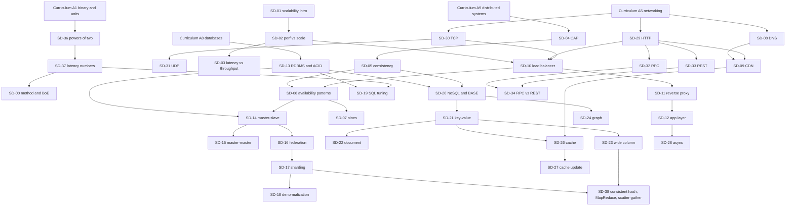

# The System Design Primer Companion — GCP-Native Edition
Companion to the main course, "The Consolidated Cloud Mastery Curriculum"
Source: [donnemartin/system-design-primer](https://github.com/donnemartin/system-design-primer) (CC BY 4.0) — the full README, all 8 system-design solutions, all 6 object-oriented-design solutions, and the 3 Anki decks. Built September 21, 2026.
Modified on 2026-09-24, when this companion was fitted into the five-part course.

---

## 0. Read this first — how this file complements Curriculum

### 0.1 Standing instruction (for Claude, every session)

**This file is a complement to the main course, not a second curriculum. Read both. Whenever a Curriculum module is taught, also teach every companion concept bound to it (Section 2) in the same session, as one story. Similar, related, and overlapping concepts are stitched together and taught in parallel — never in separate sessions, never twice.**

Why: the primer teaches *what* scalable systems are made of, in vendor-neutral words (load balancer, cache, queue, shard). Curriculum teaches *which real cloud resources* those words become, and the exam-grade judgment around them. Industry builds high-scale systems out of cloud resources, so every primer concept must arrive with its GCP resource attached — and every GCP resource should arrive with the primer's trade-off reasoning attached.

### 0.2 Stitching rules

1. **One concept, one teaching.** Where both files cover the same idea (L4 vs L7 load balancing, CAP, least privilege, queues, Big-O, TLS, replication), teach it once, in the Curriculum module that owns it. This file adds the *system-design layer*: trade-offs and disadvantages, numbers, interview framing, and the GCP resource. Later sessions refer back; they don't re-teach.
2. **Every concept gets a GCP lens the moment it is taught**, at three depths:
   - **Lens-1 (name it):** name the GCP resource, say why it is the answer, show one `gcloud`/console/Terraform line. Used throughout Phases 0–3.
   - **Lens-2 (touch it):** hands-on inside Lab Reality (free tier, a slice of the $300, a local emulator, or `terraform plan`).
   - **Lens-3 (design with it):** cert-depth trade-offs and limits. Phase 4 onward, alongside the PCA/PMLE/Data/Network/Database/DevOps material.
3. **AWS and Azure names come from Curriculum Part VIII — don't teach three times.** The primer's own examples are AWS-flavoured (S3, RDS, ELB, CloudFront, ElastiCache, SQS, Route 53, DynamoDB, Redshift, CloudWatch); every concept below translates them to GCP, and Part VIII gives the Azure side.
4. **Order and pacing belong to Curriculum** (Phase plan, Part X, "skip ahead" rights). **SD content and problems belong to this file.** On a conflict, Curriculum wins on order, Lab Reality, and exam time-sensitivity; this file wins on system-design content.
5. **Problems are checkpoints, not detours.** Run a problem from the ladder (Section 4.5) only when its prerequisite gate is met (Section 4.3). A problem session introduces at most one new concept and otherwise integrates what is already learned.
6. **Tracking is inline.** Tick the `- [ ]` box on a concept or problem in this file, or say "done" in chat. Do **not** create a separate tracker, log, or research file.
   *Exception:* the tutor's progress ledger (main course §0.1) is a running record beside these boxes, not a separate tracker; the inline `- [ ]` ticks remain authoritative.
7. **Honesty flags.** `(verify)` marks a GCP detail that changes often or that I could not confirm here — check the live docs before you rely on it for an exam or production. The primer itself is 2017-vintage; where industry has moved on, the concept block says so under **Modern note**.
8. **User can override anything:** skip a concept already known, jump to a specific problem, or go hands-on — same rights as Curriculum Part X.
9. **Read economically.** This file is large by design. Each session read §0 and §2, then only the blocks bound to today's Curriculum module (search by ID: `SD-10`, `SX-05`, `P02`…). Do not reload the whole file, and do not copy its contents into other files.

### 0.3 How one stitched session runs

1. **Anchor** — announce the Curriculum module and list the companion concepts bound to it (Section 2).
2. **Concept** — teach the shared idea once (Curriculum depth) and layer the primer's trade-offs and disadvantages on top.
3. **GCP lens** — the resource(s), Lens-1 always, Lens-2 when Lab Reality allows.
4. **Numbers** — one back-of-the-envelope calculation using Appendix 6.1–6.3.
5. **Micro-problem** — apply the concept to a ladder problem, or to the "Users+" step of P08 that introduces it.
6. **Check** — the concept's check questions; the user answers before I explain.
7. **Close** — tick the boxes in both files' sense (Curriculum module + companion concepts).

When other companions bind to the same session, the Suite Session Protocol (rule 0.4.2 in §0.6) governs.

### 0.4 Notation

- `SD-nn` — primer concept modules (Section 3A). `SX-nn` — techniques embedded in the primer's solutions (Section 3B).
- `P01–P08` — primer system-design problems with solutions. `O01–O07` — object-oriented-design problems. `Q01–Q23` — the primer's "additional questions" (references only, no solution in the repo).
- `A1…A11, B1…B5, C1…C7, D1…D4` — Curriculum module IDs. `Part V` = Curriculum's GCP service map.
- `V-COMP, V-STOR, V-NET, V-DATA, V-AI, V-SEC, V-OPS` — the main course's Part V service-map categories.
- Binding notation: `SD-21@A8` primary · `SD-21[hash-table slice]@A4` slice · `SD-21~C2` recall. §2 is the single source; the header stitches and §4.5 agree with it.
- Primer numbers ("primer:") are quoted from the primer; GCP details are mine and carry `(verify)` where needed.

### 0.5 Learner teaching preferences (binding)

- **Check questions must be woven into the concept explanation itself**, not asked as separate "what do you already know" diagnostics — the learner explicitly opted out of background-probing questions and asked for calibration to happen through how they handle the material.
- **"Maintain curriculum depth and academic rigour"** has been repeated multiple times as an explicit standing instruction — do not compress, simplify, or skip the "why," even under time pressure or a fast pace of correct answers.
- When companion-file content (system-design-primer, SQL, design-patterns) overlaps a main-course module, **teach it once, stitched into the same session** — never as a separate pass, per each companion's own §0.2 stitching rules.
- If a companion file references module IDs that don't exist in the main course (as the SQL companion's did before its IDs were rebound), **say so plainly rather than forcing a silent, possibly-wrong mapping** — this was well received when done for the SQL companion.

### 0.6 Suite Teaching Contract and Lab Safety (same text in every part)

The main course's §0.4 and §0.5, copied whole so that this companion can be taught on its own terms. The rule numbers stay the main course's (0.4.1…0.4.10, and the five Lab Safety rules), so "main course §0.4.3" and rule 0.4.3 here are the same rule. The **progress ledger** named below is the tutor's running record beside the inline boxes (main course §0.1): each ID's mastery state, the misconception register, the errata list, the recorded overrides and wrong predictions, and the exact resume point. The inline `- [ ]` boxes stay authoritative.

**Suite Teaching Contract (main course §0.4).**

One contract for every part; each companion carries the same contract in its own §0 and adds its session detail. When two rules conflict, the higher one wins: (1) the learner's explicit instruction in the current chat · (2) the learner teaching preferences (§0.5 here) · (3) the main course on order, cert timing and Lab Reality · (4) the owning part on its content (main course §0.3) · (5) the companions' defaults.

**0.4.1 Rhythm.**

- One concept per turn, at full depth. New material is taught by direct explanation; procedures by worked, parallel examples.
- Every turn carries exactly one focused question, embedded in the teaching. Diagnosis happens through those checks; there is no separate probing (the learner preferences in §0.5 rule out separate calibrating questions). A turn may be as long as one concept needs.
- Correction style: confirm the correct part explicitly, then sharpen the imprecise part by naming the exact mechanism. No false praise. Hold the line under "just tell me"; give a foothold when the learner is genuinely stuck.
- Overrides: the learner may skip (after passing the skip-test), jump, or go hands-on. Every override is recorded in the ledger so the prerequisite check can flag what was skipped.

**0.4.2 Suite Session Protocol.** When several files bind to one module, the session runs:

1. **Anchor** — list the bound IDs from *all* files (each companion's §2).
2. **Concept** — taught once, by the owner in main course §0.3.
3. **Layers**, in fixed order: system design (primer) → SQL/engine → patterns → Go implementation (Go companion) → attacker/crypto (cyber).
4. **GCP lens.**
5. **One Numbers step** for the whole session.
6. **One application item**: a primer micro-problem *or* a companion exercise card, never both for the same concept.
7. **Checks**, woven in per §0.5.
8. **Close**, ticking boxes in every file (§0.4.8).

**0.4.3 Exercise progression.** The first five rungs of the ten-rung ramp (anchor, vocabulary, representation, core move, worked illustration) are the teaching turns. Exercises then climb, one item per turn, advancing only when the current rung is passed: basic unseen check → routine variation → mixed transfer (the new idea plus exactly two earlier mastered ideas) → top-rung challenge → reflection (the learner explains back or invents an example).

**0.4.4 Predict → run → discrepancy.** Every exercise with a result shape, row count, plan shape, isolation outcome or attack outcome starts with a one-line prediction. Then run. A wrong prediction is recorded in the ledger and taught from.

**0.4.5 Mastery states.** Every ID is `not-started` → `in-progress` → `taught` (explained, first check answered) → `mastered` (passed a rung-3 or rung-4 item, or the skip-test). It may also be `shaky` (missed a check after teaching), `unverified` (claimed done without evidence) or `sliced` (only a named slice taught). Taught and mastered IDs get one-question recalls woven into later relevant sessions at about +1, +3, +7 and +21 sessions; a missed recall sets `shaky` and re-teaches only the gap. The misconception register lives in the ledger; checks probe each entry until two consecutive correct answers retire it.

**0.4.6 Anchoring and suite-wide Prop Lock.** No term, product or control is used in an explanation, example or check unless it is anchored: taught this session, or at least `taught` on the ledger. A named-but-not-taught mention is allowed only when labelled "we'll cover this in X". A check that relies on unanchored terms is invalid: fix the check; don't mark the learner shaky.

**0.4.7 Check questions and exercise pre-flight.** A check tests mechanism or application, asks one thing (split a multi-part check across turns), is answerable from anchored material, has a written expected answer and at least one expected wrong answer in the owning file's keys, is precision-sensitive, and is never answered by the tutor in the same turn. Before issuing any exercise the tutor checks: internal consistency (for example, a CNAME never points at an IP) · every term anchored · exactly one question · the answer derivable from what was taught · any numbers computed. The tutor is precise about mechanisms and says explicitly when unsure. An error found later is corrected openly in the next turn and logged in the errata list of the progress ledger.

**0.4.8 Pacing, checkpoints and session close.** Each module is budgeted at roughly 3–5 concepts per session at full depth; an over-budget module is split into teaching blocks. The budget is a plan, never a reason to compress depth. A problem or checkpoint runs only when all its must-know IDs are at least `taught`, and it introduces at most one new concept. Every session ends by: (1) marking every ID bound to the session taught / sliced / deferred-with-reason / recalled (nothing left unmarked); (2) updating mastery states and the recall schedule; (3) updating the misconception register; (4) adding any errata; (5) emitting a ledger delta block (and a full ledger every 5th session or on request); (6) naming the exact resume point and any open question, verbatim.

**0.4.9 Implementation language: Go.** Go is the suite's language for application code: services, build labs that write a program, and capstones. Python stays the first language of A3, the language of Track D's machine-learning work, and the language of labs already written in Python (the SQL companion's lab kit, the "Python twin" that some labs name). Go is taught by the Go Language Companion: its language core (GO-01…GO-14) is the Go block of A3, and its later modules bind where they are first used. Four rules:

1. **Syntax unlock** — rule 0.4.6 applied to code. A Go construct appears in an explanation, a lab or a check only once the GO module that unlocks it is at least `taught`; before that, the lab runs in Python or waits, and the construct is named only as "we'll cover this in GO-nn". The first use of each construct carries its unlock block: signature → semantics → runtime and memory → contrast with Python, Java, C or JavaScript, naming the bug the other habit causes in Go.
2. **Lab acceptance** — Go lab code is accepted when `gofmt -l` prints nothing, `go vet ./...` is clean, the tests pass (under `go test -race` from GO-19 on; the race detector needs cgo), no error is silently dropped, and every goroutine the code starts has a way to be stopped.
3. **Version honesty** — the baseline release is the one the learner's own module declares. A behaviour is taught as fact only when it has been run on the installed release; anything else carries `(verify)`. The go command downloads modules, and whole toolchains when a module's `go` line is newer than the installed release: name what a step will fetch before running it.
4. **Involved problem** — every GO module ends with one involved problem: a program the learner designs and writes alone, aimed at the module's hardest idea, with its rubric kept in the Go companion's keys and shown only after submission. It is the module's top-rung challenge (rule 0.4.3), so a GO module is `mastered` only when its problem passes its rubric or its skip-test passes (this tightens rule 0.4.5 for GO modules). It is a project across several turns, not a check: hints come only when asked, one at a time, and the tutor never writes the solution.

**0.4.10 Academic depth (undergraduate prerequisites).** The course teaches every undergraduate prerequisite of cloud and system architecture at the depth of a university course, not only at the engineering depth of a first pass. Each Track A module, and each companion, carries an **academic pass**: formal definitions, theorems with their proofs or proof sketches, derivations, named readings, and a numbered problem set whose written keys (an expected answer and at least one expected wrong answer, rule 0.4.7) sit in the owning part's keys. The University and textbook alignment table (main course §0.6) says which university courses and textbooks each pass is aligned with. Four rules:

1. **Two passes, one module.** The engineering pass comes first. The academic pass follows under the same module ID, as its own teaching blocks (rule 0.4.8), never as a separate course. A "first-pass scope" note limits the first pass only.
2. **Proof standard.** A claim presented as a theorem is proved in the session, set as a proof problem, or labelled "stated without proof", naming where the proof is found. Derivations show every step, and every number is computed, not asserted.
3. **Problem sets are exercises.** They climb the ramp (rule 0.4.3). An academic block is `mastered` only when at least one proof problem and one computational problem in it pass against their keys (this tightens rule 0.4.5 for academic blocks).
4. **Readings are named, not linked.** A text is cited by author, title and edition; a course by institution and course name. Editions and course numbers change, so the alignment table carries its check date, and anything not checked carries `(verify)`.

**Lab Safety (main course §0.5).**

One rule set for every file; it unifies the cybersecurity companion's rule 10, the SQL companion's rule 10 and the main course's Lab Reality paragraph.

1. **Hard bans:** no scanning of third parties; no malware; no live DDoS; no credential stuffing against real accounts; fixtures on localhost or disposable projects only; crypto through vetted libraries only.
2. **Money and time:** local first (Docker Postgres, local fixtures). Credit-using services are created for one lab and destroyed the same day, with a budget alert set before the first apply.
3. **Secrets and data:** never put a password, key or real customer data in a query, a prompt or a course file. Lab data is synthetic.
4. **The workplace console is read-only:** look, never create or change.
5. **Every lab carries a Lab Reality tag:** `[free-tier]` · `[credit ~$X]` · `[plan-only]` · `[paper]` · `[local]`.

---

## 1. Coverage ledger — every part of the primer, and where it lives here

| Primer content | Covered in |
|---|---|
| Motivation · Study guide (short/medium/long) · Anki decks · Interactive Coding Challenges | §0, §4.5, §6.7 |
| How to approach a question (4 steps) · back-of-the-envelope | SD-00 |
| System design topics: start here (Harvard scalability lecture, "Scalability for Dummies": clones, databases, caches, asynchronism) | SD-01 |
| Performance vs scalability · Latency vs throughput | SD-02 · SD-03 |
| CAP theorem (CP, AP) · Consistency patterns (weak, eventual, strong) | SD-04 · SD-05 |
| Availability patterns (fail-over active-passive/active-active, replication) · Availability in numbers (3 nines, 4 nines, sequence vs parallel) | SD-06 · SD-07 |
| DNS · CDN (push, pull) | SD-08 · SD-09 |
| Load balancer (L4, L7, horizontal scaling) · Reverse proxy · Application layer (microservices, service discovery) | SD-10 · SD-11 · SD-12 |
| RDBMS + ACID · master-slave · master-master · federation · sharding · denormalization · SQL tuning | SD-13 … SD-19 |
| NoSQL + BASE · key-value · document · wide column · graph · SQL or NoSQL | SD-20 … SD-25 |
| Cache (client, CDN, web server, database, application; query-level vs object-level) · cache-aside, write-through, write-behind, refresh-ahead | SD-26 · SD-27 |
| Asynchronism (message queues, task queues, back pressure) | SD-28 |
| Communication: HTTP · TCP · UDP · RPC · REST (incl. HATEOAS, from the Anki deck) · RPC vs REST table | SD-29 … SD-34 |
| Security | SD-35 |
| Appendix: powers of two · latency numbers | SD-36 · SD-37 · §6.1–6.2 |
| "Under development": consistent hashing, MapReduce / distributed computing, scatter-gather | SD-38 |
| Techniques embedded in the 8 solutions (short-link hashing, fan-out, reverse index, crawler frontier, MapReduce jobs, LRU, sharded BFS, budget/categorizer…) | SX-01 … SX-13 |
| 8 system-design solutions: Pastebin/Bit.ly · Twitter · web crawler · Mint · social graph · query cache · sales rank · scale-to-millions on AWS | P01 … P08 |
| 6 OOD solutions (hash map, LRU cache, call center, deck of cards, parking lot, online chat) + "circular array" placeholder | O01 … O07 |
| 23 "additional system design interview questions" | Q01 … Q23 |
| 17 real-world architectures (MapReduce, Spark, Storm, Bigtable, HBase, Cassandra, DynamoDB, MongoDB, Spanner, Memcached, Redis, GFS, HDFS, Chubby, Dapper, Kafka, Zookeeper) | SD-39 · §6.4 |
| 23 company architectures · 40 engineering blogs | §6.5 · §6.6 |

Counts verified against the repo: 8 + 6 solved problems, 23 additional questions, 17 real-world architectures, 23 company architectures, 40 blogs, 42 + 8 + 6 Anki notes (the only card not in the README is *What is HATEOAS?* — included in SD-33).

---

## 2. Stitch table — teach these together

Each Curriculum module on the left is taught **with** the companion concepts on the right, in the same session (Section 0.2 rule 1). "Checkpoint" is the problem to run once that module and its stitched concepts are done.

Columns: PRIMARY = the session that teaches the concept in full; slices = one named ingredient taught earlier (or a continuation after); recalls = a one-line reference back; also in this session = the problem-level work (and, for V rows, the Lens-3 service wording) that rides in the same session.

| Curriculum module | Taught in full here (PRIMARY) | Slices and forward pointers | Recalls | Also in this session | Checkpoint |
|---|---|---|---|---|---|
| **A1** Digital logic & data representation | SD-36, SD-37 | — | — | — | — |
| **A2** Math for cloud & ML | SD-00 | SD-02[proportional-scaling arithmetic] · SD-03[throughput/latency arithmetic; Little's law sizing] · SD-07[availability math: series vs parallel, nines] · SD-28[Little's law] · SX-02[62^7 key-space math] | — | SD-00 back-of-envelope drills | BoE drills on P01 |
| **A3** Programming foundations | — | SD-21[dict as a hash table] · SD-27[cache-aside code] · SD-32[RPC calls in Python] · SD-33[REST calls in Python + curl] · SD-34[REST vs RPC calls in Python + curl] · SX-02[Base62 code] | — | all O-problems' Python | — (O01, O02 move to the A4 recall checkpoints) |
| **A4** Data structures & algorithms | SX-11 (via O02) | SD-19[B-tree index slice] · SD-21[hash-table slice] · SD-24[graph representation slice] · SD-38[consistent-hash ring slice (SD-38a)] · SX-07[heaps/sorted sets] · SX-09[heaps] · SX-10[BFS slice] | — | — | O01, O02, O07 — recall checkpoints, run as practice, not re-teaching |
| **A5** Computer networking | SD-08, SD-29, SD-09, SD-30, SD-10, SD-11, SD-31 | SD-01[clones + single-box ceiling slice] · SD-02[performance-vs-scalability slice] · SD-06 *(named only: P08 Users++ networking slice)* · SD-12 *(named only: P08 Users++ networking slice)* · SD-26[HTTP-layer caching slice: client/browser cache, Cache-Control/ETag, CDN-as-cache, reverse-proxy cache] · SD-35[transit-encryption slice (TLS in transit)] | — | — | P08 *Single box* step (SD-08 + the P08 network hardening → NT-01, NT-05) and the *Users++* networking slice (SD-09, SD-10, SD-11); SD-06 → A9 and SD-12 → A7 are named, not taught |
| **A6** Linux & OS | SD-01, SX-12 (via P08) | SD-19[profiling tools] · SD-30[connection and file-descriptor limits] | SD-37~ (memory/disk numbers) | — | P08 step 0 (the single-box OS view), then the full P08 first pass (outline) |
| **A7** Software architecture & APIs | SD-12, SD-28, SD-32, SD-33, SD-34 | SD-16[functional partitioning as service decomposition] | SD-02~ · SD-29~ | — | P01, O03 (after DP-18 + DP-16 State), O04, O05 (after F-01…F-04 + PR-01…PR-05 SOLID), O06 |
| **A8** Databases & data modeling | SD-04, SD-13, SD-19, SD-20, SD-21, SD-22, SD-23, SD-24, SD-26, SX-01 (via P01), SX-02 (via P01), SX-03 (via P01), SX-04 (via P01) | SD-05[strong vs eventual consistency as the C in CAP] · SD-14 *(named only)* · SD-15 *(named only)* · SD-16[split databases by function: schema view] · SD-17 *(named only)* · SD-18[denormalization as the inverse of normalization] · SD-25[SQL-vs-NoSQL decision lists, family level] | — | — | P01, P04 |
| **A9** Distributed systems theory | SD-05, SD-06, SD-07, SD-14, SD-15, SD-16, SD-17, SD-18, SD-25, SD-27, SD-38, SD-39 | SD-04[formal limits + PACELC] | SD-20~ (BASE ↔ eventual consistency) · SD-23~ | — | P05, P06 |
| **A10** Security & crypto | SD-35 | — | — | — | P04 (credential storage) |
| **A11** Software delivery | — | — | SD-00~ (iterative loop: benchmark → profile → fix → repeat) | P08 "automate DevOps" step | — |
| **B1** What is cloud computing | — | — | — | P08 (why managed services beat self-run at each step) | P08 |
| **B2** Virtualization & containers | — | — | SD-01~ (clones) · SD-10~ (horizontal scaling from identical images) | — | — |
| **B3** Architecture patterns & Well-Architected | SD-02, SD-03 | — | SD-00~ · SD-06~ (active-passive ≈ warm standby/pilot light; active-active ≈ multi-site) · SD-07~ · SD-10~ (vertical vs horizontal) | P08 walk-through | P08 |
| **B4** Cloud economics & FinOps | — | — | SD-09~ (CDN cost vs origin cost) · SD-26~ (cache vs DB cost) · SX-01~ (storage tiering) | autoscaling savings (P08 "Users++++") | P07 |
| **B5** Cloud IAM concepts | — | — | SD-12~ (service-to-service auth) · SD-35~ (least privilege) | — | — |
| **C1** Docker | — | — | SD-01~ (clones) · SD-10~ (stateless servers) | — | — |
| **C2** Kubernetes | — | — | SD-10~ (Service/Ingress = L4/L7; HPA) · SD-11~ · SD-12~ (Services, CoreDNS) · SD-14~ (StatefulSet ↔ stateful tier) · SD-21~ (StatefulSet ↔ stateful tier) | P08 autoscaling (HPA) | P08, P06 |
| **C3** NGINX | — | — | SD-10~ · SD-11~ (reverse proxy in NGINX) · SD-12~ · SD-26~ (NGINX/Varnish web-server cache) · SD-29~ · SD-35~ (TLS termination) | — | P01 |
| **C4** CI/CD | — | — | SD-00~ (iterative delivery) · SD-06~ (blue-green/canary ↔ active-active/passive) | — | — |
| **C5** IaC (Terraform) | — | — | — | every P-problem's reference architecture (Section 5) as a `terraform plan` exercise | P01, P08 |
| **C6** Observability | — | — | SD-03~ (tail latency) · SD-19~ (benchmark/profile) · SD-37~ · SD-39~ (Dapper) | P08 monitoring list (host, aggregate, logs, external, alerts, errors) | P08 |
| **C7** SRE principles | — | — | SD-03~ (percentiles) · SD-06~ (fail-over) · SD-07~ (nines ↔ SLO/error budget) · SD-28~ (back pressure/retries) | — | P08, Q19 |
| **D1** Classical ML | — | — | — | Q07 recommendation system · Q16 trending topics (score models) | Q07 |
| **D3** MLOps | — | — | — | Q07 feature store, batch vs online serving | Q07 |
| **D4** GenAI, embeddings, RAG | SX-06 (via Q02) | — | — | SX-06 reverse index ↔ embeddings/vector index · Q02 search engine · Q14 graph search | Q02, Q14 |
| **V-COMP** Part V — Compute (GCE, GKE, Cloud Run, App Engine, Functions) (Lens-3 in Phase 4) | — | — | SD-01~ · SD-10~ (MIG + autoscaling) · SD-12~ · SD-28~ (workers) · SD-39~ | SD-01, SD-10 (MIG + autoscaling), SD-12 microservices, SD-28 workers | P08 |
| **V-STOR** Part V — Storage/DB (Lens-3 in Phase 4) | — | — | SD-13~ · SD-14~ · SD-15~ · SD-16~ · SD-17~ · SD-18~ · SD-19~ · SD-20~ · SD-21~ · SD-22~ · SD-23~ · SD-24~ · SD-25~ · SD-26~ · SD-27~ · SD-39~ · SX-01~ | SD-13 … SD-27, SX-01 | P01, P04, P06 |
| **V-NET** Part V — Networking (Lens-3 in Phase 4) | — | — | SD-08~ · SD-09~ · SD-10~ · SD-11~ · SD-30~ · SD-31~ · SD-39~ | SD-08, SD-09, SD-10, SD-11, SD-30/31 | P08 |
| **V-DATA** Part V — Data/Analytics (Lens-3 in Phase 4) | — | — | SD-28~ (Pub/Sub) · SD-38~ (MapReduce → Dataflow/Dataproc) · SD-39~ · SX-03~ (log analytics → BigQuery) · SX-08~ (log analytics → BigQuery) | SD-28 (Pub/Sub) · SD-38 MapReduce → Dataflow/Dataproc · SX-03/08 log analytics → BigQuery | P07, P04 |
| **V-AI** Part V — AI/ML (Lens-3 in Phase 4) | — | — | SD-39~ | Q07, Q02 | Q07 |
| **V-SEC** Part V — Security (Lens-3 in Phase 4) | — | — | SD-35~ · SD-39~ | SD-35 | — |
| **V-OPS** Part V — Ops/DevOps (Lens-3 in Phase 4) | — | — | SD-00~ (the SD-00 loop) · SD-19~ · SD-39~ | SD-19, SD-00 loop, P08 | — |
| **PCA / Data Eng / Network Eng / Database Eng / DevOps / Developer certs** | — | — | — | PCA: all P-problems are constraint→trade-off drills (matches "which trade-off is correct"). Data Eng: SD-28, SD-38, P04, P07, Q16, Q18. Network Eng: SD-08–SD-11, SD-30/31, Q15. Database Eng: SD-13–SD-25, P05, Q05, Q17, Q19. DevOps: SD-07, SD-19, SD-28, P08. Developer: SD-26–SD-28, SD-32–SD-34 | Phase 4 |
| **Part VI AWS / Part VII Azure** | — | — | — | The primer's own AWS wording is the AWS-track reference: P08 is literally the AWS build. When Phase 6/7 arrives, re-run P08 with Part VIII names — no new concepts needed | P08 (AWS), P08 (Azure) |

### 2.1 Overlap register — concepts that appear in both files (teach once, here)

Suite-wide ownership lives in the register in the main course §0.3 (which also carries the v1.1 rows for PACELC, cache stampede, tail latency, Little's law, consistent hashing, CRDTs, sketches, unique IDs, GC, event sourcing and credential storage). This table is the primer's slice of it; on a conflict §0.3 wins.

| Concept | Owner (teach here) | Companion adds |
|---|---|---|
| L4 vs L7 load balancing, algorithms | Curriculum A5 | SD-10: SSL termination, session persistence, LB failover, disadvantages |
| Reverse proxy vs forward proxy | Curriculum A5 / C3 | SD-11: benefits list, LB-vs-RP decision rule |
| DNS record types | Curriculum A5 | SD-08: TTL staleness, weighted/latency/geo routing, DNS-as-SPOF |
| TCP vs UDP | Curriculum A5 | SD-30/31: when-to-use rules, connection pooling |
| Message queues / event-driven | Curriculum A7 | SD-28: task queues, back pressure, delivery semantics |
| REST / gRPC | Curriculum A7 | SD-32/33/34: RPC-vs-REST decision, HATEOAS |
| ACID, NoSQL families, CAP | Curriculum A8 / A9 | SD-13…SD-25: scaling techniques, SQL-vs-NoSQL decision lists |
| Replication, sharding, consensus | Curriculum A9 | SD-06, SD-14, SD-15, SD-17, SD-38 |
| Availability vs durability, nines | Curriculum A9 / C7 | SD-07 tables and series/parallel formulas |
| HA, horizontal vs vertical scaling, DR | Curriculum B3 | SD-06, SD-10, P08 walk-through |
| Least privilege, encryption | Curriculum A10 / B5 | SD-35 checklist |
| Big-O, hash lookup, indexes | Curriculum A2 / A4 | SD-19 index trade-offs, SX-11 |
| Observability, SRE | Curriculum C6 / C7 | P08 monitoring list, back pressure |
| Autoscaling (HPA, MIG) | Curriculum C2 / V-COMP | P08 "Users++++" |

---

## 3. The concept curriculum

### 3A. Primer concept modules (SD-00 … SD-39)

Format per module: **Primer** (what the primer teaches) · **Trade-offs** (its disadvantages/limits) · **GCP lens** · **Lab** (inside Lab Reality) · **Check** (answer before I explain). Tick the box when the module is taught *and* the check questions are answered.

#### SD-00 · The interview method + back-of-the-envelope — stitch: A2 (primary) · recall: A11, B3, C4, V-OPS
- [ ] done
- **Primer:** four steps. (1) Outline use cases, constraints, assumptions: who uses it, how, how many users, what it does, inputs/outputs, data volume, requests per second, read:write ratio. (2) High-level design: sketch components and connections, justify. (3) Design core components (for a URL shortener: hash + store, MD5/Base62, collisions, SQL vs NoSQL, schema, lookup, API/OOD). (4) Scale: find bottlenecks (load balancer, horizontal scaling, caching, sharding) and discuss trade-offs. The interview is open-ended and *you* lead it. Study depth by timeline: short = breadth + some problems; medium = breadth + some depth + many problems; long = breadth + more depth + most problems.
- **Trade-offs:** "Everything is a trade-off." Never jump to the final design; iterate benchmark → profile → fix → repeat (P08).
- **GCP lens:** the four steps are the PCA case-study method: requirements → constraints (RTO/RPO, cost, compliance, latency) → service choice → scale/HA/security. Reference diagrams: Google Cloud Architecture Center; the Architecture Framework pillars in Curriculum B3. Lens-1 cost step: Google Cloud Pricing Calculator turns BoE numbers into a monthly bill.
- **Lab:** take P01's numbers (§4.4) and price the design in the calculator; note which line dominates.
- **Check:** Given "design a photo-sharing service", list six clarifying questions and commit to a read:write ratio. Why is "start with the final architecture" a red flag?

#### SD-01 · Scalability: start here — stitch: A6 (primary) · slices: [clones + single-box ceiling slice]@A5 · recall: B2, C1, V-COMP
- [ ] done
- **Primer:** two entry points — Harvard scalability lecture (vertical scaling, horizontal scaling, caching, load balancing, database replication, database partitioning) and "Scalability for Dummies" (clones → databases → caches → asynchronism). Then the high-level trade-offs: performance vs scalability, latency vs throughput, availability vs consistency.
- **Trade-offs:** vertical scaling is simple but expensive with no redundancy; horizontal scaling adds statelessness requirements and downstream connection pressure.
- **GCP lens:** "clones" = identical instances from an instance template in a regional managed instance group (MIG), or identical Cloud Run/GKE replicas from one container image. This is the whole P08 spine in miniature: one Compute Engine VM → MIG behind a load balancer → Cloud SQL + Memorystore → Pub/Sub workers.
- **Lab:** always-free `e2-micro` (eligible US regions, `verify` current free-tier terms) running nginx + local Postgres; note CPU/RAM/disk limits — this is the "single box" of P08.
- **Check:** What makes a server a "clone"? Name two things that must move off the box before you can add a second one.

#### SD-02 · Performance vs scalability — stitch: B3 (primary) · slices: [proportional-scaling arithmetic]@A2, [performance-vs-scalability slice]@A5 · recall: A7
- [ ] done
- **Primer:** a service is *scalable* if performance increases proportionally with resources added (more units of work, or larger units of work as data grows). Performance problem = slow for a single user. Scalability problem = fast for one user, slow under load.
- **Trade-offs:** you can fix a performance problem and still have a scalability problem, and vice versa.
- **GCP lens:** performance → per-request latency in Cloud Trace (Curriculum C6); scalability → behaviour under load in Cloud Monitoring while autoscaling (MIG autoscaler, Cloud Run instance scaling, GKE HPA).
- **Lab:** deploy a hello-world Cloud Run service (always-free tier), run a load test (`hey` or `k6` locally), watch instance count and p95 latency; then set `--max-instances=1` and watch the scalability wall appear.
- **Check:** A page takes 4 s for one user and 4 s for 10,000 users — which problem is that? What if it takes 0.2 s and 30 s respectively?

#### SD-03 · Latency vs throughput — stitch: B3 (primary) · slices: [throughput/latency arithmetic; Little's law sizing]@A2 · recall: C6, C7
- [ ] done
- **Primer:** latency = time to perform an action; throughput = actions per unit time. Aim for maximal throughput with acceptable latency.
- **Trade-offs:** batching raises throughput and hurts latency; concurrency per instance does the same.
- **GCP lens:** use percentiles, not averages — Cloud Monitoring distribution metrics; Cloud Load Balancing exposes backend and total latency; Cloud Run `--concurrency` and Pub/Sub batching are literal latency↔throughput dials; BigQuery streaming inserts (low latency) vs batch load jobs (high throughput, cheap).
- **Lab:** Cloud Run with `--concurrency=1` vs `80` under the same load test; record p50/p99 and cost-per-request intuition.
- **Check:** Why does Little's law (L = λW) say concurrency needed = arrival rate × latency? Size a service for 400 rps at 250 ms.

#### SD-04 · CAP theorem — stitch: A8 (primary) · slices: [formal limits + PACELC]@A9
- [ ] done
- **Primer:** in a distributed system you can have only two of Consistency (every read gets the latest write or an error), Availability (every request gets a non-error response, maybe stale), Partition tolerance (keeps operating despite network splits). Networks aren't reliable, so partition tolerance is mandatory — you choose CP or AP. **CP:** may time out waiting on a partitioned node; good when you need atomic reads/writes. **AP:** returns the most available version, reconciles later; good for eventual consistency or when the system must keep working.
- **Trade-offs:** the choice is per data type, not per company — the same system may be CP for balances and AP for view counters.
- **GCP lens:** Spanner is CP by design (Paxos-replicated, externally consistent) and buys availability with redundancy and a private global network (99.999% multi-region SLA `verify`); Firestore is strongly consistent; Bigtable is strongly consistent within one cluster and eventually consistent across replicated clusters (multi-cluster routing = AP-style); Cloud Storage gives strong read-after-write and listing consistency; Pub/Sub is at-least-once by design. *Modern note:* PACELC (latency vs consistency when there is *no* partition) is the more useful everyday lens — my addition, not the primer's.
- **Lab:** Bigtable emulator + Spanner emulator (`gcloud emulators`) — read the docs' consistency sections and write down the CAP position of each.
- **Check:** Your shopping cart must accept writes during a regional outage; your payment ledger must not. Which store for each and why?

#### SD-05 · Consistency patterns — stitch: A9 (primary) · slices: [strong vs eventual consistency as the C in CAP]@A8
- [ ] done
- **Primer:** with multiple copies of data, choose how to sync them. **Weak:** after a write, reads may or may not see it (best effort) — memcached, VoIP, video chat, real-time games. **Eventual:** reads eventually see it (typically ms); async replication — DNS, email; good for highly available systems. **Strong:** reads always see it; synchronous replication — file systems, RDBMS; good for transactions.
- **Trade-offs:** stronger consistency costs write latency and availability; weaker pushes complexity into the application.
- **GCP lens:** weak = Memorystore cache; eventual = Cloud SQL read replicas (async), Bigtable multi-cluster, Cloud CDN edge copies, DNS caches; strong = Spanner, Firestore, Cloud SQL primary, Cloud Storage. Spanner also offers **stale reads** (exact or bounded staleness) — consistency as a per-query dial.
- **Lab:** Firestore emulator (strong) vs a read replica lag experiment on a short-lived Cloud SQL instance with one replica (`db-f1-micro`/smallest tier; a few dollars of $300 credit).
- **Check:** Which consistency does a "like" counter need? A bank balance? A DNS record after a change?

#### SD-06 · Availability patterns: fail-over and replication — stitch: A9 (primary) · named only: A5 (P08 Users++ networking slice) · recall: B3, C4, C7
- [ ] done
- **Primer:** two complementary patterns. **Active-passive:** heartbeat between active and standby; on loss the passive takes over the active's IP; hot vs cold standby determines downtime; only the active serves traffic (= master-slave fail-over). **Active-active:** both serve; public-facing needs DNS aware of both IPs, internal-facing needs app logic aware of both (= master-master fail-over). Replication (master-slave, master-master) is detailed in SD-14/SD-15.
- **Trade-offs:** more hardware and complexity; possible data loss if the active dies before newly written data replicated.
- **GCP lens:** regional MIG spread across zones with health-check **autohealing** replaces heartbeat + IP takeover; global external Application LB shifts traffic away from unhealthy backends/regions automatically; Cloud SQL **HA** = regional primary + synchronous standby in another zone, automatic fail-over keeping the same IP; cross-region replicas for DR; Cloud DNS failover/weighted policies for DNS-level steering. VPC does not support L2 tricks (VRRP/gratuitous ARP) `verify`, so "take over the IP" becomes LB health checks or API-driven IP reassignment. Map Curriculum B3 DR patterns: backup/restore → cold standby; pilot light/warm standby → active-passive; multi-site → active-active.
- **Lab:** two-VM MIG behind a load balancer (Terraform plan; or apply for an hour) — kill one VM, watch autohealing and zero client errors.
- **Check:** How much data can be lost in active-passive with async replication, and what SLI/SLO term names it (RPO)?

#### SD-07 · Availability in numbers — stitch: A9 (primary) · slices: [availability math: series vs parallel, nines]@A2 · recall: B3, C7
- [ ] done
- **Primer:** availability = uptime %, counted in nines. 99.9% ("three 9s"): 8h45m57s/year, 43m49.7s/month, 10m4.8s/week, 1m26.4s/day. 99.99% ("four 9s"): 52m35.7s/year, 4m23s/month, 1m5s/week, 8.6s/day. **In sequence:** A = A_foo × A_bar (two 99.9% → 99.8%). **In parallel:** A = 1 − (1 − A_foo)(1 − A_bar) (two 99.9% → 99.9999%).
- **Trade-offs:** every hard dependency in series lowers the ceiling; redundancy in parallel raises it but only for independent failures.
- **GCP lens:** SLO = target; error budget = 1 − SLO (99.9% → about 43.8 min/month, Curriculum C7). Compose real published SLAs (Compute Engine multi-zone, Cloud SQL HA, Spanner regional/multi-region, Cloud Storage location types, Cloud Load Balancing) to bound your architecture — `verify` each figure on the live SLA pages; they change.
- **Lab:** compute the composite availability of P01's stack (LB → Cloud Run → Memorystore → Cloud SQL → GCS) in a spreadsheet; then add a second region and recompute.
- **Check:** Five 99.9% components in series ≈ what? Why doesn't two-region redundancy give you 99.9999% in practice?

#### SD-08 · Domain name system — stitch: A5 (primary) · recall: V-NET
- [ ] done
- **Primer:** DNS maps names to IPs. Hierarchical with few authoritative servers at the top; lower servers, routers, ISPs, browsers, OSes cache results for a TTL — so changes propagate slowly. Records: **NS** (name servers), **MX** (mail), **A** (name→IP), **CNAME** (name→name). Managed DNS (CloudFlare, Route 53) can route by **weighted round robin** (maintenance drains, unequal clusters, A/B tests), **latency**, or **geolocation**.
- **Trade-offs:** extra lookup delay (mitigated by caching); management complexity (run by governments, ISPs, large companies); DNS providers are DDoS targets (Dyn, Oct 2016) — a DNS outage makes healthy sites unreachable.
- **GCP lens:** **Cloud DNS** — public and private zones, DNSSEC, routing policies (weighted round robin, geolocation, geofencing, failover — `verify` list), **Cloud Domains** for registration; **Service Directory** for internal service names. Latency-based routing is usually achieved differently on GCP: the global external Application LB exposes a single anycast IP and steers users to the nearest healthy backend, so DNS-level latency routing is rarely needed. In Kubernetes, CoreDNS is the cluster DNS (Curriculum C2).
- **Lab:** `dig +trace example.com`, watch TTLs decay with `dig` twice; optionally one Cloud DNS zone for a few cents.
- **Check:** You lower a record's TTL to 60 s *after* deciding to migrate — why must you have lowered it a full old-TTL earlier?

#### SD-09 · Content delivery network — stitch: A5 (primary) · recall: B4, V-NET
- [ ] done
- **Primer:** a CDN is a globally distributed network of proxy servers serving content close to users (usually static HTML/CSS/JS, photos, video; some support dynamic content); DNS directs clients to an edge. Wins: users get content from nearby data centers, and your servers skip requests the CDN fulfils. **Push CDN:** you upload changes and rewrite URLs; you control expiry; uploads only when new/changed (minimal traffic, maximal storage); fits low-traffic or rarely-changing sites. **Pull CDN:** edge fetches from your origin on first request (slower first hit), TTL controls freshness; minimal storage but redundant pulls if files expire before changing; fits heavy-traffic sites.
- **Trade-offs:** cost at high traffic; staleness until TTL expires; URLs must point at the CDN.
- **GCP lens:** **Cloud CDN** is a pull CDN attached to the global external Application LB (origins: Cloud Storage backend bucket, instance groups/NEGs, external origin); cache modes (`CACHE_ALL_STATIC`, `USE_ORIGIN_HEADERS`, `FORCE_CACHE_ALL`), TTLs, cache keys, signed URLs/cookies, explicit invalidation. **Media CDN** targets large video/download workloads. A "push" style = upload to the Cloud Storage origin and pre-warm. Firebase Hosting bundles a CDN and is the cheapest way to touch one.
- **Lab:** Firebase Hosting site (free plan, `verify` quotas) and read the `Cache-Control`/`Age` headers with `curl -I`; the LB + Cloud CDN version has an hourly forwarding-rule charge — build it, test, delete it in the same hour, or keep it to `terraform plan`.
- **Check:** Pull or push for a 50-page marketing site updated monthly? For a viral video site? What fixes "users still see the old logo"?

#### SD-10 · Load balancer (+ horizontal scaling) — stitch: A5 (primary) · recall: B2, B3, C1, C2, C3, V-COMP, V-NET
- [ ] done
- **Primer:** spreads requests across servers (app servers, DBs) and returns the response to the client: avoids unhealthy servers, avoids overload, removes a single point of failure. Hardware (expensive) or software (HAProxy). Extras: **SSL termination** (no X.509 cert on every server) and **session persistence** (cookie → same instance when the app keeps no session state). Run several LBs active-passive or active-active. Routing metrics: random, least loaded, session/cookies, round robin / weighted round robin, L4, L7. **L4** decides from transport info (IPs, ports; not payload) and forwards packets with NAT. **L7** terminates the connection, reads headers/message/cookies, then opens a connection to the chosen server (e.g. video traffic → video servers, billing → hardened servers). L4 is cheaper than L7 but the gap is small on modern hardware. **Horizontal scaling** (commodity machines) beats vertical for cost, availability, hiring.
- **Trade-offs:** LB can bottleneck if under-provisioned/misconfigured; a single LB is a SPOF, several add complexity; scaling out demands stateless servers (sessions in a DB or Redis/Memcached) and puts more concurrent connections on caches/DBs.
- **GCP lens:** **Cloud Load Balancing** is fully managed and distributed — you don't fail it over, which dissolves most of the "LB is a SPOF" worry. **Application LBs (L7):** global external, regional external, internal; URL maps do the primer's "video vs billing" split (host/path rules → backend services); health checks; backends = MIGs, NEGs (zonal, serverless, internet). **Network LBs (L4):** proxy (TCP/SSL) and passthrough (TCP/UDP, preserves client IP). Session affinity: client IP, generated cookie, header, HTTP cookie. Managed certificates = SSL termination. Attach Cloud Armor for WAF/DDoS. Autoscaling: MIG autoscaler on CPU / LB utilization / custom metric / schedule (Curriculum Part V). AWS ELB/ALB/NLB ↔ Part VIII.
- **Lab:** Cloud Run service behind a global external ALB via a serverless NEG — apply for an hour or `terraform plan` (forwarding rules are billed hourly).
- **Check:** When is L7 mandatory over L4? What breaks when sessions live in server memory and the autoscaler removes an instance?

#### SD-11 · Reverse proxy (web server) — stitch: A5 (primary) · recall: C2, C3, V-NET
- [ ] done
- **Primer:** a web server that centralizes internal services behind one public interface. Benefits: **security** (hide backends, blacklist IPs, limit connections per client), **scalability/flexibility** (clients see only the proxy's IP), **SSL termination**, **compression**, **caching**, **static content** (HTML/CSS/JS, photos, video). Decision rule: a load balancer earns its keep with *multiple* servers doing the same job; a reverse proxy helps even with *one* server; NGINX/HAProxy do both at L7.
- **Trade-offs:** added complexity; a single reverse proxy is a SPOF, several add complexity.
- **GCP lens:** the global external ALB *is* a managed reverse proxy (TLS termination, host/path routing, Cloud CDN caching, Cloud Armor, IAP for identity-aware access). Cloud Run's built-in HTTPS front end is one too. Self-managed: NGINX on GCE/GKE (Curriculum C3), NGINX Ingress. API-facing proxying: API Gateway or Apigee (quotas, keys, transformations). East-west: Cloud Service Mesh (Envoy). Serve static content from Cloud Storage + CDN, not from the app.
- **Lab:** docker compose: NGINX in front of a container — TLS off, gzip on, `proxy_cache` on, `limit_conn` on — then find the equivalent ALB/Cloud Armor setting for each.
- **Check:** You have exactly one app server: still add a reverse proxy? Give three reasons from the primer.

#### SD-12 · Application layer: microservices & service discovery — stitch: A7 (primary) · named only: A5 (P08 Users++ networking slice) · recall: B5, C2, C3, V-COMP
- [ ] done
- **Primer:** separate the web layer from the application (platform) layer so each scales and is configured independently — a new API means more app servers, not more web servers. Single-responsibility principle: small autonomous services (Pinterest example: user profile, follower, feed, search, photo upload). **Microservices** = independently deployable small modular services, each its own process, talking over a well-defined lightweight mechanism. **Service discovery:** Consul, etcd, ZooKeeper keep registered names/addresses/ports; health checks (often an HTTP endpoint) verify integrity; Consul/etcd include a built-in key-value store for config.
- **Trade-offs:** needs a different architecture, ops, and process approach than a monolith; more deployment and operational complexity.
- **GCP lens:** each service = a Cloud Run service (stable HTTPS URL, autoscaled) or a GKE Deployment + Service (discovery via CoreDNS, state in the managed etcd behind the API server — you rarely run Consul/etcd yourself). **Service Directory** is the managed registry across GCP and hybrid; **Cloud Service Mesh** (managed Istio/Envoy; Traffic Director control plane) adds mTLS, retries, traffic splitting. Health checks: LB health checks, Kubernetes liveness/readiness/startup probes, Cloud Run probes. There is **no managed Chubby/ZooKeeper equivalent** — for locks/leader election use Spanner/Firestore transactions, a Redis lock with care, or ZooKeeper/etcd on GKE. Config KV → Secret Manager / Firestore / ConfigMaps.
- **Lab:** two always-free Cloud Run services calling each other with IAM-authenticated invocation (`roles/run.invoker`); mirror it with two containers in docker compose.
- **Check:** Why doesn't a new "photo upload" API force more web servers in a layered design? What does a readiness probe protect against?

#### SD-13 · Relational databases & ACID — stitch: A8 (primary) · recall: V-STOR
- [ ] done
- **Primer:** a relational DB stores data in tables; transactions obey **ACID** — Atomicity (all or nothing), Consistency (valid state → valid state), Isolation (concurrent = as if serial), Durability (committed stays committed). Scaling toolbox: master-slave replication, master-master, federation, sharding, denormalization, SQL tuning (SD-14 … SD-19).
- **Trade-offs:** strong guarantees vs single-node write ceilings; each scaling technique gives something up.
- **GCP lens:** **Cloud SQL** (MySQL, PostgreSQL, SQL Server — backups, PITR, HA, replicas, Auth Proxy/connectors); **AlloyDB** (PostgreSQL-compatible, read pool instances); **Spanner** (relational, horizontally scalable, ACID with external consistency); RDS ↔ Cloud SQL via Part VIII. Connection limits × instance count is the classic Cloud Run + Cloud SQL trap (see SD-30 pooling).
- **Lab:** local Postgres/MySQL in Docker (free): open two `psql` sessions, reproduce dirty/non-repeatable reads by lowering isolation, then fix with a stricter level.
- **Check:** A crash between "debit A" and "credit B" with no transaction — which ACID letter failed? Which two are hardest to keep when you shard?

#### SD-14 · Master-slave replication — stitch: A9 (primary) · named only: A8 · recall: C2, V-STOR
- [ ] done
- **Primer:** the master serves reads and writes and replicates writes to slaves that serve reads only (slaves can chain to other slaves). If the master dies, the system stays read-only until a slave is promoted or a new master provisioned. (Modern terms: primary/replica.)
- **Trade-offs:** promotion logic needed; data loss if the master fails before replicating; replicas replaying heavy writes serve fewer reads; more replicas = more lag; a master can write in parallel threads while a replica applies single-threaded; more hardware and complexity.
- **GCP lens:** Cloud SQL **read replicas** (asynchronous; same-region and cross-region; promote to standalone primary for DR); the HA standby is *not* a read replica — it exists for fail-over. AlloyDB read pool; Spanner read-only replicas in multi-region configs. Read/write splitting is your app's or a proxy's job (`verify` current managed options). Watch **replica lag** in Cloud Monitoring.
- **Lab:** short-lived Cloud SQL primary + one replica; generate write load; graph replica lag; promote it.
- **Check:** Why can adding read replicas make lag worse? What is the cost of promoting a lagging replica (RPO)?

#### SD-15 · Master-master replication — stitch: A9 (primary) · named only: A8 · recall: V-STOR
- [ ] done
- **Primer:** both masters serve reads and writes and coordinate on writes; if either fails, reads and writes continue.
- **Trade-offs:** need an LB or app logic to choose where to write; most systems are loosely consistent (violating ACID) or pay extra write latency for synchronisation; conflict resolution grows harder with more writers and higher latency; plus all replication disadvantages from SD-14.
- **GCP lens:** Cloud SQL has no multi-primary mode. GCP's multi-writer answers: **Spanner** multi-region (writes go through Paxos; strong consistency, paid for in commit latency), **Bigtable multi-cluster routing** (any cluster accepts writes; last-write-wins by timestamp), **Firestore** multi-region. DIY bidirectional relational replication is possible but is your conflict-resolution problem.
- **Lab:** read Bigtable's replication/app-profile docs and Spanner's multi-region config docs; sketch on paper what happens to two simultaneous writes to one key in each.
- **Check:** Two masters take conflicting updates to one row at the same instant — name three ways to cope and what each sacrifices.

#### SD-16 · Federation (functional partitioning) — stitch: A9 (primary) · slices: [functional partitioning as service decomposition]@A7, [split databases by function: schema view]@A8 · recall: V-STOR
- [ ] done
- **Primer:** split databases by function (forums, users, products) instead of one monolith → less read/write traffic and replication lag per DB, smaller DBs fit in memory (better cache locality), no central master serializing all writes (parallel writes, higher throughput).
- **Trade-offs:** useless if one function/table is huge; app must know which DB to hit; cross-DB joins are hard (server links); more hardware and complexity.
- **GCP lens:** one Cloud SQL instance/database per bounded context — the data-side twin of SD-12 microservices. Cross-DB joins → app-side joins, or export to BigQuery for analytics. *Terminology trap:* BigQuery "federated queries" query external sources; the primer's "federation" means functional partitioning.
- **Lab:** docker compose with two Postgres containers (`users`, `orders`); implement an app-side join and note what you lost.
- **Check:** What does federation give you that read replicas do not?

#### SD-17 · Sharding — stitch: A9 (primary) · named only: A8 · recall: V-STOR
- [ ] done
- **Primer:** spread data across databases, each owning a subset; add shards as users grow. Like federation: less traffic, less replication, more cache hits; smaller indexes speed queries; one shard down ≠ everything down (add replication to avoid loss); parallel writes. Typical keys: last-name initial, geography.
- **Trade-offs:** app logic must handle shards → complex SQL; skew (power users) needs rebalancing — **consistent hashing** reduces data movement; cross-shard joins are hard; more hardware/complexity.
- **GCP lens:** **Spanner** (splits by key range and load), **Bigtable** (tablets), **Firestore** shard for you. **Cloud SQL/AlloyDB do not** — options: app-level sharding, or Vitess on GKE (`verify` current guidance). Key design to avoid hotspots: no monotonically increasing primary/row keys (Spanner: UUIDv4 or bit-reversed sequences; Bigtable: hash/salt or reversed-domain prefixes; watch **Key Visualizer** heatmaps). Don't confuse with BigQuery table partitioning (SD-19).
- **Lab:** Spanner emulator: monotonic vs UUID primary keys; then write a hash-shard function and a consistent-hash ring in Python (SD-38).
- **Check:** Shard users by last-name initial — what skews? How does consistent hashing shrink a rebalance from "move everything" to "move 1/N"?

#### SD-18 · Denormalization — stitch: A9 (primary) · slices: [denormalization as the inverse of normalization]@A8 · recall: V-STOR
- [ ] done
- **Primer:** trade write performance for read performance: keep redundant copies in several tables to avoid joins; materialized views (PostgreSQL, Oracle) automate it. Distributed data (federation/sharding) makes joins costly, so denormalize. Reads often outnumber writes 100:1 or 1000:1.
- **Trade-offs:** duplicated data; sync constraints add design complexity; under heavy write load it can be *slower* than normalized.
- **GCP lens:** Spanner **interleaved tables** (child rows stored with their parent — locality by design); BigQuery **nested/repeated fields** (STRUCT/ARRAY) and materialized views; Postgres materialized views in Cloud SQL/AlloyDB; Firestore and Bigtable are denormalized by nature (SD-20).
- **Lab:** BigQuery free tier (`verify` current limits): model orders+items as nested STRUCT vs two joined tables; compare bytes processed.
- **Check:** At what read:write ratio does denormalization stop paying for itself, and what breaks first?

#### SD-19 · SQL tuning — stitch: A8 (primary) · slices: [B-tree index slice]@A4, [profiling tools]@A6 · recall: C6, V-OPS, V-STOR
- [ ] done
- **Primer:** **benchmark** (e.g. `ab`) and **profile** (slow query log) before optimizing. *Schema:* CHAR for fixed-length (fast random access) vs VARCHAR (must find the string end); TEXT for large text; INT up to 2^32; DECIMAL for currency; keep BLOBs out (store a location); VARCHAR(255) fits an 8-bit length; NOT NULL helps search. *Indices:* on columns used in SELECT/GROUP BY/ORDER BY/JOIN; self-balancing B-trees give log-time lookups; they cost memory and slow writes; for bulk loads drop indices, load, rebuild. *Joins:* denormalize where needed. *Partition tables:* split hot rows into their own table to stay in memory. *Query cache:* can hurt.
- **Modern note:** MySQL removed the query cache in 8.0; today's equivalents are the buffer pool and an application cache (SD-26).
- **GCP lens:** Cloud SQL **Query Insights** (top queries, waits, plans), slow-query flags (`log_min_duration_statement`, `slow_query_log`), `EXPLAIN (ANALYZE)`; Spanner/Bigtable **Key Visualizer** for hotspots; BigQuery partitioning + clustering and `INFORMATION_SCHEMA` job stats; load tools `pgbench`, `sysbench`, `hey`, `k6`.
- **Lab:** local Postgres, 1M rows: `EXPLAIN ANALYZE` a filtered query before/after an index; then add five indexes and measure the write slowdown.
- **Check:** Why does an index speed reads and slow writes? When is dropping indices before a bulk load worth it?

#### SD-20 · NoSQL & BASE — stitch: A8 (primary) · recall: A9, V-STOR
- [ ] done
- **Primer:** NoSQL = key-value, document, wide-column, or graph stores. Data is denormalized and joins happen in application code. Most lack true ACID and favour eventual consistency. **BASE** = Basically available, Soft state (state may change without input), Eventual consistency — availability chosen over consistency (the CAP framing of SD-04).
- **Trade-offs:** flexibility and scale vs join power and transactional guarantees.
- **Modern note:** the "no ACID" claim is dated — Firestore, Spanner, DynamoDB, and MongoDB all offer multi-item transactions now. The real differentiator today is the access pattern, not ACID-or-not.
- **GCP lens:** KV → Memorystore, Bigtable · document → Firestore (MongoDB-compatible mode `verify`) · wide-column → Bigtable · graph → Spanner Graph (`verify` GA status) or Neo4j Aura via Marketplace. DynamoDB/Cosmos DB ↔ Part VIII rows.
- **Lab:** none of its own — SD-21…SD-24 each have one.
- **Check:** What does "soft state" mean in practice for a cache-fed read replica?

#### SD-21 · Key-value store — stitch: A8 (primary) · slices: [dict as a hash table]@A3, [hash-table slice]@A4 · recall: C2, V-STOR
- [ ] done
- **Primer:** abstraction = hash table. O(1) reads/writes, memory- or SSD-backed; may keep keys in lexicographic order for efficient range retrieval; can store metadata with a value. Fast for simple or rapidly changing data (e.g. an in-memory cache layer); extra operations push complexity into the app. It is the foundation of document stores and sometimes graph DBs. (Refs: Redis, Memcached internals.)
- **Trade-offs:** limited operations; no rich queries.
- **GCP lens:** **Memorystore** (Redis, Redis Cluster, Memcached, Valkey — `verify` current engine list) for cache-grade KV; **Bigtable** for durable, ordered KV at scale (row keys sort lexicographically → range scans); Firestore for keyed documents; Cloud Storage as blob-KV (object name = key).
- **Lab:** Redis in Docker (Memorystore has no free tier): strings, hashes, sorted sets, TTL, `SCAN` — the same data structures the primer's Twitter and crawler solutions use.
- **Check:** Why does an ordered KV store make "all keys with prefix X" cheap while a hash-only store cannot?

#### SD-22 · Document store — stitch: A8 (primary) · recall: V-STOR
- [ ] done
- **Primer:** abstraction = KV store whose values are documents (JSON/XML/binary) holding everything about one object; queryable by internal structure; organised into collections/tags/metadata/directories; documents in a group can have different fields; MongoDB/CouchDB add SQL-like queries; DynamoDB does KV and documents. Flexible, good for occasionally changing data. (Refs also list Elasticsearch.)
- **Trade-offs:** joins and cross-document consistency are the app's problem.
- **GCP lens:** **Firestore** (Native mode: strongly consistent, ACID transactions, real-time listeners, offline SDKs, automatic single-field indexes, composite indexes on demand; Datastore mode for server-only use). Always-free daily quota (`verify` numbers). Full-text search is *not* Firestore's job — use Elasticsearch/Elastic Cloud or Vertex AI Search (SX-06).
- **Lab:** Firestore emulator: nested maps, subcollections, a query that demands a composite index.
- **Check:** Model a blog post with 10,000 comments in Firestore — embed or subcollection, and why?

#### SD-23 · Wide-column store — stitch: A8 (primary) · recall: A9, V-STOR
- [ ] done
- **Primer:** abstraction = nested map `ColumnFamily<RowKey, Columns<ColKey, Value, Timestamp>>`. Basic unit is a column (name/value); columns group into column families (≈ a table); each value carries a timestamp for versioning and conflict resolution; keys stay in lexicographic order → cheap range scans. Bigtable was first, inspiring HBase and Cassandra. High availability and scale; very large datasets.
- **Trade-offs:** no joins, limited secondary indexing; you design around the row key.
- **GCP lens:** **Bigtable** — HBase-API compatible, single-digit-ms latency, throughput scales with node count, replication across clusters/regions with app profiles, per-column-family **garbage-collection policies** (age/version count — this is Q21's "garbage collection" in miniature). Row-key design is the skill: avoid timestamp-leading keys, salt/hash to spread load, use **Key Visualizer**. No free tier (a 1-node cluster runs roughly $0.65/node-hour, `verify`), so use the **Bigtable emulator**. Cassandra ↔ Bigtable (or Astra) per Part VIII.
- **Lab:** `cbt` against the emulator: tall-narrow time-series table, prefix range scan, GC policy.
- **Check:** Design a row key for "readings per sensor per minute" that avoids hotspots yet supports "last hour for sensor S".

#### SD-24 · Graph database — stitch: A8 (primary) · slices: [graph representation slice]@A4 · recall: V-STOR
- [ ] done
- **Primer:** abstraction = graph; nodes are records, arcs are relationships; optimised for many-to-many and heavily-linked data such as social networks; relatively new, tooling thinner, many only reachable through REST APIs. (Refs: Neo4j, FlockDB.)
- **Trade-offs:** niche tooling; sharding a graph is hard (see P05).
- **GCP lens:** **Spanner Graph** (graph queries over Spanner tables, `verify` GA and dialect), Neo4j Aura via Marketplace, or adjacency lists in Bigtable/Firestore (the TAO-style approach from Facebook's paper, Q14). P05 deliberately *forbids* a graph DB so you learn sharding and BFS by hand.
- **Lab:** model a 3-hop friends-of-friends query in SQL (recursive CTE) in local Postgres; note the join blow-up a graph engine avoids.
- **Check:** When is "friends" a graph problem and when is it just a table?

#### SD-25 · SQL or NoSQL — stitch: A9 (primary) · slices: [SQL-vs-NoSQL decision lists, family level]@A8 · recall: V-STOR, Part V cert 8
- [ ] done
- **Primer:** **SQL when:** structured data, strict schema, relational data, complex joins, transactions, clear scaling patterns, mature ecosystem, index lookups are fast. **NoSQL when:** semi-structured data, flexible schema, non-relational, no complex joins, many TB/PB, data-intensive workload, very high IOPS. NoSQL-friendly data: clickstream/log ingest, leaderboards/scores, temporary data (shopping cart), hot tables, metadata/lookup tables.
- **Trade-offs:** it's per-dataset, not per-company; most real systems are polyglot.
- **GCP lens (decision table):**

| Need | GCP store |
|---|---|
| Relational, single-region OLTP | Cloud SQL |
| PostgreSQL, higher performance, mixed OLTP/analytics | AlloyDB |
| Relational at global scale, strong consistency | Spanner |
| Huge write throughput, time-series, wide-column | Bigtable |
| Documents, mobile/real-time sync | Firestore |
| Cache, sessions, leaderboards | Memorystore |
| Analytics / warehouse | BigQuery |
| Blobs | Cloud Storage |
| Shared POSIX files (NFS) for GKE pods or VMs | Filestore |

  Primer examples → GCP: clickstream/logs → Pub/Sub → Bigtable/BigQuery · leaderboard → Memorystore sorted sets · cart → Firestore or Memorystore · lookup tables → Firestore/Memorystore.
  Anti-choices (each is a common wrong answer): Memorystore is never the system of record for money or orders (a cache can lose writes on failover); BigQuery is never on the checkout path (an analytics warehouse, not an OLTP store); Filestore and Cloud Storage are never a database (no transactions, no queries); Bigtable is never chosen for ad-hoc joins (single-row lookups and range scans only).
- **Lab:** fill the table above for P01–P08 (§4.4) and defend each choice in one sentence.
- **Check:** Justify Cloud SQL *and* Bigtable in one design (Mint, P04).

#### SD-26 · Cache: where and what — stitch: A8 (primary) · slices: [HTTP-layer caching slice: client/browser cache, Cache-Control/ETag, CDN-as-cache, reverse-proxy cache]@A5 · recall: B4, C3, V-STOR
- [ ] done
- **Primer:** caching cuts page-load time and server/DB load; a dispatcher checks whether a request was seen before and returns the saved result. DBs like uniform load; popular items skew it; a cache absorbs skew and spikes. **Where:** client (OS/browser), server side (reverse proxy), CDN (itself a cache), web server (reverse proxy/Varnish), database (default caches — tune them), application (Memcached/Redis in RAM, LRU eviction; Redis adds persistence, sorted sets, lists). **What:** row, query, fully-formed serializable objects, fully-rendered HTML. *Query-level* caching (hash the query as key) suffers invalidation: one changed cell forces deleting every cached query that might include it. *Object-level* caching assembles data into an object, evicts it when its data changes, and lets workers rebuild objects asynchronously; cache sessions, rendered pages, activity streams, user-graph data. Avoid file-based caching — it blocks cloning and autoscaling.
- **Trade-offs:** invalidation is hard; keeping cache and source of truth consistent; app changes required.
- **GCP lens:** client → `Cache-Control`/`ETag`; CDN → Cloud CDN; web server → NGINX/Varnish on GCE/GKE; database → Cloud SQL buffer pool (plus the Enterprise Plus **data cache**, `verify`), BigQuery result cache; application → **Memorystore** (eviction policies `allkeys-lru`, `volatile-ttl`, …; HA replicas across zones; cluster mode shards keys). ElastiCache ↔ Memorystore (Part VIII). Cloud Run's local filesystem is in-memory and per-instance — the platform enforces "no file-based caching". Cloud Run/GKE reach Memorystore over a private IP (Direct VPC egress or connector, `verify`).
- **Lab:** Redis in Docker + a tiny Python app: object-level cache with TTL, measure hit rate under skewed (Zipf) traffic; set `maxmemory` and watch LRU eviction.
- **Check:** Why does a cache "help absorb uneven load" for a database? What goes stale when you cache at the query level?

#### SD-27 · When to update the cache — stitch: A9 (primary) · slices: [cache-aside code]@A3 · recall: V-STOR
- [ ] done
- **Primer:** **Cache-aside** (lazy loading): app looks in cache → miss → loads from DB → puts in cache → returns; only requested data is cached; a miss costs three trips; data can go stale (fix with TTL or write-through); a replaced node starts empty. Memcached is typically used this way. **Write-through:** app writes to the cache, which synchronously writes the DB; writes are slow but reads of just-written data are fast and never stale; new nodes stay cold until an entry is updated (combine with cache-aside); much written data is never read (use TTL). **Write-behind (write-back):** write to cache, DB written asynchronously → fast writes, but data loss if the cache dies first and more complex. **Refresh-ahead:** auto-refresh recently accessed entries before expiry; lowers latency if the predictions are good, worse if not. (The primer includes the cache-aside `get_user` and write-through `set_user` Python.)
- **Trade-offs:** each strategy trades freshness, write latency, durability, and complexity differently.
- **GCP lens:** cache-aside with Memorystore is the default; write-behind = write to Memorystore, publish to **Pub/Sub**, worker persists to Cloud SQL (durability now depends on the queue); HTTP-level refresh-ahead analog = Cloud CDN serve-while-stale/revalidation (`verify`). *My addition:* cache stampede — when a hot key expires, thousands of misses hit the DB; mitigate with TTL jitter, single-flight locks, or refresh-ahead.
- **Lab:** implement all four in Python (Redis + SQLite); deliberately kill the cache mid-write-behind and count lost writes.
- **Check:** Which strategy for a user profile (read 1000:1)? For a page-view counter? For a rarely-read audit log?

#### SD-28 · Asynchronism: message queues, task queues, back pressure — stitch: A7 (primary) · slices: [Little's law]@A2 · recall: C7, V-COMP, V-DATA
- [ ] done
- **Primer:** async workflows shorten request time for expensive work and let you pre-compute (periodic aggregation). **Message queue:** app publishes a job and tells the user its status; a worker picks it up, processes, signals completion; the user isn't blocked (a tweet appears instantly on your timeline while delivery to followers trails). Redis works as a simple broker but messages can be lost; RabbitMQ is popular but needs AMQP and node management; SQS is hosted but can be slow and may deliver twice. **Task queue:** receives tasks and data, runs them, returns results; supports scheduling; for heavy background jobs (Celery — Python). **Back pressure:** cap the queue so it doesn't outgrow memory; when full, clients get HTTP 503 and retry later with **exponential backoff**. Don't queue cheap or real-time work. (Refs: Little's law.)
- **Trade-offs:** delay and complexity; at-least-once delivery forces idempotent consumers.
- **GCP lens:** **Pub/Sub** (message queue/pub-sub; at-least-once; ordering keys; dead-letter topics; retry with exponential backoff; exactly-once delivery for pull subscriptions with constraints `verify`; Avro/Protobuf schemas; retention up to 31 days `verify`) ≈ SQS+SNS (Part VIII). **Cloud Tasks** is the managed task queue (HTTP targets, per-queue rate and concurrency limits, scheduled tasks, named-task dedup). **Cloud Scheduler** = cron for periodic aggregation; **Workflows/Eventarc/Cloud Run jobs** for orchestration; **Managed Service for Apache Kafka** (`verify` GA) when you need Kafka semantics; Redis-as-broker on Memorystore only if loss is acceptable (as the primer says). Back-pressure knobs: Cloud Run `--max-instances` (excess → 429), Cloud Tasks `maxDispatchesPerSecond`/`maxConcurrentDispatches`, Pub/Sub subscriber flow control, Cloud Armor throttling, Apigee spike arrest.
- **Lab:** always-free Pub/Sub (or the emulator): publish 1,000 messages, kill a worker mid-message, watch redelivery, add a dead-letter topic; make the consumer idempotent with a dedup key.
- **Check:** Why must consumers be idempotent? What do a 503, `Retry-After`, and backoff-with-jitter each contribute?

#### SD-29 · HTTP — stitch: A5 (primary) · recall: A7, C3
- [ ] done
- **Primer:** a request/response protocol for encoding and moving data between client and server; self-contained, so requests flow through intermediaries that load-balance, cache, encrypt, compress. A request = a verb + a resource. HTTP is application-layer, built on TCP (or UDP).

| Verb | Description | Idempotent | Safe | Cacheable |
|---|---|---|---|---|
| GET | read a resource | yes | yes | yes |
| POST | create a resource or trigger processing | no | no | only with freshness info |
| PUT | create or replace | yes | no | no |
| PATCH | partial update | no | no | only with freshness info |
| DELETE | delete | yes | no | no |

  ("Idempotent" = can be called many times without different outcomes.)
- **Modern note:** HTTP/2 multiplexes streams over one TCP connection; HTTP/3 runs over QUIC (UDP) — so "HTTP relies on TCP" is now only mostly true.
- **GCP lens:** the global external Application LB speaks HTTP/1.1, HTTP/2, and HTTP/3 to clients (`verify`); Cloud Run supports HTTP/2 end-to-end and gRPC; Cloud CDN only caches cacheable methods (GET/HEAD); status codes 429/503 + `Retry-After` are the language of back pressure (SD-28). For non-idempotent POSTs behind at-least-once queues, add an idempotency key.
- **Lab:** `curl -v --http2 -I https://cloud.google.com` and `--http3` (if your curl supports it); read `Cache-Control`, `Age`, `Via`.
- **Check:** Why is PUT idempotent and POST not? Which verbs may a CDN cache?

#### SD-30 · TCP — stitch: A5 (primary) · slices: [connection and file-descriptor limits]@A6 · recall: V-NET
- [ ] done
- **Primer:** connection-oriented over IP; set up and torn down by handshake. Guarantees in-order, uncorrupted delivery via sequence numbers, checksums, ACKs, and automatic retransmission; repeated timeouts drop the connection. Adds flow control and congestion control, so it's less efficient than UDP. Web servers holding many connections use lots of memory; **connection pooling** (e.g. between web-server threads and memcached) helps. Use TCP when all data must arrive intact and you want the best-estimate use of throughput: web, DB traffic, SMTP, FTP, SSH.
- **Trade-offs:** latency (handshakes, retransmits) and per-connection memory.
- **GCP lens:** proxy Network LBs terminate TCP (global); passthrough Network LBs preserve it (regional). **Connection budgets are the real-world trap:** `Cloud Run max-instances × connections per instance` must stay under Cloud SQL `max_connections` — use the Cloud SQL Auth Proxy/connectors, PgBouncer, or AlloyDB's managed connection pooling (`verify` availability per product). Cloud NAT source-port exhaustion is the other classic outbound-TCP failure. LB backend/idle timeouts (default ~30 s for backend service `verify`) cut long connections.
- **Lab:** `ss -s`, `tcpdump -i any port 80` to watch a handshake; write the connection-budget arithmetic for 100 Cloud Run instances × 10 connections vs a Cloud SQL tier's limit.
- **Check:** Why do many short-lived DB connections hurt more than many idle ones? What does pooling change?

#### SD-31 · UDP — stitch: A5 (primary) · recall: V-NET
- [ ] done
- **Primer:** connectionless; guarantees only at the datagram level (may arrive out of order or never); no congestion control; more efficient; can broadcast (needed by DHCP — the client has no IP yet, so TCP can't be used). Good for VoIP, video chat, streaming, real-time multiplayer games. Choose UDP for the lowest latency, when late data is worse than lost data, or when you implement your own error correction.
- **GCP lens:** passthrough Network LBs balance UDP; QUIC/HTTP-3 rides UDP; Cloud Run does **not** take raw UDP (HTTP/gRPC/WebSocket only, `verify`), so UDP workloads go on GCE or GKE — **Agones** (open-source game-server orchestration on Kubernetes, built with Google) is the reference for Q20. VPC firewall rules and Cloud NAT both have UDP-specific timeouts.
- **Lab:** two containers with `nc -u`; in a Linux container with `NET_ADMIN`, add `tc netem loss 10%` and observe that nothing retransmits.
- **Check:** Why can DHCP only use UDP? Why do games prefer UDP for player position but TCP for chat?

#### SD-32 · Remote procedure call (RPC) — stitch: A7 (primary) · slices: [RPC calls in Python]@A3
- [ ] done
- **Primer:** a client runs a procedure in another address space (usually a remote server) as if it were local; remote calls are slower and less reliable than local ones, so keep them visible. Frameworks: Protobuf, Thrift, Avro. Flow: client program → client stub marshals procedure id + args → client comm module sends → server comm module → server stub unmarshals, calls the procedure → response retraces. RPC exposes *behaviours* and is favoured for internal, performance-sensitive calls; choose a native library/SDK when you know the platform, want to control access to your logic and error handling, and performance/UX come first.
- **Trade-offs:** clients tightly coupled to the implementation; a new API for every operation; harder to debug; existing tooling (e.g. Squid caching) may not work out of the box.
- **GCP lens:** **gRPC = Protobuf over HTTP/2**, native on Cloud Run and GKE; Cloud Endpoints/API Gateway support gRPC and **transcoding** (one `.proto` → REST + gRPC); Cloud Service Mesh adds retries/mTLS; Pub/Sub schemas accept Avro and Protobuf. Google's own `google-cloud-*` client libraries are the "native SDK" option (Curriculum A3).
- **Lab:** write a `.proto`, generate Python stubs, run a gRPC server, deploy it to Cloud Run with HTTP/2 enabled (free tier).
- **Check:** What does the client stub do, in three steps? Why is a `POST /modifyItem`-style API awkward for caches?

#### SD-33 · REST (including HATEOAS) — stitch: A7 (primary) · slices: [REST calls in Python + curl]@A3
- [ ] done
- **Primer:** architectural style — client/server, client acts on resources the server manages, server returns representations, all communication **stateless and cacheable**. Four qualities: identify resources with URIs (same URI regardless of operation) · change via representations (verbs, headers, body) · self-descriptive errors (use status codes) · **HATEOAS**. *Anki card:* HATEOAS = hypertext as the engine of application state — `GET /account/12345` returns the balance plus `deposit / withdraw / transfer / close` links; when the balance is −$25 only `deposit` is offered, so the response itself tells you what is allowed. REST exposes *data*, minimizes coupling, suits public HTTP APIs, and scales horizontally because it's stateless.
- **Trade-offs:** poor fit when data isn't naturally hierarchical ("all records updated in the past hour matching these events"); few verbs (moving expired docs to an archive folder doesn't map cleanly); nested resources cost multiple round trips (bad on mobile); responses bloat as fields accrete.
- **Modern note:** GraphQL answers the round-trip and over-fetching complaints. It is an *API query language*, not a graph database — the primer's P05 blurs the two.
- **GCP lens:** **API Gateway / Cloud Endpoints** (OpenAPI), **Apigee** (keys, quotas, analytics, spike arrest), service on Cloud Run. Google's resource-oriented API design guide (AIP, aip.dev) is the best real-world REST reference.
- **Lab:** REST API on Cloud Run with `ETag`/`Cache-Control` and idempotent `PUT`; add a HATEOAS `links` block driven by state (the account example).
- **Check:** Redesign "move expired documents to the archive" in REST. What does the −$25 account teach about HATEOAS?

#### SD-34 · RPC vs REST — stitch: A7 (primary) · slices: [REST vs RPC calls in Python + curl]@A3
- [ ] done
- **Primer (comparison table):**

| Operation | RPC | REST |
|---|---|---|
| Signup | `POST /signup` | `POST /persons` |
| Resign | `POST /resign {"personid":"1234"}` | `DELETE /persons/1234` |
| Read a person | `GET /readPerson?personid=1234` | `GET /persons/1234` |
| Read a person's items | `GET /readUsersItemsList?personid=1234` | `GET /persons/1234/items` |
| Add an item | `POST /addItemToUsersItemsList {"personid":"1234","itemid":"456"}` | `POST /persons/1234/items {"itemid":"456"}` |
| Update an item | `POST /modifyItem {"itemid":"456","key":"value"}` | `PUT /items/456 {"key":"value"}` |
| Delete an item | `POST /removeItem {"itemid":"456"}` | `DELETE /items/456` |

  Rule of thumb: RPC internally (performance, hand-crafted calls), REST for public APIs.
- **GCP lens:** internal service-to-service → gRPC on Cloud Run/GKE/mesh; public → REST through API Gateway/Apigee; one `.proto` can serve both (transcoding). Matches the PCA/Cloud Developer "design APIs" objectives.
- **Lab:** convert the table's REST column into an OpenAPI file and import it into API Gateway (`terraform plan` if you won't deploy).
- **Check:** State one reason each for internal RPC and external REST; what breaks caching in the RPC column?

#### SD-35 · Security basics — stitch: A10 (primary) · slices: [transit-encryption slice (TLS in transit)]@A5 · recall: B5, C3, V-SEC
- [ ] done
- **Primer:** encrypt in transit and at rest · sanitize all user input (XSS, SQL injection) · use parameterized queries · apply least privilege. (Refs: API security checklist, OWASP Top 10.) The primer admits this section "could use updates". P08 adds: open only 80/443, SSH only from whitelisted IPs, block outbound from the web server, public subnet for the web tier and private subnet for everything else, encryption at rest for RDS/S3.
- **Taught by (index module):** in transit → A5 TLS + cyber CR-11/CR-12 (the A5 transit slice) · at rest → CR-14 @ Phase 4 · XSS → WA-02 @ A10 · SQL injection / parameterized queries → SQL SL-13 (mechanics) + cyber WA-05 (attacker model) · least privilege → B5 + CL-03 · the P08 network hardening → NT-01, NT-05, NT-07 @ A5.
- **GCP lens:** in transit → TLS at the LB (Google-managed certs), TLS to backends, mTLS in the mesh, SSL on Cloud SQL; at rest → default AES-256, **CMEK** via Cloud KMS, credentials in **Secret Manager**; XSS/SQLi → **Cloud Armor** preconfigured WAF rules (OWASP-CRS-based, `verify` names) + parameterized queries in code + Web Security Scanner (in Security Command Center, `verify`); least privilege → per-service service accounts and narrow IAM roles, VPC firewall rules, VPC Service Controls, Private Google Access/Private Service Connect. P08's "SSH from whitelisted IPs" becomes **IAP TCP forwarding / OS Login** with no port 22 exposed; "no outbound" = egress-deny firewall rules + Cloud NAT where needed. "Public/private subnet" in GCP = subnets whose instances do or don't have external IPs.
- **Prop Lock:** before Phase 4 the controls named above (VPC Service Controls, CMEK, Cloud Armor WAF rules, mTLS, Web Security Scanner) are Lens-1 names only; their mechanisms are taught in cyber NT-06, CR-14, WA-11, CR-17 and WA-02.
- **Lab:** Python + SQLite: string-concatenated vs parameterized login query and an injection attempt; `terraform plan` a VPC with 80/443 ingress, IAP-SSH ingress, default-deny egress.
- **Shared lab:** run once as cyber WA-05 / SQL SL-13; SD-35 recalls it. The lab text above is kept.
- **Check:** Why isn't "hash the bank password" a valid way to store credentials you must *replay* to a third party (see P04)?
- **Check owner:** the replay mechanism is taught by cyber CR-17 / PV-03; SD-35 keeps the question.

#### SD-36 · Powers of two — stitch: A1 (primary)
- [ ] done
- **Primer:** 2^7 = 128 · 2^8 = 256 · 2^10 = 1,024 (~1 thousand, 1 KB) · 2^16 = 65,536 (64 KB) · 2^20 = 1,048,576 (~1 million, 1 MB) · 2^30 = 1,073,741,824 (~1 billion, 1 GB) · 2^32 = 4,294,967,296 (4 GB) · 2^40 = 1,099,511,627,776 (~1 trillion, 1 TB). Full table in §6.1.
- **GCP lens:** cloud bills are in binary-vs-decimal units (Curriculum A1) — Cloud Storage documents GB as 2^30 bytes in its pricing terms (`verify`); IPv4 has 2^32 addresses; the primer's `INT` "up to 4 billion" is 2^32; Base62^7 ≈ 3.5×10^12 (SX-02).
- **Lab:** compute, by hand, the storage of 10 M pastes × 1.27 KB and of 360 M shortlinks × 7 B; confirm with Python.
- **Check:** Why is 1 KB ≈ 10^3 but 1 KiB = 2^10, and when does the 2.4% gap matter on a bill?

#### SD-37 · Latency numbers every programmer should know — stitch: A1 (primary) · recall: A6, C6
- [ ] done
- **Primer:** L1 0.5 ns · branch mispredict 5 ns · L2 7 ns · mutex 25 ns · main memory 100 ns · compress 1 KB 10 µs · send 1 KB over 1 Gbps 10 µs · random 4 KB SSD read 150 µs · 1 MB sequential from memory 250 µs · in-datacenter round trip 500 µs · 1 MB sequential SSD 1 ms · HDD seek 10 ms · 1 MB from 1 Gbps network 10 ms · 1 MB sequential HDD 30 ms · CA→Netherlands→CA 150 ms. Handy rates: HDD 30 MB/s, 1 Gbps Ethernet 100 MB/s, SSD 1 GB/s, memory 4 GB/s; ~6–7 world-wide round trips/s; ~2,000 in-datacenter round trips/s. Full table in §6.2.
- **Note (a discrepancy worth knowing):** every solution README says disk is "80× slower" than memory for 1 MB; the README's own table gives 30 ms vs 250 µs = **120×**. Use the table.
- **GCP lens:** these numbers explain *why* the stack has tiers — Memorystore (RAM) vs Persistent Disk/Hyperdisk/Local SSD vs Cloud Storage; and why a same-zone call, a cross-zone call, and a cross-region call are different products of latency. Measure, don't trust: zone-to-zone RTT is on the order of a millisecond or less, cross-continent tens to hundreds of ms.
- **Lab:** two short-lived GCE VMs in different zones (a few cents of credit): `ping` and `iperf3`; compare with the table.
- **Check:** How long to read 100 thumbnails (30 KB each) from SSD vs HDD, sequentially vs randomly? If a cache is 100× faster than the database, what does a 90% hit rate do to *average* latency (≈ 9× better), and what does a 50% hit rate give (≈ 2×)? Why does the miss rate, not the hit speed, dominate?

#### SD-38 · The three "under development" topics: consistent hashing, MapReduce, scatter-gather — stitch: A9 (primary) · slices: [consistent-hash ring slice (SD-38a)]@A4 · recall: V-DATA
- [ ] done
- **Primer:** listed as "under development" but *used* throughout the solutions: consistent hashing (sharding rebalancing; the sharded query cache `machine = hash(query)`), MapReduce (hit counts, URL dedup, spending by category, sales rank), scatter-gather (Twitter search over a Lucene cluster).
- **(a) Consistent hashing** — hash nodes and keys onto a ring; a key belongs to the next node clockwise; adding/removing a node moves ~1/N of keys (vs almost all with `hash % N`); virtual nodes smooth skew. *GCP:* hidden inside Memorystore Cluster (hash slots) and Bigtable/Spanner (range splits); explicit in Envoy-based Application LB backend services (`RING_HASH`, `MAGLEV` load-balancing policies, `verify`) for cache-friendly affinity. *Lab:* build a ring in Python, add a node, measure keys moved.
- **(b) MapReduce** — map → shuffle/sort → reduce; the shuffle *is* a distributed sort. *GCP:* Hadoop-style → **Dataproc**; modern → **Dataflow (Beam)** for pipelines, **BigQuery SQL** where `GROUP BY` = map+reduce and `ORDER BY` = distributed sort. Google's MapReduce paper is in SD-39. *Lab:* run the primer's hit-count logic as plain Python, then as one BigQuery query.
- **(c) Scatter-gather** — fan a query out to every shard, gather partial results, merge/rank/sort. Tail latency = slowest shard, so add timeouts, replicas, hedged requests (*my addition*, from "The Tail at Scale"). *GCP:* what Bigtable, Spanner, BigQuery (Dremel-style execution tree), and Elasticsearch do internally; at app level = parallel Cloud Run calls with a deadline.
- **Check:** With `hash(key) % 4` you go to 5 nodes — what fraction of keys move? With a ring?

#### SD-39 · Real-world architecture papers — stitch: A9 (primary) · recall: C6, V-COMP, V-STOR, V-NET, V-DATA, V-AI, V-SEC, V-OPS
- [ ] done
- **Primer:** 17 systems (MapReduce, Spark, Storm; Bigtable, HBase, Cassandra, DynamoDB, MongoDB, Spanner, Memcached, Redis; GFS, HDFS; Chubby, Dapper, Kafka, ZooKeeper). Its instruction: *don't chase details* — identify shared principles/technologies/patterns, what problem each component solves, where it works and where it doesn't, and the lessons learned.
- **GCP lens:** most map to a managed product or its lineage (full table §6.4) — Bigtable, Spanner, Memorystore, Dataflow/Dataproc, Cloud Trace (Dapper), Pub/Sub / Managed Kafka, Colossus (GFS's successor under Cloud Storage). Chubby/ZooKeeper have **no managed equivalent** (see SD-12).
- **Lab:** read one paper per phase (suggested pairing in §6.4), write five lines: problem, key idea, what it gave up, GCP product that inherited it, one failure mode.
- **Check:** Which two papers most influenced Spanner's design (Bigtable + Chubby/Paxos lineage)?

### 3B. Techniques embedded in the primer's solutions (SX-01 … SX-13)

These aren't separate primer sections but every solution depends on them; each is taught with the first problem that needs it.

- [ ] **SX-01 · Object store for blobs** *(P01, P02, P07, P08)* — keep paste text, tweet media, raw logs, and static assets in an object store, and store only its *location* in the DB (SD-19 "avoid BLOBs"). *GCP:* Cloud Storage — strong consistency, storage classes (Standard/Nearline/Coldline/Archive) and lifecycle rules (Curriculum B4), signed URLs, resumable uploads, CDN-fronted via a backend bucket. Primer sizing: 12.7 GB/month "comfortably handled".
- [ ] **SX-02 · Short-link / unique-ID generation** *(P01, Q08, Q17)* — `Base62(MD5(ip + timestamp))[:7]`; Base62 (`[a-zA-Z0-9]`) avoids Base64's `+` and `/`; 62^7 ≈ 3.5×10^12 covers the 360 M links in 3 years; check the DB for duplicates and regenerate on collision. *My math:* 360 M keys in a 3.5×10^12 space → expected colliding pairs ≈ N²/2M ≈ 18,000, so the uniqueness check is not optional. *Alternatives:* counter/range allocator + Base62, random + unique constraint + retry, Snowflake IDs (Q17). *GCP:* Spanner/Cloud SQL unique key, Firestore auto-IDs, Memorystore for hot links.
- [ ] **SX-03 · Log analytics → warehouse** *(P01, P04, P07)* — non-realtime stats come from MapReducing web-server logs into hit counts; the "analytics database" is a warehouse (Redshift/BigQuery). *GCP:* LB/app logs → Cloud Logging sink → BigQuery (or Log Analytics) → scheduled queries.
- [ ] **SX-04 · Expiry and cleanup** *(P01, Q21)* — scan for entries whose expiry is in the past and delete or flag them (index the expiry column). *GCP:* prefer native TTL — Firestore TTL policies, Spanner row-deletion policies, Bigtable GC policies, Cloud Storage lifecycle, Redis TTL — over a Cloud Scheduler + Cloud Run job sweeper (`verify` each product's TTL support).
- [ ] **SX-05 · Fan-out on write vs on read** *(P02, Q10–Q13)* — push each tweet id into every follower's home-timeline list in a memory cache (O(n) per tweet; Redis list of 8+8+1-byte entries); read = O(1) cache fetch + multiget of tweet and user info. Celebrities break fan-out: skip them at write time, pull their tweets at read time, merge and re-order; keep only a few hundred entries per timeline and only *active* users (last 30 days) cached, rebuild others from SQL via the user-graph service; re-order at serve time to fix @reply race conditions. *GCP:* Memorystore lists/sorted sets, Pub/Sub → Cloud Run fan-out workers, Bigtable as the durable timeline store.
- [ ] **SX-06 · Search: tokenization, reverse index, ranking** *(P02, P03, Q02, Q14)* — parse the query (strip markup, split into terms, fix typos, normalize case, convert to boolean); look terms up in a reverse index; rank and merge; keep the hot index in memory. *GCP:* Elasticsearch/OpenSearch (Elastic Cloud on GCP) on GKE/GCE; Vertex AI Search; BigQuery `SEARCH()` indexes for logs; embeddings + Vector Search for semantic retrieval (Curriculum D4).
- [ ] **SX-07 · Crawler frontier & dedup** *(P03, Q03)* — `links_to_crawl` ranked (Redis sorted set) and `crawled_links` with page signatures; take the top link, if a similar signature exists lower its priority (breaks cycles) else crawl, enqueue index + snippet jobs, move the link between tables. URL dedup at 1 B links via MapReduce (keep count == 1); content dedup via signatures compared with Jaccard/cosine similarity; freshness via last-crawled timestamps (weekly default, sooner for popular pages, mean-time-to-change data, `robots.txt` for rate); own DNS cache, connection pooling, bandwidth planning. *GCP:* frontier in Memorystore sorted sets or Bigtable; queues in Pub/Sub; fetchers on Cloud Run jobs or GKE Spot VMs; pages in Cloud Storage; batch dedup in Dataflow/BigQuery; static egress IPs via Cloud NAT.
- [ ] **SX-08 · MapReduce job patterns** *(P01, P03, P04, P07)* — count-by-key `(period,url)→1`, sum; dedup emit `(line,1)` keep total == 1; group-by-sum with filter `(user,period,category)→amount`; two-step sum-then-sort by moving the count into the key so the shuffle sorts it. *BigQuery equivalents:* `GROUP BY`, `HAVING COUNT(*)=1`, `SUM() … ORDER BY`, `ROW_NUMBER() OVER (PARTITION BY category ORDER BY qty DESC)`.
- [ ] **SX-09 · Categorization & budgets** *(P04)* — seed a seller→category dictionary (50,000 sellers × <255 B ≈ 12 MB, fits in RAM); crowdsource overrides with a heap (O(1) peek of the top override per seller); budgets from an income-tier template, storing only user overrides (not 100 M budget rows); alert when near/over budget via a notification queue. *GCP:* Pub/Sub + Cloud Run workers, Cloud Scheduler for the daily refresh (only users active in the last 30 days), Cloud Tasks to rate-limit per-bank calls, BigQuery for aggregates.
- [ ] **SX-10 · Graph traversal at scale** *(P05, Q14)* — BFS with a visited set and a `prev` map gives unweighted shortest path; at scale, shard users across "Person Servers" behind a Lookup Service; optimizations: cache partial/complete traversals, precompute offline, batch friend lookups per server, bidirectional BFS, start from high-degree nodes, cap hops/time, or use a graph DB. *GCP:* Bigtable/Spanner-sharded adjacency lists, hash-based lookup (no lookup service needed), Dataflow for offline precompute, Spanner Graph.
- [ ] **SX-11 · Cache internals (LRU, TTL, sharded cache)** *(P06, O02, Q05, Q06)* — LRU = hash table (O(1) find) + doubly linked list (move-to-front, evict tail); update on content change/removal/rank change or via TTL; sharding options: each node its own cache (low hit rate), each node a full copy (wasteful), sharded by `hash(query)` with consistent hashing (best). *GCP:* Memorystore; note Redis LRU is *approximated by sampling*, not exact.
- [ ] **SX-12 · The iterative scaling loop** *(P08, all)* — benchmark/load-test → profile → fix the bottleneck weighing trade-offs → repeat; never jump to the end state. Full "Users+ … Users+++++" ladder in P08 (§4.4).
- [ ] **SX-13 · Notification service via a queue** *(P02, P04)* — send push/email asynchronously through a queue. *GCP:* Pub/Sub → Cloud Run worker → Firebase Cloud Messaging for push; email through a partner relay (Compute Engine blocks outbound port 25, `verify`), Cloud Tasks to rate-limit third-party APIs.

---

## 4. Prerequisite map for every system-design problem in the primer

Scope: **38 problems** — 8 solved system-design problems (P01–P08), 7 object-oriented-design problems (O01–O07; the primer gives 6 solutions plus a "circular array" placeholder), and the 23 "additional questions" (Q01–Q23, references only). Each problem below lists what you must already know, which Curriculum modules must be done first, which problems it builds on, and what it unlocks.

### 4.1 Concept prerequisite map (what must come before what)

**Spine diagram** (renders in GitHub/VS Code Markdown preview; the table below is the text version):



**Text version — "must know first" (hard) and "helps first" (soft):**

| Concept | Must know first | Helps first |
|---|---|---|
| SD-36 powers of two | A1 | — |
| SD-37 latency numbers | SD-36 | A6 |
| SD-00 method + BoE | SD-36, SD-37 | A2 |
| SD-01 scalability intro | A5, A6 | B2, C1 |
| SD-02 performance vs scalability | SD-01 | — |
| SD-03 latency vs throughput | SD-02, A2 | C6 |
| SD-08 DNS | A5 | — |
| SD-29 HTTP | A5 | A7 |
| SD-30 TCP | A5 | A6 |
| SD-31 UDP | SD-30 | — |
| SD-10 load balancer | SD-02, SD-29, SD-30 | SD-08 |
| SD-11 reverse proxy | SD-10, SD-29 | C3 |
| SD-09 CDN | SD-08, SD-29 | SD-26 (a CDN is a cache) |
| SD-12 application layer | SD-10, SD-11 | SD-08, SD-28 |
| SD-04 CAP | A9, SD-02 | A8 |
| SD-05 consistency patterns | SD-04 | — |
| SD-06 availability patterns | SD-04, SD-05, SD-10 | B3 |
| SD-07 availability in numbers | SD-06, A2 | C7 |
| SD-13 RDBMS/ACID | A8 | A4 |
| SD-14 master-slave | SD-13, SD-06, SD-05 | — |
| SD-15 master-master | SD-14, SD-04 | — |
| SD-16 federation | SD-13, SD-14 | SD-12 |
| SD-17 sharding | SD-16 | SD-38a (consistent hashing) |
| SD-18 denormalization | SD-13, SD-16 | SD-17 |
| SD-19 SQL tuning | SD-13, SD-37, A4 | C6 |
| SD-20 NoSQL/BASE | SD-13, SD-04, SD-05 | — |
| SD-21 key-value | SD-20, A4 (hash tables) | — |
| SD-22 document | SD-21 | — |
| SD-23 wide-column | SD-21 | SD-17 |
| SD-24 graph DB | SD-20, A4 (graphs) | — |
| SD-25 SQL or NoSQL | SD-13 … SD-24 | — |
| SD-26 cache | SD-21, SD-09, SD-37 | SD-05 |
| SD-27 cache update strategies | SD-26, SD-05 | SD-28 (write-behind) |
| SD-28 asynchronism | SD-12, SD-10 | SD-27 |
| SD-32 RPC | SD-29, SD-30 | A7 |
| SD-33 REST | SD-29 | A7 |
| SD-34 RPC vs REST | SD-32, SD-33 | — |
| SD-35 security | A10, SD-29, SD-13 | B5 |
| SD-38 consistent hashing / MapReduce / scatter-gather | SD-17, SD-21 (a); SD-23, SD-28 (b); SD-26 (c) | A4 |
| SD-39 papers | the concept each paper introduces | — |
| SX-01…SX-13 | taught with the first problem that needs them (see §4.3) | — |

> **Note:** SD-04's prerequisite `A9` reads as: A8 gives the CAP statement and intuition; A9 gives the formal limits and PACELC (A8 lists "CAP theorem"). SD-14, SD-15 and SD-17 are PRIMARY at A9 with an A8 forward pointer. The checked order is §2 of this file.

### 4.2 Readiness tiers — the gate before each rung of the ladder

| Tier | You are ready for it when… | Concepts complete | Curriculum modules complete |
|---|---|---|---|
| **SDP-T0 Foundations** | — | SD-36, SD-37, SD-00 | A1, A2 |
| **SDP-T1 Single box + edge** | you can explain what happens between typing a URL and the first byte | SD-01, SD-02, SD-03, SD-08, SD-29, SD-30, SD-31 | A5, A6 (+A3 for code) |
| **SDP-T2 Scale-out basics** | you can add a second server without breaking sessions | SD-09, SD-10, SD-11, SD-12, SD-33, SD-34, SD-35 | A7, C3, V-NET at Lens-1 |
| **SDP-T3 Data at scale** | you can state a consistency choice per dataset | SD-04 … SD-07, SD-13 … SD-25 | A8, A9, V-STOR at Lens-2 |
| **SDP-T4 Speed & decoupling** | you can defend a cache strategy and a queue | SD-26, SD-27, SD-28, SD-32, SD-38, SX-01 … SX-13 (as needed) | C2, C6, V-DATA at Lens-1 |
| **SDP-T5 Open-ended design** | you can run the four-step method unprompted | all SD-nn | Phase 3 done; Phase 4 begun |

### 4.3 Problem prerequisite table (all 38)

"Must know" = concepts that have to be complete *before* the problem. "New here" = the one concept the problem is allowed to introduce (rule 5, §0.2). Each problem's tier is the highest tier it needs.

| ID | Problem | Tier | Must know | New here | Curriculum gate | Builds on | Unlocks |
|---|---|---|---|---|---|---|---|
| **P08** | Scale to millions of users (AWS in primer → GCP here) | SDP-T1 outline; SDP-T5 capstone | first pass: SD-00 … SD-03; second pass: everything through SDP-T4 | SX-12 (the loop) — each "Users+" step introduces one concept | A5 checkpoint: *Single box* + *Users++* networking slice; A6: step 0, then the full first-pass outline; B3: second-pass framing (first pass); C2, C6, V-COMP/V-NET (second, after Phase 3) | — | every problem below; also the AWS/Azure re-runs (Parts VI/VII) |
| **P01** | Pastebin.com / Bit.ly | SDP-T2 | SD-00, SD-36/37, SD-11, SD-12, SD-13, SD-19, SD-25, SD-32/33 | SX-01, SX-02, SX-03, SX-04 | A3, A4, A5, A8 | P08 (outline) | P06, P07, P02, Q08, Q17 |
| **P06** | Key-value cache for search-engine queries | SDP-T4 | SD-21, SD-26, SD-27, SD-05, SD-37 | SX-11, SD-38a (consistent hashing) | A4, A9 | O02, P01; P03 (soft — only its "Reverse Index Service" and "Document Service" boxes, which P06 caches) | Q05, Q06, Q22 |
| **P07** | Amazon sales rank by category | SDP-T4 | SD-13, SD-19, SD-25, SD-26, SD-17, SX-01, SX-03 | SD-38b, SX-08 (multi-step MapReduce) | A2, V-DATA (Dataflow/BigQuery) Lens-1 | P01 | P04, Q16, Q18 |
| **P04** | Mint.com | SDP-T4 | SD-13, SD-19, SD-26/27, SD-28, SD-35, SD-25, SX-01, SX-03 | SX-09, SX-13 | A7, A8, A10 | P01, P07 | Q07 (pipelines) |
| **P03** | Web crawler | SDP-T4 | SD-08, SD-21, SD-28, SD-17, SD-30/31, SD-26, SD-05 | SX-06, SX-07 | A4 (graphs, cycles), A5 | P01, P07 (MapReduce) | P06, Q02, Q03 |
| **P02** | Twitter timeline & search | SDP-T4 | SD-02, SD-03, SD-12, SD-13 … SD-19, SD-20/21/23, SD-26/27, SD-28, SD-05 | SX-05, SX-06, SD-38c | A8, A9, V-STOR Lens-2 | P01, P06, P08 | Q01, Q09–Q14, Q16 |
| **P05** | Social-network data structures (shortest path) | SDP-T4 | SD-17, SD-24, SD-26, SD-32, SD-37, A4 (graphs/BFS) | SX-10 | A4, A9 | P06, P02 | Q14 |
| **O01** | Hash map | SDP-T0 | A3, A4 | — (SD-21 in miniature) | A4 (recall checkpoint) | — | O02, P06, Q05 |
| **O02** | LRU cache | SDP-T0 | O01, A4 (doubly linked list) | SX-11 | A4 (recall checkpoint) | O01 | P06, Q06 |
| **O03** | Call center | SDP-T0 | A3 (abstract classes, enums), A4 (queue) | — | A7 (after DP-18 + DP-16 State) | — | (queue/escalation patterns: SD-28) |
| **O04** | Deck of cards (+ blackjack) | SDP-T0 | A3 (inheritance, properties) | — | A7 (after F-01…F-04 + PR-01…PR-05 SOLID) | — | Q20 |
| **O05** | Parking lot | SDP-T0 | A3 (composition, polymorphism) | — | A7 (after F-01…F-04 + PR-01…PR-05 SOLID) | — | (concurrency extension: SD-13 transactions) |
| **O06** | Online chat (users, friends, private/group chat) | SDP-T2 | A3, SD-12, SD-13 | — | A7 | O03 (state/roles) | Q09, Q13 |
| **O07** | Circular array (primer placeholder, no solution) | SDP-T0 | A3, A4 (arrays, modulo) | ring buffer | A4 (recall checkpoint) | O01 | (bounded buffers: SD-28 back pressure) |
| **Q01** | File sync like Dropbox | SDP-T5 | SX-01, SD-13/25, SD-28, SD-05, SD-09, SD-35 | chunking + content-hash dedup, delta sync | A8, A10 | P01, P02 | — |
| **Q02** | Search engine like Google | SDP-T5 | SX-06, SX-07, SD-38b/c, SD-17, SD-26 | ranking (PageRank was out of P03's scope) | D4 (embeddings) at Lens-1 | P03, P06 | — |
| **Q03** | Scalable web crawler like Google | SDP-T5 | P03 + SD-17 | politeness per host, frontier partitioning, freshness scheduler | V-DATA | P03 | Q02 |
| **Q04** | Google Docs | SDP-T5 | SD-04, SD-05, SD-28, SD-29, A9 | operational transform / differential sync (CRDTs: my addition) | A9 | O06, P02 | — |
| **Q05** | Key-value store like Redis | SDP-T5 | SD-21, SD-17, SD-38a, SD-06, SD-14/15, SD-04, SD-05 | Dynamo techniques (quorum, vector clocks, gossip — from the linked paper) | A9 | O01, O02, P06 | Q19 |
| **Q06** | Cache system like Memcached | SDP-T4 | SD-26, SD-27, SX-11, SD-38a | slab allocation, sharded client library | A4 | O02, P06 | — |
| **Q07** | Recommendation system like Amazon's | SDP-T5 | SD-38b, SD-21/23, SD-28, SX-08 | collaborative filtering; offline batch + online serving | D1, D3 | P07 | — |
| **Q08** | TinyURL like Bitly | SDP-T2 | = P01 | — | as P01 | P01 | — |
| **Q09** | Chat app like WhatsApp | SDP-T5 | SD-28, SD-21/23, SD-05, SD-12, SD-31 | persistent connections, store-and-forward, delivery receipts, presence | A7 | O06, P02 | Q13 |
| **Q10** | Picture sharing like Instagram | SDP-T5 | SX-01, SD-09, SX-05, SD-17, SD-14, SD-26 | image pipeline, feed + media at scale | V-STOR | P02, P01 | — |
| **Q11** | Facebook news feed | SDP-T5 | SX-05, SD-26, SD-28 | activity streams, ranking | A8 | P02 | Q12 |
| **Q12** | Facebook timeline | SDP-T5 | SD-18, SD-17, SD-20 | denormalized per-user timelines | A8 | P02, Q11 | — |
| **Q13** | Facebook chat | SDP-T5 | SD-28, SD-21, SD-12 | presence, ordering, large fan-in of connections | A7 | O06, Q09 | — |
| **Q14** | Graph search like Facebook | SDP-T5 | SX-10, SX-06, SD-24, SD-17 | indexing + ranking + natural-language front end | D4 | P05, P02 | — |
| **Q15** | CDN like Cloudflare | SDP-T5 | SD-08, SD-09, SD-10, SD-26/27 | anycast routing, tiered caching, cache invalidation | A5 | P08 | — |
| **Q16** | Trending topics like Twitter's | SDP-T5 | SD-28, SD-38b, SX-08, SD-03 | streaming windows, approximate counting (my addition) | V-DATA (Dataflow) | P07, P02 | Q18 |
| **Q17** | Random-ID generation | SDP-T3 | SX-02, SD-17, A1 (bit layout) | Snowflake layout: timestamp + machine + sequence | A1 | P01 | — |
| **Q18** | Top-k requests in a time interval | SDP-T5 | SD-38b, SD-28 | heavy hitters / sketches (from the linked papers) | V-DATA | P07, Q16 | — |
| **Q19** | Serve data from multiple data centers | SDP-T5 | SD-04, SD-05, SD-06, SD-07, SD-15, SD-17 | multi-region consistency and fail-over | A9, B3 | P08, Q05 | — |
| **Q20** | Online multiplayer card game | SDP-T5 | SD-30/31, SD-28, SD-05, O04 | authoritative server, turn state, latency hiding | A5 | O04, O06 | — |
| **Q21** | Garbage-collection system | SDP-T0 | A4 (graph reachability), A6 (memory) | mark-and-sweep, reference counting | A4, A6 | O01 | — |
| **Q22** | API rate limiter | SDP-T4 | SD-26, SD-28, SD-29, SD-10/11, SD-17 | token bucket, leaky bucket, fixed/sliding window | A7 | P06, P08 | — |
| **Q23** | Stock exchange (NASDAQ/Binance-style) | SDP-T5 | SD-03, SD-06, SD-13, SD-28, SD-05, SD-37, A6 | order book, matching engine, sequencer, event sourcing | A6, A9 | P08 | — |

### 4.4 Problem cards

Each card: primer scope → primer numbers → primer design → primer scale-up → **GCP bill of materials** → GCP-era note → Lab Reality. Numbers use the primer's conversion guide (§6.3): 2.5 M seconds/month, so 1 rps ≈ 2.5 M requests/month.

#### P08 · Scale to millions of users — "the spine" (primer: on AWS; here: on GCP)
- [ ] A5 checkpoint (*Single box* + *Users++* networking slice) · [ ] A6 step 0 · [ ] first pass (full outline, after A6) · [ ] second pass (capstone, after Phase 3)
- **Primer scope:** a user reads/writes; the service processes, stores, returns. Evolve from a handful of users to millions, discussing general scaling patterns at each step. High availability. Iterate: **benchmark/load-test → profile → fix → repeat.** AWS specifics aren't required — the principles are general.
- **Primer numbers:** 10 M users · 1 B writes/month · 100 B reads/month · 100:1 read:write · 1 KB per write → **1 TB new content/month**, 36 TB in 3 years, **400 writes/s**, **40,000 reads/s** on average. Relational data needed.
- **The ladder, translated to GCP** (two valid paths — a VM path and a serverless path; PCA tests both):

| Step (trigger) | Primer's AWS move | GCP move | Teaches |
|---|---|---|---|
| **Single box** (1–2 users) | one EC2 box: web server + MySQL; vertical scaling; Elastic IP; Route 53; open 80/443, SSH from whitelisted IPs, no outbound | one Compute Engine VM (web + DB); reserved static external IP; Cloud DNS; VPC firewall: 80/443 in, SSH via IAP/OS Login, egress deny | SD-01, SD-08, SD-35 |
| **Users+** (DB eats CPU/RAM/disk; vertical scaling costly, no independent scaling) | static content → S3; MySQL → RDS (multi-AZ, encrypted at rest); public subnet for web, private for the rest | static → Cloud Storage; DB → Cloud SQL on private IP (no external IP); web tier in one subnet, data tier reachable only privately | SX-01, SD-13, SD-35 |
| **Users++** (web tier saturates at peak; want HA) | ELB with SSL termination; web servers across AZs; MySQL master-slave failover across AZs; split web from app servers; CloudFront | global external Application LB + managed cert → regional MIG across zones (or Cloud Run); Cloud SQL HA; web/app split; Cloud CDN | SD-10, SD-06, SD-12, SD-09, SD-11 |
| **Users+++** (100:1 read-heavy; DB slow) | ElastiCache for hot data *and sessions* (web becomes stateless); tune the DB cache first; MySQL read replicas; more servers | Memorystore (cache-aside; sessions); tune Cloud SQL first; Cloud SQL read replicas with read/write split; more instances | SD-26, SD-27, SD-14 |
| **Users++++** (US-business-hours spikes; cost; small team) | Auto Scaling groups per tier, min/max, multi-AZ, CloudWatch triggers (time of day, CPU, latency, network, custom); Chef/Puppet/Ansible; monitoring — host, aggregate (LB stats), logs (CloudWatch, CloudTrail, Loggly, Splunk, Sumo), external (Pingdom, New Relic), incidents (PagerDuty), errors (Sentry) | MIG autoscaler (CPU, LB utilization, Monitoring metrics, schedules; predictive) or Cloud Run/GKE HPA; Terraform + Ansible/OS Config; Cloud Monitoring (host + LB metrics), Cloud Logging + Log Analytics + Cloud Audit Logs, uptime checks, alert → PagerDuty, Error Reporting | SD-10 (autoscale), C5, C6, C7 |
| **Users+++++** (approaching 40 K reads/s, 400 writes/s) | old data → Redshift; scale cache; SQL scaling patterns (federation, sharding, denormalization, tuning); DynamoDB; split app servers; SQS + workers (Lambda/EC2) for photo thumbnails | old data → BigQuery; Memorystore Cluster; Spanner/Bigtable/Firestore for NoSQL; Pub/Sub or Cloud Tasks + Cloud Run workers; thumbnails to Cloud Storage | SD-16 … SD-20, SD-17, SD-28 |

- **Trade-offs at every step** (the primer names them): each move adds complexity and cost; autoscaling lags demand; managed services cost more but replace ops work.
- **GCP-era note:** the serverless path collapses several steps — Cloud Run + Cloud SQL + Memorystore + Pub/Sub reaches Users+++ with no instance groups, but adds connection-budget and cold-start constraints (SD-30).
- **Lab Reality:** single box on an always-free `e2-micro`; Users+ with Cloud Storage free tier and a short-lived smallest Cloud SQL; Users++ onward as Terraform `plan` (or one-hour applies). Re-run this whole ladder with Part VIII names in Phases 6 and 7.

#### P01 · Pastebin.com (or Bit.ly)
- [ ] done
- **Primer scope:** user pastes text → gets a random link; optional expiry (default none); user opens the link to view; anonymous; monthly visit analytics; delete expired pastes; high availability. *Out of scope:* accounts/email verification, editing, visibility, custom links.
- **Primer numbers:** 10 M users · 10 M writes/month · 100 M reads/month · 10:1 · ~1.27 KB per paste (1 KB content + 7 B shortlink + 4 B expiry + 5 B created_at + 255 B path) → **12.7 GB/month**, ~450 GB and 360 M shortlinks in 3 years · **4 writes/s**, **40 reads/s** average.
- **Primer design:** client → web server (reverse proxy) → **Write API**: generate `Base62(MD5(ip + timestamp))[:7]`, check the SQL DB for a duplicate, insert into `pastes(shortlink CHAR(7) PK, expiration_length_in_minutes INT, created_at DATETIME, paste_path VARCHAR(255))`, store content in the object store, return the link (`POST /api/v1/paste`). **Read API** looks the link up in SQL, fetches from the object store, else errors (`GET /api/v1/paste?shortlink=`). Analytics: MapReduce over web-server logs → `((YYYY-MM, url), 1)` summed. Expiry: scan for expired rows and delete/mark. Internal calls via RPC.
- **Primer scale-up:** DNS, CDN, LB, horizontal scaling, reverse proxy, API servers, cache, RDBMS with master-slave and read replicas; analytics DB in a warehouse (Redshift/BigQuery); S3 for content; popular reads from cache; 4 writes/s is fine for one master-slave else federation/sharding/denormalization/tuning; consider NoSQL.
- **GCP bill of materials:** Cloud DNS → global external ALB (+ Cloud CDN for popular pastes) → **Cloud Run** `write-api` and `read-api` → Memorystore (cache-aside) → **Cloud SQL** (HA + 1 read replica) for metadata; **Cloud Storage** for paste bodies; LB/app logs → **BigQuery** for monthly stats; expiry via TTL (Firestore/GCS lifecycle) or Cloud Scheduler → Cloud Run job; Secret Manager; Cloud Monitoring/Trace.
- **GCP-era note:** 4 writes/s and 40 reads/s average is *tiny* — one small Cloud SQL instance carries it. The primer's scale-up step is about peaks, availability, and habit-forming, not raw load. Do the arithmetic first; over-engineering is a PCA anti-pattern. The whole design also fits **serverless-only** (Cloud Run + Firestore + Cloud Storage), all always-free.
- **Lab Reality:** build the serverless version for real; keep the Cloud SQL + Memorystore version as `terraform plan`.

#### P02 · Twitter timeline and search (or Facebook feed and search)
- [ ] done
- **Primer scope:** user posts a tweet (pushed to followers, plus push notifications/emails); views own timeline; views home timeline (people they follow); searches keywords; HA. *Out of scope:* firehose, visibility settings (hide @replies, hide retweets), analytics.
- **Primer numbers:** 100 M active users · 500 M tweets/day = 15 B/month · fan-out 10 → 5 B deliveries/day, 150 B/month · 250 B reads/month · 10 B searches/month · ~10 KB per tweet (8 B id + 32 B user id + 140 B text + ~10 KB media) → **150 TB/month**, 5.4 PB in 3 years · **100 K reads/s · 6 K tweets/s · 60 K fan-out deliveries/s · 4 K searches/s**.
- **Primer design:** Write API stores the tweet in the user's timeline (SQL) → **Fan Out Service**: User Graph Service finds followers (memory cache) → inserts the tweet id into each follower's home timeline in a **memory-cache list** (O(n)) → sends to the Search Index Service → stores media in the object store → Notification Service via a queue. **Home timeline read:** Timeline Service reads the cached list (O(1)) then multigets Tweet Info and User Info (O(n)). **User timeline** from SQL. **Search:** parse/tokenize (markup, terms, typos, case, boolean) → Lucene cluster **scatter-gather** → merge/rank/sort.
- **Primer scale-up:** fan-out is the bottleneck (a million-follower user takes minutes); mitigate by re-ordering at serve time and **skipping fan-out for celebrities** (pull + merge at read); keep only hundreds of tweets per cached timeline and only active users' timelines (rebuild others from SQL via the user graph); a month of tweets in Tweet Info; only active users in User Info; search cluster in memory; SQL scaling patterns; NoSQL for fast writes.
- **GCP bill of materials:** ALB → Cloud Run (`write-api`, `read-api`, `search-api`) · fan-out: **Pub/Sub** `tweet-posted` → Cloud Run fan-out workers → **Memorystore** lists/sorted sets (home timelines) · durable tweets + timelines: **Bigtable** (row key `user_id#reverse_timestamp`) or Spanner · Tweet/User Info caches over the same stores · media: Cloud Storage + Cloud CDN · social graph: Bigtable/Spanner adjacency lists · search: Elasticsearch/OpenSearch on GKE or Vertex AI Search · notifications: Pub/Sub → Cloud Run → FCM · analytics: BigQuery.
- **GCP-era note:** at 100 K reads/s and 60 K fan-out writes/s this is Phase-4 scale — paper design + `terraform plan`. The concept, though, fits a laptop.
- **Lab Reality:** `docker compose` with Redis and a Python fan-out worker; compare fan-out-on-write vs on-read latency for an account with 10 vs 100,000 followers; add the celebrity-skip rule and observe the merge cost move to read time.

#### P03 · Web crawler
- [ ] done
- **Primer scope:** crawl a list of URLs; build a reverse index (word → pages) and static titles/snippets; a user searches a term and sees pages with titles and snippets (sketch only); HA. *Out of scope:* analytics, personalization, PageRank. Exercise "traditional" systems — no Solr/Nutch.
- **Primer numbers:** 1 B links to crawl · refreshed about weekly (more often for popular sites) → 4 B crawls/month · 500 KB per page · 100 B searches/month → **2 PB/month**, 72 PB in 3 years · **1,600 writes/s · 40,000 searches/s**. Must never loop forever on cycles.
- **Primer design:** `links_to_crawl` (ranked — Redis sorted set) and `crawled_links` (page signatures) in a NoSQL store. The **Crawler Service** loops: take the top-ranked link → if `crawled_links` holds a *similar* signature, **lower its priority** (this breaks cycles) → else crawl it, enqueue a job for the **Reverse Index Service** and one for the **Document Service**, compute the signature, delete from `links_to_crawl`, insert into `crawled_links` (classes `PagesDataStore`, `Page`, `Crawler`). URL dedup at 1 B links: MapReduce that keeps keys with count 1. Content dedup: page signatures compared by Jaccard index or cosine similarity. Freshness: per-page timestamp, default one week, adapt using mean time between changes, honour `robots.txt`. Search: Query API parses the query → Reverse Index Service ranks → Document Service returns titles/snippets (`GET /api/v1/search?query=`).
- **Primer scale-up:** cache popular queries in Redis/Memcached; shard and federate the Reverse Index and Document services; the crawler keeps its own DNS cache (DNS is a bottleneck), uses connection pooling (maybe UDP), and needs serious bandwidth.
- **GCP bill of materials:** frontier → Memorystore sorted sets (or Bigtable with priority-prefixed row keys) · queues → **Pub/Sub** (`index-jobs`, `doc-jobs`) · fetchers → Cloud Run jobs or GKE **Spot VMs**, static egress IPs via Cloud NAT · raw pages → **Cloud Storage** with lifecycle to Nearline/Coldline · `crawled_links` → Bigtable (row = URL hash) · batch dedup → Dataflow/BigQuery · reverse index + doc service → Elasticsearch/OpenSearch or custom on Bigtable · Query API → Cloud Run · hot queries → Memorystore (or Cloud CDN, see P06).
- **GCP-era note:** the bill is dominated by storage and egress — 2 PB/month of new pages. Price it in the Pricing Calculator (Curriculum B4); that number is *why* storage classes, compression, and dedup exist. Crawl politely: per-host rate limits and `robots.txt` are legal and ethical, not just a freshness knob.
- **Lab Reality:** crawl ~500 pages of a friendly site (obeying `robots.txt`) with Python into SQLite/Firestore; Redis sorted set as the frontier; shingle-based signatures + Jaccard for dedup; everything local and free.

#### P04 · Mint.com
- [ ] done
- **Primer scope:** user connects a financial account; the service extracts transactions daily (categorizes them, lets the user override a category, no automatic re-categorization, analyzes monthly spend by category); recommends a budget (user can set their own; notifications when approaching/exceeding); HA. *Out of scope:* extra logging/analytics.
- **Primer numbers:** 10 M users × 10 budget categories = 100 M budget items · 50,000 sellers · 30 M financial accounts · 5 B transactions/month · 500 M reads/month (10:1 **write**-heavy) · daily auto-refresh only for users active in the last 30 days · ~50 B per transaction (8 user_id + 5 created_at + 32 seller + 5 amount) → **250 GB/month**, 9 TB in 3 years · **2,000 transactions/s · 200 reads/s**.
- **Primer design:** Accounts API writes `accounts(id, created_at, last_update, account_url, account_login, account_password_hash, user_id)` in SQL. Extraction runs on first link, manual refresh, and daily for active users: Accounts API puts a job on a **queue** → **Transaction Extraction Service** pulls it, fetches from the institution, stores raw logs in the **object store**, categorizes via the **Category Service**, computes monthly aggregates via the **Budget Service** (which notifies through the **Notification Service**), and updates `transactions` and `monthly_spending`. **Category Service:** seed a seller→category dictionary (~12 MB), crowdsource overrides with a heap. **Budget:** income-tier template (e.g. housing 40%, food 20%, gas 10%, shopping 20%), only user overrides stored in `budget_overrides`. Aggregation alternative: MapReduce over raw logs → `(user_id, month, category) → sum`.
- **Primer scale-up:** cache-aside for sessions, aggregates, recent transactions; static content from the object store on a CDN; `monthly_spending` in a warehouse (Redshift/BigQuery); keep one month of transactions in the DB, the rest in warehouse/object store; 200 reads/s served by cache; 2,000 writes/s strains a single master-slave → SQL scaling patterns/NoSQL.
- **GCP bill of materials:** Accounts API → Cloud Run + **Cloud SQL** (users/accounts) · queue → **Pub/Sub**, or **Cloud Tasks** for per-institution rate limits · extraction workers → Cloud Run · raw logs → **Cloud Storage** · category dictionary loaded into worker memory from Cloud Storage/Firestore · monthly aggregates → **BigQuery** (scheduled query/Dataflow) · recent transactions → Cloud SQL, history → **Bigtable/Spanner** at 2,000 writes/s · **Cloud Scheduler** for the daily active-user cohort · notifications → Pub/Sub → FCM/email · secrets → **Secret Manager + Cloud KMS**.
- **GCP-era note (a correction):** `account_password_hash` cannot work — a hash can't be replayed to log into a bank. Real aggregators use OAuth/aggregator APIs and hold tokens; if you must hold credentials, envelope-encrypt them with per-user keys in Cloud KMS behind tight IAM. For financial data expect PCI/regulatory scope: CMEK, VPC Service Controls, Assured Workloads (PCA Security & Compliance domain).
- **Lab Reality:** local pipeline in Python + SQLite; Pub/Sub emulator for the queue; BigQuery free tier for the monthly aggregate.

#### P05 · Data structures for a social network (shortest path)
- [ ] done
- **Primer scope:** a user searches for someone and sees the shortest path to them; HA. Deliberately **no graph database / GraphQL** — practice sharding and BFS by hand.
- **Primer numbers:** 100 M users · 50 friends each · 1 B searches/month → **5 B friend relationships**, **400 searches/s**. Graph doesn't fit one machine; edges unweighted; traffic uneven.
- **Primer design:** plain BFS with a `prev_node_keys` map to rebuild the path. At scale: shard users across **Person Servers**, a **Lookup Service** maps `person_id → Person Server`, and the **User Graph Service** runs BFS — for every neighbour it must consult the Lookup Service again (extra hops). `GET /api/v1/friend_search?person_id=`.
- **Primer scale-up:** cache person data (well-connected people, repeat searches); cache complete/partial traversals; precompute offline into NoSQL; batch friend lookups per Person Server; **bidirectional BFS**; start from high-degree nodes; time/hop limit; or use a graph DB.
- **GCP bill of materials:** person data → **Bigtable** (row = `person_id`, columns = friend ids) or **Spanner** (auto-sharded) — the managed key→tablet mapping *is* the Lookup Service, done for you; hot people → Memorystore; offline traversal precompute → Dataflow; API → Cloud Run; alternative → Spanner Graph.
- **My worked numbers:** with 50 friends/person, hop *k* reaches ~50^k people: 50^5 ≈ 312 M ≥ 100 M users, so ~5 hops connect nearly everyone. One-sided BFS to depth 5 touches up to ~312 M nodes; bidirectional BFS meets after ~2–3 hops each side ≈ 2 × 50^3 = 250 K nodes — over 1,000× less work. Each cross-server lookup costs ~0.5 ms in-datacenter (SD-37), which is why batching per server matters.
- **Lab Reality:** generate a 100 K-node random graph locally; time BFS vs bidirectional BFS; inject 0.5 ms per simulated cross-shard lookup and watch batching win.

#### P06 · Key-value cache for search-engine queries
- [ ] done
- **Primer scope:** a search request that hits the cache; one that misses; HA.
- **Primer numbers:** 10 M users · 10 B queries/month · 270 B per cached entry (50 B query + 20 B title + 200 B snippet) → up to **2.7 TB/month** if every query were unique · **4,000 requests/s**. Popular queries should nearly always hit; memory is limited so something must be evicted; cache millions of queries.
- **Primer design:** Query API parses the query (markup, terms, typos, case, boolean) → checks the memory cache → **hit:** move to the front of the LRU list and return; **miss:** Reverse Index Service ranks → Document Service returns titles/snippets → insert at the front. Cache = **doubly-linked list + hash table** (`get`, `set`, `move_to_front`, `append_to_front`, `remove_from_tail`). Refresh when page content changes, pages are added/removed, or rank changes — simplest is a **TTL** (this is cache-aside).
- **Primer scale-up:** spread the cache over machines: each machine its own cache (simple, low hit rate) · each holds a full copy (simple, wasteful) · **shard** with `machine = hash(query)` using **consistent hashing** (best).
- **GCP bill of materials:** Query API → Cloud Run/GKE · cache → **Memorystore for Redis Cluster** (`maxmemory-policy allkeys-lru`, hash-slot sharding, TTL per key) · backends → Elasticsearch / Vertex AI Search · for public, non-personalized queries put **Cloud CDN** in front and use the normalized query as the cache key — a CDN is a query cache.
- **GCP-era note:** Redis LRU is approximate (sampled), not the exact list in O02/SX-11 — know both. 2.7 TB/month is the "all unique" worst case; under skewed (Zipf-like) traffic the working set is far smaller — *measure the hit rate*, don't assume.
- **Lab Reality:** build O02's LRU, a Zipf traffic generator, and plot hit rate vs cache size; then shard across three local Redis containers with a consistent-hash ring, kill one, and count the extra misses.

#### P07 · Amazon sales rank by category
- [ ] done
- **Primer scope:** compute the past week's most popular products per category; users view them; HA. *Out of scope:* the general e-commerce site.
- **Primer numbers:** 10 M products · 1,000 categories · 1 B transactions/month · 100 B reads/month (100:1) · items in several categories, no subcategories · refresh hourly · ~40 B per transaction (5+8+4+8+8+4+5) → **40 GB/month**, 1.44 TB in 3 years · **400 transactions/s · 40,000 reads/s**.
- **Primer design:** raw Sales API logs land in an object store. **Sales Rank Service** runs a **two-step MapReduce**: (1) map `(category, product) → qty`, reduce = sum; (2) *distributed sort* — remap to `(category, total_qty) → product` and let the shuffle sort it; write the result into `sales_rank(id, category_id, total_sold, product_id)` in SQL with indexes. Read API serves `GET /api/v1/popular?category_id=` from that table.
- **Primer scale-up:** warehouse for analytics; limited retention in the DB with the rest in warehouse/object store; popular content and ranks from a memory cache at 40 K reads/s; read replicas may not absorb misses → more SQL scaling patterns; 400 writes/s stresses a single master-slave; consider NoSQL.
- **GCP bill of materials:** events → **Pub/Sub** → Dataflow (or log files in Cloud Storage) → **BigQuery**, an hourly scheduled query over a partitioned, clustered table (partition by day, cluster by `category_id`): `SUM(quantity) … WHERE ts ≥ now − 7 days … QUALIFY ROW_NUMBER() OVER (PARTITION BY category_id ORDER BY total DESC) ≤ 100` → results into a serving store (Memorystore + Firestore/Cloud SQL) → Read API on Cloud Run behind the ALB.
- **GCP-era note:** the ranks are *public and hourly-fresh* — set a one-hour TTL and let **Cloud CDN** absorb most of the 40 K reads/s; the database never sees them. Also, recomputing a 7-day window from scratch every hour is wasteful; keep hourly buckets and sum the last 168 (my addition).
- **Lab Reality:** BigQuery free tier; 1 M synthetic transactions; run the ranking query on an unpartitioned vs partitioned+clustered table and compare bytes processed.

#### O01–O07 · Object-oriented design problems (taught with Curriculum A3/A4; each has a "cloud extension" that connects it to the system-design problems)

The primer's OOD code is **interview-sketch quality**. Finding its defects is part of the exercise — the ones I found reading the repo are listed per problem. Constraints below come from the Anki OO deck. None of these needs GCP to *solve*; the cloud extension shows where the same idea becomes a managed resource.

> **Note:** O01, O02 and O07 are A4 recall checkpoints (practice, not re-teaching). O03–O06 are A7 checkpoints: O03 after DP-18 Chain of Responsibility and DP-16 State; O04 and O05 after F-01…F-04 and SOLID (PR-01…PR-05); O06 after SD-12. The "defects to find" lists double as anti-pattern practice: cross-reference design-patterns AP-01…AP-10 (the design-patterns companion, §8). Card text unchanged.
> **Note:** the checkpoints are also written in Go: O01, O02 and O07 once the Go Language Companion's GO-27 is taught, O03–O06 once its GO-11 is (rule 0.4.9). The Python versions stay; the Go ones add the Go shape (no inheritance, implicit interfaces).

- [ ] **O01 · Hash map.** *Constraints:* integer keys, chaining for collisions, ignore load factor, valid inputs, fits in memory. *Design:* `Item(key, value)`; `HashTable(size)` holds `size` buckets (lists); `_hash_function(key) = key % size`; `set` (update-or-append), `get` (`KeyError` if absent), `remove`. O(1) average, O(chain) worst. *Extend:* string keys, load factor + resizing, open addressing. *Cloud extension:* the same structure inside Redis (hash slots) and every key-value store (SD-21); resizing = resharding (SD-17, consistent hashing SD-38a).
- [ ] **O02 · LRU cache.** *Constraints:* caches web-query results, valid inputs, fits in memory. *Design:* `Node`, `LinkedList` (`move_to_front`, `append_to_front`, `remove_from_tail`), `Cache(MAX_SIZE)` with a `lookup` dict + linked list; `get` moves the node to the front; `set` updates in place or evicts the tail when full. *Defects to find:* `Node` stores the builtin `next` instead of a pointer; it has no `prev`, yet O(1) mid-list removal needs a **doubly** linked list; `Cache.set` reads `tail.query`, which `Node` doesn't hold; in P06's README version `set(results, query)` is called as `set(query, results)` and `lookup[query]` raises `KeyError` where `None` is intended. *Cloud extension:* Memorystore eviction (SX-11), P06.
- [ ] **O03 · Call center.** *Constraints:* operator → supervisor → director; operators take first calls; if none free or can't handle → supervisor → director; directors handle anything; if nobody is free the call is queued; no VIP calls. *Design:* `Rank` enum; abstract `Employee` (`take_call`, `complete_call`, abstract `escalate_call`) with `Operator`/`Supervisor`/`Director`; `Call` with `CallState` (READY/IN_PROGRESS/COMPLETE); `CallCenter` holds three employee lists + a `deque` of queued calls and a `dispatch_call` cascade. Patterns: **chain of responsibility** (escalation), **state**, queue. *Defects:* subclasses call `super().__init__` without `call_center`, and `Supervisor`/`Director` call `super(Operator, self)`; `call.level` vs `call.rank` naming; `dispatch_queued_call_to_newly_freed_employee` is a stub. *Cloud extension:* tiered queues — Pub/Sub topic per tier or Cloud Tasks queues; escalation = retry to the next tier; the queue must be durable (SD-28).
- [ ] **O04 · Deck of cards (→ blackjack).** *Constraints:* a generic deck for poker/blackjack then extended to blackjack; 52 cards (2–10, J, Q, K, A) × 4 suits; valid inputs. *Design:* `Suit` enum; abstract `Card` with an abstract `value` property; `BlackJackCard` (face = 10, ace = 1 or 11); `Hand`/`BlackJackHand` (21 is the target; score = best of the ace-dependent scores: highest ≤ 21, else lowest > 21); `Deck` (`deal_index`, `remaining_cards`, `deal_card`, `shuffle`). *Defects:* `sys.MAXSIZE` should be `sys.maxsize`; `possible_scores` is a stub — the ace enumeration is the real exercise. *Cloud extension:* game state in Firestore/Memorystore (Q20); for anything with stakes, shuffle with a CSPRNG (`secrets`) and keep a seed/audit trail.
- [ ] **O05 · Parking lot.** *Constraints:* motorcycle, car, bus; motorcycle spot → motorcycle; compact spot → motorcycle or car; large spot → motorcycle or car; **a bus needs 5 consecutive large spots**; multiple levels. *Design:* `VehicleSize` enum; abstract `Vehicle` → `Motorcycle`/`Car`/`Bus` (`can_fit_in_spot`); `ParkingLot` → `Level` → `ParkingSpot`; `Level.park_vehicle` finds a spot (or run of spots) and occupies it. *Defects:* a bare `self.spot_size` statement in `Vehicle.__init__` (no assignment); `Car.can_fit_in_spot` and `Bus.can_fit_in_spot` read `spot.size` but the spot exposes `spot_size`/`vehicle_size`; `_find_available_spot` is a stub (sliding window over consecutive spots). *Cloud extension:* two cars racing for one spot is an ACID problem (SD-13) — a Firestore/Spanner transaction or a Redis `SET NX` lock; sensors → Pub/Sub; many lots → shard by lot id (SD-17).
- [ ] **O06 · Online chat (users, friends, private and group chats).** *Constraints:* text only; add/remove/update user; friends list add/remove; friend request add/approve/reject; create group chat, invite friends, post; private 1-to-1 chat, invite, post; **no scaling concerns yet**. *Design:* `UserService`; `User` (friends, private chats, group chats, sent/received requests); abstract `Chat` → `PrivateChat`/`GroupChat`; `Message`; `AddRequest`; `RequestStatus` (UNREAD/READ/ACCEPTED/REJECTED). *Defects:* `PrivateChat.__init__` calls `super().__init__()` without `chat_id`; `Chat` is abstract with no abstract methods. *Cloud extension (= Q09/Q13):* persistent connections (WebSockets on Cloud Run/GKE), Pub/Sub or Redis pub/sub between connection servers, messages in Bigtable/Firestore keyed `(chat_id, timestamp)`, presence in Memorystore, FCM for offline push.
- [ ] **O07 · Circular array — *primer placeholder: listed with a "Contribute" link, no solution in the repo*.** Treat it as the ring buffer exercise: fixed capacity, `head`/`tail` with modulo indexing, a `count` (or a spare slot) to tell full from empty, O(1) push/pop, policy on full (reject vs overwrite-oldest), in-order iteration, single-producer/single-consumer thread safety. *Cloud extension:* bounded buffers and back pressure (SD-28) — Pub/Sub subscriber flow control, streaming-pipeline buffers, log-structured retention.

#### Q01–Q23 · The primer's "additional system design interview questions" — reference-only problems

The primer gives no solution for these, only sources. Approach each with the four-step method (SD-00), reusing the solved problems. "Twist" is what's new relative to P01–P08; "GCP anchor" is where you'd start.

| ID | Question | Primer's sources (topics) | Twist | GCP anchor |
|---|---|---|---|---|
| Q01 | File sync like Dropbox | "How we've scaled Dropbox" talk | chunking, content-hash dedup, delta sync, conflict copies, change notification | Cloud Storage (resumable uploads) + Spanner/Cloud SQL metadata + Pub/Sub |
| Q02 | Search engine like Google | ACM Queue article, StackExchange answer, "Implementing search engines", the Brin–Page paper | ranking on top of P03's crawl + index | Elasticsearch/Vertex AI Search + Bigtable + Dataflow |
| Q03 | Scalable web crawler like Google | Quora thread | per-host politeness, frontier partitioning, freshness scheduler | Cloud Run jobs/GKE Spot + Pub/Sub + Bigtable + Cloud Storage |
| Q04 | Google Docs | MobWrite, Neil Fraser's differential-sync writing | concurrent edits — operational transform / differential sync (CRDTs: my addition) | Firestore real-time listeners or Cloud Run WebSockets + Spanner op-log |
| Q05 | Key-value store like Redis | "Implementing a key-value store" series, Amazon Dynamo paper | partitioning, replication, quorum, vector clocks, gossip (from the paper) | reference: Memorystore/Bigtable; build on a GKE StatefulSet |
| Q06 | Cache like Memcached | intro-to-memcached slides | slab allocation, client-side sharding | Memorystore for Memcached |
| Q07 | Recommendation system like Amazon's | Hulu recommendation-system post, IJCAI'13 tutorial | collaborative filtering; offline batch + online serving | BigQuery ML, Vertex AI Search for commerce (formerly Recommendations AI), Vector Search, Bigtable online features (`verify` names) |
| Q08 | TinyURL like Bitly | n00tc0d3r blog | = P01 | as P01 |
| Q09 | Chat app like WhatsApp | High Scalability "WhatsApp architecture" | persistent connections, store-and-forward, delivery receipts | Cloud Run/GKE WebSockets + Pub/Sub + Bigtable/Firestore + FCM |
| Q10 | Photo sharing like Instagram | Flickr + Instagram architecture posts | image pipeline, feed at scale, sharded relational DB | Cloud Storage + Cloud CDN + Cloud Run workers + Cloud SQL/Spanner + Memorystore |
| Q11 | Facebook news feed | Quora feed threads, Etsy activity-feeds slides | activity streams, ranking | as P02 (SX-05) |
| Q12 | Facebook timeline | FB note, "power of denormalization" post | denormalized per-user timelines | Bigtable/Spanner interleaved tables (SD-18) |
| Q13 | Facebook chat | "Erlang at Facebook" slides, FB note | presence, ordering, huge connection counts | as Q09 + Memorystore presence |
| Q14 | Graph search like Facebook | three FB "Under the hood" notes (infrastructure, indexing/ranking, natural-language interface) | index + rank + NL front end over a social graph | Spanner Graph/Bigtable + Elasticsearch (+ an LLM front end, Curriculum D4) |
| Q15 | CDN like Cloudflare | "Globally distributed content delivery" | anycast, tiered caches, invalidation | reference products: Cloud CDN / Media CDN; design on paper |
| Q16 | Trending topics like Twitter's | Storm real-time trending post, "early detection of Twitter trends" | streaming windows, approximate counting (my addition) | Pub/Sub → Dataflow sliding windows → Bigtable/Memorystore; BigQuery `APPROX_TOP_COUNT` |
| Q17 | Random-ID generation | Twitter Snowflake (blog + repo) | timestamp + machine id + sequence in 64 bits; clock skew | Spanner (`GENERATE_UUID`, bit-reversed sequences), Firestore auto-IDs; Snowflake on Cloud Run needs leased worker IDs |
| Q18 | Top-k requests in an interval | two academic papers on top-k / frequent items | heavy hitters with bounded memory | Dataflow windows, BigQuery `APPROX_TOP_COUNT` |
| Q19 | Serve data from multiple data centers | "How Google serves data from multiple datacenters" | multi-region consistency, fail-over | Spanner multi-region, Bigtable multi-cluster, global external ALB |
| Q20 | Online multiplayer card game | async-multiplayer post, real-time multiplayer article | authoritative server, turn state, lag hiding; UDP vs TCP | Agones on GKE + Memorystore + Firestore (builds on O04) |
| Q21 | Garbage-collection system | "Baby's first garbage collector", U Washington paper | mark-and-sweep, reference counting | not cloud-native; *data* GC = Bigtable GC policies, GCS lifecycle, Firestore TTL (SX-04); runtime GC tuning on GKE |
| Q22 | API rate limiter | Stripe "rate limiters" post | token bucket, leaky bucket, fixed/sliding window; distributed counters | Cloud Armor rate limiting, API Gateway/Apigee quotas/spike arrest, Envoy rate-limit service on Memorystore |
| Q23 | Stock exchange (NASDAQ/Binance-like) | Jane Street talk, two Go trading-engine write-ups | order book, single-threaded matching engine, sequencer, event sourcing, hot standby | Compute Engine with compact placement, Spanner/Cloud SQL for the durable ledger; latency budget from SD-37 |

- [ ] Q-series done (tick when you have run the four-step method on each and written five lines: requirements, numbers, design, bottleneck, trade-off)

### 4.5 The ladder — recommended problem order, stitched to Curriculum's phases

The order follows the prerequisite table (§4.3); each rung fires only when its gate is green. Curriculum's phase plan sets the calendar.

*Column 2 of the Phase 0–4 rows: `ID[slice]` = a named ingredient taught before the concept's full session; `ID~` = recall.*

| Curriculum phase | Stitched concepts (taught with the module) | Problems that become available |
|---|---|---|
| **Phase 0 — Track A** (A1–A11) | A1: SD-36, SD-37 · A2: SD-02[proportional-scaling arithmetic], SD-03[throughput/latency arithmetic; Little's law sizing], SD-07[availability math: series vs parallel, nines], SD-28[Little's law], SX-02[62^7 key-space math], SD-00 · A3: SD-21[dict as a hash table], SD-27[cache-aside code], SD-32[RPC calls in Python], SD-33[REST calls in Python + curl], SD-34[REST vs RPC calls in Python + curl], SX-02[Base62 code] · A4: SD-19[B-tree index slice], SD-21[hash-table slice], SD-24[graph representation slice], SD-38[consistent-hash ring slice (SD-38a)], SX-07[heaps/sorted sets], SX-09[heaps], SX-10[BFS slice], SX-11 · A5: SD-01[clones + single-box ceiling slice], SD-02[performance-vs-scalability slice], SD-26[HTTP-layer caching slice: client/browser cache, Cache-Control/ETag, CDN-as-cache, reverse-proxy cache], SD-35[transit-encryption slice (TLS in transit)], SD-08, SD-29, SD-09, SD-30, SD-10, SD-11, SD-31 · A6: SD-19[profiling tools], SD-01, SX-12, SD-30[connection and file-descriptor limits] · A7: SD-16[functional partitioning as service decomposition], SD-12, SD-28, SD-32, SD-33, SD-34 · A8: SD-05[strong vs eventual consistency as the C in CAP], SD-16[split databases by function: schema view], SD-18[denormalization as the inverse of normalization], SD-25[SQL-vs-NoSQL decision lists, family level], SD-04, SD-13, SD-19, SD-20, SD-21, SD-22, SD-23, SD-24, SD-26, SX-01, SX-02, SX-03, SX-04 · A9: SD-05, SD-06, SD-07, SD-14, SD-15, SD-16, SD-17, SD-18, SD-25, SD-27, SD-38, SD-39, SD-04[formal limits + PACELC] · A10: SD-35 · recall — A6: SD-37~ · A7: SD-02~, SD-29~ · A9: SD-20~, SD-23~ · A11: SD-00~ | **O01, O02, O07** (A4 recall checkpoints), **Q21**; **P08** A5 checkpoint (*Single box* + *Users++* networking slice) and A6 step 0, then **P08 first pass** (full outline, after A6); **O03, O04, O05, O06** (A7, after the design-patterns modules they exercise); **P01** (after A7/A8); **Q17** (after A1 + SX-02); **Q08** (= P01) |
| **Phase 1 — Track B** (B1–B5) | B3: SD-02, SD-03 · recall — B2: SD-01~, SD-10~ · B3: SD-00~, SD-06~, SD-07~, SD-10~ · B4: SD-09~, SD-26~, SX-01~ · B5: SD-12~, SD-35~ | P08 cost discussion; P01 priced in the Pricing Calculator; P08 second-pass framing (B3) |
| **Phase 2 — Track C** (C1–C7) | recall — C1: SD-01~, SD-10~ · C2: SD-10~, SD-11~, SD-12~, SD-14~, SD-21~ · C3: SD-10~, SD-11~, SD-12~, SD-26~, SD-29~, SD-35~ · C4: SD-00~, SD-06~ · C6: SD-03~, SD-19~, SD-37~, SD-39~ · C7: SD-03~, SD-06~, SD-07~, SD-28~ | **P06** and **Q06** (caches), **Q22** (rate limiter) |
| **Phase 3 — Track D** (D1–D4) | D4: SX-06 | **Q07**, **Q02** (semantic angle), **Q14** |
| **Phase 4 — GCP deep dive (PCA, PMLE first)** | Phase 4: SX-05, SX-07, SX-08, SX-09, SX-10, SX-13 · V-STOR, V-NET, V-DATA at Lens-3 | **P07**, **P04**, **P03**, **P02**, **P05**; then **Q05, Q19, Q15, Q16, Q18, Q01, Q09, Q13, Q10, Q11, Q12, Q03, Q04, Q20, Q23** |
| **Phase 5 — other GCP Pro certs** | Data Eng → P07, P04, Q16, Q18 · Network Eng → Q15, SD-08…SD-11 · Database Eng → P05, Q05, Q17, Q19 · DevOps → P08, SD-07 | as listed |
| **Phase 6–7 — AWS, Azure** | none new — re-run **P08** and **P01** with Part VIII names; the primer's own wording *is* the AWS version | P08 (AWS), P08 (Azure) |

**Within-problem session shape (60–90 min):** (1) restate the problem and gate check → (2) clarifying questions and numbers → (3) high-level design on paper → (4) core components → (5) scale it and name the bottlenecks → (6) GCP bill of materials + Lab Reality choice → (7) compare against §4.4 and write down three things you would do differently.

**The primer's study-guide table, mapped to your timeline.** Your plan is the "long" timeline (18–30 months), so: read all SD modules, read many real-world architectures (§6.4), read engineering blogs for companies you target (§6.6), review the method (SD-00), work through **most** solved problems (P01–P08), **most** OOD problems (O01–O07), and **most** additional questions (Q01–Q23). If a session must be short, drop to: SD-00 → the relevant SD modules → one problem.

---

## 5. Component Rosetta table and Terraform exercises

### 5.1 The primer's component names → GCP resources

Every solution uses the same generic boxes. This is the lookup table for reading a primer diagram as a GCP diagram. AWS/Azure columns only where Curriculum Part VIII has the row.

| Primer component | GCP resource (primary → alternatives) | AWS / Azure (Part VIII) |
|---|---|---|
| DNS | Cloud DNS (+ Cloud Domains) | Route 53 / Azure DNS |
| CDN | Cloud CDN; Media CDN for video | CloudFront / Azure CDN, Front Door |
| Load balancer | Cloud Load Balancing (global external Application LB; regional/internal; Network LB for L4) | ELB / Load Balancer, Application Gateway |
| Web server (reverse proxy) | global external ALB · NGINX on GCE/GKE · Cloud Run's front end | — |
| API / application server | Cloud Run · GKE · Compute Engine MIG · App Engine | ECS/EC2/Lambda / Container Apps, AKS, App Service |
| Worker | Cloud Run jobs/services · GKE · Cloud Run functions | Lambda / Functions |
| Object store | Cloud Storage | S3 / Blob Storage |
| SQL database (+ replicas, fail-over) | Cloud SQL (HA, read replicas) · AlloyDB · Spanner | RDS / Azure SQL Database |
| NoSQL key-value / wide-column | Bigtable | DynamoDB, Keyspaces / Cosmos DB |
| NoSQL document | Firestore | DynamoDB / Cosmos DB |
| Memory cache | Memorystore (Redis, Redis Cluster, Memcached, Valkey) | ElastiCache / Azure Cache for Redis |
| Message queue | Pub/Sub · Managed Service for Apache Kafka | SNS+SQS / Service Bus, Event Grid |
| Task queue / scheduler | Cloud Tasks + Cloud Scheduler | SQS+Lambda / — |
| Analytics DB / warehouse | BigQuery | Redshift / Synapse |
| MapReduce / batch | Dataflow · Dataproc · BigQuery SQL | Kinesis, Glue, EMR / Stream Analytics, HDInsight |
| Search cluster | Elasticsearch/OpenSearch on GKE or Elastic Cloud · Vertex AI Search | — |
| Service discovery | Service Directory · GKE DNS · Cloud Service Mesh | — |
| Autoscaling | MIG autoscaler · Cloud Run · GKE HPA/VPA/Cluster Autoscaler | Auto Scaling / VMSS autoscale |
| Monitoring, logs, traces, errors | Cloud Monitoring · Cloud Logging · Cloud Trace · Error Reporting | CloudWatch, X-Ray / Azure Monitor, Application Insights |
| Notification (push/email) | Pub/Sub → Cloud Run → FCM; email via partner relay | — |
| Secrets and keys | Secret Manager · Cloud KMS | Secrets Manager, KMS / Key Vault |
| WAF / DDoS | Cloud Armor | AWS WAF, Shield / Azure WAF, DDoS Protection |
| Static IP | reserved external IP addresses | — |
| Private network / subnets / firewall | VPC, subnets, firewall rules, Cloud NAT, Private Google Access, IAP | VPC / VNet |

### 5.2 Terraform exercises (Curriculum C5: "we lean hard on `terraform plan`")

Each is one module; apply only if the cost fits Lab Reality, otherwise `plan` and read the resource graph.

- [ ] **TF-1** P08 single box: VM, static IP, firewall (80/443 + IAP SSH), Cloud DNS record.
- [ ] **TF-2** Users+: Cloud Storage bucket + Cloud SQL on private IP (private services access) + a subnet with no external IPs.
- [ ] **TF-3** Users++: global external ALB + managed cert + regional multi-zone MIG + Cloud SQL HA + Cloud CDN on a backend bucket.
- [ ] **TF-4** Users+++: Memorystore + Cloud SQL read replica + a Secret Manager entry for sessions.
- [ ] **TF-5** Users++++: MIG autoscaler (CPU + schedule) + Cloud Monitoring alert policy + uptime check.
- [ ] **TF-6** P01 serverless: Cloud Run ×2 + Firestore + Cloud Storage + Cloud Scheduler (expiry job).
- [ ] **TF-7** P07 ranking: partitioned+clustered BigQuery table + scheduled query + a Cloud CDN-fronted read API.

---

## 6. Appendix — the primer's reference material

### 6.1 Powers of two (primer, verbatim)

```
Power           Exact Value         Approx Value        Bytes
---------------------------------------------------------------
7                             128
8                             256
10                           1024   1 thousand           1 KB
16                         65,536                       64 KB
20                      1,048,576   1 million            1 MB
30                  1,073,741,824   1 billion            1 GB
32                  4,294,967,296                        4 GB
40              1,099,511,627,776   1 trillion           1 TB
```

### 6.2 Latency numbers every programmer should know (primer, verbatim)

```
L1 cache reference                           0.5 ns
Branch mispredict                            5   ns
L2 cache reference                           7   ns                      14x L1 cache
Mutex lock/unlock                           25   ns
Main memory reference                      100   ns                      20x L2 cache, 200x L1 cache
Compress 1K bytes with Zippy            10,000   ns       10 us
Send 1 KB bytes over 1 Gbps network     10,000   ns       10 us
Read 4 KB randomly from SSD*           150,000   ns      150 us          ~1GB/sec SSD
Read 1 MB sequentially from memory     250,000   ns      250 us
Round trip within same datacenter      500,000   ns      500 us
Read 1 MB sequentially from SSD*     1,000,000   ns    1,000 us    1 ms  ~1GB/sec SSD, 4X memory
HDD seek                            10,000,000   ns   10,000 us   10 ms  20x datacenter roundtrip
Read 1 MB sequentially from 1 Gbps  10,000,000   ns   10,000 us   10 ms  40x memory, 10X SSD
Read 1 MB sequentially from HDD     30,000,000   ns   30,000 us   30 ms 120x memory, 30X SSD
Send packet CA->Netherlands->CA    150,000,000   ns  150,000 us  150 ms

1 ns = 10^-9 s · 1 us = 10^-6 s = 1,000 ns · 1 ms = 10^-3 s = 1,000 us = 1,000,000 ns
```

Handy rates (primer): HDD 30 MB/s sequential · 1 Gbps Ethernet 100 MB/s · SSD 1 GB/s · main memory 4 GB/s · ~6–7 world-wide round trips per second · ~2,000 round trips per second within a data center. (Reminder from SD-37: the solutions say disk is "80×" slower than memory; the table says 120×.)

**GCP storage tiers on this ladder:** RAM → Memorystore · local SSD / Hyperdisk / Persistent Disk → Compute Engine · object storage → Cloud Storage. Same-zone, cross-zone, and cross-region calls sit at very different points on it — measure them (SD-37 lab).

### 6.3 Back-of-the-envelope conversions and the primer's sizing sheet

**Conversion guide (primer):** 2.5 million seconds per month · 1 request/s = 2.5 M requests/month · 40 requests/s = 100 M/month · 400 requests/s = 1 B/month.

**Availability (primer):** 99.9% → 8h 45m 57s/year, 43m 49.7s/month, 10m 4.8s/week, 1m 26.4s/day · 99.99% → 52m 35.7s/year, 4m 23s/month, 1m 5s/week, 8.6s/day · series: A×B · parallel: 1 − (1−A)(1−B).

**Every solved problem's numbers in one place** (primer figures; use them for BoE drills):

| Problem | Users / scale | Writes | Reads | Item size | New data / month | 3-year data | Writes/s | Reads/s |
|---|---|---|---|---|---|---|---|---|
| P01 Pastebin | 10 M users | 10 M pastes/mo | 100 M/mo (10:1) | ~1.27 KB | 12.7 GB | ~450 GB (360 M links) | 4 | 40 |
| P02 Twitter | 100 M active | 15 B tweets/mo (500 M/day), fan-out ×10 | 250 B/mo; 10 B searches/mo | ~10 KB | 150 TB | 5.4 PB | 6,000 tweets/s; 60,000 fan-out/s | 100,000; 4,000 searches/s |
| P03 Crawler | 1 B links | 4 B crawls/mo | 100 B searches/mo | 500 KB/page | 2 PB | 72 PB | 1,600 | 40,000 |
| P04 Mint | 10 M users, 30 M accounts | 5 B transactions/mo | 500 M/mo (10:1 write-heavy) | ~50 B | 250 GB | 9 TB | 2,000 | 200 |
| P05 Social graph | 100 M users × 50 friends | — | 1 B searches/mo | 5 B relationships | — | — | — | 400 |
| P06 Query cache | 10 M users | — | 10 B queries/mo | 270 B/entry | ≤ 2.7 TB (all unique) | — | — | 4,000 |
| P07 Sales rank | 10 M products, 1,000 categories | 1 B transactions/mo | 100 B/mo (100:1) | ~40 B | 40 GB | 1.44 TB | 400 | 40,000 |
| P08 Scale on AWS/GCP | 10 M users | 1 B writes/mo | 100 B/mo (100:1) | 1 KB | 1 TB | 36 TB | 400 | 40,000 |

*Drill:* re-derive each row from the assumptions using only the conversion guide and §6.1. The primer's arithmetic checks out (I re-derived the rows above).

### 6.4 Real-world architectures (primer table: 17 systems) → GCP counterpart

The primer's advice: don't chase details — find shared principles/technologies/patterns, what problem each component solves, where it works and where it doesn't, and the lessons learned.

| Type | System (primer) | GCP counterpart | Pair with |
|---|---|---|---|
| Data processing | **MapReduce** — distributed processing (Google paper) | Dataflow, Dataproc, BigQuery SQL | SD-38b, SX-08, P07 |
| Data processing | **Spark** — Databricks (slides) | Dataproc (Spark), Dataproc Serverless | SD-38b, Data Eng track |
| Data processing | **Storm** — Twitter (slides) | Dataflow streaming (Beam) + Pub/Sub | Q16 |
| Data store | **Bigtable** — Google's column-oriented DB (paper) | Cloud Bigtable | SD-23 |
| Data store | **HBase** — open-source Bigtable | Bigtable's HBase-compatible API | SD-23 |
| Data store | **Cassandra** — Facebook's column-oriented DB | Bigtable (or a partner-managed Cassandra) | SD-23, SD-15 |
| Data store | **DynamoDB** — Amazon's document DB (Dynamo paper) | Firestore / Bigtable / Spanner (Part VIII) | SD-22, Q05 |
| Data store | **MongoDB** — document DB | Firestore (MongoDB-compatible mode, `verify`) or Atlas on GCP | SD-22 |
| Data store | **Spanner** — Google's global DB (paper) | Cloud Spanner | SD-04, SD-05, Q19 |
| Data store | **Memcached** — distributed memory cache | Memorystore for Memcached | SD-26, Q06 |
| Data store | **Redis** — memory cache with persistence and value types | Memorystore for Redis/Valkey | SD-21, SD-26 |
| File system | **Google File System** (paper) | Colossus, GFS's successor, underlies Cloud Storage/Bigtable/Spanner | SX-01 |
| File system | **HDFS** — open-source GFS | Cloud Storage via the GCS connector (Dataproc) | SX-01, SD-38b |
| Misc | **Chubby** — lock service (Google paper) | *no managed equivalent* — see SD-12 | SD-12, A9 |
| Misc | **Dapper** — distributed tracing (Google paper) | Cloud Trace / OpenTelemetry | C6 |
| Misc | **Kafka** — LinkedIn's pub/sub queue | Pub/Sub; Managed Service for Apache Kafka (`verify`) | SD-28 |
| Misc | **ZooKeeper** — coordination service | *no managed equivalent*; etcd behind GKE's API server | SD-12 |

Suggested pairing per phase: Phase 0 → Dynamo + Bigtable (A8/A9); Phase 2 → Dapper + Chubby (C6/C7); Phase 4 → Spanner + MapReduce + GFS (V-STOR/V-DATA); read Kafka alongside SD-28.

### 6.5 Company architectures (primer table: 23 companies)

Links live in the primer's README (many are old High Scalability posts; several have moved or been archived). Read them for the *pattern*, then ask "which GCP resource would this be today?"

| Company | Primer's references | Look for |
|---|---|---|
| Amazon | Amazon architecture | service-oriented decomposition (SD-12) |
| Cinchcast | Producing 1,500 hours of audio every day | media pipeline, async work (SD-28) |
| DataSift | Realtime datamining at 120,000 tweets/s | stream ingest and filtering (Q16) |
| Dropbox | How we've scaled Dropbox | metadata vs block storage (Q01) |
| ESPN | Operating at 100,000 "duh nuh nuhs" per second | spiky traffic, caching (SD-26) |
| Google | Google architecture | GFS / MapReduce / Bigtable lineage (SD-39) |
| Instagram | 14 M users, terabytes of photos · What powers Instagram | sharded Postgres, Redis, photos (Q10) |
| Justin.tv | Live video broadcasting architecture | streaming ingest, CDN (SD-09) |
| Facebook | Scaling memcached · TAO (social-graph store) · photo storage · live streams to 800,000 viewers | cache scaling (SD-26), graph store (SD-24), blob storage (SX-01), fan-out to viewers |
| Flickr | Flickr architecture | sharded MySQL, photos (SD-17) |
| Mailbox | 0 to 1 M users in 6 weeks | queues under sudden growth (SD-28) |
| Netflix | A 360° view of the entire stack · What happens when you press play | CDN, microservices, resilience (SD-09, SD-12) |
| Pinterest | 0 to 10s of billions of page views/month · 18 M visitors, 10× growth, 12 employees | sharding, caching, small team (SD-17, SD-26) |
| Playfish | 50 M monthly users and growing | social-gaming load |
| PlentyOfFish | PlentyOfFish architecture | scaling the database vertically (SD-01) |
| Salesforce | How they handle 1.3 B transactions a day | multi-tenant relational scale |
| Stack Overflow | Stack Overflow architecture | few large machines + caching |
| TripAdvisor | 40 M visitors, 200 M dynamic page views, 30 TB | read-heavy caching |
| Tumblr | 15 B page views a month | dashboard fan-out (SX-05) |
| Twitter | Making Twitter 10000% faster · 250 M tweets/day on MySQL · 150 M active users, 300 K QPS, 22 MB/s firehose · Timelines at scale · Big and small data · Operations at Twitter: scaling beyond 100 M users · 3,000 images/s | P02 in the wild (SX-05, SX-06) |
| Uber | How Uber scales its real-time market platform · Scaling to 2,000 engineers, 1,000 services, 8,000 repos | microservice sprawl (SD-12) |
| WhatsApp | The WhatsApp architecture Facebook bought for $19 B | persistent connections (Q09) |
| YouTube | YouTube scalability · YouTube architecture | video storage/serving, sharding |

### 6.6 Company engineering blogs (primer list: 40)

The primer's point: read the blogs of the companies you interview with — questions often come from their domain. Airbnb Engineering · Atlassian Developers · AWS Blog · Bitly Engineering · Box Blogs · Cloudera Developer Blog · Dropbox Tech Blog · Engineering at Quora · eBay Tech Blog · Evernote Tech Blog · Etsy Code as Craft · Facebook Engineering · Flickr Code · Foursquare Engineering · GitHub Engineering · Google Research Blog · Groupon Engineering · Heroku Engineering · HubSpot Engineering · High Scalability · Instagram Engineering · Intel Software Blog · Jane Street Tech Blog · LinkedIn Engineering · Microsoft Engineering · Microsoft Python Engineering · Netflix Tech Blog · PayPal Developer Blog · Pinterest Engineering · Reddit Blog · Salesforce Engineering · Slack Engineering · Spotify Labs · Stripe Engineering · Twilio Engineering · Twitter Engineering · Uber Engineering · Yahoo Engineering · Yelp Engineering · Zynga Engineering. The primer also points to the community list `kilimchoi/engineering-blogs` for more.

*GCP-native additions (mine, not in the primer):* Google Cloud Architecture Center (reference architectures), the Google Cloud Blog, and the Google Cloud Tech channel — the counterpart to the AWS Blog entry.

### 6.7 Anki decks and the sister repo

- `resources/flash_cards/System Design.apkg` — 42 cards (the concept sections plus MD5, Base62, HATEOAS, powers of two, latency numbers, RPC-vs-REST table).
- `resources/flash_cards/System Design Exercises.apkg` — 8 cards (the eight solved problems).
- `resources/flash_cards/OO Design.apkg` — 6 cards (constraints + solutions for O01–O06).
- Sister repo **Interactive Coding Challenges** (`donnemartin/interactive-coding-challenges`) with its own `Coding.apkg` — the coding-interview complement to Curriculum A4.
- **Use with this file:** import the three decks into Anki; add one card per **Check** question in Section 3 as you finish each module. Spaced repetition covers recall; the stitched sessions cover understanding.

---

## 7. Verification notes and known primer inconsistencies

### 7.1 How this file was built, and what to verify
- **Primer content** was read directly from a clone of the repository: the full README (1,839 lines), all 8 system-design solution READMEs, all 6 OOD solution files, and the three Anki decks (unpacked). Counts in §1 were verified against it.
- **GCP mappings come from my own knowledge (cutoff January 2026), not from live documentation fetched during this session.** Anything marked `verify` — free-tier quotas, SLA percentages, product GA status and names (Spanner Graph, Memorystore for Valkey, Managed Service for Apache Kafka, Firestore's MongoDB compatibility, managed connection pooling, Vertex AI Search for commerce), HTTP/3 support, Cloud Armor rule names, TTL support per store, LB timeouts — must be checked against the live docs before you rely on it for an exam or a real system. Do the same 4–6 weeks before any cert exam, as Curriculum Part IX says.
- Items labelled "my addition"/"my math" are not from the primer (PACELC, cache stampede, tail latency/hedging, CRDTs, sketches for top-k, the collision estimate in SX-02, the BFS work estimates in P05, the incremental-window remark in P07).

### 7.2 Where the primer disagrees with itself or has aged
1. **80× vs 120×:** every solution says reading 1 MB from disk is 80× slower than memory; the README table says 120× (30 ms vs 250 µs). Use the table.
2. **Reference code is sketch quality** (see the O-cards and P06): wrong `super()` targets, missing colons/commas, `sys.MAXSIZE`, an LRU `Node` without `prev`, mismatched argument order in the cache API, `values` vs `value` in two reducers.
3. **`account_password_hash` (P04)** can't authenticate to a third party — see P04's GCP-era note.
4. **"Most NoSQL lacks ACID"** is dated — several offer multi-item transactions now (SD-20).
5. **MySQL query cache** no longer exists in MySQL 8.0 (SD-19).
6. **"Graph-specific solutions such as GraphQL" (P05)** conflates an API query language with graph storage (SD-33).
7. **Elasticsearch** appears under document stores in the primer's references; today it's better seen as a search engine (SX-06).
8. **Vendor-specific 2017 references** (SQS "may deliver twice", Redis "messages can be lost", HDFS-centric data processing) still teach the trade-off but not today's defaults — SD-28 and SD-38b carry the modern notes.
9. The primer's own "Under development" list (consistent hashing, MapReduce/distributed computing, scatter-gather) has no content in the repo; SD-38 fills the gap from how the solutions use them.
10. The primer is licensed CC BY 4.0 (Copyright 2017 Donne Martin); this companion paraphrases and restructures it and adds GCP material — keep the attribution line at the top.

### 7.3 Maintenance
When Curriculum changes (new modules, reordered phases, revised exam guides), update **§2 stitch table** and **§4.5 ladder** first; the concept modules and problem cards rarely need edits. If a GCP product is renamed or retired, fix the **GCP lens**/**bill of materials** lines and leave the primer content alone.

## 8. Academic depth (rule 0.4.10)

The academic pass of this companion: the mathematics and the classic results under the SD cards, taught after the engineering pass of each card it names and before the problem cards of §4.4 that lean on it. Each block names the SD cards it deepens and the main-course blocks it builds on (A2.D5–A2.D8 probability and queueing, A9.D1–A9.D9 distributed-systems theory). Aligned with the queueing and distributed-systems rows of the main course's §0.6. Problems SDA-P1…SDA-P10 follow in §8.11, keys in §8.12 (after the attempt only). Rule 0.4.10: a block is `mastered` only when one proof or derivation problem and one computational problem in it pass.

### 8.1 SDA.1 · Operational laws and Little's law (deepens SD-02, SD-03, SD-28)

- The operational laws hold for any system observed over an interval, with no distributional assumption: the utilization law U = X·S (throughput × mean service time per completion), the forced-flow law Xₖ = Vₖ·X (a resource visited Vₖ times per request), and Little's law L = λW.
- Little's law, sample-path proof sketch: draw each request as a horizontal bar from its arrival to its departure. The area under the curve "number in system over time" equals the sum of the bars' lengths. Divide that area by the interval length T to get L; divide it by the number of arrivals to get W; the number of arrivals divided by T is λ. So L = λW whenever the system empties, or the leftover area is negligible as T grows.
- The bottleneck law: the maximum throughput of a request path is 1 / max(Vₖ·Sₖ); adding capacity anywhere else raises no ceiling.
- Readings: Harchol-Balter, *Performance Modeling and Design of Computer Systems*, chapters 2–7; Lazowska, Zahorjan, Graham and Sevcik, *Quantitative System Performance* (1984), chapters 1–5 `(verify)`.

### 8.2 SDA.2 · Queues, variability and the knee (deepens SD-02, SD-03, SD-10, SD-28)

- M/M/1 derived from its birth–death chain: balance gives πₙ = (1 − ρ)ρⁿ, so the mean number in system is ρ/(1 − ρ) and, by Little's law, the mean time in system is 1/(μ − λ). At ρ = 0.5 a request spends 2 service times in the system; at ρ = 0.9, 10; at ρ = 0.99, 100 — the "knee" that makes 70–80% a planning ceiling.
- M/M/k and the Erlang C formula (stated; the probability that an arrival waits). One shared queue for k servers beats k separate queues at the same total load, because no server idles while work waits elsewhere — the reason a load balancer with a shared queue beats random assignment.
- Variability: the Pollaczek–Khinchine formula for M/G/1, E[W_q] = ρ·E[S]·(1 + C²)/(2(1 − ρ)), where C² is the squared coefficient of variation of the service time. Doubling the variance of service time raises the waiting time as much as a load increase does; this is the case for hedging and for keeping slow requests off the fast path.
- Closed systems: with N users and think time Z, the interactive response-time law R = N/X − Z; adding users to a saturated closed system adds latency, not throughput.

### 8.3 SDA.3 · Tails and fan-out (deepens SD-03, SD-37, SD-38c)

- For a request that waits on n independent sub-requests, P(all under t) = F(t)ⁿ. With n = 100 and each sub-request over its own p99 with probability 0.01, the whole request is slow with probability 1 − 0.99¹⁰⁰ ≈ 0.634.
- Hedged requests: sending a second copy after the p95 delay turns the tail of one request into the minimum of two, P(min > t) = P(X > t)², at a cost of about 5% extra load. Tied requests cancel the loser. Reading: Dean and Barroso, "The Tail at Scale", *Communications of the ACM* 56(2), 2013.
- Why averages hide tails: the mean of a heavy-tailed distribution is dominated by rare values, and a p99 cannot be averaged across hosts (main course A2.D7).

### 8.4 SDA.4 · Consistent hashing, analysed (deepens SD-17, SD-38a)

- Modulo hashing moves about (n − 1)/n of all keys when an n-th node is added, because a key keeps its node only when h mod n = h mod (n + 1).
- Consistent hashing (Karger et al., 1997): nodes and keys hash onto a ring and each key goes to the next node clockwise. Adding one node moves only the keys of one arc, an expected 1/(n + 1) of all keys.
- Balance: with one point per node, the largest arc is Θ(log n / n) of the ring with high probability, so one node can own about log n times its fair share. With v virtual points per node, where v = Θ(log n), every node's share is within a constant factor of 1/n with high probability. Rendezvous (highest-random-weight) hashing reaches the same balance with no ring, at O(n) cost per lookup; jump consistent hash (Lamping and Veach, 2014) uses O(1) memory but supports only numbered buckets.
- Readings: Karger, Lehman, Leighton, Panigrahy, Levine and Lewin, "Consistent Hashing and Random Trees" (STOC 1997); Thaler and Ravishankar, "Using Name-Based Mappings to Increase Hit Rates" (1998) `(verify)`.

### 8.5 SDA.5 · Balls into bins and the power of two choices (deepens SD-10)

- Throwing n requests at random onto n servers gives a maximum load of Θ(log n / log log n) with high probability.
- Sending each request to the less loaded of d ≥ 2 randomly chosen servers drops the maximum load to ln ln n / ln d + O(1): an exponential improvement from one extra probe (Azar, Broder, Karlin and Upfal, 1999; Mitzenmacher, 2001).
- Why "least connections" over all servers can herd: with stale load reports every balancer picks the same idle server. Two random choices tolerate staleness far better.
- Reading: Mitzenmacher, "The Power of Two Choices in Randomized Load Balancing", *IEEE Transactions on Parallel and Distributed Systems* 12(10), 2001; Mitzenmacher and Upfal, *Probability and Computing*, 2nd ed. (2017), chapter 5.

### 8.6 SDA.6 · Caching theory (deepens SD-26, SD-27, SD-37)

- Hit ratio and effective latency: T = h·t_hit + (1 − h)·t_miss (main course A1.D6's AMAT, applied to a service).
- Belady's optimal policy (evict the item used furthest in the future) is the offline optimum; LRU is k-competitive against it with a cache of size k (Sleator and Tarjan, 1985), and no deterministic online policy does better.
- Zipf-distributed popularity (the frequency of the i-th most popular key ∝ 1/iˢ) is why a small cache catches most requests: with s near 1, the top 1% of keys can carry a large share of traffic. The working set (Denning, 1968) is the set of keys referenced in the last τ requests.
- Caches and consistency: a TTL bounds staleness; invalidation plus a lease prevents a thundering herd and stale sets (Nishtala et al., "Scaling Memcache at Facebook", NSDI 2013).

### 8.7 SDA.7 · Replication and quorum mathematics (deepens SD-06, SD-07, SD-14, SD-15)

- Quorum intersection: with N replicas, read quorum R and write quorum W, R + W > N guarantees every read quorum meets every write quorum, by the pigeonhole principle: R + W elements drawn from N positions must repeat at least one position. W > N/2 also stops two conflicting writes from both succeeding.
- Availability of a majority quorum of N independent replicas, each up with probability p: A = Σ_{k=⌈(N+1)/2⌉}^{N} C(N,k) pᵏ(1 − p)^(N−k). For p = 0.99 and N = 3, A = 3p²(1 − p) + p³ ≈ 0.999702.
- Series and parallel availability: components in series multiply availabilities, and redundant components in parallel multiply unavailabilities. Correlated failures (one zone, one bad release) break the independence assumption, which is why the design places replicas across failure domains.
- Durability: with replication factor r and independent loss, P(loss) is roughly the chance that all r copies fail inside one repair window. Faster re-replication therefore buys as much durability as another copy does.

### 8.8 SDA.8 · CAP and PACELC, stated precisely (deepens SD-04, SD-05)

- Gilbert and Lynch (2002) proved Brewer's conjecture: in an asynchronous network that may lose messages, no read/write register can be both linearizable and available (every request to a non-failed node answered). Proof sketch: split the nodes into two sides and drop every message between them; a write on one side followed by a read on the other must either wait (losing availability) or return the old value (losing linearizability).
- What the theorem does not say: nothing about latency when the network is healthy, and nothing about weaker consistency models. PACELC (Abadi, 2012) adds that without a partition, a system still trades latency against consistency.
- Readings: Gilbert and Lynch, "Brewer's Conjecture and the Feasibility of Consistent, Available, Partition-Tolerant Web Services", *SIGACT News* 33(2), 2002; Abadi, "Consistency Tradeoffs in Modern Distributed Database System Design", *IEEE Computer* 45(2), 2012.

### 8.9 SDA.9 · Rate limiting and flow control, formally (deepens SD-28; recalls the Cloud Cybersecurity companion's AB-01, which owns the rate-limiting algorithms)

- The token bucket is AB-01's algorithm (recalled, not re-taught). What this block adds: a token bucket of rate r and depth b admits, over any interval of length t, at most b + r·t units. This arrival curve is the basis of network calculus (Le Boudec and Thiran), where a server offering rate R ≥ r bounds the delay at b/R.
- Back-pressure versus load shedding: a bounded queue converts overload into rejections, not unbounded delay; Little's law gives the queue bound for a target latency (L = λW).
- Retries with exponential backoff and jitter: without jitter, synchronized retries form waves; with full jitter the expected load spreads across the window.

### 8.10 SDA.10 · Estimation as a method (deepens SD-00, SD-36, SD-37, SD-39)

- Fermi estimation: decompose, estimate each factor to within a factor of 3, and multiply; errors in log space partly cancel, so the product is usually within an order of magnitude.
- Sensitivity: the factor with the widest range dominates the uncertainty of the product; estimate it twice by two methods.
- Readings for the whole pass: Kleppmann and Riccomini, *Designing Data-Intensive Applications*, 2nd ed. (2026), parts I–II; DeCandia et al., "Dynamo: Amazon's Highly Available Key-value Store" (SOSP 2007); Harchol-Balter, cited above.

### 8.11 Problem set (SDA-P1…SDA-P10)

- **SDA-P1** · proof · Prove Little's law for a single-server queue observed over [0, T] that starts and ends empty, using the area argument of SDA.1.
- **SDA-P2** · compute · A service handles λ = 800 requests per second with mean service time 1 ms on one worker. Treat it as M/M/1. What are ρ, the mean number in system and the mean response time? What happens to the response time at λ = 950?
- **SDA-P3** · derive · From the M/M/1 balance equations λπₙ = μπₙ₊₁, derive πₙ = (1 − ρ)ρⁿ and the mean number in system.
- **SDA-P4** · compute · A page fans out to 40 back ends, each slower than 50 ms with probability 0.02, independently. What is the probability that the page waits longer than 50 ms?
- **SDA-P5** · compute · A cluster of 10 cache nodes uses modulo hashing. One node is added. What fraction of keys move? What fraction moves under consistent hashing?
- **SDA-P6** · proof · Prove that R + W > N guarantees that every read quorum intersects every write quorum.
- **SDA-P7** · compute · Five replicas, each up with probability 0.99 independently. What is the availability of a majority quorum (at least 3 up)? Give the answer to six decimal places.
- **SDA-P8** · design · A load balancer reads server load from reports refreshed every 2 s. Argue from SDA.5 why "pick the less loaded of two random servers" is safer than "pick the least loaded server".
- **SDA-P9** · compute · A token bucket has rate 100 requests per second and depth 50. What is the largest number of requests it admits in any 2-second window?
- **SDA-P10** · derive · Use the Pollaczek–Khinchine formula to compare the mean queueing delay of an M/D/1 queue (deterministic service, C² = 0) and an M/M/1 queue (C² = 1) at the same ρ.

### 8.12 Keys (AFTER attempt only)

- **SDA-P1** — Expected: let N(t) be the number in system; ∫₀ᵀ N(t) dt = Σᵢ (dᵢ − aᵢ), because each request contributes 1 for exactly the length of its stay. Divide by T: L = (A/T)·(1/A)Σ(dᵢ − aᵢ) = λW, with A arrivals. · Wrong: "Little's law needs Poisson arrivals" — the argument uses no distribution.
- **SDA-P2** — Expected: μ = 1000/s, ρ = 0.8, L = 0.8/0.2 = 4, W = 1/(1000 − 800) s = 5 ms. At λ = 950: W = 1/50 s = 20 ms — 19% more load, four times the latency. · Wrong: "response time = service time = 1 ms at any load below capacity" — ignores queueing.
- **SDA-P3** — Expected: iterate πₙ₊₁ = ρπₙ, so πₙ = ρⁿπ₀; Σπₙ = 1 gives π₀ = 1 − ρ (for ρ < 1). E[N] = Σ n(1 − ρ)ρⁿ = ρ/(1 − ρ). · Wrong: π₀ = ρ — confuses the idle probability with the utilization.
- **SDA-P4** — Expected: 1 − 0.98⁴⁰ ≈ 1 − 0.4457 = 0.5543, about 55%. · Wrong: 40 × 0.02 = 0.8 — the union bound, which overestimates here.
- **SDA-P5** — Expected: under modulo hashing, a key keeps its node only if h mod 10 = h mod 11, which happens for 10 of every 110 residues (h mod 110 < 10), so about 10/11 ≈ 91% move. Under consistent hashing about 1/11 ≈ 9% move. · Wrong: "1/11 move under modulo hashing too" — that is consistent hashing's number.
- **SDA-P6** — Expected: suppose a read quorum Q_R and a write quorum Q_W are disjoint; then |Q_R ∪ Q_W| = R + W > N, but both are subsets of the N replicas, a contradiction. · Wrong: "it works because replicas gossip" — intersection is a counting fact, not a protocol.
- **SDA-P7** — Expected: A = C(5,3)p³q² + C(5,4)p⁴q + p⁵ with p = 0.99, q = 0.01: 10 × 0.970299 × 0.0001 + 5 × 0.96059601 × 0.01 + 0.9509900499 = 0.000970299 + 0.048029801 + 0.950990050 = 0.9999901494, which is 0.999990 to six places. · Wrong: 0.99⁵ ≈ 0.951 — that is the chance all five are up, which the quorum does not need.
- **SDA-P8** — Expected: every balancer reading the same stale report sends its traffic to the same "least loaded" server, which overloads before the next report (herding); two random choices spread requests across servers while still avoiding the worst ones, and its ln ln n bound degrades gracefully with stale data. · Wrong: "least loaded is always optimal" — it is optimal only with fresh, exact load.
- **SDA-P9** — Expected: at most b + r·t = 50 + 100 × 2 = 250. · Wrong: 200 — forgets the burst the full bucket allows.
- **SDA-P10** — Expected: E[W_q] ∝ (1 + C²)/2; M/D/1 gives ρE[S]/(2(1 − ρ)), exactly half the M/M/1 value ρE[S]/(1 − ρ). · Wrong: "the same, because ρ is the same" — waiting depends on variability as well as load.