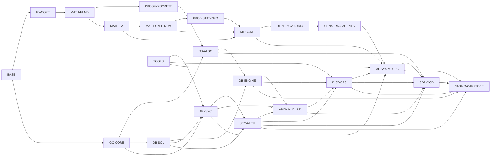
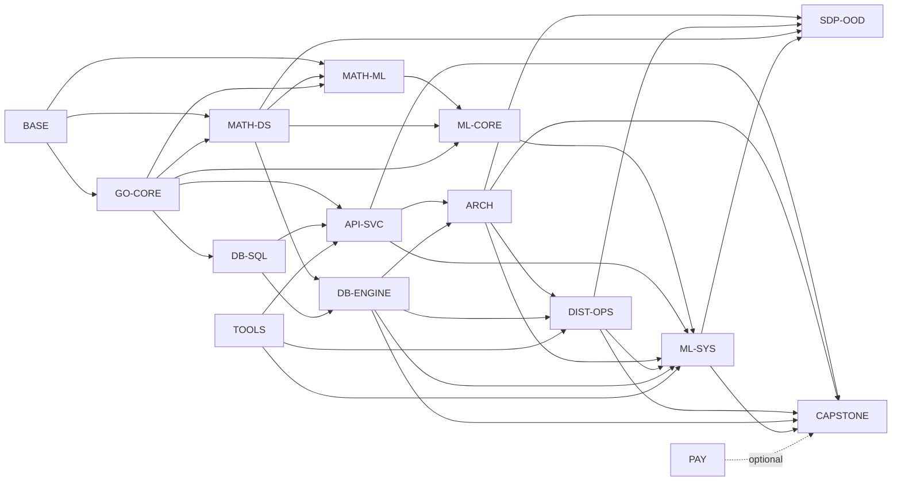

# Unified Math, ML, Computer Science, and Production Systems Curriculum

Single track for learning theory and software development side by side. This curriculum is self-contained: its curated graph, execution rules, content maps, assessment gates, references, and source-preserved corpus are all included here.

## 0. Mission

The learner starts from zero and climbs toward durable mastery for the agentic-coding era: strong mathematics, computer science, machine learning, software engineering, system design, production ML, and the ability to implement core ideas from scratch.

The final working ability is not only to use agents, libraries, and cloud tools. It is to understand the theory behind them, rebuild the important primitives, choose production trade-offs, and operate real systems.

### 0.1 Single-Course Execution Contract

This is one curriculum, not a bundle of courses to complete separately. Sections 0-17 are the active teaching layer. The source-preserved corpus in the final section exists for lossless provenance, detail recovery, and audit; it does not create a second teaching sequence. If preserved wording conflicts with the curated layer, the curated graph, language ownership, stage order, and mastery gates control teaching.

Execute one owner node and one coherent sub-topic at a time. Walk every `requires` edge, confirm the learner with an unseen check, and update one learner ledger containing the current stage, owner node, sub-topic, ramp rung, unlocked tools, shaky tools, postponed challenges, artifact evidence, and next gate. Later occurrences of an owned concept receive recall plus application, not a second full lesson.

Every non-definitional sub-topic climbs the same internal ramp: concrete anchor -> vocabulary/notation -> representation -> core move -> worked illustration -> basic unseen check -> routine variation -> mixed transfer with exactly two earlier unlocked ideas -> domain-appropriate top rung -> reflection and ledger update. Math uses readiness-matched JEE-Advanced-style reasoning; Go/DS uses hard platform reasoning; security, database, system-design, and production topics use adversarial or production failure drills.

### 0.2 Required Learning-Unit Schema

Each teach-time unit is complete enough to stand alone and must identify:

1. Canonical owner node and exact heading path.
2. Confirmed prerequisites and locked prerequisites deliberately excluded.
3. Observable learning outcomes in explain, solve, implement, test, and transfer form.
4. Minimal theory, notation, representation, invariant, or system contract.
5. One worked illustration followed by learner-owned practice through the difficulty ramp.
6. A from-scratch implementation in the owner language when the topic is implementable.
7. Verification: tests, numerical checks, complexity, stability, threat cases, query plans, or operational signals as appropriate.
8. Failure modes, counterexample or boundary case, and criteria for choosing a simpler alternative.
9. A retained evidence artifact: code, test suite, proof note, experiment report, benchmark, threat model, design document, runbook, or deployed slice.

No unit advances on reading or verbal confidence alone. The learner must pass an unseen check. A stage advances only after its owner-node gates and required artifacts pass.

### 0.3 One-to-Two-Year Mastery Pace

Calendar time is a planning aid, never a substitute for mastery. A 12-month intensive path assumes roughly 20-25 focused hours per week; a 24-month sustainable path assumes roughly 10-15. Slow down whenever a prerequisite remains shaky and accelerate only by proving prior knowledge with unseen checks.

| Phase | Stages | Share of core time | Career evidence |
|---|---|---:|---|
| Foundations | S0-S4 | 15% | Reproducible repositories, Python numerical basics, tested Go programs, proof and DS notes |
| Mathematical and algorithmic core | S5-S10 | 20% | Numerical kernels, Go data-structure packages, benchmarks, statistics and experiment tools |
| ML, data, database, and domain primitives | S11-S15 | 25% | Scratch ML package, SQL/engine labs, optimizer and DSP/NLP/CV primitives |
| Deep learning and GenAI | S16-S17 | 15% | Backprop/attention implementations, evaluated retrieval and agent workflows |
| Services, security, architecture, and production ML | S18-S22 | 15% | Secure Go API, auth/middleware package, HLD/LLD dossier, production ML service slice |
| Integrated capstone | S23 | 10% | Operable Go control plane with tests, traces, load evidence, security review, and recovery drill |
| Optional retained specializations | S24 | outside core | Open only after the core destination is complete or a real dependency requires it |

Every 8-12 weeks, select one existing coursework artifact and harden it into portfolio evidence: a clear problem statement, reproducible setup, architecture or derivation, tests, measured results, failure analysis, security considerations, and a concise demonstration. Portfolio work hardens material already learned; it must not create a parallel course or bypass the graph.

## 1. Source Keys and Tags

| Key | Source | Role in this unified file |
|---|---|---|
| `CUR` | the broad curriculum source | Broad math, ML, DSP, CV, NLP, ASR, GenAI, GCP PMLE, bibliography, textbook chapter maps, Python library theory |
| `NAS` | the Nasiko curriculum source | Go control-plane curriculum, DS/algo/discrete math, PostgreSQL internals, HLD/LLD, system design, Nasiko capstone |
| `MLO-I` | the math/ML teaching contract | Beginner-first math/ML teaching contract, JEE-style ramp, Python/NumPy scratch protocol |
| `NAS-I` | the Nasiko teaching contract | Knowledge-graph execution, Go syntax locks, system-design, database, architecture, and capstone constraints |

| Tag | Meaning |
|---|---|
| `CORE` | Destination topic in the single track |
| `PREREQ` | Must be learned first because CORE depends on it |
| `TOOL` | Library, platform, cloud tool, or framework taught at first real use |
| `ARCHIVE` | Retained for provenance or future expansion; not taught unless a CORE dependency requires a sliver |

## 2. NLP-Style Ingestion and Dedupe Method

The unified graph was built as if the two curricula were source corpora.

1. **Entity extraction.** Extract concepts, skills, tools, books, chapter maps, labs, systems, and assessment rules.
2. **Canonicalization.** Normalize aliases: matrices and linear algebra, embeddings and vectors, RAG and retrieval, SQL and relational algebra, HLD/LLD and architecture artifacts.
3. **Semantic clustering.** Cluster related entities into owner nodes such as `MATH-LA`, `ML-CORE`, `DB-ENGINE`, `ARCH-HLD-LLD`, and `NASIKO-CAPSTONE`.
4. **Edge inference.** Add `requires`, `implements`, `strengthens`, `contrasts`, and `revises` edges.
5. **Conflict resolution.** Pick one owner for each concept. Later appearances become applications, not duplicate lessons.
6. **Retention.** Preserve unique source content through the source atlas, bibliography, chapter atlas, tool atlas, design-problem lists, and capstone spec map.

## 3. Language Ownership

| Domain | Primary implementation language | Rule |
|---|---|---|
| Mathematics, numerical methods, probability, statistics, optimization, ML, deep learning, LLMs, NLP, Kaldi/ASR, information theory, signal processing, image processing, computer vision, and related theoretical/application primitives | Python first, NumPy-level from scratch | Implement theory and applications in Python; use scientific or ML libraries only after the primitive is understood and tested |
| Software development, Go language learning, computer-science implementations, DS/algo, hard platform problems, database/storage internals, APIs, authentication, authorization, application security, middleware, concurrency, distributed systems, HLD/LLD, design patterns, system-design labs, operations, and the capstone | Go first | Implement the related primitive or application from scratch in Go, then compare with production packages or services |
| Production ML systems | Hybrid | Keep model, mathematics, data-science primitive, and evaluation in Python; implement service boundaries, gateways, evaluators, feature access, registries, routers, rollout, observability, and operations in Go |
| Cloud, MLOps, serving engines, LLM APIs, vector DBs | Tool-backed | Teach concepts first, then use the tool through typed contracts and tests |

For authentication and security, "from scratch" means implementing protocol state, middleware, validation, sessions, token lifecycle, authorization policy, replay defense, and adversarial tests in Go. Cryptographic algorithms remain owned by the Go standard library or vetted extended packages; never invent a cipher, hash, password KDF, signature scheme, random generator, or TLS variant for production use.

## 4. Knowledge Graph

### 4.1 Edge Types

| Edge | Meaning | Teaching rule |
|---|---|---|
| `requires` | B cannot be learned honestly before A | Teach A first and confirm it |
| `implements` | B is the coding lab for A | Build B as the practice artifact |
| `strengthens` | A deepens B | Recall A briefly after both are unlocked |
| `contrasts` | A and B solve similar forces differently | Compare trade-offs after both are learned |
| `revises` | B reuses A for spaced practice | Recall, do not reteach |

### 4.2 Canonical Owner Nodes

| Node | Owns | Main sources | Code owner |
|---|---|---|---|
| `BASE` | Hardware, files, terminal, Git, editor, HTTP/JSON vocabulary, programming vocabulary | `NAS` | Go shell/repo labs |
| `PY-CORE` | Python syntax needed for numerical and ML work, NumPy arrays, tests, notebooks/scripts | `CUR`, `MLO-I` | Python |
| `GO-CORE` | Go syntax, runtime, errors, tests, interfaces, generics, concurrency, HTTP, gRPC, profiling, releases | `NAS` | Go |
| `MATH-FUND` | Arithmetic, bases, fractions, ratios, percentages, real line, algebra, inequalities, functions, coordinate geometry, trigonometry | `CUR` M1-M34 | Python |
| `PROOF-DISCRETE` | Logic, sets, relations, induction, counting, recurrences, graphs, modular arithmetic, finite automata when needed | `CUR`, `NAS` | Go for CS labs, Python where math proof-checks feed ML |
| `MATH-LA` | Vectors, matrices, determinants, row operations, vector spaces, eigenvalues, SVD, PCA, spectral methods | `CUR` M9/M26/M27/M39 | Python |
| `MATH-CALC-NUM` | Limits, continuity, derivatives, gradients, integration, ODE intuition, numerical methods, finite differences, interpolation, RK4 | `CUR` M29-M37 | Python |
| `PROB-STAT-INFO` | Probability, distributions, inference, MLE, Fisher information, bootstrap, Bayesian updates, information theory, experiments | `CUR` M40, STAT, Cover, Jaynes, Wasserman, Casella-Berger | Python |
| `ML-CORE` | ML framing, features, metrics, regression/classification, trees, clustering, anomaly detection, ranking, recommenders, bandits, causal inference | `CUR`, `NAS` | Python first; Go service application later |
| `DL-NLP-CV-AUDIO` | Neural nets, CNNs, RNNs, transformers, tokenization, NLP libraries, DSP, image processing, ASR, Kaldi/OpenFst concepts | `CUR` M41-M45, NLP library theory, IIT/upGrad | Python first; Go gates for router/service constraints |
| `GENAI-RAG-AGENTS` | Prompting, decoding, RAG, vector indexes, agent loops, guardrails, LLM evaluation, safety, multimodal, fine-tuning, PEFT | `CUR`, `NAS` | Python for primitives; Go for gateways/evaluators/services |
| `DS-ALGO` | Arrays, stacks, queues, maps, trees, heaps, union-find, sorting, graph algorithms, DP, tries, hard platform practice | `NAS`, CLRS, Sedgewick, MIT, CS161 | Go |
| `DB-SQL` | Relational algebra, SQL, schemas, constraints, transactions, query semantics, joins, CTEs, windows | `NAS` | SQL + Go |
| `DB-ENGINE` | PostgreSQL storage, catalogs, pages, buffer pool, indexes, executor, planner, MVCC, locks, WAL, replication, PITR | `NAS` | Go + Postgres labs |
| `API-SVC` | REST, gRPC, protobuf, JSON-RPC, gateways, schema evolution, API contracts | `NAS` | Go |
| `SEC-AUTH` | Threat modeling, secure HTTP middleware, authentication, authorization, password handling, sessions, CSRF/CORS, API keys, JWT, OAuth/OIDC, MFA/passkeys, secrets, supply chain, and security verification | Go security guidance, IETF, NIST, OWASP, `NAS` | Go |
| `ARCH-HLD-LLD` | HLD, LLD, SOLID, clean architecture, DDD, microservices, design patterns, ADRs, C4/Mermaid | `NAS` | Go |
| `DIST-OPS` | Caches, queues, backpressure, consistency, idempotency, retries, circuit breakers, SLOs, observability, rollout/rollback | `NAS` | Go |
| `ML-SYS-MLOPS` | Feature stores, model registry, training/eval pipelines, serving, A/B tests, drift, governance, GCP PMLE, production ML case studies | `CUR`, `NAS` MLCASE | Hybrid |
| `TOOLS` | Docker, Compose, Kubernetes, Terraform, Kong/Nginx, MongoDB, Redis, Postgres, pgvector/Qdrant, OpenTelemetry, MLflow/wandb/Evidently, Ray/PySpark/Dask, FastAPI, LangChain, LlamaIndex, vLLM | `CUR`, `NAS` | Tool labs at first use |
| `SDP-OOD` | System-design and object-design problem set, plus additional primer questions | `NAS` | Go |
| `NASIKO-CAPSTONE` | P0-P10 Go control plane: gateway, backend, auth, router, registry, chat history, orchestrator/worker, CLI, agents, production readiness | `NAS` | Go |
| `ARCHIVE` | Deferred medical/mechanical/game/rendering/unrelated web/pure research inventory | `CUR`, `NAS` | None unless pulled by dependency |

### 4.3 Dependency Graph



### 4.4 Dedupe Ledger

| Overlap | Canonical owner | Later use |
|---|---|---|
| Arithmetic, algebra, functions in both ML and systems | `MATH-FUND` | Capacity math, score calibration, cost math, ML features |
| Sets, relations, graphs, automata | `PROOF-DISCRETE` | Go DS/algo, tokenizer/ASR/WFST gates, service graphs |
| Matrices, vectors, embeddings, PCA | `MATH-LA` | ML embeddings, ANN, router, recommender systems |
| Calculus, optimization, numerical methods | `MATH-CALC-NUM` | Gradient descent, optimizer diagnostics, learning curves, simulations |
| Probability, statistics, A/B tests | `PROB-STAT-INFO` | ML evaluation, online experiments, SLO/error-budget reasoning |
| ML algorithms | `ML-CORE` | Production ML case studies and Nasiko router only apply them |
| NLP, tokenization, transformers, RAG | `DL-NLP-CV-AUDIO` then `GENAI-RAG-AGENTS` | Router, RAG services, LLM safety and evaluation |
| Algorithms/data structures | `DS-ALGO` | DB indexes, service discovery, routing, caches, hard practice |
| SQL and Postgres | `DB-SQL` and `DB-ENGINE` | System design, capstone persistence, production operations |
| Authentication, authorization, sessions, tokens, and middleware | `SEC-AUTH` | APIs, system-design labs, production ML services, and capstone phases apply the established controls |
| HLD/LLD/SOLID/design patterns | `ARCH-HLD-LLD` | SDP/OOD labs and Nasiko phases |
| Production ML-system design | `ML-SYS-MLOPS` | Nasiko P5/P10, system-design ML questions, GCP PMLE |
| Tool APIs | `TOOLS` | First real use only; never a detached sightseeing module |

## 5. Single Graph-Ordered Learning Track

Each stage mixes theory and software only where the graph allows it. Do not open a later stage because it is exciting; unlock it by passing the earlier checks.

This section is the only course sequence. Its numbered stage-detail subsections expand the corresponding table row without creating new stages. Sections 6-17 are reference, assessment, and provenance support; Section 18 remains a source-preserved corpus. When a concept appears in several applications, teach its theory at the earliest owner stage and use retrieval, transfer, or integration checks later.

| Stage | Owner nodes | Theory learned | Implementation and artifact |
|---|---|---|---|
| S0 Zero setup | `BASE` | Computer, files, shell, editor, Git, HTTP/JSON words, process vs program | Repo setup, terminal drills, first test loop |
| S1 Python numerical base | `PY-CORE`, `MATH-FUND` | Python values, functions, lists, dictionaries, tests, arithmetic, bases, estimation, units | Python base converters, unit calculators, tiny test suite |
| S2 Go programming base | `GO-CORE` | Go program layout, types, variables, control flow, arrays, slices, maps, errors, strings | Go functions with tests; array/window/string labs |
| S3 Algebra and functions | `MATH-FUND`, `PY-CORE` | Fractions, real line, algebra, inequalities, polynomials, logs/exponents, relations, functions, composition | Python expression evaluator, function validator, graph/table checks |
| S4 Proof, discrete math, and basic DS | `PROOF-DISCRETE`, `DS-ALGO`, `GO-CORE` | Logic, sets, induction, counting, recurrences, arrays, stacks, queues, maps | Go stacks/queues/hash-map-client labs and proof notes |
| S5 Geometry, coordinates, and vectors | `MATH-FUND`, `MATH-LA` | Coordinate geometry, distance metrics, vectors, dot products, matrix multiplication | Python vector/matrix kernels, distance metrics, tiny embedding examples |
| S6 Go types and core data structures | `GO-CORE`, `DS-ALGO` | Pointers, structs, methods, interfaces, generics; linked lists, trees, heaps, union-find, hash tables | Go reusable DS packages, hard platform problems after unlock |
| S7 Linear algebra and spectral methods | `MATH-LA` | Gaussian elimination, rank, projections, orthogonality, eigenvalues, Gram-Schmidt, SVD/PCA, low-rank approximation | Python Gaussian elimination, power iteration, PCA projection, numerical tests |
| S8 Sorting, graphs, complexity | `DS-ALGO`, `PROOF-DISCRETE` | Asymptotics, invariants, sorting, binary search, heaps, greedy, MST, BFS/DFS, shortest paths | Go sort/top-k/graph packages, benchmark notes, hard platform problems |
| S9 Calculus and numerical methods | `MATH-CALC-NUM` | Limits, continuity, derivatives, partials, gradients, integrals, ODE intuition, finite differences, interpolation, Euler/RK4 | Python gradient checks, numerical integration, RK4 toy solver, stability notes |
| S10 Probability, statistics, and information | `PROB-STAT-INFO` | Random variables, distributions, Bayes, expectation, variance, CLT, MLE, CIs, hypothesis tests, bootstrap, entropy, KL, mutual information | Python samplers, MLE, bootstrap CI, A/B analyzer, log-loss/perplexity tools |
| S11 Classical ML from scratch | `ML-CORE` | Data contracts, leakage, metrics, kNN, linear/logistic regression, naive Bayes, SVM/margin intuition, GLMs, trees, ensembles, clustering, GMM/EM, anomaly detection | Python from-scratch models with NumPy, metrics, gradient checks, comparison to scikit-learn |
| S12 SQL and database correctness | `DB-SQL`, `GO-CORE` | Relational algebra, SQL semantics, NULL/3VL, constraints, transactions, joins, CTEs, windows, pagination | SQL transcripts, Go relational evaluator, Postgres schema and migration tests |
| S13 PostgreSQL internals | `DB-ENGINE`, `DS-ALGO` | Catalogs, slotted pages, TOAST, buffer pool, indexes, executor, planner, statistics, MVCC, locks, vacuum, WAL, recovery, replication | Go slotted page, B-Tree, iterator executor, MVCC/WAL toy labs; `EXPLAIN` drills |
| S14 Optimization, RL, causality | `MATH-CALC-NUM`, `PROB-STAT-INFO`, `ML-CORE` | Convexity, constraints, SGD, momentum, coordinate descent, LP/assignment, bandits, MDPs, propensity, uplift | Python optimizers, assignment solver, bandit simulator, causal estimators |
| S15 DSP, image, NLP, and sequence gates | `DL-NLP-CV-AUDIO` | Convolution, correlation, sampling, DFT/FFT, STFT/MFCC, image filters, Unicode, regex, tokenization, n-grams, edit distance, finite-state basics | Python 1D/2D convolution, DFT, spectrogram features, tokenizer/BPE/WordPiece, n-gram LM |
| S16 Deep learning and transformers | `DL-NLP-CV-AUDIO` | Perceptron, MLP, activations, loss, backprop, regularization, CNNs, RNN/LSTM/GRU, attention, positional encoding, decoder masking | Python tiny tensor/MLP/backprop, self-attention, masked softmax, minimal training loop |
| S17 GenAI, RAG, and agents | `GENAI-RAG-AGENTS` | Generative objectives and decoding; prompting and tool schemas; lexical/dense/hybrid retrieval, ANN trade-offs, reranking and grounded generation; prompt/RAG/agent evaluation; workflow patterns before autonomous loops; multimodal and PEFT decision gates; prompt injection, data/model poisoning, unsafe output, excessive agency, sensitive disclosure, misinformation and unbounded-consumption defenses | Python BM25/vector/hybrid retrieval and component/e2e evaluator; prompt and context packer; structured-output and tool-policy validator; sandboxed agent loop with stop conditions; Go gateway contracts and cost/latency budgets |
| S18 APIs and service contracts | `API-SVC`, `GO-CORE`, `TOOLS` | HTTP/TLS semantics, REST, protobuf, gRPC, JSON-RPC, schema evolution, gateway and service contracts | Go REST/gRPC/JSON-RPC services with contract tests |
| S19 Go authentication, security, and middleware | `SEC-AUTH`, `API-SVC`, `DB-SQL`, `GO-CORE` | Threat models, middleware ordering, password/session/token lifecycle, authorization, CSRF/CORS, JWT, OAuth/OIDC, MFA, secrets, secure outbound calls, verification | From-scratch Go security package, hardened local service, abuse-case tests, fuzz/race evidence, security review |
| S20 HLD, LLD, SOLID, microservices, patterns | `ARCH-HLD-LLD`, `DIST-OPS`, `SEC-AUTH` | C4/Mermaid, coupling/cohesion, SOLID, DDD, clean architecture, monolith vs microservices, sync/async, retries, idempotency, circuit breaker, outbox, saga, CQRS, security boundaries | Go service slices, SOLID refactoring evidence, threat-aware ADRs, sequence/state diagrams, pattern tests |
| S21 System design and OOD labs | `SDP-OOD`, `DS-ALGO`, `DB-ENGINE`, `DIST-OPS`, `SEC-AUTH` | Primer topics, official SDP/OOD problems, capacity, bottlenecks, trade-offs, failure modes, abuse cases | Six-step write-up, threat model, and Go implementation for every listed problem |
| S22 Production ML systems and MLOps | `ML-SYS-MLOPS`, `TOOLS`, `GENAI-RAG-AGENTS`, `SEC-AUTH` | Problem and metric contracts; data/feature/model lineage; experiment tracking and registries; reproducible training/evaluation pipelines; batch, online and streaming serving; training-serving parity; CI/CD/CT; shadow, canary and rollback; drift, silent-failure and delayed-label monitoring; A/B tests; responsible-AI governance and GCP PMLE synthesis | Versioned Python model/data/eval artifact plus secure Go feature facade and evaluator CLI; automated data/model/infrastructure tests; registry promotion gate; parity fixture; shadow/canary report; drift and freshness alerts; rollback and incident drill |
| S23 Nasiko control-plane capstone | `NASIKO-CAPSTONE` | Gateway, backend, auth, router, registry, chat history, orchestrator/worker, CLI, A2A agents, production readiness | Go P0-P10 implementation, route tests, traces, load test, backup/restore, security review, ORR |
| S24 Optional retained specializations | `ARCHIVE` | Game/rendering, medical, mechanical, deep pure math, unrelated web stacks, extra number theory | Pull only if a future CORE dependency needs it |

### 5.1 Research Baseline and Evidence Hierarchy

Research review date: 2026-09-01. Use sources in this order: current standards and official documentation for behavioral contracts; current official university course pages for prerequisite order and assessment shape; canonical textbooks and peer-reviewed papers for derivations; maintained tool documentation for APIs. A blog, vendor tutorial, or preserved source note may illustrate a topic but cannot overrule a current standard or create a new stage.

The sources below strengthen the content of the existing owner stages. They are not additional courses to complete. At teach time, follow only the source portions named by the active sub-topic and record the source version or access date in the retained artifact.

| Research family | Authoritative anchors reviewed | What the active course imports |
|---|---|---|
| Python and numerical work | [Python tutorial](https://docs.python.org/3/tutorial/), [NumPy beginner guide](https://numpy.org/doc/stable/user/absolute_beginners.html), [NumPy fundamentals](https://numpy.org/doc/stable/user/basics.html), [pytest guide](https://docs.pytest.org/en/stable/getting-started.html) | Interpreter-to-module progression; exceptions and environments; shape/dtype/axis reasoning; broadcasting; copies versus views; floating-point checks; isolated and approximate tests |
| Go | [Go documentation](https://go.dev/doc/), [Tour of Go](https://go.dev/tour/), [Go memory model](https://go.dev/ref/mem), [Go diagnostics](https://go.dev/doc/diagnostics), [Go security](https://go.dev/security/) | Current language, modules, generics, testing/fuzzing, concurrency, memory visibility, profiling, PGO, vulnerability management, and release behavior; Effective Go is supplementary because its own page says it is not actively updated |
| Mathematical thinking and algorithms | [MIT 6.042J](https://ocw.mit.edu/courses/6-042j-mathematics-for-computer-science-spring-2015/), [MIT 6.006](https://ocw.mit.edu/courses/6-006-introduction-to-algorithms-fall-2011/) | Definitions and proof before discrete structures, then probability; modeling, invariants, complexity, data structures, paradigms, programming assignments, problem sets, and unseen exams |
| Continuous mathematics | [MIT 18.01SC](https://ocw.mit.edu/courses/18-01sc-single-variable-calculus-fall-2010/), [MIT 18.02SC](https://ocw.mit.edu/courses/18-02sc-multivariable-calculus-fall-2010/), [MIT 18.06](https://ocw.mit.edu/courses/18-06-linear-algebra-spring-2010/) | Functions and limits before derivatives/integrals; vectors and matrices before partial derivatives; systems, spaces, orthogonality, eigenstructure, positive definiteness, and application-driven problem sets |
| Probability, inference, and optimization | [MIT 6.041SC](https://ocw.mit.edu/courses/6-041sc-probabilistic-systems-analysis-and-applied-probability-fall-2013/), [Stanford EE364A](https://web.stanford.edu/class/ee364a/), [Stanford EE364B](https://web.stanford.edu/class/ee364b/) | Discrete models before general random variables, processes, laws of large numbers, and inference; convex sets/functions, duality and KKT before proximal, distributed, robust, stochastic, and non-convex methods |
| Classical ML, RL, and causality | [Stanford CS229](https://cs229.stanford.edu/), [scikit-learn user guide](https://scikit-learn.org/stable/user_guide.html), [Sutton and Barto](http://incompleteideas.net/book/the-book-2nd.html), [Introduction to Causal Inference](https://www.bradyneal.com/causal-inference-course) | Supervised before unsupervised and learning theory; model selection, calibration and leakage controls; bandits before MDP methods; estimand and potential outcomes before DAG adjustment, identification, estimation, sensitivity, and quasi-experiments |
| Signals, image processing, and CV | [MIT 6.003](https://ocw.mit.edu/courses/6-003-signals-and-systems-fall-2011/), [IPOL](https://www.ipol.im/), [Szeliski CVAA](https://szeliski.org/Book/), [Stanford CS231n 2026](https://cs231n.stanford.edu/schedule.html) | Signal representations, LTI systems, transforms and sampling before DSP; reproducible mathematical image algorithms; image formation and filtering before features, geometry, recognition, video, self-supervision, generative vision, and vision-language systems |
| NLP, retrieval, and speech | [Stanford CS224N 2026](https://web.stanford.edu/class/cs224n/), [Introduction to Information Retrieval](https://nlp.stanford.edu/IR-book/information-retrieval-book.html), [Stanford CS224S 2025](https://web.stanford.edu/class/cs224s/semesters/2025-spring/syllabus) | Word vectors through transformers, post-training, agents and evaluation; Boolean/postings/scoring/evaluation before dense retrieval; phonetics and signal analysis before HMM-DNN, CTC, end-to-end ASR, Conformer/Whisper, multilingual and low-resource evaluation |
| Deep learning | [Dive into Deep Learning](https://d2l.ai/), [Deep Learning](https://www.deeplearningbook.org/) | Math and numerical prerequisites; scratch-before-framework implementations; MLP/CNN/RNN/attention progression; stability, generalization, optimization, performance and real-data experiments |
| IIT Kharagpur GenAI | [Official EPGC page](https://online.iitkgp.ac.in/executive-post-graduate-in-generative-ai-and-agentic-ai) | Publicly named programme blocks, prerequisites, production-first progression, live format, capstone, and named portfolio systems; §5.6 distinguishes exact public claims from this curriculum's prerequisite-safe elaboration |
| Retrieval and RAG engineering | [FAISS research wiki](https://github.com/facebookresearch/faiss/wiki), [Sentence Transformers retrieve-rerank](https://www.sbert.net/examples/sentence_transformer/applications/retrieve_rerank/README.html), [Ragas](https://www.ragas.io/) | Exact-search baseline; recall/latency/memory trade-offs for IVF, PQ, HNSW and GPU search; bi-encoder retrieval before cross-encoder reranking; component and end-to-end evaluation |
| Databases | [PostgreSQL 18 documentation](https://www.postgresql.org/docs/current/), [CMU 15-445/645 2025](https://15445.courses.cs.cmu.edu/fall2025/) | SQL before internals; storage models, heaps/log structures, indexes including vector indexes, query execution/optimization, transactions, recovery, and parallel/distributed architectures |
| APIs and contracts | [HTTP Semantics RFC 9110](https://www.rfc-editor.org/rfc/rfc9110.html), [gRPC core concepts](https://grpc.io/docs/what-is-grpc/core-concepts/), [Protocol Buffers guide](https://protobuf.dev/programming-guides/proto3/), [Google AIPs](https://google.aip.dev/general) | Resource and representation semantics; safety/idempotency, caching and preconditions; unary/streaming lifecycle, deadlines and cancellation; field presence, unknown fields, reserved numbers and compatibility; pagination, long-running operations and errors |
| Application and identity security | [OWASP ASVS 5.0](https://owasp.org/www-project-application-security-verification-standard/), [NIST SP 800-63B-4](https://pages.nist.gov/800-63-4/sp800-63b.html), [OAuth Security BCP 240](https://www.rfc-editor.org/rfc/rfc9700.html), [Go security guidance](https://go.dev/security/) | Versioned verification requirements; AAL, authenticator, recovery and session lifecycle; exact redirect matching, PKCE, issuer binding, sender-constrained tokens and refresh rotation; native fuzzing and reachable-vulnerability checks |
| Distributed systems and reliability | [MIT 6.5840 2026](https://pdos.csail.mit.edu/6.824/), [Google SRE book](https://sre.google/sre-book/table-of-contents/), [Google SRE workbook](https://sre.google/workbook/table-of-contents/) | MapReduce/KV/Raft/sharded-KV implementation progression; fault tolerance, replication and consistency; SLI/SLO/error budgets, monitoring, overload, cascading failure, incident response, postmortems, canaries and launch reviews |
| Production ML and GenAI risk | [Google Rules of ML](https://developers.google.com/machine-learning/guides/rules-of-ml), [Google PMLE exam guide](https://cloud.google.com/learn/certification/guides/machine-learning-engineer), [NIST AI 600-1](https://www.nist.gov/publications/artificial-intelligence-risk-management-framework-generative-artificial-intelligence), [OWASP LLM Top 10 2025](https://genai.owasp.org/llm-top-10/) | Baseline-first ML, pipeline tests, feature ownership, freshness and training-serving skew; design/build/operationalize/govern domains; Govern-Map-Measure-Manage evidence; ten GenAI risk families and lifecycle mitigations |

### 5.2 S0-S4: Computing, Language, and Reasoning Foundations

**S0 Zero setup.** Learn bits/bytes, CPU-memory-storage, files versus directories, absolute/relative paths, process versus program, environment variables, ports, DNS/HTTP/JSON vocabulary, shell composition, exit status, standard streams, Git working tree/index/commit/remote, and reproducible repository layout. Trace one command from shell parsing to process exit and one HTTP request from name lookup to response. Gate: recover a deliberately broken path, environment, Git branch, and local HTTP call; retain a setup runbook that works from a clean directory.

**S1 Python numerical base.** Order: literals and numeric representation -> names and mutability -> conditions/loops -> functions and contracts -> strings/lists/tuples/dicts/sets -> modules and virtual environments -> exceptions and file/JSON I/O -> pytest -> NumPy `ndarray`. For arrays, predict `shape`, `ndim`, `size`, `dtype`, strides/axis meaning, indexing result, broadcasting result, and copy/view aliasing before execution. Include integer overflow by dtype, floating-point representation error, tolerance-based assertions, seeded generators, vectorization, and the distinction between elementwise and matrix multiplication. Gate: a tested numerical utility package whose reference-loop and vectorized forms agree on normal, empty, boundary, aliasing, and non-finite inputs.

**S2 Go programming base.** Order: module/package/function -> scalar types and conversions -> control flow -> arrays/slices/maps -> strings, bytes and runes -> structs and zero values -> errors and wrapping -> table tests -> formatting, vetting and benchmarks. Trace slice length/capacity/backing arrays and map missing-value behavior; reject unchecked errors and accidental Unicode byte assumptions. Gate: one small command and one package pass table tests, edge cases, `go vet`, formatting, and a benchmark explanation.

**S3 Algebra and functions.** Move from fractions, ratios, units and estimation to equations, inequalities, absolute value, exponents/logs, polynomials, sequences, relations and functions. Represent each function as rule, table, graph, mapping and code; distinguish domain, codomain, range, inverse and composition. The top rung combines algebraic structure with one prior numerical representation, not blind substitution. Gate: derive and test a piecewise expression evaluator, find counterexamples to false inverse/composition claims, and solve fresh parameterized JEE-style problems.

**S4 Proof, discrete math, and basic data structures.** Order: propositions/quantifiers -> direct, contrapositive, contradiction and counterexample -> sets/functions/relations -> induction and invariants -> counting and pigeonhole -> recurrences -> graphs and state machines -> arrays/stacks/queues/maps in Go. Every implementation states its representation invariant and proves preservation by each operation. Gate: short proof portfolio plus tested Go structures; one unseen problem must require choosing, not being told, the proof technique or data structure.

### 5.3 S5-S10: Mathematical and Algorithmic Core

**S5 Geometry, coordinates, and vectors.** Build Euclidean geometry and trigonometry into coordinates, affine combinations, norms, distance metrics, dot product, angles, projections, lines/planes and transformations. Compare Euclidean, Manhattan and cosine behavior under scaling and translation. Gate: NumPy-free vector/matrix kernels first, then NumPy comparison with geometric invariants and degenerate cases.

**S6 Go types and core data structures.** Order: pointers and ownership-by-convention -> structs/method sets -> interfaces and composition -> generics and constraints -> linked structures -> BST/balanced-tree concepts -> heap/priority queue -> union-find -> hash table. Include allocation/escape intuition, nil-interface traps, comparable constraints, amortized growth and mutation under aliasing. Gate: reusable packages with property tests, fuzz seeds, complexity arguments and benchmarks that explain crossover points rather than merely print timings.

**S7 Linear algebra and spectral methods.** Order: linear systems and elimination -> span/independence/basis/dimension -> four fundamental subspaces -> linear maps -> orthogonality/projection/least squares -> determinants as structure, not a solver -> eigenvalues/eigenvectors/diagonalization -> symmetric and positive-definite matrices -> SVD/pseudoinverse/condition number -> PCA and low-rank approximation. Predict rank, nullity, shape and stability before computing. Gate: elimination, QR/Gram-Schmidt, power iteration and PCA implementations checked by residuals, orthogonality, reconstruction error and adversarial ill-conditioning.

**S8 Sorting, graphs, and complexity.** Order: asymptotic models and lower-bound intuition -> loop/recurrence analysis -> binary search invariant -> elementary and divide-and-conquer sorting -> heaps and selection -> hashing/amortization -> BFS/DFS/topological order/SCC -> shortest paths -> MST/greedy exchange -> dynamic programming -> max-flow entry. For each problem, derive state, invariant, recurrence or exchange argument before code. Gate: Go algorithm package, differential/property tests and a mixed unseen problem where input constraints force the paradigm choice.

**S9 Calculus and numerical methods.** Order: limits/continuity -> derivative as local linearization -> product/chain/implicit rules -> optimization and curve behavior -> definite integral and fundamental theorem -> integration methods -> sequences/series -> partial/directional derivatives -> gradient/Jacobian/Hessian -> multiple integrals/vector-calculus intuition -> ODE models -> floating-point error, conditioning and stability -> roots/interpolation/quadrature -> Euler/RK4 and finite differences. Gate: analytical and finite-difference gradients agree within justified tolerance; numerical solvers include convergence plots, step-size failure and a stability explanation.

**S10 Probability, statistics, and information.** Order: sample spaces/counting/conditioning/Bayes -> discrete and continuous random variables -> joint/marginal/conditional laws -> expectation/variance/covariance -> transformations -> concentration and LLN/CLT -> random processes/Markov chains entry -> sampling and estimands -> likelihood/MLE/MAP/sufficiency -> confidence intervals and tests -> bootstrap/permutation -> regression diagnostics -> Bayesian updating -> entropy/cross-entropy/KL/mutual information/coding intuition -> experiment design and sequential caveats. Gate: simulation must verify a derivation, not replace it; retain an A/B analyzer with power, uncertainty, multiple-comparison and practical-significance checks.

### 5.4 S11-S14: Classical ML, Databases, Optimization, RL, and Causality

**S11 Classical ML from scratch.** Start with problem/label/metric and a non-ML baseline. Then establish split strategy, leakage boundary, preprocessing fit scope, missingness, imbalance and calibration. Learn in this order: kNN -> linear/regularized regression -> logistic/softmax and GLMs -> naive Bayes/LDA/QDA -> margins/kernels/SVM -> trees -> bagging/random forests/boosting -> clustering -> GMM/EM -> PCA/feature selection -> anomaly detection -> ranking/recommendation. Every family includes objective, assumptions, optimization, complexity, calibration or uncertainty, failure slices and a simpler-alternative criterion. Gate: scratch NumPy implementation, gradient or likelihood checks where applicable, leakage-safe pipeline comparison, ablation and error taxonomy on a fresh dataset.

**S12 SQL and relational correctness.** Order: relations/keys/functional dependencies/normalization -> relational algebra -> DDL/types/constraints -> SELECT semantics and NULL three-valued logic -> joins including semi/anti/outer -> aggregation -> subqueries/CTEs/recursion -> windows -> transactions/isolation -> pagination and application access. Predict result multiplicity and NULL behavior before execution. Gate: SQL edge-case transcript plus Go `database/sql` client with parameterization, context cancellation, transactions, pool limits, migration rollback and property-based relational checks.

**S13 Database internals.** Follow CMU/PostgreSQL dependency order: storage media and row/column/log-structured layouts -> pages/tuples/TOAST/catalogs -> buffer manager -> hash/B-Tree/GIN/GiST/BRIN/vector indexes -> iterators, sort/aggregate and join algorithms -> statistics/cardinality/cost plans -> MVCC snapshots/isolation/locks/deadlocks/vacuum -> WAL/checkpoints/recovery -> replication/PITR -> parallel and distributed trade-offs. Gate: the DB-1 to DB-10 artifacts in §7.2, plus measured `EXPLAIN (ANALYZE, BUFFERS)` predictions and crash/recovery evidence.

**S14 Optimization, RL, and causality.** Optimization order: geometry/convexity -> first/second-order methods -> SGD/momentum/adaptive methods -> constraints/Lagrangian/KKT/duality -> proximal and coordinate methods -> LP/assignment -> robust/stochastic formulations -> non-convex diagnostics. RL order: exploration and multi-armed bandits -> MDP/Bellman equations -> dynamic programming -> Monte Carlo -> temporal difference/Q-learning -> function approximation/policy gradients only after tabular checks. Causal order: question/estimand/intervention -> potential outcomes -> DAGs/SCMs -> randomization -> backdoor/frontdoor and identification -> estimation/heterogeneous effects -> overlap and sensitivity -> IV, difference-in-differences, regression discontinuity and synthetic control. Gate: distinguish prediction, intervention and counterfactual claims; implement optimizers, a bandit/MDP simulator and causal estimators with assumption-violation experiments.

### 5.5 S15-S16: Domain Mathematics and Deep Learning

S15 is one stage with four serial gates, not four parallel tracks. Complete shared convolution, transform, probability and sequence prerequisites once; each later gate recalls them in a new representation.

1. **S15-A signals and DSP.** Signal classes, energy/power, complex exponentials, impulse/step, continuous/discrete time, LTI properties, convolution/correlation, frequency response, Fourier series/transform, Laplace and z-transform intuition, DFT/FFT, sampling/aliasing, windows/leakage, FIR/IIR and pole-zero stability, STFT, filter banks, cepstrum/MFCC, multirate and quantization. Evidence: scratch convolution/DFT/FFT/STFT, Parseval and reconstruction checks, aliasing counterexample, filter response and numerical error report.
2. **S15-B image processing and classical CV.** Image formation, sampling/quantization, color and gamma, point transforms/histograms, 2D convolution/separable filters, denoising/sharpening, gradients/edges, morphology, Fourier image filtering, restoration/deconvolution, segmentation, corners/descriptors/matching, homography/RANSAC, camera calibration, epipolar/stereo, optical flow, detection/recognition metrics and reproducibility. Evidence: scratch kernels before OpenCV, synthetic ground truth, noise/blur sweeps, geometric residuals and one IPOL-style reproducible experiment archive.
3. **S15-C text, NLP, IR, and finite-state foundations.** Unicode/code points/graphemes, normalization and regex -> linguistic units -> tokenization and sentence splitting -> edit distance -> n-grams/smoothing/perplexity -> inverted indexes/Boolean retrieval/TF-IDF/BM25 -> evaluation -> word vectors -> BPE/WordPiece/unigram tokenization -> tagging/parsing entry -> finite automata, weighted semirings and composition only as needed by tokenizer/ASR constraints. Evidence: tokenizer and subword trainer, n-gram LM, postings index and BM25 evaluator with multilingual and adversarial normalization cases.
4. **S15-D speech and ASR.** Acoustic phonetics and transcription -> waveform/framing/pre-emphasis/windowing -> spectrogram/mel/MFCC -> pronunciation lexicon and language-model interface -> HMM/noisy-channel/Viterbi -> GMM/HMM-DNN -> CTC and end-to-end encoder-decoder -> Conformer and self-supervised speech representations -> decoding/WFST concepts -> WER/CER, streaming latency, noise/accents, multilingual and low-resource evaluation -> TTS and spoken-dialog overview. Evidence: feature pipeline, Viterbi/CTC toy decoder, Kaldi/OpenFst graph inspection, WER error taxonomy and subgroup robustness report.

**S16 Deep learning and transformers.** Order: tensor contracts and autodiff checks -> perceptron/linear units -> MLP and backprop -> initialization/activation/numerical stability -> regularization/generalization -> optimizer and learning-rate diagnostics -> CNN and modern residual blocks -> sequence batching/masking -> RNN/BPTT/LSTM/GRU -> encoder-decoder and beam search -> attention from similarity -> multi-head self-attention -> positional schemes/masking -> encoder-only, decoder-only and encoder-decoder transformers -> pretraining objectives -> distributed-compute and memory intuition. Gate: scratch NumPy MLP and attention, PyTorch reimplementation, finite-difference gradients, overfit-a-tiny-batch check, ablations, learning curves, seed variance, throughput/memory measurements and a failure-slice report.

### 5.6 S17: IIT Kharagpur GenAI, RAG, Multimodal, and Agents

#### 5.6.1 Official Programme Facts and Provenance Boundary

The current official page describes the **Executive Post Graduate Certificate in Generative AI & Agentic AI**, designed and delivered by IIT Kharagpur's Department of Computer Science and Engineering, as an eight-month, 100% live online, production-first programme. It publishes a Saturday 10 AM-1 PM live schedule, a two-week faculty-guided project, and the progression **Generative AI -> Large Language Models -> Customisation and Fine-Tuning -> Retrieval-Augmented Generation -> Agentic AI -> Production Deployment**.

Published entry expectations are the ability to write Python functions and use basic data structures, experience consuming or building APIs, comfort reading technical documentation, and familiarity with basic ML mathematics and statistics. In this unified course those expectations are discharged by S1-S16; they are not assumed at S0.

The public page currently exposes five named curriculum blocks and five named portfolio systems. It does not expose the earlier source corpus's exact week-by-week allocation, so the active layer does not label any local week split as official. The preserved wording in §18 remains provenance only. The detailed realization below preserves the official block order and augments it using the research families in §5.1.

#### 5.6.2 Official Curriculum Crosswalk Into the Single Course

| Official public block | Publicly named coverage and outcome | Prerequisite-safe placement and required build here |
|---|---|---|
| Foundations of GenAI & LLMs | AI and deep-learning essentials; transformer architecture; working with foundation models; understand how LLMs are built and behave in real systems | S11 and S16 own ML/DL/transformer theory. S17 compares autoregressive, masked, sequence-to-sequence, diffusion and multimodal objectives; tokenization, embeddings, context limits, decoding, scaling/data/system constraints and closed versus open model trade-offs. Build a tiny decoder, cache-aware generation loop and capability/cost/constraint decision memo. |
| Advanced Prompting & RAG Systems | Advanced prompting and retrieval-augmented systems; production emphasis includes an enterprise RAG system with hybrid search, reranking and an evaluation pipeline over large collections | S17 owns instruction/context/tool schemas, prompt versioning and failure handling; lexical/dense/hybrid retrieval, chunking, metadata/ACL filtering, ANN, reranking, grounded generation and component/e2e evaluation. Build the enterprise RAG system in §5.6.4. |
| LLM Fine-Tuning & Alignment | Modern fine-tuning; PEFT, LoRA and QLoRA for LLMs and SLMs; evaluate gains against a baseline | S17 first chooses among prompt, RAG and adaptation; then covers data curation, SFT, adapters/low-rank updates, quantization-aware constraints, preference-data concepts, DPO/RLHF overview, catastrophic forgetting, contamination, safety regression and serving. Build and compare a small PEFT experiment only when it beats the prompt/RAG baseline on predeclared metrics. |
| Multimodal & Agentic AI | Multimodal systems plus agents that plan, use tools and coordinate across workflows | S15-B/S16 own image and vision-language prerequisites. S17 covers contrastive image-text representations, VLM connectors/cross-attention, caption/VQA/retrieval, diffusion intuition, multimodal evaluation, then augmented-LLM, chaining, routing, parallelization, orchestrator-worker, evaluator-optimizer, state/memory and bounded agent loops. Build a measurable multi-agent workflow with typed tools, authorization and stop conditions. |
| Deployment, Optimisation & AI Safety | Build, serve and monitor with latency, cost and reliability in mind; production deployment and safety | S17 owns offline evaluation, prompt injection and model-facing controls; S18-S20 own APIs/security/distributed behavior; S22 owns deployment, optimization, monitoring and governance. Build a containerized GenAI API with budgets, traces, fallback, red-team set, risk register and rollback. |

#### 5.6.3 Detailed S17 Learning Order

1. **Generative modeling and inference.** Autoregressive factorization, logits/softmax, likelihood and cross-entropy; greedy, beam, temperature, top-k/top-p and repetition controls; calibration limits, context windows, KV cache, batching, quantization and cost equations. Predict distributional effects before generation experiments.
2. **Prompt and structured-interaction design.** Instruction hierarchy, delimiters and data/instruction separation; zero/few-shot and decomposition; self-consistency as sampling, not truth; structured outputs, constrained decoding, function/tool schemas, retries and validation; prompt/version datasets and regression tests. Hidden chain-of-thought is never required as an output contract; assess answers and observable evidence.
3. **Retrieval foundation.** Corpus and access contract -> parsing/deduplication -> chunking and metadata -> lexical baseline -> dense bi-encoder -> exact vector search -> ANN recall/latency/memory -> hybrid fusion -> cross-encoder reranking -> context packing/citation -> grounded generation. Measure retrieval independently before answer quality.
4. **RAG evaluation and diagnosis.** Curate answerable, unanswerable, temporal, conflicting, multilingual, ACL and injection cases. Track recall@k/MRR/NDCG, context precision/recall, faithfulness/groundedness, answer relevance/correctness, citation accuracy, abstention, latency and cost. Diagnose ingestion, retrieval, reranking, packing and generation separately; LLM judges require calibration against human labels.
5. **Adaptation and alignment.** Establish prompt-only and RAG baselines; define what behavior should change; clean/split/deduplicate instruction or preference data; perform SFT/LoRA/QLoRA on a tractable model; compare task quality, safety, general capability, memory, latency and cost. Learn RLHF/reward modeling/DPO conceptually without pretending a small lab reproduces frontier alignment.
6. **Multimodal generation.** Contrastive encoders, image patches/tokens, projection/cross-attention, captioning/VQA/retrieval, autoregressive versus diffusion image generation, conditioning/guidance and safety/provenance. Evaluate text-only shortcuts, OCR, spatial reasoning, demographic slices and perturbations rather than relying on attractive samples.
7. **Agentic systems.** Use the simplest sufficient pattern: single call -> augmented LLM -> deterministic workflow -> bounded agent. Cover tool descriptions, typed arguments, least privilege, per-action authorization, idempotency, environment feedback, state versus long-term memory, checkpointing, human approval, iteration/time/token budgets and termination. Compare chaining, routing, parallel workers, orchestrator-worker and evaluator-optimizer before multi-agent coordination.
8. **Evaluation, safety and governance.** Build a task-specific eval set and trace schema before deployment. Test OWASP 2025 prompt injection, sensitive disclosure, supply chain, data/model poisoning, improper output handling, excessive agency, system-prompt leakage assumptions, vector/embedding weaknesses, misinformation and unbounded consumption. Map context, stakeholders and harms; measure validity, safety, security, privacy and bias; manage mitigations, monitoring, incidents, contestability and decommissioning using NIST Govern-Map-Measure-Manage.

#### 5.6.4 IIT-Aligned Portfolio Systems and Acceptance Evidence

The official page names the following five outcomes. They replace, rather than supplement, overlapping S17/S22 tutorial projects.

1. **Enterprise RAG system.** Hybrid retrieval and reranking over a realistically sized collection; versioned corpus; tenant/ACL filters before disclosure; golden and adversarial queries; component and end-to-end metrics; ingestion/retrieval/generation traces; latency/cost budget; citation and abstention behavior.
2. **Fine-tuned LLM.** Open model adapted on domain data with LoRA or QLoRA; dataset card and license/privacy review; prompt/RAG baseline; held-out and contamination checks; safety/general-capability regression; reproducible training manifest; API serving only after measurable benefit.
3. **Multi-agent system.** A workflow that genuinely needs dynamic decomposition; typed least-privilege tools; bounded planner/worker state; approval for consequential actions; loop/replay/partial-failure tests; task success, tool-error, step, latency and cost metrics; deterministic fallback.
4. **Deployed Generative AI API.** Containerized service handling real concurrency; authentication/authorization, schema validation, deadlines, cancellation, rate and spend limits, observability with redaction, model/provider fallback, load/soak tests, canary and rollback.
5. **Industry capstone.** A healthcare, BFSI, manufacturing, or similarly bounded business problem carried from user/risk/metric definition to deployed evidence. Include domain-expert validation, privacy and misuse analysis, baseline, reproducible evaluation, operations, incident response and an explicit no-deploy decision if evidence is inadequate.

### 5.7 S18-S24: Services, Security, Architecture, Operations, and Integration

**S18 APIs and service contracts.** Begin with RFC 9110 resources, representations, origins, methods, status codes, content negotiation, caching, validators and conditional requests. Derive safe/idempotent/retry behavior; test lost updates with `ETag`/`If-Match`, overload with `Retry-After`, and malformed/ambiguous framing at the server boundary. Then design resource-oriented REST, protobuf field presence/numbers/unknown fields/reservations, compatibility matrices, and gRPC unary/server/client/bidirectional streams with deadlines, cancellation, metadata, status and backpressure. Gate: Go REST and gRPC services plus old-client/new-server and new-client/old-server contract tests.

**S19 Go authentication, security, and middleware.** Execute §11.1 in its listed order. Add explicit NIST SP 800-63B-4 distinctions among passwords, authenticators, sessions and access tokens; AAL1/AAL2/AAL3; phishing/replay resistance; authenticator intent/binding/recovery/invalidation; and syncable passkey trade-offs. Add OAuth BCP attacks: redirect mismatch, code/access-token injection, mix-up, referer/history leakage, PKCE downgrade, counterfeit resource server, refresh replay, open redirect, unsafe 307 and untrusted proxy headers. Gate: map controls to versioned ASVS 5.0 requirements and prove them through positive, negative, fuzz, race, resource-exhaustion, rotation, revocation and recovery tests.

**S20 HLD, LLD, SOLID, clean architecture, patterns, and distributed systems.** Order: quality attributes and measurable SLOs -> boundaries/data ownership -> LLD contracts, cohesion and coupling -> SOLID in idiomatic Go -> clean architecture and DDD -> modular monolith -> synchronous and asynchronous communication -> retries/timeouts/idempotency/backpressure -> cache and queue semantics -> replication/partition/consistency -> leader election/consensus -> transactions/outbox/saga -> observability and operations -> microservice split only when justified.

Teach SOLID as five testable design heuristics rather than slogans: **single responsibility** means one coherent reason to change; **open/closed** favors extending stable policy through composition instead of growing conditionals; **Liskov substitution** requires every implementation to preserve an interface's behavioral contract, including errors, side effects and concurrency semantics; **interface segregation** favors small consumer-owned interfaces; and **dependency inversion** keeps policy dependent on abstractions while infrastructure supplies adapters. Contrast each principle with over-fragmentation, speculative interfaces and dependency-injection ceremony. Patterns answer named forces and include rejection criteria. Implement MapReduce, a linearizable KV service, Raft and a sharded KV progression at toy scale before claiming distributed-systems mastery. Gate: refactor one coupled Go service, retain before/after dependency evidence, and prove substitutability and boundary isolation with tests; then add failure injection, invariant traces, an SLO/error budget, overload/cascade analysis and recovery evidence.

**S21 system-design and OOD labs.** Use §12 as a practice bank, not another syllabus. For each unlocked problem: clarify functional/quality/security requirements -> estimate load/storage/bandwidth -> define API/data/consistency -> draw HLD -> deep-dive one bottleneck -> enumerate failures/abuse/privacy -> define observability/rollout/recovery -> implement a thin Go slice. Across the set, cover at least one read-heavy, write-heavy, realtime, batch, multi-tenant, globally distributed, ML-backed and adversarial system. Revisit a prior design under a 10x scale or changed consistency/privacy constraint.

**S22 production ML systems and MLOps.** Order: decide whether ML is warranted -> metric and non-ML baseline -> data/label/feature contracts and ownership -> reproducible experiment -> pipeline components and lineage -> registry/promotion -> batch/online/stream serving -> training-serving parity -> automated data/model/infrastructure tests -> shadow/canary/A-B -> freshness, skew, drift, quality and resource monitoring -> retraining policy -> rollback/incident/governance/decommission. Treat code, data and model as independently versioned change axes. For GenAI add corpus/prompt/model/tool versions, judge calibration, token/spend budgets and safety regressions. Gate: PMLE-style design/build/operationalize/govern defense plus an ML Test Score, silent-failure drill and restored prior model/data/config combination.

**S23 Nasiko capstone.** Integrate only already mastered primitives through §14 P0-P10. Each phase consumes an owner-stage contract and tests it at a boundary; it does not introduce a surprise database, security, GenAI or distributed-systems subcourse. Required final evidence: requirement and threat models, API/schema compatibility, Python-model/Go-service parity, tenant/tool authorization, load and chaos results, SLOs, dashboards/runbooks, credential/model rollback, backup restore, incident exercise and operational-readiness review.

**S24 optional retained specializations.** Open one specialization only after S23 or when a documented core dependency requires it. Entry order is prerequisite gap analysis -> bounded question -> authoritative syllabus/text -> small theory-and-implementation slice -> transfer artifact. Rendering enters through geometry/linear algebra and GPU pipelines; mechanical/aerospace through calculus/ODE/PDE/numerics; medical through biology/statistics/ethics and domain supervision; deeper pure math through proof and analysis. Archive breadth is never counted as incomplete core work.

### 5.8 Structural Dedupe and Final Order

The one legal traversal is `S0 -> S1 -> ... -> S23`, with S24 closed by default. A readiness test may compress already mastered material but may not reorder a dependency. S15's four gates and S17's eight units are internal serial units, not new top-level tracks. The IIT Kharagpur material is folded into S16, S17 and S22, and its five systems are the corresponding portfolio artifacts; there is no separate IIT course after S23.

Use the following structural ownership rule after every future content expansion:

| If new material is mainly about... | Insert it only at... | Later appearances become... |
|---|---|---|
| Python/NumPy or Go language mechanics | S1 or S2/S6 | syntax recall inside the consuming stage |
| proof, math, probability or optimization | S3-S10 or S14 | derivation recall and domain transfer |
| classical ML | S11 | application, monitoring or service integration |
| SQL/database internals | S12-S13 | persistence and failure scenarios |
| DSP/image/NLP/speech primitives | S15 | deep-model or multimodal applications |
| neural architectures and transformer mechanics | S16 | GenAI application and evaluation |
| prompting, retrieval, adaptation, multimodal generation or agents | S17 | API, security and production integration |
| API/protocol behavior | S18 | secure or distributed application |
| identity/application security | S19 | threat-aware architecture and capstone verification |
| architecture/distributed primitives | S20 | design practice and capstone integration |
| open-ended design problems | S21 | no second theory lesson |
| ML lifecycle/MLOps/governance | S22 | capstone operation |
| integrated product behavior | S23 | final evidence only |

Sections 6-17 support this traversal with maps, references, practice banks, assessment rules and provenance. They must not acquire stage numbers, prerequisite-bypassing schedules, or independent completion certificates. When two headings teach the same invariant, keep the earliest owner lesson and convert the later one to a named application check.

## 6. Math and ML Reference Map From the broad curriculum source

| Block | Modules | Landing node |
|---|---|---|
| Foundational math | M1-M17 | `MATH-FUND` |
| Commercial arithmetic | M18 | `ARCHIVE`, except finance/payment examples |
| Senior secondary and JEE | M19-M34 | `MATH-FUND`, `MATH-LA`, `MATH-CALC-NUM`, `PROB-STAT-INFO` |
| Engineering math | M35-M37 | `MATH-CALC-NUM`, conditional DSP prep |
| Graduate rigor | M38-M40 | `MATH-LA`, `PROB-STAT-INFO` |
| Signal and image processing | M41-M42 | `DL-NLP-CV-AUDIO` |
| Kaldi and ASR | M43-M44 | `DL-NLP-CV-AUDIO`, `PROOF-DISCRETE` automata gate |
| Sequence models and transformers | M45 plus folded DL modules | `DL-NLP-CV-AUDIO`, `GENAI-RAG-AGENTS` |
| Production, GenAI, GCP PMLE | M46 plus IIT folded modules | `GENAI-RAG-AGENTS`, `ML-SYS-MLOPS` |

## 7. Go, CS, DB, Architecture, and Nasiko Reference Map From the Nasiko curriculum source

| Block | Modules or slices | Landing node |
|---|---|---|
| Go core | G0-G20 | `GO-CORE` |
| DS/algo/discrete math | G1-G12 blend, §2b residuals | `DS-ALGO`, `PROOF-DISCRETE` |
| PostgreSQL | G12/G12b DB-1 to DB-10 | `DB-SQL`, `DB-ENGINE` |
| ML-system foundations | MATH-ML, ML-CORE, ML-SYS | `MATH-LA`, `PROB-STAT-INFO`, `ML-CORE`, `ML-SYS-MLOPS` with language ownership adjusted |
| Tool subcourses | Docker, K8s, Terraform, Kong, MongoDB, Redis, Postgres, OTEL, Cobra/Viper, vector stores, LLM APIs | `TOOLS` |
| HLD/LLD/design patterns | §4 and §5e | `ARCH-HLD-LLD` |
| System design | Primer topic index, SDP/OOD/additional questions | `SDP-OOD` |
| Nasiko phases and specs | P0-P10, API/JOB/SCHEMA/PROTO/CLI/infra/ops specs | `NASIKO-CAPSTONE` |

### 7.1 Go Module Detail Map

| Module | Retained concepts | Owner |
|---|---|---|
| G0 | Git/GitHub/SSH, VS Code, Go install, Go Playground, `GOROOT`/`GOPATH`/`GOMOD`, `go env`, formatting habits | `BASE`, `GO-CORE` |
| G1 | `main`, types, variables, constants, arithmetic, `for`, `if`, `switch`, arrays, blank identifier; arrays/two-pointers/prefix sums | `GO-CORE`, `DS-ALGO` |
| G2 | slices, maps, `range`, functions, multiple returns, variadic, `defer`, `panic`/`recover`, `init`, closures, recursion, errors, strings/runes/fmt; stacks/queues/windows/backtracking | `GO-CORE`, `DS-ALGO` |
| G3 | pointers, structs, methods, interfaces, embedding, tags, generics, conversions; linked lists, BST/red-black, heaps, union-find, hash tables | `GO-CORE`, `DS-ALGO` |
| G4 | files, `bufio`, paths, dirs, temp files, `embed`, templates, regex, time; tries, KMP, rolling hash, slotted-page/WAL serialization | `GO-CORE`, `DS-ALGO`, `DB-ENGINE` |
| G5 | CLI flags/subcommands, environment variables, logging, JSON, XML | `GO-CORE`, `TOOLS` |
| G6-G7 | goroutines, channels, `select`, `context`, worker pools, wait groups, mutexes, atomics, `sync.Cond`, `sync.Once`, `sync.Pool` | `GO-CORE`, `DIST-OPS` |
| G8-G9 | rate limiters, sorting, binary search, recurrences, greedy/MST, testing, benchmarking, OS signals, reflection, asymptotics, invariants, DP, discrete probability | `GO-CORE`, `DS-ALGO` |
| G10-G12 | advanced concurrency, race detector, deadlocks, HTTP/TLS, graph algorithms, REST, middleware, SQL CRUD, auth primitives, pagination, security | `GO-CORE`, `API-SVC`, `DB-SQL` |
| G12b | relational algebra through PostgreSQL internals DB-1 to DB-10 | `DB-SQL`, `DB-ENGINE` |
| G13-G15 | protobuf, RPC, compatibility, gRPC, streaming, metadata, validation, Mongo/NoSQL CRUD, interceptors, REST+gRPC combo | `API-SVC` |
| G16-G18 | OpenTelemetry, pprof, traces, Argon2/JWT/CSRF/XSS/govulncheck, secrets, audit, Docker, cross-compile, GoReleaser | `DIST-OPS`, `TOOLS` |
| G19 | interview synthesis using unlocked DS/algo, concurrency, API design, distributed systems, SDP/OOD | `SDP-OOD` |
| G20 | optional payments: rails, idempotent charges, webhooks, ledger, refunds/disputes, reconciliation, regional rails, security/ops | optional `PAY` under `ARCH-HLD-LLD` and `DIST-OPS` |

### 7.2 PostgreSQL Slice Detail Map

| Slice | Retained concepts | Required artifact |
|---|---|---|
| DB-1 | relational algebra, joins, semi/anti joins, outer joins, bag/set semantics, NULL/3VL | Go relational evaluator plus SQL edge-case transcript |
| DB-2 | catalogs, namespaces, `ctid`, `xmin`, `xmax`, types, JSONB, range/UUID, PK/FK/CHECK/DOMAIN, deferred constraints | schema/migration and constraint tests |
| DB-3 | CTEs, recursive CTEs, window frames, lateral joins | reporting queries with `EXPLAIN (ANALYZE, BUFFERS)` |
| DB-4 | `$PGDATA`, forks, segments, FSM/VM, 8KB pages, line pointers, heap tuples, TOAST | Go slotted-page package |
| DB-5 | shared buffers, descriptors, pins/refcounts, clock-sweep, bgwriter, checkpointer | Go toy buffer pool and hit-ratio benchmark |
| DB-6 | B-Tree, Lehman-Yao links, hash, GIN/GiST/SP-GiST/BRIN, bitmap/index-only scans, visibility map | Go B-Tree, inverted index, BRIN-like summary |
| DB-7 | Volcano iterator, `work_mem`, external sort, nested-loop/index/hash/merge joins, aggregation | Go executor nodes with spill lab |
| DB-8 | parser/analyzer/rewriter/planner, `pg_statistic`, MCV/histograms/correlation, path generation, GEQO, parallel query | selectivity prediction and plan comparison |
| DB-9 | MVCC, snapshots, isolation, SSI, row/table locks, deadlocks, HOT, autovacuum, XID freezing | visibility simulator, SQL isolation labs, deadlock detector |
| DB-10 | WAL, synchronous commit, full-page writes, checkpoints, redo/no-undo recovery, streaming replication, WAL archiving, PITR | mini WAL/replay, primary/standby, backup/restore drill |

## 8. Consolidated Bibliography

### 8.1 Mathematics Foundations and Proof

- ICSE mathematics: Selina, M.L. Aggarwal, S. Chand, Frank, Together With, R.S. Aggarwal.
- NCERT Mathematics XI-XII.
- Hall & Knight, S.L. Loney, I.A. Maron, Michael Spivak.
- JEE Advanced sources: Vikas Gupta/Pankaj Joshi, Cengage Mathematics Series, Arihant Skills in Mathematics.
- Proof and foundations: Hammack, Ernst, Taylor, Jensen-Vallin, Sundstrom, Judson.
- Real analysis and measure inventory: Rudin, Axler, Ernst, Mahavier, Boman/Rogers, Towsley, Orr.

### 8.2 Discrete Math, Algorithms, and CS

- Rosen and Grimaldi for discrete mathematics.
- Sedgewick & Wayne, MIT 6.006, MIT 6.042/6.1200, MIT 6.046, Stanford CS161/Roughgarden, Harvard CS124, CLRS.
- Hopcroft/Motwani/Ullman for automata, with finite automata/WFST taught only when NLP/ASR/grammar constraints require it.

### 8.3 Linear Algebra, Calculus, Optimization, Probability, Statistics

- Strang, Luenberger, Grewal, Kreyszig, Spivak, Rudin.
- Jaynes, Wasserman, Casella & Berger.
- Boyd & Vandenberghe, Cover & Thomas, MacKay, Murphy.

### 8.4 ML, DL, NLP, CV, Audio, ASR

- Bishop, Duda/Hart/Stork, ESL, Goodfellow/Bengio/Courville, Russell & Norvig, Sutton & Barto, Prince, Dive into Deep Learning.
- Manning/Raghavan/Schutze IR, Jurafsky & Martin, Manning & Schutze FSNLP.
- Gonzalez & Woods, Szeliski, Forsyth & Ponce, Hartley & Zisserman.
- Oppenheim & Willsky, Proakis & Manolakis, Lyons, Lathi, Oppenheim & Schafer, Proakis & Salehi.
- Rabiner & Juang, Huang/Acero/Hon, Yu & Deng, Quatieri, Kaldi/OpenFst docs.

### 8.5 Production ML, Software, Systems, and Tools

- Chip Huyen, Lakshmanan/Robinson/Munn, Google PMLE syllabus, Google SRE, AWS Builders' Library, DDIA, Alex Xu, Grokking, ByteByteGo, donnemartin/system-design-primer, roadmap.sh.
- Microsoft REST API Guidelines, official Go docs, PostgreSQL docs/source, Docker, Kubernetes, Terraform, Kong/Nginx, Redis, MongoDB, OpenTelemetry, Cobra/Viper, pgvector/Qdrant, JSON-RPC, A2A/AgentCard notes.
- Software engineering support: SE at Google, Effective Software Testing, The Programmer's Brain, Fundamentals of Software Architecture, Refactoring.

### 8.6 Authentication and Application-Security Standards

- Go primary material: current `net/http`, `crypto/*`, `crypto/rand`, `crypto/subtle`, `crypto/tls`, `x/crypto/argon2`, `httptest`, testing/fuzzing, race-detector, vulnerability-management, and release/security notes.
- IETF: HTTP Semantics; cookie specifications; JSON Web Token (RFC 7519) and JWT Best Current Practices (RFC 8725); OAuth PKCE (RFC 7636); Authorization Server Metadata (RFC 8414); OAuth mutual TLS (RFC 8705); Pushed Authorization Requests (RFC 9126); Authorization Server Issuer Identification (RFC 9207); DPoP (RFC 9449); OAuth 2.0 Security Best Current Practice (RFC 9700).
- OpenID Foundation: OpenID Connect Core and current discovery, logout, and assurance profiles used by the selected lab.
- NIST: Digital Identity Guidelines, especially SP 800-63B-4 for authenticator and lifecycle decisions; key-management guidance where key lifecycle is in scope.
- OWASP: ASVS 5.0 authentication, session, authorization, self-contained-token, OAuth/OIDC, cryptography, communication, data, API, logging, and configuration controls; current threat-modeling, authentication, password-storage, forgot-password, MFA, session, authorization, CSRF, REST, input-validation, SSRF, logging, secrets-management, and software-supply-chain cheat sheets.

Use these as a hierarchy, not a reading dump. Start with the governing RFC/BCP or platform documentation, use NIST/ASVS for assurance and verification, and use cheat sheets for implementation review. Record the edition or publication date checked because security guidance changes.

### 8.7 Retained Archive Bibliography

- Game Engine Architecture; Real-Time Rendering.
- Mechanical, fluid, aerospace texts from the broad curriculum source.
- Medical and AccessMedicine inventory.
- React and TypeScript texts as archive unless a future UI track is opened.
- PhD/research number theory sources as archive unless a later cryptography or theory dependency needs a slice.

## 9. Textbook and Chapter Atlas

The chapter lists from the broad curriculum source are retained as the reading atlas below. They are not taught as separate courses; each is entered only through the owner node that needs it.

| Source | Retained chapter/topic map | Teaching owner |
|---|---|---|
| Spivak Calculus | numbers, functions, graphs, limits, continuity, derivatives, integrals, sequences, series, complex numbers, fields, real construction | `MATH-CALC-NUM`, rigor ceiling |
| Rudin Principles | ordered fields, topology, sequences/series, continuity, differentiation, Riemann-Stieltjes, uniform convergence, special functions, several variables, differential forms, Lebesgue theory | `MATH-CALC-NUM`, `MATH-LA`, rigor ceiling; measure only if needed |
| Strang Linear Algebra books | vectors, linear systems, elimination, spaces/subspaces, orthogonality, determinants, eigenvalues, SVD, transformations, applications | `MATH-LA` |
| Jaynes | plausible reasoning, product/sum rules, sampling, hypothesis testing, parameter estimation, Gaussian, sufficiency, entropy, priors, decision theory, communication | `PROB-STAT-INFO` |
| Wasserman | probability, inference, parametric inference, bootstrap/jackknife, nonparametric, EDA, classification and ML | `PROB-STAT-INFO`, `ML-CORE` |
| Casella & Berger | probability, transformations, common families, joint/conditional, samples, sufficiency, estimation, testing, intervals, ANOVA/regression | `PROB-STAT-INFO` |
| CLRS | asymptotics, divide-conquer, sorting, randomized algorithms, DS, DP, greedy, amortized, graphs, max flow, number theory, approximation | `DS-ALGO` |
| Luenberger | linear/Hilbert spaces, approximation, least squares, operators, constrained optimization, KKT, Newton, steepest descent, conjugate gradient | `MATH-LA`, `MATH-CALC-NUM`, `ML-CORE` |
| Kreyszig/Grewal | ODE/PDE, matrices, vector calculus, Fourier, Laplace, z-transform, complex, numerics, optimization, graphs, probability/statistics | `MATH-CALC-NUM`, `DL-NLP-CV-AUDIO` gates |
| DSP texts | LTI systems, convolution, z-transform, Fourier/DFT/FFT, sampling, filters, STFT, cepstrum, multirate, fixed-point issues | `DL-NLP-CV-AUDIO` |
| Digital Communications | signal space, modulation, receivers, synchronization, information theory, coding, fading, MIMO | `ARCHIVE` unless comms/information slice needs it |
| Huang/Acero/Hon | speech structure, probability/info, pattern recognition, DSP, speech representations, HMMs, acoustic modeling, robustness, LMs, search, TTS, SLU | `DL-NLP-CV-AUDIO` |
| Cover & Thomas | entropy, relative entropy, mutual information, AEP, compression, channel capacity, differential entropy, rate distortion, max entropy, inequalities | `PROB-STAT-INFO` |
| Bishop, Duda, ESL, Murphy | probability, regression/classification, neural nets, kernels, graphical models, mixtures/EM, inference, sampling, model assessment, trees, SVMs, clustering, GLMs | `ML-CORE` |
| Goodfellow, Prince, D2L | applied math, probability/info, numerical computation, ML basics, feedforward nets, regularization, optimization, CNNs, RNNs, transformers, generative models, RL | `DL-NLP-CV-AUDIO`, `GENAI-RAG-AGENTS` |
| Russell & Norvig | agents, search, CSPs, games, logic, planning, uncertainty, decisions, ML, RL, NLP, robotics, CV, ethics/safety | `ML-CORE`, `GENAI-RAG-AGENTS`; robotics archive unless needed |
| FSNLP and Jurafsky/Martin | linguistic essentials, n-grams, tagging, parsing, IR, text classification, tokens, transformers, post-training, ASR, TTS, discourse | `DL-NLP-CV-AUDIO`, `GENAI-RAG-AGENTS` |
| CV books | image formation, filtering, features, segmentation, recognition, detection, geometry, stereo, SfM/SLAM, reconstruction, rendering | `DL-NLP-CV-AUDIO` |
| IR book | Boolean retrieval, vocab/postings, indexing/compression, scoring, evaluation, feedback, probabilistic IR, classification, clustering, LSI, web search/PageRank | `GENAI-RAG-AGENTS`, `ML-CORE` |
| Sutton & Barto | bandits, finite MDPs, DP, Monte Carlo, TD, n-step, planning, function approximation, policy gradients | `ML-CORE` |
| Hopcroft/Motwani/Ullman | finite automata, regex/languages, CFGs, pushdown automata, Turing machines, undecidability, intractability | `PROOF-DISCRETE`, conditional ASR/tokenizer gate |
| Chip Huyen | ML systems overview, data engineering, training data, feature engineering, model development/eval, deployment, monitoring, continual learning, tooling, human side | `ML-SYS-MLOPS` |
| ICSE/NCERT/JEE maps | classes 6-12 arithmetic, algebra, sets, geometry, trig, matrices, calculus, probability; JEE algebra/calculus/trig/coordinate/vector practice | `MATH-FUND`, `MATH-CALC-NUM`, JEE ramp |
| Number theory sources | divisibility, GCD, congruences, CRT, Fermat/Euler, primitive roots, quadratic reciprocity, cryptography, continued fractions, deeper algebraic/analytic theory | `PROOF-DISCRETE` basics; research depth archive |
| Game/rendering/mechanical/medical/software archive maps | titles and module lists retained from `CUR` | `ARCHIVE` |

## 10. Python Library and ML Tool Atlas

| Group | Tools | Teaching rule |
|---|---|---|
| Numerical/data | NumPy, Pandas, SciPy | Teach with math, statistics, and ML slices after hand tracing |
| Visualization | Matplotlib, Seaborn, Plotly | Use for EDA, diagnostics, and learning curves |
| Classical ML | scikit-learn, XGBoost, LightGBM | Compare after from-scratch Python implementation |
| Deep learning | PyTorch, TensorFlow, Keras | Use after NumPy primitives; PyTorch for explicit training loops |
| NLP/transformers | NLTK, spaCy, Hugging Face Tokenizers, Hugging Face Transformers | Teach representation, data structures, failure modes, and evaluation before APIs |
| Data engineering | PySpark, Dask | Teach when scale requires distributed processing |
| MLOps | MLflow, Weights & Biases, Evidently | Teach with experiment tracking, registry, drift, and monitoring |
| Deployment and agents | FastAPI, LangChain, LlamaIndex, vLLM, Ray | Teach service or orchestration concepts first; do not reimplement engines |

## 11. Go Tool, Platform, and System Atlas

| Group | Tools or sources | Teaching rule |
|---|---|---|
| Go services | standard library, Chi/Gin/Fiber, protobuf, gRPC, JSON-RPC | Write typed service boundaries and contract tests |
| Data stores | Postgres, MongoDB, Redis, pgvector/Qdrant | Teach schema, query, consistency, and failure behavior before production use |
| Infra | Docker, Compose, BuildKit, Kubernetes, Helm, Terraform, Kong/Nginx | Use at first project need and prove the local workflow |
| Observability | OpenTelemetry, pprof, Phoenix, dashboards, alerts | Add traces/metrics/logs to every production slice |
| CLI | Cobra, Viper | Build operator workflows |
| Go numerical/ML support | Gonum, Gorgonia/GoMLX, ONNX Runtime Go bindings, HTTP model services | Use only after Python scratch model and Go service contract are understood |

### 11.1 Go Authentication, Security, and Middleware From Scratch `CORE`

Owner: `SEC-AUTH`. Stage: S19. Prerequisites: `BASE`, `GO-CORE`, `API-SVC`, `DB-SQL`, HTTP/TLS vocabulary, Go interfaces/errors/context/concurrency, SQL transactions, and the testing/benchmarking/race-detector syntax already unlocked. This is software engineering and is implemented in Go.

**Learning boundary.** Build application and protocol logic from scratch: threat models, handlers, middleware composition, password-verifier wrappers, session stores, token lifecycle, authorization policy, replay caches, validation pipelines, and adversarial tests. Do not implement cryptographic primitives. Use the Go standard library and vetted extended packages for secure randomness, Argon2id or another approved password KDF, HMAC, signatures, authenticated encryption, X.509, TLS, and constant-time comparison. Learning implementations run only on local test systems until they pass the security gate and are compared with a maintained production component.

#### 11.1.1 Threat Modeling and Security Foundations

Concepts: assets; subjects, identities, authenticators, credentials, sessions, permissions; confidentiality/integrity/availability; privacy; trust boundaries; entry and exit points; data-flow diagrams; attacker capabilities; misuse cases; STRIDE prompts; likelihood, impact, blast radius, residual risk; defense in depth; least privilege; deny by default; fail closed without destroying availability; secure defaults; separation of duties; security usability and accessibility.

Required artifact: a Mermaid data-flow diagram and threat register for a small Go service. Each threat records asset, actor, precondition, attack path, violated property, mitigation, detection, test, owner, and residual risk. Revisit the threat model whenever identity flow, trust boundary, external service, storage, or privilege changes.

#### 11.1.2 Hardened Go HTTP and Middleware Mechanics

Build the middleware type `func(http.Handler) http.Handler`, chaining, short-circuiting, request-scoped typed context values, cancellation, response status/byte capture, panic recovery, and capability-preserving response-writer wrappers. Trace request flow inward and response flow outward. Prove order sensitivity with tests.

Default chain, outermost to innermost:

1. Request/trace identifier and trusted-proxy normalization.
2. Panic recovery with generic client errors and internal diagnostics.
3. Host validation, method allowlist, security headers, header/body limits, and content-type negotiation.
4. Access logging and metrics with secret redaction.
5. Request deadline, cancellation propagation, concurrency budget, and graceful overload behavior.
6. CORS and cross-origin/CSRF defense.
7. Per-client and per-account rate controls.
8. Authentication and session loading.
9. Authorization at function, object, field, tenant, and workflow-state levels.
10. Syntactic and semantic input validation.
11. Business handler.

Server hardening: explicit server instance; read-header, read, write, and idle timeouts; maximum header and request-body sizes; safe HTTP method semantics; no state change on GET/HEAD/OPTIONS; strict JSON decoding with unknown-field and trailing-data handling where the contract requires it; correct 400/401/403/404/405/406/413/415/429/500 behavior; generic external errors; no stack traces; graceful shutdown. Validate authoritative Host values and sanitize security-relevant forwarding headers at the trusted proxy boundary.

Outbound HTTP hardening: reusable client/transport, total and phase timeouts, cancellation, response-body closure, redirect policy, destination allowlist where possible, proxy trust, TLS verification, response-size limits, and bounded concurrency. For SSRF, parse once, restrict schemes, reject userinfo and fragments when irrelevant, resolve and validate every destination IP, block loopback/private/link-local/multicast/metadata ranges, defend against DNS rebinding and redirect escape, and combine application checks with network egress controls.

Labs: build a middleware chain and recorder; table-test every short circuit and order permutation; fuzz headers, paths, JSON, and forwarded-host inputs; race-test shared limiter/session state; benchmark rejection paths; compare custom CSRF/cross-origin logic with the current standard-library protection available in the selected Go version.

#### 11.1.3 Identity, Passwords, Recovery, and MFA

Model user identity separately from credentials and authenticators. Use opaque non-sequential public identifiers. Treat email/phone as mutable verified attributes, not permanent identity keys. Document every authentication pathway and require equivalent controls across login, registration, password change, recovery, admin-assisted recovery, API login, and federation.

Password policy baseline:

- Support long passphrases and at least 64 characters; do not silently truncate.
- Use a minimum of 15 characters for password-only authentication, or at least 8 when the password is only one factor in MFA.
- Accept spaces and Unicode; define and consistently test normalization behavior.
- Do not impose arbitrary character-class composition rules or periodic rotation. Require change on compromise and check new passwords against common, contextual, and breached-password blocklists.
- Permit paste, autofill, and password managers. Avoid knowledge-based security questions.

Password storage lab: wrap Argon2id using a unique cryptographically random salt per password; encode algorithm, version, parameters, salt, and derived value in a parseable versioned record; set explicit input limits; tune memory/time/parallelism on the deployment class; verify with constant-time comparison; support parameter upgrade after successful login; optionally add a separately stored pepper only with a documented rotation/recovery plan. Never store plaintext or reversibly encrypted passwords, and never use a fast general hash as a password KDF.

Authentication flow: use generic public failure messages and equivalent status/timing behavior for unknown users, wrong passwords, disabled accounts, registration, and recovery. Perform a dummy KDF path when needed to reduce enumeration timing differences. Combine account-aware throttling with IP/device/network signals without letting attackers cheaply lock out victims. Log security events without credentials. Require recent authentication for password, email, MFA, recovery, payout, privilege, or other high-risk changes.

Recovery and authenticator lifecycle: generate high-entropy, single-use, expiring verification/reset/recovery values; store recoverable tokens hashed when lookup permits; bind them to purpose and account; invalidate after use; rotate sessions after authentication or privilege change; notify the user through an independent channel; support multiple authenticators and recovery methods; revoke lost or compromised authenticators. A recovery path may not be weaker than the account risk it bypasses.

MFA progression: implement and test one-time recovery codes and a TOTP verifier using standard HMAC primitives, trusted server time, replay prevention, rate limits, bounded clock skew, secure seed handling, enrollment confirmation, and revocation. Then implement a WebAuthn/passkey relying-party lab through a maintained library, validating challenge freshness, origin/relying-party binding, user presence/verification flags, credential counters or equivalent risk signals, and recovery. Treat manually entered OTP and SMS/phone methods as non-phishing-resistant; offer phishing-resistant authentication for higher assurance.

#### 11.1.4 Opaque Sessions, Cookies, CSRF, and CORS

Implement an opaque server-side session manager in Go. Generate at least 128 bits of cryptographic randomness; expose only the opaque identifier; keep identity, assurance, permissions, creation, last activity, idle deadline, absolute deadline, and revocation state server-side. Store a one-way lookup value rather than the raw token where practical. Accept session identifiers only through the intended transport, never through query parameters.

Cookie baseline: `Secure`, `HttpOnly`, explicit `SameSite=Lax` or `Strict`, host-only scope, `Path=/` when using a host-prefixed cookie, no unnecessary `Domain`, and expiry no later than server-side validity. Rotate the identifier after login, reauthentication, privilege or authenticator change; destroy old state. Enforce idle and absolute expiry on the server, explicit logout, all-session revocation, account-disable revocation, concurrent-session policy, and sensitive-response `Cache-Control: no-store`. Do not place session identifiers, access tokens, refresh tokens, or credentials in browser local storage.

CSRF progression: first model the browser's automatic cookie behavior and forbid state changes on safe methods. Implement a synchronizer-token pattern for stateful sessions or a session-bound HMAC signed double-submit pattern for stateless constraints; compare in constant time and never put CSRF tokens in URLs or logs. Add exact Origin/target-origin validation and Fetch Metadata policy with a documented fallback. Treat SameSite as defense in depth, not the sole control unless a written threat model justifies the narrow case. Compare with the Go standard-library cross-origin protection supported by the selected version.

CORS progression: disable when unnecessary. Otherwise use an exact origin allowlist, explicit methods and headers, correct preflight handling, and `Vary: Origin` where responses differ. Never combine credentialed requests with a wildcard origin. CORS is a browser read policy, not authentication, authorization, CSRF protection, or a server-to-server access control.

Adversarial tests: fixation, guessing, stale/expired/revoked sessions, privilege-change rotation, logout replay, concurrent renewal races, cross-site unsafe requests, missing/forged CSRF values, hostile Origin/Referer/Fetch Metadata combinations, subdomain assumptions, preflight cache behavior, and cookie attribute assertions.

#### 11.1.5 API Keys, Signed Requests, and JWT Validation

API keys: generate with cryptographic randomness; show once; store only a hash plus a non-secret lookup prefix; bind owner, purpose, scopes, environment, creation, last use, expiry, and revocation; support overlapping rotation; redact from logs; reject keys in URLs. Use API keys for client identification, metering, or bounded machine access, not as the sole control for high-value user actions.

Signed-request lab: design a versioned canonical request containing method, canonical target, selected headers, body digest, timestamp, nonce, key identifier, and audience. Compute HMAC with a vetted primitive, compare in constant time, enforce a narrow clock window, keep a nonce/replay cache, scope the key, and reject ambiguous encodings. Fuzz canonicalization and duplicate-header/query cases; test replay, body substitution, method substitution, and clock skew.

JWT validation lab: use a maintained JOSE/JWT library for cryptographic processing, while implementing the validation policy and tests explicitly. Pin an algorithm allowlist; never accept `none`; prevent symmetric/asymmetric key confusion; bind each key to one algorithm and purpose; validate every signature layer; require UTF-8 and reject malformed or duplicate security claims according to the parser contract. Validate trusted issuer, subject namespace, audience, expiration, not-before, issued-at policy, token identifier/replay policy, explicit token type, scope/authorization details, and maximum lifetime with bounded clock skew.

Key selection must come from preconfigured trusted issuers. Never follow attacker-controlled key URLs or use an untrusted key identifier as a database/path/URL query. Use mutually exclusive validation rules, audiences, types, claims, and preferably keys for access, ID, refresh, logout, reset, and other token classes. Keep sensitive data out of readable token claims. Plan key rotation, cache refresh, revocation, incident cutoff, and stale-permission handling; a valid signature does not prove current authorization.

#### 11.1.6 OAuth 2.0, OpenID Connect, and Federation

First distinguish roles and goals: OAuth delegates authorization to APIs; OpenID Connect adds user authentication and identity assertions. Model client, resource owner, authorization server/OpenID Provider, resource server, and relying party. Treat access tokens, refresh tokens, and ID Tokens as different artifacts with different consumers and validation rules.

OAuth client lab: implement authorization-code flow with transaction-specific high-entropy state, PKCE using S256, and OIDC nonce where applicable. Bind the transaction to the initiating browser session; use exact pre-registered redirect URIs; verify issuer to prevent mix-up; reject unsolicited or replayed callbacks; exchange codes over TLS; keep tokens out of URLs and browser storage; request least-privilege scopes; use a backend-for-frontend pattern when appropriate.

Authorization-server conformance lab: exact redirect matching; no open redirects; one-time short-lived authorization codes; mandatory PKCE with S256; downgrade rejection; consent bound to client/resource/scope; confidential-client authentication; no implicit grant and no resource-owner-password grant; refresh-token rotation or sender constraint with family revocation on replay; absolute refresh expiry; metadata and key rotation; 303 rather than 307 after credential-bearing POST flows. This remains an isolated learning implementation, not a production identity provider.

Resource-server lab: validate token type, issuer, audience, lifetime, signature, scope, resource/action, and subject/client distinction before authorization. Reject tokens intended for another service. Advanced transfer: sender-constrained access tokens through mutual TLS or proof-of-possession, resource indicators, rich authorization details, pushed authorization requests, and replay detection.

OIDC relying-party lab: use discovery only from a preconfigured trusted issuer; require exact metadata issuer match; validate ID Token signature, issuer, audience/client identifier, expiration, nonce, subject, and any required authentication context/recentness. Namespace external identities by issuer plus subject. Do not use an access token as proof that a user is currently present.

#### 11.1.7 Authorization and Multi-Tenant Policy

Authorization is distinct from authentication. Start with an access-control matrix of subjects, actions, resources, fields, tenants, workflow states, and environmental constraints. Deny by default and authorize every request at a trusted server-side enforcement point.

Implement in increasing expressiveness:

1. RBAC with explicit permissions and no scattered role-name conditionals.
2. Object ownership and relationship checks to stop horizontal privilege escalation and IDOR/BOLA.
3. Field-level read/write policy to stop property-level authorization failures and mass assignment.
4. Tenant isolation in query construction, storage constraints, cache keys, jobs, exports, logs, and administrative paths.
5. ABAC using subject, resource, action, and environment attributes.
6. ReBAC for graph relationships and delegated access.
7. Policy-decision and policy-enforcement separation, decision explanations, versioning, caching, and immediate invalidation or bounded stale-policy risk.

Tests use a subject x action x resource x tenant x state matrix and prove both allowed and denied cases. Include missing policy, stale role/token, confused deputy, service-to-service delegation, guessed identifiers, batch endpoints, indirect object references, field overposting, cross-tenant cache/job leaks, administrator separation, and policy-store failure. Authorization changes apply immediately where possible; otherwise document and test the bounded stale window and compensating controls.

#### 11.1.8 Application, Data, Secrets, and Supply-Chain Security

Input/data boundaries: syntactic and semantic allowlist validation at the first trusted boundary; strong types; length/range/count/depth limits; Unicode and canonicalization policy; parameterized SQL; safe command construction without shell interpolation; context-aware output encoding; safe templates; path containment; archive/zip limits; file type/content/size validation; generated storage names; malware/content scanning where risk requires it; workflow state-machine enforcement; generic errors.

Secrets and keys: inventory owner/purpose/consumers/environment/creation/expiry/rotation/revocation; no secrets in source, images, build output, URLs, logs, traces, crash reports, or test fixtures; least-privilege access; short-lived workload identity or dynamic secrets where possible; separate secret store/KMS/HSM by assurance need; overlapping rotation; emergency revocation; encrypted backup and tested restore; break-glass controls; audit every access without recording the secret. Minimize plaintext lifetime in memory while acknowledging Go garbage-collection limits.

Transport and proxy trust: TLS 1.2 minimum unless current policy requires stronger, prefer safe library defaults, verify certificates and hostnames, never use insecure verification in production, configure mutual TLS for suitable service/high-assurance cases, protect proxy-to-service links, strip and recreate trusted forwarding or client-certificate headers, and test certificate expiry/rotation/failure.

Security logging: record when, where, who, what, action, object, outcome, reason category, request/trace ID, and confidence for authentication, authorization, session, validation, configuration, secret, key, admin, and suspicious workflow events. Sanitize CR/LF and delimiters; protect log confidentiality, integrity, availability, access, retention, and clock synchronization. Never log passwords, reset/recovery values, private keys, raw session IDs, access/refresh tokens, database credentials, or unnecessary personal data; use a non-reversible correlation value when session linkage is needed.

Supply chain: minimize dependencies; review maintainer health, security policy, release provenance, transitive dependencies, and license; pin reproducibly; review code/config changes; separate duties; protect build credentials; use ephemeral isolated builds where practical; generate an SBOM and provenance; scan source, dependencies, containers, and final artifacts; run the Go vulnerability checker and investigate reachable findings; sign and verify release artifacts; monitor deployed components and rotate exposed credentials.

#### 11.1.9 Assurance Ladder and Required Projects

These are curriculum assurance levels inspired by current OWASP ASVS and NIST identity guidance; they are learning gates, not a compliance certification.

| Level | Required implementation | Required evidence |
|---|---|---|
| L1 Core defense | Hardened Go HTTP server and middleware chain; Argon2id password wrapper; registration/login/change/reset; opaque sessions; CSRF/CORS; RBAC plus object authorization; input limits and safe errors | Threat model, table/HTTP tests, negative authorization matrix, no-secret log test, timeout/body-limit tests, dependency and vulnerability report |
| L2 Production service | MFA/recovery; active-session management; OIDC client; strict JWT/resource-server validation; ABAC/tenant/field policy; secrets rotation; secure outbound client/SSRF policy; TLS and audit pipeline | Fuzz corpus, race-detector pass, timing/resource benchmarks, key/token/session rotation drills, multi-tenant regression suite, incident and recovery runbooks |
| L3 High assurance | Phishing-resistant WebAuthn/passkey or mutual-TLS flow; sender-constrained token study; contextual step-up; hardened administrative plane; hardware-backed key-management design | Independent threat-model review, abuse-case demonstration, failover/revocation exercise, evidence mapping to selected ASVS controls and NIST assurance goals, residual-risk memo |

Integrated project: build a small multi-tenant Go service with public, authenticated, operator, and service-to-service paths. It must include the ordered middleware chain, password and phishing-resistant options, opaque sessions, OAuth/OIDC client and resource-server slices, granular authorization, secure outbound webhooks, secrets/key rotation, tamper-aware audit events, tests/fuzz/race/benchmarks, deployment hardening, and an attack-to-detection-to-recovery demonstration. Then replace the learning identity-provider or token machinery with a mature component while preserving the learner-owned interfaces and contract tests.

#### 11.1.10 Research Baseline and Freshness Rule

Research baseline reviewed September 2026: current Go HTTP, TLS, secure-random, constant-time, Argon2id, testing, fuzzing, race-detector, and vulnerability-management guidance; IETF HTTP semantics, cookies, JWT, JWT Best Current Practices, PKCE, OAuth authorization/security Best Current Practice, sender-constrained token, and authorization-server metadata standards; OpenID Connect Core; NIST Digital Identity Guidelines SP 800-63B-4; OWASP ASVS 5 authentication, session, authorization, self-contained-token, OAuth/OIDC, and configuration controls; OWASP authentication, password storage, session management, authorization, CSRF, REST, input-validation, SSRF, threat-modeling, logging, secrets, and software-supply-chain guidance.

Security guidance ages faster than mathematical content. At teach time, verify whether a newer RFC/BCP, Go release behavior, NIST revision, OWASP ASVS release, or package security advisory supersedes this baseline. Record the source family and date checked in the security artifact; do not silently weaken a newer requirement to match an older source block.

## 12. System Design, HLD, LLD, and OOD Practice Bank

### 12.1 Required Primer Topics

Performance vs scalability; latency vs throughput; availability vs consistency; consistency patterns; availability patterns; DNS; CDN; load balancing; reverse proxies; application layer and microservices; database design and scaling; NoSQL; caches; asynchronism; communication; security; powers of two and latency numbers.

### 12.2 Official System-Design Problems

Pastebin/Bitly; Twitter timeline/search; web crawler; Mint.com; social-network data structures; search-engine key-value store; Amazon sales ranking; scale to millions on AWS.

### 12.3 Official OOD Problems

Hash map; LRU cache; call center; deck of cards; parking lot; chat server; circular array.

### 12.4 Additional Primer Questions

File sync; search engine; scalable crawler; Google Docs; Redis-like store; Memcached-like cache; Amazon recommendations; TinyURL/Bitly; WhatsApp/chat; Instagram/picture sharing; Facebook feed/timeline/chat/graph search; CDN; trending topics; Snowflake ID generation; top-k requests in a window; multi-datacenter serving; multiplayer card game; garbage collector; API rate limiter; stock exchange.

### 12.5 HLD/LLD/Pattern Ladder

Every design lab produces: functional and quality requirements; assets, actors, trust boundaries, abuse cases, and authorization model; capacity estimate; Mermaid HLD; LLD/API/schema/state diagrams; bottleneck/failure/security table; trade-off table; Go implementation; positive, negative, load, and adversarial tests; observability with secret-redaction checks; rollback/revocation/recovery story; and one ADR. A design that authenticates a caller but does not authorize the action and object is incomplete.

Patterns are taught only as responses to forces: repository, unit of work, adapter, strategy, factory, builder, middleware/decorator, chain of responsibility, observer/pub-sub, mediator, command, state, outbox, saga, CQRS/read model, idempotent consumer, circuit breaker, bulkhead, retry with jitter, strangler fig.

## 13. Production ML and ML-System Case-Study Bank

Case-study clusters from `NAS` and `MLCASE` are retained as production rotations, not as articles to memorize.

| Cluster | Examples | Required artifact |
|---|---|---|
| Ranking, search, recommendations, ads, feeds | Airbnb, Etsy, Netflix, Spotify, Walmart, Instacart, Meta/Twitter feeds | Retrieval/rerank/diversity lab; recall@k, NDCG, latency, cold-start, abuse, and access-scope notes |
| Forecasting, ETA, scheduling, pricing | Uber, DoorDash, Wayfair, Zalando | Forecast baseline, freshness check, quantile errors, assignment/cost simulator |
| Fraud, risk, anomaly, spam, trust | Stripe Radar, LinkedIn spam, Grab graph anomaly, Zillow phone spam | Stream features, fraud/anomaly score, threshold review queue, authorization boundaries, tamper-aware audit trail |
| LLM/NLP/assistants/generative systems | GitHub Copilot, Honeycomb, Microsoft incident management, Salesforce, Monzo | RAG evaluator, prompt/context packer, structured output, untrusted-content/tool authorization tests, data-boundary checks, fallback/cache/SLO |
| CV/audio/document systems | Apple segmentation, Netflix in-video/audio, Etsy image search, Dropbox image search, Uber documents | Image/audio feature extractor, convolution/spectrogram lab, embedding adapter, multimodal retrieval eval |
| Feature platforms and MLOps | Spotify Dataflow, Stitch Fix, BlaBlaCar, PayPal, Pinterest | Authenticated Go feature-store facade, scoped registry, evaluator CLI, parity test, drift monitor, shadow/canary, model and credential rollback |
| Graph ML and entity resolution | Grab, Walmart, Yelp, LinkedIn sparse IDs, Dailymotion | Bipartite graph, PageRank/random-walk toy, blocking/candidates, anomaly actioning |
| Bandits/RL/explore-exploit | Instacart, Wayfair, Netflix, Trivago | Bandit simulator, offline replay evaluator, reward/guardrail dashboard |
| Causal inference and experimentation | LinkedIn, Lyft, Meta, Spotify | A/B assignment, exposure log, bootstrap/CUPED report, propensity/uplift memo |

## 14. Nasiko Capstone Retention Map

The capstone control plane is Go-only and starts after the required graph nodes, including `SEC-AUTH` L2, are unlocked. Python model or embedding artifacts may be consumed through typed, authenticated service or artifact contracts; model logic does not move into Go merely because the control plane is Go.

### 14.1 Service and Infrastructure Inventory

Target services retained from `NAS`: API gateway, backend API, auth service, router, registry, chat history, orchestrator and build worker, CLI, sample A2A agents, and optional web UI as an existing HTTP client only.

Stores and infra retained: MongoDB, Redis streams/cache, Postgres for Kong and SQL/database-system labs, optional relational auth/audit schema, object storage, container registry, BuildKit, Docker, Kubernetes, Terraform, Kong or Nginx.

End-to-end flow: upload agent -> registry -> Redis build request -> orchestrator/worker build and deploy -> registry discovers agent -> Kong routes/plugins -> router embeds and shortlists -> LLM structured pick -> gateway routes -> chat logged -> traces emitted.

### 14.2 Phase Map

| Phase | Output |
|---|---|
| P0 Foundations | Go monorepo, dev loop, tooling |
| P1 Core platform skeleton | shared config, secret-safe structured logs, traces, generic error model, hardened servers/clients, ordered middleware |
| P2 Data stores and contracts | Mongo, Redis, Kong/Postgres, SQL auth/audit schema, tenant constraints, migrations, transactions, backup invariants |
| P3 Backend API and identity | handlers, services, repositories, password/OIDC login, opaque control-plane sessions, strict JWT resource validation where required, granular authorization, CSRF/CORS, idempotency, pagination, query-plan checks |
| P4 Registry and gateway | Docker/K8s discovery, Kong services/routes/plugins, workload/gateway identity, scoped credentials, route authorization, health and stale cleanup |
| P5 Router | Python-produced embeddings behind a typed contract, vector store, shortlist/rerank, structured LLM pick, offline eval, tenant/data boundaries, untrusted-output and tool guardrails |
| P6 Chat history | authenticated JSON-RPC ingest, object/tenant/field authorization, append-only audit linkage, pagination, privacy, retention/deletion/index trade-offs |
| P7 Orchestrator and worker | Redis streams, BuildKit/Docker, short-lived workload identity, artifact provenance, deploy/update/rebuild/rollback, idempotent consumers, command/input isolation |
| P8 CLI | Cobra/Viper operator workflows, device or browser login, least-privilege commands, confirmation and recent-authentication gates, no credential leakage |
| P9 Sample agents | authenticated and authorized A2A JSON-RPC, AgentCard validation, per-tool policy, delegated identity, replay control, streaming/artifact limits |
| P10 Production hardening | SLOs, dashboards, alert drills, load/abuse/fuzz/race testing, dependency and secret scans, key/session/token rotation, ML drift/model rollback, backup/restore, incident recovery, security review, ORR |

### 14.3 Normalized Spec Inventory

Retained API and protocol groups: backend health, upload, access, n8n, build/deploy/update/rollback, registry, chat session/history, GitHub OAuth, NANDA adapter, user registration, chat-history service, router algorithm `ALG-ROUTE-001`, auth service, A2A JSON-RPC `message/send`, task tracking, AgentCard validation, tool calling, registry/Kong sync, Redis jobs, schemas, config matrix, CLI commands, infra, ops/tests, sample agents.

Retained schemas: registry AgentCard, skills, upload status, agent build, deployment, session, message, n8n credentials/workflows, GitHub credentials, SQL teaching schema, query-performance fixture, transaction fixture.

### 14.4 Capstone Security Acceptance Criteria

The final operational-readiness review must show, not merely claim:

- An updated data-flow diagram, trust-boundary map, abuse-case register, data classification, authorization matrix, and residual-risk register.
- Exact identity propagation across browser/CLI, gateway, backend, router, registry, worker, and agents; no implicit trust based only on network location.
- Deny-by-default function, object, field, tenant, and tool authorization with regression tests; administrator and service identities are separate and least-privileged.
- Password/session/OIDC/JWT behavior inherited from `SEC-AUTH`, including fixation/replay/expiry/revocation tests and an emergency all-session or key cutoff.
- Bounded inputs, hardened outbound requests, artifact/source validation, isolated builds, dependency/SBOM/provenance evidence, and no secrets in source, images, logs, traces, or model prompts.
- `go test`, targeted fuzz corpora, race-detector checks, vulnerability analysis, load and abuse tests, plus captured fixes for every discovered security regression.
- Alerts for authentication abuse, authorization denial anomalies, secret/key events, suspicious agent/tool use, and logging failure; dashboards link to an owned response runbook.
- A rehearsed compromised-credential or signing-key rotation, malicious-agent containment, backup restore, rollback, and post-incident evidence review.

## 15. Archive and Deferral Policy

Archive is retained, not deleted. It is not taught unless a current CORE node requires it.

- Commercial arithmetic M18 is archive except finance/payments examples.
- Deep number theory is archive except GCD, modular arithmetic, CRT, hashing, crypto, and proof practice.
- Game engines/rendering are archive except geometry, vectors, matrices, or graphics math needed by CV.
- Mechanical/fluid/aerospace and medical inventories are archive.
- React/TypeScript and unrelated web stacks are archive unless a UI track is opened.
- Python-only legacy Nasiko implementation details are archive as implementation, but their concepts are retained in Go owner nodes.

## 16. Mastery, Assessment, and Portfolio Standard

### 16.1 Universal Stage Gate

A stage is complete only when the learner can:

- Explain the concept in plain language, use the right notation or system vocabulary, and reconstruct the central idea without notes.
- Pass unseen basic and routine checks, a mixed transfer using earlier unlocked tools, and the domain-appropriate top rung.
- Implement the core primitive in the owner language, where implementable, without a library that hides the learning objective.
- Verify the result and explain complexity, numerical stability, uncertainty, security properties, failure behavior, or production trade-offs as appropriate.
- Diagnose a deliberately broken or misleading case and state when the idea fails or a simpler alternative is better.
- Produce the stage's required artifact and defend one consequential design choice, one rejected alternative, and one residual risk.

Minimum pass rule: every prerequisite-critical criterion passes; the learner reaches at least 80% on the remaining rubric; and any failed unseen transfer is repaired and retested with a different problem. Retesting uses new inputs or scenarios, not memorized repeats. Speed is recorded only after correctness and explanation are stable.

### 16.2 Domain Evidence Matrix

| Domain | Unseen assessment | Implementation evidence | Required analysis |
|---|---|---|---|
| Mathematics and probability | Basic, routine, mixed, and readiness-matched JEE-Advanced-style problem | Python/NumPy numerical experiment when meaningful | Derivation or proof idea, assumptions, counterexample, numerical error |
| ML, NLP, CV, DSP, ASR | New dataset slice, shape/gradient/metric prediction, ablation or error diagnosis | Python scratch primitive plus library comparison | Baseline, leakage controls, uncertainty, metric choice, failure slices |
| Go and DS/algo | New constraints, trace, edge cases, hard platform problem | Idiomatic Go package and tests | Invariant, correctness argument, time/space cost, benchmark where relevant |
| Database and distributed systems | Query/transaction/failure scenario | Go or SQL engine/component lab | Plan or state trace, consistency guarantee, recovery and operational trade-off |
| Security and middleware | Threat or abuse case not seen in the worked example | Go control plus positive/negative, fuzz, race, and resource tests as relevant | Security invariant, attacker model, residual risk, production replacement boundary |
| HLD/LLD and production ML | Changed scale, SLO, failure, privacy, or tenancy constraint | Go service slice consuming Python ML artifacts where applicable | Capacity, trust boundaries, alternatives, observability, rollback and incident response |

### 16.3 Assessment Cadence

- Every session: short retrieval of prior unlocked ideas and one immediate unseen check.
- Every module: cumulative mixed transfer, implementation or proof artifact, failure diagnosis, and learner explanation.
- Every stage: timed and untimed checks, artifact review against the domain rubric, and a fresh transfer after feedback.
- Every 4-6 weeks: interleaved review selected from the learner ledger; weak prerequisites return to the graph before new dependent content.
- Every 8-12 weeks: portfolio hardening and a concise oral/design defense. Do not add unrelated topics merely to make a larger project.
- Before S19, S22, and S23: cumulative gates for Go concurrency/testing, APIs/databases, and security respectively. The capstone does not become the place where missing foundations are first taught.

### 16.4 Portfolio Evidence

Maintain a small set of deep artifacts rather than many tutorial clones. Each published artifact contains a precise problem and scope, prerequisite map, reproducible environment, derivation or architecture, owner-language implementation, tests, measured results, failure analysis, security/privacy considerations, operational instructions where relevant, and a short demonstration. Preserve commit history that shows hypothesis, failure, repair, and verification. Remove real credentials and personal or proprietary data; use deterministic fixtures or documented synthetic data.

By S23 the portfolio must include at least: one mathematics/numerical notebook or report; one Go DS/algo package; one statistics/ML experiment with leakage-safe evaluation; one database/storage lab; one Python domain primitive from NLP/CV/audio/ASR; one secure Go service with auth/middleware evidence; one HLD/LLD dossier; one production-ML boundary joining Python and Go; and the integrated capstone with an operational-readiness review.

## 17. Source Coverage Ledger

| Source content | Unified landing |
|---|---|
| the broad curriculum source bibliography | §8 |
| the broad curriculum source chapter maps | §9 |
| the broad curriculum source M1-M46 teaching spine | §5-S1 through §5-S22, §6 |
| IIT/upGrad lecture bank, GenAI/Agentic official map, papers | `GENAI-RAG-AGENTS`, §5.6, §13 |
| Python library curriculum and NLP library theory | §10 |
| Statistical techniques | `PROB-STAT-INFO`, §5-S10 |
| Nasiko knowledge graph | §4 |
| Go G0-G20 | §5, §7 |
| DS/algo/discrete math and hard contest practice | `DS-ALGO`, §5-S4/S6/S8/S21 |
| PostgreSQL internals | `DB-SQL`, `DB-ENGINE`, §5-S12/S13 |
| HLD/LLD/microservices/design patterns | `ARCH-HLD-LLD`, §12 |
| System-design and OOD problem lists | §12 |
| ML-system case-study atlas | §13 |
| Nasiko P0-P10 phases and specs | §14 |
| Current Go/IETF/NIST/OWASP authentication, security, and middleware research | `SEC-AUTH`, §5-S19, §11.1 |
| Tool/platform subcourses | §10, §11 |
| Archive inventories | §15 |


## 18. Lossless NLP Diff Audit and Source Corpus

The curated graph above is the teaching order. The bounded source blocks below preserve the original curriculum source material verbatim for lossless, self-contained use. Use the graph, dedupe ledger, and stage map above for execution; use these blocks as the complete retained source corpus.

### 18.1 Diff Placement Analysis

The unification pass used heading-aware chunking, concept canonicalization, and semantic owner assignment. Overlapping concepts are taught once through the owner nodes in §4 and the stage map in §5. Source chunks that contain unique wording, lists, chapter maps, tool inventories, specs, or provenance are retained verbatim below instead of being summarized away.

Diff rule: every line from the broad curriculum source and the Nasiko curriculum source must be recoverable from the bounded source blocks below. If a future edit changes a source artifact, rerun the extraction diff before treating this unified curriculum as lossless.

### 18.2 Verbatim Source Blocks

<!-- BEGIN SOURCE BLOCK: BROAD CURRICULUM -->
# Master Curriculum

Single syllabus of record. Every unique topic, textbook, chapter map, library, statistical technique, and IIT / upGrad lecture fact from the source corpus lives here once.

Teaching brief: the math/ML teaching contract.

## How to read this file

Each block is tagged:

| Tag | Meaning |
|---|---|
| `CORE` | Destination topics of the course |
| `PREREQ` | Taught first, because CORE topics depend on them |
| `TOOL` | Libraries and production tools, taught with the matching CORE/PREREQ slice |
| `ARCHIVE` | Kept so nothing is lost; not taught unless a real CORE dependency appears |

Source keys: `CUR` curriculum spine, `IIT` IIT GenAI master list, `DL` deep-learning module list, `LEC` IIT/upGrad lectures, `LIB` python-libs, `STAT` stat-tech, `BIB` bibliography / textbook deconstructions.

A book list appears in §1. Chapter maps appear in §2. The spine in §3 points at those books instead of repeating their tables of contents.

## Learning tracks and deferral policy

This file is intentionally broad so prior source work is not lost. Teaching is not equally broad. The active course follows three tracks:

1. **Primary destination track.** ML, LLMs, signal processing, image processing, NLP, Kaldi / ASR, neural networks, information theory, computer vision, GCP PMLE, IIT Kharagpur GenAI / Agentic AI, and the production systems needed to build and deploy them.
2. **Required support track.** Mathematics, Python, statistics, algorithms, and software practice taught because they unlock the primary destination track. This includes the necessary depth of algebra, calculus, linear algebra, probability, inference, optimization, transforms, spectral methods, information theory, automata, and numerical computing.
3. **Deferred enrichment track.** Material that is valuable but not currently load-bearing for the primary destination track: unrelated pure-math depth, PhD/research number theory, medical and mechanical inventories, game-engine/rendering tracks, unrelated software-web stacks, and any `ARCHIVE` topic.

Deferral is not deletion. Deferred material remains in the file for provenance and future expansion. Pull it back into teaching only when a primary destination topic genuinely depends on it, and then teach only the needed slice.

Advanced mathematics is not automatically deferred. Keep it active when it is load-bearing for ML, LLMs, DSP, image processing, ASR, NLP, information theory, computer vision, or production ML. Defer it when it becomes depth for its own sake.

---

# 1. Bibliography

## ICSE Mathematics Series (Classes 6–10)

- Concise Mathematics Series (Selina Publishers) — R.K. Bansal
- Understanding ICSE Mathematics — M.L. Aggarwal
- S. Chand’s ICSE Mathematics — O.P. Malhotra, S.K. Gupta, Anubhuti Gangal
- Frank Modern Certificate Mathematics — Nirmala Shastry
- Together With ICSE Mathematics — Rachna Sagar
- Foundation Mathematics (ICSE Edition) — R.S. Aggarwal

## NCERT Mathematics

- Mathematics Textbook for Class XI (2025–2026 edition)
- Mathematics Textbook for Class XII — Part I (2025–2026 edition)
- Mathematics Textbook for Class XII — Part II (2025–2026 edition)

## Higher Algebra and Classical Texts

- Higher Algebra — Hall & Knight
- Plane Trigonometry (Part 1) — S.L. Loney
- The Elements of Coordinate Geometry (Part 1) — S.L. Loney
- Problems in Calculus of One Variable — I.A. Maron
- Calculus — Michael Spivak

## JEE Advanced Reference Series

- Advanced Problems in Mathematics for JEE Main & Advanced — Vikas Gupta & Pankaj Joshi
- Cengage Mathematics Series (5 volumes: Algebra, Trigonometry, Coordinate Geometry, Calculus Part 1 & 2, Vectors & 3D) — G. Tewani
- Arihant Skills in Mathematics Series (7 volumes) — Dr. S.K. Goyal & Amit M. Agarwal

## Number Theory

- Elementary Number Theory (7th Edition) — David M. Burton
- A Friendly Introduction to Number Theory (4th Edition) — Joseph H. Silverman
- Elementary Number Theory and Its Applications — Kenneth H. Rosen
- An Introduction to the Theory of Numbers — Niven, Zuckerman, Montgomery
- An Introduction to the Theory of Numbers — G.H. Hardy & E.M. Wright
- A Course in Arithmetic — Jean-Pierre Serre
- Introduction to Analytic Number Theory — Tom M. Apostol
- Algebraic Number Theory — Serge Lang
- Elementary Number Theory in Nine Chapters — James J. Tattersall

## Proof and Abstract Algebra

- An Introduction to Proof via Inquiry-Based Learning — Dana C. Ernst
- Introduction to Proof — Ron Taylor
- Notes for a Course on Proofs — Jacqueline A. Jensen-Vallin
- Mathematical Reasoning: Writing and Proof — Ted Sundstrom
- Book of Proof (3rd Edition) — Richard Hammack
- An Inquiry-Based Approach to Abstract Algebra — Dana C. Ernst
- Abstract Algebra: Theory and Applications — Tom Judson

## Real Analysis and Measure Theory

- Introduction to Real Analysis — Dana C. Ernst
- Analysis — W. Ted Mahavier
- How We Got from There to Here: A Story of Real Analysis — Eugene Boman & Robert Rogers
- Real Analysis — Gary Towsley
- Analysis WebNotes — John Lindsay Orr
- Measure, Integration & Real Analysis — Sheldon Axler
- Principles of Mathematical Analysis — Walter Rudin

## Discrete Mathematics

- Discrete Mathematics and Its Applications — Kenneth H. Rosen
- Discrete and Combinatorial Mathematics: An Applied Introduction — Ralph P. Grimaldi

## Linear Algebra

- Introduction to Linear Algebra (5th Edition) — Gilbert Strang
- Linear Algebra and Its Applications — Gilbert Strang

## Higher Engineering Mathematics

- Higher Engineering Mathematics (44th/45th Edition) — B.S. Grewal
- Advanced Engineering Mathematics — Erwin Kreyszig

## Probability, Statistics, Inference

- Probability Theory: The Logic of Science — E.T. Jaynes
- All of Statistics — Larry Wasserman
- Statistical Inference — George Casella & Roger L. Berger

## Algorithms and Optimization

- Introduction to Algorithms — Cormen, Leiserson, Rivest, Stein
- Optimization by Vector Space Methods — David G. Luenberger

## Signals, Systems, Digital Signal Processing, Communications

- Signals and Systems — Alan V. Oppenheim & Alan S. Willsky
- Digital Signal Processing: Principles, Algorithms, and Applications — John G. Proakis & Dimitris G. Manolakis
- Understanding Digital Signal Processing — Richard G. Lyons
- Linear Systems and Signals — B.P. Lathi
- Discrete-Time Signal Processing — Alan V. Oppenheim & Ronald W. Schafer
- Digital Communications — John G. Proakis & Masoud Salehi

## Information Theory

- Elements of Information Theory — Cover & Thomas
- Information Theory, Inference, and Learning Algorithms — David J.C. MacKay

## Machine Learning and AI

- Pattern Recognition and Machine Learning — Christopher Bishop
- Pattern Classification (2nd Edition) — Richard O. Duda, Peter E. Hart, David G. Stork
- The Elements of Statistical Learning — Trevor Hastie, Robert Tibshirani, Jerome Friedman
- Deep Learning — Ian Goodfellow, Yoshua Bengio, Aaron Courville
- Artificial Intelligence: A Modern Approach — Stuart Russell & Peter Norvig
- Probabilistic Machine Learning: An Introduction — Kevin P. Murphy (2022)
- Reinforcement Learning: An Introduction (2nd Edition) — Richard S. Sutton & Andrew G. Barto
- Convex Optimization — Stephen Boyd & Lieven Vandenberghe
- Understanding Deep Learning — Simon J.D. Prince
- Dive into Deep Learning — Aston Zhang, Zachary C. Lipton, Mu Li, Alexander J. Smola

## Image Processing and Computer Vision

- Digital Image Processing (4th Edition) — Rafael C. Gonzalez & Richard E. Woods
- Computer Vision: Algorithms and Applications (2nd Edition, 2022) — Richard Szeliski
- Computer Vision: A Modern Approach (2nd Edition) — David A. Forsyth & Jean Ponce
- Multiple View Geometry in Computer Vision (2nd Edition) — Richard Hartley & Andrew Zisserman

## Information Retrieval

- Introduction to Information Retrieval — Christopher D. Manning, Prabhakar Raghavan, Hinrich Schütze

## Speech, Language, Weighted Automata

- Fundamentals of Speech Recognition — Lawrence Rabiner & Biing-Hwang Juang
- Spoken Language Processing — X. Huang, A. Acero, H.W. Hon
- Speech and Language Processing — Daniel Jurafsky & James H. Martin
- Foundations of Statistical Natural Language Processing — Christopher D. Manning & Hinrich Schütze
- Automatic Speech Recognition: A Deep Learning Approach — Dong Yu & Li Deng
- OpenFst Toolkit documentation and Kaldi graph-creation guidelines
- Discrete-Time Speech Signal Processing — Thomas F. Quatieri (full ToC in §2; speech-specific DSP for M41/M43)

## Automata (WFST prerequisite)

- Introduction to Automata Theory, Languages, and Computation — John E. Hopcroft, Rajeev Motwani, Jeffrey D. Ullman

## Production ML and Software Engineering

- Machine Learning Design Patterns — Valliappa Lakshmanan, Sara Robinson, Michael Munn
- Designing Machine Learning Systems — Chip Huyen
- Google Professional Machine Learning Engineer Official Syllabus (2026 Update)
- Software Engineering at Google — Titus Winters, Tom Manshreck, Hyrum Wright
- Effective Software Testing: A Developer’s Guide — Mauricio Aniche
- The Programmer’s Brain — Felienne Hermans
- Fundamentals of Software Architecture — Mark Richards & Neal Ford
- Refactoring: Improving the Design of Existing Code — Martin Fowler
- Learn React with TypeScript 3 — Carl Rippon
- Programming TypeScript — Boris Cherny

## Rendering and Game Engines

- Game Engine Architecture — Jason Gregory
- Real-Time Rendering — Tomas Akenine-Möller et al.

## Mechanical, Fluid, Aerospace

- Fluid Dynamics — M.D. Raisinghania
- Manufacturing Engineering and Technology — S.R. Schmid
- Theory of Mechanisms and Machines
- Introduction to Aerospace Engineering

## Clinical and Basic Medical Sciences

- Pathology: The Big Picture (2026 Update)
- Levinson’s Review of Medical Microbiology
- Jawetz, Melnick, & Adelberg’s Medical Microbiology
- LANGE Q&A: Physician Assistant Examination (8th Edition)
- AccessMedicine full suite (Anatomy & Physiology, Biochemistry, Microbiology, Pathology, Pharmacology, Clinical Diagnosis & Treatment, Radiology, and related collections)

---

# 2. Textbook deconstructions

Chapter, module, exercise, and topic maps. Each book appears once.

## Calculus — Michael Spivak

| Block | Topics |
|---|---|
| Prologue | 1. Basic Properties of Numbers. 2. Numbers of Various Sorts. |
| Foundations | 3. Functions; Appendix: Ordered Pairs. 4. Graphs; Appendix 1: Vectors; Appendix 2: The Conic Sections; Appendix 3: Polar Coordinates. 5. Limits. 6. Continuous Functions. 7. Three Hard Theorems. 8. Least Upper Bounds; Appendix: Uniform Continuity. |
| Derivatives and Integrals | 9. Derivatives. 10. Differentiation. 11. Significance of the Derivative; Appendix: Convexity and Concavity. 12. Inverse Functions; Appendix: Parametric Representation of Curves. 13. Integrals; Appendix: Riemann Sums. 14. The Fundamental Theorem of Calculus. 15. The Trigonometric Functions. 16. π is Irrational. 17. Planetary Motion. 18. The Logarithm and Exponential Functions. 19. Integration in Elementary Terms; Appendix: The Cosmopolitan Integral. |
| Sequences and Series | 20. Approximation by Polynomial Functions. 21. e is Transcendental. 22. Infinite Sequences. 23. Infinite Series. 24. Uniform Convergence and Power Series. 25. Complex Numbers. 26. Complex Functions. 27. Complex Power Series. |
| Epilogue | 28. Fields. 29. Construction of the Real Numbers. 30. Uniqueness of the Real Numbers. |
| Addenda | Answers to Selected Problems. Glossary of Symbols. Suggested Reading. |

## Principles of Mathematical Analysis — Walter Rudin

| Block | Topics |
|---|---|
| Ch. 1 Foundational systems | Ordered Sets, Fields, The Real Field, Extended Real Number System, The Complex Field, Euclidean Spaces, Appendix. |
| Ch. 2 Topology | Finite / countable / uncountable sets, Metric Spaces, Compact Sets, Perfect Sets, Connected Sets. |
| Ch. 3 Sequences and series | Convergent Sequences, Subsequences, Cauchy Sequences, Upper/Lower Limits, Special Sequences, Series of Nonnegative Terms, The Number e, Root and Ratio Tests, Power Series, Summation by Parts, Absolute Convergence, Addition/Multiplication of Series, Rearrangements. |
| Ch. 4 Continuity | Limits of Functions, Continuous Functions, Continuity and Compactness, Continuity and Connectedness, Discontinuities, Monotonic Functions, Infinite Limits / Limits at Infinity. |
| Ch. 5 Differentiation | Derivative of a Real Function, Mean Value Theorems, Continuity of Derivatives, L'Hospital's Rule, Higher-Order Derivatives, Taylor's Theorem, Differentiation of Vector-valued Functions. |
| Ch. 6 Integration | The Riemann-Stieltjes Integral: definition and existence, properties, integration and differentiation, vector-valued functions, rectifiable curves. |
| Ch. 7 Sequences and series of functions | Uniform Convergence; Uniform Convergence and Continuity / Integration / Differentiation; Equicontinuous Families; Stone-Weierstrass Theorem. |
| Ch. 8 Special functions | Power Series, Exponential and Logarithmic Functions, Trigonometric Functions, Algebraic Completeness, Fourier Series, The Gamma Function. |
| Ch. 9 Several variables | Linear Transformations, Differentiation, Contraction Principle, Inverse Function Theorem, Implicit Function Theorem, Rank Theorem, Determinants, Higher-Order Derivatives, Differentiation of Integrals. |
| Ch. 10 Differential forms | Primitive Mappings, Partitions of Unity, Change of Variables, Simplexes and Chains, Stokes' Theorem, Closed/Exact Forms, Vector Analysis. |
| Ch. 11 Lebesgue theory | Set Functions, Construction of Lebesgue Measure, Measure Spaces, Measurable Functions, Simple Functions, Integration, Comparison with Riemann, Complex Functions, Functions of Class L². |
| Addenda | End-of-chapter exercises (Ch. 1–11), Bibliography, List of Special Symbols. |

## Linear Algebra and Its Applications — Gilbert Strang

| Block | Topics |
|---|---|
| Linear systems | 1. Matrices and Gaussian Elimination (1.1–1.3). 2. Vector Spaces and Linear Equations (2.1 Vector Spaces and Subspaces, 2.2 m equations in n unknowns, 2.3 Linear Independence, Basis, Dimension). |
| Orthogonality and determinants | 3. Orthogonality (3.1 Perpendicular Vectors and Orthogonal Subspaces). 4. Determinants (4.1 Introduction). |
| Eigen theory | 5. Eigenvalues and Eigenvectors (5.1 Introduction, 5.2 Diagonalization, 5.3 Difference Equations and Powers A^k, 5.4 Differential Equations and e^{At}, 5.5 Complex Matrices, 5.6 Similarity Transformations). |
| Advanced applications | 6. Positive Definite Matrices (6.1 Minima, Maxima, Saddle Points). 7. Computations with Matrices. 8. Linear Programming and Game Theory (8.1 Linear Inequalities). |
| Appendices | Lorentz group; compactness criterion for finite dimensionality; characterization of commutators; Liapunov's stability criterion; Jordan Canonical form; Carl Pearcy's proof of Halmos' conjecture. |
| Addenda | End-of-chapter Review Exercises (e.g. Chapter 5). |

*Introduction to Linear Algebra* (5e) is the first-pass undergraduate text (ToC below). Use *Linear Algebra and Its Applications* for the chapter map above.

## Introduction to Linear Algebra — Gilbert Strang (5e)

MIT public ToC (`math.mit.edu/~gs/linearalgebra/ila5`):

1. Introduction to vectors — 1.1 Vectors and linear combinations; 1.2 Lengths and dot products; 1.3 Matrices  
2. Solving linear equations — 2.1 Vectors and linear equations; 2.2 The idea of elimination; 2.3 Elimination using matrices; 2.4 Rules for matrix operations; 2.5 Inverse matrices; 2.6 Elimination = factorization A = LU; 2.7 Transposes and permutations  
3. Vector spaces and subspaces  
4. Orthogonality  
5. Determinants  
6. Eigenvalues and eigenvectors  
7. The singular value decomposition (SVD)  
8. Linear transformations  
9. Complex vectors and matrices  
10. Applications  

Section numbers for Ch. 3–10 follow the same MIT page.

## Probability Theory: The Logic of Science — E.T. Jaynes

| Block | Topics |
|---|---|
| 1. Plausible reasoning | Deductive and plausible reasoning, analogies with physical theories, the thinking computer, the robot, Boolean algebra, adequate sets of operations, basic desiderata, common language vs formal logic. |
| 2. Quantitative rules | Product rule, sum rule, qualitative properties, numerical values, notation and finite-sets policy, subjective vs objective, Gödel's theorem, Venn diagrams, Kolmogorov axioms. |
| 3. Elementary sampling | Sampling without / with replacement, logic vs propensity, expectations, binomial distribution, correction for correlations. |
| 4. Elementary hypothesis testing | Prior probabilities, binary hypotheses, multiple hypothesis testing, continuous PDFs, simple and compound hypotheses. |
| 5. Queer uses | ESP, visual perception, discovery of Neptune, horse racing and weather, paradoxes of intuition, Bayesian jurisprudence. |
| 6. Parameter estimation | Inversion of urn distributions, uniform / truncated / concave / Jeffreys priors, predictive distributions, interval estimation, variance. |
| 7. Gaussian / normal | Herschel-Maxwell, Gauss, Landon derivations; error cancellation; convolution of Gaussians; CLT; Hermite polynomials; Fourier relations. |
| 8. Sufficiency | Fisher sufficiency, Blackwell-Rao, likelihood principle, ancillarity, Fisher information. |
| 9. Probability and frequency | Induction, multiplicity, entropy algorithms, entropy maximization, significance tests, chi-squared, Halley's mortality table. |
| 10. Physics of random experiments | Coin and die tossing, bridge hands, independence of tosses. |
| 11. Entropy principle | Shannon's theorem, Wallis derivation, maximum-entropy distributions. |
| 12. Ignorance priors | Location and scale, Poisson rate, Bertrand's problem. |
| 13–14. Decision theory | Bernoulli, Wald, loss functions, widget problem. |
| 15. Paradoxes | Nonconglomerability, finite vs countable additivity, Borel-Kolmogorov, marginalization paradox. |
| 16–17. Orthodox methods | Fisher, Jeffreys, Neyman; information loss, unbiased estimators, sampling variance. |
| 18. Rule of succession | Laplace, Carnap, exchangeable sequences, de Finetti. |
| 19–22 | Physical measurements; model comparison; outliers and robustness; communication theory (noiseless / noisy channel, optimum encoding). |
| Appendices | Other approaches to probability; mathematical formalities; convolutions and cumulants. References, author index, subject index. |

## All of Statistics — Larry Wasserman

| Block | Topics |
|---|---|
| Part I Probability | Sample spaces and events; random variables; distributions; expectations; inequalities; convergence; stochastic processes. |
| Part II Inference | Estimation, hypothesis testing, confidence intervals, method of moments. Ch. 9 Parametric Inference: MLE and its properties (consistency, equivariance, asymptotic normality, optimality), delta method, multiparameter models, parametric bootstrap, sufficiency, exponential families. Jackknife and percentile intervals. |
| Models and nonparametric | Nonparametric inference, curve estimation, density estimation, graphical EDA, classification, machine learning, data mining. |
| Addenda | End-of-chapter exercises (explicitly Ch. 8 and Ch. 9). |

## Statistical Inference — Casella & Berger

| Block | Topics |
|---|---|
| 1. Probability theory | Set theory. |
| 2. Transformations and expectations | Distribution of functions of a random variable; expected values. |
| 3. Common families | Discrete and continuous families; exponential family; location-scale family; inequalities and identities. |
| 4. Multiple random variables | Joint and marginal; conditional; bivariate random vectors. |
| 5. Random samples | Sampling from the normal; sample mean and variance; Student's t and Snedecor's F; order statistics; convergence in probability, almost sure, in distribution; delta method. |
| 6. Data reduction | Sufficiency, complete sufficient statistics, ancillary statistics, Basu's theorem. |
| 7–10 | Point estimation; hypothesis testing; interval estimation; asymptotic evaluations. |
| 11–12 | ANOVA and regression; functional/structural relationships; least squares; MLE; confidence sets; errors in variables; logistic regression; robust regression. |
| Addenda | 502 examples, 625 exercises. Appendix: Computer Algebra. Table of Common Distributions. References. Author and subject indexes. |

## Introduction to Algorithms — CLRS

| Block | Topics |
|---|---|
| Foundations | 1. Role of algorithms. 2. Getting Started (insertion sort, analyzing and designing algorithms). 3. Asymptotic notation (O, Ω, Θ). 4. Divide-and-conquer (matrix multiply, Strassen, substitution / recursion-tree / master / Akra-Bazzi methods). 5. Probabilistic analysis and randomized algorithms. |
| Sorting | 6. Heapsort and priority queues. 7. Quicksort. 8. Linear-time sorts (counting, radix, bucket). 9. Medians and order statistics. |
| Data structures | 10. Stacks, queues, linked lists. 11. Hash tables (open addressing). 12. BSTs. 13. Red-black trees. 17. Augmenting data structures. 18. B-trees. 19. Disjoint sets. |
| Design | 14. Dynamic programming. 15. Greedy algorithms. 16. Amortized analysis. |
| Graphs | 20. Representations and traversals. 21. MSTs (Prim, Kruskal). 22. Single-source shortest paths (Bellman-Ford, Dijkstra). 23. All-pairs (Floyd-Warshall). 24. Maximum flow. 25. Bipartite matching. |
| Advanced | 31. Number-theoretic algorithms (GCD, modular arithmetic, CRT, RSA, primality). 35. Approximation algorithms (vertex cover, TSP, set cover, subset-sum). |
| Appendix C | Counting, probability, discrete RVs, geometric and binomial, binomial tails. |
| Addenda | 4th edition: 140 new exercises and 22 new problems. |

## Optimization by Vector Space Methods — Luenberger

| Block | Topics |
|---|---|
| 1–6 Spaces | Introduction; linear spaces; Hilbert space; approximation and Fourier series; least-squares estimation; dual spaces (Hahn-Banach, extension and geometric forms). |
| 7–8 Operators | Linear operators and adjoints; optimization of functionals. |
| 9 Constrained | Global and local constrained optimization; inequality constraints; Kuhn-Tucker. |
| 10–11 Control and iteration | Pontryagin maximum principle; successive approximation; Newton; steepest descent; conjugate directions; conjugate gradient; projection methods. |
| Addenda | End-of-chapter problems, symbol index. |

## Advanced Engineering Mathematics — Kreyszig

| Block | Topics |
|---|---|
| Part A ODEs | Ch. 1 First-order. Ch. 2 Second-order linear. Ch. 3 Higher-order linear. Ch. 4 Systems. Ch. 5 Series solutions (Frobenius, Bessel). Ch. 6 Laplace transforms. |
| Part B Linear algebra and vector calculus | Ch. 7 Matrices, vectors, determinants. Ch. 8 Eigenvalue problems. Ch. 9 Vector differential calculus. Ch. 10 Vector integral calculus. |
| Parts C–D | Ch. 11 Fourier analysis. Ch. 12 PDEs. |
| Part E Complex analysis | Ch. 13–17. Ch. 14 Complex integration (Cauchy theorem and formula). Ch. 18 Potential theory (electrostatics, conformal mapping, heat, fluid flow, Poisson integral, uniqueness for Dirichlet). |
| Part F Numerics | Ch. 19–20. Ch. 21 Numerics for ODEs and PDEs (multistep, elliptic / parabolic / hyperbolic, Neumann and mixed, irregular boundary). |
| Parts G and probability | Ch. 22–23 Optimization and graphs. Ch. 24–25 Probability and statistics. |
| Addenda | Review questions and problems; CAS projects and experiments. |

## Digital Signal Processing — Proakis & Manolakis

| Block | Topics |
|---|---|
| 1. Introduction | Signals, systems, DSP elements, analog vs digital. Classification: multichannel, multidimensional, continuous/discrete time, continuous/discrete valued, deterministic vs random. |
| 2. Discrete-time LTI | Impulse resolution, convolution sum and properties, interconnection, causality, stability, FIR/IIR, difference equations, correlation (auto, cross, periodic). |
| 3. z-transform | Direct and inverse, properties, rational transforms, poles/zeros, contour integration, power series, one-sided z-transform, difference-equation solution. |
| 4. Frequency analysis | Continuous and discrete sinusoids, Fourier series (periodic), FT (aperiodic), power and energy density spectra, relation to z-transform, cepstrum, bandwidth, STFT. |
| 5. Frequency-domain LTI | Frequency response, rational system functions, correlation and spectra, filters, inverse systems, deconvolution, reverberation. |
| 6. Sampling | Ideal sampling and reconstruction, discrete-time processing of continuous-time signals, bandpass sampling, A/D and D/A, oversampling. |
| 7. DFT | Properties, Goertzel, chirp-z, quantization errors, sparse FFT. |
| 8. Implementation | FIR structures (direct, cascade, frequency-sampling), fixed- and floating-point, rounding/truncation, coefficient quantization, limit cycles, scaling. Multirate filter banks and wavelets. |
| Addenda | 500+ end-of-chapter problems, MATLAB computer problems. |

## Digital Communications — Proakis & Salehi

1. Channel models, historical perspective. 2. Deterministic and random signal analysis (bandpass/lowpass, signal space, Gram-Schmidt, random processes, Karhunen-Loève). 3. Modulation (PAM, PSK, QAM, CPFSK, CPM). 4. Optimum receivers for AWGN. 5. Carrier and symbol synchronization (PLL). 6. Information theory (entropy, mutual information, rate distortion). 7. Linear block codes. 8. Trellis and graph codes. 9. Band-limited channels. 10. Adaptive equalization. 11. Multichannel / multicarrier. 12. Spread spectrum. 13–14. Fading (Ricean/Rayleigh, capacity and coding). 15. Multiple antennas. 16. Multiuser communications.

## Understanding Digital Signal Processing — Lyons

1. Discrete sequences and LTI systems. 2. Periodic sampling and aliasing. 3. DFT (leakage, windows, scalloping, zero padding). 4. Radix-2 FFT, bit reversal, butterflies. 5. FIR filters (Parks-McClellan, half-band). 6. IIR (impulse invariance, bilinear transform). 7. Specialized networks (differentiators, integrators, matched filters, CIC). 8. Quadrature signals. 9. Discrete Hilbert transform. 10. Sample-rate conversion (decimation, interpolation, polyphase). 11. Signal averaging. 12. Fixed- and floating-point formats. 13. DSP tricks (frequency translation without multiplication, linear interpolation).

## Signals and Systems — Oppenheim & Willsky

Signals and systems; LTI systems; Fourier series and transforms (continuous and discrete); sampling; communication systems; Laplace transform; z-transform; linear feedback.

## Linear Systems and Signals — B.P. Lathi (3e, with Roger Green)

OUP / dokumen.pub / Quizlet:

- **B Background** — B.1 Complex numbers; B.2 Sinusoids; B.3 Sketching signals; B.4 Cramer's rule; B.5 Partial fractions; B.6 Vectors and matrices; B.7 MATLAB elementary operations; B.8 Useful formulas  
- **1 Signals and systems** — size of a signal (energy/power); time shift/scale/reversal; classification; step/impulse/exponential; even/odd; system classes (linear, TI, causal, BIBO, …)  
- **2 Time-domain analysis of continuous-time systems** — zero-input response; impulse response; convolution; stability; time constant / resonance  
- **3 Time-domain analysis of discrete-time systems** — discrete impulse/step/exponential; difference equations; convolution sum; stability  
- **4 Continuous-time system analysis using the Laplace transform**  
- **5 Discrete-time system analysis using the z-transform**  
- **6 Continuous-time signal analysis: the Fourier series**  
- **7 Continuous-time signal analysis: the Fourier transform**  
- **8 Discrete-time signal analysis** (DTFS / DTFT family; Quizlet/dokumen signal-analysis block Ch. 6–9)  
- **9 Sampling and discrete Fourier analysis**  
- **10 State-space analysis of LTI systems**  

## Discrete-Time Signal Processing — Oppenheim & Schafer (3e)

Pearson + Quizlet chapter list:

1. Introduction  
2. Discrete-time signals and systems  
3. The z-transform  
4. Sampling of continuous-time signals  
5. Transform analysis of LTI systems  
6. Structures for discrete-time systems  
7. Filter design techniques  
8. The discrete Fourier transform  
9. Computation of the discrete Fourier transform  
10. Fourier analysis of signals using the DFT  
11. Parametric signal modeling  
12. Discrete Hilbert transforms

## Spoken Language Processing — Huang, Acero, Hon

Book contents (Academia ToC; SearchWorks / Kyobo for front matter). Each chapter ends with Historical Perspective and Further Reading.

**I Fundamental theory**  
1. Introduction — motivations; spoken language system architecture  
2. Spoken language structure — sound and human speech systems; phonetics and phonology; syllables and words; syntax and semantics  
3. Probability, statistics, and information theory  
4. Pattern recognition — Bayes, discriminative training, EM, CART  

**II Speech processing**  
5. Digital signal processing — digital signals and systems; DFT/FFT; FIR/IIR; filterbanks  
6. Speech signal representations — short-time Fourier analysis; LPC; cepstrum; MFCC; PLP; formants; pitch  
7. Speech coding — PCM, µ-law, transform coders, CELP, low-bit-rate vocoders  

**III Speech recognition**  
8. Hidden Markov models — Markov chain, forward, Viterbi, Baum–Welch; continuous and semi-continuous HMMs  
9. Acoustic modeling — units and context; MAP / MLLR; confidence; Whisper case  
10. Environmental robustness — noise and reverberation; AEC; arrays; CMN; PMC; VTS  
11. Language modeling — Chomsky hierarchy; n-grams; smoothing; cache / topic / maxent  
12. Basic search algorithms — graph search; Viterbi beam; stack / A*  
13. Large vocabulary search algorithms — lexical trees; N-best; multipass; Whisper case  

**IV Text-to-speech systems**  
14. Text and phonetic analysis — lexicon, normalization, letter-to-sound; Festival case  
15. Prosody — symbolic prosody, duration, pitch  
16. Speech synthesis — formant, concatenative, PSOLA  

**V Spoken language systems**  
17. Spoken language understanding — frames, dialog, Dr. Who case  
18. Applications and user interfaces

## Elements of Information Theory — Cover & Thomas (2e)

1. Introduction and preview  
2. Entropy, relative entropy, and mutual information  
3. Asymptotic equipartition property  
4. Entropy rates of a stochastic process  
5. Data compression  
6. Gambling and data compression  
7. Channel capacity  
8. Differential entropy  
9. Gaussian channel  
10. Rate distortion theory  
11. Information theory and statistics  
12. Maximum entropy  
13. Universal source coding  
14. Kolmogorov complexity  
15. Network information theory  
16. Information theory and portfolio theory  
17. Inequalities in information theory  


## Pattern Recognition and Machine Learning — Bishop

1. Introduction (polynomial curve fitting). 2. Probability distributions (binary variables). 3. Linear models for regression. 4. Linear models for classification. 5. Neural networks. 6. Kernel methods. 7. Sparse kernel machines. 8. Graphical models. 9. Mixture models and EM. 10. Approximate inference. 11. Sampling methods. 12. Continuous latent variables. 13. Sequential data. 14. Combining models. Addenda: 431 graded exercises, solutions manual, figures, errata.

## Pattern Classification — Duda, Hart, Stork (2e)

Wiley / Google Books contents:

1. Introduction — machine perception, pattern recognition systems  
2. Bayesian decision theory  
3. Maximum-likelihood and Bayesian parameter estimation  
4. Nonparametric techniques  
5. Linear discriminant functions  
6. Multilayer neural networks  
7. Stochastic methods  
8. Nonmetric methods  
9. Algorithm-independent machine learning  
10. Unsupervised learning and clustering

## The Elements of Statistical Learning — Hastie, Tibshirani, Friedman

1. Introduction. 2. Overview of supervised learning. 3. Linear methods for regression. 4. Linear methods for classification. 5. Basis expansions and regularization (phoneme recognition, smoothing splines, bias-variance, RKHS). 6. Kernel smoothing. 7. Model assessment and selection. 8. Model inference and averaging. 9. Additive models, trees. 10. Boosting and additive trees. 11. Neural networks (Bayesian NNs). 12. SVMs and flexible discriminants. 13. Prototype methods and nearest neighbors. 14. Unsupervised learning (clustering, k-means, spectral clustering). 15. Random forests. 16. Ensemble learning. 17. Undirected graphical models. 18. High-dimensional problems (wide data, multiple testing, FDR).

## Deep Learning — Goodfellow, Bengio, Courville

- Part I: Applied math and ML basics — 1 Introduction; 2 Linear algebra; 3 Probability and information theory; 4 Numerical computation; 5 Machine learning basics.
- Part II: Modern practices — 6 Deep feedforward networks; 7 Regularization; 8 Optimization for training; 9 Convolutional networks; 10 Sequence modeling (RNN/recursive); 11 Practical methodology; 12 Applications (CV, speech, NLP).
- Part III: Research — 13 Linear factor models; 14 Autoencoders; 15 Representation learning; 16 Structured probabilistic models; 17 Monte Carlo; 18 Partition function; 19 Approximate inference; 20 Deep generative models.

## Artificial Intelligence: A Modern Approach — Russell & Norvig

- Part I: 1 Introduction; 2 Intelligent agents.
- Part II Problem-solving: 3 Searching; 4 Complex environments; 5 CSPs; 6 Adversarial search and games (MCTS).
- Part III Knowledge: 7 Logical agents; 8 First-order logic; 9 FOL inference; 10 Knowledge representation; 11 Automated planning.
- Part IV Uncertainty: 12 Quantifying uncertainty; 13 Probabilistic reasoning; 14 Reasoning over time; 15–16 Decisions; 17 Multiagent decisions; 18 Probabilistic programming.
- Part V ML: 19 Learning from examples; 20 Knowledge in learning; 21 Learning probabilistic models; 22 Deep learning; 23 Reinforcement learning.
- Part VI: 24 NLP; 25 Deep learning for NLP; 26 Robotics; 27 Computer vision.
- Part VII: 28 Philosophy, ethics, safety; 29 Future of AI.
- Appendices: mathematical background; languages and algorithms. Implementations: aima-python, aima-java, aima-exercises, aima-pseudocode.

## Foundations of Statistical Natural Language Processing — Manning & Schütze

Stanford FSNLP brief contents:

**I Preliminaries** — 1 Introduction; 2 Mathematical foundations; 3 Linguistic essentials; 4 Corpus-based work  
**II Words** — 5 Collocations; 6 Statistical inference: n-gram models over sparse data; 7 Word sense disambiguation; 8 Lexical acquisition  
**III Grammar** — 9 Markov models; 10 Part-of-speech tagging; 11 Probabilistic CFGs; 12 Probabilistic parsing  
**IV Applications** — 13 Statistical alignment and machine translation; 14 Clustering; 15 Topics in information retrieval; 16 Text categorization  

## Automatic Speech Recognition: A Deep Learning Approach — Yu & Deng

Springer book contents (15 chapters; author PDF ToC + Li Deng chapter index):

**I Conventional acoustic models**  
1. Introduction  
2. Gaussian mixture models  
3. Hidden Markov models and the variants  

**II Deep neural networks**  
4. Deep neural networks — architecture, error backpropagation  
5. Advanced model initialization techniques — RBMs, DBN pretraining, denoising autoencoder, discriminative / hybrid / dropout pretraining  

**III DNN–HMM hybrid systems for ASR**  
6. Deep neural network–hidden Markov model hybrid systems — CD-DNN-HMM architecture, decoding, training  
7. Training and decoding speedup — pipelined BP, async SGD, ADMM, sparse / low-rank nets, distill small DNN  
8. Deep neural network sequence-discriminative training  

**IV Representation learning in deep neural networks**  
9. Feature representation learning in deep neural networks  
10. Fuse deep neural network and Gaussian mixture model systems  
11. Adaptation of deep neural networks  

**V Advanced deep models**  
12. Representation sharing and transfer in deep neural networks — multitask / transfer, multilingual DNN, audio-visual  
13. Recurrent neural networks and related models — BPTT, LSTM, contrast with hidden dynamic models  
14. Computational network — forward compute, node types, CNN and recurrent connections  
15. Summary and future directions  

Complements Rabiner (classical) and Kaldi M43–M44.

## Speech and Language Processing — Jurafsky & Martin

- Volume I LLMs: 1 Introduction. 2 Words and tokens (Unicode, regex, normalization, corpora, minimum edit distance). 3 N-gram LMs (perplexity). 4 Logistic regression and text classification (Naive Bayes, sentiment). 5 Vector semantics and embeddings (TF-IDF, bias). 6 Neural networks. 7 Large language models. 8 Transformers. 9 Post-training (instruction tuning, alignment, test-time compute, DPO). 10 Masked LMs. 11 IR and RAG. 12 MT and encoder-decoder. 13 RNNs and LSTMs. 14 Phonetics and speech features. 15 ASR. 16 TTS.
- Volume II Structure: 17 Sequence labeling (POS, NER, HMM, CRF). 18 CFGs and constituency parsing. 19 Dependency parsing. 20 Information extraction. 21 Semantic role labeling. 22 Sentiment lexicons. 23 Coreference and entity linking (Winograd, gender bias). 24 Discourse coherence (RST, PDTB, entity grid). 25 Conversation structure.
- Web supplements: HMM, Naive Bayes, Kneser-Ney, noisy-channel spelling, statistical constituency, CCG, logical meaning, WordNet, PPMI, frame-based dialogue.

## Game Engine Architecture — Jason Gregory

I Foundations: 1 Game / engine / genre survey, runtime architecture, asset pipeline. 2 Tools (VCS, compilers, profilers, leak detection). 3 SE for games (C++, memory layout, hardware). 4 Parallelism (threads, lock-free, SIMD, GPGPU). 5 3D math (vectors, matrices, quaternions, RNG). II Low-level: 6 Engine support and memory. 7 Resources and filesystem. 8 Game loop. 9 HIDs. III Graphics, motion, sound: 11 Rendering. 12 Animation. 13 Collision and rigid body. 14 Audio. IV Gameplay: 14–15 Object models, streaming, events, scripting. V Conclusion.

## Real-Time Rendering — Akenine-Möller et al.

1 Introduction. 2 Graphics pipeline. 3 GPU. 4 Transforms. 5 Shading basics. 6 Texturing. 7 Shadows. 8 Light and color. 9 PBR. 10 Local illumination. 11 Global illumination (light baking, BRDFs, water). 12 Image-space effects (DoF, tone mapping, motion blur). 13 Beyond polygons (particles, point clouds). 14 Volumetric and translucency. 15 NPR and style transfer. 16 Polygonal techniques, photogrammetry. 17 Curves and curved surfaces. 18 Pipeline optimization. 19 Acceleration. 20 Efficient shading. 21 VR/AR. 22 Intersection tests. 23 Graphics hardware. 24 Future. Online: 25 Collision; 26 Real-time ray tracing. Appendices: linear algebra and trigonometry.

## ICSE / Selina Concise (Classes 6–10)

**Class 6.** Ch. 1 Number System (greater/smaller, ascending/descending, Ex 1A). 2 Estimation. 3 Indian and International systems. 4 Place value (local value, Ex 4A, 4B). 5 Natural and whole numbers (closure, commutative, distributive). 6 Negative numbers and integers. 7 Number line. 9 Playing with numbers (BODMAS, factors, divisibility). 10 Sets (roster, set-builder, Ex 10A, 10B). 13 Unitary method. 14 Fractions. 17 Speed, distance, time. 18–22 Algebra: fundamental concepts and operations, substitution, framing expressions, simple linear equations.

**Class 7.** Integers, rationals, fractions, decimals, exponents, ratio/proportion, unitary method, percent, profit/loss/discount, simple interest, linear equations, sets, lines/angles, triangles, Pythagoras, symmetry, solids, congruency, mensuration, data handling, probability.

**Class 8.** Rationals, exponents, squares/cubes and roots, playing with numbers, sets, percentage, simple/compound interest, direct/inverse variation, algebraic identities, factorisation, linear equations/inequalities, quadrilaterals, constructions, circle, symmetry (reflection/rotation), solid shapes, mensuration, data handling.

**Class 9.** Rational/irrational numbers, compound interest, expansions, factorisation, simultaneous linear equations, indices, logarithms, triangle congruency and isosceles triangles, inequalities, mid-point theorem, similarity, rectilinear figures, Pythagoras, area, circle, graphical statistics, trigonometric ratios of standard angles, right-triangle solutions, heights and distances.

**Class 10.** 1 GST (computation, ITC, Ex 1A, 1B). 2 Banking (RD accounts). 3 Shares and dividend (premium, discount, Ex 3A–3C). 4 Linear inequations. 5 Quadratic equations (factorisation, formula). 6 Problems on quadratics (Ex 6A–6C). 7 Ratio and proportion. 8 Remainder and factor theorems. 9 Matrices (order, types, transpose, equality). 10 AP. 11 GP. 12 Reflection (Ex 12A). 13 Section and mid-point formula. 14 Equation of a line. 15 Similarity. 16 Loci. 17 Circles. 18 Tangents and intersecting chords. 19 Constructions. 20 Cylinder, cone, sphere. 21 Trigonometric identities. 22 Heights and distances. 23 Graphical representation. 24 Measures of central tendency. 25 Probability.

## Understanding ICSE Mathematics — M.L. Aggarwal (Class 10)

| Chapter | Concepts | Exercise metrics |
|---|---|---|
| 1. VAT / GST | Intra/inter-state, CGST, SGST, IGST, ITC, final price | Ex 1.1, 1.2 |
| 2. Banking | CI, recurring deposits, loan amortization, maturity | — |
| 3. Shares and dividends | Premium/discount purchase, dividend | — |
| 4. Linear inequations | Combining inequalities, product of two linear expressions, representation | — |
| 5. Quadratics | Reducible equations, factorisation, nature of roots, Shreedharacharya | — |
| 6. Factorization | Factor theorem, division algorithm, remainder theorem, grouping, difference of squares | — |
| 7. Ratio and proportion | Composition, continued proportion, componendo-dividendo, direct/inverse | Ex 7.1 (45), 7.2 (56), 7.3 (29), MCQs (10), Chapter Test (25) |
| 8. Matrices | Compatibility, equality, operations, properties, transpose, types | Ex 8.1 (17), 8.2 (17), 8.3 (44), MCQs (14), Chapter Test (17) |
| 9. AP and GP | AM, GM, general term, finite sums | Ex 9.1 (19), 9.2 (39), 9.3 (26), 9.4, 9.5, MCQs, Chapter Test |
| 10. Reflection | Across x-axis, y-axis, y=x | — |
| 11. Section formula | Coordinate applications | — |
| 12. Straight line | Slope, forms, inclination, intercepts, parallel/perpendicular | — |
| 13. Similarity | BPT, AAA, SAS, area ratios, maps/models | — |
| 14. Locus | Perpendicular bisector, angle bisectors, fixed distance | — |
| 15. Circles | Arc, chord, cyclic quad, concyclic, tangents, angle theorems | — |
| 16. Constructions | Circumcircle, incircle, tangents, regular polygon | — |
| 17. Mensuration | Surface area and volume | — |
| 18–20. Trigonometry | Identities, tables, heights and distances | — |
| 21. Central tendency | Mean, median, mode | — |
| 22. Probability | Event likelihood | — |

## NCERT Mathematics (Classes 11–12)

**Class 11** (NCERT 2025–26 rationalized list + `kemh1ps` sections for Ch. 1–3):

1. Sets — 1.1 Introduction; 1.2 Representations; 1.3 Empty set; 1.4 Finite and infinite; 1.5 Equal sets; 1.6 Subsets; 1.7 Universal set; 1.8 Venn diagrams; 1.9 Operations; 1.10 Complement  
2. Relations and functions — Cartesian product, relations, functions  
3. Trigonometric functions — angles, functions, sum and difference  
4. Complex numbers and quadratic equations  
5. Linear inequalities  
6. Permutations and combinations  
7. Binomial theorem  
8. Sequences and series  
9. Straight lines  
10. Conic sections  
11. Introduction to three-dimensional geometry  
12. Limits and derivatives  
13. Statistics  
14. Probability  

(Older induction / mathematical-reasoning chapters were dropped in the rationalized edition.)

**Class 12 Part I:** 1 Relations and functions; 2 Inverse trigonometric functions; 3 Matrices; 4 Determinants; 5 Continuity and differentiability; 6 Application of derivatives; 7 Integrals; 8 Application of integrals.

**Class 12 Part II:** 9 Differential equations; 10 Vector algebra; 11 Three-dimensional geometry; 12 Linear programming; 13 Probability.

## Hall & Knight — Higher Algebra

Ratio, proportion, variation; AP, GP (insertion of means, infinite sum), HP; theorems on progressions; scales of notation; surds and imaginaries; theory of quadratic equations; miscellaneous equations; permutations and combinations; mathematical induction; binomial and multinomial theorems; logarithms; exponential and logarithmic series; interest and annuities; inequalities; limiting values and vanishing fractions; convergency and divergency of series; undetermined coefficients; partial fractions; recurring series; continued fractions; indeterminate equations of first and second degree; recurring continued fractions; summation of series (method of differences); theory of numbers; general theory of continued fractions; probability; determinants; miscellaneous theorems; theory of equations.

## S.L. Loney — Plane Trigonometry

Trigonometric ratios, domain and range, graphs, inverse functions, identities.

## S.L. Loney — The Elements of Coordinate Geometry

1. Introduction (algebraic results, quadratics, determinants, elimination). 2. Coordinates (lengths, triangle areas). 3. Locus. 4. Straight line (rectangular). 5. Straight line (polar, oblique). 6. Two or more straight lines. 7. Transformation of coordinates. 8. The circle. 9. Systems of circles (orthogonal, radical axis, coaxal). 10–11. Parabola (tangents, normals, diameters, loci). 12. Ellipse (auxiliary circle, eccentric angle, conjugate diameters, four normals). 13. Hyperbola (asymptotes). 14. Polar equation of a conic. 15. General equation / tracing. 17. Miscellaneous propositions.

## I.A. Maron — Problems in Calculus of One Variable

Introduction to analysis; function; limit; continuity; derivative and differential calculus; investigating functions and graphs; definite integral; indefinite integral; methods for definite integrals; improper integrals; applications; series; functions of several variables.

## JEE series chapter maps

**Vikas Gupta & Pankaj Joshi.** Function; limit, continuity, derivative; definite / indefinite integral; area; DEs; series; coordinate geometry (2D and 3D); vector algebra.

**Cengage (Tewani), 5 volumes.**

- Algebra: sets and reals, theory of equations, complex numbers, progressions, inequalities of means, PnC, binomial, probability I, statistics, determinants, matrices, probability II.
- Calculus: relations and functions, limits, differentiation, continuity and differentiability, AoD, monotonicity and max/min, indefinite / definite integration, area, DEs.
- Trigonometry: logarithm, trig functions, transformation formulas, equations, inverse trig.
- Coordinate geometry: coordinate system, straight lines, pair of lines, circle, parabola, ellipse, hyperbola.
- Vectors & 3D: 3D geometry, vectors, products, line and plane.

**Arihant Skills (Goyal & Agarwal), 7 volumes.**

- Algebra: complex numbers, theory of equations, sequences, logarithms, PnC, binomial, determinants, matrices, probability, induction, sets, relations and functions.
- Coordinate geometry: coordinates, straight lines, pair of lines, circle, parabola, ellipse, hyperbola.
- Differential calculus: tools, differentiation, functions, graphical transformations, limits, continuity/differentiability, rate measure, tangents/normals, monotonicity, max/min.
- Integral calculus: indefinite, definite, area, DEs (Bernoulli, first-order higher degree).
- Trigonometry: functions and identities, equations and inequations, properties of triangles, inverse trig.
- Vectors & 3D: vector algebra, point/line/plane, products.
- Play with Graphs: graphs, curvature, transformations, asymptotes, singular points, curve tracing.
- Assessment: Practice Milestone 1 (JEE Main), 2 (JEE Advanced), 3 (challenging), JEE Scanner PYQs; single correct, multi-correct, comprehension, matrix match, numerical value.

## Elementary Number Theory — Burton

Preliminaries; divisibility; GCD; Diophantine equations; primes (FTA, Goldbach); congruences (CRT); Fermat; number-theoretic functions (Möbius inversion); Euler; primitive roots; quadratic reciprocity; cryptography; special forms (perfect, Mersenne, amicable); Fermat's Last Theorem; Fibonacci; continued fractions; primality testing; zeta function.

## A Friendly Introduction to Number Theory — Silverman

Pythagorean triples and the unit circle; sums of higher powers; divisibility and GCD; factorization; congruences; Euler; primitive roots; discrete logs; quadratic reciprocity; Pell; elliptic curves; ABC conjecture.

## An Introduction to the Theory of Numbers — Hardy & Wright

I–II Series of primes (Euclid, Fermat and Mersenne numbers, FTA). III Farey series and Minkowski. IV Irrational numbers. V Congruences and residues (φ(m), trigonometrical sums, regular polygons). VI Fermat and consequences (Wilson, Gauss's lemma, reciprocity, primality tests). VII General properties of congruences (Wolstenholme, von Staudt). VIII Congruences to composite moduli. IX Decimal representation. X Continued fractions. XI Approximation.

## A Course in Arithmetic — Serre

Part I Algebraic: I Finite fields and quadratic reciprocity. II p-adic fields (ℤ_p, ℚ_p). III Hilbert symbol. IV Quadratic forms over ℚ_p and ℚ (Hasse-Minkowski, sums of three squares). V Integral quadratic forms of discriminant ±1. Part II Analytic: VI Dirichlet's theorem on arithmetic progressions. VII Modular forms (theta, Eisenstein, cusp forms).

## An Introduction to the Theory of Numbers — Niven, Zuckerman, Montgomery

Ch. 1 Elementary review (divisibility, GCD, LCM, primes, congruences, CRT, special congruences, lifting the exponents, primitive roots, quadratic residues). Hensel's lemma. 2.10 Algebraic viewpoint. 2.11 Groups, rings, fields. Ch. 3 Quadratic reciprocity and forms (Jacobi symbol, binary quadratic forms). Simultaneous linear Diophantine systems. Rational points on curves. Elliptic curves.

## Elementary Number Theory in Nine Chapters — Tattersall

1. Natural numbers (polygonal, sequences, induction). 2. Divisibility (division algorithm, GCD, Euclidean algorithm, Pythagorean triples). 3. Primes (Euclid, arithmetic functions, multiplicative functions, factoring, greatest integer). 4. Perfect, Fermat, amicable numbers. 5. Modular arithmetic (congruence, divisibility criteria, φ, linear congruences). 6. Higher-degree congruences, quadratic congruences, primitive roots. 7. Cryptology (mono/polyalphabetic, knapsack, block, exponential). 8. Representations (sums of squares, Pell, binary quadratic forms, finite/infinite continued fractions, p-adic). 9. Partitions (generating functions, pentagonal number theorem). Tables: symbols, primes < 10 000, function values.

## Introduction to Analytic Number Theory — Apostol

Dirichlet series, arithmetical functions, Prime Number Theorem formulations.

## Discrete Mathematics — Rosen

Logic, proofs, sets, functions, relations, graphs, trees, Boolean algebra, modeling computation, number theory, counting (addition and multiplication principles), probability, recurrence relations, combinatorics.

## Discrete and Combinatorial Mathematics — Grimaldi

Combinatorics, counting principles, permutations and combinations (with repetition), inclusion-exclusion, finite state machines, logic, set theory, generating functions, recurrence relations, graph theory, modern applied algebra, Catalan numbers, binomial coefficients, pigeonhole principle.

## Higher Engineering Mathematics — Grewal

Algebra, determinants/matrices, vector algebra, differential/integral calculus, DEs, complex analysis, probability/statistics, numerical techniques, Fourier series/transforms, Laplace/Z-transforms, special functions, PDEs, engineering applications.

## Book of Proof — Richard Hammack (3e)

Part I Fundamentals: Ch. 1 Sets; Ch. 2 Logic; Ch. 3 Counting.  
Part II Proving conditional statements: Ch. 4 Direct proof; Ch. 5 Contrapositive proof; Ch. 6 Proof by contradiction.  
Part III More on proof: Ch. 7 Proving non-conditional statements; Ch. 8 Proofs involving sets; Ch. 9 Disproof; Ch. 10 Mathematical induction.  
Part IV Relations, functions, cardinality: Ch. 11 Relations; Ch. 12 Functions; Ch. 13 Proofs in calculus; Ch. 14 Cardinality of sets.

## Digital Image Processing — Gonzalez & Woods (4e)

1. Introduction — what DIP is, origins, example fields  
2. Digital image fundamentals — visual perception, sampling and quantization  
3. Intensity transformations and spatial filtering  
4. Filtering in the frequency domain  
5. Image restoration and reconstruction  
6. Color image processing  
7. Wavelets and other image transforms / multiresolution  
8. Image compression and watermarking  
9. Morphological image processing  
10. Image segmentation  
11. Feature extraction  
12. Image pattern classification  

Finer 4e section numbers (3.1, 4.2, …) are in the Pearson detailed ToC PDF; not recopied here.

## Computer Vision: Algorithms and Applications — Szeliski (2e, 2022)

2e titles (SpringerProfessional + Scribd 2e extract + official 15-chapter sequence):

1. Introduction  
2. Image formation  
3. Image processing  
4. Model fitting and optimization  
5. Deep learning  
6. Recognition  
7. Feature detection and matching  
8. Image alignment and stitching  
9. Motion estimation — translational alignment, parametric motion, optical flow, layered motion  
10. Computational photography  
11. Structure from motion and SLAM  
12. Depth estimation  
13. 3D reconstruction — shape from X, 3D scanning, surfaces  
14. Image-based rendering  
15. Conclusion

## Computer Vision: A Modern Approach — Forsyth & Ponce (2e)

Pearson / UIUC chapter list:

**I Image formation**  
1. Geometric camera models — pinhole, weak perspective, lenses  
2. Light and shading — pixel brightness  
3. Color — human color perception  

**II Early vision: just one image**  
4. Linear filters — convolution  
5. Local image features — image gradient, edge detectors, orientations  
6. Texture — filter-bank representations  

**III Early vision: multiple images**  
7. Stereopsis — binocular geometry, epipolar constraint  
8. Structure from motion  

**IV Mid-level vision**  
9. Segmentation by clustering — grouping and Gestalt  
10. Grouping and model fitting — Hough transform  
11. Tracking — tracking by detection, matching translations  

**V High-level vision**  
12. Registration — rigid objects, iterated closest points  
13. Smooth surfaces and their outlines — differential geometry, aspect graph  
14. Range data — active sensors, range segmentation  
15. Classifiers  
16. Classifying images  
17. Detection  
18. Object recognition  

## Multiple View Geometry in Computer Vision — Hartley & Zisserman (2e)

Oxford VGG figures page (official 2e chapter list):

**0 Background**  
1. Introduction — a tour of multiple view geometry  
2. Projective geometry and transformations of 2D  
3. Projective geometry and transformations of 3D  
4. Estimation — 2D projective transformations  
5. Algorithm evaluation and error analysis  

**1 Camera geometry and single-view geometry**  
6. Camera models  
7. Computation of the camera matrix P  
8. More single view geometry  

**2 Two-view geometry**  
9. Epipolar geometry and the fundamental matrix  
10. 3D reconstruction of cameras and structure  
11. Computation of the fundamental matrix F  
12. Structure computation  
13. Scene planes and homographies  
14. Affine epipolar geometry  

**3 Three-view geometry**  
15. The trifocal tensor  
16. Computation of the trifocal tensor T  

**4 N-view geometry**  
17. N-linearities and multiple view tensors  
18. N-view computational methods  
19. Autocalibration  
20. Duality  
21. Cheirality  
22. Degenerate configurations  
Appendices  

Teach through two-view geometry (Ch. 1–14) for CORE; later parts only if a vision slice needs them.

## Introduction to Information Retrieval — Manning, Raghavan, Schütze

1 Boolean retrieval. 2 The term vocabulary and postings lists. 3 Dictionaries and tolerant retrieval. 4 Index construction. 5 Index compression. 6 Scoring, term weighting, and the vector space model. 7 Computing scores in a complete search system. 8 Evaluation in information retrieval. 9 Relevance feedback and query expansion. 10 XML retrieval. 11 Probabilistic information retrieval. 12 Language models for information retrieval. 13 Text classification and Naive Bayes. 14 Vector space classification. 15 SVMs and machine learning on documents. 16 Flat clustering. 17 Hierarchical clustering. 18 Matrix decompositions and LSI. 19 Web search basics. 20 Web crawling and indexes. 21 Link analysis (PageRank, hubs and authorities).

## Reinforcement Learning: An Introduction — Sutton & Barto (2e)

1. Introduction  
2. Multi-armed bandits  
3. Finite Markov decision processes  
4. Dynamic programming  
5. Monte Carlo methods  
6. Temporal-difference learning  
7. n-step bootstrapping  
8. Planning and learning with tabular methods  
9. On-policy prediction with approximation  
10. On-policy control with approximation  
11. Off-policy methods with approximation  
12. Eligibility traces  
13. Policy gradient methods  
14. Psychology  
15. Neuroscience  
16. Applications and case studies  
17. Frontiers  

CORE teaching uses Ch. 1–6 and 13. Ch. 14–17 optional. Section-level ToC is in the free 2e draft at incompleteideas.net; chapter titles above are from that book.

## Convex Optimization — Boyd & Vandenberghe

1. Introduction — mathematical optimization, least-squares and LP, convex vs nonlinear, notation  
2. Convex sets — affine/convex sets, examples, operations that preserve convexity, generalized inequalities, separating/supporting hyperplanes, dual cones  
3. Convex functions — basic properties, operations that preserve convexity, conjugate, quasiconvex, log-concave/convex  
4. Convex optimization problems — LP, QP, geometric programming, generalized inequalities, vector optimization  
5. Duality  
6. Approximation and fitting  
7. Statistical estimation  
8. Geometric problems  
9. Unconstrained minimization  
10. Equality-constrained minimization  
11. Interior-point methods  
Appendices. (Ch. 5–11: chapter titles from the public ToC; section lists for 5–11 were not copied from the LOC/dokumen extract used here.)

## Information Theory, Inference, and Learning Algorithms — MacKay

Part I Data compression (entropy, source coding). Part II Noisy-channel coding (mutual information, channel capacity). Part III Further topics in information theory. Part IV Probabilities and inference (Bayes, clustering, Monte Carlo, Ising, exact inference). Part V Neural networks. Part VI Sparse graph codes. Complements Cover & Thomas; do not teach as a second full information-theory course.

## Probabilistic Machine Learning: An Introduction — Murphy (2022)

1 Introduction.  
Part I Foundations: 2 Probability — univariate models; 3 Probability — multivariate models; 4 Statistics; 5 Decision theory; 6 Information theory; 7 Linear algebra; 8 Optimization.  
Part II Linear models: 9 Linear discriminant analysis; 10 Logistic regression; 11 Linear regression; 12 Generalized linear models.  
Part III Deep neural networks: 13 Neural networks for tabular data; 14 Neural networks for images; 15 Neural networks for sequences.  
Part IV Nonparametric models: 16 Exemplar-based methods; 17 Kernel methods; 18 Trees, forests, bagging, and boosting.  
Book 2 (*Advanced Topics*) is out of CORE teaching scope. Complements Bishop and ESL.

## Introduction to Automata Theory — Hopcroft, Motwani, Ullman

1 Automata: methods and the madness. 2 Finite automata. 3 Regular expressions and languages. 4 Properties of regular languages. 5 Context-free grammars and languages. 6 Pushdown automata. 7 Properties of CFLs. 8 Turing machines. 9 Undecidability. 10 Intractable problems. 11 Additional classes. CORE for M44: Ch. 1–3 (acceptors vs transducers later via OpenFst). Undecidability is not a destination.

## Designing Machine Learning Systems — Chip Huyen

1 Overview of ML systems. 2 Introduction to ML systems design. 3 Data engineering fundamentals. 4 Training data. 5 Feature engineering. 6 Model development and offline evaluation. 7 Model deployment and prediction service. 8 Data distribution shifts and monitoring. 9 Continual learning and test in production. 10 Infrastructure and tooling for MLOps. 11 The human side of ML.

## Dive into Deep Learning — Zhang, Lipton, Li, Smola

1 Introduction. 2 Preliminaries. 3 Linear NNs for regression. 4 Linear NNs for classification. 5 MLPs. 6 Builders’ guide. 7 CNNs. 8 Modern CNNs. 9 RNNs. 10 Modern RNNs. 11 Attention and transformers. 12 Optimization. 13 Computational performance. 14 Computer vision. 15 NLP pretraining. 16 NLP applications. 17 Reinforcement learning. Later chapters (GPs, HPO, GANs, recommenders) as needed.

## Understanding Deep Learning — Prince

Public ToC (dokumen.pub / author figure index / MIT Press listings):

1. Introduction — supervised, unsupervised, RL, ethics, how to read  
2. Supervised learning — overview, linear regression example  
3. Shallow neural networks — example, universal approximation, multivariate I/O, terminology  
4. Deep neural networks — composing networks, matrix notation, shallow vs deep  
5. Loss functions — maximum likelihood, univariate/binary/multiclass recipes, cross-entropy  
6. Fitting models — gradient descent, SGD, momentum, Adam, hyperparameters  
7. Gradients and initialization — derivatives, backpropagation, parameter initialization  
8. Measuring performance — sources of error, double descent, hyperparameters  
9. Regularization — explicit, implicit, heuristics  
10. Convolutional networks — invariance/equivariance, 1D/2D conv, down/upsampling  
11. Residual networks — residual blocks, exploding gradients, batch norm, common architectures  
12. Transformers — self-attention, BERT/GPT/translation examples, long sequences, images  
13. Graph neural networks — graph representation, GCN, node/graph classification  
14. Unsupervised learning — taxonomy, what makes a good generative model  
15. Generative adversarial networks — discrimination as signal, StyleGAN, image translation  
16. Normalizing flows — invertible layers, multi-scale flows  
17. Variational autoencoders — latent variables, ELBO, reparameterization  
18. Diffusion models — forward/reverse process, training, implementation  
19. Reinforcement learning — MDPs, Q-learning, policy gradient, actor-critic, offline RL  
20. Why does deep learning work? — fitting vs generalization, double descent, lottery tickets  
21. Deep learning and ethics — value alignment, misuse, responsible research  

Use alongside Goodfellow.

## Fundamentals of Speech Recognition — Rabiner & Juang

1 Fundamentals of speech recognition. 2 The speech signal: production, perception, acoustic-phonetic characterization. 3 Signal processing and analysis methods for speech recognition. 4 Pattern-comparison techniques. 5 Speech recognition system design and implementation issues. 6 Theory and implementation of hidden Markov models. 7 Speech recognition based on connected word models. 8 Large-vocabulary continuous speech recognition. 9 Task-oriented applications of automatic speech recognition.

## Discrete-Time Speech Signal Processing — Quatieri

Library of Congress ToC (LCCN 2001021821). Speech-specific DSP for M41 / M43.

1. Introduction  
2. A discrete-time signal processing framework  
3. Production and classification of speech sounds  
4. Acoustics of speech production  
5. Analysis and synthesis of pole-zero speech models  
6. Homomorphic signal processing  
7. Short-time Fourier transform analysis and synthesis  
8. Filter-bank analysis/synthesis  
9. Sinusoidal analysis/synthesis  
10. Frequency-domain pitch estimation  
11. Nonlinear measurement and modeling techniques  
12. Speech coding  
13. Speech enhancement  
14. Speaker recognition

## Software, mechanical, medical inventories

Retained as title-plus-scope lists. Full teaching maps are not in the sources beyond module titles.

## Books in §1 with no public chapter+subtopic ToC in this file

Left as titles (or the inventory notes above). Do not invent chapters.

S. Chand ICSE; Frank Modern Certificate; Together With ICSE; Foundation Mathematics (R.S. Aggarwal).  
Kenneth H. Rosen *Elementary Number Theory and Its Applications*; Serge Lang *Algebraic Number Theory*.  
Ernst proof and abstract-algebra notes; Ron Taylor; Jensen-Vallin; Sundstrom; Judson.  
Ernst/Mahavier/Boman/Towsley/Orr analysis notes; Axler *Measure, Integration & Real Analysis*.  
OpenFst / Kaldi documentation.  
Lakshmanan *ML Design Patterns*.  
Winters *SE at Google*; Aniche; Hermans; Richards & Ford; Fowler; Rippon; Cherny.  
Raisinghania; Schmid; *Theory of Mechanisms and Machines*; *Introduction to Aerospace Engineering*.  
Pathology: The Big Picture; Levinson; Jawetz; LANGE PA Q&A; AccessMedicine suite.

**Software.** Winters et al.: Google SE practices. Aniche: developer testing (Java examples). Hermans: reading and writing code, cognition. Richards & Ford: architectural patterns. Fowler: smells and refactoring. Rippon: React + TypeScript 3 (Router, Jest). Cherny: TypeScript for Java/C#/Python programmers.

**Mechanical / aerospace.** Raisinghania: properties, statics, kinematics, Bernoulli, measurements, viscous flow, boundary layer, pipe flow. Schmid: manufacturing processes. Mechanisms: 1 kinematic pairs and chains; 2 cam and follower; 3 gear trains and cams; 4 linkage analysis and synthesis; 5 dynamics. Aerospace: 1 history of flight; 2 aerodynamics; 3 structures and materials; 4 propulsion and jets; 5 stability and control.

**Medical / AccessMedicine.** Basic science: A&P, biochem, epidemiology & biostatistics, micro, pathology & histology, pharmacology, neuroanatomy, pathophysiology, genetics. Clinical / board: laboratory methods, Current Diagnosis and Treatment, LANGE PA Q&A 8e, rotation/PANCE case Q&A. Imaging: CT, echo, EM/critical care, fetal US, GI/hepatology, nephrology/urology, neurology, ophthalmology, pediatrics, POCUS, pulmonology, rheumatology. Interactive: auscultation, 3D anatomy, biochem/genetics, DeGowin, histology, micro/ID, pathology, pharmacology, physiology, Vanderbilt Rapid Recall. Clerkships: cards, pulm, renal, GI, heme/onc, ID, endo, rheum. Specialties: anesthesiology through surgery as listed in the source inventory.

---

# 3. Teaching spine

Eight-tier modules M1–M46 are the backbone. IIT GenAI modules and the eight DL modules are folded into the matching M-block. Lecture facts that belong to a module are pointed at §6 rather than copied.

## IIT Kharagpur EPGC — official map `CORE`

**Programme.** Executive Post Graduate Certificate in Generative AI & Agentic AI. Department of Computer Science & Engineering, IIT Kharagpur. Fee ₹1,99,000 (incl. tax). 8 months, 100% live (Saturday 10 AM–1 PM). Source: [online.iitkgp.ac.in](https://online.iitkgp.ac.in/executive-post-graduate-in-generative-ai-and-agentic-ai).

Published progression: Generative AI → LLMs → Customisation / Fine-Tuning → RAG → Agentic AI → Production Deployment.

This is the same course as the IIT GenAI source notes and the §6 lecture bank. The table below is the official week map. Teach the matching M-modules and lecture sections; do not run a second parallel course.

| Official module | Weeks | Topics | Where it lives here |
|---|---|---|---|
| Bridge | before W1 | Python, SQL, statistics, linear algebra, probability, calculus | Tiers 1–4 + §4 NumPy + new SQL block below |
| 1 Foundations of GenAI & LLMs | 1–6 | AI & DL essentials; transformer (attention, tokenisation, embeddings, positional encoding); foundation models (GPT, Gemini, LLaMA, Mistral — cost / capability / constraints) | DL Modules 1–3, M45, §6.2–6.7 |
| 2 Advanced Prompting & RAG | 7–12 | Tool-calling, retrieval-aware and safety prompts, failure handling; chunking, retrieval architectures, vector DBs; hybrid search, rerank, RAGAS-style eval, debugging retrieval | Folded IIT 7–8, §6.9–6.11 |
| 3 LLM Fine-Tuning & Alignment | 13–18 | When to fine-tune vs prompt vs RAG; PEFT LoRA/QLoRA on open models and SLMs; lab: dataset, train, evaluate vs baseline | Folded IIT 9, M45 fine-tuning |
| 4 Multimodal & Agentic AI | 19–24 | Vision-language models and image generation; planning, tools, memory, LangGraph-style orchestration, multi-agent workflows | Folded IIT 10–11, §6.11 agentic |
| 5 Deployment, Optimisation & AI Safety | 25–32 | Production RAG/agents; FastAPI, containers, monitoring, latency/cost; guardrails, privacy, hallucination handling, governance docs; industry capstone | Folded IIT 12–13, M46, §6.8 |

**Faculty.** Sourangshu Bhattacharya (Programme Director); Niloy Ganguly; Pawan Goyal; Sudeshna Sarkar; Plaban Bhowmick; Jiaul Hoque Paik; Somak Aditya; Debaditya Roy; Abhijnan Chakraborty; Koustav Rudra.

**Official prerequisites (the learner here does not yet have them).** Write Python functions and basic data structures; has used APIs; can read technical docs; familiar with basic ML math/stats. Bridge + Tiers 1–4 remain mandatory.

**Five portfolio systems.** (1) Enterprise RAG: hybrid search, rerank, eval on large collections. (2) Fine-tuned LLM: LoRA/QLoRA on domain data, served as an API. (3) Multi-agent system: plan, tools, coordination, deployed end to end. (4) Deployed GenAI API: containerised, monitored, real traffic. (5) Industry capstone: healthcare / BFSI / manufacturing, business problem → deployed solution.

**SQL bridge `PREREQ` / `TOOL`.** SELECT, WHERE, JOIN, GROUP BY, aggregations, subqueries; connecting Python to a SQL store for extraction. No extra database textbook.

**Fine-tune vs prompt vs RAG.** Prompt when the base model already knows the task format. RAG when facts must stay current or private. Fine-tune (PEFT) when style, schema, or domain language must change and a dataset exists. Prefer the cheapest option that meets the eval.

**RAGAS-style metrics.** Faithfulness, answer relevancy, context precision, context recall.

**LangGraph-style orchestration.** Graph of nodes as actions; state passed between nodes; loops for Plan → Act → Observe → Track; specialists return control to a triage node.

**VLM / image generation (Module 4).** Vision encoders into token generators (ViT, CLIP); text-to-image diffusion / DALL·E / Stable Diffusion as generation heads; cross-attention for joint text–image.

### Foundational papers (cite; not textbooks)

Vaswani et al. 2017, *Attention Is All You Need*. Devlin et al. 2019, BERT. Radford et al. 2019, GPT-2. Brown et al. 2020, GPT-3. Lewis et al. 2020, RAG. Hu et al. 2021, LoRA. Dettmers et al. 2023, QLoRA. Ouyang et al. 2022, InstructGPT. Yao et al. 2023, ReAct. Zou et al. 2023, GCG.

## Tier 1 — Foundational mathematics (ICSE 6–10) `PREREQ`

Textbooks: Selina, Aggarwal, S. Chand, Frank, Together With, R.S. Aggarwal. JEE habit starts here with Cengage / Arihant later.

### M1 Foundational arithmetic and bases `PREREQ`

Number systems, base transformations, place/local values, rounding/estimation, divisibility, prime factorization, GCD/HCF, LCM, BODMAS. Skills: fast integer manipulation, factorization pipelines, base-n representation.

### M2 Rational fields and the real line `PREREQ`

Field properties of ℚ, fraction conversion, repeating decimals, absolute value, negatives, real-line mappings, exponent laws.

### M3 Set-theoretic foundations `PREREQ` · also IIT Module 1 discrete math

Definition, membership, roster vs set-builder, empty/finite/infinite, Cartesian product, union/intersection/complement/difference/symmetric difference, De Morgan. **Propositional logic gates** (AND, OR, NOT, implication) as membership mappings — IIT Module 1 discrete-math bullet. Skills: Venn proofs, parsing set-builder notation. Rosen / Grimaldi / Hammack later deepen this.

### M4 Ratios, proportions, scales `PREREQ`

Unitary method, compounding ratios, continued proportion, direct/inverse variation, scale factors, componendo, dividendo, alternando, invertendo.

### M5 Foundational algebra `PREREQ`

Polynomial identities, substitution, framing expressions from words, linear equations in one variable.

### M6 Linear inequations in one variable `PREREQ`

Inequality properties (especially multiplying by negatives), interval maps, multi-step inequalities, ℕ/ℤ/ℝ solution sets.

### M7 Quadratic equations `PREREQ`

Standard form, discriminant, nature of roots, splitting the middle term, Shreedharacharya, equations reducible to quadratics.

### M8 Polynomial factors and remainder theorems `PREREQ`

Functions, remainder and factor theorems, division algorithm, synthetic division, cubic factoring.

### M9 Matrices and 2D linear systems `PREREQ` · also IIT Module 2 primitives

Order, row/column vectors, identity and null, addition, **vector array scaling** (scalar–vector multiply), multiply compatibility, 2×2 determinants, **matrix transpose**. **Linear mappings by row substitution** (IIT Module 2) before Cramer's rule in M26. Skills: matrix multiply from scratch; two-variable linear systems. Python hook: NumPy arrays (§4).

### M10 Arithmetic progressions `PREREQ`

Sequence, \(a_n = a+(n-1)d\), \(S_n = n/2\,(2a+(n-1)d)\), arithmetic mean. IIT Module 1 sequences.

### M11 Geometric progressions `PREREQ`

\(a_n = ar^{n-1}\), finite sum, \(|r|<1\) convergence, \(S_\infty = a/(1-r)\), geometric mean.

### M12 Foundational coordinate geometry `PREREQ` · IIT Module 1 coordinate maps

Cartesian plane, reflections, section (internal), midpoint, centroid. **Distance metrics** on the plane (Euclidean first; later cosine / Manhattan when vectors appear in M27 and embeddings).

### M13 Linear equations in two variables `PREREQ` · IIT Module 1 linear systems

Grid lines \(ax+by=c\), slopes, **point intersections**. Slope, inclination, slope-intercept / point-slope / two-point / intercept forms, parallel and perpendicular conditions.

### M14 Euclidean geometry of triangles `PREREQ` (JEE aptitude)

Congruence, similarity (AAA, SAS, AA), Thales / BPT, midpoint theorem, area ratios vs side ratios.

### M15 Circle geometry and tangents `PREREQ` (JEE aptitude)

Chords, cyclic quads, angles in a segment, tangent theorems, intersecting chords, secants, concyclic points.

### M16 Classical mensuration `PREREQ`

Plane areas; SA and volume of cylinder, cone, sphere, hemisphere; combined solids.

### M17 Foundational trigonometry `PREREQ`

Six ratios (sine, cosine, tangent, secant, cosecant, cotangent), \(\sin^2\theta+\cos^2\theta=1\), heights and distances, elevation and depression.

### M18 Commercial arithmetic `ARCHIVE`

VAT/GST (CGST, SGST, IGST, ITC), recurring deposits, shares and dividends. Retained from Selina / Aggarwal Class 10 Ch. 1–3. Not a teaching destination.

## Tier 2 — Senior secondary and JEE `PREREQ`

Textbooks: NCERT XI–XII, Hall & Knight, Loney, Maron, Cengage, Arihant, Vikas Gupta.

### M19 Relations, equivalence, functions `PREREQ`

Cartesian products, equivalence relations and classes, domain/codomain/range, injective/surjective/bijective, composition, inverses, even/odd, special functions (floor, fractional part, signum, log, exp, power).

### M20 Complex fields and roots of unity `PREREQ`

Field ℂ, conjugates, polar and Euler form \(e^{j\theta}\), modulus and principal argument, triangle inequalities, de Moivre, n-th roots of unity, geometric maps.

### M21 Combinatorics and permutations `PREREQ`

Counting principle, permutations with/without repetition, circular permutations, combinations, constrained selection, partitions of identical objects. Rosen / Grimaldi / CLRS App. C.

### M22 Binomial and multinomial theorems `PREREQ`

Positive integral index, general and middle terms, coefficient identities, multinomial expansions.

### M23 Plane trigonometry and equations `PREREQ`

Periodic graphs, addition/subtraction, multiple and half-angle, general solutions, inverse circular functions and principal values.

### M24 Advanced coordinate geometry: circle `PREREQ`

General second-degree equation, parametric form, tangent and normal, chord of contact, director circle, orthogonal circles.

### M25 Conic sections `PREREQ`

Eccentricity-focus-directrix, parabola / ellipse / hyperbola, auxiliary circles, asymptotes, tangents and normals.

### M26 Matrices, determinants, Cramer's rule `PREREQ`

3×3 determinants, transpose, adjoint, inverse, row/column ops, diagonal / symmetric / skew-symmetric, simultaneous systems, Cramer's rule.

### M27 Vector algebra and triple products `PREREQ`

Direction cosines/ratios, dot and cross, scalar triple \([a,b,c]\), vector triple \(a\times(b\times c)\).

### M28 Three-dimensional coordinate space `PREREQ`

Skew lines, symmetric/unsymmetric line forms, planes, angles, point-to-plane distance.

### M29 Real limits and continuity `PREREQ`

ε-δ definition, limit properties, IVT, indeterminate forms, L'Hôpital. Spivak Ch. 5–8; Maron; Rudin Ch. 4 later.

### M30 Differential calculus `PREREQ`

First principles, product/quotient/chain, implicit and parametric, higher-order derivatives. Skill: finite-difference gradient kernels.

### M31 Applications of derivatives `PREREQ`

Rates, tangents/normals, Rolle and Lagrange MVT, monotonicity, local/absolute extrema. This is the first optimization habit used later in gradient descent.

### M32 Indefinite and definite integration `PREREQ`

Antiderivatives, substitution, parts, partial fractions, Riemann sums, FTC, properties of definite integrals.

### M33 Applications of integrals `PREREQ`

Area under curves and between intersections, symmetry.

### M34 Ordinary differential equations `PREREQ`

Order, degree, formation, separable, homogeneous first-order, linear first-order, integrating factors. Skill: IVP numerical solvers.

## Tier 3 — Undergraduate engineering mathematics `PREREQ`

Textbooks: Grewal, Kreyszig.

### M35 ODE and PDE systems `PREREQ`

Linear ODEs with constant coefficients, series solutions, Bessel and Legendre, Beta and Gamma, PDEs.

### M36 Advanced transform calculus `PREREQ` · feeds DSP

Laplace and inverse, convolution theorem, Fourier series / integrals / transforms, discrete z-transform, ROC. Skill: frequency-domain analysis, transfer functions.

### M37 Numerical methods and difference equations `PREREQ`

Curve fitting, finite differences, interpolation, numerical differentiation/integration, Euler, RK4, difference equations. Skill: error-propagation modeling. Python hook: SciPy.

## Tier 4 — Graduate-level rigor, proof to Python

### M38 Topological real analysis `PREREQ` (ceiling: undergraduate analysis, not research)

Metric spaces, open/closed, limit points, Cauchy, completeness, compactness (Heine-Borel), continuous maps, uniform continuity, uniform convergence, Stone-Weierstrass. Rudin Ch. 2–7; Axler as optional measure follow-on. `ARCHIVE` if pushed into research measure theory.

### M39 Spectral theory and matrix decompositions `CORE`

Inner products, Hilbert space, orthonormal bases, Gram-Schmidt, self-adjoint operators, spectral theorem, SVD, low-rank approximation, matrix norms. Skill: SVD from scratch via power iteration and Hotelling deflation in NumPy. Strang Ch. 5–6; Luenberger Ch. 2–5. Lecture hook: PCA motivation in §6.3.

### M40 Mathematical statistics and inference `CORE` · absorbs IIT Module 3 and STAT 1–9

Joint / marginal / conditional; parameter estimation; MLE; Fisher information; Cramér-Rao; hypothesis testing; confidence intervals; Bayesian inference (prior/posterior); MCMC. Bayes' theorem written out:

\[
P(A\mid B)=\frac{P(B\mid A)\,P(A)}{P(B)}
\]

Expectation and variance as sampling-theory markers (IIT Module 3). Casella & Berger; Wasserman; Jaynes; Murphy. Full STAT inventory is §5, mapped here. Python hook: SciPy / NumPy simulation.

## Tier 5 — Signal and image processing `CORE`

Textbooks: Oppenheim & Willsky, Oppenheim & Schafer, Proakis & Manolakis, Lyons, Lathi, Proakis & Salehi (as needed). Cover & Thomas and MacKay for information theory used in later ML.

### M41 Digital signal processing `CORE`

Sampling theorem, aliasing, discrete-time LTI, z-transform, DFT, FFT, FIR/IIR design, cepstral analysis. Skill: 1D FFT and convolution from scratch in NumPy. SciPy signal. Speech-specific follow-on (cepstrum, STFT, LPC, filter banks): Quatieri Ch. 2, 5–9.

### M42 Digital image processing `CORE` · Computer vision entry

2D sampling and quantization, 2D discrete convolution, spatial filters (smoothing, sharpening, Sobel, LoG), frequency-domain filtering, restoration, noise models, histogram equalization, morphology. Textbook: Gonzalez & Woods (full ToC in §2). Later: CNN / detection / multi-view in Szeliski, Forsyth & Ponce, and Hartley & Zisserman; CNN applications in DL Module 4.

Open-course companions for the later vision chapters (use when the printed book is not in hand):

| Topic | Book chapters | Open companions |
|---|---|---|
| SfM / SLAM | Szeliski 11; Hartley 9–12 | UW CSE 576; Columbia FPCV *Structure from Motion* + COMS4731; CMU 16-385; MIT 6.8300 |
| Depth / stereo | Szeliski 12; Forsyth 7 | Brown CSCI 1430; Stanford CS231A; Princeton COS 429 |
| 3D reconstruction / IBR | Szeliski 13–14 | CMU 15-463; Berkeley CS180 |
| Multi-view geometry | Hartley 1–14 | Oxford VGG book site; Harvard CS283 |

Information theory (Cover & Thomas) is taught with M40–M41 and again when cross-entropy / KL appear in nets: entropy, mutual information, KL divergence, Shannon theorems.

## Tier 6 — Deep learning and Kaldi-level ASR `CORE`

Textbooks: Rabiner & Juang, Huang/Acero/Hon, Yu & Deng (neural ASR), Quatieri (speech DSP), Jurafsky & Martin Ch. 14–15, OpenFst / Kaldi docs.

### M43 Kaldi-level acoustic modeling `CORE`

Speech production and hearing; MFCC / PLP; i-vectors; HMMs; GMMs (including diagonal); EM; forward-backward; state clustering; phonetic decision trees. Skill: GMM-EM from scratch in NumPy. Proakis cepstrum from M41 and Quatieri Ch. 5–7 are prerequisites.

Open-course companions (same edition topics; not a second spine):

| Topic | Book chapters | Open companions |
|---|---|---|
| Speech coding / representations | Huang 6–7; Quatieri 5–12 | MIT / Rabiner digital speech notes; NPTEL speech processing |
| HMM / acoustic / robustness / LM / search | Huang 8–13; Rabiner 6–8 | Stanford CS224S; CMU 11-751; IITB CS753; IITM BSEE4001; IISc E9 261 |
| Neural ASR | Yu 4–14 | Stanford CS224S deep-speech weeks; Kaldi / ESPnet docs |
| TTS / SLU | Huang 14–18 | CS224S dialogue and synthesis weeks |

Kaldi secondary spine (do not treat as a second course):

1. Acoustic fundamentals and DSP dependencies (BLAS/LAPACK matrix wrappers assume M39 + M41).
2. Probabilistic sequence modeling and HMM-GMM (multivariate inference from M40).
3. Decoding graph and WFSTs — see M44.
4. Hybrid DNN-HMM: DNN posteriors replace GMM emissions.
5. Practical Kaldi: recipes, scripting, deployment.

### M44 OpenFst-based automata `CORE`

WFSTs; word and phone symbol tables; transducers H, C, L, G; composition \(H \circ C \circ L \circ G\); determinization, minimization, epsilon removal; disambiguation symbols `#0 #1 #2`; self-loop addition; Viterbi decoding graphs.

- G: language-model acceptor (word-sequence probabilities; n-gram LMs, perplexity, Kneser-Ney).
- L: lexicon (CI phones → words).
- C: context-dependency (CD phones → CI phones).
- H: HMM (states → transition-ids).

Skill: OpenFst composition simulation and graph parsing. Rosen / Grimaldi automata are the discrete-math prerequisite.

## Tier 7 — Sequence models and transformers `CORE`

Absorbs IIT Modules 4–6, DL Modules 1–6, Lectures 3–4. Unique lecture facts live in §6.5–6.7.

### Folded DL Module 1 — Math and ML primitives `CORE`

1.1 Tensors, eigendecomposition, PCA (M39). 1.2 Partial derivatives, chain rule, Hessians (M30–M31). 1.3 Distributions, cross-entropy, KL (M40 + Cover & Thomas). 1.4 Capacity, over/underfitting, bias-variance. 1.5 MLE and Bayesian stats (M40). 1.6 SVM, logistic regression, shallow classifiers (Bishop 3–4, 7; ESL 3–4, 12; Duda–Hart–Stork 2–6).

### Folded DL Module 2–3 and IIT Module 4 — Neural nets `CORE`

Perceptron; feedforward layers; activations (sigmoid, tanh, ReLU, leaky ReLU, GELU, Swish); cost functions and output units; backprop and computational graphs; **layer dimensions vs depth bounds** (IIT Module 4; same idea as depth vs width); universal approximation. Regularization: L1/L2, augmentation, noise, early stopping, parameter tying, dropout, ensembles. Optimizers: SGD, mini-batch, Momentum, Nesterov, AdaGrad, RMSProp, Adam. BatchNorm and LayerNorm. Goodfellow Parts I–II; Bishop 5; lecture §6.5. Skill: forward and backward pass from scratch.

### Folded DL Module 4 — CNNs / CV `CORE`

Convolution (padding, stride, dilation); pooling (max, average) and translation invariance; LeNet, AlexNet, VGG, Inception, ResNet; detection, segmentation, YOLO; visualizing representations. Goodfellow Ch. 9. Sits on M42.

### Folded DL Module 5 — Sequence models `CORE`

RNN unrolling; vanishing/exploding gradients; LSTM, GRU; bidirectional and deep RNNs; encoder-decoder seq2seq; NLP and time-series uses. Goodfellow Ch. 10; Jurafsky Ch. 13. Prerequisite for M45.

### M45 Attention and transformers `CORE` · IIT Module 5–6, DL Module 6

Tokenization (BPE, WordPiece); embeddings; **sinusoidal** positional encoding; scaled dot-product attention

\[
S = QK^\top / \sqrt{d_k},\quad A = \mathrm{softmax}(S),\quad Z = AV
\]

Multi-head projections, **residual connections**, layer norm, decoder masking, unembedding, **softmax normalization**. LLM families: BERT, GPT, T5. Fine-tuning: instruction tuning, RLHF, DPO. Skill: multi-head self-attention and backprop in NumPy; later `torch.nn.MultiheadAttention`. Lecture bank §6.5–6.7.

### Folded DL Module 7 — Generative models `CORE` (to industry competence, not research depth)

Undercomplete / regularized / sparse / denoising autoencoders; representation and manifold learning; VAEs; GANs; diffusion and normalizing flows; GNNs. Goodfellow Part III. Stop at working competence.

## Tier 8 — Production, GenAI systems, GCP PMLE `CORE`

Absorbs IIT Modules 7–13, DL Module 8, Lectures 4 / 6 / Module 2, Lakshmanan design patterns, GCP PMLE 2026 syllabus.

### Folded IIT Module 7 / Lecture prompting — Prompt engineering `CORE`

System vs user prompts; **system routing tokens**; zero-shot; few-shot; CoT; self-consistency; ToT; ReAct; meta-prompting; directional stimulus; tool-calling / JSON structural returns; **guard prompts**, **structural boundary checking**, **exception paths**. Details §6.9–6.10.

### Folded IIT Module 8 / RAG lectures — RAG `CORE`

Chunking, overlapping spans, **structural parsing blocks**; vector indexes; k-NN; hybrid dense+sparse; cross-encoder rerank; context precision. Naive vs advanced (pre- and post-retrieval). IVF, product quantization, HNSW, FAISS vs Chroma. Agentic RAG. Manning IR for BM25 / inverted indexes. Details §6.11.

### Folded IIT Module 9 — PEFT `CORE`

LoRA, QLoRA (4-bit), adapter-only optimization, compare adapters to base.

### Folded IIT Modules 10–11 — Multimodal and agents `CORE`

Cross-attention for text+image; vision encoder into token generation (ViT, CLIP, Whisper). Plan–Act–Track loops; graph orchestration; **persistence layer**: memory design across stateless model endpoint calls. Lecture 6 of Module 2: enterprise DevOps/support agent.

### Folded IIT Modules 12–13 and DL Module 8 — Serving, safety, hardware `CORE`

vLLM-style paging; **asynchronous** FastAPI request handling; **Docker minimal layers**; **real-time** verification filters for hallucinations; latency logging and **token-cost functions**. GPUs/TPUs, parallelization; TF/PyTorch; APIs and edge; pruning, quantization, distillation.

### M46 Enterprise production MLOps / GCP PMLE `CORE`

Official PMLE exam guide (as of 1 June 2026, Google PDF):

- **Section 1** Architecting low-code AI solutions (~13%) — BigQuery ML / AutoML / Gemini Enterprise Agent Platform; cost, latency, availability of Gemini apps  
- **Section 2** Collaborating within and across teams to manage data and models — metadata, Feature Store, shared datasets  
- **Section 3** Scaling prototypes into ML models (~21%) — distributed training, HPT, Vertex training  
- **Section 4** Serving and scaling models (~20%) — batch and online inference, Agent / Vertex Endpoints  
- **Section 5** ML pipeline automation and orchestration — Vertex Pipelines, metadata, experiment tracking  
- **Section 6** Monitoring, optimization, and maintenance — drift, retraining, responsible AI, troubleshooting

Vertex product map (unchanged): BigQuery ML; Feature Store (online + offline point-in-time); TFX; Beam on Dataflow; distributed training; Vertex HPT; AutoML; preemptible VMs; Endpoints; batch prediction; custom containers; multi-model endpoints; Vertex Pipelines; Kubeflow; Cloud Composer; Cloud Build; Model Monitoring; PSI; TFDV; Explainable AI (Integrated Gradients, SHAP); Fairness Lens; guardrails.

Skills: end-to-end Vertex pipelines, Cloud Build triggers, PSI retraining, FastAPI serving. Libraries: MLflow, wandb, Evidently, FastAPI, Ray, PySpark, Dask (§4).

---

# 4. Python library curriculum `TOOL`

Theory of each library is taught from scratch in the slice that first needs it. Do not dump full solutions; pose implementation problems.

## Core numerical and data

- **NumPy** — vectorized computation, linear algebra backbone. Teach with M9 / M26 / M39: `ndarray`, broadcasting, indexing/masks, reshape, `dot`/`@`, `linalg.inv/det/eig/norm/solve`, save/load. Lecture quick-ref absorbed here.
- **Pandas** — tabular joins, groupby, cleaning. Teach with M40 EDA / classical ML.
- **SciPy** — optimization, statistics, signal processing. Teach with M37 / M40 / M41.

## Visualization and EDA

- **Matplotlib** — line, bar, scatter, hist, pie, stem, step; figure/axes; style; subplots/GridSpec; contour, heatmap, 3D; savefig. Lecture quick-ref absorbed here.
- **Seaborn** — statistical plots on Matplotlib.
- **Plotly** — interactive dashboards.

## Classical ML

- **scikit-learn** — regression, classification, pipelines, preprocessing. Estimator protocol: `fit` / `transform` / `predict`. `StandardScaler`, `MinMaxScaler`, `OneHotEncoder`, imputer, `ColumnTransformer`, `Pipeline`. SVM, trees, forests, boosting, linear/logistic, k-NN. Unsupervised: k-means, DBSCAN, PCA, t-SNE, GMM. Selection: CV, Grid/RandomSearchCV, ROC-AUC, PR, confusion matrix. Breast-cancer logistic-regression walkthrough lives in §6.3.
- **XGBoost** — gradient boosting for tabular production.
- **LightGBM** — faster boosting on large sets.

## Deep learning

- **TensorFlow** — production DL, Google / Vertex ecosystem.
- **PyTorch** — dynamic graphs; research and industry default for from-scratch nets after NumPy.
- **Keras** — high-level API on TensorFlow.

## NLP and transformers

- **Hugging Face Transformers** — pretrained BERT/GPT-class models.
- **spaCy** — industrial NLP pipelines.
- **NLTK** — tokenization, stemming, classical pipeline; BLEU / METEOR helpers in §6.8.

## Data engineering

- **PySpark** — distributed processing.
- **Dask** — parallel computing on large arrays/frames.

## MLOps

- **MLflow** — experiment tracking, model registry.
- **Weights & Biases** — experiment monitoring.
- **Evidently** — drift and model monitoring.

## Deployment and agentic add-ons

- **FastAPI** — model APIs (M46, IIT Module 12).
- **LangChain** — LLM orchestration.
- **LlamaIndex** — RAG pipelines.
- **vLLM** — paged LLM serving.
- **Ray** — distributed AI workloads.

---

# 4A. NLP library theory curriculum `TOOL` / `CORE`

Official documentation folded in here: Hugging Face Transformers and Tokenizers; spaCy linguistic-features and processing-pipeline guides; NLTK Book Ch. 3 and Ch. 5. Teach this section with §4, §6.1, §6.4, M45, and M46. Do not teach APIs as magic wrappers. First teach the representation, data structure, algorithm, failure mode, and evaluation signal; then use the library.

## Shared text-processing substrate `PREREQ` / `TOOL`

Raw text is not yet NLP data. The learner must understand the conversion chain: bytes -> Unicode string -> normalized string -> sentences -> tokens -> spans -> labels -> tensors -> model outputs -> decoded text or structured annotations.

- **Unicode and encodings.** Code points, UTF-8 bytes, decoding vs encoding, mojibake, normalization, language scripts, case folding vs lowercasing, glyph vs character. This is required before tokenization, multilingual NLP, ASR transcripts, web corpora, and LLM prompts.
- **Raw text acquisition.** Local files, web pages, HTML stripping, metadata/header/footer removal, RSS/API text, corpora, PDF text vs OCR routing, and the difference between raw strings, token lists, sentence lists, and annotated corpora.
- **Regular expressions.** Anchors, character classes, ranges, groups, alternation, greedy vs non-greedy closures, raw strings, word boundaries, extraction vs substitution, and why regex tokenizers are useful but limited.
- **Normalization.** Whitespace cleanup, punctuation policy, contractions, casing, stop words, numbers/dates/acronyms, stemming vs lemmatization, vocabulary cutoffs, OOV / UNK replacement, and task-specific tradeoffs.
- **Segmentation.** Sentence segmentation, word segmentation, subword segmentation, token boundaries, span offsets, no-whitespace writing systems, speech-like continuous streams, and why no universal tokenizer exists.
- **Evaluation.** Gold tokenization, gold POS / NER labels, train/test split, error analysis, confusion matrices, inter-annotator ambiguity, precision/recall/F1 for span labels, and downstream error propagation.

Bare-metal exercises: implement Unicode-safe text loading; an HTML-to-text cleanup pipeline; a regex tokenizer with offsets for dates, money, abbreviations, and names; a sentence segmenter; a vocabulary builder with UNK replacement; and a tiny concordance / frequency-distribution tool.

## NLTK theory `TOOL`

NLTK is the pedagogy and classical NLP laboratory. Use it to expose corpus structure, tokenization, frequency analysis, lexical resources, taggers, and evaluation before relying on neural models.

- **Corpus interfaces.** `raw()`, `words()`, `sents()`, `tagged_words()`, `tagged_sents()`, file IDs, categories, multilingual corpora, and why sentence-level tagged data is the right unit for sequence models.
- **Core data structures.** Python strings vs lists; dictionaries as lexical maps; `defaultdict`; word -> count maps; word -> tag maps; `FreqDist`; `ConditionalFreqDist`; `Index`; n-grams; conditional counts; sorted vocabulary; corpus-derived evidence.
- **Lexical resources.** WordNet synsets, lemmas, hypernyms, similarity; stopword lists; pronouncing dictionaries; words corpora; treebanks; Brown / Treebank / CoNLL-style annotations.
- **Tokenization and normalization.** `word_tokenize`, `sent_tokenize` / Punkt, `regexp_tokenize`, stemmers, WordNet lemmatizer, tokenized-text regex search, collocations, concordance, and known failures on domain text.
- **POS tagging.** Tagsets, Universal vs Penn vs Brown tags, tagged-token tuples, default taggers, regex taggers, lookup taggers, unigram / bigram / trigram taggers, backoff chains, sparse data, unknown-word handling, Brill transformation rules, model size vs accuracy.
- **Classical sequence thinking.** A tagger predicts a label per token using local evidence. This is the conceptual bridge to HMMs, CRFs, token classification heads, ASR decoding labels, and transformer NER.

Bare-metal exercises: implement `FreqDist` and `ConditionalFreqDist`; a regex stemmer and regex tokenizer; a unigram POS tagger; a bigram tagger with backoff to unigram and default taggers; UNK replacement for rare words; and a confusion matrix for a tagger.

## spaCy theory `TOOL`

spaCy is the industrial linguistic-pipeline library. Teach it as a typed annotation engine over `Doc`, `Token`, and `Span`, with a configurable pipeline that mixes rules, statistical models, and custom components.

- **Object model.** `Language`, `Vocab`, `StringStore`, `Lexeme`, `Doc`, `Token`, `Span`; token text, whitespace, character offsets, lexical attributes, context-dependent token attributes, and why `Token` / `Span` are views over a `Doc`.
- **Tokenizer design.** Non-destructive tokenization (`doc.text == input_text`), language-specific exceptions, prefixes, suffixes, infixes, `token_match`, `url_match`, special cases, retokenization, pre-tokenized `Doc` construction, and debugging with tokenizer explanations.
- **Token alignment.** Align spaCy tokens with external annotations and transformer word pieces. Preserve offsets when moving between NLTK corpora, spaCy `Doc`s, Hugging Face subwords, and human span labels.
- **Pipeline architecture.** Tokenizer first, then components in order. `tok2vec`, `transformer`, `tagger`, `morphologizer`, `attribute_ruler`, `lemmatizer`, `parser`, `senter`, `sentencizer`, `ner`, `entity_ruler`, `entity_linker`, `textcat`, and custom components.
- **Linguistic annotations.** POS tags, fine tags, morphology, lemmas, dependency heads and labels, projective vs non-projective parses, noun chunks, sentence boundaries, named entities, IOB / BILUO entity encodings, entity linking IDs, word vectors, OOV flags, vector norms, and similarity limits.
- **Rules plus models.** `Matcher`, `PhraseMatcher`, `EntityRuler`, `AttributeRuler`, custom extension attributes, custom pipeline components, component factories, pipeline configs, serialization, wrappers around outside models, and `nlp.analyze_pipes` for dependency checks.
- **Efficiency.** `nlp.pipe` for batching, disabling or excluding unused components, `select_pipes`, batch size, multiprocessing limits on macOS / Windows, GPU caveats, and transformer multiprocessing deadlocks.

Bare-metal exercises: build a minimal `Doc` / `Token` / `Span` representation with text offsets; implement rule-based tokenizer exceptions; implement BILUO span encoding and decoding; traverse a dependency tree from head indices; implement vector averaging and cosine similarity; and build a tiny pipeline that passes a document through ordered components.

## Hugging Face Tokenizers theory `TOOL` / `CORE`

Hugging Face Tokenizers is the production subword-tokenization layer behind transformer workflows. Teach the tokenizer as a deterministic pipeline that must match the model checkpoint.

- **Tokenizer pipeline.** Normalizer -> pre-tokenizer -> tokenization model -> post-processor -> decoder, with optional truncation, padding, special tokens, and offset tracking.
- **Subword models.** WordPiece, BPE, byte-level BPE, Unigram LM, WordLevel; vocabulary size; merge rules; continuation markers; unknown-token policy; byte fallback; special-token inventory (`[CLS]`, `[SEP]`, `[PAD]`, `[MASK]`, BOS, EOS).
- **Encoding outputs.** `input_ids`, token strings, `attention_mask`, `token_type_ids`, special-token masks, overflowing windows, offset mappings, word IDs, padding direction, truncation strategy, and batch collation.
- **Alignment problems.** Word-level labels must be aligned to subword pieces for NER and POS; answer spans must be aligned to character offsets for QA; generation output must be decoded while removing or preserving special tokens as required.
- **Failure modes.** Tokenization mismatch between training and inference, bad domain segmentation, too-small vocabulary, excessive sequence length, label drift after normalization, destructive normalization without offset recovery, and prompt length surprises because tokens are not words.

Bare-metal exercises: train a toy BPE vocabulary; implement greedy WordPiece encoding; encode and decode with offsets; add special tokens; build attention masks and padded batches; and align word-level NER labels to subword labels.

## Hugging Face Transformers theory `TOOL` / `CORE`

Transformers is the model-definition and pretrained-checkpoint interface for modern NLP, LLMs, speech, vision-language, and multimodal models. It should be taught as preprocessing -> tensors -> model -> logits / hidden states -> task-specific postprocessing.

- **Core abstractions.** Checkpoint, model card, config, tokenizer / processor, model class, task head, pipeline, `AutoTokenizer`, `AutoModel`, `AutoModelFor...`, Hub revisions, local cache, framework backend, and reproducible model loading.
- **Inputs and outputs.** Token IDs, attention masks, token type IDs, position IDs, labels, logits, hidden states, attentions, pooled outputs, encoder outputs, decoder outputs, `past_key_values`, loss values, and generated sequences.
- **Task heads.** Masked language modeling, causal language modeling, seq2seq generation, sequence classification, token classification, question answering, feature extraction / embeddings, summarization, translation, ASR, image-to-text, VLM chat, and multimodal processors.
- **Pipelines.** A pipeline is convenience orchestration: preprocessing, batching, model forward pass, postprocessing, and output formatting. Teach what each pipeline hides before using it.
- **Fine-tuning workflow.** Dataset schema, train/validation/test split, tokenization map, data collator, dynamic padding, labels, loss, metrics, `Trainer`, callbacks, checkpoints, gradient accumulation, mixed precision, distributed training, and when PEFT / LoRA / QLoRA is preferable to full fine-tuning.
- **Generation and decoding.** Greedy search, beam search, sampling, temperature, top-k, top-p, repetition penalty, stop sequences, max tokens, streaming, KV cache, chat templates, structured output constraints, and why decoding knobs do not solve hallucination without grounding.
- **Operational concerns.** GPU memory, device maps, quantization, batching, latency, throughput, safety filters, eval harnesses, reproducible prompts, model-card limitations, license constraints, and handoff to vLLM / TGI / Vertex when serving becomes the goal.

Bare-metal exercises: implement a tokenizer-to-tensor batch; attention masks; masked-LM cross-entropy; a sequence-classification head; token-classification span reconstruction; greedy, beam, and nucleus decoding; a tiny PyTorch fine-tuning loop after the NumPy version is understood; and a minimal evaluation harness for text classification / NER / generation.

## Cross-library selection and integration `TOOL`

Use NLTK when the goal is classical NLP, corpus inspection, frequency distributions, lexical resources, tagger pedagogy, or transparent baselines. Use spaCy when the goal is fast production text annotation, rule+model pipelines, entity extraction, custom linguistic components, or robust document objects. Use Hugging Face when the goal is pretrained neural models, transformers, embeddings, LLM fine-tuning, ASR, VLMs, or modern generation.

Shared contracts across all three: tokenization policy, offsets, labels, schema, train/test split, metrics, error analysis, and reproducible preprocessing. A mismatch in any one of those can silently ruin an NLP system even when the API calls look correct.

---

# 5. Statistical techniques `CORE` / `PREREQ`

Canonical list. Taught inside M40 and the ML slices, not as a second course.

1. **Descriptive (EDA)** — mean, median, mode, variance, standard deviation, range, IQR, skewness, kurtosis, percentiles/quantiles.
2. **Probability** — conditional, Bayes, joint, marginal, law of total probability, independence.
3. **Distributions** — Normal, Bernoulli, Binomial, Poisson, Uniform, Exponential, Log-normal, Multinomial.
4. **Inference** — sampling (random, stratified, …), CLT, confidence intervals, hypothesis-testing framework, p-values, Type I / II errors, power.
5. **Named tests** — t-test (one-sample, two-sample), z-test, chi-square, ANOVA, Mann-Whitney U, Wilcoxon signed-rank.
6. **Relationships** — covariance, Pearson, Spearman, Kendall tau.
7. **Regression** — linear, multiple linear, logistic, ridge, lasso, polynomial.
8. **Bayesian** — inference, prior/posterior.
9. **MCMC** — Markov Chain Monte Carlo.

Lecture classification metrics (accuracy, precision, recall, F1, confusion matrix) sit with supervised learning in §6.3, not as a tenth STAT family.

---

# 6. IIT / upGrad knowledge bank

Topic-ordered. Page dumps, OCR noise, recap repeats, and thank-you slides are not reproduced. Quizzes are kept as compact items.

Sources: NLP Foundation (14 pp.); Deep Learning foundations (13 pp.); AI & Deep Learning Essentials — Ganguly (87 pp.); Lecture 3 Transformers — Ganguly (71 pp.); Lecture 4 Models & APIs — Bhattacharya (59 pp.); Lecture 6 Evaluations & Safety — Bhattacharya (92 pp.); Module 2 Session 1 Advanced Prompting — Rudra (50 pp.); Session 2 Prompt Optimization & Security — Rudra (73 pp.); Session 3 RAG — Rudra (58 pp.); Module 2 Lectures 4–6 RAG — Goyal (71 + 85 + 97 pp.).

## 6.1 NLP foundations `CORE`

NLP is the interface layer of GenAI systems (chat, search, automation; support, finance, healthcare).

Representation ladder: Bag of Words → TF-IDF → Word2Vec → dense embeddings. Goal: text → numbers. Similar meaning → nearby vectors. Classic analogy: \(\mathrm{king}-\mathrm{man}+\mathrm{woman}\approx\mathrm{queen}\).

Language modeling: predict the next word; context window; a probability distribution over the vocabulary. Evolution: n-grams → RNN → Transformers (parallel + long context).

Classical pipeline: clean → tokenize → stopwords → lemmatize → features → model. Hands-on: NLTK tokenize, TF-IDF, simple classifier. Limits: no deep context, manual features, poor generalization.

Bridge: classical NLP → DL → LLMs → agents. Agent loop: Observe → Reason → Act. Modern path: input → embeddings → retrieval → LLM → output. Hands-on comparison: TF-IDF vs embeddings.

## 6.2 AI history and classical knowledge `PREREQ` for ML language

1956 Dartmouth conference: McCarthy, Minsky, Shannon, Rochester; first use of “artificial intelligence.” Turing Test: judge cannot tell human from machine on a text channel; ELIZA, Mitsuku/Kuki as variants.

Four-quadrant definition (think/act × human/rational). Modern AI emphasizes acting rationally (AlphaGo).

Knowledge: logic (predicate inference), production rules, semantic nets. Expert systems emulate specialist decisions. First AI winter: ambiguity (Russian–English “spirit/flesh” → “vodka/meat”), scalability, brittle representations. Boom/winter cycle: GOFAI 1960s → winter 1970s → expert systems 1980s → winter 1990s → ML boom.

Mitchell (1997): a program learns from experience E on task T measured by P if P on T improves with E.

## 6.3 Supervised / unsupervised / RL and classical ML `CORE`

**Paradigms.** Supervised: labeled pairs, learn \(f:X\to Y\), classification and regression, train/test split. Unsupervised: no labels; clustering (k-means, DBSCAN), dimensionality reduction (PCA, t-SNE), anomaly detection, association rules; recommenders. RL: agent, actions, rewards/penalties.

**Workflow.** Raw data → feature extractor → model.fit → learned parameters. Test: extractor frozen, parameters frozen, compare to ground truth.

**Breast-cancer sklearn walkthrough.** `load_breast_cancer`; 80/20 `train_test_split`; `StandardScaler` fit on train only; `LogisticRegression(max_iter=1000)`; `accuracy_score`, `confusion_matrix`, `classification_report`.

**Confusion matrix.** Rows = actual, columns = predicted. TP / FN / FP / TN. Accuracy \((TP+TN)/N\); precision \(TP/(TP+FP)\); recall \(TP/(TP+FN)\); F1 \(2PR/(P+R)\). Accuracy for balanced data; precision when false alarms are costly; recall when misses are dangerous; F1 when both matter.

**Unsupervised intuition.** Height-line for a photo (self-organize without labels). Recommenders: “those who bought this also bought…”. PCA: high-d data (images 150k dims, vocab 100k, genes 20k) has a low-d subspace of variance; orthogonal basis of max variance; curse of dimensionality makes distances meaningless. Workflow: features → reduce → cluster.

**Hand-crafted features vs embeddings.** Expert features (landmarks, TF-IDF, PCA axes) are brittle. Embeddings: model learns dense vectors; transferable; geometry encodes meaning.

**Bias–variance.** High bias = underfit (train and val both high). High variance = overfit (train low, val high). Total error ≈ bias² + variance + irreducible noise. Detect: train↓ val↑ → overfit (early stop / regularize); both high → underfit (capacity / more epochs).

**Regularization.** L2 Ridge: \(\lambda\sum w^2\), circular constraint, shrinks all weights, differentiable, closed form. L1 Lasso: \(\lambda\sum|w|\), diamond constraint, exact zeros (feature selection), coordinate descent. Dropout: random zero of neurons, rate p. Early stopping: patience on val loss, restore best. Pipeline pattern: `PolynomialFeatures` → `StandardScaler` → `Ridge`; hold out test; `cross_val_score`; tune α with GridSearchCV.

**Fix table.** Underfit → bigger model / more features / more epochs. Overfit → regularize, dropout, more data. High variance → L2 + CV. High bias → polynomial features or richer model class.

## 6.4 Embeddings and text representations `CORE`

One-hot: index in a fixed vocab, a single 1, rest 0. Orthogonal by construction — `cat · kitten = 0`. Bag-of-words / TF-IDF: no order (`dog bites man` = `man bites dog`), OOV → zero vector, curse of dimensionality.

Dense embeddings: every coordinate active (e.g. 300-d). **Cosine similarity** is the IIT Module 5 distance measure for vector alignment:

\[
\cos(\mathbf{u},\mathbf{v})=\frac{\mathbf{u}\cdot\mathbf{v}}{\|\mathbf{u}\|\,\|\mathbf{v}\|}
\]

Geometry: \(\mathrm{king}-\mathrm{man}+\mathrm{woman}\approx\mathrm{queen}\); \(\mathrm{Paris}-\mathrm{France}+\mathrm{Germany}\approx\mathrm{Berlin}\); \(\cos(\mathrm{cat},\mathrm{kitten})\approx 0.92\).

Evolution of representations (Lecture 3): one-hot (structure, no semantics) → dense (compact, context-free) → Word2Vec (semantics, still static: bank=bank) → ELMo/BiLSTM (contextual, sequential, slow) → cross-attention (alignment across sequences) → self-attention + positional encoding (every token attends to all, order-aware).

Subword tokenization (BPE / WordPiece): frequent words stay whole (`transformer`); rare words split (`methylation` → `methyl` + `ation`). Tokens ≠ words; ~1.3 tokens/word; “ChatGPT” = 3 tokens.

## 6.5 Neural nets `CORE`

Biological analogy: dendrites / weights, soma / weighted sum \(z=\sum w_i x_i+b\), axon / activation, synapse strengthening / learning.

Rosenblatt perceptron (1958): \(\hat y=f(z)\). Linearly separable problems only. Non-linearity from activations. MLP: input → hidden feature layers → output.

Backprop: forward → loss (MSE regression \(L=\frac1n\sum(y-\hat y)^2\); cross-entropy classification \(L=-\sum y\log\hat y\)) → backward chain rule \(\partial L/\partial w = \partial L/\partial\hat y\cdot\partial\hat y/\partial z\cdot\partial z/\partial w\) → \(w\leftarrow w-\eta\,\partial L/\partial w\). Variants: SGD, mini-batch, Adam, RMSProp. Failures: vanishing gradients, overfitting, local minima. CS231n figures used in the IIT deck.

Deep Learning deck path: business problem (churn) → NN → loss → optimization → overfitting → attention → transformers → GenAI / agents.

End-to-end examples: summarization, segmentation, spam, captioning.

## 6.6 Transformers `CORE`

**Why attention.** Pre-attention failures: fixed-length context bottleneck; vanishing/exploding gradients; poor long-range paths; no training parallelism; uniform treatment of inputs.

Seq2seq RNN: encoder folds the source into one vector; decoder conditions only on that vector. Bahdanau attention: keep all encoder states; at each decoder step compute weights α and a fresh context \(c_t\). Still sequential; attention is decoder→encoder only; no intra-sequence attention; position only implicit in the RNN.

**Self-attention.** Each token attends to every other token in the *same* sequence. Formula: \(\mathrm{Attention}(Q,K,V)=\mathrm{softmax}(QK^\top/\sqrt{d_k})V\).

Q = what I am looking for; K = what I offer; V = what I give. Example: in “The animal didn’t cross the street because it was too tired,” `it` scores high on `animal` (0.70) and `tired` (0.20).

**Transformer (Vaswani et al. 2017).** No recurrence. Encoder stack and decoder stack (N=6 in the paper). Each encoder block: multi-head self-attention + FFN, each wrapped in residual + LayerNorm. Each decoder block: (i) masked multi-head self-attention, (ii) cross-attention (Q from decoder, K/V from encoder), (iii) FFN. FFN is a two-layer MLP, typically \(d_{ff}=4\,d_{model}\). Positional encodings (sin/cos) added to embeddings because attention is permutation-invariant.

Causal mask: future positions set to −∞ before softmax → lower-triangular attention. Enables parallel training with left-to-right generation.

Autoregressive loop: encode source once; start with `<BOS>`; masked decode; softmax; greedy / beam / temperature sample; append; stop at `<EOS>` or max length.

Multi-head: 8–16 heads, different Q/K/V projections, different relation types in parallel.

GPT-2-style size cited in lecture: 12 layers, 12 heads, \(d_{model}=768\), \(d_{ff}=3072\).

**Quiz (Lecture 3).** Self-attention: Q,K,V from the same sequence. Cross-attention: Q from decoder, K,V from encoder. Positional encodings exist because attention has no inherent order (“the cat chased the mouse” ≠ “the mouse chased the cat”).

Pretraining *is* learning Q, K, V. Fine-tuning steers them; LoRA injects a low-rank Δ.

## 6.7 Foundation models, decoding, APIs `CORE`

**Architecture map.**

| Era | Architecture | Training / data | Alignment / inference |
|---|---|---|---|
| Pre-2018 | word2vec, ELMo (biLSTM) | small corpora | feature transfer |
| BERT 2018 | encoder only; Base 110M/12L, Large 340M/24L; WordPiece | MLM (15%) + NSP; BookCorpus+Wiki ~3.3B tokens | small task head, GLUE 82.1 Large |
| GPT-1/2 2018–19 | decoder-only; 117M → 1.5B | BookCorpus → WebText 40 GB | zero-shot via prompts; LAMBADA 63.2% at 1.5B |
| T5 / BART 2019–20 | enc–dec; T5 span-corruption on C4 750 GB, 60M–11B; BART denoising | SuperGLUE T5-11B 88.9 vs human 89.8 | unified text-to-text |
| GPT-3 2020 | 175B, 2048 context, ~300B tokens | in-context learning | TriviaQA 0/1/10/64-shot: 64.3 / 68.0 / 69.7 / 71.2 |
| Chinchilla | same arch, ~20 tokens/parameter | predictable loss | |
| InstructGPT 2022 | SFT → reward model on rankings → PPO with KL to SFT | 1.3B InstructGPT preferred to 175B GPT-3 (71% vs 37%) | ChatGPT |
| Open weights 2023–24 | LLaMA 7–70B; LLaMA 2 commercial; Mistral 7B; Mixtral 8×7B MoE; Falcon + RefinedWeb | MMLU: Mistral 7B 60.1, LLaMA-2 70B 68.9, Mixtral 70.6, GPT-3.5 70.0 | fine-tunes: Alpaca, Vicuna |
| Multimodal / reasoning 2023–25 | GPT-4V, Gemini, Claude 3/4; o1/o3, DeepSeek-R1 | text+image+audio; RL on verifiable outcomes | inference-time CoT; costly in tokens/time |

GLUE tasks: CoLA, SST-2, MRPC, STS-B, QQP, MNLI, QNLI, RTE, WNLI. MMLU: 57-subject 4-way MCQ. LAMBADA: last-word prediction needing 4+ sentence discourse.

Zoo (all = embeddings + positions + self-attention + FFN): BERT (encoder, classify/NER/QA); GPT (decoder, generate); T5/BART (enc–dec, translate/summarize); ViT (image patches); Whisper (speech→text); CLIP (image–text).

**Decoding parameters.** Temperature scales logits; T→0 ≈ greedy (implementations clamp, e.g. 1e-6). Example logits [4,2,1,0]: T=0.5 entropy 0.110; T=1 entropy 0.594; T=2 entropy 1.109.

Top-k: keep k tokens, renormalize, sample. Top-p / nucleus: smallest set with cumulative prob ≥ p. Do not crank both to extremes. Repetition penalty: divide seen-token logits (typical 1.2–1.5). Frequency penalty: subtract count × penalty (OpenAI, 0–2). Presence penalty: binary version. `max_tokens` caps length. Stop sequences cut structured output (```` `, `\nUser:`, `}\n`).

Cheat sheet (creative vs factual): temperature 1.2 vs 0.3; top-k 80 vs 10; top-p 0.95 vs 0.7; rep 1.2 vs 1.1; freq 0.4 vs 0.1; max_tokens 1024 vs 256.

APIs. OpenAI (proprietary, pay-per-token): chat completions; JSON mode (`response_format={"type":"json_object"}`); Structured Outputs (`strict:true` schema); function/tool calling (tools array, e.g. `get_weather(location)`, `tool_choice="auto"`); vision, audio, embeddings; fine-tuning. Anthropic `messages.create`. Factual preset: temp 0.3, top_p 0.7, max_tokens 256.

**Quiz notes.** Decoder is the generation component. Temperature / top-k / top-p / max-tokens do not by themselves “solve” hallucination; grounding (RAG, tools) does. Reasoning models’ main cited disadvantage: time / token cost.

## 6.8 LLM evaluation and safety `CORE`

Evaluation has two axes: output quality (instruction following, coherence, factuality) and system performance (latency, price, reliability). This bank is about quality.

Human rating is gold but subjective. Agreement beyond chance: Cohen’s κ, Fleiss’ κ, Krippendorff’s α.

**Automatic metrics** on reference “The quick brown dog jumps over the lazy fox” vs candidate with dog/fox swapped:

| Metric | Measures | Best for | Speed | Semantic | Same-pair example |
|---|---|---|---|---|---|
| ROUGE-N / ROUGE-L | recall of n-grams / LCS | summarization | fast | no | ROUGE-1 F=1.0; ROUGE-L F=0.778 |
| BLEU | n-gram precision × brevity penalty \(BP=\exp(1-|r|/|c|)\) if short | translation | fast | no | 0.46 |
| METEOR | F-score, stems, WordNet synonyms, chunk penalty | translation / generation | medium | partial | 0.99 (`fast`≈`quick`) |
| BERTScore | greedy cosine match of BERT contextual vectors | semantic tasks | slow | yes | F1≈0.964 |

ROUGE-N = matched n-grams / reference n-grams. BLEU = \(BP\cdot\exp\sum_n w_n\log p_n\); >0.3 often “reasonable” for MT; multiple references allowed. Limits: style paraphrases score badly; still need humans. For reasoning models, n-gram overlap is a poor fit; BERTScore / LaaJ preferred.

**LLM-as-a-Judge (Zheng et al. 2023, MT-Bench / Chatbot Arena).** Prompt a judge LLM with user prompt, model response, and criteria; require a short rationale and a score (e.g. 0/1 relevance).

**Safety.** Threat models: white-box and black-box. Jailbreak = prompt that bypasses refusal. Attacks:

- GCG (Zou et al. 2023): gradient-based suffix search. High ASR on Vicuna-7B (~99%) and LLaMA-2 (~88%); suffixes transfer to GPT-3.5/4, Claude, Bard (~84%). AdvBench: 500 behaviors + 500 strings; success = no refusal prefix.
- AutoDAN, Hotflip, TextFooler, DeepWordBug.
- PAIR (Chao et al. 2023): attacker LLM iteratively refines a jailbreak in ~20 queries (black-box).
- Low-resource language jailbreaks (e.g. Zulu) where alignment is thin.
- Few-shot demonstrations that contaminate context.
- Indirect prompt injection via documents, email, APIs: data exfiltration, tool abuse, resource loops, social engineering (poisoned resume).
- Prompt leakage: extract system prompt (IP, recon, brand risk).

Defenses belong with prompt security in §6.10.

## 6.9 Prompting `CORE`

A prompt is the input that steers an autoregressive LM. System prompt = standing rules; user prompt = the turn. Prompting is programming in natural language.

Ladder: zero-shot (instruction only) → few-shot (input/output exemplars) → CoT (explicit steps; stronger with few-shot and larger models) → self-consistency → ToT → ReAct → meta-prompting → directional stimulus.

**Self-consistency** (Wang et al., arXiv:2203.11171): a hard problem usually has several reasoning paths to one correct answer. Sample diverse CoTs instead of greedy decode; pick the answer that is most consistent after marginalizing paths. Lecture example: Janet’s 16 eggs, eat 3, bake 4, sell rest at $2 — greedy can output $14; sampled paths concentrate on $18.

**Tree of Thoughts** (Yao / Li et al., NeurIPS 2023): thoughts are nodes; combine generation with symbolic tree search (BFS or DFS), lookahead and backtracking. Self-evaluation of partial thoughts. Multi-expert pattern: several approaches, share, keep the highest-confidence branch. Costs more tokens; use when quality is worth the spend.

Zero-shot fails when the task is multi-step arithmetic without scaffolding (IIT example: 3/7 of 84). Few-shot still fails some parity / odd-sum puzzles; CoT repairs them.

**Auto-CoT** (Zhang et al., arXiv:2210.03493): cluster questions, pick a representative per cluster, generate a zero-shot-CoT demonstration (“Let’s think step by step”), use those as few-shot CoT. Comparable or better than hand-written CoT on reasoning tasks.

**ReAct** (Yao et al., ICLR 2023): interleave Thought → Act (tool/search) → Observation until Finish. Example: Taj Mahal city → Yamuna → origin; Apple Remote → Front Row, recovering from a failed search by refining the query. Thoughts decompose, extract, reformulate, and synthesize.

**Meta prompting** (Zhang, Yuan, Yao, arXiv:2311.11482): structure-oriented, not content-oriented. A skeleton such as: start with “Let’s think step by step”; reason in numbered steps; box the answer (`\boxed{}`); end with “The answer is …”. Syntax is the template; works across domains.

**Directional Stimulus Prompting** (Li et al., NeurIPS 2023): instance-specific hints (keywords a summary should cover, dialogue acts) generated from the query itself — not retrieved documents. A small policy LM (T5/GPT-2) is trained to emit the hints that steer a frozen black-box LLM.

## 6.10 Prompt optimization and security `CORE`

LLMs are sensitive to phrasing, order, and examples. Arbitrary edits cause inconsistency, token waste, hallucination, bad format, weak reasoning. Prompt optimization = systematically improving the prompt so outputs get better: manual iteration vs automatic search.

**Verbalized sampling** (Zhang et al., 2025, arXiv:2510.01171): training-free fix for mode collapse. Ask the model for k candidates (e.g. 5) with explicit probabilities, then sample from that verbalized distribution. Use for creative generation, brainstorming, social simulation, synthetic captions. Temperature / nucleus tuning is a weaker alternative when models disagree after retuning.

**Compression.** Basic: extract, summarize, drop low-value tokens. **LLMLingua** (Microsoft, arXiv:2310.05736): budget controller + token-level iterative compression + distribution alignment between a small compressor and the target LLM; typically 2–5× fewer tokens. **LLMLingua-2** (arXiv:2403.12968): replace perplexity heuristics with a learned compressor (teacher distillation, supervised token retention); 3–6× faster inference, better faithfulness and reasoning preservation, cheaper than LLMLingua.

Security (overlaps §6.8): injection, leaking, jailbreaks, backdoors; defenses (instruction hierarchy, output filters, least-privilege tools). Evaluation of prompts: statistical scorers vs model-based scorers.

## 6.11 Retrieval-augmented generation `CORE`

**Why.** Closed-book LLMs hallucinate (including fake citations), are hard to verify, go stale at the knowledge cutoff, and cannot see private or live data. Dangers: bad medical/engineering advice, confident DB writes, distorted history, stale procedures.

Putting everything in the prompt does not scale. RAG (Lewis et al., NeurIPS 2020): retrieve relevant docs → augment the prompt → generate a grounded answer.

**Naive RAG.** Index → retrieve top-k → generate. Assumes perfect retrieval and complete context. Breaks on multi-hop questions.

**Six-stage retrieval pipeline.** (1) Ingest (PDF/HTML/DB; **if the PDF is image-only, route to OCR, never to pypdf**). (2) Chunk. (3) Encode / index (dense embeddings or sparse inverted index). (4) Query processing (same representation as the index). (5) Retrieve and rank (cosine or BM25, top-k). (6) Optional cross-encoder rerank.

**Chunking strategies.** Fixed-size sliding window, typically 256–512 tokens with ~10% overlap (fast, can split mid-sentence). Sentence / paragraph splits (better coherence). Semantic chunking (cut where embedding similarity drops). Hierarchical / parent-child: retrieve a small chunk, send the larger parent to the LLM.

**Advanced RAG.** Pre-retrieval: query rewrite / expansion (domain terms, extra context). Post-retrieval: rerank, filter low-value chunks.

**Sparse vs dense.** Sparse (TF-IDF, BM25): keyword overlap, fast, interpretable; fails when query and doc share no words (“How much vacation do I get?” vs “Employees accrue 18 days of paid leave annually.”). Dense: embed query and chunks, k-NN in vector space. Hybrid: dense + sparse.

**Retrieve cheap, rerank dear.** Bi-encoder + ANN pulls a broad top-K; a cross-encoder rescores each (query, chunk) pair; top 5–20 go to the LLM. Rule of thumb from the lectures: most bad RAG answers start at retrieval; smaller chunks help recall; pick the embedder and store for the data; retrieve broadly then rerank.

**Query shaping (pre-retrieval).**

- Rewrite: LLM turns a vague query into a specific one (“attention paper” → “Attention Is All You Need / Transformer architecture”). Used in RAG-Fusion, Azure AI Search, LangChain SelfQueryRetriever.
- Conversational: resolve coreference and turn a follow-up into a standalone question. Used in ChatGPT-style retrieval, LangChain history-aware retrievers.
- Multi-query / RAG-Fusion: generate several phrasings, retrieve for each, union + dedup (LangChain MultiQueryRetriever, Promptagator).
- Step-back (Anthropic): retrieve a higher-abstraction question first (“How does attention work in Transformers?”) then answer the specific one.
- HyDE: embed a hypothetical document the model writes for the question, then search with that embedding.

**Indexing (vector DB).**

- **IVF / IVFFlat.** Cluster into `nlist` centroids (`nlist ≈ √N`); at query time scan `nprobe` lists. `nprobe=1` is fastest / lowest recall; `nprobe=nlist` degenerates to exact search.
- **Product quantization.** Split a D-vector into m subvectors; k-means a codebook per subspace; store codes not floats.
- **HNSW** (Hierarchical Navigable Small World). Multi-layer proximity graph; enter at the top (sparse) layer and zoom in. \(M\) = max edges per node (build-time recall/memory); `ef` = search width at layer 0 (the recall–speed knob, analogous to `nprobe`). Query cost ~ log N. Used inside FAISS, nmslib, Qdrant, Weaviate, Milvus.
- **FAISS vs Chroma.** FAISS is an ANN *library*: it returns vector IDs — you must keep the ID→text map or you lose the documents. Chroma is a *database* around that search: stores text, metadata, and the index together; supports `where={"source": "policy.docx"}` filters; default index is HNSW on CPU. Use Chroma for a working service in tens of lines; graduate to FAISS when you need billions of vectors or fine index control.

**Assessment.** Context precision / recall of retrieved chunks; groundedness of the answer; LLM-as-judge for faithfulness.

**Agentic RAG.** Linear retrieve→generate cannot plan. Complex tasks (find papers, summarize, compare, outline slides) need Plan → Act → Observe → Refine / Track, tools, and memory. **Triage pattern:** a triage agent decides who acts next; specialist agents always return control to triage after their step.

Enterprise pattern (Lecture 6): query rewrite; intent router to isolated sources (code hybrid BM25+embed, time-series logs, semantic policy/runbooks, tool APIs); context assembler; Vertex-style inference; LLM-as-judge; identity, least privilege, PII redaction, quotas, audit.

---

# 7. Inventory retained but out of teaching scope `ARCHIVE`

Kept so the source files lose no unique title or module. Not taught unless a CORE topic truly depends on a sliver.

- **M18** GST/VAT (CGST, SGST, IGST, ITC), banking RD, shares and dividends (Selina / Aggarwal Class 10 Ch. 1–3).
- **AccessMedicine** full suite (anatomy & physiology, biochemistry, microbiology, pathology, pharmacology, clinical diagnosis & treatment, radiology, and the specialty collections listed in §2).
- **PhD number theory as a destination:** Serre *A Course in Arithmetic*, Lang *Algebraic Number Theory*, Apostol analytic NT / prime-number theorem research, Hardy & Wright beyond elementary congruences, elliptic-curve research chapters. Undergraduate Burton / Silverman / Niven elementary chapters remain available as optional PREREQ enrichment.
- **Software-web stack as a destination:** Rippon React+TS, Cherny TypeScript. General SE books (Winters, Aniche, Hermans, Richards & Ford, Fowler) may be cited when M46 needs a practice, not taught as a track.
- **Game engines / real-time rendering** as a primary track (Gregory, Akenine-Möller). Matrix/transform facts already live under M27–M28 / M39.
- **Mechanical, fluid, aerospace** module lists in §2.
- **Clinical / AccessMedicine** inventory in §2.

---

# Source coverage check

| Source | Where it landed |
|---|---|
| Prior unified bibliography | §1 |
| Textbook deconstructions and ICSE/JEE/NT/DSP/ML ToCs | §2 (each book once; Rudin and Strang not repeated) |
| Eight-tier M1–M46, Kaldi spine, DL modules 1–8 | §3 |
| IIT GenAI Modules 1–13 | Folded into §3 Tiers 1, 4, 7, 8 |
| IIT Kharagpur EPGC (₹1,99,000) official pages | §3 official map |
| Python library inventory, 21 libraries | §4 |
| Official NLP library docs: Hugging Face Transformers / Tokenizers, spaCy, NLTK Book | §4A |
| Statistical-techniques inventory, 50 techniques | §5 |
| Unified lecture-slide inventory, 12 decks | §6 topic bank |
| Unrelated domains | §7 `ARCHIVE` |

## Restored or added in remigration

- IIT micro-bullets: propositional logic gates; row substitution and transpose; plane distance metrics; Bayes formula; cosine similarity as the embedding distance; system routing tokens, guard prompts, boundary checks, exception paths; structural parsing blocks; Docker minimal layers; token-cost functions.
- Lecture systems: 6-stage retrieval pipeline; four chunking strategies; HNSW (`M`, `ef`); FAISS vs Chroma; IVFFlat `nlist`/`nprobe`; OCR vs pypdf; ToT; self-consistency; triage agent.
- Official EPGC week map, faculty, five portfolio projects, SQL bridge, RAGAS metrics, LangGraph, fine-tune-vs-RAG-vs-prompt, VLM/image-gen list, named papers.
- NLP library theory section: shared text-processing substrate; NLTK corpora / taggers / lexical resources; spaCy Doc / Token / Span pipelines; Hugging Face tokenizers and transformers abstractions; cross-library alignment and evaluation contracts.
- New CORE textbooks with verified chapter maps: Hammack; Gonzalez & Woods; Szeliski (2e, all 15); Hartley & Zisserman (2e, 1–22); Manning/Raghavan/Schütze; Sutton & Barto; Boyd & Vandenberghe; MacKay; Murphy; Hopcroft/Motwani/Ullman; Huyen; Zhang et al. D2L; Prince; Rabiner & Juang; Huang/Acero/Hon (1–18); Yu & Deng (1–15); Quatieri (1–14).
<!-- END SOURCE BLOCK: BROAD CURRICULUM -->

<!-- BEGIN SOURCE BLOCK: NASIKO CURRICULUM -->
# Nasiko Go Control Plane — Master Curriculum

Single syllabus of record for this course. Every unique topic from the source corpus lives here once. The knowledge graph in §0 is the teaching order; later sections define node details, labs, specs, and traceability.

Teaching brief: the Nasiko teaching contract.

This is not the full ML/LLM/DSP course, but production ML-system design is now in scope for this Go control-plane course because the router, retrieval, ranking, evaluation, and operations paths depend on it.

## How to read this file

| Tag | Meaning |
|---|---|
| `CORE` | Destination topics |
| `PREREQ` | Taught first, because CORE depends on them |
| `TOOL` | Platforms and libraries, taught with the matching slice |
| `ARCHIVE` | Kept so nothing is lost; not taught unless a real CORE dependency appears |

Source keys: `GO` Go topic inventory, `SD` system-design primer, `BP` reconstruction blueprint, `META` course meta prompt, `AN` packed analysis, `PAY` payments addendum, `RULE` Nasiko rules / engine / exercise rule, `DB` PostgreSQL internals attachment, `ROAD` backend / system-design / PostgreSQL DBA roadmaps, `OSS` open-source architecture repos, `IND` serious industry architecture writeups, `CUR` selective math/ML/CS inventory from the broad curriculum source, `MLCASE` production ML-system case-study atlas plus fetched linked articles.

A lesson cites a knowledge-graph node from §0, plus the Go module, phase, or spec ID that owns the implementation detail. Reconstruction work cites a phase from §6 and spec IDs from §7. Algorithms/DS cite §0/§2, §2b, or the Nasiko bibliography below.

## Nasiko bibliography `CORE`

Ivy-league / OCW spines for algorithms, data structures, and discrete math. Teach from these; do not invent extra chapter numbers.

- *Algorithms*, 4th ed. — Sedgewick & Wayne (Princeton COS 226 / [algs4.cs.princeton.edu](https://algs4.cs.princeton.edu/)): Ch. 1 fundamentals (union-find, bags/stacks/queues, analysis); Ch. 2 sorting; Ch. 3 searching (BST, red-black, hash ST); Ch. 4 graphs (undirected/directed, MST, shortest paths); Ch. 5 strings (sorts, tries, substring, compression); Ch. 6 context (reductions, maxflow as residual).
- MIT 6.042J / 6.1200J *Mathematics for Computer Science* (OCW): proofs, sets, relations, induction, recurrences, graphs, counting, discrete probability, modular arithmetic, state machines, asymptotics.
- MIT 6.006 *Introduction to Algorithms* (OCW): peak finding, sorting, heaps, BST, hashing, BFS/DFS, Dijkstra, Bellman-Ford, DP (knapsack, alignment), complexity.
- MIT 6.046 *Design and Analysis of Algorithms*: amortized analysis, max flow, NP and what to do — residual §2b unless a Nasiko/contest item needs it.
- Stanford CS161 / Tim Roughgarden *Algorithms Illuminated* I–III (IV for NP): divide-and-conquer, Master theorem, randomized; graphs and DS; greedy, MST, Huffman, DP; APSP and NP.
- Harvard CS124; CLRS (*Introduction to Algorithms*, Cormen et al.) as the reference encyclopedia (cite chapters; do not duplicate a second full ToC here).
- Contest practice: LeetCode / HackerRank / HackerEarth **hard** — implement the DS/algo in Go first, then the platform problem, using only unlocked syntax.
- Database systems spine (`DB`): PostgreSQL official docs and source-code comments; CMU 15-445/645 Database Systems; Berkeley CS186; *Database System Concepts* (Silberschatz/Korth/Sudarshan); *Readings in Database Systems*; DDIA storage/replication/transactions chapters. Use the supplied PostgreSQL internals curriculum as the topic inventory, but teach each topic at the first Go/system-design point where it explains real behavior.
- Industry architecture spine (`ROAD`, `OSS`, `IND`): roadmap.sh backend/system-design/PostgreSQL DBA as coverage checks; donnemartin primer + ByteByteGo System Design 101 as index support; Microsoft REST API Guidelines for public API quality; AWS Builders' Library, Stripe idempotency, Discord message storage, Figma/Postgres scaling, Netflix/Uber/LinkedIn engineering posts, and mature repos such as Kubernetes, Envoy/Kong/Nginx, etcd, Redis, Kafka/Redpanda, Temporal, CockroachDB, PostgreSQL, Prometheus, Grafana Loki, Jaeger/OpenTelemetry, and MinIO as architecture specimens. Extract constraints, invariants, failures, trade-offs, and implementation labs; do not copy diagrams or prose.
- ML-system spine (`MLCASE`, `CUR`): the production case-study atlas includes 309 repository index entries, 261 linked pages fetched into the local audit artifact, and inaccessible pages represented by their repository metadata. Use it for workload families, architecture patterns, model/evaluation choices, and production failure modes. The broad curriculum source is used as a selective prerequisite inventory: pull its M1-M40 math/statistics/numerical spine directly into `MATH-ML`, and pull its DSP/CV/NLP/ASR/Kaldi/GCP-PMLE topics only when a router, multimodal, speech, or production-ML case study needs them. Supporting academic spines: Khan Academy/OpenStax arithmetic through precalculus; MIT 18.06/18.065 linear algebra; MIT 18.01/18.02 calculus; MIT 6.041/18.05 probability and statistics; Stanford CS229 / Berkeley CS189 ML; CS224N/CS231n only for NLP/CV slices that the case studies require. Implement learning labs in Go first; third-party Go math/ML packages are allowed only after the from-scratch version is understood.

---

# 0. Knowledge graph and graph-ordered curriculum `CORE`

This section is the rebuilt curriculum. It is dependency-first and deduped: each concept has one canonical owner node. Later appearances are application edges, revision edges, or capstone edges, not second introductions.

## 0.1 Edge types and ownership rules

| Edge | Meaning | Teaching rule |
|---|---|---|
| `requires` | B cannot be learned honestly before A | Teach A first, with the full difficulty ramp |
| `strengthens` | A makes B easier, deeper, or more concrete | Briefly connect B back to A; do not reteach A |
| `implements` | B is the hands-on implementation of A | Teach B as the lab for A |
| `contrasts` | A and B answer similar forces differently | Compare with a trade-off table after both are unlocked |
| `revises` | B uses A for spaced repetition | Name A as revision; spend at most five minutes unless the learner fails the check |

If a topic appears in multiple sections, the first owner in §0.2 teaches it. All other sections must say “uses” or “revises” and point to the owner node. This is the anti-repetition rule.

## 0.2 Canonical node owners

| Node | Owns these concepts | Strong links |
|---|---|---|
| `BASE` Computing baseline | hardware, files, processes, terminal, Git, HTTP vocabulary, JSON, editor/debugger, zero-level programming vocabulary | requires none; strengthens every later node |
| `GO-CORE` Go syntax and runtime | G0-G20 syntax unlocks, errors, tests, concurrency, HTTP, gRPC, profiling, deployment | implements DS, DB toy engines, tools, and capstone services |
| `MATH-DS` Discrete math, DS, algorithms | proofs, induction, complexity, arrays, stacks, queues, maps, trees, heaps, graphs, sorting, DP, tries, hard contest practice | strengthens DB indexes/planner, routing, caching, rate limiting, service discovery |
| `MATH-ML` Mathematics for ML systems | arithmetic fluency, ratios/percentages/units, algebra, functions, logarithms/exponents, coordinate geometry, trigonometry only as needed, linear algebra, calculus, probability, statistics, optimization, information theory, numerical methods, spectral/transform basics, causal and RL math | requires BASE and MATH-DS basics; strengthens ML-CORE, ML-SYS, capacity planning, experimentation, and model evaluation |
| `DB-SQL` Relational model and SQL | relational algebra, SQL DDL/DML, joins, bag/set semantics, NULL/3VL, constraints, transactions, query shape | requires GO-CORE G1-G2; strengthens API filters, schemas, idempotency, authorization |
| `DB-ENGINE` PostgreSQL internals | catalogs, storage, slotted pages, TOAST, buffer pool, indexes, scans, execution, planner, statistics, MVCC, locks, vacuum, WAL, recovery, replication | requires MATH-DS and DB-SQL; strengthens system design database trade-offs and P10 ops |
| `ML-CORE` Machine-learning theory and algorithms | data/labels/features, supervised/unsupervised/semi-supervised learning, losses, regularization, metrics, validation, regression/classification, trees/ensembles, clustering, anomaly detection, recommender systems, learning to rank, embeddings, neural networks, transformers at architecture level, graph ML, bandits, causal inference | requires GO-CORE, MATH-DS, MATH-ML; implements all algorithmic ML labs in Go before package use |
| `API-SVC` API and service design | REST, gRPC, JSON-RPC, protobuf, API gateway, auth, contracts, pagination, idempotency, error model | requires GO-CORE G11-G15 and DB-SQL; implements P3/P8/P9 |
| `ARCH` HLD/LLD and architecture | C4/Mermaid HLD, LLD, DDD boundaries, clean architecture, microservices, service discovery, sync/async, patterns | requires API-SVC and system-design basics; strengthens all SDP/OOD/P-phase labs |
| `DIST-OPS` Distributed systems and operations | CAP, consistency, queues, caches, replication, backpressure, retries, circuit breakers, bulkheads, observability, SLOs, incident response, release engineering | requires API-SVC, DB-ENGINE, ARCH; implements P7/P10 |
| `ML-SYS` Production ML-system design | ML product framing, data contracts, labeling, feature stores, batch/streaming pipelines, train/serve skew, model serving, model registry, offline/online evaluation, A/B tests, shadow/canary release, drift monitoring, responsible AI, human-in-loop actioning, cost/latency budgets, ML case-study synthesis | requires ML-CORE, API-SVC, ARCH, DB-SQL/DB-ENGINE, DIST-OPS; strengthens P5 router, P10 production, and SDP ML designs |
| `TOOLS` Platforms and clients | Docker, Compose, BuildKit, Kubernetes, Helm, Terraform, Kong/Nginx, MongoDB, Redis, Postgres, pgvector/Qdrant, OpenTelemetry, Cobra/Viper, Gonum, Go ML/runtime adapters, LLM APIs, Ollama | taught on first use, never as detached tool trivia |
| `SDP-OOD` Design-problem practice | primer SDP/OOD problems and additional system-design questions | uses ARCH, DIST-OPS, MATH-DS, DB-ENGINE, and ML-SYS where the prompt is ML-shaped; coursework, not capstone |
| `CAPSTONE` Nasiko reconstruction | P0-P10, API/JOB/SCHEMA/PROTO specs, final control plane | requires all owner nodes that a phase touches |
| `PAY` Payments addendum | payment domain, idempotent charges, webhooks, ledger, refunds, reconciliation, regional rails | optional; requires DB-SQL, DB-ENGINE DB-9, API-SVC, DIST-OPS |

## 0.3 Strong dependency graph



Complementary links to exploit for speed:

- Hash maps -> hash indexes -> Redis key design -> idempotency-key stores.
- Trees -> B-Trees -> index scans -> keyset pagination -> query latency budgets.
- Tries/inverted indexes -> GIN -> AgentCard search -> router shortlist quality.
- Sorting/heaps/top-k -> external sort -> merge/hash joins -> ranking and trending systems.
- Goroutines/channels/mutexes -> buffer pins/refcounts -> worker pools -> backpressure.
- Deadlocks in Go -> database wait-for graphs -> Redis consumer races -> incident drills.
- WAL/replay -> outbox/event sourcing -> rollback/restore -> production data-loss budgets.
- HTTP/gRPC/JSON-RPC -> gateway/routing -> service discovery -> API contracts.
- CAP/consistency -> MVCC/isolation -> sagas/CQRS -> multi-service transaction choices.
- Observability -> query plans -> traces -> SLO burn alerts -> operational readiness.
- Ratios/functions/logs -> calibration curves -> ranking scores -> business metric trade-offs.
- Vectors/matrices -> embeddings -> ANN/vector stores -> router and recommendation retrieval.
- Probability/statistics -> offline evaluation -> A/B tests -> SLO/error-budget decisions.
- Gradient descent/optimization -> model training -> constrained scheduling/ranking -> cost-aware serving.
- Graph theory -> social/entity graphs -> graph anomaly detection -> fraud and trust pipelines.
- Queues/streams -> feature freshness -> online inference -> drift and backfill incident drills.

## 0.4 Graph-ordered teaching stages

Teach in this order. A stage may include several vertical slices, but a concept is introduced only once at its owner node.

| Stage | Owner nodes | What is taught once | Hands-on output |
|---|---|---|---|
| S0 Setup and mental model | `BASE`, `GO-CORE` G0 | computer/process/file/terminal/Git/editor; Go toolchain; how this course uses graph nodes | repo/dev loop; first `go test` |
| S1 Programming foundations | `GO-CORE` G1-G2, `MATH-DS` basics | variables, control flow, arrays/slices/maps/functions/errors/strings; induction; arrays/stacks/queues/hash-map-as-client | tested Go functions; array/stack/queue/window hard practice when unlocked |
| S2 Types, memory, and core data structures | `GO-CORE` G3, `MATH-DS` | pointers, structs, methods, interfaces, generics; linked lists, trees, heaps, union-find, hash tables from scratch | reusable DS packages; OOD-1/OOD-2 foundations |
| S3 Files, encodings, and storage-shaped thinking | `GO-CORE` G4-G5, `DB-ENGINE` DB-4 preview | IO, paths, templates, regex, time, config, logging; binary layout; slotted pages; WAL record shape | file/CLI tools; slotted-page package; AgentCard parser |
| S4 Concurrency and queues | `GO-CORE` G6-G7/G10, `DIST-OPS` queue basics | goroutines, channels, worker pools, mutexes, atomics, conditions, race detector, deadlocks; bounded queues | worker-pool lab; Redis stream mental model; wait-for graph toy lab |
| S5 Algorithms for performance | `MATH-DS`, `GO-CORE` G8-G9 | sorting, binary search, heaps, greedy, MST, complexity, tests/benchmarks, DP; top-k and external merge sort | benchmarked sort/top-k/rate-limiter/cache labs; hard algorithm practice |
| S6 Mathematics for ML and data science | `MATH-ML`, `MATH-DS`, `GO-CORE` G9 | arithmetic fluency, units, ratios, percentages, algebra, functions, logs/exponents, coordinate geometry, vectors, matrices, norms, dot products, derivatives, gradients, probability, distributions, sampling, estimation, hypothesis tests, confidence intervals, entropy/KL, convexity, gradient descent, finite differences, interpolation, numerical integration, transform/spectral basics when needed | Go math workbook: vectors/matrices/stats/random variables/gradient descent/linear regression/numerical-methods kernels from scratch |
| S7 ML algorithms from scratch | `ML-CORE`, `MATH-ML` | data/labels/features, train/validation/test, leakage, metrics, loss, regularization, kNN, linear/logistic regression, trees, ensembles, naive Bayes, clustering, anomaly detection, matrix factorization, embeddings, neural-network blocks, attention blocks, ranking losses, bandits, causal estimators | Go packages for preprocessing, metrics, models, recommender/ranker, ANN toy index, tiny tensor/attention lab, bandit simulator, causal estimator; no Python fallback |
| S8 Networked APIs and SQL correctness | `GO-CORE` G11-G12, `DB-SQL`, `API-SVC` REST | HTTP/TLS, REST, middleware, auth primitives; relational algebra, SQL, constraints, transactions, pagination, idempotency | REST API slice backed by Postgres teaching schema; SQL correctness transcript |
| S9 Database engine internals | `DB-ENGINE` DB-2-DB-10 | catalogs/types, query transformation, storage, buffer pool, access methods, scans, execution, planner, MVCC, locks, vacuum, WAL, replication, PITR | Postgres `EXPLAIN` labs; B-Tree/inverted-index/executor/MVCC/WAL Go labs; backup/restore drill |
| S10 RPC, protocols, and service contracts | `API-SVC`, `GO-CORE` G13-G15 | protobuf, gRPC, streaming, metadata, JSON-RPC, schema evolution, contract testing, Mongo/NoSQL trade-offs | gRPC + JSON-RPC services; contract tests; schema evolution exercise |
| S11 Architecture, distributed ops, and ML-system design | `ARCH`, `DIST-OPS`, `ML-SYS`, `SDP-OOD` | HLD/LLD, DDD, clean architecture, microservices, discovery, gateway, caches, queues, CAP, availability, resilience, patterns; ML product framing, feature/data contracts, training/serving split, offline/online evaluation, experimentation, drift, human-in-loop, model governance | every SDP/OOD lab; MLCASE rotations; Mermaid HLD; LLD/API/schema/state diagrams; Go/SQL model service; shadow/canary and production failure drill |
| S12 Tools and platform mastery | `TOOLS`, `DIST-OPS`, `ML-SYS` | Docker, Compose, BuildKit, Kubernetes, Helm, Terraform, Kong/Nginx, MongoDB, Redis, Postgres ops, OpenTelemetry, Cobra/Viper, vector store, LLM APIs, Go numerical/ML packages when justified | each tool lab tied to first project use; feature store/model registry/evaluator labs; no tool-only sightseeing |
| S13 Nasiko capstone reconstruction | `CAPSTONE` P0-P10 | implement the Go control plane after prerequisites are complete, including ML router evaluation and production guardrails | upload -> build -> deploy -> register -> route -> chat -> traces -> CLI -> staging/prod drill |
| S14 Optional specialization and interview closure | `PAY`, `SDP-OOD`, `DIST-OPS`, `ML-SYS` | payments if needed; ML-system interview synthesis; final hard platform problems | payment slice or ML-system design portfolio; ORR packet |

## 0.5 Anti-repetition ledger

| Concept family | Canonical owner | Later sections may only... |
|---|---|---|
| Go syntax/runtime | §2 / `GO-CORE` | reference the unlocked module |
| DS/algo/discrete math | §2 + §2b / `MATH-DS` | use as revision or implementation substrate |
| ML mathematics | §2c / `MATH-ML` | recall only the prerequisite fact needed by a model or system lab |
| ML algorithms and evaluation | §2c / `ML-CORE` | use in router, case-study, and architecture labs after the from-scratch Go implementation exists |
| SQL semantics | §2 G12 + G12b / `DB-SQL` | apply to schemas, APIs, and design problems |
| PostgreSQL internals | §2 G12b / `DB-ENGINE` | map to system-design and P-phase consequences |
| HLD/LLD/microservices/patterns | §5e / `ARCH` | instantiate in SDP/OOD and P0-P10 |
| Production ML systems and case studies | §5a-ML / `ML-SYS` | instantiate as case-study rotations and Nasiko router decisions; do not retell the ML algorithm lesson |
| Distributed operations/resilience | §5 + §9 / `DIST-OPS` | apply in service slices and ORR |
| Tool syntax and commands | §4 / `TOOLS` | teach at first use, then assume unlocked |
| Nasiko API/schema/job details | §7 / `CAPSTONE` | implement during P0-P10 only |

---

# 1. Outcome and inventory

**Outcome.** From zero programming knowledge to implementing and operating a Go control plane (gateway, backend, LLM router + vector search, registry, chat-history, orchestrator/worker, CLI, sample A2A agents), understanding and tuning PostgreSQL-backed data systems from relational algebra down to WAL/MVCC/index internals, designing industry-grade HLD/LLD/microservice architectures, implementing production ML-system patterns from real company case studies, **and** implementing standard algorithms, data structures, math primitives, and ML algorithms in Go well enough to solve **hard** problems on LeetCode, HackerRank, HackerEarth, and similar. DS/algo, ML, database-systems, and system-design labs are coursework, not the Nasiko capstone.

**Setup (`META`, not assumed)** — a computer that can run Docker; a Unix-like shell or WSL; 16 GB RAM recommended for Compose + a small cluster; disk for images; VS Code or equivalent; Git; a browser. Cloud accounts (AWS and/or DigitalOcean) only when Terraform labs start.

**Target services (`BP`, `META`)**

- API gateway (Kong or Nginx) with custom plugins
- Backend API (Go HTTP: handlers, services, repositories)
- Auth service (JWT issue/validate, users, access rules; backend and CLI call it)
- Router (embeddings, shortlist/rerank, LLM structured selection)
- Registry (Docker/K8s discovery + Kong config)
- Chat history (JSON-RPC ingest + query)
- Orchestrator + build worker (Redis streams, BuildKit, deploy)
- CLI (Cobra/Viper)
- Sample agents (JSON-RPC 2.0 / A2A, AgentCard, tool calling)
- Web UI (compose service only — talks HTTP to the backend; no frontend course; `ARCHIVE` as implementation)

**Stores and infra:** MongoDB; Redis streams/cache; Postgres (Kong plus SQL/database-systems labs; optional auth/audit relational slice when it reduces ambiguity); object storage + container registry (ECR/DOCR); BuildKit, Docker, Kubernetes, Terraform.

**Go module mapping**

| Go tree | Legacy Python |
|---|---|
| `go-backend/` | `app/` |
| `go-auth/` | auth service used by `app/pkg/auth` + CLI + superuser |
| `go-router/` | `agent-gateway/router/` |
| `go-registry/` | `agent-gateway/registry/` |
| `go-chat-history/` | `agent-gateway/chat-history-service/` |
| `go-orchestrator/` | `orchestrator/` + `worker/` |
| `go-cli/` | `cli/` |
| `go-agents/` | `agents/` + templates |
| `infra/` | compose, `k8s/`, `terraform/`, Kong |

**End-to-end flow**

1. Upload agent (CLI or API) → registry → build request on Redis stream
2. Orchestrator consumes stream → image build → Docker/K8s deploy
3. Registry discovers the agent → Kong services/routes/plugins
4. Router: query → embeddings → shortlist → LLM picks agent
5. Gateway routes to agent → chat logged → traces emitted

---

# 2. Concept node details: Go, DS/algo, database internals, and ML systems `CORE`

Source: the Go topic inventory, the Nasiko bibliography, the `DB` inventory, and the `MLCASE` atlas. This section defines the canonical details for `GO-CORE`, `MATH-DS`, `MATH-ML`, `DB-SQL`, `DB-ENGINE`, `ML-CORE`, and `ML-SYS`. Teach them in the graph order from §0.4; do not treat this section as a second linear syllabus. Named syntax under each Go module is the unlock list. Do not use an item before its module.

### G0 Orientation and tooling `PREREQ` (Udemy 1–2)

Git, GitHub, SSH. VS Code / editor, extensions. Install Go (Linux/Windows/Mac). Go Playground. `GOROOT`/`GOPATH`/`GOMOD`. `go env`, `go version`. Formatting: vertical openness between distinct ideas, vertical density for related lines, hierarchical indentation.

### G1 Foundations I `CORE` (Udemy 3)

Program layout (`main` package, `func main`). Data types, variables, naming conventions, constants, arithmetic. Control flow: for loops (`for`), `break`/`continue`, `if`/`else`, `switch`. Arrays, blank identifier.

**DS/algo (COS 226 / 6.006 / contest).** 1D arrays, two pointers, prefix sums. Implement in Go; then hard array problems (unlocked syntax only). Discrete math: indexed sequences. Nasiko: byte buffers.

### G2 Foundations II `CORE` (Udemy 3–4)

Slices, maps, `range`. Functions: multiple return, variadic, `defer`, `panic`, `recover`, `init`, closures, recursion. Errors, custom errors. Strings, runes, `fmt`, formatting verbs, string functions, string formatting.

Built-ins that unlock here or in G1: `len`, `cap`, `make`, `append`, `copy`, `delete`, `new`, `panic`, `recover`. Operators `:=`, `*`, `&` unlock with pointers in G3 if not already needed for `make`/`new`.

**DS/algo.** Stacks, queues, deques, bags (algs4 1.3) on slices; sliding window; recursion/backtracking. Hash table as `map` client first. Discrete math: induction on list length. Nasiko: request buffers. Contest: stack/queue/window **hard**.

### G3 Types, interfaces, generics `CORE` (Udemy 4–5)

Pointers. Structs, methods, interfaces, struct embedding, struct tags. Generics. Type conversions.

**DS/algo.** Singly/doubly linked lists; binary trees; BST and balanced BST (red-black, algs4 3.3); binary heap / priority queue; union-find (algs4 1.5; weighted + path compression); hash ST from scratch (chaining and open addressing) — feeds OOD-1. Discrete math: trees as acyclic connected graphs; amortized analysis of union-find (undergraduate depth). Database bridge: model tuples, tuple IDs, catalog rows, and B-Tree node structs before the storage/index labs. Nasiko: registry lookup, timeout heaps. Contest: LL/tree/heap/UF **hard**.

### G4 Files, IO, text, time `CORE`

`bufio`; read/write files; line filters; paths; directories; temp files; `embed`; `io`. Text templates. Regular expressions. Time, epoch, format/parse.

**DS/algo.** Tries; KMP; rolling hash / Rabin–Karp (algs4 Ch. 5; 6.006 strings). Database bridge: binary file layout, slotted-page encoding/decoding, checksums, and WAL-record serialization as Go IO labs. Nasiko: AgentCard / query tokens (P5). Contest: string **hard**. Suffix arrays wait for §2b.

### G5 CLI, env, config, logging `CORE`

Command line flags, subcommands. Environment variables. Logging. JSON, XML.

### G6 Concurrency I `CORE` (Udemy 5)

Goroutines. Channels: intro, unbuffered, buffered, synchronization, directions, `select`, non-blocking ops, closing. `context`.

**DS/algo.** Channel as concurrent queue; bounded buffer. Nasiko: worker handoff.

### G7 Concurrency II `CORE` (Udemy 6)

Worker pools. Wait groups, mutexes, atomic counters, `RWMutex`, `sync.NewCond`, `sync.Once`, `sync.Pool`. for-select.

### G8 Rate limiting and performance `CORE`

Token bucket, fixed window, leaky bucket. Sorting. Maps to SDP additional: API rate limiter.

**DS/algo.** Insertion, mergesort, quicksort (randomized — CS161), heapsort; binary search and binary search on a predicate; Master theorem / recurrences with mergesort (6.042 + CS161). External merge sort and loser-tree merge as the database sorting lab. Greedy, Huffman, interval scheduling, MST (Kruskal with UF, Prim with heap) — algs4 Ch. 2/4, CS161 part 3. Nasiko: gateway limiter, job scheduling. Contest: sort/search/greedy **hard**.

### G9 Testing, benchmarking, OS, signals, reflection `CORE`

Tests, benchmarks, table tests. OS processes. Signals. Reflection.

**DS/algo.** Asymptotics (big-O, Ω, Θ); loop invariants; proving correctness; empirical timing (algs4 analysis). Dynamic programming: 1D/2D, knapsack, LCS, LIS, alignment (6.006 / CS161 part 3). Discrete probability: hash collisions, randomized quicksort, selectivity estimates, and cache-hit reasoning. Contest: DP **hard** only after this unlock.

### G10 Advanced concurrency `CORE` (Udemy 6)

Concurrency vs parallelism. Race detector. Deadlocks.

### G11 Internet and HTTP/TLS `CORE` (Udemy 7)

URL/URI. Request/response cycle. Frontend/client vs backend/API. HTTP 1/2/3. HTTPS, TLS handshake, mTLS.

**DS/algo.** Graphs: adjacency list, BFS, DFS, topological sort, Dijkstra, Bellman-Ford (algs4 Ch. 4; 6.006). Discrete math: graph definitions before code. Nasiko: service discovery graph (P4). Contest: graph **hard**. 0-1 BFS / APSP wait until here or §2b as needed.

### G12 REST API project `CORE` (Udemy 8)

Routing/mux, methods, path/query params. Middleware: security headers, CORS, response time, compression, rate limiter, HPP, ordering. Postgres-first SQL CRUD: relational model, DDL/DML, schemas, constraints, NULL/3VL, joins, grouping, subqueries, CTEs, transactions, indexes, `EXPLAIN`, query parameters, and injection prevention. Env, modeling, validation, pagination. Argon2 hashing. JWT, cookies, sessions. Password update, forgot/reset. CSRF, XSS sanitization. Code obfuscation. API binary. Benchmarking.

Maps to backend capstone service (Chi/Gin/Fiber + `net/http`).

**DS/algo.** LRU/LFU as cache (OOD-2); consistent hashing (5a); modular arithmetic for hashing (6.042). Database bridge: keyset pagination, covering indexes, and N+1 query detection. Nasiko: HTTP cache, session store. Contest: design **hard**.

### G12b SQL and PostgreSQL internals braid `CORE`

This is where the supplied SQL/PostgreSQL curriculum becomes part of the existing course. It is not a detached DBA bootcamp. Each topic is taught when it gives the learner leverage over code, system design, performance, or operations.

| DB slice | Teach with | Theory depth | Go / SQL hands-on |
|---|---|---|---|
| DB-1 Relational algebra and SQL semantics | G12 + 5a database | Selection, projection, product, joins, semi/anti joins, outer joins, bag vs set semantics, NULL/3VL, `IS DISTINCT FROM` | Implement a tiny relational algebra evaluator over Go slices; translate to SQL; test edge cases with NULL and duplicates in Postgres |
| DB-2 Schema architecture and constraints | P2 contracts + G12 | catalogs (`pg_class`, `pg_attribute`, `pg_type`, namespaces), system columns (`ctid`, `xmin`, `xmax`), primitive/extended types, JSONB, range/UUID, PK/FK/CHECK/DOMAIN, deferred constraints | Design auth/access/audit and registry-like schemas; write migrations; prove invariants with constraint-violation tests |
| DB-3 Query transformation | G12 + P3 API | inlined vs materialized CTEs, recursive CTE working table, window frames, lateral joins | Build API reports using CTEs/windows/lateral joins; compare plans and runtimes with `EXPLAIN (ANALYZE, BUFFERS)` |
| DB-4 Storage engine and page layout | G4 IO + G3 structs | `$PGDATA`, relation forks, 1GB segments, FSM, VM, 8KB page header, line pointers, heap tuple header, TOAST | Implement a slotted-page package in Go with insert/delete/compact/checksum tests; store oversized values out of line |
| DB-5 Buffer pool and flushing | G7 concurrency + P10 ops | shared buffers, buffer descriptors/table, pins/refcounts, clock-sweep, bgwriter, checkpointer | Implement a toy buffer pool with pins and second-chance eviction; benchmark hit ratio under skewed workloads |
| DB-6 Access methods | G3/G8 DS + P5 search | PostgreSQL B-Tree, Lehman-Yao right links/high keys, hash indexes, GIN, GiST/SP-GiST, BRIN, bitmap scans, index-only scans and visibility map | Implement B-Tree search/split tests, an inverted index for AgentCards, and a BRIN-like min/max summary for append-only chat rows |
| DB-7 Execution algorithms | G8/G9 + G12 | Volcano iterator, `work_mem`, external sort, nested-loop/index/hash/merge joins, aggregation and set operators | Implement iterator nodes (`Scan`, `Filter`, `HashJoin`, `Sort`, `HashAggregate`) over in-memory rows; force spill in a temp-dir lab |
| DB-8 Planner, statistics, and cost model | 5a database + P10 performance | parser/analyzer/rewriter/planner pipeline, `pg_statistic`, MCV/histograms/correlation, cost variables, path generation, interesting orders, GEQO, parallel query | Create skewed data, run `ANALYZE`, predict selectivity, compare predicted vs actual rows, tune indexes and `random_page_cost` in a sandbox |
| DB-9 Transactions, MVCC, locks, and vacuum | G6/G7 + G12/P7 | tuple versioning, snapshots, `pg_xact`, isolation levels, SSI, row/table locks, LWLocks vs heavyweight locks, deadlocks, HOT, autovacuum, XID wraparound/freezing | Simulate visibility rules in Go; write concurrent SQL labs for read committed/repeatable read/serializable; build a wait-for graph deadlock detector |
| DB-10 WAL, crash recovery, replication, PITR | G18 + P10 | WAL records, synchronous commit, full-page writes, checkpoints, redo, no-undo recovery, physical streaming replication, WAL archiving, PITR | Write a mini WAL/replay log for the slotted page; run primary/standby locally; measure replica lag; perform backup/restore and PITR drill |

Mastery check for each DB slice: one academic explanation, one SQL transcript, one Go implementation or operational drill, and one Nasiko mapping. Example mappings: DB-1 explains query correctness; DB-4/DB-6 explain why indexes and heap fetches cost what they cost; DB-9 explains idempotent job status writes; DB-10 explains backup/restore and failover in P10.

### G13 Protocol Buffers `CORE` (Udemy 9)

Protocol Buffers (protobuf) proto3: packages, messages, field types and field numbers, enums. Serialize/deserialize. RPC. Versioning and backward compatibility. `protoc`. Best practices.

### G14 gRPC core `CORE` (Udemy 10)

Stubs, services. REST vs gRPC. Server/client. TLS. Streaming (server-side, client-side, bidirectional). Metadata, headers, trailers. Postman / gRPCurl. Protoc Gen Validate.

### G15 gRPC API project `CORE` (Udemy 11)

MongoDB/NoSQL CRUD and relationships. Interceptors: response time, rate limiting, authentication, authorization. TLS. GHZ benchmarking. Combo API (REST + gRPC). Generics helpers.

### G16 Observability and profiling `CORE`

OpenTelemetry. pprof. Tracing. Maps to Phoenix / OTEL exporters in the control plane.

### G17 Security and hardening `CORE`

Argon2, JWT, CSRF, XSS, `govulncheck`. Secrets, least privilege, audit logs, rate limits, SLOs, webhook failure budgets.

### G18 Deployment and releases `CORE`

Docker. Cross-compile. GoReleaser.

### G19 Interview prep `CORE` (Udemy 13)

Concurrency, API design, distributed systems. Uses §5 primer problems **and** hard platform DS/algo problems (unlocked set only) as the interview set.

Udemy sections 12 (Resources), 14 (Course Summary), 15 (Best Wishes) are `ARCHIVE` — not taught.

### G20 Payments addendum `CORE` if the capstone charges money

- PG-1 Domain and compliance (rails vs wallets/UPI; auth/capture/settlement; test vs live; PCI DSS; PII; secrets)
- PG-2 Idempotent charges (`Idempotency-Key`; retries; conflict; request-hash store)
- PG-3 Webhooks (signatures Stripe/Razorpay/PayPal; replay windows; skew; nonces; backoff; DLQ)
- PG-4 Ledger (double-entry; conservation; rounding; property tests; idempotent writes)
- PG-5 Refunds, disputes, reversals (full/partial refunds; chargeback life cycle; evidence; ledger adjustments; state machine)
- PG-6 Reconciliation (nightly compare; mismatch classes; alerts)
- PG-7 Security and operations (SLOs; webhook failure budgets)
- PG-8 Regional notes (UPI/QR, netbanking, wallets; payout timelines; sandbox seeding; provider swap by interface and contract tests)

### §2b Contest and theory remainder `CORE`

Only what has no honest home in a G-module or Nasiko phase. Unlock after G9/G11. Hard platform problems that need these wait here.

- NP-completeness, polynomial reductions, P vs NP; what to do (approximation, heuristic, ILP) — Stanford CS161 part 4 / 6.046 / CLRS NP chapters.
- Max flow / min cut, Ford–Fulkerson / Edmonds–Karp — algs4 Ch. 6; 6.046; Harvard CS124. Use if a primer/contest item needs it.
- Fenwick (BIT), segment tree, sparse table — contest range queries.
- Suffix arrays / suffix automata — algs4 Ch. 6 context; beyond G4 tries/KMP.
- Finite automata and weighted finite-state transducers — only when a text-routing, tokenizer, ASR, or grammar-constrained decoding lab needs them. Implement symbol tables, composition, determinization/minimization intuition, and Viterbi-style shortest path in Go; do not import the full Kaldi/OpenFst course.
- Peak finding (6.006) if not already used as a binary-search lab in G8.
- Heavy 6.046 (Fibonacci heaps, van Emde Boas): implement the **idea** only if a hard problem needs it; not a second graduate course.

Each item: invariant + complexity, Go implementation with tests, then one hard platform problem.

### §2c Mathematics, ML algorithms, and ML-system foundations `CORE`

Canonical owners: `MATH-ML`, `ML-CORE`, and `ML-SYS`. This is the Go-only ML-system path extracted from `MLCASE`, the selected prerequisite spine in `CUR`, and supporting academic sources. It is not a Python notebook track and it is not a paste of the wider ML/LLM/DSP syllabus. Every algorithmic item is implemented from scratch in Go first with tests, synthetic data, metrics, and a short proof or derivation. Go packages such as Gonum, Gorgonia, GoMLX, ONNX Runtime Go bindings, Qdrant/pgvector clients, or Kafka/Redpanda clients may be introduced only after the learner can explain the hand-built version and the reason the package is needed.

Selective import rule from the broad curriculum source: M1-M17 feed arithmetic/algebra/geometry/trig readiness; M19-M22 feed functions, relations, counting, and probability; M26-M27/M39 feed matrix methods, eigenspaces, PCA, and low-rank embeddings; M29-M34 feed calculus, gradients, and differential-equation intuition; M37-M40 feed numerical methods, reproducibility, inference, MLE, Bayesian reasoning, and experiments. M41-M46 are conditional gates: teach only the convolution/FFT/image/audio/tokenizer/attention/production-ML piece required by an `MLCASE`, router, multimodal, or agentic-AI lab.

#### MATH-ML ladder: arithmetic to graduate-level readiness

| Slice | Prerequisites | Theory depth | Go exercise |
|---|---|---|---|
| MML-0 Arithmetic, units, and numerical sense | `BASE` | integers, bases, prime factors, GCD/LCM, fractions, decimals, ratios, percentages, rates, units, scientific notation, approximation, significant figures | Write base converters, unit/rate converters, latency/cost calculators, and feature-normalization checks |
| MML-1 Algebra, relations, and functions | MML-0 | expressions, equations, inequalities, absolute value, polynomials, remainder/factor theorem, exponentials, logarithms, inverse functions, relations, domain/range, composition, monotonicity | Build expression evaluators, relation/function validators, log-scale transforms, and score-calibration tables |
| MML-2 Geometry, coordinates, and measurement | MML-1 | Cartesian coordinates, distance metrics, slope, intersections, similarity, basic trigonometry, conic intuition only when CV/audio/optimization needs it | Implement Euclidean/cosine/Manhattan distance, line intersections, bounding boxes, IoU, and simple image/audio coordinate transforms |
| MML-3 Linear algebra and spectral methods | MML-1 + `MATH-DS` arrays | vectors, matrices, determinants, row operations, dot/cross products, norms, projections, orthogonality, rank, eigenvectors/eigenvalues, Gram-Schmidt, SVD/PCA, low-rank approximation | Implement vector/matrix package, Gaussian elimination, cosine similarity, Gram-Schmidt, power iteration, PCA projection, and ANN brute-force baseline |
| MML-4 Calculus, change, and gradients | MML-1/MML-3 | limits, continuity, derivatives, product/quotient/chain rule, partial derivatives, gradients, Jacobians, Hessian intuition, integrals as accumulated mass, first-order ODE intuition | Implement finite-difference gradient checks, gradient descent, logistic-regression training, numerical integration, Euler/RK4 toy solvers, and learning-rate experiments |
| MML-5 Probability | MML-0 + discrete math counting | events, conditional probability, Bayes, independence, random variables, expectation, variance, Bernoulli/binomial/Poisson/normal/exponential, sampling, convergence intuition | Implement PRNG-backed samplers, Monte Carlo estimates, Bayes classifier toy examples, hash-collision simulations, and convergence visualizers via test tables |
| MML-6 Statistics, inference, and experimental design | MML-5 | estimators, bias/variance, CLT intuition, MLE, Fisher-information intuition, confidence intervals, hypothesis tests, p-values, bootstrap/jackknife, power, multiple testing, A/B tests, CUPED intuition, Bayesian prior/posterior updates | Build metric aggregators, MLE estimators, bootstrap CIs, sequential-test warnings, Bayesian update toys, and an experiment analyzer over event logs |
| MML-7 Optimization and constrained decisions | MML-3/MML-4 | convexity, constraints, Lagrange/KKT intuition, gradient descent/SGD, momentum/adaptive-optimizer intuition, regularization, coordinate descent, linear programming, assignment problem | Implement SGD with L1/L2, coordinate descent for linear models, Hungarian/min-cost assignment for scheduling, constrained ranking, and optimizer diagnostics |
| MML-8 Information theory | MML-5 | entropy, cross-entropy, KL divergence, mutual information, perplexity, calibration, log loss, compression/channel-capacity intuition only where model evaluation needs it | Implement cross-entropy/log-loss, calibration bins, entropy-based splits, perplexity calculator, and model-comparison reports |
| MML-9 Causality, graphs, and decision math | MML-5/MML-6 + G11 graphs | DAGs, confounding, propensity scores, difference-in-differences, uplift modeling, Markov decision processes, contextual bandits, UCB, Thompson sampling | Implement DAG adjustment checks, inverse-propensity weighting, uplift metrics, epsilon-greedy/UCB/Thompson bandits |
| MML-10 Numerical computing and reproducibility | G9 + MML-3/MML-5 | floating-point error, overflow/underflow, stable softmax/logsumexp, PRNG seeding, deterministic tests, interpolation, finite differences, curve fitting, numerical differentiation/integration, error propagation, vectorized thinking without hiding loops | Build stable math helpers, reproducible train/test splits, interpolation/curve-fit kernels, benchmark naive vs optimized loops, and compare with Gonum |
| MML-11 Signal, image, and sequence math gates | MML-2/MML-3/MML-4/MML-8 | convolution, correlation, sampling/aliasing, DFT/FFT intuition, windowing/STFT, spectrogram/MFCC intuition, 2D convolution, morphology, tokenizer/sequence probability, automata prerequisites | Implement 1D/2D convolution, small DFT, spectral-feature extractor, Sobel/morphology filters, n-gram perplexity, and finite-state tokenizer exercises in Go |
| MML-12 Graduate rigor ceiling | MML-3/MML-4/MML-6/MML-7 | proof habits, metric/convergence intuition, compactness/continuity only as needed, generalization vs optimization distinction, stability/conditioning, approximation error | Write short correctness/convergence notes beside Go labs; test numerical conditioning, approximation error, and stability failures |

#### ML-CORE algorithm spine

| Slice | Concepts | Go-from-scratch implementation |
|---|---|---|
| ML-1 Problem framing and data contracts | prediction vs ranking vs retrieval vs generation vs optimization; labels; leakage; delayed labels; class imbalance; cold start; feedback loops | Case-study parser that converts a product description into target, input entities, label, metric, and failure mode |
| ML-2 Feature engineering | numeric/categorical/text/time/window/session/graph features; normalization; hashing trick; missing values; train/serve parity | Feature pipeline package with schema validation, transformations, and golden tests against event fixtures |
| ML-3 Evaluation | train/validation/test, cross-validation, confusion matrix, precision/recall/F1, ROC/PR-AUC, calibration, ranking metrics (MAP/NDCG/MRR), forecast errors, business guardrail metrics | Metrics library plus evaluator CLI for classification, ranking, retrieval, forecasting, and LLM outputs |
| ML-4 Classical supervised models | kNN, linear regression, logistic regression, naive Bayes, LDA/QDA intuition, SVM/margin intuition, GLM idea, regularization, class weights | Train/predict APIs with tests, gradient checks, and benchmarked inference path |
| ML-5 Trees and ensembles | decision trees, impurity, random forests, gradient boosting at concept level, feature importance, monotonic constraints | Implement a CART-style tree and simple boosted stumps; compare bias/variance and calibration |
| ML-6 Unsupervised, density, and anomaly detection | k-means, DBSCAN intuition, Gaussian/robust statistics, GMM and EM, isolation-forest intuition, reconstruction-error anomaly detection | Implement k-means, robust z-score/MAD detector, GMM-EM toy trainer, reconstruction-error scorer, and fraud-threshold review queue |
| ML-7 Search, retrieval, ranking, and recommendations | inverted indexes, BM25, embeddings, ANN concepts, collaborative filtering, matrix factorization, two-stage retrieval/rerank, learning to rank, diversity/fairness in result sets | Build BM25, item-item CF, matrix factorization, exact k-NN, heap top-k, pairwise ranker, diversity reranker, and router shortlist evaluator |
| ML-8 NLP, LLMs, and RAG | Unicode/normalization, tokenization, edit distance, n-grams, TF-IDF, BM25, embeddings, transformer blocks at architecture level, prompts, context windows, structured outputs, retrieval-augmented generation, prompt injection, safety filters, grammar/automata constraints when useful | Implement tokenizer/TF-IDF/BM25, edit distance, prompt packer, schema-constrained JSON parser, cached LLM gateway, RAG evaluator, injection-resistance tests, and a finite-state constrained-decoding toy |
| ML-9 CV/audio/multimodal essentials | pixels, 2D convolution, image filters, image embeddings, OCR/document extraction, audio frames/windowing/spectrogram/MFCC intuition, multimodal retrieval | Implement image resize/convolution filters, simple embedding adapters, perceptual hash, audio window and spectral features, and multimodal search fixtures; use external model service only when Go cannot train the model reasonably |
| ML-10 Graph ML and entity resolution | graph features, PageRank, random walks, bipartite graphs, label propagation, node/edge anomaly scores, blocking/candidate generation | Implement entity-resolution blocking, PageRank, random-walk embeddings at toy scale, and bipartite anomaly scoring |
| ML-11 Forecasting and decision optimization | moving averages, exponential smoothing, seasonality, AR-style intuition, quantiles, inventory/ETA/demand forecasts, assignment and constrained scheduling | Implement forecast baselines, backtests, quantile errors, LP/assignment scheduler, and ETA confidence intervals |
| ML-12 Bandits, reinforcement learning, and causal inference | exploration/exploitation, contextual bandits, off-policy evaluation, policy constraints, causal graphs, observational bias, uplift | Implement bandit simulator, offline replay evaluator, propensity weighting, uplift ranking, and guardrail metrics |
| ML-13 Responsible, secure, and human-centered ML | privacy, PII minimization, abuse resistance, prompt injection, model bias/fairness, explanation, human-in-loop review, non-destructive/undoable AI actions | Build moderation/fraud review queues, audit logs, consent/retention checks, model-card template, and human override workflow |
| ML-14 Deep-learning primitives when needed | tensors, computational graphs, perceptron/MLP, activations, backprop, regularization, dropout intuition, normalization, optimizers, attention heads, positional encodings, residual connections, decoder masking | Build a tiny tensor type, MLP forward/backward pass, optimizer variants, small self-attention forward pass, masked-softmax test, and inference wrapper in Go |

#### ML-SYS production spine from the case-study corpus

| Slice | Concepts | Go/architecture lab |
|---|---|---|
| MLSYS-1 Product and metric framing | user problem, target action, north-star metric, guardrails, offline proxy vs online metric, launch criteria | Turn any `MLCASE` row into a one-page product spec and metric tree |
| MLSYS-2 Data and feature platform | event contracts, batch vs streaming features, freshness, backfills, point-in-time correctness, feature store, schema evolution | Build a Go feature-store facade over Postgres/Redis with offline/online parity tests |
| MLSYS-3 Training and evaluation pipelines | dataset snapshots, reproducibility, experiment tracking, hyperparameter search, model registry, model cards | Build a local trainer/evaluator CLI that writes model artifacts, metrics, lineage, and approval status |
| MLSYS-4 Serving architecture | online, batch, near-real-time, embedded, sidecar, async inference, cache, fallback, timeout budgets, cost | Serve a Go model behind REST/gRPC with cache, fallback, shadow mode, and latency SLOs |
| MLSYS-5 Experimentation and rollout | A/B tests, holdouts, canary, shadow, ramp, segment analysis, metric guardrails, rollback | Implement assignment bucketing, exposure logs, CUPED-style report, and rollback gate |
| MLSYS-6 Monitoring and drift | input/output drift, calibration drift, data-quality checks, freshness, bad-shortlist rate, alerting, incident response | Add OpenTelemetry metrics/traces, drift detector, data-quality alerts, and runbook drill |
| MLSYS-7 Governance and safety | privacy, compliance, threat modeling, model abuse, prompt injection, human review, auditability, deletion/retention | Add policy checks, red-team tests, reversible actions, audit log, and review dashboard API |
| MLSYS-8 Scale and cost | hot keys, fan-out, approximate retrieval, batching, concurrency limits, GPUs/accelerators as remote services, cloud cost attribution | Build batcher/rate limiter/cache; compare exact vs ANN retrieval; compute cost-per-successful-decision |
| MLSYS-9 Case-study synthesis | Stripe Radar; DoorDash wait time/demand; Airbnb diverse ranking; Etsy/Netflix/Spotify recommenders; GitHub/Honeycomb LLM apps; Grab graph anomaly; LinkedIn causal platform; Uber push optimization; Instacart availability; CV/audio/document systems | For each rotation: source summary -> dependency graph -> tiny Go/SQL faithful model -> evaluation -> production-readiness review |

Case-study rotation rule: do not read 309 articles linearly. Use the parsed `MLCASE` atlas as an index, then choose one representative per cluster until the learner can generalize. A rotation is complete only when the learner can explain the mathematical objective, data flow, architecture, online/offline metrics, failure modes, and Go implementation trade-offs without seeing the source article.

---

# 3. Computing baseline `PREREQ`

Zero-knowledge track (`META`). Thin.

- What a computer, process, and file are. Binary/hex at the level needed for bytes and UTF-8.
- Filesystem paths, permissions, environment.
- Terminal: cwd, pipes, exit codes.
- Git add/commit/branch/diff/PR (deepen in G0 / GitHub `TOOL`).
- HTTP verbs, status codes, headers, JSON.
- Editor, debugger, print-debugging.
- Programming ideas before Go syntax: variable, sequence, branch, loop, function, error, test.
- Data structures: array, list, stack, queue, map, tree, graph — vocabulary here; **implement** in G1–G3 (see blend notes).
- Discrete math (6.042 / 6.1200), same slice as the algorithm that needs it: proofs and induction (before recurrences); sets, functions, relations; counting / permutations for hashing; recurrences and Master theorem with mergesort (G8); discrete probability (hash collisions, randomized quicksort, G9); modular arithmetic (hashing, G12); graph definitions before G11 BFS.
- Complexity (big-O, Ω, Θ) at first analysis (G8–G9), not delayed until SDP.
- OS: process vs thread vs goroutine (with G6).
- Networking: IP, port, DNS (with primer DNS topic and G11).

Mathematics for ML systems lives in `MATH-ML`: middle-school arithmetic and units; algebra, relations, functions, logs/exponents, coordinate geometry; linear algebra and spectral methods; calculus; probability; statistics and inference; optimization; information theory; numerical methods; conditional signal/image/sequence math; causal/RL math when case studies require it. Teach each concept at the first `ML-CORE` or `ML-SYS` use and implement the numerical idea in Go. The broader ML/LLM/DSP course remains a selective inventory for these owners, not a prerequisite escape hatch.

### 3b Zero-to-hero domain map (`META`)

Folded tracks, not a second spine. Each domain: intro in the cited block, intermediate on the first project use, advanced in the matching P-phase or primer lab.

| Domain | Lives in | Project lab |
|---|---|---|
| Computer science fundamentals | §3, G6, G11 | Process vs goroutine; HTTP request |
| Programming fundamentals | §3, G1–G2, G9 | First tested function |
| Data structures | G1–G4, G8, OOD-1, OOD-2 | From-scratch Go + hard LC/HR/HE |
| Algorithms | G8–G9, G11, P4–P5, §2b | Sort, graph, DP, then residual NP/flow/segtree |
| Discrete mathematics | §3, G3, G8–G9, G11–G12 | Proofs, recurrences, graphs, counting, mod, probability |
| ML mathematics | §0 `MATH-ML`, §2c | Arithmetic-to-graduate math workbook in Go; vectors/matrices/spectral methods/calculus/probability/statistics/optimization/information theory/numerical methods |
| Database systems | §0 `DB-SQL`/`DB-ENGINE`, G12/G12b, §5a-SQL | SQL correctness; slotted page/index/executor/MVCC/WAL labs; Postgres ops drills |
| Machine learning | §0 `ML-CORE`, §2c, §5a-ML | From-scratch Go models; evaluate ranking/retrieval/forecast/fraud/classification labs |
| LLMs | §0 `ML-CORE`/`ML-SYS`, §4 LLM row, ALG-ROUTE, P5/P9 | Structured pick; prompt/context/eval/safety/cost lab |
| Conditional NLP/CV/audio math | §2c MML-11, ML-8, ML-9 | Tokenizer/finite-state, convolution/DFT/STFT, image-filter, spectrogram, and multimodal retrieval gates only when a case study or router needs them |
| MLOps | §0 `ML-SYS`, §5a-ML, P5, P10, §9 | Feature store, model registry, shadow/canary, drift and bad-shortlist monitoring |
| AIOps | G16, P10, §9 | Trace + alert + incident note |
| Orchestration | G6–G8, P7, JOB-* | Stream consumer, idempotent deploy |
| Distributed systems and resilience | §0 `DIST-OPS`, §5a, P7, P10, §9 | Backpressure, retries, idempotency, SLOs, failover |
| System design | §5a | Every SDP |
| HLD | §4 HLD, P0–P10 Deep-Dives | Mermaid for the control plane |
| LLD | §7 `API-*` / `SCHEMA-*` | One service contract |
| Design patterns | §4, §5a | Repository and adapter on backend |
| Software development | G0, G9, G18, §9 | PR, test pyramid, CI |

---

# 4. Tool and platform subcourses `TOOL`

Each row is a subcourse. Teach prereqs from zero, concepts, a lab tied to this project, pitfalls, then a mastery check. Depth = how sophisticated the repo’s use is.

**Branched quests:** when a new tool, data-store mechanism, protocol, ML-system component, or architectural pattern appears (Redis Streams, a Kong plugin, a vector index, Postgres WAL/MVCC, a feature store, model registry, evaluator, outbox, or circuit breaker), pause the main track, finish that row’s lab, then return.

| Subcourse | Project use | Lab / mastery |
|---|---|---|
| Git + GitHub | Repo, PRs, optional GitHub OAuth (`API-GH-*`) | Commit, branch, PR; OAuth login works |
| Docker + Compose + BuildKit | Local stack; agent images; `JOB-ORCH-001` | Compose up; one agent image builds |
| Kubernetes + Helm + client-go | Deploy agents; registry discovery; worker | Apply a chart; list pods via client-go |
| Terraform | EKS and DOKS bootstrap (`META`) | Plan a cluster; no need to apply until P10 |
| Kong + Lua basics + plugins | Gateway routes; `chat-logger` → `/log-chat` | Route + plugin posts a log |
| Nginx | Allowed alternative to Kong (`BP`, flag) | Same route table if Kong is not used |
| MongoDB | Registry, chat, creds, builds, uploads | Indexes exist; CRUD on SCHEMA-REG-001 |
| Redis | Stream `orchestration:commands`; cache | XADD/XREADGROUP round-trip |
| Postgres + pgvector + `psql` | Kong config DB; SQL/database-systems lab DB; optional auth/audit relational slice; possible router vector store | Migrations run; constraints reject bad writes; `EXPLAIN (ANALYZE, BUFFERS)` interpreted; Kong admin persists a service; pgvector k-NN works if selected |
| PostgreSQL ops tools (`pg_stat_statements`, `pgbench`, `pg_dump`, physical backup/PITR lab) | Performance, recovery, and production readiness | Slow query isolated; benchmark recorded; backup restored; replica lag explained |
| OpenTelemetry + Phoenix | Cross-service traces; optional agent inject | One request shows a trace |
| Cobra + Viper | Operator CLI | One group with env overlay |
| mongo-go-driver, go-redis, client-go, Docker Engine API | Service clients | Learning tests at each boundary |
| Vector store: Qdrant or pgvector (prefer when Postgres depth is the current learning goal); FAISS via CGO only if justified | Router | k-NN shortlist returns seeded cards; index choice and recall/latency trade-off explained |
| Go numerical stack: standard library math, `math/rand`, Gonum (`mat`, `stat`, `optimize`) | `MATH-ML` and `ML-CORE` after from-scratch labs | Rebuild vector/matrix/stats/optimization primitives by hand, then compare accuracy, stability, and speed with Gonum |
| Go ML/runtime adapters: Gorgonia/GoMLX when useful; ONNX Runtime Go binding or HTTP model service only when no practical Go-native route exists | `ML-CORE`, `ML-SYS`, P5 router | Keep a Go interface around inference; prove deterministic fallback, timeout, cache, and schema validation |
| Feature/evaluation platform in Go: Postgres snapshots, Redis online features, object storage artifact store, OpenTelemetry metrics | `ML-SYS`, P5, P10 | Feature-store facade, model registry table, evaluator CLI, drift alert, and rollback gate work locally |
| OpenAI-compatible HTTP / official Go SDK | Router + agents; JSON schema structured output | Structured pick parses |
| JSON-RPC 2.0 | Agent protocol + chat logger | `message/send` accepted |
| LLM API usage | Tokens, prompts, tool calling, rate limits, safety | Maps to ALG-ROUTE and agents |
| Ollama | Optional local LLM (`models/`) | 11434 answers when enabled |

Gin / Fiber / Chi + `net/http` for HTTP services. Pydantic equivalent = structs + validation.

### HLD, LLD, and clean architecture `CORE`

Named tracks (`META`). Running example is this control plane. Canonical owner is `ARCH` in §0 and §5e; this subsection only names the architectural vocabulary that tools and phases are allowed to reference.

- **HLD** — service boundaries, C4/Mermaid, data flows, capacity. Teach with primer 5a and every P0–P10 Deep-Dive.
- **LLD** — API contracts (`API-*`), schemas (`SCHEMA-*`), module interfaces (handler -> service -> repository), transaction boundaries, idempotency keys, pagination contracts, error model, concurrency model, and state machines.
- **Clean architecture and DDD** — dependencies point inward; domain language before tables; adapters at Kong, Mongo, Postgres, Redis, LLM, Docker, K8s; repositories hide persistence; application services orchestrate use cases; entities/value objects enforce invariants.
- **Design patterns** — teach only when code needs them: repository, unit of work, adapter, strategy, factory, builder, decorator/middleware, chain of responsibility, observer/pub-sub, mediator, command, state, circuit breaker, bulkhead, retry with jitter, outbox, saga, CQRS/read model, idempotent consumer, strangler fig.

Resilience (teach with 5a + P10, use in every service): retries, timeouts, circuit breakers, bulkheads, idempotency.

---

# 5. System design track `CORE`

Sources (`SD`, `ROAD`, `OSS`, `IND`, `MLCASE`): [donnemartin/system-design-primer](https://github.com/donnemartin/system-design-primer) is the mastery set. Support: roadmap.sh system-design/backend/PostgreSQL DBA roadmaps, Alex Xu Vol 1–2, Kleppmann DDIA, Grokking the System Design Interview, Microsoft REST API Guidelines, AWS Builders' Library, Google SRE materials, official docs for tools in §4, selected mature open-source architectures, production writeups from serious engineering organizations, and Engineer1999's ML system-design case-study corpus.

**Approach (always):** (1) FR/NFR (2) capacity (3) HLD + Mermaid (4) LLD, bottlenecks, failures (5) trade-off table (6) SLOs, observability, security, rollback.

Entry: Harvard scalability lecture; lecloud “Scalability for dummies” (clones, databases, caches, asynchronism). Primer study-guide “long timeline”: all topics, most questions. Roadmap.sh is used as a coverage audit: if backend/system-design/PostgreSQL DBA names a concept that affects this stack (transactions, replication, sharding, testing, telemetry, graceful degradation, throttling, backpressure, circuit breakers), it must appear in one of the slices below.

Case-study method for industry and MLCASE sources: identify the workload, user action, label, features, constraints, bottleneck, architecture, data model, model choice, evaluation metric, failure mode, trade-off, and measurable result; then implement a tiny faithful model in Go or SQL. Examples: Stripe idempotency/Radar -> retry-safe fraud decisions; Airbnb/Etsy/Netflix ranking -> retrieval, rerank, diversity, and NDCG; Uber push optimization -> ML scores plus assignment constraints; Grab graph anomaly -> bipartite graph features and review actioning; GitHub/Honeycomb LLM apps -> context packing, evaluation, latency/cost, and safety guardrails; Discord messages -> hot partitions, request coalescing, consistent hash routing, zero-downtime migration validation; AWS queue backlog writing -> bounded queues, load shedding, redrive/DLQ, and backpressure.

These labs are coursework. They are not the Nasiko capstone. Unlock after the cited Go modules.

### 5a Primer topic index `CORE`

Teach every heading, in order. Each is a sub-topic.

1. Performance vs scalability
2. Latency vs throughput
3. Availability vs consistency — CAP; CP; AP
4. Consistency patterns — weak consistency, eventual consistency, strong consistency
5. Availability patterns — active-passive / active-active failover; replication; nines; series vs parallel availability
6. DNS — NS/MX/A/CNAME; TTL; weighted / latency / geo
7. CDN — push vs pull
8. Load balancer — L4 vs L7; session persistence; SSL termination; horizontal vs vertical scaling
9. Reverse proxy — vs load balancer
10. Application layer — microservices; service discovery (Consul/etcd/ZooKeeper ideas; Kong/registry is the project mapping)
11. Database — relational algebra; SQL semantics; ACID; MVCC; indexes; query execution/planning; master-slave; master-master; federation; sharding; consistent hashing; denormalization; SQL tuning (schema, constraints, statistics, indexes, joins, partitions, materialized views, query cache where the engine has one); WAL, backup/restore, replication lag, and read/write routing
12. NoSQL — BASE; key-value; document; wide-column; graph; SQL vs NoSQL
13. Cache — client/CDN/web/DB/app; query vs object; cache-aside; write-through; write-behind; refresh-ahead
14. Asynchronism — message queues; task queues; back pressure; at-least-once vs exactly-once (exactly-once is the design contrast; Redis jobs are at-least-once plus idempotent keys)
15. Communication — TCP; UDP; RPC; REST
16. Security (primer section)
17. Appendix — powers of two; latency numbers every programmer should know

**Phase mapping:** P1 shared libs ↔ communication/errors; P2 data ↔ DB/cache; P3 backend ↔ app layer/REST; P4 registry/gateway ↔ discovery + reverse proxy + LB; P5 router ↔ cache + search; P6 chat ↔ append-only store; P7 orchestrator ↔ queues/back pressure; P8 CLI ↔ API clients; P9 agents ↔ RPC; P10 ↔ nines, failover, SLOs.

Patterns to name when they appear in Nasiko: repository, unit of work, adapter, factory, builder, strategy, decorator/middleware, observer/pub-sub, mediator, command, state, outbox, saga, CQRS, idempotent consumer, circuit breaker, bulkhead, retry with jitter. Clean architecture: handlers -> services -> repositories/adapters; dependencies point inward; transaction and idempotency boundaries are explicit.

### 5a-SQL PostgreSQL and database-systems application matrix `CORE`

Canonical owners are `DB-SQL` and `DB-ENGINE` in §0 and G12b. This matrix shows where system-design and capstone work uses those owners; it does not reteach the database material.

| Primer / phase anchor | Uses these DB owner nodes | System-design payoff |
|---|---|---|
| 5a.11 Database basics + G12 | Relational algebra, joins, bag/set semantics, 3VL, constraints, DDL/DML, transactions | Correct schemas, API filters, pagination, and idempotent writes |
| P2 data contracts | catalogs, system columns, types, JSONB/range/UUID, PK/FK/CHECK/DOMAIN, deferred constraints | Model invariants in the database instead of only in Go |
| G3/G4/G8 algorithms | slotted pages, TOAST, B-Trees, hash indexes, GIN, BRIN, bitmap/index-only scans, external sort | Explain why certain queries are fast/slow instead of memorizing index rules |
| G7/G9 concurrency + P7 jobs | MVCC snapshots, isolation levels, tuple version chains, locks, deadlocks, vacuum/HOT/freezing | Safe retries, job dedupe, queue consumers, and transactional state machines |
| P10 operations | shared buffers, bgwriter, checkpointer, WAL, full-page writes, crash recovery, streaming replication, PITR | SLOs, backups, failover, replica lag budgets, and incident runbooks |
| P5 router | JSONB/GIN and pgvector trade-offs vs Qdrant; selectivity, top-k, ANN/exact k-NN | Choose the simplest vector/search store that meets recall and latency needs |

Do not teach syntax-only SQL tutorials. Every SQL use in §5/§6 must point back to its §2 owner and end in one of: correctness proof, plan analysis, performance measurement, failure drill, or production trade-off.

### 5a-ML Production ML-system case-study atlas `CORE`

Canonical owner: `ML-SYS`. This atlas is stitched into `ARCH`, `DIST-OPS`, P5, and P10. It does not teach ML algorithms from scratch; it applies `MATH-ML` and `ML-CORE` to production systems. Ingestion audit: the Engineer1999 repository index was parsed into 309 case-study rows; a bulk crawl reached 261 linked pages and followed 114 redirects; the remaining blocked or timed-out pages stay represented by repository metadata and are retried only when a lesson needs that exact article. Cluster counts below are overlapping because many production systems combine ranking, forecasting, retrieval, and platform concerns.

| Corpus cluster | Source coverage | Canonical prerequisites | Required Go/system lab |
|---|---:|---|---|
| Ranking, search, recommendations, ads, feeds | 111 cases: Walmart complete-the-look, Airbnb diverse ranking, Etsy ranker, Lyft recommendations, Twitter/Meta feeds, Netflix/Spotify media, Instacart search | MML-3, MML-5/MML-8, ML-2/ML-3/ML-7, DB-6, 5a cache/search | BM25 + exact vector retrieval + pairwise ranker + diversity reranker; report recall@k, NDCG, latency, cold-start behavior, and bias/diversity trade-offs |
| Forecasting, ETA, availability, scheduling, pricing | 42 cases: Uber airport demand and push scheduling, DoorDash wait time/demand, Wayfair delivery dates, Instacart availability, Zalando fashion forecasts | MML-1/MML-5/MML-6/MML-7, ML-3/ML-11, queues/backpressure | Time-series baseline, feature freshness checks, quantile forecast, assignment/LP scheduler, and capacity/cost simulator |
| Fraud, risk, anomaly, spam, trust and safety | 28 cases: Stripe Radar, LinkedIn viral spam, Wayfair journey embeddings, Zillow phone spam, BlaBlaCar pipeline, Slack invite spam | MML-5/MML-6/MML-9, ML-4/ML-6/ML-10/ML-13, DB-9, PAY if used | Streaming feature windows, logistic model or anomaly scorer, graph-risk prototype, threshold review queue, audit trail, and adversarial test set |
| LLM, NLP, assistants, generative-product systems | 42 cases: GitHub Copilot, Honeycomb Query Assistant, Microsoft incident management, Salesforce search/summarization, Monzo topic modeling, Airbnb support | MML-3/MML-8/MML-10, ML-3/ML-8/ML-13, API-SVC, DIST-OPS | Tokenizer/TF-IDF/BM25, prompt packer, RAG evaluator, structured-output validator, context-window budgeter, prompt-injection tests, cache/fallback/latency SLO |
| CV, audio, multimodal, document understanding | 28 cases: Apple segmentation, Netflix in-video/audio, Etsy image search, Dropbox image search, Uber document checks | MML-2/MML-3/MML-4/MML-10, ML-3/ML-9, vector store | Image/audio feature extractor, perceptual hash, simple convolution/spectrogram lab, embedding adapter, and multimodal retrieval evaluator |
| Feature stores, pipelines, model platforms, MLOps | 17 direct cases plus many embedded examples: Stitch Fix distributed training, Spotify Dataflow, BlaBlaCar fraud pipeline, PayPal ensemble pipeline, Pinterest ranker training | DB-SQL/DB-ENGINE, API-SVC, DIST-OPS, MLSYS-2..6 | Feature-store facade, dataset snapshot manifest, model registry, trainer/evaluator CLI, batch/stream parity test, drift monitor, shadow/canary rollout |
| Graph ML, embeddings, entity resolution | 18 cases: Grab graph anomaly, Walmart entity resolution, Yelp embeddings, LinkedIn sparse ID embeddings, Dailymotion vector DB | MATH-DS graphs, MML-3/MML-9, ML-7/ML-10, DB-6 | Bipartite graph builder, PageRank/random-walk embeddings, blocking/candidate generation, graph anomaly score, and reviewer action pipeline |
| Bandits, RL, explore/exploit | 12 cases: Instacart contextual bandits, Wayfair communication RL, Netflix budget-constrained recommendations, Trivago cascade bandits | MML-5/MML-6/MML-9, ML-12, experimentation | Epsilon-greedy/UCB/Thompson simulator, contextual bandit replay, policy constraints, reward/guardrail dashboard |
| Causal inference and experimentation | 9 cases: LinkedIn Ocelot, Lyft causal forecasting, Meta notification management, Spotify messaging experiments | MML-6/MML-9, ML-12, MLSYS-5 | A/B assignment service, exposure log, bootstrap/CUPED report, propensity weighting, uplift ranking, and decision memo |

Every MLCASE rotation follows the same artifact chain: one-page source summary; dependency graph; data/label/feature contract; baseline model from scratch in Go; evaluator; service boundary; monitoring and rollback notes; Nasiko router or control-plane consequence. The learner never copies the company implementation. They rebuild a small faithful model that exposes the same force.

### 5b Official system-design problems — design + implement in Go `CORE`

| ID | Problem | Primer | Unlock after |
|---|---|---|---|
| SDP-1 | Pastebin.com / Bit.ly | `solutions/system_design/pastebin` | G11–G12 |
| SDP-2 | Twitter timeline and search (Facebook feed/search) | `solutions/system_design/twitter` | G12, 5a cache/fan-out |
| SDP-3 | Web crawler | `solutions/system_design/web_crawler` | G6–G7, G11 |
| SDP-4 | Mint.com | `solutions/system_design/mint` | G12, 5a queues |
| SDP-5 | Data structures for a social network | `solutions/system_design/social_graph` | G3, G12 |
| SDP-6 | Key-value store for a search engine | `solutions/system_design/query_cache` | G3, G8 |
| SDP-7 | Amazon sales ranking by category | `solutions/system_design/sales_rank` | G12, 5a cache |
| SDP-8 | Scale to millions of users on AWS | `solutions/system_design/scaling_aws` | G18, §4 K8s/Terraform |

Pass: six-step write-up; Go implementation with tests of the core path; can rebuild from notes; can state every primer trade-off for that problem.

### 5c Official object-oriented design problems — implement in Go `CORE`

| ID | Problem | Unlock after |
|---|---|---|
| OOD-1 | Hash map | G2–G3; from-scratch ST then hard hash problems |
| OOD-2 | LRU cache | G3; feeds 5a cache-aside; LFU variant; design-hard |
| OOD-3 | Call center | G3 interfaces |
| OOD-4 | Deck of cards | G3 |
| OOD-5 | Parking lot | G3 |
| OOD-6 | Chat server | G6, G11–G12; feeds P6 |
| OOD-7 | Circular array (no official primer solution; still implement) | G2 |

### 5d Additional primer questions — same bar `CORE`

One lab when two names are the same system.

| ID | Problem | Notes |
|---|---|---|
| SDP-A1 | File sync (Dropbox) | |
| SDP-A2 | Search engine (Google) | |
| SDP-A3 | Scalable crawler | Same lab as SDP-3; second design write-up if constraints differ |
| SDP-A4 | Google Docs | |
| SDP-A5 | Redis-like key-value store | Related to SDP-6; include expiration + eviction |
| SDP-A6 | Memcached-like cache | Related to OOD-2 |
| SDP-A7 | Amazon recommendations | Use `ML-CORE` ML-7 and `ML-SYS` ranking/recommendation lab; implement retrieval/rerank/evaluation in Go |
| SDP-A8 | TinyURL / Bitly | Same implementation as SDP-1; design write-up if needed |
| SDP-A9 | Chat (WhatsApp) | Builds on OOD-6 |
| SDP-A10 | Picture sharing (Instagram) | |
| SDP-A11 | Facebook news feed | Related to SDP-2 |
| SDP-A12 | Facebook timeline | |
| SDP-A13 | Facebook chat | Related to OOD-6 / SDP-A9 |
| SDP-A14 | Facebook graph search | Related to SDP-5 |
| SDP-A15 | CDN (CloudFlare-like) | After 5a CDN |
| SDP-A16 | Twitter trending topics | |
| SDP-A17 | Random ID generation (Snowflake) | After G7 atomics |
| SDP-A18 | Top-k requests in a time window | After G8 |
| SDP-A19 | Multi-datacenter serving | After SDP-8 |
| SDP-A20 | Online multiplayer card game | After OOD-4, G6 |
| SDP-A21 | Garbage collector | After G2–G3; industry-competence model, not a production GC |
| SDP-A22 | API rate limiter | After G8; maps to gateway/backend middleware |
| SDP-A23 | Stock exchange | After G7, G12 |

Do not add primer problems that are not on the official problem index.

### 5e HLD/LLD/microservices/design-pattern implementation ladder `CORE`

Canonical owner: `ARCH`. These are not extra theory chapters. They are the implementation bar for every SDP/OOD and P0–P10 phase.

| Track | Concepts | Required hands-on implementation |
|---|---|---|
| HLD | service boundaries, C4/Mermaid context/container/component diagrams, capacity math, data flow, consistency boundaries, blast radius, SLOs, cost | For each SDP and Nasiko phase, produce one Mermaid HLD, a capacity table, bottleneck list, failure-mode table, and rollout/rollback path |
| LLD | APIs, schemas, state machines, sequence diagrams, concurrency contracts, transaction scopes, idempotency, pagination, error taxonomy | Implement one thin Go service slice with handler/service/repository/adapters, contract tests, state-machine tests, and a migration |
| Microservices | monolith vs modular monolith vs SOA vs microservices, service discovery, API gateway, service mesh basics, sync vs async calls, orchestration vs choreography, schema ownership, observability, data consistency | Split one local modular monolith into two services behind Kong; add health checks, timeouts, OpenTelemetry traces, Redis outbox/event flow, and a rollback drill |
| Design patterns | GoF where useful plus enterprise/distributed patterns: repository, unit of work, adapter, strategy, factory/builder, middleware/decorator, chain of responsibility, command, state, observer/pub-sub, mediator, outbox, saga, CQRS/read model, idempotent consumer, circuit breaker, bulkhead, retry with jitter | Implement each pattern once in the Nasiko domain or an SDP lab, with a test proving the force that motivated the pattern; delete patterns that do not remove real complexity |
| Production case studies | real-world systems from primer appendix, roadmap.sh gaps, company engineering blogs, mature OSS repos, and `MLCASE` production ML systems | For each case study, write a one-page ADR and a tiny Go/SQL/ML model: e.g., Stripe-style idempotency and fraud thresholding, Airbnb-style diverse reranking, Uber-style constrained scheduler, Grab-style bipartite anomaly graph, GitHub/Honeycomb-style LLM evaluation and guardrails, Discord-style coalesced reads by routing key, AWS-style bounded queue with shedding, Temporal-style workflow retry state, etcd-style watch/config model |

Pattern graduation rule: a pattern is complete only when the learner can name the forces, implement it idiomatically in Go, identify the simpler alternative, and remove it when the simpler alternative wins.

---

# 6. Reconstruction phases `CORE`

Source: blueprint + packed `plan.phases`. Isolated until the §0 owner nodes required by the phase are unlocked and §4 tools for that phase are done.

### P0 Foundations

Inputs: workstation, Go toolchain, Docker, kubectl, terraform.  
Steps: monorepo + Go modules; lint/format; build-task runner; local dev loop.  
Outputs: repo skeleton.  
Acceptance: `go test ./...` on scaffolding; dev loop documented.  
Deep-dive: what is a system; latency numbers.

### P1 Core platform skeleton

Shared config (env, file, defaults); logging; tracing; error model and HTTP helpers.  
Acceptance: a service boots with config + logs + traces.  
Deep-dive: communication, SLIs.

### P2 Data stores and contracts

Mongo schemas (registry, chat, creds, builds, uploads). Redis stream names, payloads, consumer groups. Kong DB, service/route specs. Postgres lab schemas for users/agents/access/audit plus optional auth/audit relational slice if chosen. Migrations, constraints, indexes, invariants, isolation requirements, and data ownership.
Acceptance: data-model review.  
Deep-dive: SQL vs document; relational algebra to schema design; catalogs/system columns; constraints; B-Tree/GIN/BRIN index choice; JSONB vs document-store trade-off.

### P3 Backend API

HTTP router, middleware, handlers, services, repositories. JWT validation. Endpoints §7 `API-*`. Idempotency-key middleware for mutating endpoints, keyset pagination where ordering matters, repository transaction boundaries, and query-plan checks for list/search endpoints.
Acceptance: contract tests; auth works.  
Deep-dive: REST, Microsoft-style API consistency, pagination, idempotency, N+1 detection, isolation-level selection.

### P4 Registry and gateway

Discover Docker/K8s agents. Program Kong services, routes, plugins. Health checks; stale cleanup.  
Acceptance: agents appear on the gateway and are routable.  
Deep-dive: service discovery, reverse proxy, L7 routing. **DS/algo:** model agents as a graph; BFS/DFS from G11; union-find for connected components if useful.

### P5 Router

Embeddings; vector store; shortlist; rerank; LLM structured pick. Apply `ML-CORE` retrieval/ranking/evaluation and `ML-SYS` serving/monitoring: feature contracts, offline query set, recall@k/NDCG, bad-shortlist rate, prompt/context budget, cache, fallback, and drift checks.
Acceptance: routing tests match expected agent.  
Deep-dive: cache, ANN vs exact k-NN, reranking, LLM guardrails, fallbacks. **DS/algo + ML:** heap-select / top-k (SDP-A18); tries for token prefixes (G4); embedding math (MML-3); ranking metrics and calibration (ML-3/ML-7).

### P6 Chat history

JSON-RPC ingest; Mongo persist; query + pagination. Kong `chat-logger` -> `/log-chat`. Compare append-only Mongo storage with a Postgres JSONB/GIN/BRIN lab so the learner can reason about retention, partitions, index-only scans, and hot channels.
Acceptance: logs persist and retrieve.  
Deep-dive: append-only storage, TTL/retention, hot partitions, coalesced reads, consistency of derived read models.

### P7 Orchestrator + worker

`XREADGROUP` on `orchestration:commands`. BuildKit/Docker build; push; deploy; registry/status updates. Actions: deploy, update, rebuild, rollback. Add transactional outbox/idempotent consumer labs and a Postgres isolation test that proves duplicate deliveries cannot create duplicate deployments.
Acceptance: e2e build/deploy completes.  
Deep-dive: queues, at-least-once vs exactly-once, idempotency, back pressure, bounded backlog, DLQ/redrive, retry with jitter, transaction boundaries.

### P8 CLI

Command groups §7 `CLI-*`. Local/K8s setup automation.  
Acceptance: operator workflows covered.  
Deep-dive: client retries, config layering.

### P9 Sample agents

A2A JSON-RPC; AgentCard; tool calling; streaming/artifacts. Templates.  
Acceptance: agents accept JSON-RPC and complete a routed turn.  
Deep-dive: RPC vs REST; schema evolution.

### P10 Production hardening

SLOs, dashboards, alerts, runbooks. Load tests, pprof, scaling. Security and supply chain. ML-system production checks: feature freshness, training/serving skew, model registry state, offline/online metric divergence, prompt/LLM safety failures, drift, shadow/canary, rollback, and cost-per-successful-decision. Postgres performance/recovery drill: `pg_stat_statements`, slow query triage, `VACUUM`/bloat check, WAL/archive backup, restore, replica lag, failover exercise. ORR, rollback, DR drill.
Acceptance: ORR signed; rollback proven.  
Deep-dive: nines, failover, cost, recovery objectives, data-loss budgets. Retries, timeouts, circuit breakers, bulkheads, idempotency on every public path.

**Capstone acceptance (`META`):** upload → build → deploy → register → route a query with confidence → chat + traces visible → CLI status/upload/route-test → staging and prod with promotion → load test → backup/restore drill → security review + incident plan.

---

# 7. Normalized specs `CORE`

Atomic. Source: packed analysis + module indexes. Ambiguity is flagged.

## 7.1 HTTP API (`go-backend`)

Prefix conventions from `app/api/routes/*`. Auth unless noted.

| ID | Method / path | Behavior |
|---|---|---|
| API-HLTH-001 | GET `/healthcheck` | Liveness; no auth |
| API-UP-001 | POST `/agents/upload` | Zip file; optional `agent_name`; `user_id`; enqueue build |
| API-UP-002 | POST `/agents/upload-directory` | Directory path + `user_id` |
| API-UP-003 | GET upload status | Track `UploadStatus` lifecycle (exact path in handlers; preserve status enum) |
| API-UP-004 | List uploaded | Named by CLI `agent list-uploaded`; keep handler parity |
| API-ACC-001 | Grant user access | CLI `access grant-user` (agent_id, user_ids) |
| API-ACC-002 | Grant agent access | CLI `access grant-agent` (target_agent_ids) |
| API-ACC-003 | List agent access | CLI `access list` |
| API-N8N-003 | N8N credentials get/update | Named by CLI `n8n credentials` / `update`; keep handler parity |
| API-OPS-001 | POST `/agents/build` | Create build record |
| API-OPS-002 | POST `/agents/deploy` | Create deployment record |
| API-OPS-003 | PUT `/agents/build/{build_id}/status` | Worker updates `BuildStatus` + logs |
| API-OPS-004 | PUT `/agents/deployment/{deployment_id}/status` | Worker updates `DeploymentStatus` + `service_url` |
| API-UPD-001 | PUT `/agents/{agent_id}/update` | Optional upload; `version_strategy`; `update_strategy`; `cleanup_old`; `user_id` |
| API-UPD-002 | Rollback / version | Same router family; preserve both if present in handlers |
| API-REG-001 | POST `/registry` | Create registry document (AgentCard-shaped) |
| API-REG-002 | GET `/registry/user/agents` | List agents for user |
| API-CHAT-001 | POST `/chat/session` | Create session (`agent_id`, `agent_url`) |
| API-CHAT-002 | DELETE `/chat/session/{session_id}` | Delete session |
| API-CHAT-003 | GET `/chat/session/list` | Paginate: `limit`, `cursor`, `direction` |
| API-CHAT-004 | GET `/chat/session/{session_id}` | Message history |
| API-GH-001 | GET `/auth/github/login` | OAuth URL |
| API-GH-002 | GET callback | `code`, `state` |
| API-GH-003 | GET `/auth/github/token` | Stored token status |
| API-GH-004 | POST `/auth/github/logout` | Drop token |
| API-N8N-001 | POST `/agents/n8n/register` | Workflow → agent |
| API-N8N-002 | POST `/agents/n8n/connect` | Test then save credentials |
| API-NANDA-001 | GET `/nanda/health` | Adapter health |
| API-NANDA-002 | GET `/nanda/agents` | Filtered list |
| API-SRCH-001 | GET `/search/users` | Prefix / case-insensitive / fuzzy; `q`, `limit` |
| API-OBS-001 | GET session list (observability) | `start_time`; `user_id` |
| API-SU-001 | POST `/user/register` | Superuser-only; proxies auth service `/auth/users/register` |

**Assumption (flagged):** exact remaining sub-routes (list builds, get one agent) exist in handlers; implement from handler names. Do not invent paths that no CLI or route file names.

## 7.2 Chat-history service

| ID | Method / path | Behavior |
|---|---|---|
| API-CH-001 | POST `/log-chat` | Kong plugin; extract user + assistant JSON-RPC parts; insert Mongo |
| API-CH-002 | GET `/chat-history` | By session; ObjectId → string |
| API-CH-003 | GET `/health` | DB ping; 503 if down |

Indexes: `session_id`, `timestamp`. Port in analysis: 8002.

## 7.3 Router

**ALG-ROUTE-001** (meta algorithm spec)

1. Load live AgentCards from registry (fail closed if registry down).
2. Build retrieval features from the user query and AgentCards: lexical tokens, TF-IDF/BM25 features, embeddings, metadata filters, and freshness/availability signals.
3. Embed the user query with the configured provider (OpenAI-compatible, Minimax, or Ollama) or a local Go model adapter when the slice requires it.
4. k-NN / ANN shortlist against the vector store (Qdrant or pgvector; FAISS/CGO only if justified); keep exact brute-force evaluation fixtures for recall checks.
5. Optional rerank of the shortlist with a Go-owned scoring function, learned ranker, diversity rule, or LLM-as-judge only after ML-CORE evaluation is unlocked.
6. LLM structured output: agent id + confidence + reason (JSON schema).
7. Fallback if confidence < threshold or LLM errors: return ranked shortlist, or a configured default agent. **Both variants are in the analysis — make policy configurable; default = ranked list, no silent pick. Flag.**
8. Emit evaluation events: query id, candidate set, features version, model version, ranker version, chosen agent, confidence, fallback reason, latency, cost, and later success label.
9. Edge cases: empty registry; embed timeout; all scores near zero; agent in index but not on Kong; oversized query; prompt injection attempt; stale model/feature version; cold-start agent.

Config: backend URL, API keys, Minimax/Ollama URLs, provider/model, vector settings, feature/model registry locations, request limits, cache TTLs, fallback policy, host/port, CORS, log level.

## 7.3b Auth service `CORE`

First-class service (`META`). Not only middleware.

- Issue and validate JWT. Users and access rules (user↔agent, agent↔agent).
- Backend auth package client; CLI login/refresh; orchestrator superuser manager (create/verify superuser, persist local superuser credentials outside version control).
- Superuser routes proxy `/auth/users/register`.
- **Assumption:** auth may stay a small Go service or sit behind the backend; do not invent a third OAuth provider beyond GitHub optional.

## 7.3c Agent protocol

**PROTO-A2A-001** — JSON-RPC 2.0 `message/send`: jsonrpc, id, method, params (message parts, session/context ids). Errors: parse, invalid request, method not found, invalid params, internal.

**PROTO-A2A-002** — A2A task tracking: submit, working, artifact parts, streaming responses, terminal states.

**PROTO-A2A-003** — AgentCard validation against SCHEMA-REG-001; reject unknown required fields; version the card.

**PROTO-A2A-004** — Tool calling: tools → JSON schema; executor loop; map tool errors to task failure, not a hang.

## 7.4 Registry / Kong sync

Periodic `sync_services`. Discover Docker and/or K8s (`K8S_ENABLED`, `AGENTS_NAMESPACE`). Upsert Kong service + route + plugins. Static proxy registration. Remove stale. Interval: `REGISTRY_INTERVAL`. Admin: `KONG_ADMIN_URL`.

Lua plugin `chat-logger`: on `message/send`, async POST API-CH-001. Config: chat service URL, timeout.

## 7.5 Jobs (Redis)

Stream: `orchestration:commands`.

| ID | Consumer | Fields / actions |
|---|---|---|
| JOB-ORCH-001 | Local listener group | Build image; run on `agents-net`; optional OTEL inject; register backend + auth; update upload status |
| JOB-K8S-001 | Group `k8s-orchestrator` | `command=deploy_agent` or `action` in {`update_agent`, `rollback_agent`, `rebuild_agent`}; BuildKit; push; deploy; status APIs |

At-least-once: idempotent on `(agent_id, version, action)`. ACK after status write succeeds.

## 7.6 Data models

**SCHEMA-REG-001 Registry** — `protocolVersion`, `id`, `name`, `description`, `url`, preferred transport, `Provider` (org, url), `iconUrl`, `version`, `documentationUrl`, `Capabilities`, `securitySchemes`, `security`, `defaultInputModes`, `defaultOutputModes`, `skills[]` (id, name, description, tags, examples), `supportsAuthenticatedExtendedCard`, `signatures`, `additionalInterfaces`, `tags`, owner id, timestamps. DB wrapper adds `_id`.

**SCHEMA-SKILL-001** — skill subdocument as above.

**SCHEMA-UP-001 UploadStatus** — enum lifecycle (queued / building / ready / failed — exact symbols from entity; do not invent extras).

**SCHEMA-BLD-001 AgentBuild** — agent id, status (`BuildStatus`), job name, logs, timestamps, `_id`.

**SCHEMA-DEP-001 AgentDeployment** — id, `agent_id`, `build_id`, namespace, replicas, `DeploymentStatus`, `service_url`, `created_at`.

**SCHEMA-SES-001 Session** — `session_id`, `created_at`, title, `agent_id`, `agent_url`.

**SCHEMA-MSG-001 Message** — role, content, timestamps, metadata (chat service + backend).

**SCHEMA-N8N-001** — n8n credentials and workflows through the N8N entity model.

**SCHEMA-GH-001** — user GitHub credentials.

**SCHEMA-SQL-001 Postgres teaching schema** — users, agents, access_grants, audit_events, idempotency_keys. Must include PK/FK/CHECK/UNIQUE constraints, nullable and non-nullable examples, JSONB metadata, created/updated timestamps, and migrations. This schema teaches relational correctness; do not migrate Mongo-owned capstone data unless a phase explicitly chooses that trade-off.

**SCHEMA-SQL-002 Query-performance fixture** — skewed users/agents/chat-like rows with indexes for B-Tree, partial, covering, expression, GIN JSONB, BRIN append-only, and pgvector if selected. Used for `EXPLAIN`, selectivity, bitmap/index-only scans, and planner labs.

**SCHEMA-SQL-003 Transaction fixture** — accounts/jobs/deployments/outbox tables for isolation-level, deadlock, idempotent consumer, and WAL/backup drills.

**Invariants:** registry `id` unique per owner; session belongs to user; build belongs to agent; deployment points at an existing build; chat lines immutable after insert.

## 7.7 Config matrix (non-secret names)

From the app configuration package and orchestrator config. Secrets are never stored in version control; environment templates are allowed, while local environment values and superuser credentials remain ignored.

Mongo user/pass/host/port/db → `MONGO_URI`. Redis host/port/db. Phoenix. OpenAI / Minimax keys + Minimax base URL. BuildKit address. Registry and gateway URLs. DigitalOcean token. `K8S_ENABLED`. `NASIKO_API_URL`. GitHub OAuth client + redirect. Encryption key. Orchestrator: Docker network, Kong URL, agent registry URL/tag, startup delays, agent directory, health timeout.

**Assumption:** the local environment template was not read in analysis; treat it as the local template and list keys from code references only.

## 7.8 CLI (`go-cli`)

Typer → Cobra groups. Environment load order follows the CLI entry point.

| ID | Group / command | Maps to |
|---|---|---|
| CLI-AGT-001 | `agent upload-zip` | API-UP-001 |
| CLI-AGT-002 | `agent upload-directory` | API-UP-002 |
| CLI-AGT-003 | `agent list-uploaded` | upload list |
| CLI-REG-001 | `registry` list/get | API-REG-* |
| CLI-CHAT-001 | `chat create-session` | API-CHAT-001 |
| CLI-CHAT-002 | `chat list-sessions` | API-CHAT-003 |
| CLI-CHAT-003 | `chat history` | API-CHAT-004 |
| CLI-CHAT-004 | `chat send` | JSON-RPC `message/send` via gateway |
| CLI-GH-001–005 | `github` login/logout/status/repos/clone | API-GH-* |
| CLI-N8N-001–004 | `n8n` register/connect/credentials/update | API-N8N-* |
| CLI-ACC-001–003 | `access` grant-user, grant-agent, list | access APIs |
| CLI-OBS-001 | `observability` session/trace helpers | API-OBS-* |
| CLI-IMG-001 | `images` build/push service images (router, registry, chat-history, auth) | Docker |
| CLI-LOC-001 | `local` compose up/down/ps (requires daemon) | local compose stack |

## 7.9 Infra

- Local compose stack: Mongo, Redis, Kong+Postgres, backend, router, web, chat-history, registry, worker, superuser job; healthchecks; `agents-net`.
- App-only compose stack.
- Gateway compose: Kong, registry, router, chat-history.
- Worker image build definitions.
- Build-task runner: clean, backend, router, orchestrator, redis-listener. (References a legacy orchestrator entry that is **not in tree**; listener is the real entry. Flag.)
- CI: format + types on `main` and PRs (Go equivalent: `gofmt`/`go vet`/`staticcheck`).
- License: Apache 2.0.
- Models: optional Ollama on 11434; Modelfile `arch-function` from GGUF; `num_ctx 8096`.
- Terraform: AWS EKS + DigitalOcean DOKS (`META`).
- Helm/manifests: agent workloads + control-plane services (P4, P7, P10).

## 7.10 Ops and tests

SLIs (at least): gateway latency, error rate, stream lag, build latency, route confidence/fallback rate, route recall@k/NDCG on the offline query set, bad-shortlist rate, model/LLM latency, feature freshness, drift alerts, chat ingest success. SLOs set in P10 with numbers from capacity work (5a appendix and §5a-ML). Alerts on SLO burn. Runbooks: build fail, registry drift, router fallback storm, model rollback, feature-store skew, Redis lag, Mongo disk. Rollback: JOB-K8S-001 `rollback_agent` plus model/ranker rollback. DR: Mongo+Redis backup/restore drill.

Tests: unit (handlers/services with fakes); contract tests per `API-*`; SQL migration/constraint tests; `EXPLAIN` regression notes for important queries; stream integration; e2e upload -> route -> chat; load (gateway + router); chaos (kill worker, dual consume, replica lag/failover drill in sandbox).

## 7.11 Agents

Sample agent trees: compliance checker, GitHub agent, translator (archived compressed copies duplicate directories). AgentCard document; executor; tool schema; JSON-RPC task/artifact/stream. Alternate LangChain path in compliance agent — implement one Go executor; keep LangChain path as ARCHIVE. The policy-agent module imported a missing `BaseAgent` type — **flag**; do not depend on a missing type.

Webhook agent template under the app utility templates area. AgentCard generator under the app utility generator area.

NANDA adapter: wrap external NANDA HTTP through the adapter component.

---

# 8. Traceability

302 analyzed source units, rolled up. Raw line notes stay in the reconstruction blueprint appendix and the packed JSON. Do not teach Python line-by-line.

| Legacy tree | Count | Go home | Responsibility |
|---|---|---|---|
| `app/` | 91 | `go-backend/` | HTTP API, entities, repos, services, adapters, OTEL, templates |
| `cli/` | 102 | `go-cli/` | Commands, groups, local/k8s setup, image builds |
| `agents/` | 42 | `go-agents/` | A2A samples + cards + tools |
| `agent-gateway/` | 41 | `go-router/`, `go-registry/`, `go-chat-history/`, `infra/kong` | Router, registry sync, chat service, Lua plugin |
| `orchestrator/` | 8 | `go-orchestrator/` | Local stream consumer, docker build, inject, registry upsert |
| `worker/` | 2 | `go-orchestrator/` (k8s worker cmd) | BuildKit + deploy/rollback |
| `models/` | 3 | `infra/ollama` | Optional local LLM |
| root metadata + CI configuration | 12 | infrastructure + CI | Compose, build-task runner, license, CI |
| `docs/` | 1 | docs | Indexes |

---

# 9. Production and release `CORE`

Canonical owner: `DIST-OPS`. Fold into P10; teach ideas when the matching service appears.

NFRs: reliability, scalability, availability, latency, cost. Multi-env: local / dev / staging / prod; config layering; feature flags. Change management: versioning, migrations, compatibility, deprecation (APIs + AgentCard + model/feature versions). Data lifecycle: backups, restore, retention, PII. Security: RBAC, least privilege, secret rotation, TLS, audit, prompt-injection and model-abuse checks. Supply chain: scan, SBOM, image sign, provenance, model artifact lineage. Observability: logs, metrics, traces, dashboards, alerts, runbooks, model-evaluation dashboards, feature freshness, drift. Incidents: on-call, triage, postmortem. Performance: load, stress, pprof, model latency, batch throughput. Cost: LLM token budgets, model serving, cache, attribution, cost-per-successful-decision.

Release: CI/CD, staging promotion, rollback. ORR checklist and go-live criteria. Threat model public endpoints. Evaluation rubric (`META`): API+auth; orchestrator idempotency; routing accuracy + fallback; observability; infra reproducibility; SLOs/alerts/runbooks; RBAC/audit/secrets; latency and token budgets.

---

# 10. Glossary

- **NADT** — dependency tree for a lesson (Go module + phase + locked roots).
- **SUGL** — set of unlocked Go/syntax/concept assets.
- **SYNTAX UNLOCK** — signature, memory model, contrast to Python/Java/C.
- **AgentCard** — agent capability document (SCHEMA-REG-001 shape).
- **JSON-RPC 2.0** — `message/send` and related A2A methods.
- **A2A** — agent-to-agent task/artifact/stream protocol.
- **Redis Streams** — append log; `XREADGROUP`; `orchestration:commands`.
- **Kong plugin** — Lua (or Go) middleware on the gateway; chat-logger is the project example.
- **BuildKit** — image build backend used by the worker.
- **Vector search** — embed query, nearest AgentCards, then LLM rerank/select.
- **LLM routing** — choose an agent from a shortlist with structured output.
- **Feature store** — offline/online feature contract with point-in-time correctness and freshness checks.
- **Model registry** — versioned artifact, metrics, lineage, approval state, and rollback pointer for a model or ranker.
- **Drift** — input, feature, score, label, or calibration distribution changes that can invalidate model behavior.
- **Shadow/canary** — run a model without user impact or on a small traffic slice before full rollout.
- **OpenTelemetry** — traces/metrics/logs; Phoenix is an LLM-trace UI.
- **ORR** — operational readiness review.

---

# 10b. Readings (academic sources)

- donnemartin/system-design-primer (topics + `solutions/` for SDP/OOD)
- Alex Xu, *System Design Interview* Vol 1 and 2
- Martin Kleppmann, *Designing Data-Intensive Applications*
- Grokking the System Design Interview (Educative)
- roadmap.sh backend, system-design, and PostgreSQL DBA roadmaps as coverage checks
- ByteByteGo System Design 101 as a visual index and case-study pointer, not copied course material
- Microsoft REST API Guidelines; Google SRE books/workbooks; AWS Builders' Library
- Industry writeups: Stripe idempotency, Discord message storage, Figma Postgres scaling, Netflix/Uber/LinkedIn engineering posts selected for the current design problem
- ML system-design case-study atlas: [Engineer1999/A-Curated-List-of-ML-System-Design-Case-Studies](https://github.com/Engineer1999/A-Curated-List-of-ML-System-Design-Case-Studies); use parsed repository metadata plus fetched linked articles as the production evidence corpus
- Math and ML academic spines for the ML-system path: selected prerequisite slices from the broad curriculum source; Khan Academy/OpenStax arithmetic through precalculus; MIT 18.06/18.065 linear algebra; MIT 18.01/18.02 calculus; MIT 6.041/18.05 probability/statistics; Stanford CS229 and Berkeley CS189 ML; CS224N/CS231n only for NLP/CV slices required by `MLCASE`
- Open-source architecture specimens: PostgreSQL, Kubernetes, Envoy/Kong/Nginx, etcd, Redis, Kafka/Redpanda, Temporal, CockroachDB, Prometheus, Grafana Loki, Jaeger/OpenTelemetry, MinIO
- Official docs: Go, Gin/Fiber/Chi, mongo-go-driver, go-redis, client-go, Kong, Docker, Kubernetes, Terraform, OpenTelemetry, Cobra, Viper
- Official docs: PostgreSQL, pgvector, `psql`, `pgbench`, `pg_stat_statements`, backup/restore/PITR, streaming replication
- JSON-RPC 2.0 spec; A2A/AgentCard notes in the analysis indexes
- Reconstruction blueprint appendix and the packed JSON — lookup only, not a teaching spine
- Sedgewick & Wayne *Algorithms* 4e; Princeton COS 226
- MIT 6.042J / 6.1200J; MIT 6.006; MIT 6.046 (residual)
- Roughgarden *Algorithms Illuminated* I–IV; Stanford CS161
- Harvard CS124; CLRS as encyclopedia
- LeetCode / HackerRank / HackerEarth hard (practice, not a textbook)

# 11. ARCHIVE

Inventory only.

- Appendix A line-by-line Python (“Lines 1–8 …”) and packed `analysis.line_by_line` chunks.
- Dependency lock full pin lists; use module build-metadata intent instead.
- Compressed agent archives (duplicates of directories).
- Local environment template contents (unread by analysis policy).
- Python-only paths: FastAPI/Typer/Pydantic/LangChain/Poetry/PyOxidizer/black/mypy as implementation, not concepts.
- Missing-tree references: legacy orchestrator entry; `BaseAgent` import.
- Web UI if present only as a compose service name without Go rewrite requirement — keep as “existing UI talks HTTP to backend”; do not invent a frontend course.
- Udemy sections 12, 14, 15 (resources, summary, best wishes).
- Clean-code Java exception/null wording (intent kept in the brief).
- Engine “5–6 micro-assignments / infinite CS expansion” (superseded by the brief).

---

# 12. Source map

| Source | Where it lives |
|---|---|
| Go topic inventory 0–20 + named syntax | §2 |
| System-design six-step source + books | §5 intro |
| donnemartin primer topics + all listed problems | §5a–5d |
| Meta services, subcourses, production, capstone rubric | §1, §4, §6, §9 |
| Blueprint P0–P10, inventory, flow | §1, §6 |
| Packed JSON / Appendix A facts | §7, §8; raw text ARCHIVE |
| COS 226 / 6.006 / CS161 / 6.042 DS–algo–discrete | §2 blend notes, §2b, §3, Nasiko bibliography |
| Broad curriculum selected math/ML/CS prerequisites (`CUR`) | §0 `MATH-ML`/`ML-CORE`, §2b automata gate, §2c, §3b, §4 Go numerical stack |
| PostgreSQL internals attachment + PostgreSQL docs + CMU/Berkeley database courses | §0, G12b, §5a-SQL, §6 P2/P3/P6/P7/P10 |
| roadmap.sh / microservices.io / Fowler / SRE / industry case studies / OSS repos | §0, §4, §5, §9, Nasiko bibliography |
| Engineer1999 ML system-design case-study repository + fetched linked articles | §0 `MATH-ML`/`ML-CORE`/`ML-SYS`, §2c, §3b, §5a-ML, P5/P10, §9 |
| Nasiko rules / engine / exercise-rule | Nasiko instruction contract |
<!-- END SOURCE BLOCK: NASIKO CURRICULUM -->
